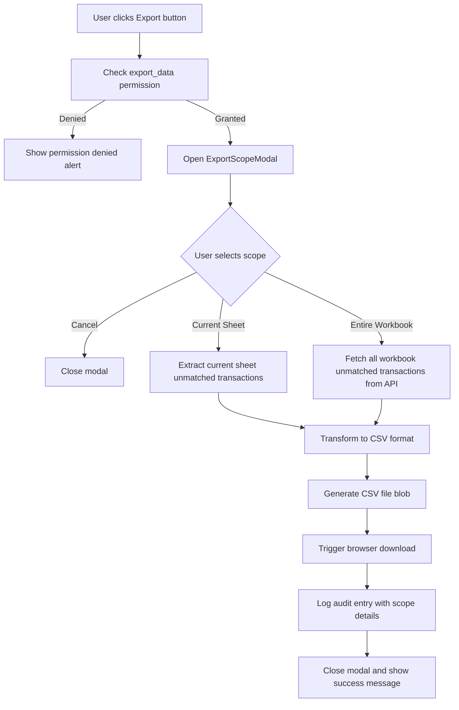
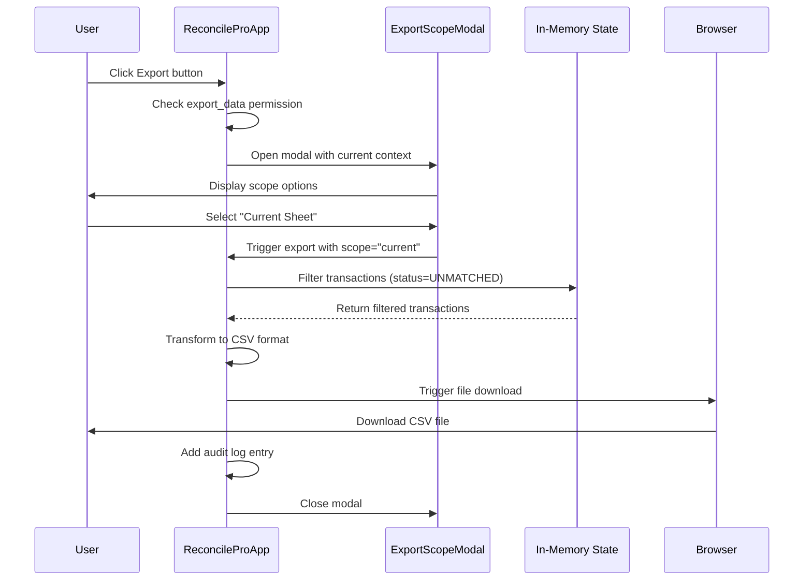
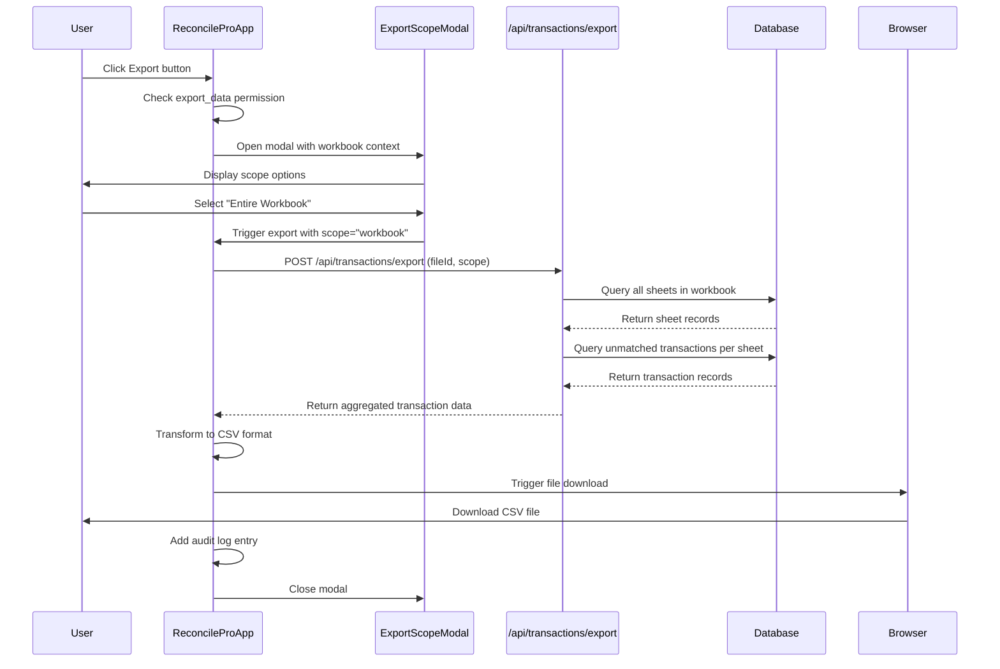

# Export Scope Selection Feature

## Overview

Enhance the export functionality to provide users with flexible scope selection when exporting unmatched transaction data. Users will be able to choose between exporting unmatched items from the currently active sheet only, or from all sheets across the entire workbook. The export will include all original Excel columns and metadata fields to maintain complete data fidelity.

## Business Context

### Current Behavior

The export button currently has a placeholder implementation that only logs an audit entry without generating actual export data. Users cannot export transaction data, and there is no option to control the scope of the export.

### Desired Behavior

When users click the export button, a modal dialog will appear presenting two distinct export scope options:

1. **Current Sheet Only** - Export unmatched transactions from the currently selected sheet
2. **Entire Workbook** - Export unmatched transactions from all sheets in the selected workbook

The exported file will contain all original Excel columns and transaction metadata, ensuring that users have access to the complete dataset for external analysis or reporting purposes.

## User Goals

- Export unmatched transaction data for external analysis, reporting, or archiving
- Control the scope of exported data based on specific needs
- Maintain data completeness by including all original Excel columns and metadata
- Generate exports quickly without manual filtering or data manipulation

## Functional Requirements

### Export Scope Selection

#### Trigger Mechanism

The export functionality is initiated when the user clicks the Download button in the toolbar, which currently invokes the `handleExport` function at line 698 of ReconcileProApp.tsx.

#### Scope Options Modal

When the export button is clicked, display a modal dialog with the following structure:

**Modal Title**: "Export Unmatched Transactions"

**Scope Selection Options**:

1. **Active Sheet Export**

   - Label: "Current Sheet Only"
   - Description: "Export unmatched transactions from [Sheet Name]"
   - Information Display: Show sheet name and count of unmatched transactions
   - Selection Method: Radio button or highlighted card

2. **Workbook-Wide Export**
   - Label: "Entire Workbook"
   - Description: "Export unmatched transactions from all sheets in [Workbook Name]"
   - Information Display: Show workbook filename, total number of sheets, and total count of unmatched transactions across all sheets
   - Selection Method: Radio button or highlighted card

**Action Buttons**:

- "Cancel" - Close modal without exporting
- "Export" - Proceed with export using selected scope

#### Validation Rules

- Export button in toolbar should remain disabled when no sheet is selected
- Export button should be enabled when at least one sheet is loaded
- The modal should default to "Current Sheet Only" scope
- If no unmatched transactions exist in the selected scope, display a warning message before allowing export

### Data Extraction Logic

#### Current Sheet Scope

Extract unmatched transactions from the currently loaded transaction state where:

- Transaction status equals `TransactionStatus.Unmatched`
- Transactions belong to the currently selected sheet context

The current sheet context is managed through:

- `selectedSheetId` state variable
- `selectedFileId` state variable
- `transactions` state array (contains loaded transactions for current sheet)

#### Entire Workbook Scope

Retrieve unmatched transactions from all sheets within the selected workbook:

- Query the database using the `selectedFileId`
- Fetch all SheetImport records associated with the FileImport
- For each sheet, retrieve transactions with status = "UNMATCHED"
- Aggregate transactions from all sheets

This requires a new API endpoint or extending the existing `/api/transactions/sheets` endpoint to support workbook-level queries.

### Data Export Format

#### Column Inclusion

The export file must include all original Excel import columns and metadata fields:

**Original Excel Columns** (from import specification):

- SN - Serial Number
- DATE - Transaction date
- DESCRIPTION - Transaction description
- AMOUNT - Transaction amount
- GLRefNo - General Ledger reference number
- AGING - Aging in days
- RECON - Reconciliation type (INT CR, INT DR, EXT DR, EXT CR)

**Application Metadata Fields**:

- id - Internal transaction identifier
- side - Transaction side (LEFT/RIGHT)
- status - Transaction status (should be UNMATCHED for exports)
- type - Lowercase reconciliation type
- reference - Mapped reference field (fallback from glRefNo or sn)

**Sheet Metadata Fields**:
Include all metadata fields extracted from the Excel sheet during import (typically found in cells A1:D10 of each sheet):

- DEPT - Department code or name
- BRANCH - Branch identifier
- ACCOUNT - Account number or identifier
- CURRENCY - Currency code
- REPORTING DATE - Reporting period date
- Any other key-value pairs found in the metadata extraction area

**Contextual Fields**:

- Sheet Name - Name of the sheet containing the transaction
- File Name - Source workbook filename
- Export Date - Timestamp when export was generated

#### File Format

Export as CSV (Comma-Separated Values) format with the following characteristics:

- UTF-8 encoding to support special characters
- Column headers in the first row
- Quoted string values to handle commas and special characters
- Standard CSV escaping rules

#### File Naming Convention

Generated filename should follow this pattern:

- **Current Sheet**: `[FileName]_[SheetName]_Unmatched_[YYYYMMDD_HHMMSS].csv`
- **Entire Workbook**: `[FileName]_AllSheets_Unmatched_[YYYYMMDD_HHMMSS].csv`

Where:

- `[FileName]` is the original workbook filename (without extension)
- `[SheetName]` is the current sheet name
- `[YYYYMMDD_HHMMSS]` is the export timestamp

#### Browser Download

Trigger browser download using client-side CSV generation:

- Create CSV content from transaction data
- Generate Blob object with CSV MIME type
- Create temporary download link
- Trigger download programmatically
- Clean up temporary resources

### Permission Control

The export functionality is protected by the `export_data` permission. The current implementation already validates this at line 699:

```
if (!hasPermission(currentUser.role, 'export_data')) {
  alert("Permission Denied.");
  return;
}
```

This validation should remain in place for the enhanced export functionality.

### Audit Logging

Record export actions in the audit log with enhanced details:

- Action Type: "Export"
- Scope: "Current Sheet" or "Entire Workbook"
- Sheet Name (if current sheet scope)
- File Name
- Transaction Count: Number of unmatched transactions exported
- Export Timestamp

## Technical Architecture

### State Management

The existing state variables provide context for export operations:

**Selection Context**:

- `selectedFileId` - Currently selected workbook
- `selectedSheetId` - Currently selected sheet
- `importedFiles` - Array of imported workbook metadata
- `availableSheets` - Sheets available in selected workbook

**Transaction Data**:

- `transactions` - In-memory transaction array for current sheet
- Database - Persistent storage of all transactions across all sheets

### Component Structure

#### Export Scope Modal Component

A new modal component to handle scope selection:

**Component Name**: ExportScopeModal

**Props**:

- isOpen (boolean) - Modal visibility state
- onClose (function) - Close handler
- onExport (function) - Export handler with scope parameter
- currentSheetName (string) - Name of active sheet
- currentSheetUnmatchedCount (number) - Count of unmatched in current sheet
- workbookName (string) - Name of selected workbook
- totalSheetsCount (number) - Number of sheets in workbook
- totalWorkbookUnmatchedCount (number) - Total unmatched across workbook

**State**:

- selectedScope (string) - "current" or "workbook"

**Behavior**:

- Display two selectable cards or radio options
- Show transaction counts for each scope
- Handle user selection
- Invoke export callback with selected scope
- Close on cancel or successful export

#### Modified Export Handler

Update the existing `handleExport` function to:

1. Open the ExportScopeModal instead of immediately exporting
2. Pass necessary context data to modal
3. Receive callback when user confirms export with scope selection

#### Export Execution Function

Create a new function to handle actual export based on scope:

**Function Name**: executeExport

**Parameters**:

- scope (string) - "current" or "workbook"

**Logic Flow**:



### Data Flow

#### Current Sheet Export Flow



#### Entire Workbook Export Flow



### API Design

#### New Export Endpoint

Create a new API endpoint for workbook-wide data retrieval:

**Endpoint**: `/api/transactions/export`

**Method**: POST

**Request Body**:

```
{
  "fileId": string,
  "scope": "current" | "workbook",
  "sheetId": string (optional, required if scope="current")
}
```

**Response**:

```
{
  "success": boolean,
  "data": {
    "transactions": Array<Transaction>,
    "metadata": {
      "fileName": string,
      "sheetName": string (if scope="current"),
      "totalSheets": number (if scope="workbook"),
      "exportedCount": number,
      "exportDate": string
    }
  },
  "error": string (if success=false)
}
```

**Database Query Logic**:

For current sheet scope:

- Query Transaction table where sheetImportId equals provided sheetId and status equals "UNMATCHED"

For workbook scope:

- Query FileImport by fileId to get associated SheetImport records
- For each SheetImport, query Transaction records where status equals "UNMATCHED"
- Aggregate results with sheet context

**Authorization**:

- Verify user has `export_data` permission
- Validate user session and authentication

### CSV Generation

#### Transformation Logic

Convert transaction data to CSV format with complete field mapping:

**Field Mapping Table**:

| CSV Column Header | Data Source                     | Fallback                    |
| ----------------- | ------------------------------- | --------------------------- |
| Serial Number     | transaction.sn                  | Empty string                |
| Date              | transaction.date                | -                           |
| Description       | transaction.description         | -                           |
| Amount            | transaction.amount              | -                           |
| GL Reference      | transaction.glRefNo             | transaction.reference       |
| Aging (Days)      | transaction.aging               | Empty string                |
| Recon Type        | transaction.recon               | transaction.type            |
| Sheet Name        | sheetMetadata.name              | -                           |
| File Name         | fileMetadata.filename           | -                           |
| Transaction ID    | transaction.id                  | -                           |
| Side              | transaction.side                | -                           |
| Department        | sheetMetadata.DEPT              | Empty string                |
| Branch            | sheetMetadata.BRANCH            | Empty string                |
| Account           | sheetMetadata.ACCOUNT           | Empty string                |
| Currency          | sheetMetadata.CURRENCY          | Empty string                |
| Reporting Date    | sheetMetadata['REPORTING DATE'] | sheetMetadata.reportingDate |
| Export Date       | new Date().toISOString()        | -                           |

#### CSV Formatting Rules

- Escape double quotes by doubling them
- Enclose fields containing commas, newlines, or quotes in double quotes
- Use UTF-8 encoding
- Use Windows-style line endings (CRLF) for maximum compatibility
- Include column headers as first row

#### Client-Side Generation

Implement CSV generation in browser to avoid server load:

**Process**:

1. Create array of objects from transaction data
2. Map each transaction to CSV row with all required fields
3. Generate header row from field names
4. Convert rows to CSV string format
5. Create Blob with CSV MIME type
6. Create temporary anchor element with download attribute
7. Trigger click event to download
8. Revoke object URL to free memory

**Libraries**: Consider using a lightweight CSV library like `papaparse` or implement custom CSV builder

## Error Handling

### Validation Errors

**No Sheet Selected**:

- Condition: Export button clicked when selectedSheetId is empty
- Response: Keep export button disabled in toolbar
- User Feedback: Button appears disabled (existing behavior)

**No Unmatched Transactions**:

- Condition: Selected scope contains zero unmatched transactions
- Response: Show warning dialog in modal
- User Feedback: "No unmatched transactions found in selected scope. Export will generate an empty file."
- Allow User: Option to proceed or cancel

### API Errors

**Database Query Failure**:

- Condition: Database connection error or query timeout
- Response: Return error response from API
- User Feedback: Alert dialog - "Failed to retrieve transaction data. Please try again."
- Logging: Log error details server-side for debugging

**Network Failure**:

- Condition: API request fails or times out
- Response: Catch network error in client
- User Feedback: Alert dialog - "Network error occurred. Please check your connection and try again."

### Permission Errors

**Insufficient Permissions**:

- Condition: User lacks export_data permission
- Response: Show permission denied alert (existing behavior at line 700)
- User Feedback: "Permission Denied."
- Audit: Do not log denied export attempts

### File Generation Errors

**CSV Generation Failure**:

- Condition: Error during data transformation or CSV formatting
- Response: Catch error in export execution
- User Feedback: Alert dialog - "Failed to generate export file. Please contact support."
- Logging: Log error to browser console for debugging

**Download Failure**:

- Condition: Browser blocks download or quota exceeded
- Response: Browser's native download error handling
- User Feedback: Browser native message
- Alternative: Provide fallback download link or copy-to-clipboard option

## User Experience

### Export Button Visibility

The export button remains in the toolbar next to other action buttons. Current location at line 955 is appropriate.

**Visual States**:

- Disabled (gray, no hover) - When no sheet selected or no export_data permission
- Enabled (blue icon, hover effect) - When sheet is loaded and user has permission
- Active (darker blue) - When modal is open

### Modal Interaction

**Opening Animation**:

- Fade-in overlay with backdrop blur
- Slide-in or scale animation for modal content
- Focus trap within modal for accessibility

**Scope Selection**:

- Visual cards with clear labeling and icons
- Highlighted border or background on selection
- Display transaction counts prominently
- Show sheet/workbook names for context

**Confirmation**:

- Clear "Export" button with icon
- Show scope selection in button text (e.g., "Export Current Sheet")
- Disable export button until scope is selected

**Closing**:

- Fade-out animation
- Return focus to export button in toolbar
- Clear modal state

### Export Progress Feedback

**Workbook Export (may take longer)**:

- Show loading spinner in modal during API call
- Disable export button while processing
- Display progress message: "Fetching transactions and metadata..."
- On completion: Brief success message before modal closes

**Current Sheet Export (fast)**:

- Immediate processing without loading state
- Success feedback via audit log or toast notification

### Success Notification

**Options**:

1. Toast notification (preferred) - "Exported [count] unmatched transactions from [scope]"
2. Brief modal message before auto-close
3. Audit log entry (always recorded)

### Accessibility

**Keyboard Navigation**:

- Modal opens with focus on first scope option
- Tab navigation through scope options and buttons
- Enter key to select and confirm
- Escape key to close modal

**Screen Reader Support**:

- Announce modal title and description
- Label scope options clearly
- Announce selection changes
- Confirm export action with scope details

**Visual Indicators**:

- High contrast for selection states
- Clear focus indicators
- Sufficient color contrast for text

## Data Integrity

### Preservation of Original Data

All original Excel column values must be exported exactly as imported:

- SN field (even if empty or null)
- DATE in original format (YYYY-MM-DD string)
- DESCRIPTION with special characters preserved
- AMOUNT with full decimal precision
- GLRefNo with original formatting
- AGING as integer value
- RECON with original case and spacing

### Metadata Completeness

Include all metadata fields that were captured during import:

- Transaction type derived from RECON column
- Side assignment (LEFT for GL, RIGHT for Statement)
- Internal transaction identifiers
- Sheet and file context information
- All sheet metadata key-value pairs extracted from the metadata area (cells A1:D10)

**Sheet Metadata Extraction**:
The metadata object stored during import contains key-value pairs found in the top section of each Excel sheet. Common fields include:

- DEPT (Department)
- BRANCH (Branch code)
- ACCOUNT (Account number)
- CURRENCY (Currency code)
- REPORTING DATE (Reporting period)
- Additional custom fields specific to each workbook

All metadata fields should be included as separate columns in the export, with column headers matching the metadata keys. If a metadata field is not present for a particular sheet, the corresponding cell should be empty.

**Metadata Column Placement**:
Sheet metadata columns should be placed after the contextual fields and before the transaction-specific fields, providing clear context about the source sheet for each transaction record.

### Character Encoding

Use UTF-8 encoding to ensure:

- Special characters in descriptions are preserved
- International currency symbols render correctly
- Accented characters display properly
- Emoji or extended Unicode characters are supported

### Numeric Precision

Maintain full precision for amount fields:

- Export amount values with all decimal places
- Do not round or truncate amounts
- Preserve negative values for DR transactions
- Use standard decimal notation (not scientific notation)

## Performance Considerations

### Current Sheet Export

Expected to be fast since data is already in memory:

- No API calls required
- Transform up to several thousand transactions
- CSV generation completes in under 1 second

**Optimization**:

- Filter transactions efficiently using array methods
- Build CSV string incrementally
- Avoid unnecessary data copies

### Workbook Export

May involve larger datasets and API overhead:

- API call to fetch data from database
- Potential for tens of thousands of transactions
- Network latency and database query time

**Optimization Strategies**:

- Index database queries on fileId and status fields
- Stream data if dataset is very large (future enhancement)
- Cache workbook metadata to reduce query overhead
- Set reasonable timeout limits (e.g., 30 seconds)

**User Expectations**:

- Show loading indicator for queries over 1 second
- Allow cancellation of long-running exports (future enhancement)

### Browser Resource Management

**Memory Management**:

- Generate CSV in chunks if dataset exceeds browser limits
- Revoke Blob URLs after download to free memory
- Limit export size to prevent browser crashes (e.g., max 100,000 rows)

**Download Handling**:

- Use browser's native download mechanism
- Clean up temporary DOM elements
- Handle browser download restrictions gracefully

## Testing Scenarios

### Functional Testing

**Current Sheet Export**:

1. Load a sheet with unmatched transactions
2. Click export button
3. Select "Current Sheet Only" scope
4. Verify exported file contains only current sheet transactions
5. Verify all columns are present
6. Verify file naming convention
7. Verify audit log entry

**Entire Workbook Export**:

1. Load a workbook with multiple sheets
2. Click export button
3. Select "Entire Workbook" scope
4. Verify exported file contains transactions from all sheets
5. Verify sheet context is included in export
6. Verify file naming convention
7. Verify audit log entry

**Empty Export**:

1. Load a sheet with no unmatched transactions
2. Click export button
3. Select either scope
4. Verify warning message appears
5. Verify export generates file with headers only

**Permission Validation**:

1. Log in as user without export_data permission
2. Verify export button is disabled or shows permission denied
3. Log in as user with export_data permission
4. Verify export functionality works

### Data Integrity Testing

**Column Completeness**:

1. Export transactions
2. Open CSV in spreadsheet application
3. Verify all expected columns are present (transaction fields + sheet metadata fields)
4. Verify column headers match specification
5. Compare exported data to database records
6. Verify sheet metadata columns contain correct values from import
7. Verify metadata fields vary correctly across sheets in workbook export

**Special Characters**:

1. Create transactions with special characters in descriptions
2. Export transactions
3. Verify special characters are properly escaped
4. Verify CSV parsing works correctly

**Numeric Precision**:

1. Export transactions with decimal amounts
2. Verify amounts maintain precision
3. Verify negative amounts for DR transactions

### Edge Cases

**Large Datasets**:

1. Export workbook with 10,000+ transactions
2. Verify export completes without timeout
3. Verify file is generated correctly
4. Monitor browser memory usage

**Network Interruption**:

1. Start workbook export
2. Disconnect network during API call
3. Verify error handling displays appropriate message
4. Verify modal can be closed

**Rapid Clicking**:

1. Click export button multiple times quickly
2. Verify only one modal opens
3. Verify duplicate downloads don't occur

## Future Enhancements

### Advanced Filtering

Allow users to apply filters before export:

- Date range filter
- Amount range filter
- Transaction type filter
- Specific columns to include/exclude

### Multiple Format Support

Expand export formats beyond CSV:

- Excel (XLSX) format with formatting
- JSON format for API integrations
- PDF format for reports

### Scheduled Exports

Automate exports on a schedule:

- Daily/weekly/monthly export jobs
- Email delivery of export files
- Integration with external storage systems

### Export Templates

Allow users to save export configurations:

- Named export templates
- Custom column ordering
- Pre-configured filters
- Reusable scope settings

### Batch Export

Export multiple sheets individually:

- Select specific sheets from workbook
- Generate separate file per sheet
- Zip multiple files together

### Export History

Track previous exports:

- List of recent exports
- Re-download previous exports
- Compare export snapshots over time
