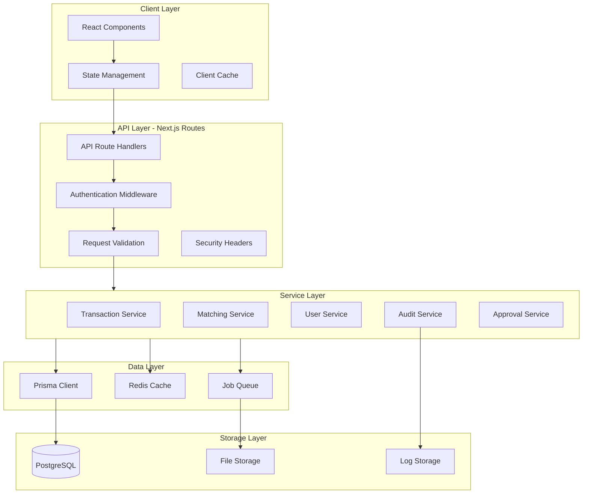
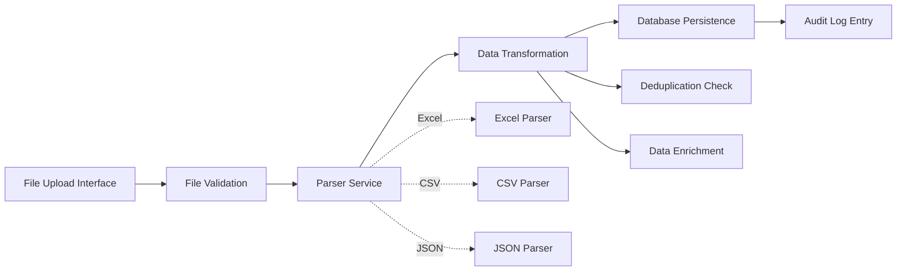
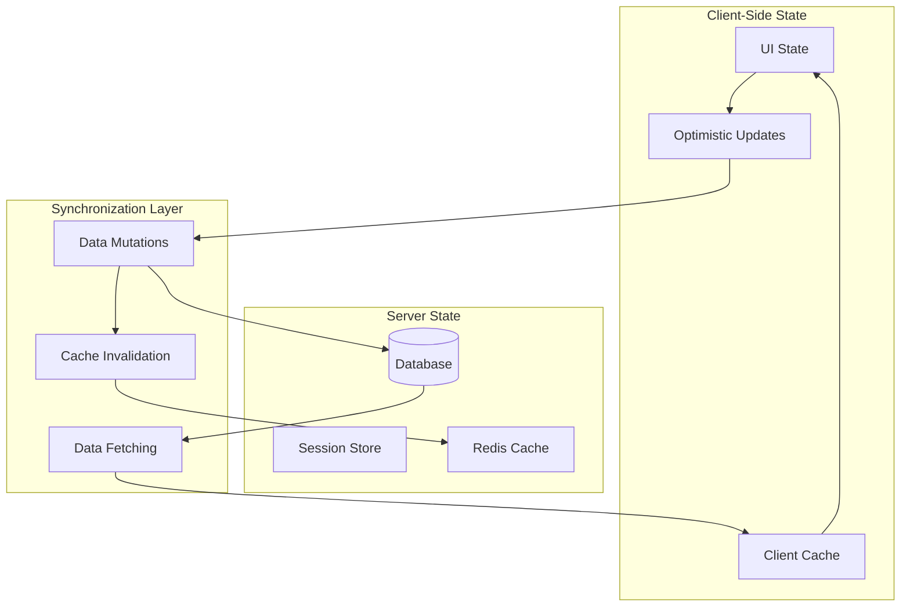
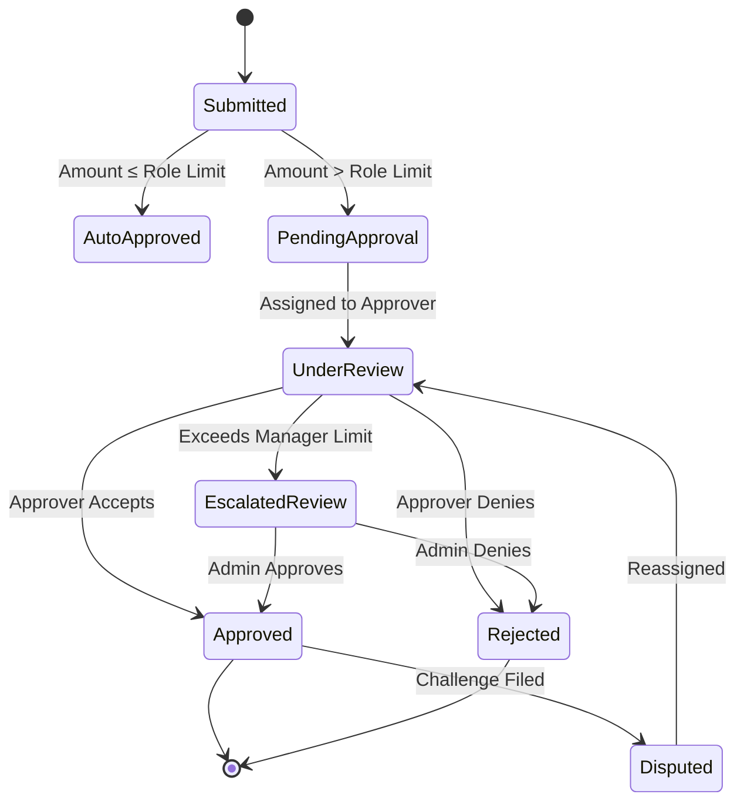
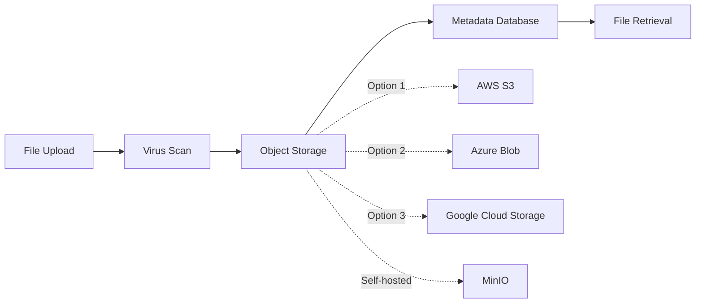
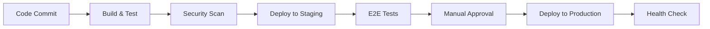

# Full-Stack Development Plan: Analyzer Web

## Project Overview

### Current State Analysis

Analyzer Web is a professional manual transaction matching and reconciliation system designed for financial operations teams. The application enables users to:

- Load transaction sets from two different sources (internal ledger and bank statements) based on selected dates
- Perform one-to-one, one-to-many, and many-to-many transaction matching across ledgers
- Track discrepancies and manage adjustment approvals
- Maintain comprehensive audit trails with role-based access control
- Manage financial period closures and enforce data immutability for closed periods

### Technology Stack Assessment

**Current Frontend Stack:**

- Next.js 14.1.0 (React 18.2.0) with App Router architecture
- TypeScript for type safety
- Tailwind CSS with custom styling
- Lucide React for iconography
- Recharts for data visualization
- NextAuth.js 4.24.6 for authentication

**Current Backend Stack:**

- Next.js API routes for serverless backend
- Prisma ORM 5.10.0 for database abstraction
- bcryptjs for password hashing
- Sqlite (inferred from Prisma usage)

**Current Architecture Pattern:**

- Monolithic Next.js application with client-side state management
- Local storage persistence for application state
- Mock data service for transaction generation
- JWT-based session management
- In-memory rate limiting for login attempts

### Core Business Capabilities

1. **Transaction Management**: Import, display, filter, and categorize financial transactions from dual sources
2. **Reconciliation Workflow**: Manual matching with support for complex scenarios including split transactions
3. **Approval Workflow**: Dynamic approval requirements based on adjustment amounts and user roles
4. **Access Control**: Four-tier role system (Admin, Manager, Analyst, Auditor) with granular permissions
5. **Audit & Compliance**: Complete audit trail, separation of duties enforcement, and financial period locking
6. **Session Management**: Idle timeout tracking and multi-device session awareness
7. **Snapshot & Versioning**: Point-in-time state preservation with restoration capabilities

---

## Strategic Recommendations for Full-Stack Development

### Architecture Transformation

#### Transition from Monolithic to Layered Architecture

**Objective**: Maintain Next.js as the primary framework while introducing clear separation between presentation, business logic, and data layers.

**Recommended Structure:**

**Implementation Approach:**

The application should retain its Next.js foundation but introduce a service-oriented internal structure. Create a dedicated services directory housing business logic modules that interact with Prisma for data operations. API routes should become thin orchestration layers that validate inputs, invoke services, and format responses. This maintains deployment simplicity while improving testability and maintainability.

---

### Database Schema Enhancement

#### Current Database Gaps

The existing Prisma schema appears incomplete or corrupted (binary content detected). A comprehensive schema must be established to support all application features.

**Recommended Database Schema:**

| Entity          | Purpose                                           | Key Relationships                                                                                                                      |
| --------------- | ------------------------------------------------- | -------------------------------------------------------------------------------------------------------------------------------------- |
| User            | Store user credentials, roles, and status         | One-to-many with Transaction (importedBy), MatchGroup (matchByUserId), AuditLog (userId), RoleRequest (userId), DeviceSession (userId) |
| Transaction     | Store individual financial transaction records    | Many-to-one with MatchGroup via matchId, Many-to-one with User via importedBy                                                          |
| MatchGroup      | Store reconciliation matches between transactions | One-to-many with Transaction, Many-to-one with User (creator and approver)                                                             |
| AuditLog        | Immutable audit trail for all system actions      | Many-to-one with User                                                                                                                  |
| SystemSnapshot  | Point-in-time state captures for versioning       | Many-to-one with User (creator), JSON storage for transactions and matches                                                             |
| RoleRequest     | Track user role upgrade requests                  | Many-to-one with User                                                                                                                  |
| DeviceSession   | Track active user sessions across devices         | Many-to-one with User                                                                                                                  |
| FinancialPeriod | Define and manage period closing status           | Standalone with date range constraints                                                                                                 |
| FileImport      | Track import operations and file metadata         | Many-to-one with User, Many-to-many with Transaction                                                                                   |

**Critical Data Model Attributes:**

**Transaction Entity Structure:**

- Unique identifier, import timestamp, transaction date
- Description, amount, reference number
- Side indicator (LEFT for internal ledger, RIGHT for bank statement)
- Status (UNMATCHED, MATCHED, DISPUTED, ARCHIVED)
- Foreign key to MatchGroup when matched
- Foreign key to importing User for separation of duties
- Soft delete flag and archived timestamp

**MatchGroup Entity Structure:**

- Unique identifier, creation timestamp
- JSON array of left transaction IDs
- JSON array of right transaction IDs
- Calculated totals for each side
- Difference amount and adjustment flag
- Optional comment field
- Status (APPROVED, PENDING_APPROVAL, REJECTED)
- Foreign key to matching User and approving User
- Approval timestamp when status changes

**Data Integrity Rules:**

- Transactions in closed financial periods must be immutable (enforced via database triggers or application-level checks)
- MatchGroup deletions must cascade to update related Transaction statuses
- AuditLog entries must be append-only with no update or delete operations
- User status changes to inactive or locked must preserve historical data integrity

---

### Real Data Integration Strategy

#### Replace Mock Data Service with Production-Ready Import System

**Current Limitation**: The application generates synthetic transaction data through a mock service that simulates reading Excel files.

**Recommended Data Source Integration:**

**File Upload Mechanism:**

Implement a dedicated file upload API endpoint that accepts multipart form data containing transaction files. Support multiple formats including Excel (XLSX, XLS), CSV, and JSON. Implement server-side validation for file size limits, format verification, and schema compliance before processing.

**Parser Implementation Strategy:**

Create format-specific parsers using appropriate libraries:

- Excel files: Use SheetJS or ExcelJS for parsing workbook data
- CSV files: Use PapaParse or native Node.js CSV parsing
- JSON files: Direct parsing with schema validation

Each parser should extract transactions and map them to the standardized Transaction schema, applying necessary transformations for date formats, decimal precision, and text encoding.

**Data Validation Pipeline:**

Establish multi-stage validation:

1. File format and structure validation
2. Schema validation (required fields, data types, constraints)
3. Business rule validation (date ranges, amount limits, duplicate detection)
4. Referential integrity checks (valid user references, period status)

**Deduplication Strategy:**

Implement hash-based deduplication using a combination of transaction date, description, amount, and reference number. Store hash values in the database to enable efficient duplicate detection across import batches. Provide UI feedback when duplicates are detected, allowing users to review and confirm before importing.

**Import Audit Trail:**

Create a FileImport entity that tracks:

- Original filename and format
- Import timestamp and importing user
- Number of records processed, accepted, rejected
- Error details for failed validations
- Link to imported Transaction records for traceability

---

### State Management Architecture

#### Transition from Local Storage to Server-Authoritative State

**Current Limitation**: The application uses localStorage as the primary persistence mechanism with a complex client-side state management system. This creates synchronization challenges, scalability issues, and potential data loss scenarios.

**Recommended State Management Architecture:**

**State Layer Separation:**

Distinguish between three state categories:

1. **Server State**: Authoritative data stored in PostgreSQL including transactions, matches, users, and audit logs
2. **Session State**: User-specific temporary data stored in Redis including selected date, active filters, and workspace selections
3. **UI State**: Ephemeral client-side data including modal visibility, form inputs, and loading indicators

**Data Fetching Strategy:**

Implement React Query or SWR for server state management:

- Automatic background refetching to maintain data freshness
- Request deduplication to minimize server load
- Optimistic updates for perceived performance
- Built-in retry logic and error handling
- Pagination and infinite loading support

**Mutation Handling:**

Establish a consistent pattern for data modifications:

1. Client dispatches mutation with optimistic UI update
2. API endpoint validates request and applies business rules
3. Service layer executes database transaction
4. Audit log entry created automatically
5. Response triggers cache invalidation
6. Client updates UI with authoritative server response

**Real-Time Synchronization Considerations:**

For multi-user scenarios where concurrent modifications occur, implement:

- Optimistic locking using version numbers or timestamps
- Conflict detection and resolution UI
- WebSocket or Server-Sent Events for real-time notifications of changes made by other users

---

### Authentication & Session Management Enhancement

#### Production-Grade Security Implementation

**Current Implementation**: NextAuth.js with credential provider, JWT sessions, and basic in-memory rate limiting.

**Recommended Security Enhancements:**

**Multi-Factor Authentication Support:**

Introduce optional MFA for privileged roles (Manager, Admin) using time-based one-time passwords (TOTP). Implement QR code generation for authenticator app enrollment. Store encrypted MFA secrets in the User table with a backup code generation mechanism.

**Session Management Improvements:**

Replace in-memory session tracking with Redis-backed session storage. Track active sessions per user including:

- Device fingerprint and user agent
- IP address and geolocation
- Login timestamp and last activity timestamp
- Session token with automatic rotation

Implement session revocation capabilities allowing users to terminate sessions from other devices through the security dashboard.

**Rate Limiting & Brute Force Protection:**

Migrate from in-memory rate limiting to distributed rate limiting using Redis. Implement progressive delays:

- First failed attempt: No delay
- 3 failed attempts: 5-second delay
- 5 failed attempts: 15-minute account lockout
- Persistent lockout after multiple lockout cycles

**Password Policy Enforcement:**

Establish password complexity requirements:

- Minimum 12 characters
- Mix of uppercase, lowercase, numbers, and special characters
- Prohibited common passwords (implement against a dictionary)
- Password expiration policy (90 days for privileged accounts)
- Password history to prevent reuse of last 5 passwords

**API Security Hardening:**

Enhance the existing security middleware with:

- CSRF token validation for state-changing operations
- Request signing for sensitive API endpoints
- IP whitelisting capabilities for admin operations
- Comprehensive security header implementation (already partially present)

---

### Approval Workflow Engine

#### Formalize and Extend Dynamic Approval System

**Current Implementation**: Basic role-based adjustment limits with automatic approval threshold determination.

**Recommended Workflow Enhancement:**

**Workflow Configuration Table:**

| Adjustment Amount Range | Required Approver Role  | Auto-Escalation Rule                       | Notification Trigger                |
| ----------------------- | ----------------------- | ------------------------------------------ | ----------------------------------- |
| $0.00 - $10.00          | Analyst (self-approve)  | None                                       | None                                |
| $10.01 - $500.00        | Manager                 | If submitter is Manager, escalate to Admin | Email + In-app notification         |
| $500.01 - $5,000.00     | Manager (dual approval) | Requires two Manager approvals             | Email + SMS notification            |
| > $5,000.00             | Admin                   | Mandatory review period of 24 hours        | Email + SMS + Admin dashboard alert |

**Separation of Duties Enforcement:**

Extend the current importedBy tracking to implement comprehensive SoD controls:

- Transaction importer cannot approve their own matches
- Approvers cannot modify transactions they imported
- Dual approval requirement enforces approvals from two distinct users
- Admin override capability with mandatory justification comment

**Approval Delegation:**

Introduce temporary delegation capabilities where Managers can designate alternate approvers during absence periods. Store delegation records with start date, end date, delegator, and delegate user IDs.

**Escalation and Notification System:**

Implement automated escalation when approval requests remain pending beyond defined thresholds:

- 24 hours: Reminder notification to assigned approver
- 48 hours: Escalation notification to approver's manager
- 72 hours: Admin notification with workflow blockage alert

---

### Audit and Compliance Framework

#### Comprehensive Activity Logging and Forensic Capabilities

**Current Implementation**: Basic audit log with timestamp, action, details, and user information stored in application state.

**Recommended Audit System Enhancement:**

**Structured Audit Event Schema:**

| Attribute          | Description                                                                         | Data Type   |
| ------------------ | ----------------------------------------------------------------------------------- | ----------- |
| Event ID           | Unique identifier                                                                   | UUID        |
| Timestamp          | Event occurrence time with microsecond precision                                    | Timestamp   |
| User ID            | Authenticated user performing action                                                | Foreign Key |
| Session ID         | Active session identifier                                                           | String      |
| IP Address         | Source IP address                                                                   | String      |
| Action Type        | Categorized action (CREATE, UPDATE, DELETE, APPROVE, IMPORT, EXPORT, LOGIN, LOGOUT) | Enum        |
| Entity Type        | Affected entity (TRANSACTION, MATCH, USER, ROLE, PERIOD)                            | Enum        |
| Entity ID          | Specific record identifier                                                          | String      |
| Before State       | JSON snapshot of data before modification                                           | JSON        |
| After State        | JSON snapshot of data after modification                                            | JSON        |
| Change Summary     | Human-readable change description                                                   | Text        |
| Justification      | User-provided reason for change                                                     | Text        |
| Device Fingerprint | Device identification hash                                                          | String      |
| Geolocation        | Approximate geographic location                                                     | String      |

**Immutable Log Storage:**

Audit logs must be append-only with cryptographic chain verification. Implement sequential log entry hashing where each entry contains a hash of the previous entry, creating a tamper-evident log chain.

**Retention and Archival:**

Establish tiered retention policies:

- Active logs (0-90 days): Stored in primary PostgreSQL database for fast querying
- Recent archive (91 days - 7 years): Compressed and stored in cost-effective object storage
- Regulatory archive (7+ years): Long-term archival storage with periodic integrity verification

**Audit Query and Reporting Interface:**

Provide advanced audit log search capabilities:

- Full-text search across all audit fields
- Time range filtering with preset options
- User and action type filtering
- Entity-specific audit trail reconstruction
- Export to CSV, PDF, or structured JSON formats
- Scheduled audit reports delivered via email

**Compliance Reporting Templates:**

Pre-built report templates for common compliance scenarios:

- User activity summary for specified date range
- High-value transaction approval audit
- Failed login attempt analysis
- Data modification audit for specific entities
- Separation of duties compliance verification

---

### File Storage and Document Management

#### Implement Robust File Handling Infrastructure

**Current Gap**: No production file storage mechanism exists. The application relies on mock data generation rather than real file imports.

**Recommended File Storage Architecture:**

**Storage Provider Recommendations:**

For cloud deployments, use AWS S3, Azure Blob Storage, or Google Cloud Storage depending on existing infrastructure. For on-premises or hybrid deployments, implement MinIO as a self-hosted S3-compatible object storage solution.

**File Upload Processing Pipeline:**

1. Client uploads file via multipart form data to API endpoint
2. Server receives file and stores in temporary location
3. Antivirus scan executed on uploaded file
4. File validated against size limits and format requirements
5. File uploaded to object storage with generated unique identifier
6. Metadata record created in database linking to storage location
7. Background job initiated for file parsing and data extraction
8. Temporary file deleted after successful upload
9. User notified of upload completion and processing status

**File Metadata Tracking:**

Store comprehensive metadata for each uploaded file:

- Original filename and detected MIME type
- File size and checksum (SHA-256)
- Upload timestamp and uploading user
- Processing status (PENDING, PROCESSING, COMPLETED, FAILED)
- Storage location reference (bucket name and object key)
- Retention expiration date based on policy
- Associated import batch identifier

**File Retention Policy:**

Implement lifecycle management for uploaded files:

- Active files (0-30 days): Hot storage tier for immediate access
- Recent files (31-90 days): Standard storage tier
- Archived files (91-365 days): Infrequent access storage tier
- Long-term archive (1+ years): Glacier or equivalent deep archive tier
- Automatic deletion after retention period expires (configurable per file type)

**File Access Control:**

Enforce authorization checks when retrieving uploaded files:

- Generate time-limited signed URLs for file downloads
- Validate user permissions before granting access
- Log all file access events to audit trail
- Prevent direct public access to stored files

---

### Real-Time Collaboration Features

#### Enable Multi-User Concurrent Operations

**Current Limitation**: Single-user experience with no awareness of concurrent user activity.

**Recommended Collaboration Enhancements:**

**Presence Awareness:**

Display active users currently working on the same date or viewing the same workspace. Show user avatars with real-time indicators of their current activity (viewing, matching, approving).

**Optimistic Locking for Conflict Prevention:**

Implement row-level versioning where each database record includes a version number or timestamp. When a user attempts to modify a record, the system verifies the version matches the current database state. If another user has modified the record in the interim, the operation fails with a conflict notification requiring user resolution.

**Change Notification System:**

Establish a WebSocket or Server-Sent Events connection for real-time push notifications:

- Match created or modified by another user
- Transaction status changes affecting current workspace
- Approval decisions on pending matches
- Period closure notifications
- System maintenance or scheduled downtime alerts

**Concurrent Editing UI Patterns:**

When conflicts occur, present users with a three-way merge interface:

- Current database state (the authoritative version)
- User's local changes (their intended modifications)
- Conflict resolution options (accept server version, force local version, manual merge)

**Activity Feed:**

Implement a global activity feed visible to privileged users showing recent system-wide events:

- Recent matches created
- High-value approvals completed
- User logins and role changes
- Import operations completed
- Period closures executed

---

### Reporting and Analytics Module

#### Business Intelligence and Operational Insights

**Current Gap**: Limited analytical capabilities beyond basic transaction listing and matching statistics.

**Recommended Analytics Features:**

**Dashboard Visualizations:**

Create interactive dashboard components using Recharts or a more advanced library like Recharts with additional plugins:

| Visualization Type         | Purpose                                     | Key Metrics                                                                     |
| -------------------------- | ------------------------------------------- | ------------------------------------------------------------------------------- |
| Reconciliation Trend Chart | Track matching progress over time           | Daily match counts, cumulative matched value, average match time                |
| Discrepancy Analysis       | Identify patterns in unmatched transactions | Top discrepancy categories, recurring unmatched vendors, aging analysis         |
| User Performance Metrics   | Measure analyst productivity                | Matches per user, average approval time, accuracy rate                          |
| Approval Queue Status      | Monitor workflow bottlenecks                | Pending approval count, average queue time, escalation rate                     |
| Period Close Readiness     | Assess completion status before closing     | Unmatched transaction count by category, outstanding approvals, exception items |

**Custom Report Builder:**

Provide a flexible report configuration interface allowing users to:

- Select date ranges for analysis
- Choose aggregation levels (daily, weekly, monthly)
- Filter by transaction side, status, or user
- Define custom groupings and calculations
- Save report templates for recurring use
- Schedule automated report generation and email delivery

**Export Capabilities:**

Extend beyond basic CSV export to include:

- Formatted PDF reports with charts and summary tables
- Excel workbooks with multiple sheets and formatting
- JSON data dumps for API consumers
- Scheduled exports to SFTP or cloud storage locations

**Exception Management Reports:**

Generate specialized reports for compliance and oversight:

- Transactions exceeding specified thresholds without approval
- Matches created and approved by the same user (SoD violations)
- Import batches with high rejection rates
- Dormant accounts or inactive users
- Failed login attempts and security events

---

### Performance Optimization Strategies

#### Scalability and Response Time Improvements

**Database Query Optimization:**

**Indexing Strategy:**

Create composite indexes on frequently queried columns:

- Transaction: (date, side, status) for workspace filtering
- Transaction: (matchId) for relationship lookups
- MatchGroup: (status, timestamp) for approval queue queries
- AuditLog: (timestamp, userId, action) for audit trail searches
- User: (email) for authentication lookups

**Pagination Implementation:**

Replace potential full-table scans with cursor-based pagination for large result sets. Implement keyset pagination using indexed columns for stable and efficient page navigation even when underlying data changes.

**Query Result Caching:**

Implement Redis caching for expensive or frequently accessed queries:

- User permission sets (cache invalidation on role changes)
- Transaction lists for specific dates (invalidate on new imports)
- Approval queue summaries (invalidate on approval decisions)
- Dashboard statistics (time-based expiration every 5 minutes)

**API Response Optimization:**

**Response Compression:**

Enable gzip or Brotli compression for API responses to reduce bandwidth consumption and improve load times for clients with slower connections.

**GraphQL Consideration:**

For complex data fetching scenarios with nested relationships, consider introducing a GraphQL endpoint as an alternative to REST APIs. This allows clients to request precisely the data they need, reducing over-fetching and multiple round trips.

**Client-Side Performance:**

**Code Splitting:**

Leverage Next.js dynamic imports to split the application into smaller chunks:

- Lazy load admin dashboard components only for users with appropriate permissions
- Defer loading of chart libraries until dashboard tab is activated
- Split large transaction lists into virtualized views with windowing

**Asset Optimization:**

- Optimize images and icons for web delivery
- Implement responsive image loading based on viewport size
- Use modern image formats (WebP, AVIF) with fallbacks
- Minimize and tree-shake JavaScript bundles

**Background Job Processing:**

**Job Queue Implementation:**

Introduce a job queue system using Bull or BullMQ with Redis as the backing store for long-running operations:

- File parsing and transaction import
- Large data exports and report generation
- Scheduled period closure operations
- Automated audit log archival

**Job Monitoring Dashboard:**

Provide administrators with visibility into background job execution:

- Active jobs in progress with estimated completion time
- Failed job history with error details
- Job retry status and manual retry triggers
- Performance metrics (average job duration, success rate)

---

### Testing Strategy

#### Comprehensive Quality Assurance Framework

**Unit Testing:**

Establish unit test coverage for business logic layers using Jest and React Testing Library:

- Service layer functions with mocked database interactions
- Utility functions for calculations and validations
- Custom React hooks for state management
- Component rendering and interaction logic

**Target Coverage**: Minimum 80% code coverage for service layer and critical business logic.

**Integration Testing:**

Test API endpoints and database interactions using Supertest or similar HTTP assertion library:

- API route authentication and authorization
- Request validation and error handling
- Database transaction integrity
- File upload and parsing workflows

**End-to-End Testing:**

Implement E2E tests using Playwright or Cypress covering critical user journeys:

- User login and session management
- Transaction import and matching workflow
- Approval request submission and processing
- Admin user management operations
- Period closure execution

**Test Data Management:**

Create seed scripts for generating realistic test data:

- Diverse transaction scenarios (one-to-one, one-to-many, many-to-many matches)
- Edge cases (large amounts, negative values, duplicate references)
- User accounts across all role types
- Historical audit log entries

**Performance Testing:**

Conduct load testing to validate system performance under concurrent user scenarios:

- Simulate multiple users importing transactions simultaneously
- Test database query performance with large datasets (100K+ transactions)
- Measure API response times under load
- Identify memory leaks or resource exhaustion issues

---

### Deployment and Infrastructure

#### Production-Ready Hosting Strategy

**Containerization:**

Package the application as Docker containers for consistent deployment across environments:

| Container   | Purpose                               | Base Image        |
| ----------- | ------------------------------------- | ----------------- |
| Next.js App | Web application and API routes        | Node.js 20 Alpine |
| PostgreSQL  | Primary database                      | PostgreSQL 16     |
| Redis       | Session store and cache               | Redis 7 Alpine    |
| Nginx       | Reverse proxy and static file serving | Nginx Alpine      |

**Orchestration Options:**

**Option 1 - Cloud Platform as a Service:**
Deploy to Vercel (Next.js native platform), AWS Amplify, or Azure App Service for simplified management with automatic scaling and built-in CDN.

**Option 2 - Container Orchestration:**
Deploy to Kubernetes or AWS ECS for greater control over infrastructure, supporting complex multi-service architectures and custom scaling policies.

**Option 3 - Serverless:**
Leverage AWS Lambda or Azure Functions with Next.js serverless deployment, suitable for variable workload patterns with cost optimization benefits.

**Database Hosting:**

Use managed database services for production reliability:

- AWS RDS for PostgreSQL with Multi-AZ deployment for high availability
- Azure Database for PostgreSQL with read replicas for performance
- Self-managed PostgreSQL with streaming replication for on-premises deployments

**Environment Configuration:**

Establish clear separation between environments:

- Development: Local Docker Compose setup with hot-reloading
- Staging: Cloud-hosted environment mirroring production architecture
- Production: High-availability configuration with monitoring and alerting

**Environment Variables Management:**

Use secure secret management:

- AWS Secrets Manager or Azure Key Vault for cloud deployments
- HashiCorp Vault for on-premises or hybrid environments
- Avoid committing secrets to version control
- Implement secret rotation policies for database credentials and API keys

**Continuous Integration and Deployment:**

Establish CI/CD pipeline using GitHub Actions, GitLab CI, or Jenkins:

**Pipeline Stages:**

1. Triggered on commit to main branch
2. Install dependencies and build application
3. Run unit and integration tests
4. Execute static code analysis and security scanning
5. Build Docker images and push to container registry
6. Deploy to staging environment
7. Run E2E test suite against staging
8. Await manual approval for production deployment
9. Deploy to production with blue-green or canary strategy
10. Execute smoke tests and health checks
11. Notify team of deployment status

**Monitoring and Observability:**

Implement comprehensive monitoring stack:

**Application Performance Monitoring:**

- Use Sentry or Datadog for error tracking and performance monitoring
- Track API response times and error rates
- Monitor database query performance
- Set up alerts for performance degradation

**Infrastructure Monitoring:**

- Use Prometheus and Grafana for metrics collection and visualization
- Monitor CPU, memory, and disk usage
- Track container health and restart counts
- Database connection pool metrics

**Logging Strategy:**

- Centralized log aggregation using ELK Stack (Elasticsearch, Logstash, Kibana) or equivalent
- Structured JSON logging for machine parsing
- Log correlation with request IDs
- Retention policy aligned with compliance requirements

**Alerting:**

- Critical alerts for system downtime or database connection failures
- Warning alerts for elevated error rates or slow response times
- Daily summary reports of system health metrics
- On-call rotation integration with PagerDuty or similar

---

### Security Hardening Checklist

#### Production Security Best Practices

**Application Security:**

- [ ] Implement Content Security Policy headers restricting script and resource loading
- [ ] Enable HTTPS-only communication with HSTS headers
- [ ] Validate and sanitize all user inputs to prevent injection attacks
- [ ] Implement CSRF token validation for state-changing operations
- [ ] Use parameterized queries exclusively (Prisma provides this by default)
- [ ] Implement rate limiting on authentication and sensitive API endpoints
- [ ] Enforce strict CORS policies limiting allowed origins
- [ ] Disable verbose error messages in production exposing system details

**Authentication Security:**

- [ ] Store passwords using bcrypt with cost factor ≥ 12
- [ ] Implement account lockout after repeated failed login attempts
- [ ] Enforce strong password complexity requirements
- [ ] Implement session timeout and idle detection
- [ ] Use secure, HTTP-only cookies for session tokens
- [ ] Implement session fixation protection with token rotation
- [ ] Consider MFA for privileged accounts
- [ ] Log all authentication events for audit trail

**Data Protection:**

- [ ] Encrypt sensitive data at rest in database (database-level encryption)
- [ ] Encrypt data in transit using TLS 1.3
- [ ] Implement field-level encryption for highly sensitive data (PII, financial details)
- [ ] Regular automated database backups with encryption
- [ ] Test backup restoration procedures quarterly
- [ ] Implement access controls limiting production database access
- [ ] Mask or redact sensitive data in logs and error messages

**Infrastructure Security:**

- [ ] Regular security patching of operating systems and dependencies
- [ ] Minimize container attack surface using minimal base images
- [ ] Run application processes as non-root users
- [ ] Implement network segmentation isolating database from public internet
- [ ] Use managed services with built-in security features where possible
- [ ] Regular vulnerability scanning of application and infrastructure
- [ ] Penetration testing conducted annually or after major releases

**Compliance Considerations:**

- [ ] Implement GDPR-compliant data handling (if applicable)
- [ ] Provide data export and deletion capabilities for user data
- [ ] Implement SOX compliance controls for financial data reconciliation
- [ ] Maintain audit trail meeting regulatory retention requirements
- [ ] Implement separation of duties controls for financial operations
- [ ] Document data flows and processing activities
- [ ] Regular compliance audits and attestations

---

## Implementation Roadmap

### Phase 1: Foundation (Weeks 1-4)

**Objectives**: Establish core infrastructure and database schema.

**Deliverables:**

- Complete Prisma schema definition for all entities
- Database migration scripts for production deployment
- User authentication with enhanced security controls
- Basic API endpoints for user and transaction management
- Development environment setup with Docker Compose

**Key Tasks:**

1. Design and implement comprehensive database schema
2. Create initial migration and seed data scripts
3. Enhance NextAuth configuration with session persistence
4. Implement API security middleware with permission validation
5. Set up local development environment with hot-reloading

**Success Criteria:**

- All database entities created with proper relationships
- User authentication working with session tracking
- API endpoints secured with role-based access control
- Development environment functional for team use

### Phase 2: Core Features (Weeks 5-10)

**Objectives**: Implement primary reconciliation workflows and data management.

**Deliverables:**

- File upload and parsing system for transaction imports
- Transaction matching engine with one-to-many support
- Approval workflow with dynamic routing
- Audit logging with comprehensive event tracking
- Client-side state management with server synchronization

**Key Tasks:**

1. Implement file upload API with antivirus scanning
2. Create parsers for Excel, CSV, and JSON formats
3. Build transaction matching service with business rule validation
4. Implement approval workflow engine with escalation logic
5. Integrate React Query for server state management
6. Develop audit logging service with structured events

**Success Criteria:**

- Users can upload transaction files and see imported data
- Matching workflow supports complex scenarios (one-to-many, many-to-many)
- Approval requests routed correctly based on amount and role
- All user actions logged to audit trail
- UI reflects server state changes in real-time

### Phase 3: Advanced Capabilities (Weeks 11-14)

**Objectives**: Add collaboration, reporting, and administrative features.

**Deliverables:**

- Real-time collaboration with presence awareness
- Snapshot and version management system
- Financial period locking with immutability enforcement
- Admin dashboard with user and role management
- Basic reporting and export functionality

**Key Tasks:**

1. Implement WebSocket connection for real-time updates
2. Create snapshot service for point-in-time state capture
3. Build period management system with transaction freezing
4. Enhance admin dashboard with comprehensive controls
5. Develop CSV and PDF export functionality

**Success Criteria:**

- Multiple users can work concurrently without conflicts
- Users can create and restore snapshots of workspace state
- Closed periods prevent transaction modifications
- Admins can manage users, roles, and permissions effectively
- Users can export data in multiple formats

### Phase 4: Analytics and Optimization (Weeks 15-18)

**Objectives**: Implement analytics dashboards and performance optimizations.

**Deliverables:**

- Interactive analytics dashboard with visualizations
- Custom report builder interface
- Performance optimizations (caching, indexing, pagination)
- Background job processing for long-running operations
- Scheduled report generation and delivery

**Key Tasks:**

1. Design and implement dashboard visualizations using Recharts
2. Create report builder with flexible filtering and grouping
3. Implement Redis caching for expensive queries
4. Set up Bull queue for background job processing
5. Optimize database queries with appropriate indexes
6. Implement cursor-based pagination for large datasets

**Success Criteria:**

- Dashboard provides actionable insights into reconciliation status
- Users can build and save custom reports
- API response times under 200ms for 95th percentile
- Long-running exports processed in background without blocking UI
- Page load times reduced by 50% compared to baseline

### Phase 5: Production Readiness (Weeks 19-22)

**Objectives**: Finalize security, testing, and deployment infrastructure.

**Deliverables:**

- Comprehensive test suite with >80% coverage
- Security hardening and penetration testing
- CI/CD pipeline with automated deployment
- Production infrastructure with monitoring
- Documentation and training materials

**Key Tasks:**

1. Write unit, integration, and E2E tests
2. Conduct security audit and remediate findings
3. Set up CI/CD pipeline with GitHub Actions
4. Configure production infrastructure on chosen platform
5. Implement monitoring with Sentry and Prometheus
6. Create user documentation and admin guides
7. Conduct user acceptance testing
8. Plan and execute production cutover

**Success Criteria:**

- Test coverage meets 80% threshold for critical code
- Security audit completed with no high-severity findings
- CI/CD pipeline successfully deploys to staging and production
- Production environment monitored with alerting configured
- Documentation complete and reviewed by stakeholders
- Successful production deployment with zero downtime

---

## Technology Stack Summary

### Recommended Technologies by Layer

**Frontend:**

- Next.js 14+ (React 18+) with App Router
- TypeScript for type safety
- Tailwind CSS for styling
- React Query or SWR for server state management
- Recharts for data visualization
- Zod or Yup for client-side validation

**Backend:**

- Next.js API routes for serverless backend
- Prisma ORM for database abstraction
- Express middleware compatibility for advanced routing
- Bull or BullMQ for job queue processing
- Socket.io or native WebSocket for real-time features

**Database and Storage:**

- PostgreSQL 14+ as primary database
- Redis for caching and session storage
- AWS S3 / Azure Blob / MinIO for file storage

**Authentication and Security:**

- NextAuth.js with database session persistence
- bcryptjs for password hashing
- Helmet.js for security headers
- CSRF protection middleware
- Rate limiting with express-rate-limit or upstash-ratelimit

**Testing:**

- Jest for unit and integration testing
- React Testing Library for component testing
- Playwright or Cypress for E2E testing
- Supertest for API testing

**DevOps and Monitoring:**

- Docker for containerization
- Docker Compose for local development
- GitHub Actions or GitLab CI for CI/CD
- Sentry for error tracking
- Prometheus + Grafana for metrics
- ELK Stack or Loki for log aggregation

**File Processing:**

- SheetJS or ExcelJS for Excel parsing
- PapaParse for CSV parsing
- ClamAV for antivirus scanning

---

## Critical Success Factors

### Key Considerations for Successful Implementation

**Data Migration Planning:**

If transitioning from a legacy system or converting existing localStorage data, develop a migration strategy with data validation, transformation scripts, and rollback procedures.

**User Training and Change Management:**

Allocate time for user training on new features, particularly file upload workflows, approval processes, and admin capabilities. Provide documentation and video tutorials.

**Stakeholder Communication:**

Maintain regular communication with business stakeholders throughout development to ensure alignment with business requirements and gather feedback early.

**Scalability Validation:**

Test system performance with realistic data volumes matching expected production usage (number of users, transaction volume, concurrent sessions).

**Backup and Disaster Recovery:**

Establish automated backup procedures and test disaster recovery processes before production launch. Define Recovery Time Objective (RTO) and Recovery Point Objective (RPO).

**Regulatory Compliance:**

Engage compliance or legal teams early to ensure the system meets industry-specific regulatory requirements (SOX, GDPR, HIPAA, etc.).

**Security Review:**

Conduct independent security review or penetration testing before production deployment to identify and remediate vulnerabilities.

**Performance Benchmarking:**

Establish baseline performance metrics and continuously monitor against them to detect degradation and guide optimization efforts.

---

## Conclusion

The transformation of Analyzer Web from its current state into a production-ready full-stack application requires structured implementation across database design, real data integration, state management, security hardening, and operational infrastructure.

The recommended architecture maintains Next.js as the foundation while introducing clear separation of concerns through service layers, implementing robust data persistence with Sqlite and Prisma, and establishing enterprise-grade security controls.

The phased implementation roadmap provides a realistic 22-week timeline to deliver a scalable, secure, and feature-complete reconciliation platform suitable for enterprise financial operations.

Key differentiators of the enhanced system include real-time collaboration capabilities, comprehensive audit trails meeting compliance requirements, dynamic approval workflows with separation of duties enforcement, and analytical dashboards providing operational insights.

Success depends on disciplined execution of the roadmap, continuous stakeholder engagement, rigorous testing at all levels, and proactive performance monitoring from day one of production deployment.
