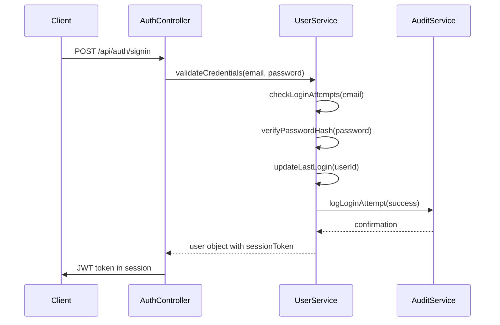
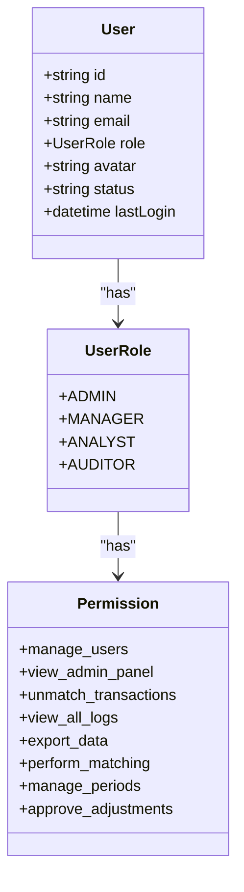
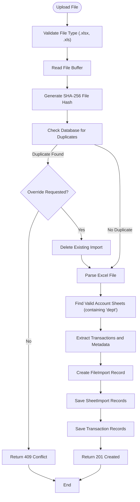
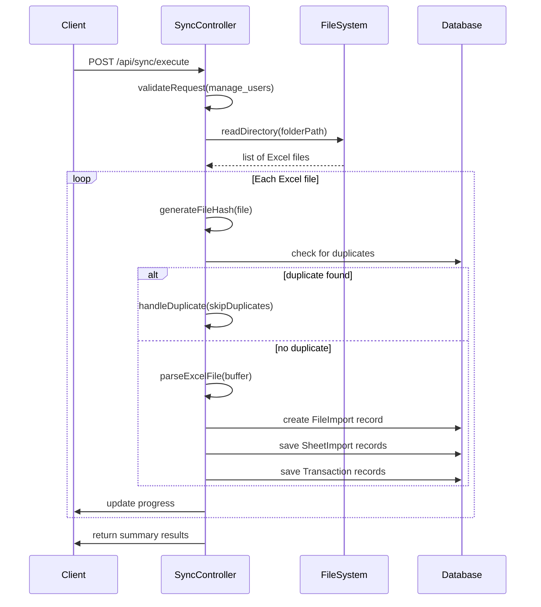
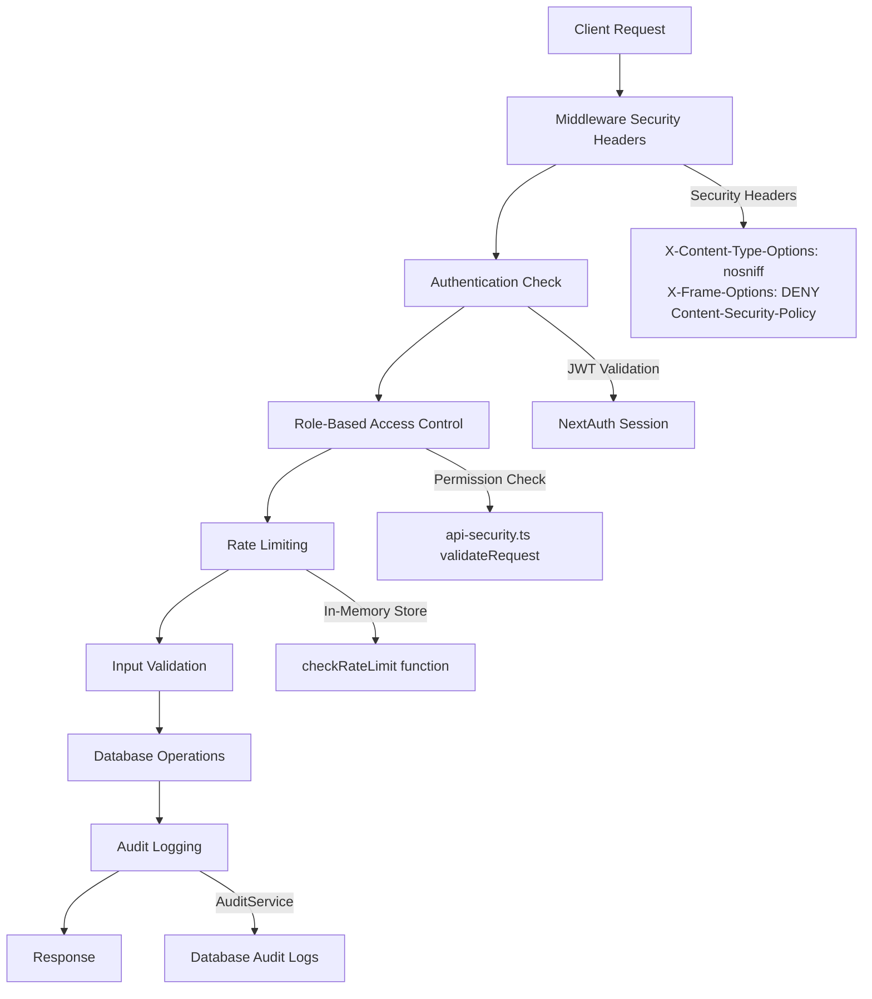

# API Reference

<cite>
**Referenced Files in This Document**   
- [route.ts](file://app/api/auth/[...nextauth]/route.ts)
- [route.ts](file://app/api/admin/users/route.ts)
- [route.ts](file://app/api/admin/users/[id]/route.ts)
- [route.ts](file://app/api/transactions/import/route.ts)
- [route.ts](file://app/api/transactions/sheets/route.ts)
- [route.ts](file://app/api/sync/folders/route.ts)
- [route.ts](file://app/api/sync/execute/route.ts)
- [api-security.ts](file://lib/api-security.ts)
- [auth.ts](file://lib/auth.ts)
- [excel-import.ts](file://lib/excel-import.ts)
- [types.ts](file://lib/types.ts)
- [constants.ts](file://lib/constants.ts)
- [middleware.ts](file://middleware.ts)
</cite>

## Table of Contents
1. [Introduction](#introduction)
2. [Authentication API](#authentication-api)
3. [User Management API](#user-management-api)
4. [Transaction Import API](#transaction-import-api)
5. [Transaction Sheets API](#transaction-sheets-api)
6. [Folder Synchronization API](#folder-synchronization-api)
7. [Security Considerations](#security-considerations)
8. [Error Handling](#error-handling)
9. [Client Implementation Guide](#client-implementation-guide)
10. [Common Use Cases](#common-use-cases)

## Introduction
The analyzer-web application provides a comprehensive API for financial transaction analysis, reconciliation, and user management. This documentation details the public RESTful endpoints, covering authentication, user administration, transaction processing, and folder synchronization functionality. The API follows standard REST conventions with JSON request/response payloads and appropriate HTTP status codes. All endpoints require authentication via JWT tokens managed by NextAuth, with role-based access control enforced through middleware.

## Authentication API

The authentication system is built on NextAuth with JWT-based sessions and comprehensive security features including rate limiting, CSRF protection, and audit logging.



**Diagram sources**
- [auth.ts](file://lib/auth.ts#L37-L167)
- [api-security.ts](file://lib/api-security.ts#L71-L116)

**Section sources**
- [route.ts](file://app/api/auth/[...nextauth]/route.ts)

### POST /api/auth/signin
Authenticate a user and create a session.

**Request**
```json
{
  "email": "string",
  "password": "string"
}
```

**Response (200)**
```json
{
  "user": {
    "id": "string",
    "name": "string",
    "email": "string",
    "role": "ADMIN|MANAGER|ANALYST|AUDITOR",
    "avatar": "string"
  }
}
```

**Error Responses**
- `401 Unauthorized`: Invalid credentials
- `403 Forbidden`: Account locked or inactive
- `429 Too Many Requests`: Rate limit exceeded

### GET /api/auth/session
Retrieve current session information.

**Response (200)**
```json
{
  "user": {
    "id": "string",
    "name": "string",
    "email": "string",
    "role": "ADMIN|MANAGER|ANALYST|AUDITOR"
  },
  "expires": "datetime"
}
```

### POST /api/auth/signout
Terminate the current session.

**Response (200)**
```json
{
  "success": true
}
```

## User Management API

The user management API enables administrative operations on user accounts with role-based access control. Only users with the `manage_users` permission can access these endpoints.



**Diagram sources**
- [types.ts](file://lib/types.ts#L11-L26)
- [constants.ts](file://lib/constants.ts#L24-L50)
- [route.ts](file://app/api/admin/users/route.ts)

**Section sources**
- [route.ts](file://app/api/admin/users/route.ts#L6-L71)
- [route.ts](file://app/api/admin/users/[id]/route.ts#L5-L51)

### GET /api/admin/users
Retrieve a list of all users.

**Authentication**: Required (manage_users permission)  
**Response (200)**
```json
[
  {
    "id": "string",
    "name": "string",
    "email": "string",
    "role": "ADMIN|MANAGER|ANALYST|AUDITOR",
    "avatar": "string",
    "status": "active|inactive|locked"
  }
]
```

### POST /api/admin/users
Create a new user account.

**Request**
```json
{
  "name": "string",
  "email": "string",
  "role": "ADMIN|MANAGER|ANALYST|AUDITOR",
  "status": "active|inactive",
  "password": "string (optional)"
}
```

**Response (201)**
```json
{
  "id": "string",
  "name": "string",
  "email": "string",
  "role": "ADMIN|MANAGER|ANALYST|AUDITOR",
  "avatar": "string",
  "status": "active"
}
```

**Validation Rules**
- Email and name are required
- Password is optional (defaults to "Welcome123!" if not provided)
- Email must be unique

### PUT /api/admin/users/{id}
Update an existing user's information.

**Request**
```json
{
  "name": "string",
  "email": "string",
  "role": "ADMIN|MANAGER|ANALYST|AUDITOR",
  "status": "active|inactive"
}
```

**Response (200)**
```json
{
  "id": "string",
  "name": "string",
  "email": "string",
  "role": "ADMIN|MANAGER|ANALYST|AUDITOR",
  "avatar": "string",
  "status": "active|inactive"
}
```

### DELETE /api/admin/users/{id}
Deactivate a user account.

**Response (200)**
```json
{
  "success": true
}
```

## Transaction Import API

The transaction import API handles Excel file uploads for financial data processing, with duplicate detection and comprehensive error handling.



**Diagram sources**
- [route.ts](file://app/api/transactions/import/route.ts#L12-L264)
- [excel-import.ts](file://lib/excel-import.ts#L256-L327)

**Section sources**
- [route.ts](file://app/api/transactions/import/route.ts#L12-L264)

### POST /api/transactions/import
Import transactions from an Excel file.

**Authentication**: Required  
**Content-Type**: multipart/form-data

**Request Parameters**
- `file`: Excel file (.xlsx or .xls)
- `override`: boolean (optional) - whether to override existing imports

**Response (201)**
```json
{
  "success": true,
  "message": "Successfully imported X sheet(s) with Y total transactions",
  "data": {
    "fileImportId": "string",
    "fileName": "string",
    "fileSize": "number",
    "uploadedAt": "datetime",
    "fileHash": "string",
    "sheetCount": "number",
    "totalTransactions": "number",
    "transactionSets": [
      {
        "id": "string",
        "name": "string",
        "date": "string",
        "totalTransactions": "number",
        "metadata": {}
      }
    ]
  }
}
```

**Error Responses**
- `400 Bad Request`: No file provided or invalid file type
- `401 Unauthorized`: User not authenticated
- `409 Conflict`: File already imported (with duplicate details)
- `500 Internal Server Error`: Processing failure

## Transaction Sheets API

Retrieve imported transaction sheets and their associated data for reconciliation workflows.

**Section sources**
- [route.ts](file://app/api/transactions/sheets/route.ts#L11-L166)

### GET /api/transactions/sheets
Retrieve transaction sheets with various filtering options.

**Query Parameters**
- `fileImportId`: Filter sheets by file import ID
- `sheetId`: Retrieve specific sheet with transactions

**Response (200)**
```json
{
  "success": true,
  "data": [
    {
      "id": "string",
      "filename": "string",
      "uploadedAt": "datetime",
      "uploadedBy": {
        "name": "string",
        "email": "string"
      },
      "sheetCount": "number",
      "totalTransactions": "number",
      "status": "COMPLETED",
      "sheets": [
        {
          "id": "string",
          "name": "string",
          "reportingDate": "datetime",
          "transactionCount": "number",
          "counts": {
            "intCr": "number",
            "intDr": "number",
            "extDr": "number",
            "extCr": "number"
          }
        }
      ]
    }
  ]
}
```

### GET /api/transactions/sheets?sheetId={id}
Retrieve a specific sheet with its transactions.

**Response (200)**
```json
{
  "success": true,
  "data": {
    "id": "string",
    "name": "string",
    "metadata": {},
    "reportingDate": "datetime",
    "fileName": "string",
    "uploadedAt": "datetime",
    "totalTransactions": "number",
    "glTransactions": {
      "intCr": [],
      "intDr": []
    },
    "statementTransactions": {
      "extDr": [],
      "extCr": []
    },
    "counts": {
      "intCr": "number",
      "intDr": "number",
      "extDr": "number",
      "extCr": "number"
    }
  }
}
```

## Folder Synchronization API

The folder synchronization API enables batch processing of Excel files from local directories.



**Diagram sources**
- [route.ts](file://app/api/sync/execute/route.ts#L24-L311)
- [route.ts](file://app/api/sync/folders/route.ts#L11-L90)

**Section sources**
- [route.ts](file://app/api/sync/folders/route.ts#L11-L90)
- [route.ts](file://app/api/sync/execute/route.ts#L24-L311)

### GET /api/sync/folders
List Excel files in a specified folder.

**Query Parameters**
- `path`: Absolute path to the folder

**Response (200)**
```json
{
  "success": true,
  "folderPath": "string",
  "totalFiles": "number",
  "files": [
    {
      "name": "string",
      "path": "string",
      "size": "number",
      "modified": "datetime"
    }
  ]
}
```

### POST /api/sync/execute
Process all Excel files in a folder.

**Request**
```json
{
  "folderPath": "string",
  "skipDuplicates": "boolean (default: true)"
}
```

**Response (200)**
```json
{
  "success": true,
  "message": "Processed X file(s)",
  "results": [
    {
      "fileName": "string",
      "status": "success|error|duplicate|skipped",
      "message": "string",
      "sheetsImported": "number",
      "transactionsImported": "number",
      "error": "string"
    }
  ],
  "summary": {
    "total": "number",
    "succeeded": "number",
    "failed": "number",
    "duplicates": "number",
    "skipped": "number"
  }
}
```

## Security Considerations

The API implements multiple security layers to protect sensitive financial data.



**Diagram sources**
- [middleware.ts](file://middleware.ts#L1-L56)
- [api-security.ts](file://lib/api-security.ts#L71-L116)
- [auth.ts](file://lib/auth.ts#L3-L225)

**Section sources**
- [middleware.ts](file://middleware.ts#L1-L56)
- [api-security.ts](file://lib/api-security.ts#L1-L238)
- [auth.ts](file://lib/auth.ts#L3-L225)

### Authentication and Authorization
- JWT tokens issued by NextAuth with 24-hour expiration
- Role-based access control with defined permissions for each role
- Session tokens tracked in database for logout and audit purposes

### Rate Limiting
- In-memory rate limiting (100 requests per minute per identifier)
- Configurable limits and windows
- Note: For multi-instance deployments, replace with Redis-backed implementation

### Input Validation and Sanitization
- File type validation for Excel imports
- Path validation to prevent directory traversal
- Database query parameterization to prevent SQL injection

### Audit Logging
- All user actions logged with timestamp, IP address, and device fingerprint
- Login, logout, and permission-denied attempts recorded
- Change tracking for user modifications

## Error Handling

The API provides consistent error responses with appropriate HTTP status codes.

**Section sources**
- [route.ts](file://app/api/transactions/import/route.ts#L251-L264)
- [route.ts](file://app/api/admin/users/route.ts#L22-L25)
- [api-security.ts](file://lib/api-security.ts#L77-L79)

### Standard Error Format
```json
{
  "error": "string description"
}
```

### Common Status Codes
- `400 Bad Request`: Invalid request parameters or payload
- `401 Unauthorized`: Missing or invalid authentication
- `403 Forbidden`: Insufficient permissions for requested operation
- `404 Not Found`: Resource not found
- `409 Conflict`: Resource conflict (e.g., duplicate file import)
- `429 Too Many Requests`: Rate limit exceeded
- `500 Internal Server Error`: Unexpected server error

## Client Implementation Guide

Best practices for implementing API clients with proper error handling and security.

**Section sources**
- [route.ts](file://app/api/transactions/import/route.ts#L12-L264)
- [route.ts](file://app/api/admin/users/route.ts#L6-L71)

### Fetch Example
```javascript
// Import transactions with error handling
async function importTransactions(file, override = false) {
  const formData = new FormData();
  formData.append('file', file);
  formData.append('override', override);
  
  try {
    const response = await fetch('/api/transactions/import', {
      method: 'POST',
      body: formData,
    });
    
    if (!response.ok) {
      const error = await response.json();
      throw new Error(error.error);
    }
    
    const result = await response.json();
    return result;
  } catch (error) {
    console.error('Import failed:', error.message);
    throw error;
  }
}
```

### Axios Example
```javascript
// Get all users with proper authentication
async function getUsers() {
  try {
    const response = await axios.get('/api/admin/users', {
      headers: {
        'Authorization': `Bearer ${getAuthToken()}`
      }
    });
    
    return response.data;
  } catch (error) {
    if (error.response?.status === 403) {
      showPermissionError();
    }
    throw error;
  }
}
```

### Response Logging
```javascript
// Enable response logging for debugging
const logResponse = (response) => {
  console.log(`API Response: ${response.url}`);
  console.log(`Status: ${response.status}`);
  console.log('Headers:', Object.fromEntries(response.headers.entries()));
  console.log('Body:', response.data);
};

// Usage with fetch
fetch('/api/transactions/sheets')
  .then(logResponse)
  .then(data => processSheets(data));
```

## Common Use Cases

### Automating Imports via Scripts
```javascript
// Script to process all files in a monitored folder
async function processFolder(folderPath) {
  const response = await fetch('/api/sync/execute', {
    method: 'POST',
    headers: { 'Content-Type': 'application/json' },
    body: JSON.stringify({ folderPath, skipDuplicates: true })
  });
  
  const result = await response.json();
  
  console.log(`Processed ${result.summary.total} files`);
  console.log(`Success: ${result.summary.succeeded}`);
  console.log(`Failed: ${result.summary.failed}`);
  
  return result;
}
```

### Client-Side Implementation
- Use the `/api/transactions/sheets` endpoint to populate file selectors
- Implement file drag-and-drop with the `/api/transactions/import` endpoint
- Display import progress and results with detailed error messages
- Use role-based UI rendering based on user permissions from session

### Performance Optimization
- Batch multiple API requests when possible
- Cache responses for frequently accessed data
- Use the `fileImportId` parameter to filter sheets instead of retrieving all data
- Implement pagination for large datasets in future versions