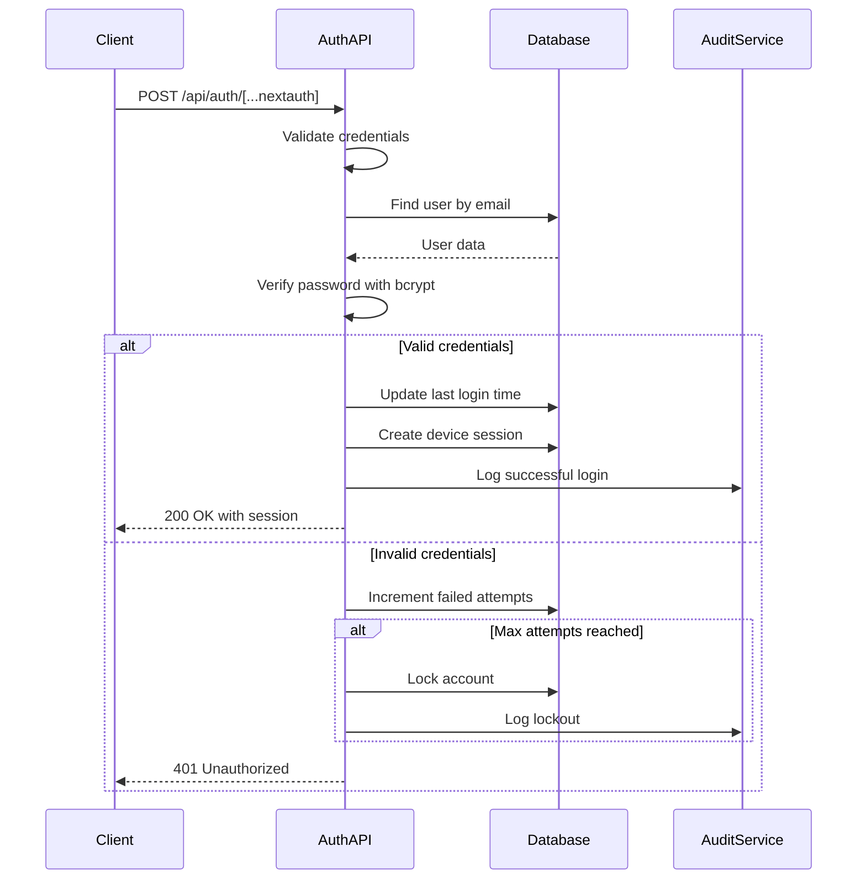
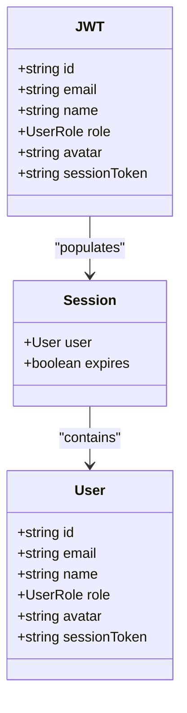
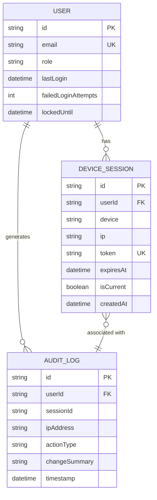
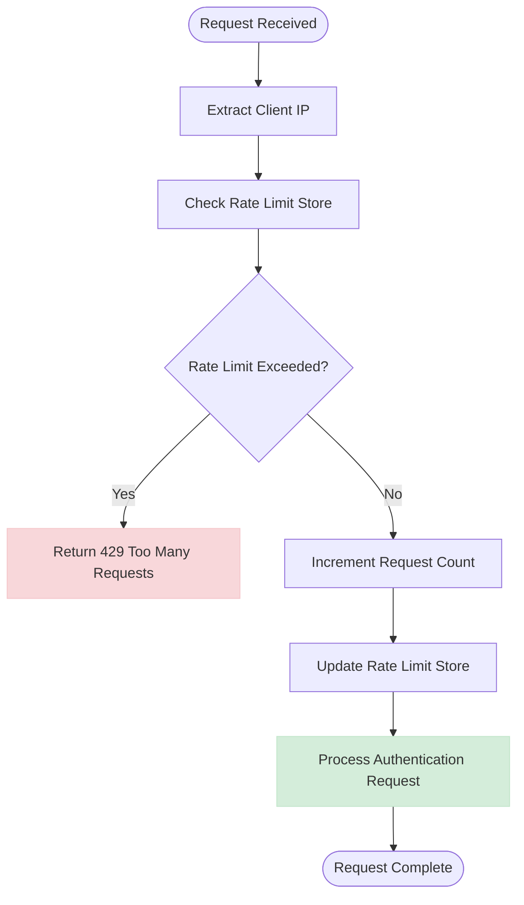
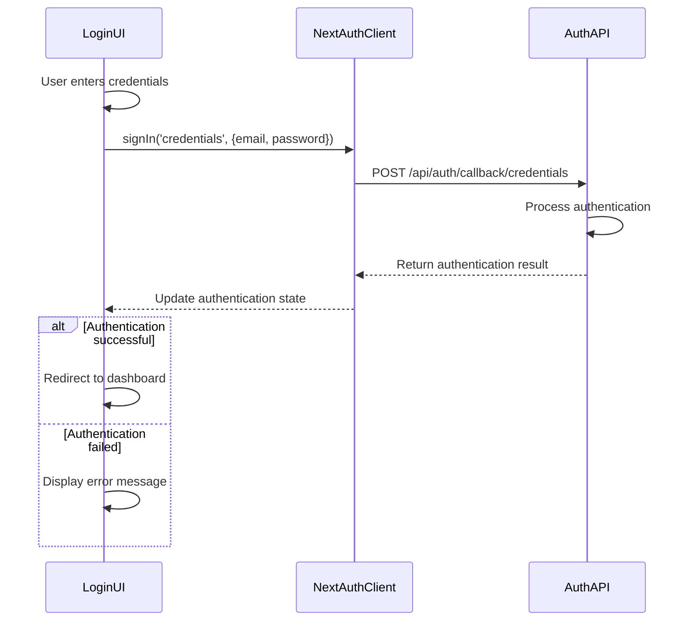
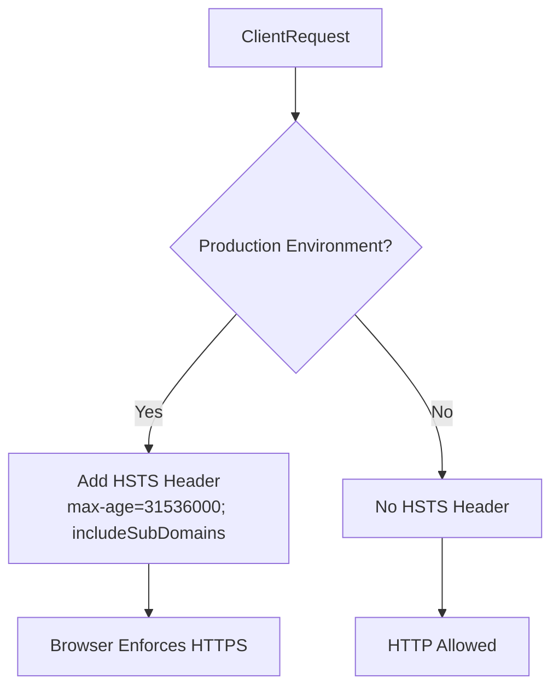

# Authentication API

<cite>
**Referenced Files in This Document**   
- [route.ts](file://app/api/auth/[...nextauth]/route.ts)
- [auth.ts](file://lib/auth.ts)
- [api-security.ts](file://lib/api-security.ts)
- [page.tsx](file://app/login/page.tsx)
- [middleware.ts](file://middleware.ts)
- [constants.ts](file://lib/constants.ts)
- [schema.prisma](file://prisma/schema.prisma)
- [next-auth.d.ts](file://types/next-auth.d.ts)
</cite>

## Table of Contents
1. [Introduction](#introduction)
2. [Authentication Endpoints](#authentication-endpoints)
3. [JWT Token Management](#jwt-token-management)
4. [Session Persistence](#session-persistence)
5. [Security Features](#security-features)
6. [Request/Response Schemas](#requestresponse-schemas)
7. [Frontend Integration](#frontend-integration)
8. [Security Considerations](#security-considerations)
9. [Debugging and Troubleshooting](#debugging-and-troubleshooting)

## Introduction
The Authentication API provides secure user authentication for the Analyzer Web application using NextAuth.js. This documentation details the implementation of authentication endpoints, token management, session persistence, and security features including rate limiting and device fingerprinting. The system integrates with custom authentication options in lib/auth.ts and enhanced security features in api-security.ts to provide a robust authentication solution for a banking environment.

## Authentication Endpoints
The authentication system is implemented through the NextAuth.js API route at `/api/auth/[...nextauth]`. This single endpoint handles multiple authentication operations through different HTTP methods.

### POST Method (Login/Logout)
The POST method handles both login and logout operations based on the authentication flow. When used for login, it authenticates user credentials and creates a session. For logout, it terminates the current session.



**Diagram sources**
- [route.ts](file://app/api/auth/[...nextauth]/route.ts)
- [auth.ts](file://lib/auth.ts)
- [schema.prisma](file://prisma/schema.prisma)

**Section sources**
- [route.ts](file://app/api/auth/[...nextauth]/route.ts#L1-L6)
- [auth.ts](file://lib/auth.ts#L38-L167)

### GET Method (Session Retrieval)
The GET method retrieves the current user session information. This endpoint is used by the frontend to check authentication status and retrieve user data.

**Section sources**
- [route.ts](file://app/api/auth/[...nextauth]/route.ts#L6)

## JWT Token Management
The authentication system uses JWT (JSON Web Tokens) for secure session management with a 24-hour expiration period.

### Token Configuration
- **Strategy**: JWT
- **Max Age**: 24 hours (86,400 seconds)
- **Update Age**: 1 hour (3,600 seconds)
- **Secret**: NEXTAUTH_SECRET environment variable

The JWT tokens contain user information including ID, email, name, role, avatar, and session token for tracking.



**Diagram sources**
- [auth.ts](file://lib/auth.ts#L170-L191)
- [next-auth.d.ts](file://types/next-auth.d.ts)

**Section sources**
- [auth.ts](file://lib/auth.ts#L27-L33)
- [next-auth.d.ts](file://types/next-auth.d.ts#L4-L29)

## Session Persistence
The system implements database-backed session persistence with comprehensive tracking and audit logging.

### Device Session Tracking
Each successful login creates a device session record in the database with the following information:
- User ID
- Device type (Web Browser)
- IP address
- Session token
- Expiration time (24 hours)
- Current session status

When a user logs out, the session is marked as inactive in the database.



**Diagram sources**
- [schema.prisma](file://prisma/schema.prisma#L18-L53)
- [schema.prisma](file://prisma/schema.prisma#L249-L271)
- [schema.prisma](file://prisma/schema.prisma#L158-L192)

**Section sources**
- [auth.ts](file://lib/auth.ts#L121-L134)
- [auth.ts](file://lib/auth.ts#L208-L217)
- [schema.prisma](file://prisma/schema.prisma)

## Security Features
The authentication system includes multiple security features to protect against common threats.

### CSRF Protection
NextAuth.js automatically handles CSRF protection for authentication routes. The implementation relies on NextAuth's built-in CSRF protection mechanisms.

### Rate Limiting
The system implements rate limiting to prevent brute force attacks using an in-memory store. This implementation is suitable for single-instance deployments.



**Diagram sources**
- [api-security.ts](file://lib/api-security.ts#L182-L238)

**Section sources**
- [api-security.ts](file://lib/api-security.ts#L182-L238)

### Account Lockout
The system implements progressive account lockout after multiple failed login attempts:
- Maximum login attempts: 5
- Lockout duration: 15 minutes
- Automatic unlock after timeout period

**Section sources**
- [auth.ts](file://lib/auth.ts#L7-L10)
- [constants.ts](file://lib/constants.ts#L9-L10)

## Request/Response Schemas
This section details the request and response schemas for authentication operations.

### Login Request
**Endpoint**: POST /api/auth/[...nextauth]
**Content-Type**: application/json

```json
{
  "email": "user@analyzerweb.com",
  "password": "password123"
}
```

### Login Success Response
**Status**: 200 OK
**Content-Type**: application/json

```json
{
  "user": {
    "id": "string",
    "name": "string",
    "email": "string",
    "role": "ADMIN|MANAGER|ANALYST|AUDITOR",
    "avatar": "string"
  },
  "expires": "datetime"
}
```

### Login Error Responses
**401 Unauthorized** - Invalid credentials
```json
{
  "error": "Invalid credentials. Please try again."
}
```

**403 Forbidden** - Account locked or inactive
```json
{
  "error": "Account is locked. Try again in X minutes."
}
```

**Section sources**
- [auth.ts](file://lib/auth.ts#L44-L167)
- [page.tsx](file://app/login/page.tsx#L28-L38)

## Frontend Integration
The authentication system is integrated with the frontend through NextAuth.js client utilities.

### Login Component Example
The login page uses the NextAuth.js signIn function to authenticate users:



**Diagram sources**
- [page.tsx](file://app/login/page.tsx#L28-L45)
- [route.ts](file://app/api/auth/[...nextauth]/route.ts)

**Section sources**
- [page.tsx](file://app/login/page.tsx#L1-L236)

### API Authentication Example
For API calls requiring authentication, use the session token:

```javascript
// Using fetch
const response = await fetch('/api/admin/users', {
  method: 'GET',
  headers: {
    'Authorization': `Bearer ${session.accessToken}`,
    'Content-Type': 'application/json',
  },
});

// Using axios
const response = await axios.get('/api/admin/users', {
  headers: {
    'Authorization': `Bearer ${session.accessToken}`,
  },
});
```

## Security Considerations
The authentication system implements multiple security measures to protect user data and prevent unauthorized access.

### Secure Cookie Settings
The system uses secure cookie settings to protect session information:
- Cookies are marked as secure (HTTPS only)
- SameSite policy is enforced
- HttpOnly flag is set to prevent XSS attacks

### HTTPS Enforcement
In production environments, the system enforces HTTPS through HSTS (HTTP Strict Transport Security) headers:



**Diagram sources**
- [middleware.ts](file://middleware.ts#L14-L20)

**Section sources**
- [middleware.ts](file://middleware.ts#L1-L56)

### Brute Force Protection
The system protects against brute force attacks through:
- Rate limiting (100 requests per minute per identifier)
- Account lockout after 5 failed attempts
- Progressive lockout duration
- Audit logging of failed attempts

## Debugging and Troubleshooting
This section provides guidance for debugging authentication issues and troubleshooting common problems.

### Debugging Tips
1. **Check NextAuth debug logs**: Enable debug mode in development to see detailed authentication flow
2. **Verify environment variables**: Ensure NEXTAUTH_SECRET and NEXTAUTH_URL are correctly set
3. **Check database connectivity**: Verify the application can connect to the database
4. **Review audit logs**: Examine audit logs for authentication events and errors

### Common Issues and Solutions
**Issue**: Login fails with "Invalid credentials" error
- **Solution**: Verify the correct password is being used; check if account is locked using `npm run check-users`

**Issue**: Session doesn't persist
- **Solution**: Ensure NEXTAUTH_SECRET is set and consistent across deployments; verify HTTPS configuration

**Issue**: Random logouts
- **Solution**: Check if NEXTAUTH_SECRET has changed after build; verify environment variables are loaded

**Section sources**
- [PRODUCTION_TROUBLESHOOTING.md](file://docs/PRODUCTION_TROUBLESHOOTING.md#L125-L161)
- [LOGIN_CREDENTIALS.md](file://docs/LOGIN_CREDENTIALS.md)
- [env-validation.ts](file://lib/env-validation.ts)