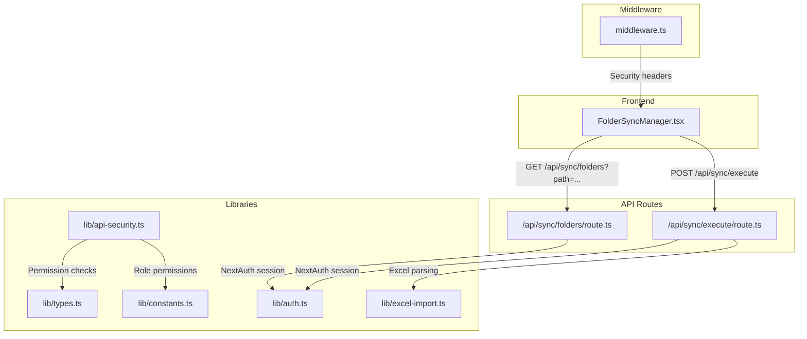
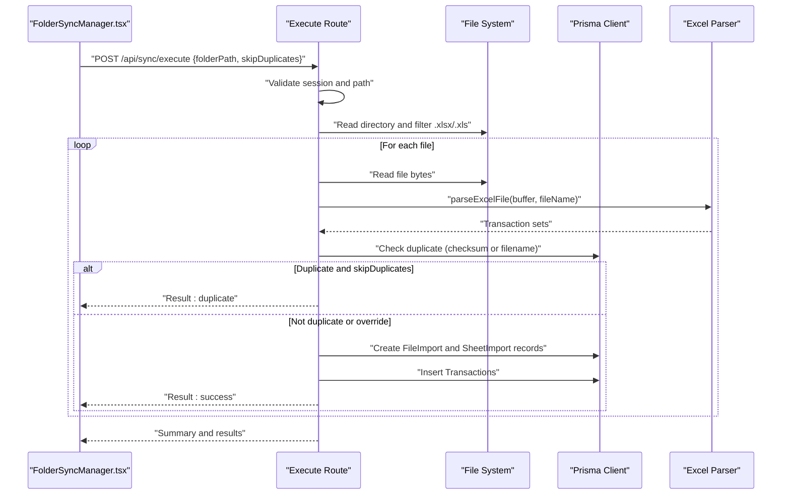
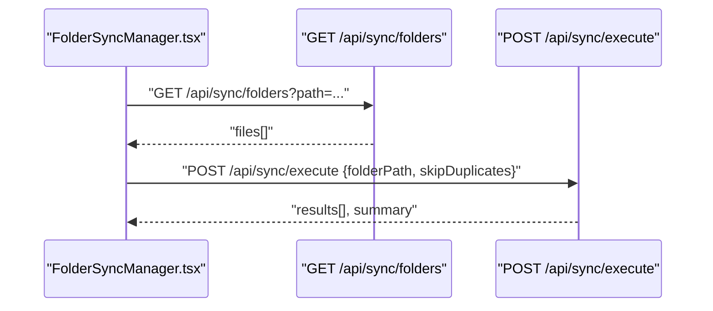
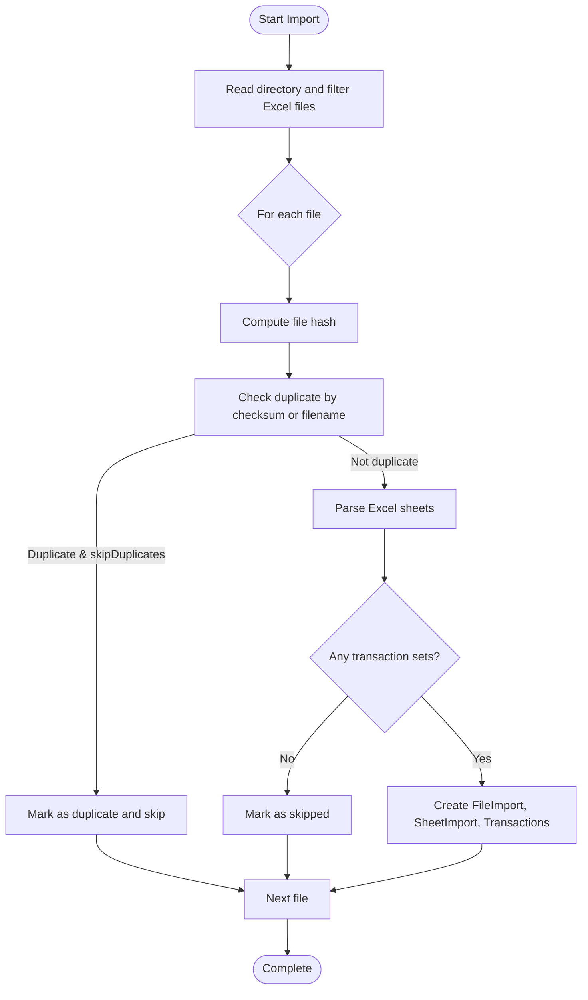
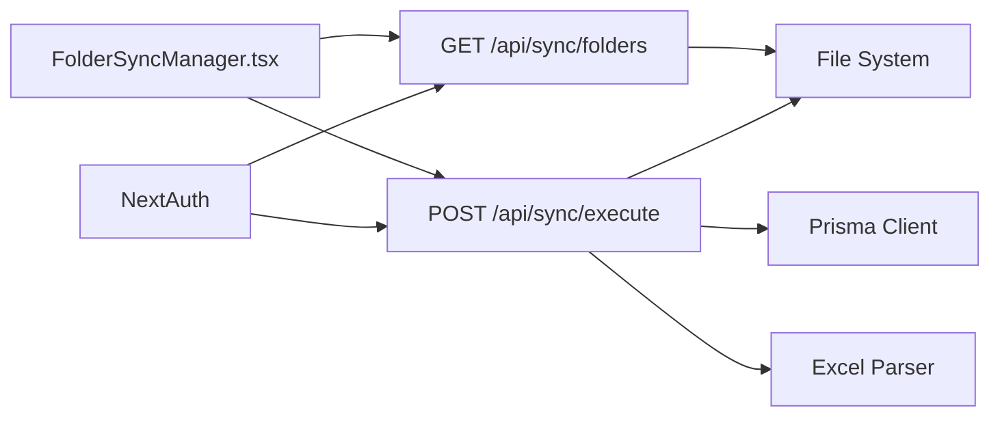

# Synchronization API

<cite>
**Referenced Files in This Document**
- [app/api/sync/folders/route.ts](file://app/api/sync/folders/route.ts)
- [app/api/sync/execute/route.ts](file://app/api/sync/execute/route.ts)
- [lib/api-security.ts](file://lib/api-security.ts)
- [lib/auth.ts](file://lib/auth.ts)
- [lib/types.ts](file://lib/types.ts)
- [lib/constants.ts](file://lib/constants.ts)
- [middleware.ts](file://middleware.ts)
- [components/FolderSyncManager.tsx](file://components/FolderSyncManager.tsx)
- [lib/excel-import.ts](file://lib/excel-import.ts)
</cite>

## Table of Contents
1. [Introduction](#introduction)
2. [Project Structure](#project-structure)
3. [Core Components](#core-components)
4. [Architecture Overview](#architecture-overview)
5. [Detailed Component Analysis](#detailed-component-analysis)
6. [Dependency Analysis](#dependency-analysis)
7. [Performance Considerations](#performance-considerations)
8. [Troubleshooting Guide](#troubleshooting-guide)
9. [Conclusion](#conclusion)
10. [Appendices](#appendices)

## Introduction
This document describes the synchronization API endpoints for importing Excel files from a configured folder path. It covers:
- Retrieving configured sync folders and scanning for Excel files
- Triggering immediate synchronization jobs
- Authentication and authorization requirements
- Response formats and error handling
- UI integration with the FolderSyncManager component
- Security considerations and performance optimization tips

## Project Structure
The synchronization API is implemented as Next.js App Router API routes under app/api/sync. The FolderSyncManager component in the frontend integrates with these endpoints to provide a user interface for scanning and importing files.

**Diagram sources**
- [components/FolderSyncManager.tsx](file://components/FolderSyncManager.tsx#L1-L365)
- [app/api/sync/folders/route.ts](file://app/api/sync/folders/route.ts#L1-L90)
- [app/api/sync/execute/route.ts](file://app/api/sync/execute/route.ts#L1-L311)
- [lib/auth.ts](file://lib/auth.ts#L1-L225)
- [lib/api-security.ts](file://lib/api-security.ts#L1-L238)
- [lib/types.ts](file://lib/types.ts#L1-L132)
- [lib/constants.ts](file://lib/constants.ts#L1-L50)
- [middleware.ts](file://middleware.ts#L1-L56)
- [lib/excel-import.ts](file://lib/excel-import.ts#L1-L327)

**Section sources**
- [components/FolderSyncManager.tsx](file://components/FolderSyncManager.tsx#L1-L365)
- [app/api/sync/folders/route.ts](file://app/api/sync/folders/route.ts#L1-L90)
- [app/api/sync/execute/route.ts](file://app/api/sync/execute/route.ts#L1-L311)
- [lib/auth.ts](file://lib/auth.ts#L1-L225)
- [lib/api-security.ts](file://lib/api-security.ts#L1-L238)
- [lib/types.ts](file://lib/types.ts#L1-L132)
- [lib/constants.ts](file://lib/constants.ts#L1-L50)
- [middleware.ts](file://middleware.ts#L1-L56)
- [lib/excel-import.ts](file://lib/excel-import.ts#L1-L327)

## Core Components
- Synchronization API routes:
  - GET /api/sync/folders: Lists Excel files in a given absolute folder path
  - POST /api/sync/execute: Imports all Excel files from a folder into the system
- Authentication and authorization:
  - NextAuth session-based authentication
  - Role-based permission checks for sensitive operations
- Frontend integration:
  - FolderSyncManager component orchestrates scanning and importing

Key behaviors:
- Both endpoints require a valid NextAuth session
- The execute endpoint performs duplicate detection and sheet parsing
- The UI component stores the last used folder path locally and supports toggling duplicate skipping

**Section sources**
- [app/api/sync/folders/route.ts](file://app/api/sync/folders/route.ts#L1-L90)
- [app/api/sync/execute/route.ts](file://app/api/sync/execute/route.ts#L1-L311)
- [lib/auth.ts](file://lib/auth.ts#L1-L225)
- [lib/types.ts](file://lib/types.ts#L1-L132)
- [lib/constants.ts](file://lib/constants.ts#L1-L50)
- [components/FolderSyncManager.tsx](file://components/FolderSyncManager.tsx#L1-L365)

## Architecture Overview
The synchronization flow connects the UI to the backend API routes. The execute route reads files from disk, parses Excel content, and persists data to the database while tracking import results.

**Diagram sources**
- [components/FolderSyncManager.tsx](file://components/FolderSyncManager.tsx#L1-L365)
- [app/api/sync/execute/route.ts](file://app/api/sync/execute/route.ts#L1-L311)
- [lib/excel-import.ts](file://lib/excel-import.ts#L1-L327)

## Detailed Component Analysis

### Endpoint: GET /api/sync/folders
Purpose:
- Retrieve a list of Excel files (.xlsx, .xls) from a specified absolute folder path

Behavior:
- Validates presence of a NextAuth session
- Requires a path query parameter
- Ensures the path is absolute and exists as a directory
- Reads directory contents and filters for Excel files
- Returns file metadata (name, path, size, modified time) and counts

Request:
- Method: GET
- URL: /api/sync/folders?path={absolute_folder_path}
- Query parameters:
  - path (required): Absolute path to the folder

Response (200 OK):
- success: boolean
- folderPath: string
- totalFiles: number
- files: array of objects with:
  - name: string
  - path: string
  - size: number (bytes)
  - modified: string (ISO timestamp)

Errors:
- 401 Unauthorized: No active session
- 400 Bad Request: Missing or invalid path (not absolute or not a directory)
- 404 Not Found: Directory does not exist or is not accessible
- 500 Internal Server Error: Unexpected failure reading directory

Notes:
- The endpoint does not enforce role-based permissions; it is intended for discovery and scanning.

**Section sources**
- [app/api/sync/folders/route.ts](file://app/api/sync/folders/route.ts#L1-L90)

### Endpoint: POST /api/sync/execute
Purpose:
- Trigger immediate synchronization of all Excel files in a folder

Behavior:
- Validates NextAuth session and ensures user exists in the database
- Validates absolute folder path and existence
- Reads and filters Excel files
- For each file:
  - Computes a file hash for duplicate detection
  - Checks for existing imports by checksum or filename
  - Parses Excel sheets using a dedicated parser
  - Creates FileImport, SheetImport, and Transaction records
  - Tracks import results and aggregates a summary

Request:
- Method: POST
- URL: /api/sync/execute
- Body:
  - folderPath (required): Absolute path to the folder
  - skipDuplicates (optional, default true): Whether to skip files already imported

Response (200 OK):
- success: boolean
- message: string
- results: array of objects with:
  - fileName: string
  - status: "success" | "error" | "duplicate" | "skipped"
  - message: string
  - sheetsImported?: number
  - transactionsImported?: number
  - error?: string
- summary: object with:
  - total: number
  - succeeded: number
  - failed: number
  - duplicates: number
  - skipped: number

Errors:
- 401 Unauthorized: No active session
- 400 Bad Request: Missing or invalid path (not absolute or not a directory)
- 404 Not Found: Directory does not exist or is not accessible
- 500 Internal Server Error: Unexpected failure during processing

Notes:
- The endpoint does not enforce role-based permissions; it is intended for execution.
- The UI component controls whether duplicates are skipped.

**Section sources**
- [app/api/sync/execute/route.ts](file://app/api/sync/execute/route.ts#L1-L311)

### Authentication and Authorization
- Session-based authentication:
  - Both endpoints use NextAuth to obtain a session
  - The execute endpoint additionally verifies the user exists in the database
- Middleware:
  - Global middleware enforces security headers and redirects unauthenticated users to the login page
- Permissions:
  - The provided security utilities support role-based permission checks
  - The synchronization endpoints currently rely on session presence rather than explicit role checks

Recommendations:
- For stricter access control, wrap the endpoints with a permission validator requiring MANAGER or ADMIN roles before performing sensitive operations

**Section sources**
- [lib/auth.ts](file://lib/auth.ts#L1-L225)
- [middleware.ts](file://middleware.ts#L1-L56)
- [lib/api-security.ts](file://lib/api-security.ts#L1-L238)
- [lib/types.ts](file://lib/types.ts#L1-L132)
- [lib/constants.ts](file://lib/constants.ts#L1-L50)

### Frontend Integration: FolderSyncManager
The FolderSyncManager component provides:
- Input for an absolute folder path
- Toggle to skip duplicates
- Scan button to list Excel files
- Import button to trigger synchronization
- Displays results and summary statistics

Workflow:
- On scan, calls GET /api/sync/folders?path=...
- On import, calls POST /api/sync/execute with folderPath and skipDuplicates
- Persists the last used folder path in local storage

**Diagram sources**
- [components/FolderSyncManager.tsx](file://components/FolderSyncManager.tsx#L1-L365)
- [app/api/sync/folders/route.ts](file://app/api/sync/folders/route.ts#L1-L90)
- [app/api/sync/execute/route.ts](file://app/api/sync/execute/route.ts#L1-L311)

**Section sources**
- [components/FolderSyncManager.tsx](file://components/FolderSyncManager.tsx#L1-L365)

### Excel Parsing and Import Logic
The execute endpoint uses a shared Excel parser to:
- Validate sheets by presence of a keyword in a region
- Extract metadata and transaction tables
- Categorize transactions by side and type
- Persist parsed data to the database

**Diagram sources**
- [app/api/sync/execute/route.ts](file://app/api/sync/execute/route.ts#L1-L311)
- [lib/excel-import.ts](file://lib/excel-import.ts#L1-L327)

**Section sources**
- [app/api/sync/execute/route.ts](file://app/api/sync/execute/route.ts#L1-L311)
- [lib/excel-import.ts](file://lib/excel-import.ts#L1-L327)

## Dependency Analysis
- API routes depend on:
  - NextAuth for session validation
  - Prisma for database operations
  - Local filesystem for reading files
  - Excel parser for content extraction
- Frontend depends on:
  - API routes for scanning and importing
  - Local storage for persistence

**Diagram sources**
- [components/FolderSyncManager.tsx](file://components/FolderSyncManager.tsx#L1-L365)
- [app/api/sync/folders/route.ts](file://app/api/sync/folders/route.ts#L1-L90)
- [app/api/sync/execute/route.ts](file://app/api/sync/execute/route.ts#L1-L311)
- [lib/excel-import.ts](file://lib/excel-import.ts#L1-L327)

**Section sources**
- [components/FolderSyncManager.tsx](file://components/FolderSyncManager.tsx#L1-L365)
- [app/api/sync/folders/route.ts](file://app/api/sync/folders/route.ts#L1-L90)
- [app/api/sync/execute/route.ts](file://app/api/sync/execute/route.ts#L1-L311)
- [lib/excel-import.ts](file://lib/excel-import.ts#L1-L327)

## Performance Considerations
- Off-peak scheduling:
  - Run synchronization jobs during low-traffic hours to minimize impact on concurrent users
- Queue management:
  - Monitor job queue length and adjust concurrency limits to prevent resource exhaustion
- Batch processing:
  - Consider batching imports if the folder contains a very large number of files
- Network and storage:
  - Ensure reliable access to the folder path and avoid slow network mounts
- Rate limiting:
  - Apply rate limiting at the API level to protect backend resources
- Database writes:
  - Large imports can generate significant write load; consider indexing and batch inserts where appropriate

[No sources needed since this section provides general guidance]

## Troubleshooting Guide
Common issues and resolutions:
- Unauthorized:
  - Ensure the user is logged in and the session is valid
- Bad Request (400):
  - Verify the path is absolute and points to a directory
- Not Found (404):
  - Confirm the directory exists and is accessible
- Internal Server Error (500):
  - Check logs for parsing or database errors
- Excel parsing failures:
  - Validate that sheets contain the expected metadata and transaction table structure
- Duplicate handling:
  - Adjust skipDuplicates setting based on requirements

**Section sources**
- [app/api/sync/folders/route.ts](file://app/api/sync/folders/route.ts#L1-L90)
- [app/api/sync/execute/route.ts](file://app/api/sync/execute/route.ts#L1-L311)
- [lib/excel-import.ts](file://lib/excel-import.ts#L1-L327)

## Conclusion
The synchronization API provides a straightforward mechanism to discover and import Excel files from a configured folder path. The FolderSyncManager component offers a practical UI for scanning and executing imports. For production environments, consider adding role-based permission checks to the endpoints and implementing robust rate limiting and monitoring.

[No sources needed since this section summarizes without analyzing specific files]

## Appendices

### API Definitions

- GET /api/sync/folders
  - Query parameters:
    - path (required): Absolute path to the folder
  - Responses:
    - 200 OK: Files found
    - 401 Unauthorized: No active session
    - 400 Bad Request: Missing or invalid path
    - 404 Not Found: Directory not accessible
    - 500 Internal Server Error: Unexpected error

- POST /api/sync/execute
  - Body:
    - folderPath (required): Absolute path to the folder
    - skipDuplicates (optional): Boolean
  - Responses:
    - 200 OK: Import results and summary
    - 401 Unauthorized: No active session
    - 400 Bad Request: Missing or invalid path
    - 404 Not Found: Directory not accessible
    - 500 Internal Server Error: Unexpected error

**Section sources**
- [app/api/sync/folders/route.ts](file://app/api/sync/folders/route.ts#L1-L90)
- [app/api/sync/execute/route.ts](file://app/api/sync/execute/route.ts#L1-L311)

### Example Workflows

- Configure a new folder sync:
  - Use the FolderSyncManager to set the absolute folder path
  - Optionally enable skipDuplicates
  - Click Scan to list Excel files
  - Click Import All Files to trigger synchronization

- Trigger manual execution:
  - Call POST /api/sync/execute with folderPath and skipDuplicates
  - Review results and summary for success, duplicates, skipped, and failed entries

**Section sources**
- [components/FolderSyncManager.tsx](file://components/FolderSyncManager.tsx#L1-L365)
- [app/api/sync/execute/route.ts](file://app/api/sync/execute/route.ts#L1-L311)

### Security Considerations
- Authentication:
  - Both endpoints rely on NextAuth sessions
- Authorization:
  - The provided security utilities support role-based checks; consider enforcing MANAGER or ADMIN for sensitive operations
- External storage credentials:
  - The execute endpoint operates on local files; if integrating with external storage, validate credentials and restrict access paths
- Prevent unauthorized folder access:
  - Enforce strict path validation and limit allowed directories
- Rate limits and audit:
  - Implement rate limiting and audit logging for suspicious activity

**Section sources**
- [lib/api-security.ts](file://lib/api-security.ts#L1-L238)
- [lib/types.ts](file://lib/types.ts#L1-L132)
- [lib/constants.ts](file://lib/constants.ts#L1-L50)
- [middleware.ts](file://middleware.ts#L1-L56)

### Error Handling Strategies
- Network timeouts:
  - Implement retry logic and circuit breaker patterns for external systems
- Storage API rate limits:
  - Respect rate limits and back off on throttling responses
- Validation failures:
  - Return structured 400 responses with clear messages
- Execution errors:
  - Return 500 responses with error details and log stack traces

**Section sources**
- [app/api/sync/execute/route.ts](file://app/api/sync/execute/route.ts#L1-L311)
- [lib/api-security.ts](file://lib/api-security.ts#L1-L238)