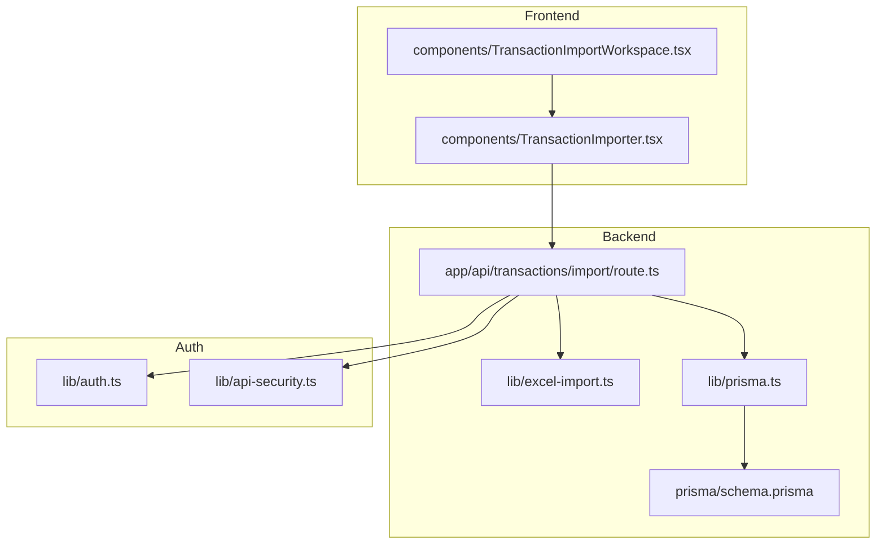
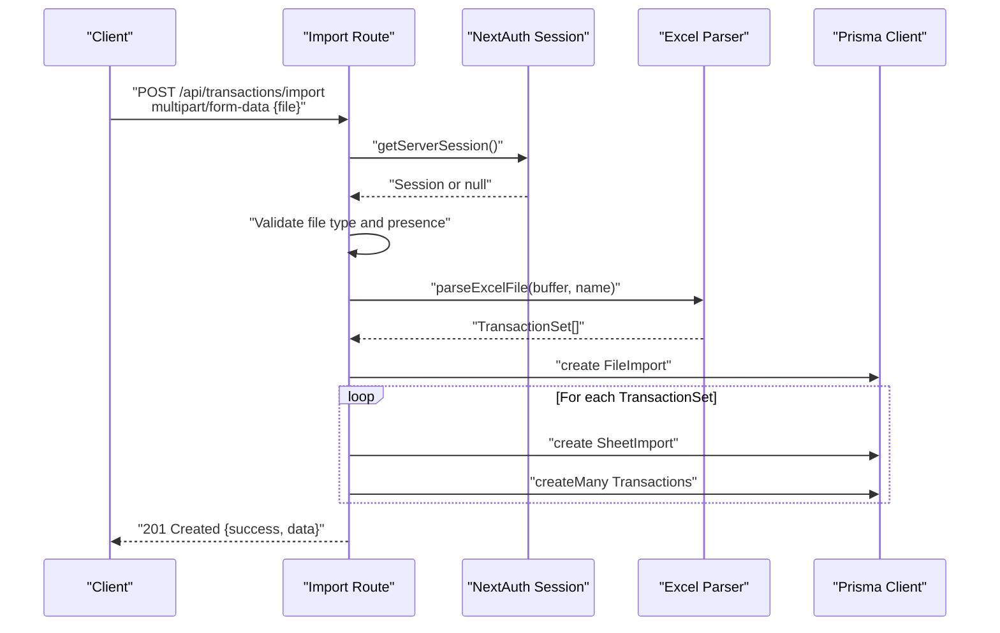
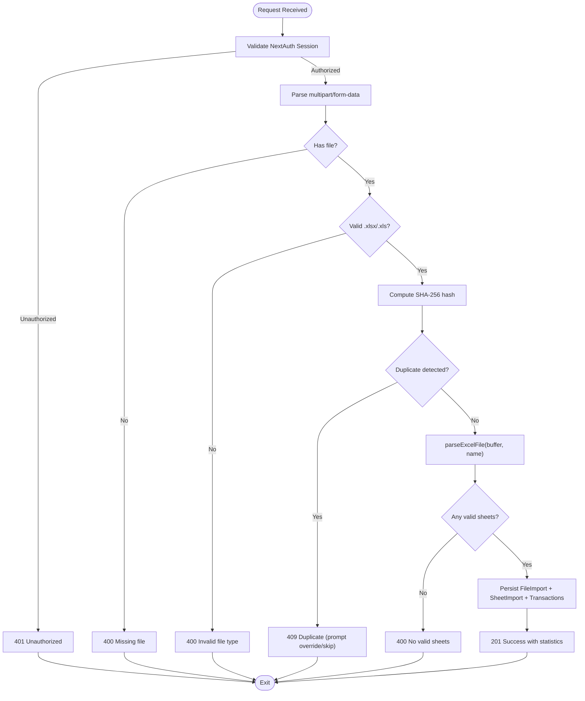
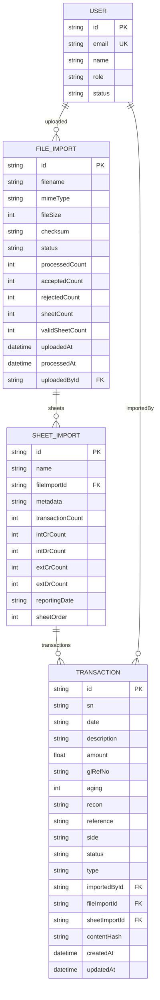
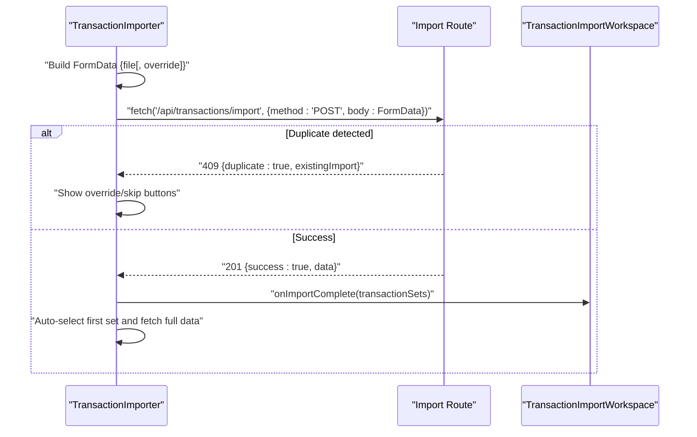
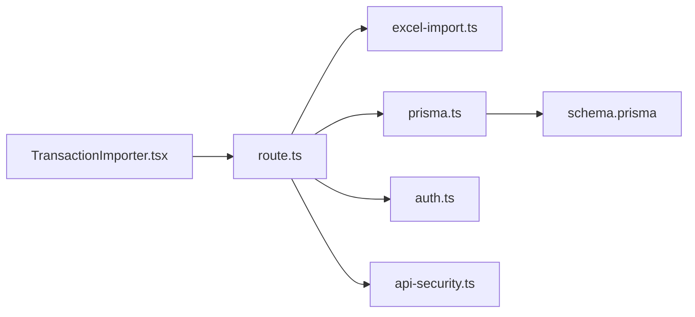

# Transaction Import API

<cite>
**Referenced Files in This Document**
- [route.ts](file://app/api/transactions/import/route.ts)
- [excel-import.ts](file://lib/excel-import.ts)
- [prisma.ts](file://lib/prisma.ts)
- [schema.prisma](file://prisma/schema.prisma)
- [TransactionImporter.tsx](file://components/TransactionImporter.tsx)
- [TransactionImportWorkspace.tsx](file://components/TransactionImportWorkspace.tsx)
- [auth.ts](file://lib/auth.ts)
- [api-security.ts](file://lib/api-security.ts)
- [TRANSACTION_IMPORT_GUIDE.md](file://docs/TRANSACTION_IMPORT_GUIDE.md)
- [TESTING_GUIDE.md](file://docs/TESTING_GUIDE.md)
</cite>

## Table of Contents
1. [Introduction](#introduction)
2. [Project Structure](#project-structure)
3. [Core Components](#core-components)
4. [Architecture Overview](#architecture-overview)
5. [Detailed Component Analysis](#detailed-component-analysis)
6. [Dependency Analysis](#dependency-analysis)
7. [Performance Considerations](#performance-considerations)
8. [Troubleshooting Guide](#troubleshooting-guide)
9. [Conclusion](#conclusion)
10. [Appendices](#appendices)

## Introduction
This document provides comprehensive API documentation for the transaction import endpoint at POST /api/transactions/import. It covers request format, authentication, processing pipeline, response schemas, error handling, and frontend integration patterns. It also highlights performance considerations and recommended limits for large files.

## Project Structure
The transaction import feature spans the backend API route, shared Excel parsing utilities, Prisma database models, and frontend components that drive the user experience.

**Diagram sources**
- [route.ts](file://app/api/transactions/import/route.ts#L1-L264)
- [excel-import.ts](file://lib/excel-import.ts#L1-L327)
- [prisma.ts](file://lib/prisma.ts#L1-L11)
- [schema.prisma](file://prisma/schema.prisma#L1-L374)
- [TransactionImporter.tsx](file://components/TransactionImporter.tsx#L1-L394)
- [TransactionImportWorkspace.tsx](file://components/TransactionImportWorkspace.tsx#L1-L119)
- [auth.ts](file://lib/auth.ts#L1-L225)
- [api-security.ts](file://lib/api-security.ts#L1-L238)

**Section sources**
- [route.ts](file://app/api/transactions/import/route.ts#L1-L264)
- [excel-import.ts](file://lib/excel-import.ts#L1-L327)
- [prisma.ts](file://lib/prisma.ts#L1-L11)
- [schema.prisma](file://prisma/schema.prisma#L1-L374)
- [TransactionImporter.tsx](file://components/TransactionImporter.tsx#L1-L394)
- [TransactionImportWorkspace.tsx](file://components/TransactionImportWorkspace.tsx#L1-L119)
- [auth.ts](file://lib/auth.ts#L1-L225)
- [api-security.ts](file://lib/api-security.ts#L1-L238)

## Core Components
- Backend API route: Parses multipart/form-data, validates authentication, checks for duplicates, parses Excel, persists data, and returns structured results.
- Excel parsing utilities: Validates sheets, extracts metadata, identifies transaction tables, and transforms rows into typed transaction sets.
- Prisma models: Persist FileImport, SheetImport, and Transaction entities with relationships and indexes.
- Frontend components: Provide drag-and-drop upload, duplicate handling, and selection of transaction sets.

**Section sources**
- [route.ts](file://app/api/transactions/import/route.ts#L1-L264)
- [excel-import.ts](file://lib/excel-import.ts#L1-L327)
- [schema.prisma](file://prisma/schema.prisma#L299-L374)
- [TransactionImporter.tsx](file://components/TransactionImporter.tsx#L1-L394)

## Architecture Overview
The import pipeline is a synchronous API operation that:
- Authenticates the caller via NextAuth session.
- Reads multipart/form-data and validates file type.
- Detects duplicates using filename and content hash.
- Parses Excel using xlsx, filtering sheets by presence of “dept” in A1:D10.
- Transforms parsed data into transaction sets.
- Persists FileImport, SheetImport, and Transaction records via Prisma.
- Returns a success payload with statistics and identifiers.

**Diagram sources**
- [route.ts](file://app/api/transactions/import/route.ts#L12-L263)
- [excel-import.ts](file://lib/excel-import.ts#L256-L327)
- [prisma.ts](file://lib/prisma.ts#L1-L11)
- [schema.prisma](file://prisma/schema.prisma#L299-L374)

## Detailed Component Analysis

### API Endpoint Definition
- Path: POST /api/transactions/import
- Content-Type: multipart/form-data
- Required fields:
  - file: Excel workbook (.xlsx or .xls)
  - override: optional boolean string "true" to replace existing import
- Authorization: Bearer token via NextAuth session (server-side session validation)

Response schemas:
- 201 Created: On success, returns success flag, message, and data including file metadata, counts, and transaction sets.
- 400 Bad Request: On invalid file type or missing file.
- 401 Unauthorized: On missing or invalid session.
- 409 Conflict: On duplicate detection (unless override is requested).
- 500 Internal Server Error: On unexpected processing failures.

Notes:
- The endpoint does not currently accept sheetName or mappingId parameters. The current implementation filters sheets by “dept” in A1:D10 and processes all valid sheets.

**Section sources**
- [route.ts](file://app/api/transactions/import/route.ts#L12-L263)
- [TRANSACTION_IMPORT_GUIDE.md](file://docs/TRANSACTION_IMPORT_GUIDE.md#L140-L181)

### Processing Pipeline
1. Authentication
   - Validates NextAuth session; returns 401 if absent.
2. Form parsing and validation
   - Reads multipart/form-data and ensures a file is present.
   - Rejects non-Excel files by extension.
3. Duplicate detection
   - Computes SHA-256 content hash and checks existing FileImport by checksum or filename.
   - Returns 409 with duplicate info and prompt unless override is requested.
4. Excel parsing
   - Uses xlsx to read workbook and iterate sheets.
   - Filters sheets by presence of “dept” in A1:D10.
   - Converts sheet to JSON and extracts metadata and transaction rows.
5. Persistence
   - Creates FileImport record with counts and timestamps.
   - For each TransactionSet, creates SheetImport and bulk inserts Transactions.
6. Response
   - Returns success payload with identifiers and statistics.

**Diagram sources**
- [route.ts](file://app/api/transactions/import/route.ts#L12-L263)
- [excel-import.ts](file://lib/excel-import.ts#L256-L327)

**Section sources**
- [route.ts](file://app/api/transactions/import/route.ts#L12-L263)
- [excel-import.ts](file://lib/excel-import.ts#L1-L327)

### Data Models and Relationships
The import process writes to FileImport, SheetImport, and Transaction entities with the following relationships and indexes.

**Diagram sources**
- [schema.prisma](file://prisma/schema.prisma#L59-L107)
- [schema.prisma](file://prisma/schema.prisma#L299-L374)

**Section sources**
- [schema.prisma](file://prisma/schema.prisma#L59-L107)
- [schema.prisma](file://prisma/schema.prisma#L299-L374)

### Frontend Integration Patterns
- TransactionImporter constructs FormData and posts to /api/transactions/import.
- On duplicate detection, it displays override/skip actions and stores pending file for override.
- On success, it updates transactionSets and auto-selects the first set, optionally fetching full sheet data.
- TransactionImportWorkspace orchestrates the importer and dual-pane view.

**Diagram sources**
- [TransactionImporter.tsx](file://components/TransactionImporter.tsx#L51-L120)
- [route.ts](file://app/api/transactions/import/route.ts#L12-L263)
- [TransactionImportWorkspace.tsx](file://components/TransactionImportWorkspace.tsx#L1-L119)

**Section sources**
- [TransactionImporter.tsx](file://components/TransactionImporter.tsx#L1-L394)
- [TransactionImportWorkspace.tsx](file://components/TransactionImportWorkspace.tsx#L1-L119)

## Dependency Analysis
- Backend depends on NextAuth for session validation and Prisma for persistence.
- Excel parsing relies on xlsx; the parser is encapsulated in a shared module.
- Frontend components depend on the API route and the dual-pane view for visualization.

**Diagram sources**
- [TransactionImporter.tsx](file://components/TransactionImporter.tsx#L1-L394)
- [route.ts](file://app/api/transactions/import/route.ts#L1-L264)
- [excel-import.ts](file://lib/excel-import.ts#L1-L327)
- [prisma.ts](file://lib/prisma.ts#L1-L11)
- [schema.prisma](file://prisma/schema.prisma#L1-L374)
- [auth.ts](file://lib/auth.ts#L1-L225)
- [api-security.ts](file://lib/api-security.ts#L1-L238)

**Section sources**
- [route.ts](file://app/api/transactions/import/route.ts#L1-L264)
- [excel-import.ts](file://lib/excel-import.ts#L1-L327)
- [prisma.ts](file://lib/prisma.ts#L1-L11)
- [schema.prisma](file://prisma/schema.prisma#L1-L374)
- [auth.ts](file://lib/auth.ts#L1-L225)
- [api-security.ts](file://lib/api-security.ts#L1-L238)

## Performance Considerations
- Memory usage: The endpoint reads the entire file into memory as a Buffer and parses with xlsx. Large files increase peak memory usage.
- Recommended maximum file size: The guide recommends under 10 MB for stability; adjust based on deployment resources.
- Transaction count: The parser supports large datasets; batch creation is used for Transactions to reduce overhead.
- UI responsiveness: The frontend uses virtualized lists and lazy loading for large datasets (conceptual guidance).

[No sources needed since this section provides general guidance]

## Troubleshooting Guide
Common issues and resolutions:
- Authentication failure: Ensure a valid NextAuth session is present. The endpoint returns 401 if the session is missing or invalid.
- Invalid file type: Only .xlsx and .xls are accepted. The endpoint returns 400 with a descriptive message.
- No valid sheets: The parser filters sheets by “dept” in A1:D10. If none qualify, the endpoint returns 400.
- Duplicate file: If the same filename or content hash exists, the endpoint returns 409 with duplicate info and prompts to override or skip. Use override=true to replace existing data.
- Processing failures: Unexpected errors return 500 with a generic message. Check server logs for details.

**Section sources**
- [route.ts](file://app/api/transactions/import/route.ts#L12-L263)
- [TESTING_GUIDE.md](file://docs/TESTING_GUIDE.md#L196-L235)

## Conclusion
The transaction import endpoint provides a robust pipeline for uploading Excel files, validating content, parsing sheets, and persisting data with strong duplicate detection and user feedback. The frontend components integrate tightly with the API to deliver a smooth user experience, including duplicate handling and automatic selection of imported sets.

[No sources needed since this section summarizes without analyzing specific files]

## Appendices

### API Request and Response Details
- Endpoint: POST /api/transactions/import
- Content-Type: multipart/form-data
- Body fields:
  - file: Excel workbook (.xlsx or .xls)
  - override: optional "true" to replace existing import
- Headers:
  - Authorization: Bearer token via NextAuth session (server validates session)
- Responses:
  - 201 Created: success, message, data with identifiers and counts
  - 400 Bad Request: validation errors (missing file, invalid type, no valid sheets)
  - 401 Unauthorized: missing or invalid session
  - 409 Conflict: duplicate detected with existingImport and prompt
  - 500 Internal Server Error: processing failure

**Section sources**
- [route.ts](file://app/api/transactions/import/route.ts#L12-L263)
- [TRANSACTION_IMPORT_GUIDE.md](file://docs/TRANSACTION_IMPORT_GUIDE.md#L140-L181)

### Frontend Usage Examples
- Using fetch:
  - Construct FormData with file and optional override.
  - Send POST to /api/transactions/import.
  - Handle 409 to offer override/skip; on success, update state and select first set.
- Using axios:
  - Same FormData construction and POST flow.
  - Handle responses similarly.

**Section sources**
- [TransactionImporter.tsx](file://components/TransactionImporter.tsx#L51-L120)
- [TESTING_GUIDE.md](file://docs/TESTING_GUIDE.md#L217-L235)

### Error Handling Strategies
- Malformed Excel files: The parser throws a descriptive error; the endpoint catches and returns 500.
- Duplicate detection: Uses filename and content hash; offers override or skip.
- Partial import scenarios: The endpoint persists successfully parsed sheets and returns statistics; subsequent sheets are not processed if earlier steps fail.

**Section sources**
- [route.ts](file://app/api/transactions/import/route.ts#L12-L263)
- [excel-import.ts](file://lib/excel-import.ts#L256-L327)