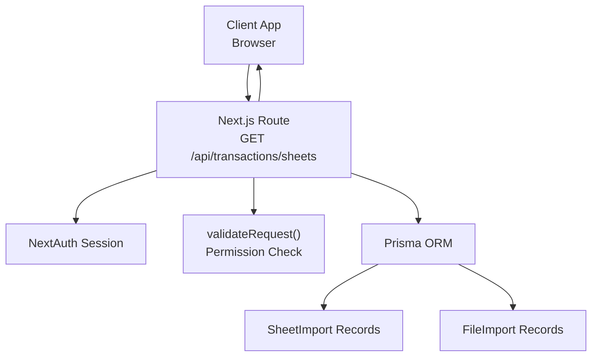
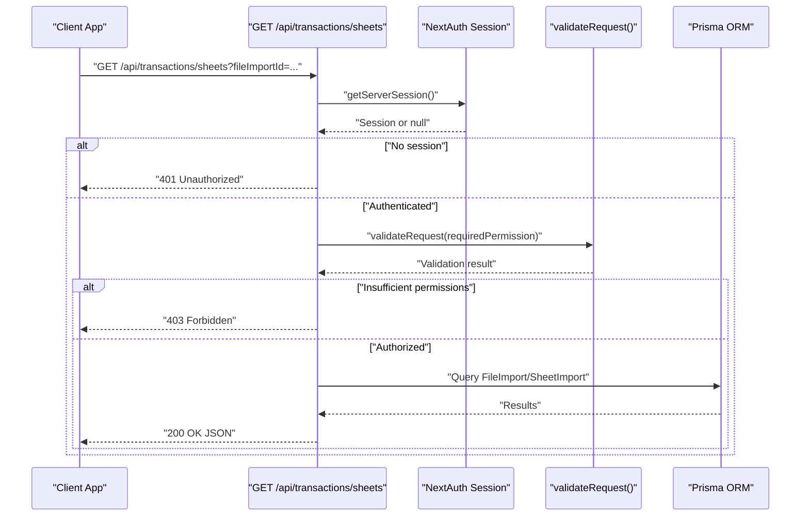
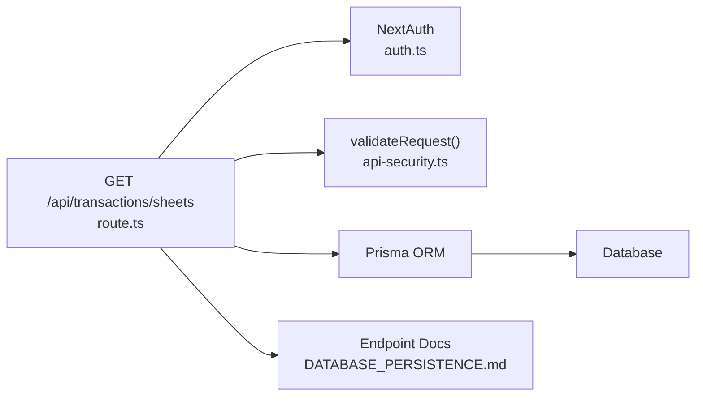

# Transaction Sheets API

<cite>
**Referenced Files in This Document**
- [route.ts](file://app/api/transactions/sheets/route.ts)
- [api-security.ts](file://lib/api-security.ts)
- [auth.ts](file://lib/auth.ts)
- [types.ts](file://lib/types.ts)
- [constants.ts](file://lib/constants.ts)
- [excel-import.ts](file://lib/excel-import.ts)
- [FileSheetSelector.tsx](file://components/FileSheetSelector.tsx)
- [AUTO_LOAD_SHEET_DATA.md](file://docs/AUTO_LOAD_SHEET_DATA.md)
- [DATABASE_PERSISTENCE.md](file://docs/DATABASE_PERSISTENCE.md)
</cite>

## Table of Contents
1. [Introduction](#introduction)
2. [Project Structure](#project-structure)
3. [Core Components](#core-components)
4. [Architecture Overview](#architecture-overview)
5. [Detailed Component Analysis](#detailed-component-analysis)
6. [Dependency Analysis](#dependency-analysis)
7. [Performance Considerations](#performance-considerations)
8. [Troubleshooting Guide](#troubleshooting-guide)
9. [Conclusion](#conclusion)

## Introduction
This document provides API documentation for the transaction sheets endpoint at /api/transactions/sheets. It covers the GET method, query parameters, authentication and authorization requirements, response formats, and implementation details. It also explains how the FileSheetSelector component uses this endpoint to populate the sheet selection dropdown during import and reconciliation workflows. Security considerations, performance characteristics for large Excel files, and troubleshooting guidance are included.

## Project Structure
The sheets endpoint is implemented as a Next.js route under the transactions API namespace. Authentication is handled via NextAuth, and request validation uses a reusable security utility. The Excel parsing logic resides in a shared library, and the UI component that consumes the endpoint is located in the components directory.

**Diagram sources**
- [route.ts](file://app/api/transactions/sheets/route.ts#L1-L166)
- [api-security.ts](file://lib/api-security.ts#L71-L116)
- [auth.ts](file://lib/auth.ts#L1-L225)

**Section sources**
- [route.ts](file://app/api/transactions/sheets/route.ts#L1-L166)

## Core Components
- Endpoint: GET /api/transactions/sheets
- Query parameters:
  - fileImportId: Optional. Filters sheets by a specific file import ID.
  - sheetId: Optional. Returns a single sheet with its transactions.
- Authentication: Requires a valid NextAuth session.
- Authorization: Uses validateRequest with a required permission. The endpoint enforces permission checks via the validateRequest utility.
- Response formats:
  - 200 OK: JSON with success flag and data payload.
  - 400 Bad Request: Returned when invalid parameters cause failures in downstream processing.
  - 401 Unauthorized: Returned when the user is not authenticated.
  - 403 Forbidden: Returned when the user lacks the required permission.
  - 404 Not Found: Returned when a requested sheet does not exist.
  - 500 Internal Server Error: Returned on unexpected errors.

Implementation highlights:
- The endpoint retrieves data from the database using Prisma.
- It supports listing all imports, filtering by fileImportId, and retrieving a specific sheet with transactions.
- The Excel parsing logic in the shared library demonstrates streaming-friendly operations using xlsx utils for reading and converting sheets to arrays.

**Section sources**
- [route.ts](file://app/api/transactions/sheets/route.ts#L1-L166)
- [api-security.ts](file://lib/api-security.ts#L71-L116)
- [excel-import.ts](file://lib/excel-import.ts#L264-L303)

## Architecture Overview
The sheets endpoint orchestrates authentication, permission validation, and data retrieval from the database. It returns structured data representing file imports and their associated sheets, enabling UI components to present selectable sheets and metadata.

**Diagram sources**
- [route.ts](file://app/api/transactions/sheets/route.ts#L1-L166)
- [api-security.ts](file://lib/api-security.ts#L71-L116)
- [auth.ts](file://lib/auth.ts#L1-L225)

## Detailed Component Analysis

### Endpoint Definition and Behavior
- Method: GET
- Path: /api/transactions/sheets
- Query parameters:
  - fileImportId: Optional. Returns sheets belonging to a specific file import.
  - sheetId: Optional. Returns a single sheet with its transactions and metadata.
- Authentication and authorization:
  - Authentication: Requires a valid NextAuth session.
  - Authorization: Enforced via validateRequest with a required permission. The endpoint uses validateRequest to check permissions and returns appropriate HTTP status codes.
- Response:
  - 200 OK: JSON with success flag and data payload. The payload varies depending on the query parameters:
    - Without parameters: Array of file imports, each containing sheet summaries.
    - With fileImportId: Array of sheets for that file import, including counts and metadata.
    - With sheetId: Single sheet object with categorized transactions and metadata.
  - 400 Bad Request: Returned when downstream processing fails due to invalid parameters.
  - 401 Unauthorized: Returned when the user is not authenticated.
  - 403 Forbidden: Returned when the user lacks the required permission.
  - 404 Not Found: Returned when a requested sheet does not exist.
  - 500 Internal Server Error: Returned on unexpected errors.

Security and validation:
- The endpoint relies on NextAuth for session management and on validateRequest for permission checks.
- validateRequest extracts client IP and device fingerprint for audit logging and returns either a user object or an error with an HTTP status code.

**Section sources**
- [route.ts](file://app/api/transactions/sheets/route.ts#L1-L166)
- [api-security.ts](file://lib/api-security.ts#L71-L116)
- [auth.ts](file://lib/auth.ts#L1-L225)
- [types.ts](file://lib/types.ts#L11-L16)
- [constants.ts](file://lib/constants.ts#L24-L49)

### Implementation Notes on Excel Parsing
While the sheets endpoint primarily reads persisted data from the database, the shared Excel parsing library demonstrates streaming-friendly operations:
- Uses xlsx utils to convert sheets to arrays for metadata extraction and transaction parsing.
- Processes sheets in memory using sheet_to_json with header normalization.
- Applies filters to detect valid account sheets and skips summary rows.

These patterns illustrate how the system minimizes memory overhead by focusing on structured conversions and targeted parsing rather than loading entire workbooks into memory unnecessarily.

**Section sources**
- [excel-import.ts](file://lib/excel-import.ts#L264-L303)

### UI Integration: FileSheetSelector Component
The FileSheetSelector component integrates with the sheets endpoint to populate the sheet selection dropdown during import and reconciliation workflows:
- It renders a file selector and a sheet selector.
- When a file is selected, it fetches available sheets from the endpoint and populates the sheet dropdown.
- It displays sheet metadata and loading indicators during asynchronous operations.
- The component’s props and rendering logic enable seamless integration with the backend.

Usage example references:
- The component’s props define importedFiles, selectedFileId, selectedSheetId, availableSheets, isLoading, and sheetMetadata, aligning with the endpoint’s data shape.
- The component’s UI and behavior are documented in the project’s documentation.

**Section sources**
- [FileSheetSelector.tsx](file://components/FileSheetSelector.tsx#L1-L114)
- [AUTO_LOAD_SHEET_DATA.md](file://docs/AUTO_LOAD_SHEET_DATA.md#L1-L223)

### API Workflows and Data Shapes
The endpoint supports three primary workflows:
- Listing all imports: Returns an array of file imports with sheet summaries.
- Listing sheets for a specific file: Returns an array of sheets for a given fileImportId.
- Retrieving a specific sheet with transactions: Returns a single sheet object with categorized transactions and metadata.

The response shapes are defined in the endpoint and documented in the project’s documentation.

**Section sources**
- [route.ts](file://app/api/transactions/sheets/route.ts#L1-L166)
- [DATABASE_PERSISTENCE.md](file://docs/DATABASE_PERSISTENCE.md#L110-L216)

## Dependency Analysis
The sheets endpoint depends on:
- NextAuth for session management.
- validateRequest for permission validation.
- Prisma ORM for database queries.
- Excel parsing utilities for reference on streaming-friendly operations.

**Diagram sources**
- [route.ts](file://app/api/transactions/sheets/route.ts#L1-L166)
- [api-security.ts](file://lib/api-security.ts#L71-L116)
- [auth.ts](file://lib/auth.ts#L1-L225)
- [DATABASE_PERSISTENCE.md](file://docs/DATABASE_PERSISTENCE.md#L110-L216)

**Section sources**
- [route.ts](file://app/api/transactions/sheets/route.ts#L1-L166)
- [api-security.ts](file://lib/api-security.ts#L71-L116)
- [auth.ts](file://lib/auth.ts#L1-L225)
- [DATABASE_PERSISTENCE.md](file://docs/DATABASE_PERSISTENCE.md#L110-L216)

## Performance Considerations
- Memory usage: The endpoint retrieves persisted data from the database rather than parsing Excel files on demand. This avoids heavy memory usage typical of reading entire workbooks.
- Network latency: The endpoint returns aggregated data for file imports and sheets, minimizing round-trips for UI rendering.
- Client-side caching: The project’s documentation suggests potential client-side caching enhancements for auto-loaded sheet data to reduce repeated network requests.
- Large datasets: For very large Excel files, the import pipeline uses xlsx utils to convert sheets to arrays efficiently. The sheets endpoint itself focuses on returning stored metadata and counts, keeping processing lightweight.

**Section sources**
- [excel-import.ts](file://lib/excel-import.ts#L264-L303)
- [AUTO_LOAD_SHEET_DATA.md](file://docs/AUTO_LOAD_SHEET_DATA.md#L175-L197)

## Troubleshooting Guide
Common issues and resolutions:
- Empty sheet lists:
  - Cause: No file imports exist or the file does not contain any valid sheets.
  - Resolution: Verify that Excel files were imported successfully and that they contain sheets meeting the validation criteria.
- Parsing errors on corrupted files:
  - Cause: Corrupted or malformed Excel files.
  - Resolution: Re-upload a valid Excel file and ensure it follows the expected structure.
- Permission denied (403):
  - Cause: Insufficient permissions.
  - Resolution: Ensure the user has the required permission enforced by validateRequest.
- Unauthorized (401):
  - Cause: Missing or invalid NextAuth session.
  - Resolution: Authenticate the user and ensure the session is active.
- Not found (404):
  - Cause: Requested sheetId does not exist.
  - Resolution: Confirm the sheetId is valid and corresponds to an existing sheet.

**Section sources**
- [route.ts](file://app/api/transactions/sheets/route.ts#L1-L166)
- [api-security.ts](file://lib/api-security.ts#L71-L116)

## Conclusion
The /api/transactions/sheets endpoint provides a robust mechanism to list file imports, filter sheets by file, and retrieve a specific sheet with its transactions. It enforces authentication and permission checks, returns structured JSON responses, and integrates seamlessly with UI components like FileSheetSelector. While the endpoint itself focuses on persisted data, the shared Excel parsing library demonstrates efficient, streaming-friendly operations that inform best practices for handling large Excel files during import.