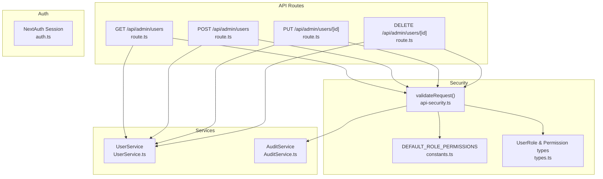
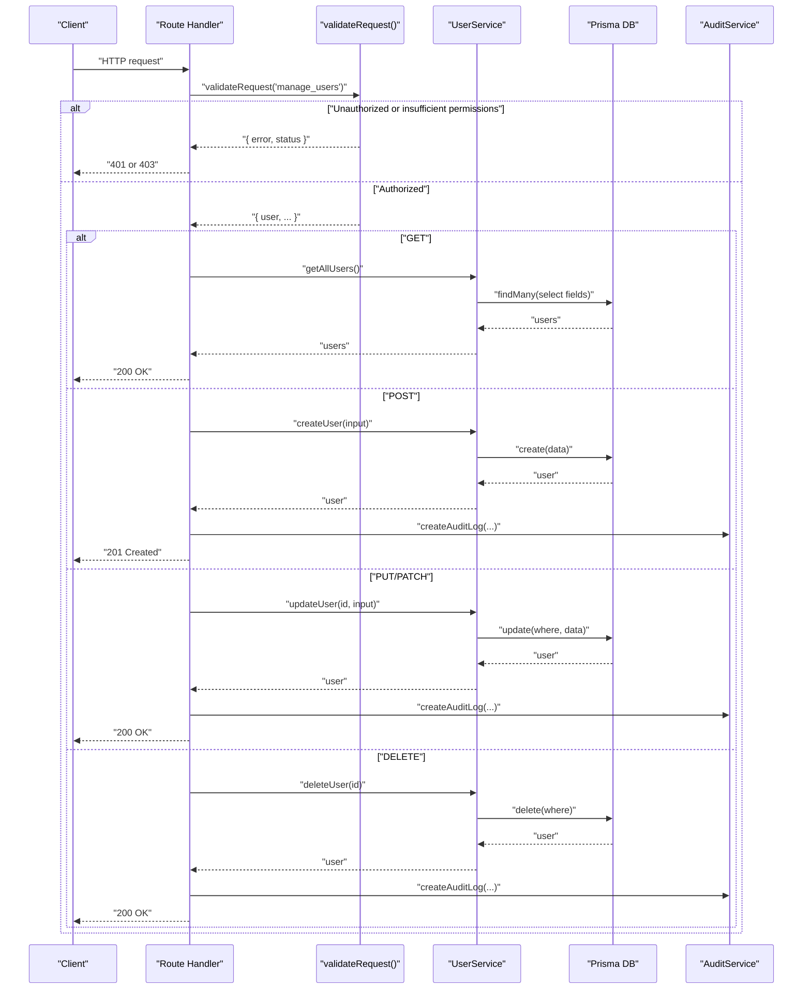
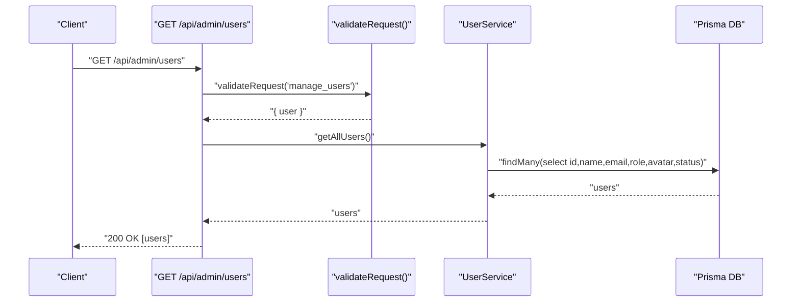
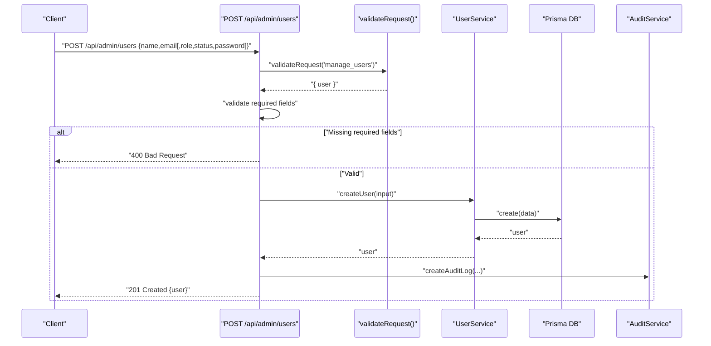
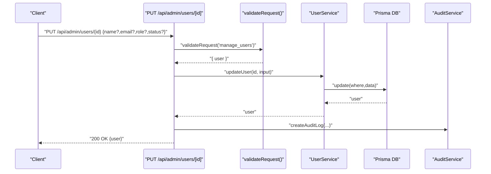
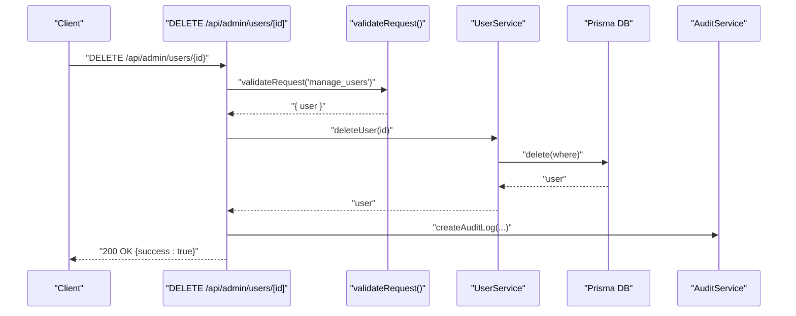
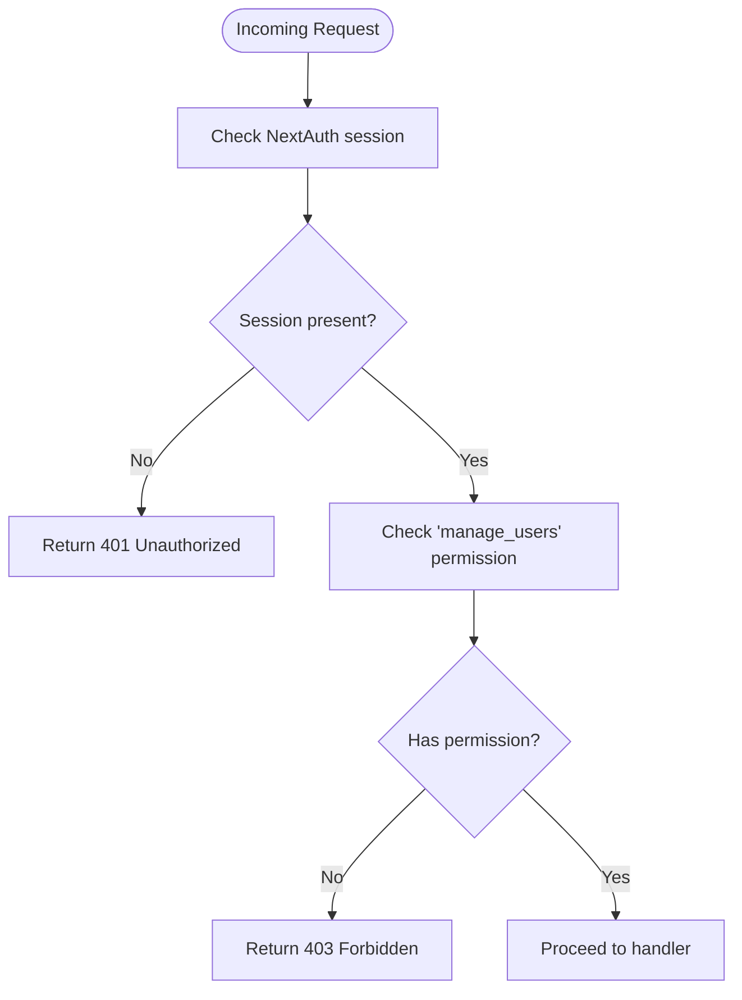
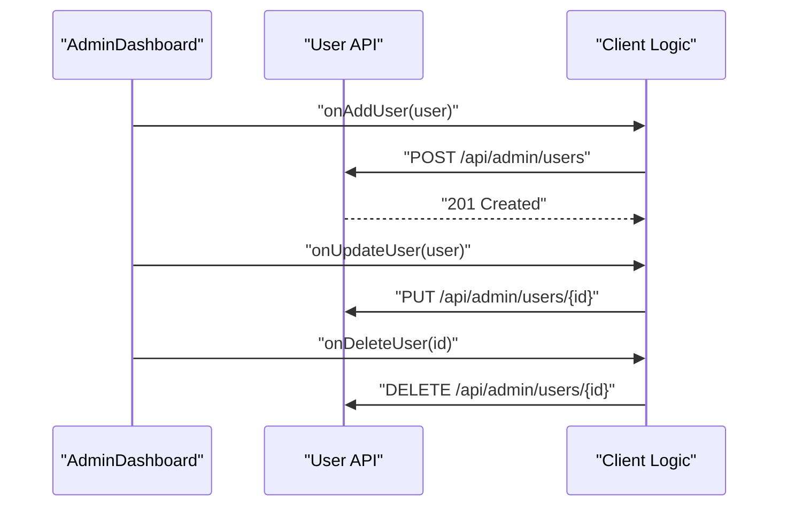
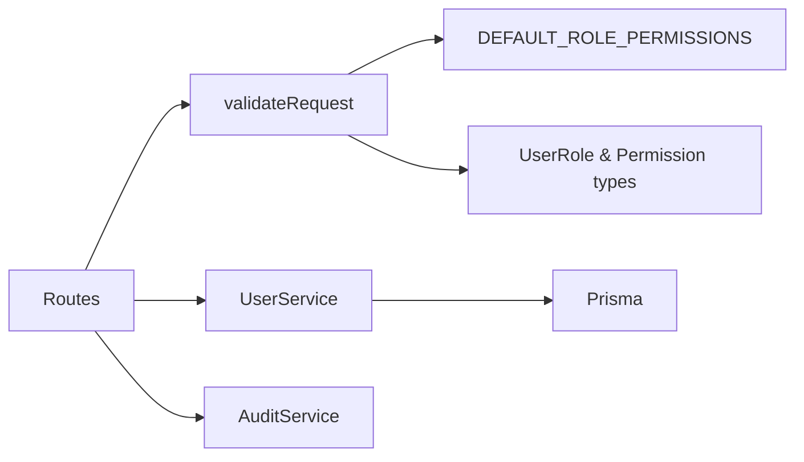

# User Management API

<cite>
**Referenced Files in This Document**
- [route.ts](file://app/api/admin/users/route.ts)
- [route.ts](file://app/api/admin/users/[id]/route.ts)
- [api-security.ts](file://lib/api-security.ts)
- [constants.ts](file://lib/constants.ts)
- [types.ts](file://lib/types.ts)
- [UserService.ts](file://services/UserService.ts)
- [AuditService.ts](file://services/AuditService.ts)
- [ReconcileProApp.tsx](file://components/ReconcileProApp.tsx)
- [AdminDashboard.tsx](file://components/AdminDashboard.tsx)
- [auth.ts](file://lib/auth.ts)
</cite>

## Table of Contents
1. [Introduction](#introduction)
2. [Project Structure](#project-structure)
3. [Core Components](#core-components)
4. [Architecture Overview](#architecture-overview)
5. [Detailed Component Analysis](#detailed-component-analysis)
6. [Dependency Analysis](#dependency-analysis)
7. [Performance Considerations](#performance-considerations)
8. [Troubleshooting Guide](#troubleshooting-guide)
9. [Conclusion](#conclusion)
10. [Appendices](#appendices)

## Introduction
This document provides comprehensive API documentation for the user management endpoints under /api/admin/users. It covers:
- HTTP methods: GET for listing users, POST for creating users, PUT/PATCH for updating users, and DELETE for soft-deleting users
- Authentication and authorization using validateRequest with ADMIN-level permissions
- Request/response schemas and status codes
- Security considerations including audit logging, privilege checks, and input sanitization
- Client integration guidance for AdminDashboard and ReconcileProApp components
- Performance optimization tips

## Project Structure
The user management API is implemented as Next.js App Router API routes:
- GET /api/admin/users: List users
- POST /api/admin/users: Create a new user
- PUT /api/admin/users/[id]: Update a user
- DELETE /api/admin/users/[id]: Delete a user

**Diagram sources**
- [route.ts](file://app/api/admin/users/route.ts#L1-L71)
- [route.ts](file://app/api/admin/users/[id]/route.ts#L1-L51)
- [api-security.ts](file://lib/api-security.ts#L71-L116)
- [constants.ts](file://lib/constants.ts#L24-L50)
- [types.ts](file://lib/types.ts#L11-L39)
- [UserService.ts](file://services/UserService.ts#L1-L213)
- [AuditService.ts](file://services/AuditService.ts#L1-L264)
- [auth.ts](file://lib/auth.ts#L1-L225)

**Section sources**
- [route.ts](file://app/api/admin/users/route.ts#L1-L71)
- [route.ts](file://app/api/admin/users/[id]/route.ts#L1-L51)
- [api-security.ts](file://lib/api-security.ts#L71-L116)
- [constants.ts](file://lib/constants.ts#L24-L50)
- [types.ts](file://lib/types.ts#L11-L39)
- [UserService.ts](file://services/UserService.ts#L1-L213)
- [AuditService.ts](file://services/AuditService.ts#L1-L264)
- [auth.ts](file://lib/auth.ts#L1-L225)

## Core Components
- API routes implement GET, POST, PUT, and DELETE for user management
- validateRequest enforces authentication and permission checks
- DEFAULT_ROLE_PERMISSIONS defines ADMIN-level manage_users permission
- UserService encapsulates user CRUD operations
- AuditService logs administrative actions for compliance and auditing
- Client components integrate with these endpoints for user management

**Section sources**
- [route.ts](file://app/api/admin/users/route.ts#L1-L71)
- [route.ts](file://app/api/admin/users/[id]/route.ts#L1-L51)
- [api-security.ts](file://lib/api-security.ts#L71-L116)
- [constants.ts](file://lib/constants.ts#L24-L50)
- [UserService.ts](file://services/UserService.ts#L1-L213)
- [AuditService.ts](file://services/AuditService.ts#L1-L264)

## Architecture Overview
The API follows a layered architecture:
- Route handlers validate permissions and parse requests
- Services perform data operations
- AuditService records changes for traceability
- NextAuth manages sessions and user identity

**Diagram sources**
- [route.ts](file://app/api/admin/users/route.ts#L1-L71)
- [route.ts](file://app/api/admin/users/[id]/route.ts#L1-L51)
- [api-security.ts](file://lib/api-security.ts#L71-L116)
- [UserService.ts](file://services/UserService.ts#L1-L213)
- [AuditService.ts](file://services/AuditService.ts#L1-L264)

## Detailed Component Analysis

### Endpoint: GET /api/admin/users
- Purpose: Retrieve a list of all users with essential fields
- Authentication: ADMIN-level manage_users required
- Response: 200 OK with array of user objects
- Schema (selected fields):
  - id: string
  - name: string
  - email: string
  - role: "ADMIN" | "MANAGER" | "ANALYST" | "AUDITOR"
  - avatar: string
  - status: "active" | "inactive" | "locked"

**Diagram sources**
- [route.ts](file://app/api/admin/users/route.ts#L1-L26)
- [UserService.ts](file://services/UserService.ts#L78-L107)

**Section sources**
- [route.ts](file://app/api/admin/users/route.ts#L1-L26)
- [UserService.ts](file://services/UserService.ts#L78-L107)
- [api-security.ts](file://lib/api-security.ts#L71-L116)
- [constants.ts](file://lib/constants.ts#L24-L50)
- [types.ts](file://lib/types.ts#L11-L39)

### Endpoint: POST /api/admin/users
- Purpose: Create a new user
- Authentication: ADMIN-level manage_users required
- Request body (JSON):
  - Required: name, email
  - Optional: role, status, password
  - Notes: role defaults to "ANALYST"; status defaults to "active"; password defaults to a temporary value if omitted
- Response: 201 Created with created user object
- Status codes:
  - 201 Created on success
  - 400 Bad Request if missing required fields
  - 403 Forbidden if insufficient permissions
  - 500 Internal Server Error on failure

**Diagram sources**
- [route.ts](file://app/api/admin/users/route.ts#L28-L71)
- [UserService.ts](file://services/UserService.ts#L31-L50)
- [AuditService.ts](file://services/AuditService.ts#L33-L72)

**Section sources**
- [route.ts](file://app/api/admin/users/route.ts#L28-L71)
- [UserService.ts](file://services/UserService.ts#L31-L50)
- [AuditService.ts](file://services/AuditService.ts#L33-L72)
- [api-security.ts](file://lib/api-security.ts#L71-L116)
- [constants.ts](file://lib/constants.ts#L24-L50)
- [types.ts](file://lib/types.ts#L11-L39)

### Endpoint: PUT /api/admin/users/[id]
- Purpose: Update an existing user’s details (name, email, role, status)
- Authentication: ADMIN-level manage_users required
- Path parameter: id (string)
- Request body (JSON):
  - Optional: name, email, role, status
- Response: 200 OK with updated user object
- Status codes:
  - 200 OK on success
  - 403 Forbidden if insufficient permissions
  - 500 Internal Server Error on failure

**Diagram sources**
- [route.ts](file://app/api/admin/users/[id]/route.ts#L1-L36)
- [UserService.ts](file://services/UserService.ts#L112-L121)
- [AuditService.ts](file://services/AuditService.ts#L33-L72)

**Section sources**
- [route.ts](file://app/api/admin/users/[id]/route.ts#L1-L36)
- [UserService.ts](file://services/UserService.ts#L112-L121)
- [AuditService.ts](file://services/AuditService.ts#L33-L72)
- [api-security.ts](file://lib/api-security.ts#L71-L116)
- [constants.ts](file://lib/constants.ts#L24-L50)
- [types.ts](file://lib/types.ts#L11-L39)

### Endpoint: DELETE /api/admin/users/[id]
- Purpose: Delete a user (soft-delete behavior depends on service implementation)
- Authentication: ADMIN-level manage_users required
- Path parameter: id (string)
- Response: 200 OK with success indicator
- Status codes:
  - 200 OK on success
  - 403 Forbidden if insufficient permissions
  - 500 Internal Server Error on failure

**Diagram sources**
- [route.ts](file://app/api/admin/users/[id]/route.ts#L38-L51)
- [UserService.ts](file://services/UserService.ts#L123-L134)
- [AuditService.ts](file://services/AuditService.ts#L33-L72)

**Section sources**
- [route.ts](file://app/api/admin/users/[id]/route.ts#L38-L51)
- [UserService.ts](file://services/UserService.ts#L123-L134)
- [AuditService.ts](file://services/AuditService.ts#L33-L72)
- [api-security.ts](file://lib/api-security.ts#L71-L116)
- [constants.ts](file://lib/constants.ts#L24-L50)
- [types.ts](file://lib/types.ts#L11-L39)

### Request/Response Schemas
- GET /api/admin/users
  - Response: Array of user objects with fields: id, name, email, role, avatar, status
- POST /api/admin/users
  - Request: { name, email, role?, status?, password? }
  - Response: Single user object with fields: id, name, email, role, avatar, status
- PUT /api/admin/users/[id]
  - Request: { name?, email?, role?, status? }
  - Response: Single user object with fields: id, name, email, role, avatar, status
- DELETE /api/admin/users/[id]
  - Response: { success: true }

Notes:
- Role values: "ADMIN", "MANAGER", "ANALYST", "AUDITOR"
- Status values: "active", "inactive", "locked"
- Avatar is derived from name initials if not provided

**Section sources**
- [route.ts](file://app/api/admin/users/route.ts#L1-L71)
- [route.ts](file://app/api/admin/users/[id]/route.ts#L1-L51)
- [UserService.ts](file://services/UserService.ts#L1-L213)
- [types.ts](file://lib/types.ts#L11-L39)

### Authentication and Authorization
- Authentication: NextAuth session required
- Authorization: validateRequest checks DEFAULT_ROLE_PERMISSIONS for "manage_users"
- Roles and permissions are defined centrally

**Diagram sources**
- [api-security.ts](file://lib/api-security.ts#L71-L116)
- [constants.ts](file://lib/constants.ts#L24-L50)
- [auth.ts](file://lib/auth.ts#L1-L225)

**Section sources**
- [api-security.ts](file://lib/api-security.ts#L71-L116)
- [constants.ts](file://lib/constants.ts#L24-L50)
- [types.ts](file://lib/types.ts#L11-L39)
- [auth.ts](file://lib/auth.ts#L1-L225)

### Security Considerations
- Audit logging: Every change triggers AuditService.createAuditLog with actionType, entityType, entityId, and changeSummary
- Privilege escalation protection: validateRequest ensures ADMIN-level manage_users for all user management operations
- Input sanitization: While explicit sanitization is not shown in the routes, client components derive avatar from name and enforce required fields; consider adding server-side validation for email uniqueness and role/status enums
- Rate limiting: api-security.ts includes a basic in-memory rate limiter; consider upgrading to a distributed store for multi-instance deployments

**Section sources**
- [AuditService.ts](file://services/AuditService.ts#L33-L72)
- [api-security.ts](file://lib/api-security.ts#L121-L156)
- [route.ts](file://app/api/admin/users/route.ts#L1-L71)
- [route.ts](file://app/api/admin/users/[id]/route.ts#L1-L51)

### Client Implementation Guidelines
- AdminDashboard integration:
  - Uses a modal to add/edit users and calls the API endpoints
  - Filters users by name and displays role/status
- ReconcileProApp integration:
  - Adds users via POST /api/admin/users
  - Updates users via PUT /api/admin/users/[id]
  - Deletes users via DELETE /api/admin/users/[id]
  - Checks permissions before invoking endpoints

**Diagram sources**
- [AdminDashboard.tsx](file://components/AdminDashboard.tsx#L1-L211)
- [ReconcileProApp.tsx](file://components/ReconcileProApp.tsx#L847-L910)

**Section sources**
- [AdminDashboard.tsx](file://components/AdminDashboard.tsx#L1-L211)
- [ReconcileProApp.tsx](file://components/ReconcileProApp.tsx#L847-L910)

## Dependency Analysis
- Route handlers depend on validateRequest for authorization
- Services encapsulate Prisma operations and expose typed interfaces
- AuditService is invoked by route handlers to log changes
- Types define user roles and permissions centrally

**Diagram sources**
- [route.ts](file://app/api/admin/users/route.ts#L1-L71)
- [route.ts](file://app/api/admin/users/[id]/route.ts#L1-L51)
- [api-security.ts](file://lib/api-security.ts#L71-L116)
- [constants.ts](file://lib/constants.ts#L24-L50)
- [types.ts](file://lib/types.ts#L11-L39)
- [UserService.ts](file://services/UserService.ts#L1-L213)
- [AuditService.ts](file://services/AuditService.ts#L1-L264)

**Section sources**
- [route.ts](file://app/api/admin/users/route.ts#L1-L71)
- [route.ts](file://app/api/admin/users/[id]/route.ts#L1-L51)
- [api-security.ts](file://lib/api-security.ts#L71-L116)
- [constants.ts](file://lib/constants.ts#L24-L50)
- [types.ts](file://lib/types.ts#L11-L39)
- [UserService.ts](file://services/UserService.ts#L1-L213)
- [AuditService.ts](file://services/AuditService.ts#L1-L264)

## Performance Considerations
- Pagination and filtering: The current GET endpoint retrieves all users. For large datasets, implement pagination and filtering in the route handler and/or UserService
- Caching: Cache user lists on the client-side to reduce network requests; invalidate cache on write operations
- Batching updates: Group multiple updates into fewer requests where feasible
- Indexes: Ensure database indexes exist on frequently queried fields (e.g., email, role, status)
- Rate limiting: Upgrade the in-memory rate limiter to a distributed store for multi-instance deployments

[No sources needed since this section provides general guidance]

## Troubleshooting Guide
- 401 Unauthorized: Ensure the client sends a valid NextAuth session cookie
- 403 Forbidden: Confirm the user has ADMIN role with manage_users permission
- 400 Bad Request (POST): Provide required fields: name and email
- 500 Internal Server Error: Check server logs; verify database connectivity and uniqueness constraints

**Section sources**
- [api-security.ts](file://lib/api-security.ts#L71-L116)
- [route.ts](file://app/api/admin/users/route.ts#L1-L71)
- [route.ts](file://app/api/admin/users/[id]/route.ts#L1-L51)

## Conclusion
The user management API provides a secure, auditable interface for administrators to manage users. It enforces ADMIN-level permissions, logs all changes, and integrates cleanly with client components. Extending the GET endpoint with pagination and filtering, and upgrading rate limiting, will improve scalability and robustness.

[No sources needed since this section summarizes without analyzing specific files]

## Appendices

### Example Workflows

#### Fetch all users
- Method: GET
- URL: /api/admin/users
- Expected response: 200 OK with array of user objects

**Section sources**
- [route.ts](file://app/api/admin/users/route.ts#L1-L26)

#### Update a user’s role from ANALYST to MANAGER
- Method: PUT
- URL: /api/admin/users/{id}
- Body: { role: "MANAGER" }
- Expected response: 200 OK with updated user object

**Section sources**
- [route.ts](file://app/api/admin/users/[id]/route.ts#L1-L36)
- [types.ts](file://lib/types.ts#L11-L39)

### Client Integration Tips
- AdminDashboard:
  - Use modal forms to collect name, email, role, status
  - Call the appropriate API endpoints on submit
- ReconcileProApp:
  - Check hasPermission('manage_users') before invoking API
  - Update local state after successful API responses
  - Add audit logs for user management actions

**Section sources**
- [AdminDashboard.tsx](file://components/AdminDashboard.tsx#L1-L211)
- [ReconcileProApp.tsx](file://components/ReconcileProApp.tsx#L847-L910)