# Audit and Compliance

<cite>
**Referenced Files in This Document**   
- [AuditService.ts](file://services/AuditService.ts)
- [AuditLogModal.tsx](file://components/AuditLogModal.tsx)
- [UserService.ts](file://services/UserService.ts)
- [MatchService.ts](file://services/MatchService.ts)
- [auth.ts](file://lib/auth.ts)
- [schema.prisma](file://prisma/schema.prisma)
- [IMPLEMENTATION_COMPLETE.md](file://docs/IMPLEMENTATION_COMPLETE.md)
</cite>

## Table of Contents
1. [Immutable Audit Logging Implementation](#immutable-audit-logging-implementation)
2. [Cryptographic Hash Chaining](#cryptographic-hash-chaining)
3. [Audit Event Generation](#audit-event-generation)
4. [Tamper Detection Mechanism](#tamper-detection-mechanism)
5. [Audit Log User Interface](#audit-log-user-interface)
6. [Business Rules and Policies](#business-rules-and-policies)
7. [Code Implementation Examples](#code-implementation-examples)
8. [Performance and Scalability](#performance-and-scalability)
9. [Compliance Considerations](#compliance-considerations)

## Immutable Audit Logging Implementation

The analyzer-web application implements a comprehensive audit and compliance system centered around the AuditService, which ensures that all critical operations are permanently recorded in an immutable audit trail. The system is built on the AuditLog model defined in the Prisma schema, which captures essential information for each audit event including timestamp, user ID, action type, entity type, and entity ID.

The audit logging system follows a write-once principle where audit records cannot be modified or deleted after creation, ensuring the integrity of the audit trail. Each audit log entry is stored in the AuditLog table with comprehensive metadata that enables forensic analysis and compliance reporting. The system captures a wide range of action types including CREATE, UPDATE, DELETE, APPROVE, IMPORT, EXPORT, LOGIN, LOGOUT, MATCH, and UNMATCH operations across various entity types such as TRANSACTION, MATCH, USER, ROLE, PERIOD, SNAPSHOT, and FILE_IMPORT.

The implementation ensures that audit logging is integrated at the service layer, with the AuditService providing a centralized interface for creating and retrieving audit logs. This design pattern ensures consistent audit logging across the application and prevents audit gaps that could occur with decentralized logging implementations.

**Section sources**
- [AuditService.ts](file://services/AuditService.ts#L1-L263)
- [schema.prisma](file://prisma/schema.prisma#L158-L192)

## Cryptographic Hash Chaining

The audit system implements cryptographic hash chaining to prevent tampering and ensure the integrity of the audit trail. This security mechanism creates an immutable chain of audit records where each log entry contains a hash that incorporates the previous log's hash, forming a cryptographic link between consecutive entries.

The hash chaining implementation uses SHA-256 cryptographic hashing algorithm to generate unique fingerprints for each audit log entry. When a new audit log is created, the system retrieves the current hash from the most recent log entry and uses it as input for calculating the new entry's hash. This creates a dependency between consecutive log entries, making it computationally infeasible to modify any entry in the chain without detection.

The hash calculation includes key attributes of the audit event such as user ID, action type, entity type, entity ID, change summary, previous hash, and timestamp. This comprehensive hashing approach ensures that any modification to the audit log content would result in a hash mismatch, immediately revealing the tampering attempt.

```mermaid
classDiagram
class AuditLog {
+id : string
+timestamp : DateTime
+userId : string
+sessionId : string
+ipAddress : string
+deviceFingerprint : string
+geolocation : string
+actionType : string
+entityType : string
+entityId : string
+beforeState : JSON
+afterState : JSON
+changeSummary : string
+justification : string
+previousHash : string
+currentHash : string
}
AuditLog --> AuditLog : "previousHash → currentHash"
```

**Diagram sources**
- [AuditService.ts](file://services/AuditService.ts#L208-L220)
- [schema.prisma](file://prisma/schema.prisma#L185-L188)

## Audit Event Generation

The system generates audit events for all critical operations throughout the application lifecycle. Each audit event captures comprehensive context about the operation, including the user who performed the action, the session information, network details, and the nature of the change.

Critical operations that trigger audit events include:
- User authentication (login and logout)
- User management (creation, update, deletion)
- Transaction matching and reconciliation
- Data imports and exports
- System configuration changes

For each audit event, the system captures both the before and after states of the affected entity when applicable, enabling detailed change tracking and forensic analysis. The change summary provides a human-readable description of the operation, while the justification field allows users to provide additional context for significant changes.

The audit event generation is implemented synchronously within the service layer to ensure that no operation can complete without a corresponding audit record. This synchronous approach guarantees complete audit coverage but requires careful performance consideration, which is addressed through database indexing and efficient data storage.

**Section sources**
- [AuditService.ts](file://services/AuditService.ts#L9-L22)
- [auth.ts](file://lib/auth.ts#L94-L205)

## Tamper Detection Mechanism

The tamper detection mechanism is a critical security feature that verifies the integrity of the audit log chain by recalculating hashes and comparing them with stored values. This mechanism provides cryptographic proof that the audit trail has not been altered or tampered with.

The verification process works by retrieving all audit logs in chronological order and validating two aspects of each entry (except the first):
1. The previousHash field matches the currentHash of the preceding log entry
2. The currentHash matches the recalculated hash based on the log's content

If either check fails, the system identifies the specific log entry where the chain is broken and provides detailed error information. This allows administrators to detect and investigate potential security breaches or unauthorized modifications to the audit trail.

The verifyAuditChain method in the AuditService performs this validation and returns a comprehensive report indicating whether the chain is valid and listing any detected errors. This functionality can be used for regular integrity checks, compliance audits, or forensic investigations.

**Diagram sources**
- [AuditService.ts](file://services/AuditService.ts#L155-L199)

## Audit Log User Interface

The AuditLogModal component provides a user-friendly interface for viewing and analyzing audit records. This modal interface displays audit logs in chronological order with filtering and search capabilities, enabling users to investigate system activity and compliance events.

The user interface implements role-based access control, where managers can view all audit events while analysts can only see their own actions. This ensures that sensitive audit information is appropriately restricted based on user permissions. The interface displays key information for each audit event including timestamp, user, action type, and change details in a tabular format optimized for readability.

The modal includes filtering capabilities that allow users to narrow down audit records by date range, user, action type, or entity type. This enables targeted investigations and reduces information overload when dealing with extensive audit trails. The interface also provides summary statistics about user activity, helping administrators quickly assess system usage patterns.

**Section sources**
- [AuditLogModal.tsx](file://components/AuditLogModal.tsx#L1-L93)
- [types.ts](file://lib/types.ts#L84-L91)

## Business Rules and Policies

The audit and compliance system enforces several critical business rules and policies to ensure data integrity and regulatory compliance:

1. **Write-once logs**: Audit records are immutable and cannot be modified or deleted after creation
2. **Restricted deletion**: No functionality exists to delete audit logs, preventing intentional or accidental loss of audit trail
3. **Session tracking**: All user sessions are tracked through the DeviceSession model, capturing device, IP address, and location information
4. **Comprehensive coverage**: All critical operations generate audit events, ensuring complete activity tracking
5. **Data retention**: Audit logs are retained for the required period to meet regulatory requirements

The system also implements strict access controls for audit data, with only authorized personnel (typically managers and auditors) having access to the complete audit trail. This separation of duties ensures that users cannot cover their tracks by manipulating audit records.

The DeviceSession model complements the audit system by providing detailed session information that can be correlated with audit events. This includes the user's device fingerprint, IP address, geolocation, and session token, enabling comprehensive user activity tracking and anomaly detection.

**Section sources**
- [schema.prisma](file://prisma/schema.prisma#L249-L271)
- [auth.ts](file://lib/auth.ts#L121-L134)

## Code Implementation Examples

The audit logging system is integrated throughout the application, with critical services triggering audit events for important operations. The UserService and MatchService provide clear examples of how audit logging is implemented in practice.

When a new user is created through the UserService, the system automatically generates an audit event with the CREATE action type and USER entity type. The audit record captures the user ID, the administrator who created the account, and a change summary describing the operation. Similarly, when a match group is updated through the MatchService, an audit event is created with the MATCH action type and MATCH entity type, recording the details of the reconciliation.

The authentication system also integrates with the audit service, creating audit events for both successful and failed login attempts. This provides a complete record of authentication activity, which is critical for security monitoring and incident response. Logout events are similarly recorded, providing a complete session lifecycle record.

**Diagram sources**
- [UserService.ts](file://services/UserService.ts#L31-L47)
- [MatchService.ts](file://services/MatchService.ts#L20-L82)
- [auth.ts](file://lib/auth.ts#L137-L144)

## Performance and Scalability

The audit logging system is designed to balance security requirements with performance considerations. While synchronous logging ensures complete audit coverage, it can impact the performance of critical operations, especially during high-volume periods.

To address performance concerns, the system implements several optimization strategies:
- Database indexing on frequently queried fields such as timestamp, userId, and actionType
- Efficient data storage using JSON serialization for beforeState and afterState fields
- Asynchronous audit verification that can be run during off-peak hours
- Regular log rotation and archiving to manage storage requirements

The system also considers storage scalability, with audit logs potentially growing significantly over time in a production environment. Strategies for managing storage include:
- Implementing log rotation policies to archive older records
- Using database partitioning for large audit tables
- Configuring appropriate retention periods based on compliance requirements
- Monitoring storage usage and planning for capacity expansion

These performance and scalability considerations ensure that the audit system remains effective and responsive even as the application grows and handles increasing volumes of transactions and user activity.

**Section sources**
- [schema.prisma](file://prisma/schema.prisma#L189-L191)
- [AuditService.ts](file://services/AuditService.ts#L77-L117)

## Compliance Considerations

The audit and compliance system is designed to meet financial regulatory requirements by providing a complete, secure, and verifiable record of all critical operations. The implementation addresses key compliance requirements including data integrity, non-repudiation, and auditability.

The cryptographic hash chaining provides strong evidence of data integrity, making it extremely difficult to tamper with audit records without detection. This feature is particularly important for financial applications where audit trail integrity is paramount for regulatory compliance and forensic investigations.

The system supports audit trail retention policies by storing all audit records indefinitely or for the required retention period specified by regulatory requirements. The comprehensive nature of the audit logs, including user identification, timestamps, and detailed change descriptions, enables organizations to demonstrate compliance during regulatory audits.

Best practices for audit trail retention include:
- Regular integrity verification of the audit chain
- Secure backup and disaster recovery procedures for audit data
- Access controls to prevent unauthorized access to audit records
- Documentation of audit policies and procedures
- Regular review of audit logs for suspicious activity

These compliance considerations ensure that the analyzer-web application meets the stringent requirements of financial regulations and provides a robust foundation for governance, risk management, and compliance activities.

**Section sources**
- [IMPLEMENTATION_COMPLETE.md](file://docs/IMPLEMENTATION_COMPLETE.md#L72-L84)
- [AuditService.ts](file://services/AuditService.ts#L155-L199)