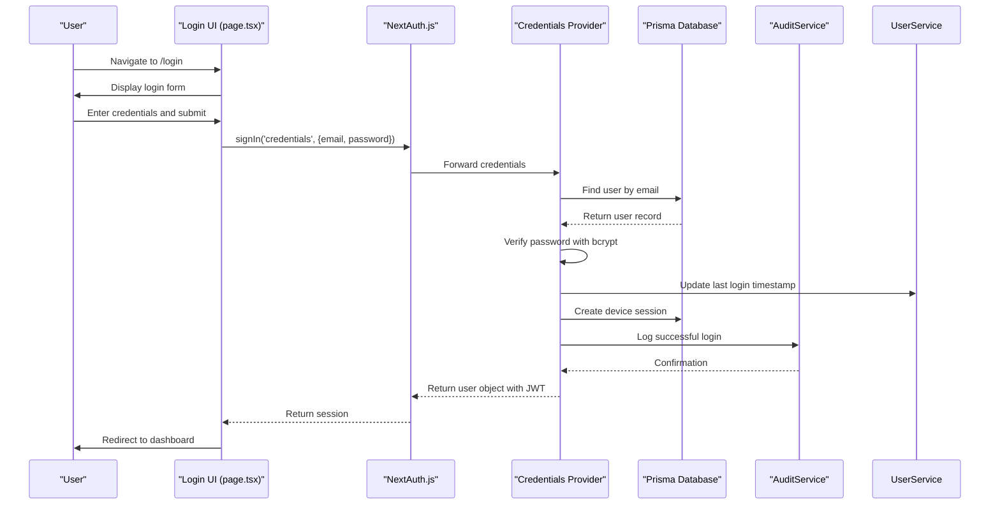
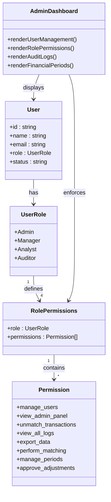
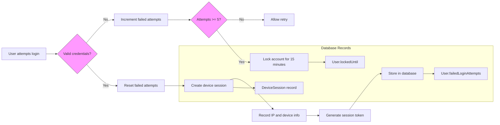
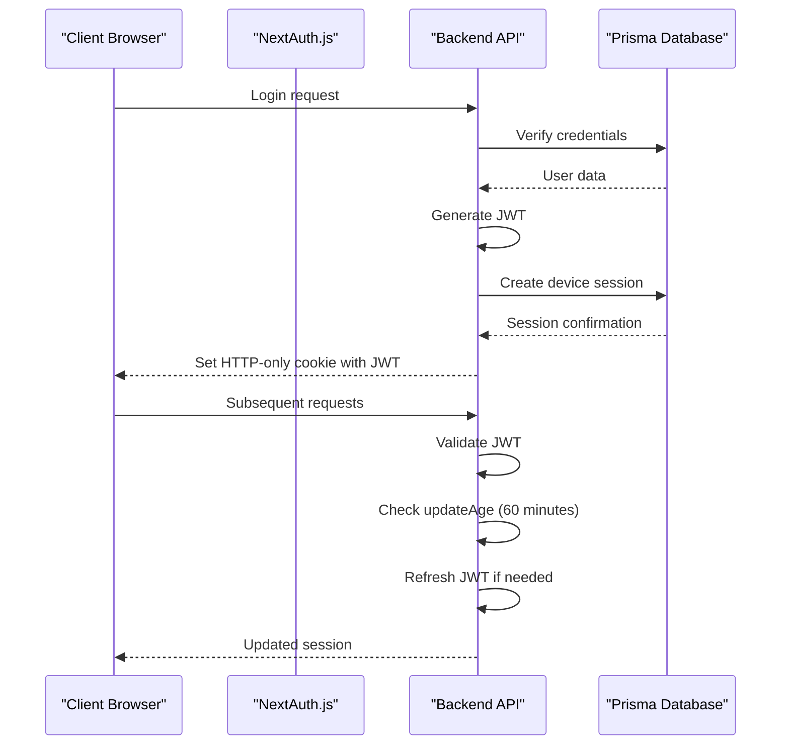
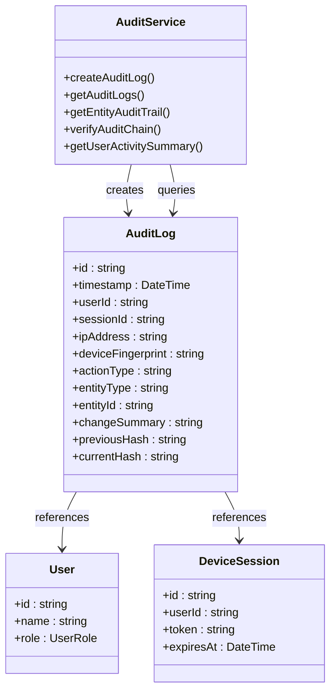
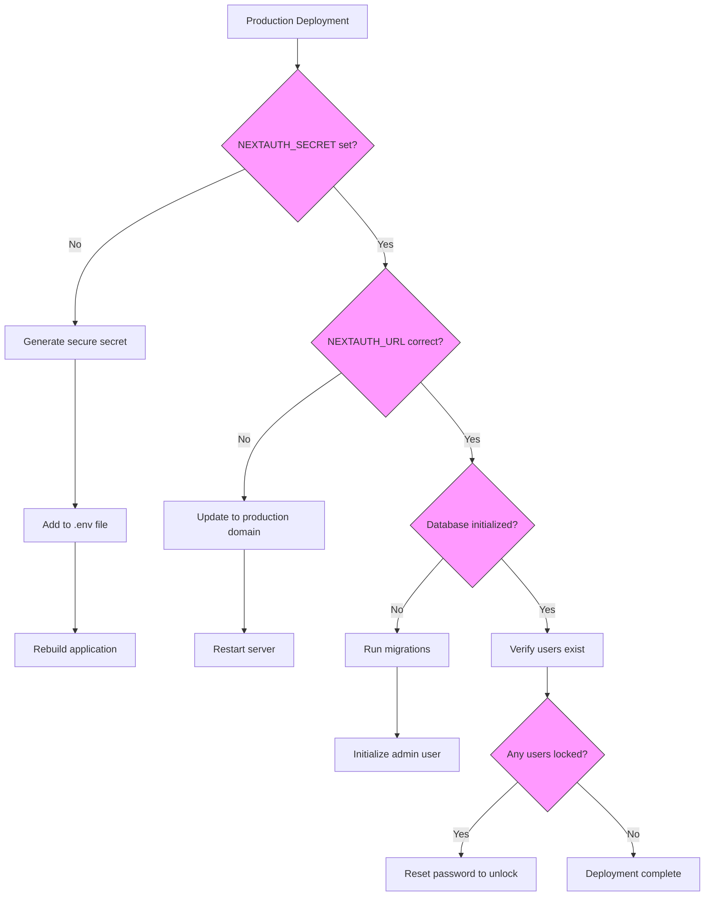

# Authentication and Authorization

<cite>
**Referenced Files in This Document**   
- [app/login/page.tsx](file://app/login/page.tsx)
- [app/api/auth/[...nextauth]/route.ts](file://app/api/auth/[...nextauth]/route.ts)
- [lib/auth.ts](file://lib/auth.ts)
- [lib/constants.ts](file://lib/constants.ts)
- [lib/types.ts](file://lib/types.ts)
- [services/UserService.ts](file://services/UserService.ts)
- [services/AuditService.ts](file://services/AuditService.ts)
- [middleware.ts](file://middleware.ts)
- [components/AdminDashboard.tsx](file://components/AdminDashboard.tsx)
- [prisma/schema.prisma](file://prisma/schema.prisma)
- [PRODUCTION_AUTH_FIX.md](file://PRODUCTION_AUTH_FIX.md)
</cite>

## Table of Contents
1. [Authentication System Overview](#authentication-system-overview)
2. [Login Flow and Credential Validation](#login-flow-and-credential-validation)
3. [Role-Based Access Control](#role-based-access-control)
4. [Security Features](#security-features)
5. [Session Management](#session-management)
6. [Audit Logging](#audit-logging)
7. [Production Deployment Considerations](#production-deployment-considerations)
8. [Performance Optimization](#performance-optimization)

## Authentication System Overview

The analyzer-web application implements a comprehensive authentication and authorization system using NextAuth.js with a credentials provider for database-backed user authentication. The system is built on a JWT-based session management approach with Prisma adapter for persistent user storage.

The authentication flow begins at the `/login/page.tsx` component, which provides a client-side login form that collects user credentials and submits them to the NextAuth.js authentication handler. The system uses bcrypt for password hashing with a cost factor of 12, ensuring strong password security.



**Diagram sources**
- [app/login/page.tsx](file://app/login/page.tsx#L1-L236)
- [app/api/auth/[...nextauth]/route.ts](file://app/api/auth/[...nextauth]/route.ts#L1-L6)
- [lib/auth.ts](file://lib/auth.ts#L27-L225)
- [services/UserService.ts](file://services/UserService.ts#L1-L213)
- [services/AuditService.ts](file://services/AuditService.ts#L1-L264)

**Section sources**
- [app/login/page.tsx](file://app/login/page.tsx#L1-L236)
- [lib/auth.ts](file://lib/auth.ts#L27-L225)
- [prisma/schema.prisma](file://prisma/schema.prisma#L18-L53)

## Login Flow and Credential Validation

The login flow in analyzer-web follows a structured process from the login page to authentication handler, incorporating multiple security checks and validation steps. The process begins with the user accessing the `/login` route, which renders the login form implemented in `page.tsx`.

When the user submits their credentials, the client-side code uses the `signIn` function from NextAuth.js to initiate the authentication process. The credentials are sent to the NextAuth.js API route at `/api/auth/[...nextauth]/route.ts`, which configures the authentication options and handles the request.

The core authentication logic resides in `lib/auth.ts` within the CredentialsProvider's authorize callback. This callback performs several critical validation steps:

1. **Input validation**: Ensures both email and password are provided
2. **Account lockout check**: Verifies if the account is temporarily locked due to failed login attempts
3. **User lookup**: Queries the database for the user record using Prisma
4. **Account status validation**: Checks if the user account is active or locked
5. **Password verification**: Uses bcrypt to compare the provided password with the hashed password stored in the database
6. **Session creation**: Generates a session token and creates a device session record
7. **Audit logging**: Records the login attempt in the audit log

```mermaid
flowchart TD
A[User navigates to /login] --> B[Render login form]
B --> C[User enters credentials]
C --> D[Submit form with signIn()]
D --> E[NextAuth.js API route handler]
E --> F{Credentials valid?}
F --> |No| G[Increment failed attempts]
G --> H{Max attempts reached?}
H --> |Yes| I[Lock account for 15 minutes]
H --> |No| J[Return error to client]
F --> |Yes| K[Reset failed attempts]
K --> L[Update last login timestamp]
L --> M[Generate session token]
M --> N[Create device session record]
N --> O[Generate JWT with user data]
O --> P[Return session to client]
P --> Q[Redirect to dashboard]
style F fill:#f9f,stroke:#333
style H fill:#f9f,stroke:#333
```

**Diagram sources**
- [app/login/page.tsx](file://app/login/page.tsx#L23-L45)
- [lib/auth.ts](file://lib/auth.ts#L44-L166)
- [services/UserService.ts](file://services/UserService.ts#L147-L162)

**Section sources**
- [app/login/page.tsx](file://app/login/page.tsx#L1-L236)
- [lib/auth.ts](file://lib/auth.ts#L44-L166)
- [services/UserService.ts](file://services/UserService.ts#L147-L162)

## Role-Based Access Control

The analyzer-web application implements a robust role-based access control (RBAC) system with four distinct roles: Admin, Manager, Analyst, and Auditor. These roles are defined in the `UserRole` enum in `lib/types.ts` and their associated permissions are configured in `lib/constants.ts`.

The permission system is implemented through a combination of frontend enforcement and backend validation. Each role has a specific set of permissions that determine what actions a user can perform within the application:

- **Admin**: Full system access including user management, role permissions, and financial period control
- **Manager**: Access to transaction matching, unmatching, and approval of high-value adjustments
- **Analyst**: Ability to perform matching actions and export data
- **Auditor**: Read-only access to audit logs and data export capabilities

The AdminDashboard component serves as a practical example of how role-based access control is enforced. It restricts access to user management functions based on the `manage_users` permission, which is only granted to Admin users. The dashboard also displays role permissions in a tabular format, showing which permissions each role possesses.



**Diagram sources**
- [lib/types.ts](file://lib/types.ts#L11-L16)
- [lib/constants.ts](file://lib/constants.ts#L24-L50)
- [components/AdminDashboard.tsx](file://components/AdminDashboard.tsx#L1-L211)

**Section sources**
- [lib/types.ts](file://lib/types.ts#L11-L16)
- [lib/constants.ts](file://lib/constants.ts#L24-L50)
- [components/AdminDashboard.tsx](file://components/AdminDashboard.tsx#L1-L211)

## Security Features

The authentication system in analyzer-web incorporates several advanced security features to protect against common threats and ensure system integrity. These features include failed login attempt tracking, device session tracking, automatic audit logging, and progressive account locking.

The system implements a failed login attempt tracking mechanism that locks accounts after five consecutive failed attempts for a period of 15 minutes. This is configured through the `MAX_LOGIN_ATTEMPTS` and `LOCKOUT_TIME_MS` constants in `lib/constants.ts`. When a user exceeds the maximum allowed attempts, their account is locked by updating the user record in the database with a `lockedUntil` timestamp.

Device session tracking is implemented through the `DeviceSession` model in the Prisma schema, which records information about each active session including the device type, IP address, and location. This allows administrators to monitor active sessions and detect suspicious activity.



Automatic audit logging is implemented through the `AuditService` class, which creates log entries for all significant events including login attempts, logout events, and administrative actions. Each audit log entry includes contextual information such as the user ID, session ID, IP address, and device fingerprint, providing a comprehensive record of system activity.

Progressive account locking is implemented at multiple levels:
1. Temporary lockout after 5 failed attempts (15 minutes)
2. Manual lockout by administrators
3. Status-based deactivation (active, inactive, locked)

**Diagram sources**
- [lib/auth.ts](file://lib/auth.ts#L51-L104)
- [services/UserService.ts](file://services/UserService.ts#L164-L196)
- [prisma/schema.prisma](file://prisma/schema.prisma#L32-L35)
- [services/AuditService.ts](file://services/AuditService.ts#L1-L264)

**Section sources**
- [lib/auth.ts](file://lib/auth.ts#L51-L104)
- [lib/constants.ts](file://lib/constants.ts#L9-L10)
- [services/UserService.ts](file://services/UserService.ts#L164-L196)
- [prisma/schema.prisma](file://prisma/schema.prisma#L32-L35)

## Session Management

The analyzer-web application implements JWT-based session management with a 24-hour maximum session age and hourly session updates. The session configuration is defined in the `authOptions` object in `lib/auth.ts`, where the session strategy is set to "jwt" with a maximum age of 24 hours and an update age of 60 minutes.

When a user successfully authenticates, a JWT token is generated containing user information such as ID, name, email, role, and avatar. This token is stored in an HTTP-only cookie for security. The session token is also stored in the database as part of the device session record, allowing for session tracking and revocation.

The system implements automatic token refresh through the `updateAge` configuration, which triggers a session update every hour. This ensures that active users maintain their session without needing to re-authenticate while still providing a mechanism to expire inactive sessions after 24 hours.



The session management system also includes mechanisms for handling session expiration and token refresh. When a session expires, the user is redirected to the login page. The system uses HTTP-only cookies to store session tokens, preventing client-side JavaScript access and reducing the risk of cross-site scripting (XSS) attacks.

**Diagram sources**
- [lib/auth.ts](file://lib/auth.ts#L29-L33)
- [lib/auth.ts](file://lib/auth.ts#L121-L134)
- [middleware.ts](file://middleware.ts#L1-L56)

**Section sources**
- [lib/auth.ts](file://lib/auth.ts#L29-L33)
- [lib/auth.ts](file://lib/auth.ts#L121-L134)
- [middleware.ts](file://middleware.ts#L1-L56)

## Audit Logging

The analyzer-web application implements comprehensive audit logging through the `AuditService` class, which records all significant user actions and system events. The audit logging system is integrated throughout the application and automatically logs authentication events, including successful logins, failed login attempts, and logout events.

Each audit log entry contains detailed information about the event, including:
- User ID and session ID
- IP address and device fingerprint
- Action type and entity type
- Change summary and optional justification
- Cryptographic hashes for tamper detection

The audit log entries are stored in the database using the `AuditLog` model defined in the Prisma schema. The system implements a cryptographic chain verification mechanism where each log entry contains a hash of its own content and a reference to the previous log entry's hash, creating an immutable chain that can be verified for integrity.



The audit logging system is automatically triggered by authentication events through NextAuth.js callbacks. The `signOut` event callback in the auth configuration logs logout events and updates the device session status to inactive. Similarly, login events are logged within the authorization flow, capturing both successful and failed attempts.

**Diagram sources**
- [services/AuditService.ts](file://services/AuditService.ts#L1-L264)
- [prisma/schema.prisma](file://prisma/schema.prisma#L158-L192)
- [lib/auth.ts](file://lib/auth.ts#L136-L145)
- [lib/auth.ts](file://lib/auth.ts#L194-L217)

**Section sources**
- [services/AuditService.ts](file://services/AuditService.ts#L1-L264)
- [prisma/schema.prisma](file://prisma/schema.prisma#L158-L192)
- [lib/auth.ts](file://lib/auth.ts#L136-L145)
- [lib/auth.ts](file://lib/auth.ts#L194-L217)

## Production Deployment Considerations

Deploying the authentication system to production requires careful attention to several critical configuration requirements outlined in the `PRODUCTION_AUTH_FIX.md` documentation. The most important considerations include setting the `NEXTAUTH_SECRET` environment variable, configuring the `NEXTAUTH_URL` correctly, and ensuring the database is properly initialized.

The `NEXTAUTH_SECRET` is a critical security requirement that must be set in the production environment. This secret is used to sign JWT tokens and encrypt session cookies. Without a properly configured secret, authentication will fail. The secret should be generated using a cryptographically secure random generator, such as `openssl rand -base64 32`, and must remain consistent across application restarts.



The `NEXTAUTH_URL` environment variable must match the production domain exactly, including the protocol (HTTPS in production). Using localhost or a different domain will prevent authentication from working correctly. The database must also be properly initialized with at least one user account, typically an admin user created using the `init-admin` script.

Additional production considerations include:
- Ensuring the `.env` file exists in the production directory
- Verifying the database file exists and has the correct path
- Running database migrations before starting the application
- Setting appropriate security headers through middleware
- Configuring Content Security Policy (CSP) for production

**Diagram sources**
- [PRODUCTION_AUTH_FIX.md](file://PRODUCTION_AUTH_FIX.md#L1-L288)
- [middleware.ts](file://middleware.ts#L1-L56)
- [lib/auth.ts](file://lib/auth.ts#L18-L25)

**Section sources**
- [PRODUCTION_AUTH_FIX.md](file://PRODUCTION_AUTH_FIX.md#L1-L288)
- [middleware.ts](file://middleware.ts#L1-L56)
- [lib/auth.ts](file://lib/auth.ts#L18-L25)

## Performance Optimization

The authentication system in analyzer-web includes several performance optimization strategies to ensure efficient operation, particularly for session lookups and secure cookie configuration. These optimizations balance security requirements with performance considerations to provide a responsive user experience.

For efficient session lookups, the system implements database indexing on key fields used in authentication queries. The Prisma schema includes indexes on the `email` field in the User model and the `token` field in the DeviceSession model, enabling fast lookups during the authentication process. These indexes significantly reduce query time when validating user credentials and session tokens.

```mermaid
flowchart LR
A[Authentication Request] --> B[Query User by Email]
B --> C{Index on email?}
C --> |Yes| D[Fast lookup O(log n)]
C --> |No| E[Full table scan O(n)]
D --> F[Verify Password]
F --> G[Query DeviceSession by Token]
G --> H{Index on token?}
H --> |Yes| I[Fast lookup O(log n)]
H --> |No| J[Full table scan O(n)]
I --> K[Create JWT]
K --> L[Return Response]
style C fill:#f9f,stroke:#333
style H fill:#f9f,stroke:#333
```

Secure cookie configuration is optimized through the use of HTTP-only, SameSite, and Secure flags. The middleware configuration sets appropriate security headers including `X-Content-Type-Options`, `X-Frame-Options`, and `X-XSS-Protection` to prevent common web vulnerabilities. In production, the Strict Transport Security (HSTS) header is enabled to enforce HTTPS connections.

Additional performance optimizations include:
- Caching frequently accessed user data
- Using connection pooling for database operations
- Minimizing the data retrieved during authentication queries
- Implementing efficient error handling to prevent information leakage
- Using environment-specific configurations to optimize for production

**Diagram sources**
- [prisma/schema.prisma](file://prisma/schema.prisma#L51-L52)
- [prisma/schema.prisma](file://prisma/schema.prisma#L270-L271)
- [middleware.ts](file://middleware.ts#L8-L34)

**Section sources**
- [prisma/schema.prisma](file://prisma/schema.prisma#L51-L52)
- [prisma/schema.prisma](file://prisma/schema.prisma#L270-L271)
- [middleware.ts](file://middleware.ts#L8-L34)