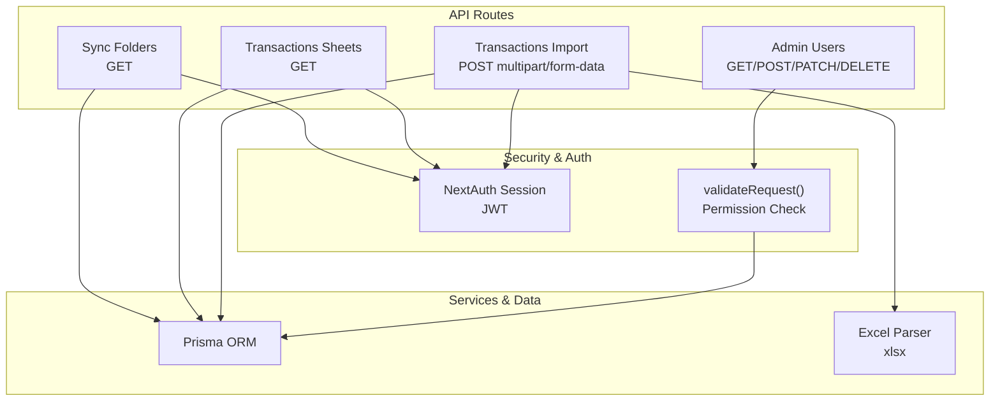
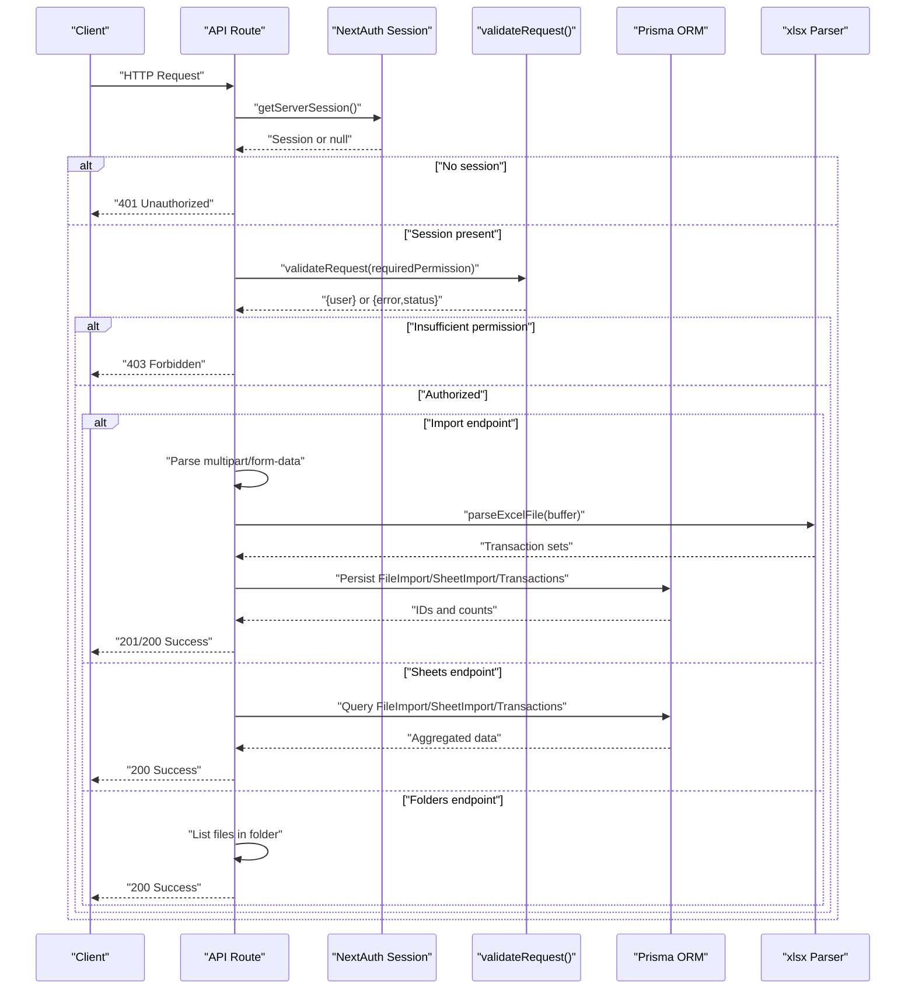
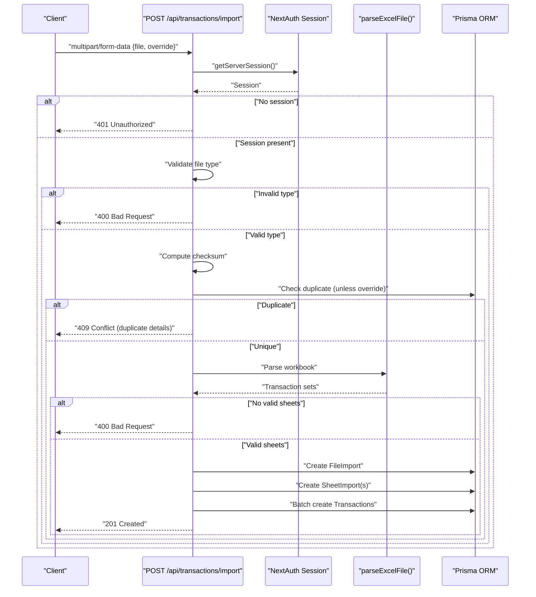
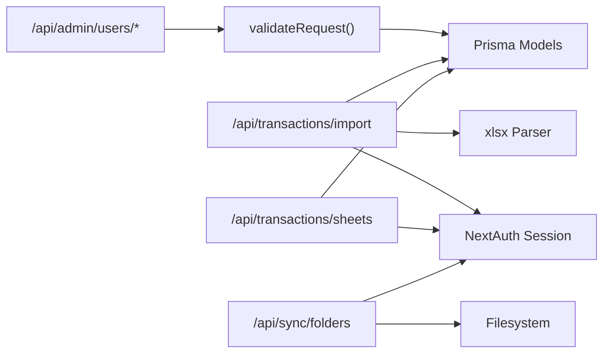

# API Endpoints

<cite>
**Referenced Files in This Document**
- [admin.users.route.ts](file://app/api/admin/users/route.ts)
- [admin.users.[id].route.ts](file://app/api/admin/users/[id]/route.ts)
- [transactions.import.route.ts](file://app/api/transactions/import/route.ts)
- [transactions.sheets.route.ts](file://app/api/transactions/sheets/route.ts)
- [sync.folders.route.ts](file://app/api/sync/folders/route.ts)
- [api-security.ts](file://lib/api-security.ts)
- [auth.ts](file://lib/auth.ts)
- [excel-import.ts](file://lib/excel-import.ts)
- [middleware.ts](file://middleware.ts)
- [schema.prisma](file://prisma/schema.prisma)
- [constants.ts](file://lib/constants.ts)
- [types.ts](file://lib/types.ts)
</cite>

## Table of Contents
1. [Introduction](#introduction)
2. [Project Structure](#project-structure)
3. [Core Components](#core-components)
4. [Architecture Overview](#architecture-overview)
5. [Detailed Component Analysis](#detailed-component-analysis)
6. [Dependency Analysis](#dependency-analysis)
7. [Performance Considerations](#performance-considerations)
8. [Troubleshooting Guide](#troubleshooting-guide)
9. [Conclusion](#conclusion)

## Introduction
This document provides comprehensive API documentation for the analyzer-web backend endpoints. It covers authentication, authorization, request/response schemas, error handling, and the integration between API routes and service-layer components. It also documents rate limiting, file upload constraints, and client-side guidance for handling authentication tokens and sessions.

## Project Structure
The backend API is organized under Next.js App Router routes. Key endpoints include:
- Admin user management: GET /api/admin/users, POST /api/admin/users, PATCH /api/admin/users/[id], DELETE /api/admin/users/[id]
- Transaction import: POST /api/transactions/import (multipart/form-data)
- Transaction sheets: GET /api/transactions/sheets (supports filters by fileImportId or sheetId)
- Folder synchronization: GET /api/sync/folders (lists Excel files in a given absolute path)

**Diagram sources**
- [admin.users.route.ts](file://app/api/admin/users/route.ts#L1-L71)
- [admin.users.[id].route.ts](file://app/api/admin/users/[id]/route.ts#L1-L51)
- [transactions.import.route.ts](file://app/api/transactions/import/route.ts#L1-L264)
- [transactions.sheets.route.ts](file://app/api/transactions/sheets/route.ts#L1-L166)
- [sync.folders.route.ts](file://app/api/sync/folders/route.ts#L1-L90)
- [api-security.ts](file://lib/api-security.ts#L71-L116)
- [auth.ts](file://lib/auth.ts#L1-L225)
- [excel-import.ts](file://lib/excel-import.ts#L1-L327)
- [schema.prisma](file://prisma/schema.prisma#L1-L374)

**Section sources**
- [admin.users.route.ts](file://app/api/admin/users/route.ts#L1-L71)
- [admin.users.[id].route.ts](file://app/api/admin/users/[id]/route.ts#L1-L51)
- [transactions.import.route.ts](file://app/api/transactions/import/route.ts#L1-L264)
- [transactions.sheets.route.ts](file://app/api/transactions/sheets/route.ts#L1-L166)
- [sync.folders.route.ts](file://app/api/sync/folders/route.ts#L1-L90)
- [api-security.ts](file://lib/api-security.ts#L71-L116)
- [auth.ts](file://lib/auth.ts#L1-L225)
- [excel-import.ts](file://lib/excel-import.ts#L1-L327)
- [schema.prisma](file://prisma/schema.prisma#L1-L374)

## Core Components
- Authentication and Authorization:
  - NextAuth-based JWT session with middleware enforcing security headers and protecting routes.
  - validateRequest checks session presence and enforces required permissions for admin endpoints.
- Data Access:
  - Prisma ORM models define entities for users, transactions, file imports, sheet imports, and audit logs.
- Excel Import Pipeline:
  - xlsx library parses Excel files; custom parser extracts metadata and categorizes transactions by side and type.

Key permissions:
- manage_users: Required for admin user management endpoints.

**Section sources**
- [middleware.ts](file://middleware.ts#L1-L56)
- [api-security.ts](file://lib/api-security.ts#L71-L116)
- [constants.ts](file://lib/constants.ts#L24-L50)
- [schema.prisma](file://prisma/schema.prisma#L1-L374)
- [excel-import.ts](file://lib/excel-import.ts#L1-L327)

## Architecture Overview
The API routes integrate with NextAuth for session validation and with Prisma for persistence. Admin endpoints enforce permission checks via validateRequest, while transaction endpoints handle multipart uploads, file validation, parsing, and batch persistence.

**Diagram sources**
- [transactions.import.route.ts](file://app/api/transactions/import/route.ts#L1-L264)
- [transactions.sheets.route.ts](file://app/api/transactions/sheets/route.ts#L1-L166)
- [sync.folders.route.ts](file://app/api/sync/folders/route.ts#L1-L90)
- [api-security.ts](file://lib/api-security.ts#L71-L116)
- [auth.ts](file://lib/auth.ts#L1-L225)
- [excel-import.ts](file://lib/excel-import.ts#L1-L327)
- [schema.prisma](file://prisma/schema.prisma#L1-L374)

## Detailed Component Analysis

### Admin Users Management
- Base URL: /api/admin/users
- Methods:
  - GET: List all users with selected fields.
  - POST: Create a new user with defaults and hashing.
  - PATCH: Update user details.
  - DELETE: Deactivate user by deletion.

Authentication and Authorization:
- Requires session; admin endpoints use validateRequest with required permission manage_users.

Request/Response Schemas:
- GET:
  - Success: 200 OK with array of user objects.
  - Fields: id, name, email, role, avatar, status.
- POST:
  - Body: name, email, role, status, password (optional).
  - Success: 201 Created with created user object.
  - Errors: 400 Bad Request (missing fields), 500 Internal Server Error (duplicate email or DB failure).
- PATCH:
  - Path param: id.
  - Body: name, email, role, status.
  - Success: 200 OK with updated user object.
  - Errors: 500 Internal Server Error (DB failure).
- DELETE:
  - Path param: id.
  - Success: 200 OK with success indicator.
  - Errors: 500 Internal Server Error (DB failure).

Error Codes:
- 401 Unauthorized: No session.
- 403 Forbidden: Insufficient permissions.
- 400 Bad Request: Missing required fields (POST).
- 500 Internal Server Error: Database errors.

Example Requests:
- GET /api/admin/users
  - Headers: Authorization: Bearer <JWT>
- POST /api/admin/users
  - Headers: Authorization: Bearer <JWT>, Content-Type: application/json
  - Body: { "name": "...", "email": "...", "role": "ANALYST", "status": "active", "password": "..." }
- PATCH /api/admin/users/{id}
  - Headers: Authorization: Bearer <JWT>, Content-Type: application/json
  - Body: { "name": "...", "email": "...", "role": "MANAGER", "status": "active" }
- DELETE /api/admin/users/{id}
  - Headers: Authorization: Bearer <JWT>

Processing Flow:
- validateRequest ensures session and permission.
- Database operations via Prisma.

**Section sources**
- [admin.users.route.ts](file://app/api/admin/users/route.ts#L1-L71)
- [admin.users.[id].route.ts](file://app/api/admin/users/[id]/route.ts#L1-L51)
- [api-security.ts](file://lib/api-security.ts#L71-L116)
- [constants.ts](file://lib/constants.ts#L24-L50)
- [schema.prisma](file://prisma/schema.prisma#L18-L53)

### Transaction Import (Excel Upload)
- Base URL: /api/transactions/import
- Method: POST
- Body: multipart/form-data with:
  - file: Excel file (.xlsx or .xls)
  - override: "true" to replace existing import (optional)

Validation and Processing:
- Authentication: Session required; otherwise 401 Unauthorized.
- File validation: Must be .xlsx or .xls; otherwise 400 Bad Request.
- Duplicate detection: If not override, checks existing FileImport by checksum or filename; returns 409 Conflict with duplicate details and prompt.
- Parsing: Uses xlsx library and custom parser to extract metadata and categorized transactions.
- Persistence: Creates FileImport, SheetImport records, and batch inserts Transactions.

Success Response:
- 201 Created on success with:
  - success: true
  - message: summary
  - data: fileImportId, fileName, fileSize, uploadedAt, fileHash, sheetCount, totalTransactions, transactionSets[]
    - Each set includes id, name, date, totalTransactions, metadata.

Errors:
- 400 Bad Request: No file provided, invalid file type, no valid sheets found.
- 401 Unauthorized: No session or user not found in DB.
- 403 Forbidden: Insufficient permissions (via validateRequest).
- 409 Conflict: Duplicate detected unless override is requested.
- 500 Internal Server Error: Parsing or DB failures.

Request Example:
- POST /api/transactions/import
  - Headers: Authorization: Bearer <JWT>, Content-Type: multipart/form-data
  - Form fields:
    - file: [Excel file]
    - override: "true" (optional)

**Diagram sources**
- [transactions.import.route.ts](file://app/api/transactions/import/route.ts#L1-L264)
- [excel-import.ts](file://lib/excel-import.ts#L1-L327)
- [schema.prisma](file://prisma/schema.prisma#L300-L374)

**Section sources**
- [transactions.import.route.ts](file://app/api/transactions/import/route.ts#L1-L264)
- [excel-import.ts](file://lib/excel-import.ts#L1-L327)
- [schema.prisma](file://prisma/schema.prisma#L300-L374)

### Retrieve Available Sheets
- Base URL: /api/transactions/sheets
- Method: GET
- Query Parameters:
  - fileImportId: filter sheets by a specific FileImport
  - sheetId: return a specific sheet with transactions

Behavior:
- If sheetId provided: returns sheet details, counts, and categorized transactions.
- If fileImportId provided: returns all sheets for that FileImport with counts and metadata.
- Otherwise: lists all FileImports with associated sheets and basic stats.

Success Response:
- 200 OK with:
  - success: true
  - data: array of FileImport objects (or single sheet object when sheetId is provided)

Errors:
- 401 Unauthorized: No session.
- 404 Not Found: sheetId not found.
- 500 Internal Server Error: DB failure.

Request Examples:
- GET /api/transactions/sheets?fileImportId={id}
- GET /api/transactions/sheets?sheetId={id}

**Section sources**
- [transactions.sheets.route.ts](file://app/api/transactions/sheets/route.ts#L1-L166)
- [schema.prisma](file://prisma/schema.prisma#L300-L374)

### Folder Synchronization
- Base URL: /api/sync/folders
- Method: GET
- Query Parameter:
  - path: absolute directory path

Behavior:
- Validates presence and absolute path; checks directory existence and type.
- Lists Excel files (.xlsx, .xls) with name, path, size, and modified timestamp.

Success Response:
- 200 OK with:
  - success: true
  - folderPath
  - totalFiles
  - files: array of file details

Errors:
- 400 Bad Request: missing path, path not absolute, path not a directory.
- 404 Not Found: path does not exist or inaccessible.
- 500 Internal Server Error: filesystem error.

Request Example:
- GET /api/sync/folders?path=/absolute/path/to/folder

**Section sources**
- [sync.folders.route.ts](file://app/api/sync/folders/route.ts#L1-L90)

## Dependency Analysis
- Authentication:
  - NextAuth manages JWT sessions; middleware applies security headers and protects routes.
  - validateRequest integrates with NextAuth and permission constants to enforce admin-only endpoints.
- Data Layer:
  - Prisma models define relationships among User, FileImport, SheetImport, and Transaction.
- Excel Parsing:
  - xlsx library reads buffers; custom parser validates sheets and extracts metadata and transactions.

**Diagram sources**
- [api-security.ts](file://lib/api-security.ts#L71-L116)
- [auth.ts](file://lib/auth.ts#L1-L225)
- [transactions.import.route.ts](file://app/api/transactions/import/route.ts#L1-L264)
- [transactions.sheets.route.ts](file://app/api/transactions/sheets/route.ts#L1-L166)
- [sync.folders.route.ts](file://app/api/sync/folders/route.ts#L1-L90)
- [excel-import.ts](file://lib/excel-import.ts#L1-L327)
- [schema.prisma](file://prisma/schema.prisma#L1-L374)

**Section sources**
- [api-security.ts](file://lib/api-security.ts#L71-L116)
- [auth.ts](file://lib/auth.ts#L1-L225)
- [schema.prisma](file://prisma/schema.prisma#L1-L374)

## Performance Considerations
- Rate Limiting:
  - In-memory rate limiter is available via checkRateLimit and cleanupExpiredRateLimits. It is single-instance only; for multi-instance deployments, replace with a distributed store (e.g., Redis).
- File Upload Size:
  - The import endpoint reads the entire file into memory as a Buffer. Large files increase memory usage and processing time. Consider setting upstream limits (e.g., Nginx, load balancer) and streaming alternatives if needed.
- Timeout:
  - Long-running imports can exceed server timeouts. Configure appropriate timeouts at the platform level (e.g., Vercel Functions or hosting provider).
- Database Writes:
  - Batch creation of transactions reduces round-trips. Ensure indexes exist for efficient lookups and updates.

[No sources needed since this section provides general guidance]

## Troubleshooting Guide
Common Issues and Resolutions:
- 401 Unauthorized:
  - Cause: Missing or invalid session.
  - Resolution: Authenticate via NextAuth and include Authorization: Bearer <JWT>.
- 403 Forbidden:
  - Cause: Missing required permission manage_users.
  - Resolution: Ensure the user has the Admin role or appropriate permissions.
- 400 Bad Request (Import):
  - Cause: Missing file, invalid file type, no valid sheets found.
  - Resolution: Provide a .xlsx or .xls file; ensure at least one sheet contains "dept" in A1:D10.
- 409 Conflict (Import):
  - Cause: Duplicate file detected.
  - Resolution: Use override=true to replace existing data or rename the file.
- 404 Not Found (Sheets):
  - Cause: sheetId not found.
  - Resolution: Verify the sheet ID or use fileImportId to list sheets.
- 500 Internal Server Error:
  - Cause: Database or parsing errors.
  - Resolution: Check server logs; confirm Prisma connectivity and xlsx parsing.

**Section sources**
- [transactions.import.route.ts](file://app/api/transactions/import/route.ts#L1-L264)
- [transactions.sheets.route.ts](file://app/api/transactions/sheets/route.ts#L1-L166)
- [sync.folders.route.ts](file://app/api/sync/folders/route.ts#L1-L90)
- [api-security.ts](file://lib/api-security.ts#L71-L116)

## Conclusion
The analyzer-web backend exposes a clear set of admin and transaction endpoints with robust authentication and authorization. Admin endpoints require the manage_users permission, while transaction endpoints handle Excel uploads, validation, parsing, and persistence. Clients should include Authorization: Bearer <JWT> and adhere to file type and size constraints. For production, deploy rate limiting and timeouts appropriately and consider distributed stores for scalability.