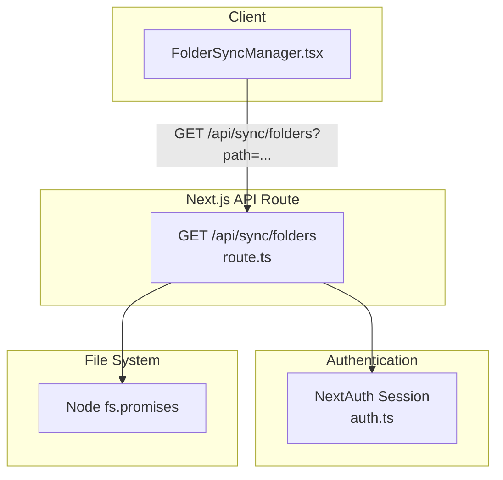
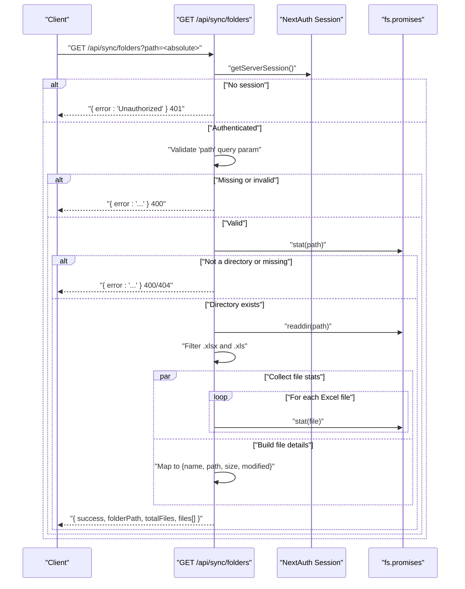
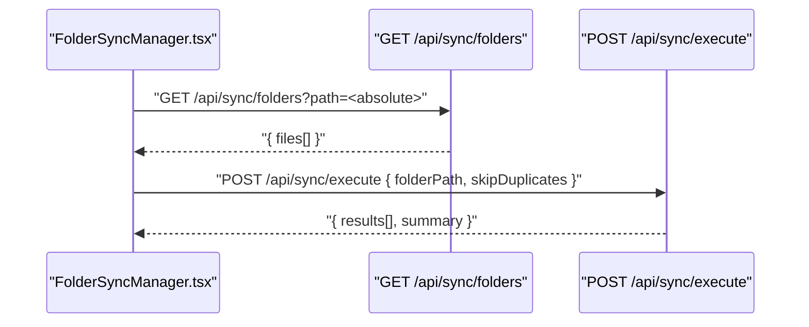
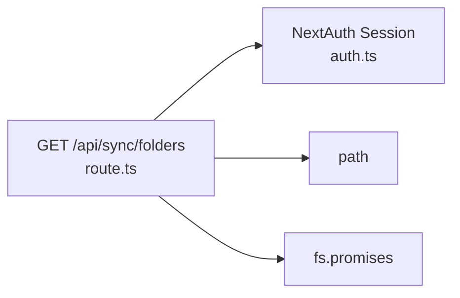

# Folder Synchronization API

<cite>
**Referenced Files in This Document**
- [route.ts](file://app/api/sync/folders/route.ts)
- [auth.ts](file://lib/auth.ts)
- [FolderSyncManager.tsx](file://components/FolderSyncManager.tsx)
- [execute/route.ts](file://app/api/sync/execute/route.ts)
- [excel-import.ts](file://lib/excel-import.ts)
</cite>

## Table of Contents
1. [Introduction](#introduction)
2. [Project Structure](#project-structure)
3. [Core Components](#core-components)
4. [Architecture Overview](#architecture-overview)
5. [Detailed Component Analysis](#detailed-component-analysis)
6. [Dependency Analysis](#dependency-analysis)
7. [Performance Considerations](#performance-considerations)
8. [Troubleshooting Guide](#troubleshooting-guide)
9. [Conclusion](#conclusion)

## Introduction
This document describes the /api/sync/folders GET endpoint that lists Excel files from a specified directory for batch processing. It covers the required path query parameter, authentication via NextAuth.js session, security validations (absolute path and directory existence checks), response structure, file filtering logic (.xlsx and .xls), and the Promise.all pattern used to gather file statistics. It also documents error responses (400, 401, 404, 500), practical client examples, bulk import workflows, performance considerations for large directories, and security implications of server-side file system access.

## Project Structure
The endpoint resides under the Next.js app router at app/api/sync/folders/route.ts. It integrates with NextAuth.js for session-based authentication and uses Node.js fs.promises for file system operations. The frontend component FolderSyncManager.tsx demonstrates client-side usage by invoking this endpoint to scan a folder and display discovered Excel files.

**Diagram sources**
- [route.ts](file://app/api/sync/folders/route.ts#L1-L90)
- [auth.ts](file://lib/auth.ts#L1-L225)
- [FolderSyncManager.tsx](file://components/FolderSyncManager.tsx#L1-L120)

**Section sources**
- [route.ts](file://app/api/sync/folders/route.ts#L1-L90)
- [FolderSyncManager.tsx](file://components/FolderSyncManager.tsx#L1-L120)

## Core Components
- Endpoint: GET /api/sync/folders
- Purpose: Enumerate Excel files (.xlsx and .xls) from an absolute directory path and return metadata for each file.
- Authentication: Requires a valid NextAuth.js session; otherwise returns 401 Unauthorized.
- Security: Validates that path is absolute and that the path exists and is a directory; otherwise returns 400 or 404.
- Response: success flag, folderPath, totalFiles count, and files array with name, path, size, and modified timestamp.

**Section sources**
- [route.ts](file://app/api/sync/folders/route.ts#L10-L90)

## Architecture Overview
The endpoint orchestrates authentication, path validation, directory scanning, file filtering, and metadata collection. It returns a structured payload suitable for client-side bulk import workflows.

**Diagram sources**
- [route.ts](file://app/api/sync/folders/route.ts#L10-L90)

## Detailed Component Analysis

### Endpoint Definition and Behavior
- Method: GET
- Path: /api/sync/folders
- Query Parameter:
  - path (required): Absolute path to the target directory. Must be absolute and must exist as a directory.
- Authentication:
  - Uses getServerSession(authOptions) to obtain the current session. If absent, returns 401 Unauthorized.
- Security Checks:
  - Ensures path.isAbsolute(folderPath) is true; otherwise returns 400.
  - fs.stat(folderPath) verifies the path exists and is a directory; otherwise returns 400 or 404 depending on error type.
- Directory Enumeration:
  - Reads directory entries with fs.readdir(folderPath).
  - Filters entries to include only .xlsx and .xls files.
- Metadata Collection:
  - Uses Promise.all to concurrently collect file stats for each Excel file.
  - Builds an array of file details with name, path, size, and modified timestamp (ISO string).
- Response:
  - success: boolean
  - folderPath: string (input path)
  - totalFiles: number (count of filtered files)
  - files: array of objects with name, path, size, modified

**Section sources**
- [route.ts](file://app/api/sync/folders/route.ts#L10-L90)

### Authentication and Authorization
- Authentication: The endpoint relies on NextAuth.js session. The authOptions configuration defines session strategy, providers, and JWT/session callbacks.
- Authorization: The current endpoint does not enforce role-based permissions; it only checks for a valid session. If a permission model is desired, the route can be adapted to integrate with the validateRequest utility from api-security.ts.

**Section sources**
- [auth.ts](file://lib/auth.ts#L1-L225)

### Client-Side Usage Example
- The frontend component FolderSyncManager.tsx demonstrates how to call the endpoint:
  - Encodes the folder path using encodeURIComponent.
  - Sends a GET request to /api/sync/folders?path=<encoded>.
  - Parses the response and displays files found.

Practical example:
- Client request: GET /api/sync/folders?path=C%3A%5CUsers%5Cjohn%5CDocuments%5Cexcel
- Response: { success, folderPath, totalFiles, files[] }

**Section sources**
- [FolderSyncManager.tsx](file://components/FolderSyncManager.tsx#L50-L82)
- [route.ts](file://app/api/sync/folders/route.ts#L18-L26)

### File Filtering and Statistics
- Filtering: Only files ending with .xlsx or .xls are included.
- Statistics: For each Excel file, the endpoint collects size and modified timestamp via fs.stat and returns them in the files array.
- Concurrency: Promise.all is used to gather stats for all filtered files concurrently, reducing latency compared to sequential stat calls.

**Section sources**
- [route.ts](file://app/api/sync/folders/route.ts#L51-L73)

### Bulk Import Workflow Integration
- The FolderSyncManager.tsx component uses the files array returned by this endpoint to drive a subsequent import workflow:
  - After scanning, clicking “Import All Files” triggers POST /api/sync/execute with { folderPath, skipDuplicates }.
  - The execute endpoint performs duplicate detection, parses Excel sheets, and persists data to the database.

**Diagram sources**
- [FolderSyncManager.tsx](file://components/FolderSyncManager.tsx#L84-L118)
- [execute/route.ts](file://app/api/sync/execute/route.ts#L24-L311)

**Section sources**
- [FolderSyncManager.tsx](file://components/FolderSyncManager.tsx#L50-L118)
- [execute/route.ts](file://app/api/sync/execute/route.ts#L24-L114)

### Error Responses
- 400 Bad Request:
  - Missing path query parameter.
  - Non-absolute path.
  - Path is not a directory.
- 401 Unauthorized:
  - No active NextAuth.js session.
- 404 Not Found:
  - Directory does not exist or is not accessible.
- 500 Internal Server Error:
  - Unexpected error during directory read or processing.

**Section sources**
- [route.ts](file://app/api/sync/folders/route.ts#L18-L49)
- [route.ts](file://app/api/sync/folders/route.ts#L80-L88)

### Response Schema
- success: boolean
- folderPath: string
- totalFiles: number
- files: array of objects with:
  - name: string
  - path: string
  - size: number
  - modified: string (ISO timestamp)

**Section sources**
- [route.ts](file://app/api/sync/folders/route.ts#L74-L79)

### Security Implications and Validations
- Absolute Path Requirement: Enforces path.isAbsolute to prevent traversal attacks and restricts access to server filesystem.
- Directory Existence Verification: fs.stat ensures the path exists and is a directory; otherwise returns appropriate error codes.
- NextAuth Session: Ensures only authenticated users can access the endpoint.
- Risk Mitigations:
  - Restrict the allowed absolute paths to known directories on the server.
  - Consider adding role-based permissions if broader access is required.
  - Apply rate limiting at the API gateway or middleware level.

**Section sources**
- [route.ts](file://app/api/sync/folders/route.ts#L28-L49)
- [auth.ts](file://lib/auth.ts#L1-L225)

## Dependency Analysis
The endpoint depends on:
- NextAuth.js for session management.
- Node fs.promises for file system operations.
- path module for path utilities.

**Diagram sources**
- [route.ts](file://app/api/sync/folders/route.ts#L1-L9)
- [auth.ts](file://lib/auth.ts#L1-L225)

**Section sources**
- [route.ts](file://app/api/sync/folders/route.ts#L1-L9)

## Performance Considerations
- Concurrency: Promise.all is used to collect file stats concurrently, which reduces total latency for large directories.
- Scalability:
  - For very large directories, consider pagination or chunking of file enumeration.
  - Limit concurrent fs.stat calls to avoid overwhelming the file system.
  - Cache recent directory listings if acceptable for the use case.
- I/O Bound Workload: Directory reads and stat calls are I/O bound; optimize by minimizing unnecessary operations and avoiding repeated scans.

**Section sources**
- [route.ts](file://app/api/sync/folders/route.ts#L60-L73)

## Troubleshooting Guide
Common issues and resolutions:
- 400 Missing path:
  - Ensure the path query parameter is present and not empty.
- 400 Non-absolute path:
  - Provide an absolute path to the directory.
- 400 Path is not a directory:
  - Verify the path points to a directory, not a file.
- 404 Directory not accessible:
  - Confirm the directory exists and is readable by the server process.
- 401 Unauthorized:
  - Ensure the user is logged in and the session is valid.
- 500 Server error:
  - Check server logs for underlying exceptions during directory read or stat operations.

Operational tips:
- Encode special characters in the path using encodeURIComponent on the client side.
- Validate that the server process has read permissions for the target directory.
- Monitor logs for detailed error messages.

**Section sources**
- [route.ts](file://app/api/sync/folders/route.ts#L18-L49)
- [route.ts](file://app/api/sync/folders/route.ts#L80-L88)
- [FolderSyncManager.tsx](file://components/FolderSyncManager.tsx#L50-L82)

## Conclusion
The /api/sync/folders GET endpoint provides a secure and efficient way to enumerate Excel files from a specified directory for batch processing. It enforces authentication, validates absolute paths, checks directory existence, filters supported file types, and returns comprehensive file metadata. Combined with the FolderSyncManager.tsx component and the POST /api/sync/execute endpoint, it enables robust bulk import workflows. Careful attention to path validation, concurrency, and server permissions ensures reliable operation at scale.