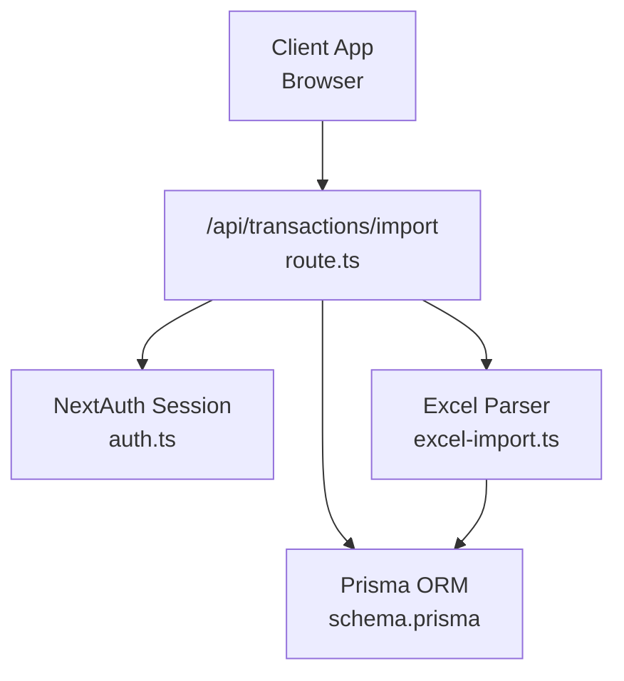
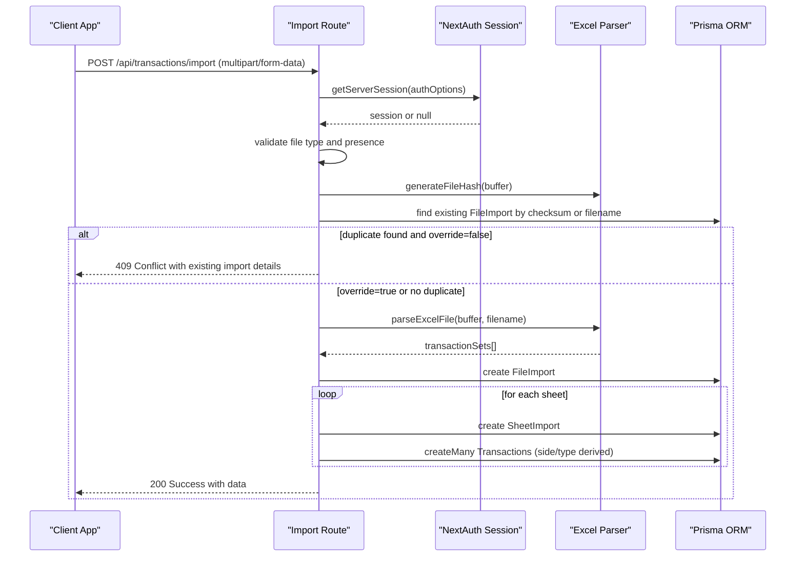
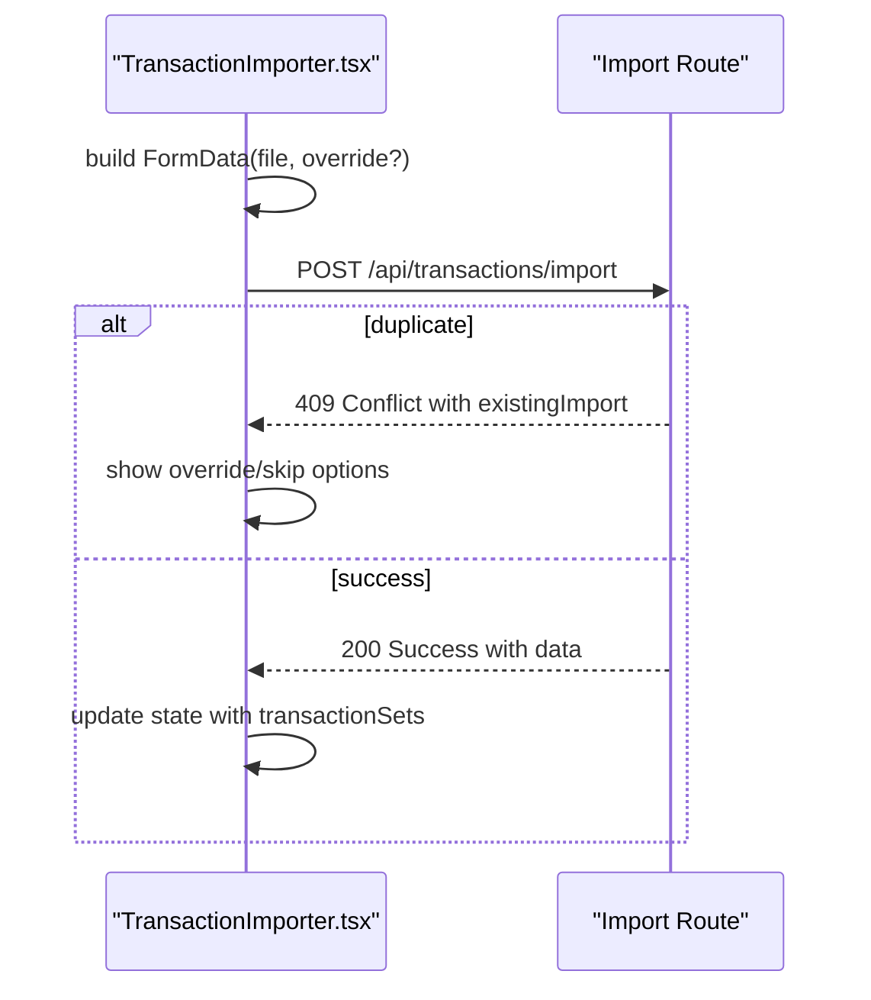
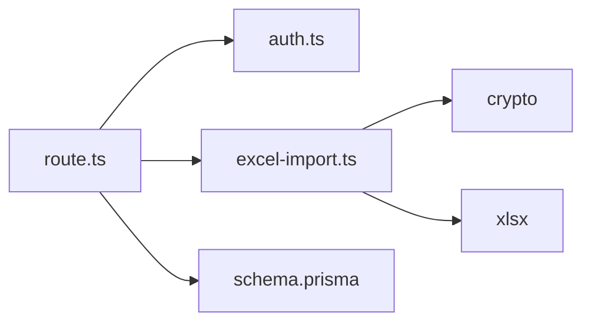

# Transaction Import API

<cite>
**Referenced Files in This Document**
- [route.ts](file://app/api/transactions/import/route.ts)
- [excel-import.ts](file://lib/excel-import.ts)
- [auth.ts](file://lib/auth.ts)
- [api-security.ts](file://lib/api-security.ts)
- [schema.prisma](file://prisma/schema.prisma)
- [TransactionImporter.tsx](file://components/TransactionImporter.tsx)
- [TRANSACTION_IMPORT_GUIDE.md](file://docs/TRANSACTION_IMPORT_GUIDE.md)
</cite>

## Table of Contents
1. [Introduction](#introduction)
2. [Project Structure](#project-structure)
3. [Core Components](#core-components)
4. [Architecture Overview](#architecture-overview)
5. [Detailed Component Analysis](#detailed-component-analysis)
6. [Dependency Analysis](#dependency-analysis)
7. [Performance Considerations](#performance-considerations)
8. [Troubleshooting Guide](#troubleshooting-guide)
9. [Conclusion](#conclusion)
10. [Appendices](#appendices)

## Introduction
This document provides comprehensive API documentation for the POST /api/transactions/import endpoint that handles Excel file uploads for financial transaction reconciliation. It covers authentication, file validation, duplicate detection, parsing workflow, database persistence, categorization, response schema, error handling, and client implementation guidance.

## Project Structure
The endpoint is implemented as a Next.js route under app/api/transactions/import/route.ts. Supporting libraries include:
- Excel parsing and hashing utilities in lib/excel-import.ts
- Authentication configuration in lib/auth.ts
- Optional request validation and audit helpers in lib/api-security.ts
- Database schema definitions in prisma/schema.prisma

**Diagram sources**
- [route.ts](file://app/api/transactions/import/route.ts#L1-L264)
- [excel-import.ts](file://lib/excel-import.ts#L1-L327)
- [auth.ts](file://lib/auth.ts#L1-L225)
- [schema.prisma](file://prisma/schema.prisma#L1-L374)

**Section sources**
- [route.ts](file://app/api/transactions/import/route.ts#L1-L264)
- [excel-import.ts](file://lib/excel-import.ts#L1-L327)
- [auth.ts](file://lib/auth.ts#L1-L225)
- [schema.prisma](file://prisma/schema.prisma#L1-L374)

## Core Components
- Authentication: Uses NextAuth.js session validation via getServerSession with authOptions.
- File handling: Accepts multipart/form-data with file and optional override parameters.
- Validation: Checks file extension (.xlsx or .xls) and presence of required metadata region.
- Duplicate detection: Computes SHA-256 file hash and compares with existing FileImport records.
- Parsing: Reads Excel buffer, validates sheets, extracts metadata and transactions.
- Persistence: Creates FileImport, SheetImport, and Transaction records with side/type categorization.
- Response: Returns success flag, message, and structured data including identifiers and counts.

**Section sources**
- [route.ts](file://app/api/transactions/import/route.ts#L12-L264)
- [excel-import.ts](file://lib/excel-import.ts#L35-L327)
- [schema.prisma](file://prisma/schema.prisma#L300-L374)

## Architecture Overview
The import pipeline integrates client upload, server-side validation, parsing, and database persistence.

**Diagram sources**
- [route.ts](file://app/api/transactions/import/route.ts#L12-L264)
- [excel-import.ts](file://lib/excel-import.ts#L256-L327)
- [schema.prisma](file://prisma/schema.prisma#L300-L374)

## Detailed Component Analysis

### Endpoint Definition
- Method: POST
- Path: /api/transactions/import
- Content-Type: multipart/form-data
- Required fields:
  - file: Excel file (.xlsx or .xls)
  - override: optional boolean string "true" to replace existing import

Authentication flow:
- Validates NextAuth session using getServerSession(authOptions).
- Rejects unauthorized requests with 401 Unauthorized.

File validation:
- Rejects missing file with 400 Bad Request.
- Rejects invalid file types with 400 Bad Request.

Duplicate detection:
- Generates SHA-256 hash of file buffer.
- Queries FileImport by either checksum or filename.
- Returns 409 Conflict with existing import details when duplicate is found unless override=true.
- If override=true, deletes existing FileImport and related data before proceeding.

Parsing workflow:
- parseExcelFile(buffer, filename) reads workbook, filters sheets by presence of "dept" in A1:D10, extracts metadata, and builds transactionSets with categorized transactions.

Database persistence:
- Creates FileImport with counts and metadata.
- Creates SheetImport for each set with transaction counts.
- Creates Transaction records with side ("LEFT"/"RIGHT") and type ("int cr","int dr","ext dr","ext cr").

Response schema:
- success: boolean
- message: string
- data: object containing identifiers, counts, and transactionSets

Error handling:
- 400: Invalid file, no valid sheets, or missing fields
- 401: Unauthorized or user not found
- 409: Duplicate import conflict
- 500: Server error during processing

**Section sources**
- [route.ts](file://app/api/transactions/import/route.ts#L12-L264)
- [excel-import.ts](file://lib/excel-import.ts#L35-L327)
- [schema.prisma](file://prisma/schema.prisma#L300-L374)

### Authentication and Authorization
- Session validation uses NextAuth with JWT strategy.
- The route expects a valid session; otherwise returns 401 Unauthorized.
- The client must be authenticated before invoking the endpoint.

**Section sources**
- [route.ts](file://app/api/transactions/import/route.ts#L12-L26)
- [auth.ts](file://lib/auth.ts#L1-L225)

### File Type Validation and Duplicate Handling
- File type validation ensures .xlsx or .xls extensions.
- Duplicate detection uses generateFileHash(buffer) and compares with FileImport.checksum and filename.
- On duplicate:
  - If override is not requested, returns 409 Conflict with existing import details and prompt.
  - If override is requested, deletes existing FileImport and proceeds.

**Section sources**
- [route.ts](file://app/api/transactions/import/route.ts#L25-L87)
- [excel-import.ts](file://lib/excel-import.ts#L56-L60)
- [schema.prisma](file://prisma/schema.prisma#L300-L336)

### Parsing Workflow and Metadata Extraction
- isValidAccountSheet checks A1:D10 for "dept" to filter valid account sheets.
- parseSheetData identifies transaction table by detecting headers (SN, DATE, DESCRIPTION) and extracts metadata fields.
- parseExcelFile iterates sheets, applies filters, and constructs TransactionSet with categorized transactions.

Side and type categorization:
- Side is derived from RECON value:
  - INT CR/INT DR -> side "LEFT"
  - EXT DR/EXT CR -> side "RIGHT"
- Type is mapped from RECON to lowercase values.

**Section sources**
- [excel-import.ts](file://lib/excel-import.ts#L35-L327)
- [route.ts](file://app/api/transactions/import/route.ts#L187-L226)

### Database Persistence and Relationships
- FileImport: stores filename, MIME type, size, checksum, status, counts, timestamps, and uploadedById.
- SheetImport: stores sheet metadata, counts, reportingDate, and order; linked to FileImport.
- Transaction: stores parsed fields, side, type, status, and foreign keys to FileImport and SheetImport.

Indexes and relations:
- FileImport.transactions, FileImport.sheets
- SheetImport.transactions
- Transaction.fileImport, Transaction.sheetImport, Transaction.importedBy

**Section sources**
- [schema.prisma](file://prisma/schema.prisma#L300-L374)

### Response Schema
On success, the endpoint returns:
- success: boolean
- message: string
- data: object with:
  - fileImportId: string
  - fileName: string
  - fileSize: number
  - uploadedAt: ISO string
  - fileHash: string
  - sheetCount: number
  - totalTransactions: number
  - transactionSets: array of objects with:
    - id: string
    - name: string
    - date: string
    - totalTransactions: number
    - metadata: object

On duplicate (409):
- success: false
- duplicate: true
- message: string
- existingImport: { fileName, uploadedAt }
- prompt: string

On error:
- 400: Invalid file or no valid sheets
- 401: Unauthorized or user not found
- 500: Server error

**Section sources**
- [route.ts](file://app/api/transactions/import/route.ts#L92-L113)
- [route.ts](file://app/api/transactions/import/route.ts#L230-L251)

### Client Implementation Examples
- Construct FormData with file and optional override fields.
- Send POST to /api/transactions/import.
- Handle 409 Conflict by prompting user to override or skip.
- Use the returned identifiers to fetch detailed sheet data via the sheets endpoint.

**Diagram sources**
- [TransactionImporter.tsx](file://components/TransactionImporter.tsx#L51-L120)
- [route.ts](file://app/api/transactions/import/route.ts#L12-L264)

**Section sources**
- [TransactionImporter.tsx](file://components/TransactionImporter.tsx#L51-L120)
- [TRANSACTION_IMPORT_GUIDE.md](file://docs/TRANSACTION_IMPORT_GUIDE.md#L140-L189)

## Dependency Analysis
- route.ts depends on:
  - NextAuth session validation
  - excel-import utilities for hashing and parsing
  - Prisma models for persistence
- excel-import.ts depends on:
  - xlsx library for workbook parsing
  - crypto for file hashing
- auth.ts defines NextAuth configuration and session callbacks
- api-security.ts provides optional request validation and audit helpers

**Diagram sources**
- [route.ts](file://app/api/transactions/import/route.ts#L1-L264)
- [excel-import.ts](file://lib/excel-import.ts#L1-L327)
- [auth.ts](file://lib/auth.ts#L1-L225)
- [schema.prisma](file://prisma/schema.prisma#L1-L374)

**Section sources**
- [route.ts](file://app/api/transactions/import/route.ts#L1-L264)
- [excel-import.ts](file://lib/excel-import.ts#L1-L327)
- [auth.ts](file://lib/auth.ts#L1-L225)
- [schema.prisma](file://prisma/schema.prisma#L1-L374)

## Performance Considerations
- File size limits: Prefer reasonably sized files to avoid memory pressure.
- Batch creation: Transaction.createMany is used to reduce round-trips.
- Index usage: Database indexes on FileImport.checksum, Transaction.fileImportId, and others improve lookup performance.
- Parsing overhead: Large spreadsheets may increase CPU usage; consider splitting files or optimizing sheet selection.

[No sources needed since this section provides general guidance]

## Troubleshooting Guide
Common issues and resolutions:
- 401 Unauthorized:
  - Ensure the client is authenticated and session is valid.
  - Verify NEXTAUTH_SECRET is configured.
- 400 Invalid file type:
  - Confirm the uploaded file has .xlsx or .xls extension.
- 400 No valid sheets:
  - Ensure at least one sheet contains "dept" in the A1:D10 region.
- 409 Conflict (duplicate):
  - Use override=true to replace existing import, or rename the file to bypass duplicate detection.
- 500 Server error:
  - Check server logs for underlying exceptions.
  - Validate Excel structure and required columns.

**Section sources**
- [route.ts](file://app/api/transactions/import/route.ts#L25-L113)
- [route.ts](file://app/api/transactions/import/route.ts#L251-L264)
- [excel-import.ts](file://lib/excel-import.ts#L35-L54)

## Conclusion
The /api/transactions/import endpoint provides a robust mechanism for importing Excel-based financial transaction data with strong authentication, validation, duplicate detection, and structured persistence. Clients should construct FormData correctly, handle 409 conflicts with override logic, and leverage the returned identifiers for downstream operations.

[No sources needed since this section summarizes without analyzing specific files]

## Appendices

### Endpoint Reference
- Method: POST
- Path: /api/transactions/import
- Content-Type: multipart/form-data
- Body fields:
  - file: Excel file (.xlsx or .xls)
  - override: optional boolean string "true"

**Section sources**
- [route.ts](file://app/api/transactions/import/route.ts#L12-L26)

### Request Validation Rules
- File presence: required
- File type: .xlsx or .xls
- Sheet validation: at least one sheet must contain "dept" in A1:D10
- Authentication: valid NextAuth session required

**Section sources**
- [route.ts](file://app/api/transactions/import/route.ts#L25-L113)
- [excel-import.ts](file://lib/excel-import.ts#L35-L54)

### Response Examples
- Success:
  - status: 200
  - body: success, message, data with identifiers and counts
- Duplicate:
  - status: 409
  - body: duplicate details and prompt
- Error:
  - status: 400, 401, or 500
  - body: error message

**Section sources**
- [route.ts](file://app/api/transactions/import/route.ts#L92-L113)
- [route.ts](file://app/api/transactions/import/route.ts#L230-L251)