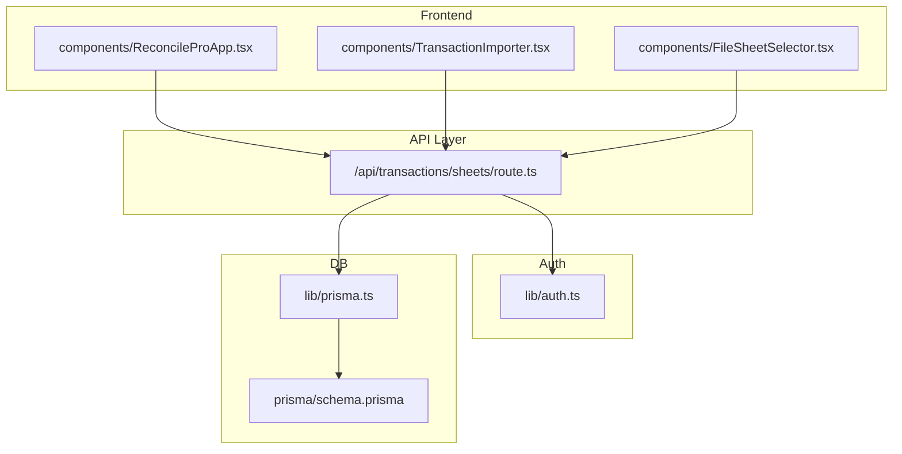
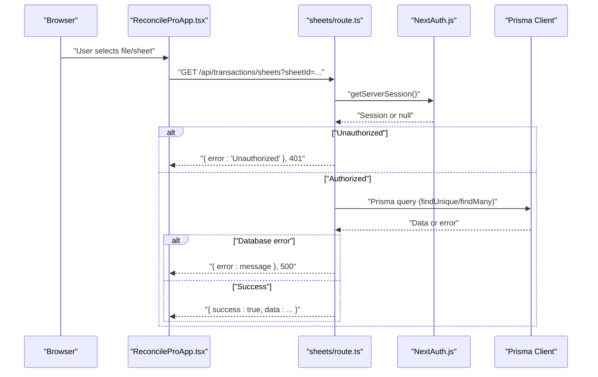
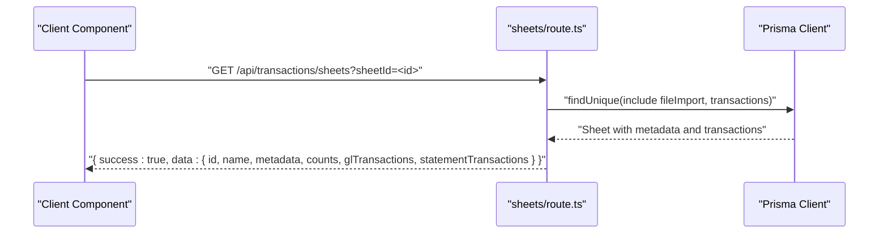
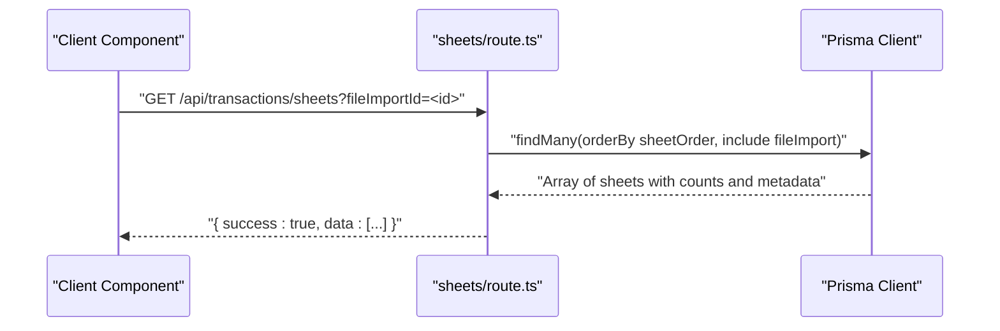
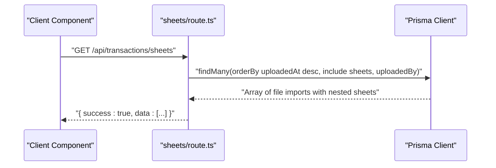
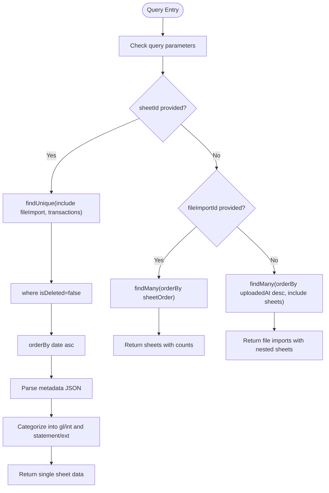
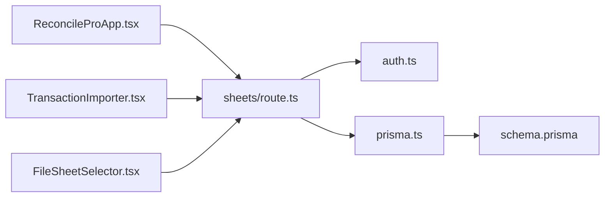

# Transaction Sheets API

<cite>
**Referenced Files in This Document**
- [route.ts](file://app/api/transactions/sheets/route.ts)
- [auth.ts](file://lib/auth.ts)
- [prisma.ts](file://lib/prisma.ts)
- [schema.prisma](file://prisma/schema.prisma)
- [ReconcileProApp.tsx](file://components/ReconcileProApp.tsx)
- [TransactionImporter.tsx](file://components/TransactionImporter.tsx)
- [FileSheetSelector.tsx](file://components/FileSheetSelector.tsx)
- [TRANSACTION_IMPORT_GUIDE.md](file://docs/TRANSACTION_IMPORT_GUIDE.md)
</cite>

## Table of Contents
1. [Introduction](#introduction)
2. [Project Structure](#project-structure)
3. [Core Components](#core-components)
4. [Architecture Overview](#architecture-overview)
5. [Detailed Component Analysis](#detailed-component-analysis)
6. [Dependency Analysis](#dependency-analysis)
7. [Performance Considerations](#performance-considerations)
8. [Troubleshooting Guide](#troubleshooting-guide)
9. [Conclusion](#conclusion)
10. [Appendices](#appendices)

## Introduction
This document describes the /api/transactions/sheets endpoint that retrieves imported transaction sheets with hierarchical data. It explains the three operational modes based on query parameters:
- When sheetId is provided: return detailed sheet data with categorized transactions and parsed metadata.
- When fileImportId is provided: list all sheets within that import with summary counts.
- When no parameters: return all file imports with their associated sheets in descending upload order.

It also documents authentication via NextAuth.js, Prisma queries with include statements, response structure with a success flag and nested data, transaction filtering to exclude soft-deleted records, ordering by date, error handling for 404 and 500, and client usage examples integrated with the frontend reconciliation interface.

## Project Structure
The endpoint resides under the Next.js app router and is supported by shared authentication and database utilities.

**Diagram sources**
- [route.ts](file://app/api/transactions/sheets/route.ts#L1-L166)
- [auth.ts](file://lib/auth.ts#L1-L225)
- [prisma.ts](file://lib/prisma.ts#L1-L11)
- [schema.prisma](file://prisma/schema.prisma#L299-L374)
- [ReconcileProApp.tsx](file://components/ReconcileProApp.tsx#L146-L213)
- [TransactionImporter.tsx](file://components/TransactionImporter.tsx#L51-L120)
- [FileSheetSelector.tsx](file://components/FileSheetSelector.tsx#L1-L114)

**Section sources**
- [route.ts](file://app/api/transactions/sheets/route.ts#L1-L166)
- [auth.ts](file://lib/auth.ts#L1-L225)
- [prisma.ts](file://lib/prisma.ts#L1-L11)
- [schema.prisma](file://prisma/schema.prisma#L299-L374)
- [ReconcileProApp.tsx](file://components/ReconcileProApp.tsx#L146-L213)
- [TransactionImporter.tsx](file://components/TransactionImporter.tsx#L51-L120)
- [FileSheetSelector.tsx](file://components/FileSheetSelector.tsx#L1-L114)

## Core Components
- Endpoint handler: Implements three modes based on query parameters and returns a standardized response envelope with success and data.
- Authentication: Uses NextAuth.js server-side session validation.
- Database access: Uses Prisma client configured globally.
- Frontend integration: The reconciliation app and importer components call this endpoint to populate file/sheet selection and load transaction data.

Key behaviors:
- Authentication: Unauthorized requests receive a 401 response.
- Mode 1 (sheetId): Loads a single sheet with included file metadata and transactions filtered by isDeleted=false and ordered by date asc.
- Mode 2 (fileImportId): Lists sheets for a given import with counts and metadata.
- Mode 3 (no params): Lists all file imports with nested sheets, ordered by uploadedAt desc.
- Error handling: Returns 404 for sheet not found and 500 for database errors.

**Section sources**
- [route.ts](file://app/api/transactions/sheets/route.ts#L11-L166)
- [auth.ts](file://lib/auth.ts#L1-L225)
- [prisma.ts](file://lib/prisma.ts#L1-L11)
- [schema.prisma](file://prisma/schema.prisma#L299-L374)

## Architecture Overview
The endpoint orchestrates data retrieval from the database using Prisma, applies authentication, and returns a unified response envelope. The frontend components consume this endpoint to drive the reconciliation workflow.

**Diagram sources**
- [route.ts](file://app/api/transactions/sheets/route.ts#L11-L166)
- [auth.ts](file://lib/auth.ts#L1-L225)
- [ReconcileProApp.tsx](file://components/ReconcileProApp.tsx#L352-L431)

## Detailed Component Analysis

### Endpoint Modes and Behavior
- Mode 1: sheetId provided
  - Retrieves a single sheet with file metadata and transactions.
  - Filters transactions by isDeleted=false and orders by date ascending.
  - Parses metadata from JSON string stored in the sheet record.
  - Categorizes transactions into glTransactions (intCr, intDr) and statementTransactions (extDr, extCr).
  - Returns counts per category and total transaction count.
- Mode 2: fileImportId provided
  - Lists sheets for a given file import, ordered by sheetOrder ascending.
  - Includes file metadata and parses sheet metadata JSON.
  - Returns counts per category and transactionCount per sheet.
- Mode 3: no parameters
  - Lists all file imports ordered by uploadedAt descending.
  - Includes sheets ordered by sheetOrder ascending and uploadedBy user profile.
  - Returns aggregated counts and nested sheet summaries.

Response envelope:
- success: boolean indicating operation outcome.
- data: varies by mode (single sheet object, array of sheets, or array of file imports with nested sheets).

Error handling:
- 401 Unauthorized when session is missing.
- 404 Not Found when sheetId is invalid.
- 500 Internal Server Error on database failures.

**Section sources**
- [route.ts](file://app/api/transactions/sheets/route.ts#L11-L166)
- [schema.prisma](file://prisma/schema.prisma#L299-L374)

### Authentication and Authorization
- The endpoint obtains a server session using NextAuth’s getServerSession with the configured authOptions.
- If no session is present, it returns 401 Unauthorized immediately.
- The authOptions define JWT-based sessions, credentials provider, and callbacks to attach user data to the session.

Integration points:
- The frontend uses NextAuth’s client hooks to manage authentication state and redirects unauthorized users to the login page.

**Section sources**
- [route.ts](file://app/api/transactions/sheets/route.ts#L11-L20)
- [auth.ts](file://lib/auth.ts#L1-L225)
- [ReconcileProApp.tsx](file://components/ReconcileProApp.tsx#L37-L42)

### Prisma Queries and Data Relationships
- Models involved:
  - FileImport: top-level import with sheets and uploadedBy user.
  - SheetImport: per-sheet metadata, counts, and transactions.
  - Transaction: individual transaction linked to SheetImport and FileImport.
- Query patterns:
  - findUnique with include for fileImport and transactions.
  - findMany with orderBy and include for nested relations.
  - JSON metadata stored as string and parsed at runtime.
- Filtering and ordering:
  - Transactions filtered by isDeleted=false.
  - Transactions ordered by date ascending.

**Section sources**
- [schema.prisma](file://prisma/schema.prisma#L299-L374)
- [route.ts](file://app/api/transactions/sheets/route.ts#L24-L79)
- [route.ts](file://app/api/transactions/sheets/route.ts#L82-L113)
- [route.ts](file://app/api/transactions/sheets/route.ts#L115-L155)

### Frontend Integration and Client Usage
- ReconcileProApp:
  - On initialization and when switching views, fetches all file imports via GET /api/transactions/sheets with no parameters.
  - On sheet selection, fetches detailed sheet data via GET /api/transactions/sheets?sheetId=... and converts to internal transaction format.
- TransactionImporter:
  - After successful import, auto-selects the first transaction set and fetches full sheet data via GET /api/transactions/sheets?sheetId=... to enrich the UI.
- FileSheetSelector:
  - Renders available sheets for a selected file and displays sheet metadata.

Client-side flow for loading transaction data:
- Select a sheet from the dropdown.
- Call GET /api/transactions/sheets?sheetId=<sheetId>.
- Parse response.success and response.data.
- Convert glTransactions and statementTransactions into the app’s internal transaction model.
- Update UI state and snapshots.

**Section sources**
- [ReconcileProApp.tsx](file://components/ReconcileProApp.tsx#L146-L213)
- [ReconcileProApp.tsx](file://components/ReconcileProApp.tsx#L352-L431)
- [ReconcileProApp.tsx](file://components/ReconcileProApp.tsx#L432-L548)
- [TransactionImporter.tsx](file://components/TransactionImporter.tsx#L51-L120)
- [FileSheetSelector.tsx](file://components/FileSheetSelector.tsx#L1-L114)

### API Workflow Diagrams

#### Mode 1: Detailed Sheet Data

**Diagram sources**
- [route.ts](file://app/api/transactions/sheets/route.ts#L24-L79)

#### Mode 2: List Sheets by File Import

**Diagram sources**
- [route.ts](file://app/api/transactions/sheets/route.ts#L82-L113)

#### Mode 3: List All File Imports with Sheets

**Diagram sources**
- [route.ts](file://app/api/transactions/sheets/route.ts#L115-L155)

### Transaction Filtering and Ordering Logic
- Filtering: Transactions are filtered to exclude soft-deleted records using isDeleted=false.
- Ordering: Transactions are ordered by date ascending to ensure chronological presentation.

**Diagram sources**
- [route.ts](file://app/api/transactions/sheets/route.ts#L24-L155)

## Dependency Analysis
- Endpoint depends on:
  - NextAuth.js for session validation.
  - Prisma client for database queries.
  - Prisma schema defines relationships among FileImport, SheetImport, and Transaction.
- Frontend components depend on:
  - ReconcileProApp.tsx for initialization and sheet selection.
  - TransactionImporter.tsx for auto-loading first sheet after import.
  - FileSheetSelector.tsx for rendering available sheets and metadata.

**Diagram sources**
- [route.ts](file://app/api/transactions/sheets/route.ts#L1-L166)
- [auth.ts](file://lib/auth.ts#L1-L225)
- [prisma.ts](file://lib/prisma.ts#L1-L11)
- [schema.prisma](file://prisma/schema.prisma#L299-L374)
- [ReconcileProApp.tsx](file://components/ReconcileProApp.tsx#L146-L213)
- [TransactionImporter.tsx](file://components/TransactionImporter.tsx#L51-L120)
- [FileSheetSelector.tsx](file://components/FileSheetSelector.tsx#L1-L114)

**Section sources**
- [route.ts](file://app/api/transactions/sheets/route.ts#L1-L166)
- [auth.ts](file://lib/auth.ts#L1-L225)
- [prisma.ts](file://lib/prisma.ts#L1-L11)
- [schema.prisma](file://prisma/schema.prisma#L299-L374)
- [ReconcileProApp.tsx](file://components/ReconcileProApp.tsx#L146-L213)
- [TransactionImporter.tsx](file://components/TransactionImporter.tsx#L51-L120)
- [FileSheetSelector.tsx](file://components/FileSheetSelector.tsx#L1-L114)

## Performance Considerations
- Database queries:
  - Use includes judiciously; the endpoint already includes related data to minimize round-trips.
  - Consider pagination for large datasets if needed in future enhancements.
- Client-side:
  - Avoid unnecessary re-fetches by caching results when the same sheet is selected again.
  - Debounce rapid selection changes to prevent redundant network calls.
- Authentication:
  - Session retrieval is lightweight; ensure NextAuth configuration remains efficient.

[No sources needed since this section provides general guidance]

## Troubleshooting Guide
Common issues and resolutions:
- 401 Unauthorized:
  - Cause: Missing or invalid NextAuth session.
  - Resolution: Ensure the user is logged in and the session is active.
- 404 Not Found:
  - Cause: sheetId does not correspond to an existing sheet.
  - Resolution: Verify the sheetId and retry; confirm the sheet exists and is not deleted.
- 500 Internal Server Error:
  - Cause: Database query failure or unexpected error.
  - Resolution: Check server logs, validate Prisma schema and migrations, and retry.

Frontend debugging tips:
- Inspect the response envelope: success flag and data payload.
- Confirm query parameters: sheetId, fileImportId.
- Validate that the user is authenticated before calling the endpoint.

**Section sources**
- [route.ts](file://app/api/transactions/sheets/route.ts#L11-L20)
- [route.ts](file://app/api/transactions/sheets/route.ts#L42-L44)
- [route.ts](file://app/api/transactions/sheets/route.ts#L155-L166)

## Conclusion
The /api/transactions/sheets endpoint provides a robust, authenticated mechanism to retrieve hierarchical transaction data across three operational modes. It integrates tightly with NextAuth.js for security and with Prisma for reliable data access. The frontend components leverage this endpoint to power the reconciliation workflow, enabling users to explore imported files, select sheets, and load categorized transactions efficiently.

[No sources needed since this section summarizes without analyzing specific files]

## Appendices

### API Definition Summary
- Endpoint: GET /api/transactions/sheets
- Query parameters:
  - sheetId: returns detailed sheet data with categorized transactions and counts.
  - fileImportId: returns all sheets within a file import with summary counts.
  - none: returns all file imports with nested sheets ordered by upload time.
- Response envelope:
  - success: boolean
  - data: varies by mode
- Authentication: Required via NextAuth.js session.
- Error codes:
  - 401 Unauthorized (missing session)
  - 404 Not Found (sheet not found)
  - 500 Internal Server Error (database errors)

**Section sources**
- [route.ts](file://app/api/transactions/sheets/route.ts#L11-L166)
- [auth.ts](file://lib/auth.ts#L1-L225)

### Client Usage Examples
- List all imports:
  - Call GET /api/transactions/sheets
  - Use the returned data to populate the file selector.
- Select a file and list sheets:
  - Call GET /api/transactions/sheets?fileImportId=<fileId>
  - Populate the sheet dropdown with the returned sheets.
- Load a specific sheet:
  - Call GET /api/transactions/sheets?sheetId=<sheetId>
  - Parse metadata and categorize transactions into glTransactions and statementTransactions.
  - Update UI state and snapshots.

**Section sources**
- [ReconcileProApp.tsx](file://components/ReconcileProApp.tsx#L146-L213)
- [ReconcileProApp.tsx](file://components/ReconcileProApp.tsx#L352-L431)
- [ReconcileProApp.tsx](file://components/ReconcileProApp.tsx#L432-L548)
- [TransactionImporter.tsx](file://components/TransactionImporter.tsx#L51-L120)
- [FileSheetSelector.tsx](file://components/FileSheetSelector.tsx#L1-L114)
- [TRANSACTION_IMPORT_GUIDE.md](file://docs/TRANSACTION_IMPORT_GUIDE.md#L140-L189)