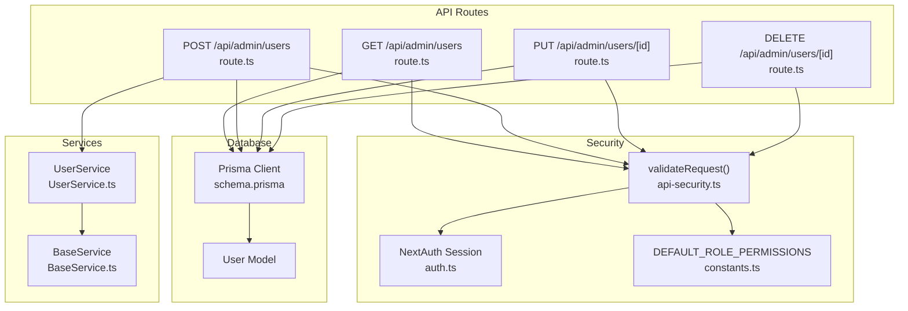
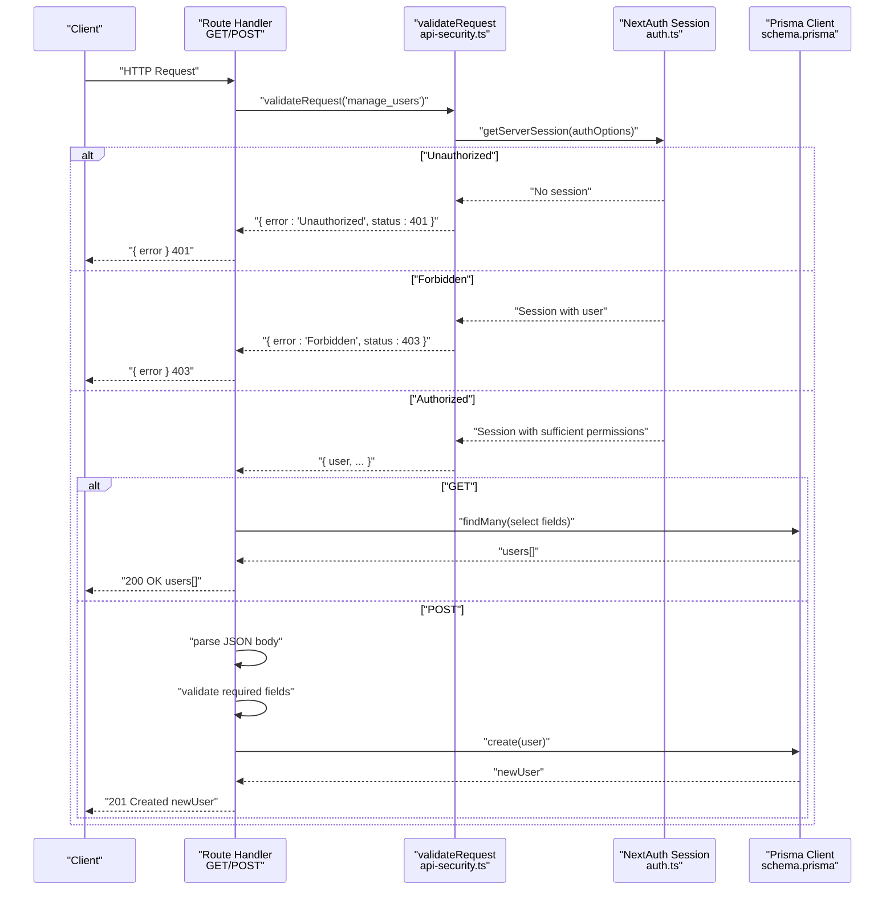
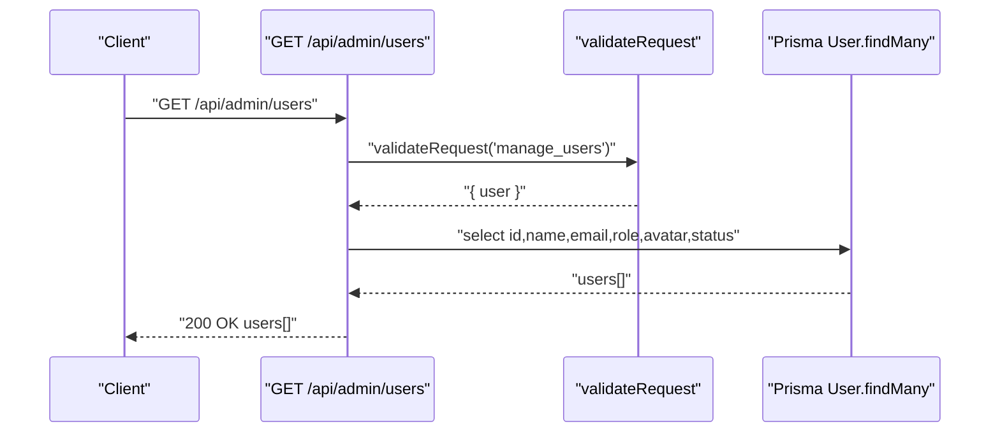
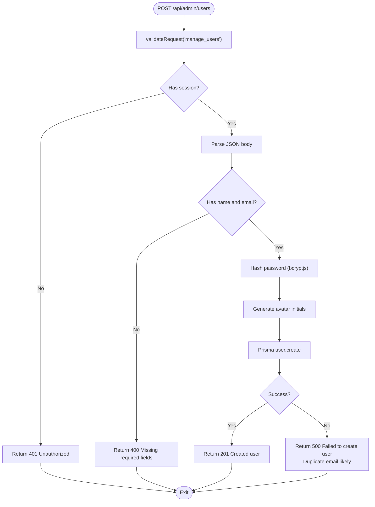
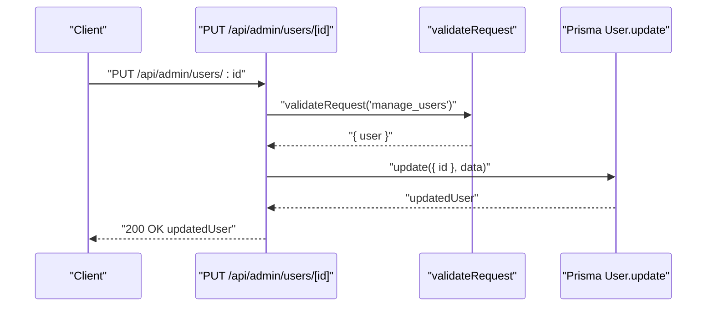
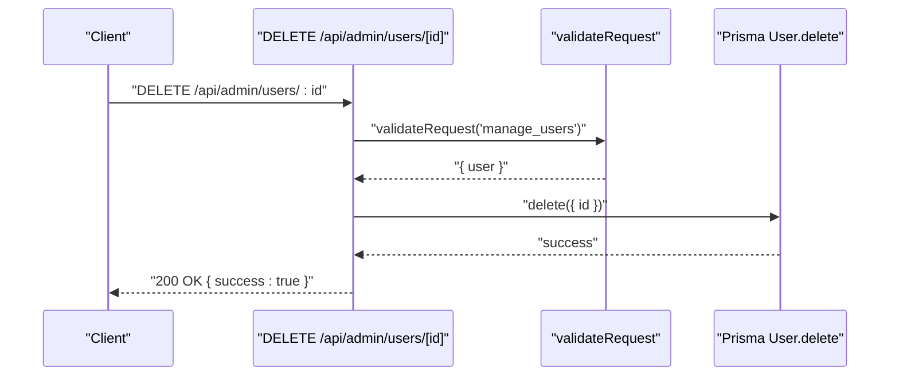
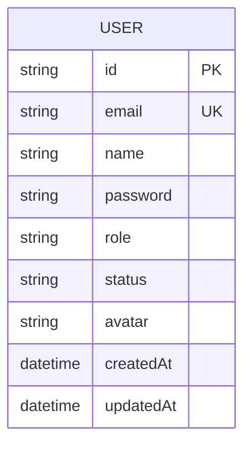
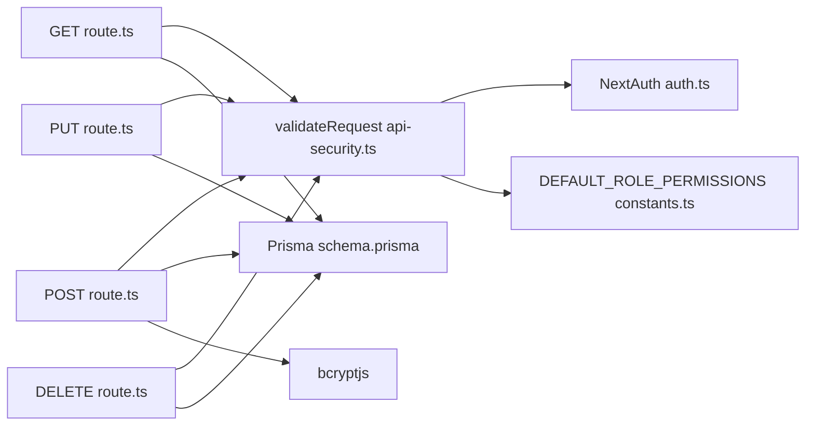

# User Management API

<cite>
**Referenced Files in This Document**
- [route.ts](file://app/api/admin/users/route.ts)
- [route.ts](file://app/api/admin/users/[id]/route.ts)
- [api-security.ts](file://lib/api-security.ts)
- [auth.ts](file://lib/auth.ts)
- [constants.ts](file://lib/constants.ts)
- [types.ts](file://lib/types.ts)
- [schema.prisma](file://prisma/schema.prisma)
- [UserService.ts](file://services/UserService.ts)
- [BaseService.ts](file://services/BaseService.ts)
- [middleware.ts](file://middleware.ts)
</cite>

## Table of Contents
1. [Introduction](#introduction)
2. [Project Structure](#project-structure)
3. [Core Components](#core-components)
4. [Architecture Overview](#architecture-overview)
5. [Detailed Component Analysis](#detailed-component-analysis)
6. [Dependency Analysis](#dependency-analysis)
7. [Performance Considerations](#performance-considerations)
8. [Troubleshooting Guide](#troubleshooting-guide)
9. [Conclusion](#conclusion)

## Introduction
This document provides comprehensive API documentation for the /api/admin/users endpoint in the analyzer-web application. It covers:
- GET method to retrieve all users with fields id, name, email, role, avatar, and status, protected by admin authentication and the manage_users permission.
- POST method to create new users, including request body parameters, default password assignment, automatic avatar generation, and password hashing using bcryptjs.
- Error handling behavior: 400 for missing required fields, 500 for database issues or duplicate emails, and 401/403 for authentication failures.
- Integration with Prisma ORM for database operations.
- Security considerations including password hashing, role-based access control, and data sanitization.
- Troubleshooting guidance for common issues.

## Project Structure
The user management API is implemented as Next.js App Router API routes under app/api/admin/users. Authentication and authorization are enforced via validateRequest, which relies on NextAuth sessions and role-permission mapping.

**Diagram sources**
- [route.ts](file://app/api/admin/users/route.ts#L1-L71)
- [route.ts](file://app/api/admin/users/[id]/route.ts#L1-L51)
- [api-security.ts](file://lib/api-security.ts#L71-L116)
- [auth.ts](file://lib/auth.ts#L1-L225)
- [constants.ts](file://lib/constants.ts#L24-L50)
- [schema.prisma](file://prisma/schema.prisma#L18-L53)
- [UserService.ts](file://services/UserService.ts#L1-L213)
- [BaseService.ts](file://services/BaseService.ts#L1-L20)

**Section sources**
- [route.ts](file://app/api/admin/users/route.ts#L1-L71)
- [route.ts](file://app/api/admin/users/[id]/route.ts#L1-L51)
- [api-security.ts](file://lib/api-security.ts#L71-L116)
- [auth.ts](file://lib/auth.ts#L1-L225)
- [constants.ts](file://lib/constants.ts#L24-L50)
- [schema.prisma](file://prisma/schema.prisma#L18-L53)
- [UserService.ts](file://services/UserService.ts#L1-L213)
- [BaseService.ts](file://services/BaseService.ts#L1-L20)

## Core Components
- Route handlers for GET and POST at /api/admin/users.
- Route handlers for PUT and DELETE at /api/admin/users/[id].
- validateRequest for session validation and permission checks.
- Prisma ORM for database operations.
- bcryptjs for password hashing.
- Automatic avatar generation from user name initials.

Key behaviors:
- GET returns a list of users with selected fields.
- POST validates presence of name and email, hashes password, generates avatar, and persists user.
- All endpoints require manage_users permission via validateRequest.

**Section sources**
- [route.ts](file://app/api/admin/users/route.ts#L1-L71)
- [route.ts](file://app/api/admin/users/[id]/route.ts#L1-L51)
- [api-security.ts](file://lib/api-security.ts#L71-L116)
- [constants.ts](file://lib/constants.ts#L24-L50)

## Architecture Overview
The API enforces authentication and authorization before invoking database operations. Requests flow through validateRequest, which extracts session information and verifies required permissions. Database interactions are performed via Prisma client.

**Diagram sources**
- [route.ts](file://app/api/admin/users/route.ts#L1-L71)
- [api-security.ts](file://lib/api-security.ts#L71-L116)
- [auth.ts](file://lib/auth.ts#L1-L225)
- [schema.prisma](file://prisma/schema.prisma#L18-L53)

## Detailed Component Analysis

### GET /api/admin/users
- Purpose: Retrieve all users with fields id, name, email, role, avatar, and status.
- Authentication: Requires admin session via validateRequest('manage_users').
- Authorization: Requires manage_users permission.
- Database: Uses Prisma user.findMany with selective field projection.
- Response: 200 OK with array of user objects; on database error, returns 500 with error message.

**Diagram sources**
- [route.ts](file://app/api/admin/users/route.ts#L1-L26)
- [api-security.ts](file://lib/api-security.ts#L71-L116)
- [schema.prisma](file://prisma/schema.prisma#L18-L53)

**Section sources**
- [route.ts](file://app/api/admin/users/route.ts#L1-L26)

### POST /api/admin/users
- Purpose: Create a new user.
- Authentication and Authorization: Same as GET.
- Request Body Parameters:
  - name (required)
  - email (required)
  - role (optional; defaults to ANALYST)
  - status (optional; defaults to active)
  - password (optional; defaults to Welcome123!)
- Behavior:
  - Validates presence of name and email; returns 400 if missing.
  - Hashes password using bcryptjs with a cost factor; default password is Welcome123!.
  - Generates avatar from initials of name (first two letters uppercase).
  - Persists user via Prisma user.create with selected fields.
  - Returns 201 Created with the created user object.
- Error Handling:
  - 400: Missing required fields (name and email).
  - 500: Database error or duplicate email; response message indicates duplicate email scenario.

**Diagram sources**
- [route.ts](file://app/api/admin/users/route.ts#L28-L71)
- [api-security.ts](file://lib/api-security.ts#L71-L116)
- [schema.prisma](file://prisma/schema.prisma#L18-L53)

**Section sources**
- [route.ts](file://app/api/admin/users/route.ts#L28-L71)

### PUT /api/admin/users/[id]
- Purpose: Update an existing user’s name, email, role, and status.
- Authentication and Authorization: Same as GET.
- Request Body Parameters:
  - name (optional)
  - email (optional)
  - role (optional)
  - status (optional)
- Behavior:
  - Updates user via Prisma user.update with provided fields.
  - Returns updated user object.
- Error Handling:
  - 500: Database error during update.

**Diagram sources**
- [route.ts](file://app/api/admin/users/[id]/route.ts#L1-L36)
- [api-security.ts](file://lib/api-security.ts#L71-L116)
- [schema.prisma](file://prisma/schema.prisma#L18-L53)

**Section sources**
- [route.ts](file://app/api/admin/users/[id]/route.ts#L1-L36)

### DELETE /api/admin/users/[id]
- Purpose: Delete a user by id.
- Authentication and Authorization: Same as GET.
- Behavior:
  - Deletes user via Prisma user.delete.
  - Returns success indicator.
- Error Handling:
  - 500: Database error during deletion.

**Diagram sources**
- [route.ts](file://app/api/admin/users/[id]/route.ts#L38-L51)
- [api-security.ts](file://lib/api-security.ts#L71-L116)
- [schema.prisma](file://prisma/schema.prisma#L18-L53)

**Section sources**
- [route.ts](file://app/api/admin/users/[id]/route.ts#L38-L51)

### Data Model and Prisma Integration
- User model fields include id, email (unique), name, password, role, status, avatar, and timestamps.
- The API selects only the fields exposed to clients (id, name, email, role, avatar, status).
- UserService provides reusable database operations and password hashing utilities.

**Diagram sources**
- [schema.prisma](file://prisma/schema.prisma#L18-L53)

**Section sources**
- [schema.prisma](file://prisma/schema.prisma#L18-L53)
- [UserService.ts](file://services/UserService.ts#L1-L213)

## Dependency Analysis
- Route handlers depend on validateRequest for session and permission checks.
- validateRequest depends on NextAuth sessions and DEFAULT_ROLE_PERMISSIONS mapping.
- Database operations rely on Prisma client configured in lib/prisma.
- Password hashing uses bcryptjs.
- Avatar generation uses name initials.

**Diagram sources**
- [route.ts](file://app/api/admin/users/route.ts#L1-L71)
- [route.ts](file://app/api/admin/users/[id]/route.ts#L1-L51)
- [api-security.ts](file://lib/api-security.ts#L71-L116)
- [auth.ts](file://lib/auth.ts#L1-L225)
- [constants.ts](file://lib/constants.ts#L24-L50)
- [schema.prisma](file://prisma/schema.prisma#L18-L53)

**Section sources**
- [route.ts](file://app/api/admin/users/route.ts#L1-L71)
- [route.ts](file://app/api/admin/users/[id]/route.ts#L1-L51)
- [api-security.ts](file://lib/api-security.ts#L71-L116)
- [auth.ts](file://lib/auth.ts#L1-L225)
- [constants.ts](file://lib/constants.ts#L24-L50)
- [schema.prisma](file://prisma/schema.prisma#L18-L53)

## Performance Considerations
- Field selection: The GET endpoint uses select to limit returned fields, reducing payload size.
- Password hashing cost: bcryptjs cost factor is set to balance security and performance.
- Rate limiting: validateRequest includes a basic in-memory rate limiter; for multi-instance deployments, replace with a distributed store.
- Middleware security headers: CSP, HSTS, and other headers improve resilience and compliance.

[No sources needed since this section provides general guidance]

## Troubleshooting Guide
Common issues and resolutions:
- Duplicate email error on POST:
  - Symptom: 500 error indicating duplicate email.
  - Cause: Email uniqueness constraint violation.
  - Resolution: Ensure unique email; verify database constraints.
- Password hashing failures:
  - Symptom: Authentication failures or unexpected bcrypt hash format.
  - Cause: Incorrect password storage or mismatched hashing.
  - Resolution: Confirm bcryptjs usage and cost factor; use provided scripts to verify and reset passwords.
- Session validation problems:
  - Symptom: 401 Unauthorized or 403 Forbidden.
  - Cause: Missing or invalid NextAuth session, or insufficient permissions.
  - Resolution: Verify authentication flow and ensure user has manage_users permission.

Security considerations:
- Password hashing: bcryptjs is used consistently for storing passwords.
- Role-based access control: validateRequest checks DEFAULT_ROLE_PERMISSIONS for manage_users.
- Data sanitization: Ensure request bodies are validated before persistence; the POST handler enforces presence of required fields.

**Section sources**
- [route.ts](file://app/api/admin/users/route.ts#L28-L71)
- [api-security.ts](file://lib/api-security.ts#L71-L116)
- [constants.ts](file://lib/constants.ts#L24-L50)
- [auth.ts](file://lib/auth.ts#L1-L225)
- [middleware.ts](file://middleware.ts#L1-L56)

## Conclusion
The /api/admin/users endpoint provides secure, role-protected user management with robust authentication, permission checks, and Prisma-backed persistence. The POST endpoint ensures strong defaults for password and avatar while maintaining strict validation and error handling. The included troubleshooting guidance helps diagnose common issues around authentication, hashing, and database constraints.