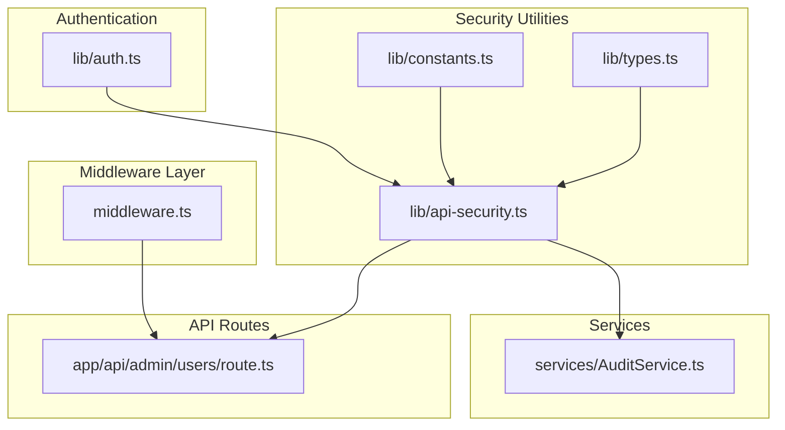
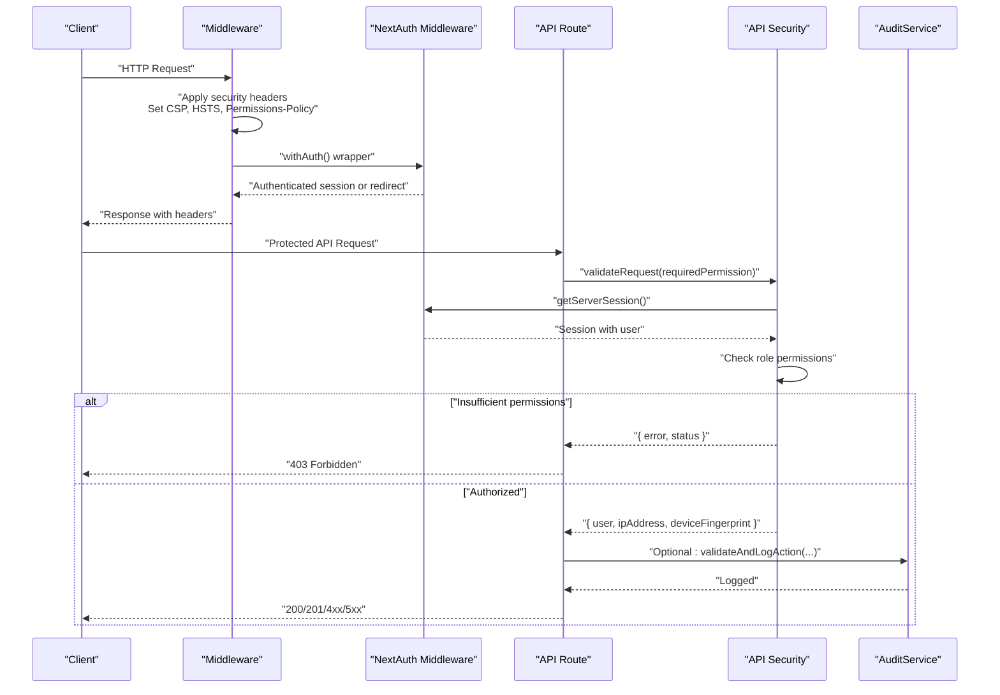
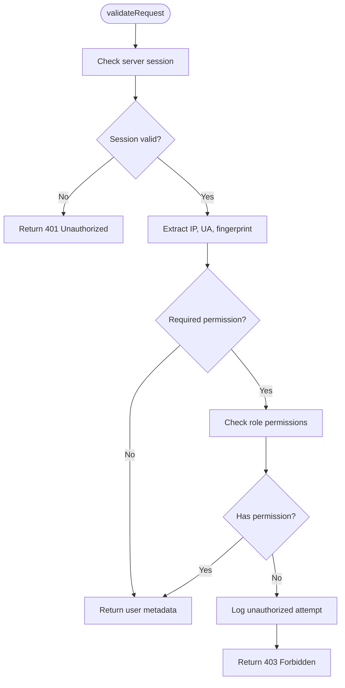
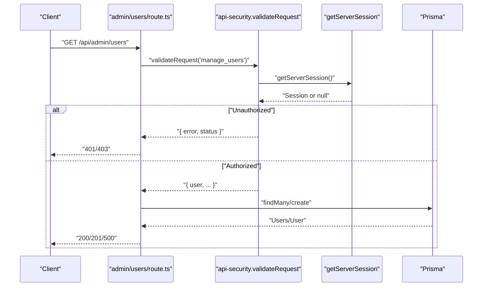
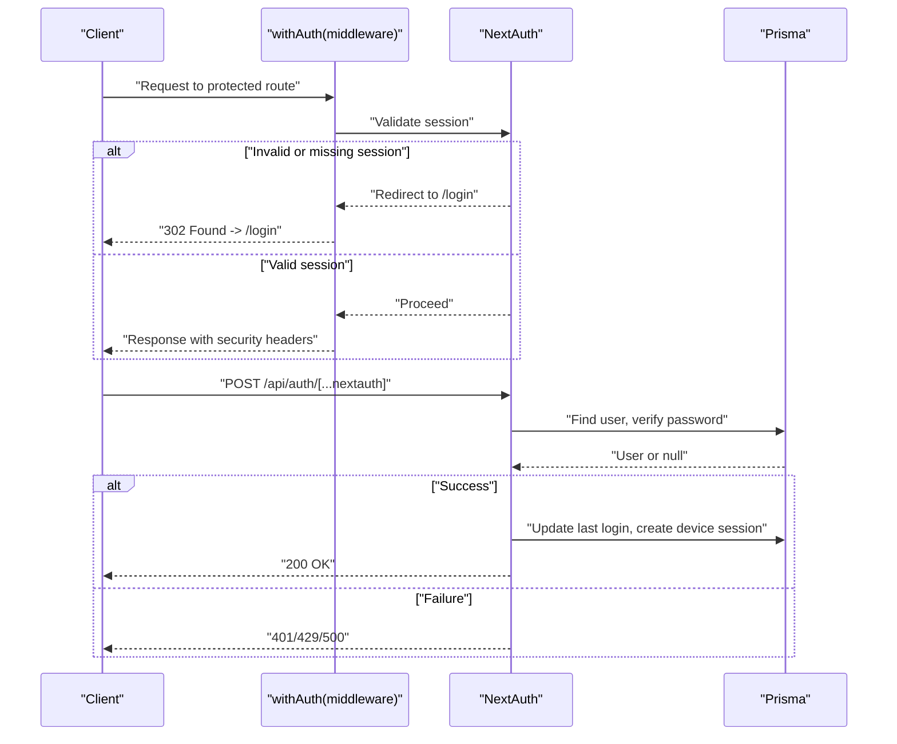
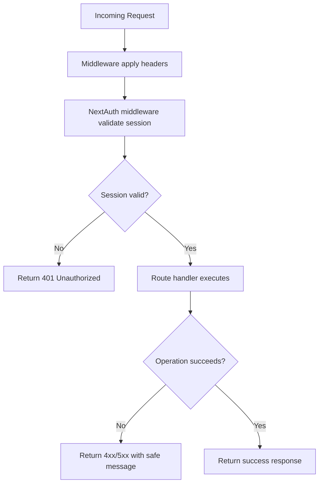
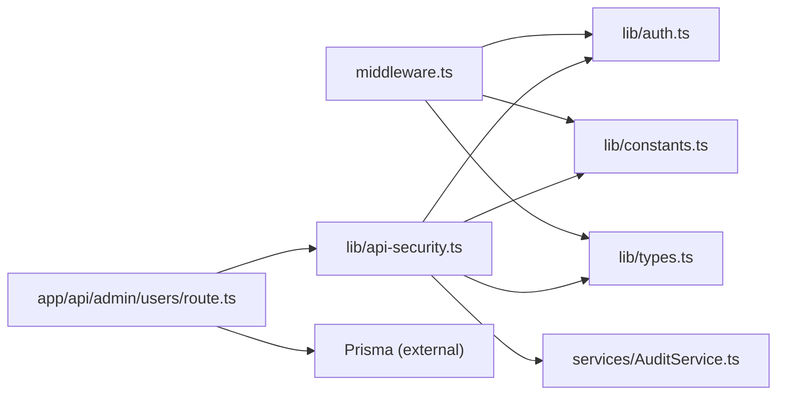

# API Security

<cite>
**Referenced Files in This Document**
- [middleware.ts](file://middleware.ts)
- [lib/api-security.ts](file://lib/api-security.ts)
- [app/api/admin/users/route.ts](file://app/api/admin/users/route.ts)
- [lib/auth.ts](file://lib/auth.ts)
- [lib/env-validation.ts](file://lib/env-validation.ts)
- [lib/constants.ts](file://lib/constants.ts)
- [lib/types.ts](file://lib/types.ts)
- [services/AuditService.ts](file://services/AuditService.ts)
- [README.md](file://README.md)
- [PRODUCTION_DEPLOYMENT_CHECKLIST.md](file://docs/PRODUCTION_DEPLOYMENT_CHECKLIST.md)
- [PRODUCTION_AUTH_FIX.md](file://PRODUCTION_AUTH_FIX.md)
</cite>

## Table of Contents
1. [Introduction](#introduction)
2. [Project Structure](#project-structure)
3. [Core Components](#core-components)
4. [Architecture Overview](#architecture-overview)
5. [Detailed Component Analysis](#detailed-component-analysis)
6. [Dependency Analysis](#dependency-analysis)
7. [Performance Considerations](#performance-considerations)
8. [Troubleshooting Guide](#troubleshooting-guide)
9. [Conclusion](#conclusion)
10. [Appendices](#appendices)

## Introduction
This document explains the API security framework implemented in the analyzer-web application. It covers middleware-based security headers (including X-Content-Type-Options, X-Frame-Options, X-XSS-Protection, Referrer-Policy, and HSTS in production), a Content Security Policy (CSP) tailored for banking environments, Permissions-Policy restrictions, rate limiting and input validation utilities, role-based access control enforcement at the API route level, authentication middleware configuration, secure error handling practices, and production security considerations such as secret management and cookie/session configuration.

## Project Structure
The security framework spans middleware, shared security utilities, authentication configuration, and API routes. The middleware applies global security headers and enforces authentication for protected paths. The API security library centralizes request validation, permission checks, audit logging, and rate limiting helpers. Authentication is handled by NextAuth with robust session management and login attempt controls. Audit logging is implemented as a service with cryptographic chaining for integrity.

**Diagram sources**
- [middleware.ts](file://middleware.ts#L1-L56)
- [lib/api-security.ts](file://lib/api-security.ts#L1-L238)
- [lib/auth.ts](file://lib/auth.ts#L1-L225)
- [services/AuditService.ts](file://services/AuditService.ts#L1-L264)
- [app/api/admin/users/route.ts](file://app/api/admin/users/route.ts#L1-L71)
- [lib/constants.ts](file://lib/constants.ts#L1-L50)
- [lib/types.ts](file://lib/types.ts#L1-L132)

**Section sources**
- [middleware.ts](file://middleware.ts#L1-L56)
- [lib/api-security.ts](file://lib/api-security.ts#L1-L238)
- [lib/auth.ts](file://lib/auth.ts#L1-L225)
- [services/AuditService.ts](file://services/AuditService.ts#L1-L264)
- [app/api/admin/users/route.ts](file://app/api/admin/users/route.ts#L1-L71)
- [lib/constants.ts](file://lib/constants.ts#L1-L50)
- [lib/types.ts](file://lib/types.ts#L1-L132)

## Core Components
- Middleware security headers: Applies X-Content-Type-Options, X-Frame-Options, X-XSS-Protection, Referrer-Policy, and HSTS in production. Also sets a banking-compliant CSP and Permissions-Policy.
- API security utilities: Provides request validation, permission checks, audit logging, device fingerprinting, IP extraction, and basic in-memory rate limiting.
- Authentication: NextAuth configuration with JWT sessions, CSRF protection, failed login tracking, lockouts, and device session tracking.
- Audit service: Centralized logging with cryptographic chaining for tamper detection.
- RBAC enforcement: Route-level permission checks using role-to-permission mapping.

**Section sources**
- [middleware.ts](file://middleware.ts#L1-L56)
- [lib/api-security.ts](file://lib/api-security.ts#L1-L238)
- [lib/auth.ts](file://lib/auth.ts#L1-L225)
- [services/AuditService.ts](file://services/AuditService.ts#L1-L264)
- [lib/constants.ts](file://lib/constants.ts#L1-L50)
- [lib/types.ts](file://lib/types.ts#L1-L132)

## Architecture Overview
The security architecture integrates middleware, authentication, and API route handlers. Middleware applies global security headers and redirects unauthenticated users to the login page. Authentication middleware ensures sessions are valid for protected routes. API routes call shared validation utilities to enforce permissions and log actions. Audit logging captures metadata such as IP and device fingerprints.

**Diagram sources**
- [middleware.ts](file://middleware.ts#L1-L56)
- [lib/api-security.ts](file://lib/api-security.ts#L1-L238)
- [lib/auth.ts](file://lib/auth.ts#L1-L225)
- [services/AuditService.ts](file://services/AuditService.ts#L1-L264)
- [app/api/admin/users/route.ts](file://app/api/admin/users/route.ts#L1-L71)

## Detailed Component Analysis

### Middleware Security Headers and Policies
- X-Content-Type-Options: Prevents MIME-type sniffing.
- X-Frame-Options: Blocks embedding in frames to mitigate clickjacking.
- X-XSS-Protection: Enables XSS filtering in legacy browsers.
- Referrer-Policy: Limits referrer exposure for privacy.
- HSTS (production only): Enforces HTTPS for a year with subdomains.
- CSP (banking-compliant): Restricts script, style, font, image, and connect sources; disallows inline scripts/styles except whitelisted CDN sources; restricts frame ancestors and base/form actions.
- Permissions-Policy: Explicitly disables camera, microphone, and geolocation.

These headers are applied to all responses passing through the middleware and are matched to protect non-public paths while allowing login and NextAuth endpoints.

**Section sources**
- [middleware.ts](file://middleware.ts#L1-L56)

### Content Security Policy (CSP) for Banking Environments
- default-src 'self': Defaults to same-origin.
- script-src: Allows 'self', 'unsafe-inline', 'unsafe-eval', plus specific CDNs for Tailwind and AI Studio.
- style-src: Allows 'self' and Google Fonts stylesheet URL.
- font-src: Allows 'self' and Google Fonts CDN.
- img-src: Allows 'self', data:, and https:.
- connect-src: Allows 'self' and AI Studio CDN.
- frame-ancestors 'none': Disables framing.
- base-uri 'self': Restricts base URI.
- form-action 'self': Restricts form submission targets.

This CSP balances functionality (CDN-hosted assets) with strict defaults suitable for financial data handling.

**Section sources**
- [middleware.ts](file://middleware.ts#L22-L34)

### Permissions-Policy Implementation
- camera=(): Disables camera access.
- microphone=(): Disables microphone access.
- geolocation=(): Disables geolocation access.

This policy minimizes browser feature exposure for banking applications.

**Section sources**
- [middleware.ts](file://middleware.ts#L36-L40)

### Rate Limiting and Input Validation
- In-memory rate limiter: Tracks counts per identifier and resets on window expiration. Suitable for single-instance deployments; multi-instance deployments should use Redis or equivalent.
- Input validation: Extracts client IP and user agent, generates device fingerprint, and performs permission checks against role-to-permission mapping.
- Audit logging: Captures unauthorized access attempts and action logs with optional before/after states.

**Diagram sources**
- [lib/api-security.ts](file://lib/api-security.ts#L71-L116)
- [lib/api-security.ts](file://lib/api-security.ts#L121-L156)
- [lib/constants.ts](file://lib/constants.ts#L24-L50)
- [lib/types.ts](file://lib/types.ts#L1-L60)

**Section sources**
- [lib/api-security.ts](file://lib/api-security.ts#L1-L238)
- [lib/constants.ts](file://lib/constants.ts#L1-L50)
- [lib/types.ts](file://lib/types.ts#L1-L132)

### Role-Based Access Control at API Route Level
- The admin users API enforces a permission check for managing users.
- On GET and POST, the route calls the validation utility with the required permission.
- On insufficient permissions, the route returns a 403 response with an error message.
- On success, the route proceeds with database operations and returns appropriate responses.

**Diagram sources**
- [app/api/admin/users/route.ts](file://app/api/admin/users/route.ts#L1-L71)
- [lib/api-security.ts](file://lib/api-security.ts#L71-L116)
- [lib/auth.ts](file://lib/auth.ts#L1-L225)

**Section sources**
- [app/api/admin/users/route.ts](file://app/api/admin/users/route.ts#L1-L71)
- [lib/api-security.ts](file://lib/api-security.ts#L71-L116)
- [lib/constants.ts](file://lib/constants.ts#L24-L50)
- [lib/types.ts](file://lib/types.ts#L1-L60)

### Authentication Middleware Configuration
- NextAuth middleware wrapper protects routes and redirects unauthenticated users to the login page.
- Authentication options include JWT sessions, CSRF protection, and callbacks to attach user roles and session tokens to the session.
- Login attempt tracking and lockout logic are implemented in the authentication provider, including database updates and audit logging.

**Diagram sources**
- [middleware.ts](file://middleware.ts#L1-L56)
- [lib/auth.ts](file://lib/auth.ts#L1-L225)

**Section sources**
- [middleware.ts](file://middleware.ts#L1-L56)
- [lib/auth.ts](file://lib/auth.ts#L1-L225)

### Secure Error Handling and Session Validation
- Authentication middleware ensures session presence and validity for protected routes.
- API routes return minimal, non-leaking error messages and appropriate HTTP status codes.
- Audit logging captures unauthorized attempts and login/logout events with contextual metadata.
- Environment validation enforces secure configuration at startup, preventing deployment with weak secrets or misconfigured URLs.

**Diagram sources**
- [middleware.ts](file://middleware.ts#L1-L56)
- [lib/api-security.ts](file://lib/api-security.ts#L71-L116)
- [lib/auth.ts](file://lib/auth.ts#L1-L225)
- [services/AuditService.ts](file://services/AuditService.ts#L1-L264)

**Section sources**
- [lib/api-security.ts](file://lib/api-security.ts#L71-L116)
- [lib/auth.ts](file://lib/auth.ts#L1-L225)
- [services/AuditService.ts](file://services/AuditService.ts#L1-L264)
- [lib/env-validation.ts](file://lib/env-validation.ts#L1-L171)

### Production Security Considerations
- Secret management: NEXTAUTH_SECRET must be set to a strong, random value and regenerated periodically. The project documents rotating secrets and rebuilding the application after changes.
- Cookie/session configuration: NextAuth uses JWT sessions with a configurable max age and update interval. Ensure HTTPS is enforced in production (HSTS).
- Protection against common vulnerabilities:
  - CSRF: NextAuth provides built-in CSRF protection for authentication routes; consider adding CSRF tokens for additional API routes if needed.
  - XSS: CSP restricts script sources and blocks inline scripts/styles except whitelisted CDNs; X-XSS-Protection header is set.
  - SQL injection: Prisma ORM is used for type-safe database operations; avoid raw SQL and parameterized queries.
  - Clickjacking: X-Frame-Options is set to DENY; CSP frame-ancestors is 'none'.
  - Information leakage: Error messages are sanitized; environment validation prevents deployment with insecure configurations.

**Section sources**
- [lib/env-validation.ts](file://lib/env-validation.ts#L1-L171)
- [middleware.ts](file://middleware.ts#L1-L56)
- [lib/auth.ts](file://lib/auth.ts#L1-L225)
- [PRODUCTION_DEPLOYMENT_CHECKLIST.md](file://docs/PRODUCTION_DEPLOYMENT_CHECKLIST.md#L1-L258)
- [PRODUCTION_AUTH_FIX.md](file://PRODUCTION_AUTH_FIX.md#L1-L288)
- [README.md](file://README.md#L163-L196)

## Dependency Analysis
The security framework relies on several modules:
- Middleware depends on NextAuth middleware for authentication redirection and session validation.
- API security utilities depend on NextAuth for session retrieval, constants for role-to-permission mapping, and the audit service for logging.
- Authentication configuration depends on Prisma for user and device session persistence.
- Audit service depends on Prisma for storing logs and computing cryptographic hashes.

**Diagram sources**
- [middleware.ts](file://middleware.ts#L1-L56)
- [lib/api-security.ts](file://lib/api-security.ts#L1-L238)
- [lib/auth.ts](file://lib/auth.ts#L1-L225)
- [services/AuditService.ts](file://services/AuditService.ts#L1-L264)
- [app/api/admin/users/route.ts](file://app/api/admin/users/route.ts#L1-L71)
- [lib/constants.ts](file://lib/constants.ts#L1-L50)
- [lib/types.ts](file://lib/types.ts#L1-L132)

**Section sources**
- [middleware.ts](file://middleware.ts#L1-L56)
- [lib/api-security.ts](file://lib/api-security.ts#L1-L238)
- [lib/auth.ts](file://lib/auth.ts#L1-L225)
- [services/AuditService.ts](file://services/AuditService.ts#L1-L264)
- [app/api/admin/users/route.ts](file://app/api/admin/users/route.ts#L1-L71)
- [lib/constants.ts](file://lib/constants.ts#L1-L50)
- [lib/types.ts](file://lib/types.ts#L1-L132)

## Performance Considerations
- In-memory rate limiting is simple but resets on server restart and does not scale across instances. For multi-instance deployments, integrate Redis-backed rate limiting.
- Device fingerprinting and audit logging add CPU overhead; consider batching or sampling in high-throughput scenarios.
- Authentication and session retrieval are lightweight with JWT; ensure database performance for audit and device session operations.

[No sources needed since this section provides general guidance]

## Troubleshooting Guide
Common production issues and resolutions:
- NEXTAUTH_SECRET not set or changed without rebuilding: Regenerate the secret, update the environment, rebuild, and restart the application.
- NEXTAUTH_URL mismatch: Ensure the URL matches the production domain and protocol exactly.
- No users in database: Initialize an admin user or reset passwords for existing users.
- Account locked: Use the reset password flow to unlock and reset credentials.
- Environment validation failures: Review and fix missing or weak secrets, invalid URLs, and incorrect database paths.

**Section sources**
- [PRODUCTION_AUTH_FIX.md](file://PRODUCTION_AUTH_FIX.md#L1-L288)
- [lib/env-validation.ts](file://lib/env-validation.ts#L1-L171)
- [README.md](file://README.md#L74-L103)

## Conclusion
The analyzer-web application implements a comprehensive API security framework centered on middleware-provided security headers, a banking-aligned CSP, Permissions-Policy restrictions, robust authentication with NextAuth, role-based access control at the API route level, and centralized audit logging. While in-memory rate limiting and login attempt tracking are suitable for single-instance deployments, production readiness requires Redis-backed rate limiting, strict secret rotation, and HTTPS enforcement. The provided utilities and configurations offer a solid foundation for secure operation in banking environments.

[No sources needed since this section summarizes without analyzing specific files]

## Appendices

### Appendix A: Security Headers Reference
- X-Content-Type-Options: nosniff
- X-Frame-Options: DENY
- X-XSS-Protection: 1; mode=block
- Referrer-Policy: strict-origin-when-cross-origin
- HSTS (production): max-age=31536000; includeSubDomains
- CSP: default-src 'self'; script-src 'self' 'unsafe-inline' 'unsafe-eval' https://cdn.tailwindcss.com https://aistudiocdn.com; style-src 'self' 'unsafe-inline' https://fonts.googleapis.com; font-src 'self' https://fonts.gstatic.com; img-src 'self' data: https:; connect-src 'self' https://aistudiocdn.com; frame-ancestors 'none'; base-uri 'self'; form-action 'self'
- Permissions-Policy: camera=(), microphone=(), geolocation=()

**Section sources**
- [middleware.ts](file://middleware.ts#L1-L56)

### Appendix B: RBAC Permissions Matrix
- Admin: manage_users, view_admin_panel, unmatch_transactions, view_all_logs, export_data, perform_matching, manage_periods, approve_adjustments
- Manager: unmatch_transactions, view_all_logs, export_data, perform_matching, approve_adjustments
- Analyst: export_data, perform_matching
- Auditor: view_all_logs, export_data

**Section sources**
- [lib/constants.ts](file://lib/constants.ts#L24-L50)
- [lib/types.ts](file://lib/types.ts#L1-L60)