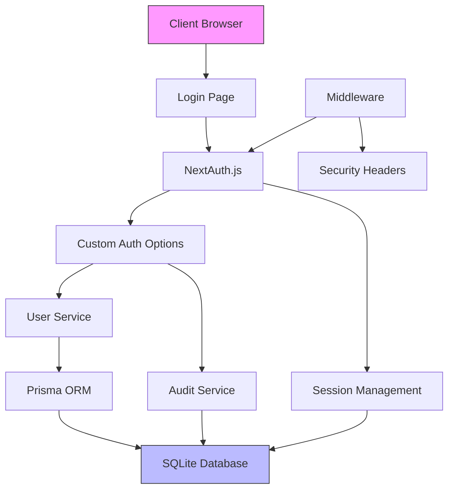
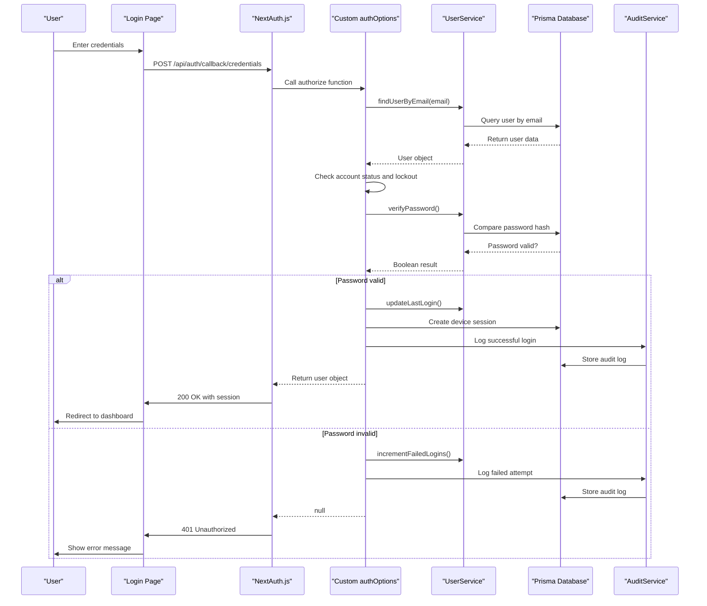
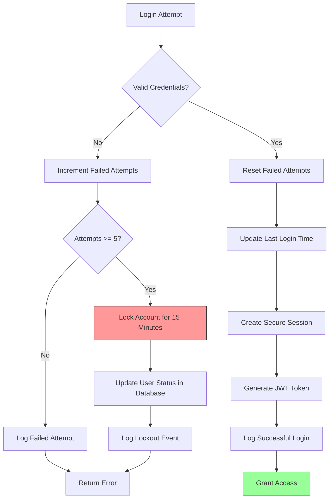
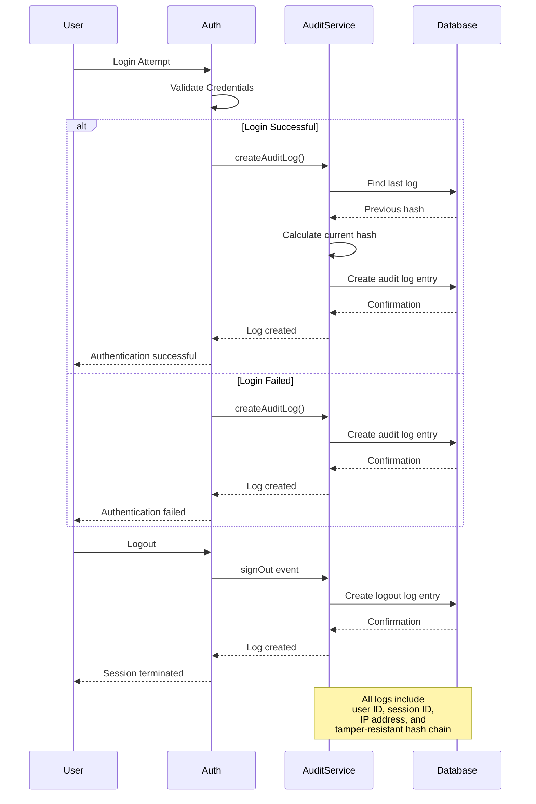
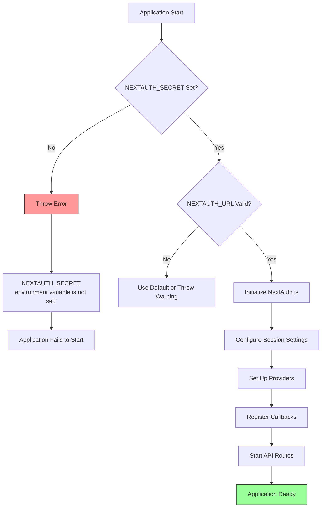
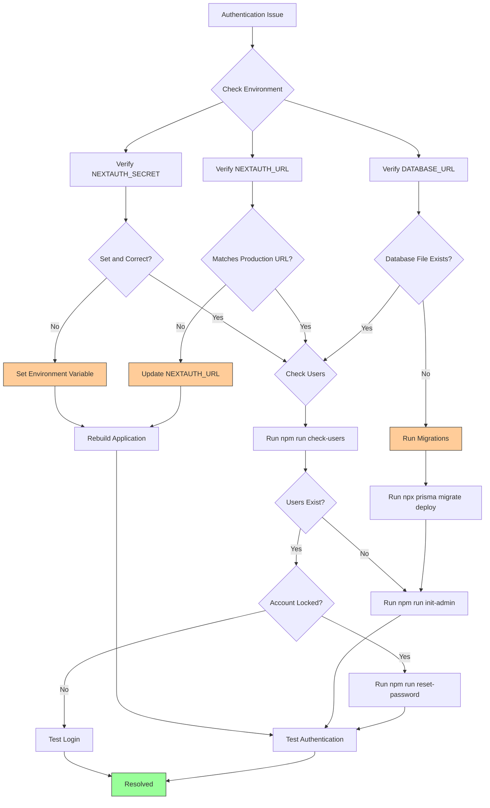

# Authentication System

<cite>
**Referenced Files in This Document**   
- [lib/auth.ts](file://lib/auth.ts)
- [app/api/auth/[...nextauth]/route.ts](file://app/api/auth/[...nextauth]/route.ts)
- [services/UserService.ts](file://services/UserService.ts)
- [services/AuditService.ts](file://services/AuditService.ts)
- [prisma/schema.prisma](file://prisma/schema.prisma)
- [app/login/page.tsx](file://app/login/page.tsx)
- [middleware.ts](file://middleware.ts)
- [lib/constants.ts](file://lib/constants.ts)
- [lib/types.ts](file://lib/types.ts)
- [types/next-auth.d.ts](file://types/next-auth.d.ts)
- [PRODUCTION_AUTH_FIX.md](file://PRODUCTION_AUTH_FIX.md)
- [README.md](file://README.md)
- [docs/PRODUCTION_TROUBLESHOOTING.md](file://docs/PRODUCTION_TROUBLESHOOTING.md)
</cite>

## Table of Contents
1. [Introduction](#introduction)
2. [Authentication Architecture](#authentication-architecture)
3. [NextAuth.js Integration](#nextauthjs-integration)
4. [Security Features](#security-features)
5. [Session Management](#session-management)
6. [Role-Based Access Control](#role-based-access-control)
7. [Audit Logging](#audit-logging)
8. [Configuration Requirements](#configuration-requirements)
9. [Deployment Issues and Solutions](#deployment-issues-and-solutions)
10. [Conclusion](#conclusion)

## Introduction

The authentication system in the analyzer-web application provides secure user access control for a financial reconciliation platform designed for banking environments. Built on NextAuth.js with custom database-backed authentication, the system supports both credential-based login and OAuth flows. The implementation ensures compliance with enterprise security standards through progressive account locking, comprehensive audit logging, role-based access control, and secure session management. This documentation details the architecture, implementation, and operational aspects of the authentication system, providing guidance for secure deployment and troubleshooting.

**Section sources**
- [README.md](file://README.md#L1-L253)

## Authentication Architecture

The authentication system follows a layered architecture with clear separation of concerns between the authentication framework, business logic, and data persistence layers. At its core, the system uses NextAuth.js as the authentication framework, extended with custom logic for database integration and enhanced security features. The architecture consists of several key components:

1. **NextAuth.js Framework**: Handles the authentication flow, session management, and provider integration
2. **Custom Auth Options**: Defined in `lib/auth.ts`, this configuration extends NextAuth.js with database-backed authentication
3. **User Service**: Manages user-related operations including password verification and account status checks
4. **Audit Service**: Logs all authentication events for compliance and monitoring
5. **Prisma ORM**: Provides type-safe database access for user and session data
6. **Middleware**: Enforces security policies and handles request context

The system is designed for production deployment in banking environments, with features such as secure password hashing, account lockout mechanisms, and comprehensive audit trails. The architecture supports both single-instance deployments and can be extended for multi-instance scenarios with appropriate backend storage for session and rate-limiting data.



**Diagram sources**
- [lib/auth.ts](file://lib/auth.ts#L1-L225)
- [services/UserService.ts](file://services/UserService.ts#L1-L213)
- [services/AuditService.ts](file://services/AuditService.ts#L1-L264)
- [prisma/schema.prisma](file://prisma/schema.prisma#L1-L374)

**Section sources**
- [lib/auth.ts](file://lib/auth.ts#L1-L225)
- [services/UserService.ts](file://services/UserService.ts#L1-L213)
- [services/AuditService.ts](file://services/AuditService.ts#L1-L264)

## NextAuth.js Integration

The analyzer-web application integrates NextAuth.js through a custom configuration in `lib/auth.ts` that extends the default functionality with database-backed authentication. The integration is initialized in the API route at `app/api/auth/[...nextauth]/route.ts`, which serves as the entry point for all authentication requests. The custom `authOptions` configuration defines the authentication strategy, session management, and provider setup.

The system implements a credentials provider that handles username and password authentication against the database. When a user attempts to log in, the `authorize` function in the credentials provider is called, which performs several security checks before authenticating the user. These checks include verifying the account status, checking for lockout conditions, and validating the password against the hashed value stored in the database.

The integration also includes custom callbacks for JWT and session management, which extend the default session object with additional user information such as role, avatar, and session token. This information is used throughout the application to enforce role-based access control and provide personalized user experiences.



**Diagram sources**
- [lib/auth.ts](file://lib/auth.ts#L1-L225)
- [app/api/auth/[...nextauth]/route.ts](file://app/api/auth/[...nextauth]/route.ts)
- [services/UserService.ts](file://services/UserService.ts#L1-L213)
- [services/AuditService.ts](file://services/AuditService.ts#L1-L264)

**Section sources**
- [lib/auth.ts](file://lib/auth.ts#L1-L225)
- [app/api/auth/[...nextauth]/route.ts](file://app/api/auth/[...nextauth]/route.ts)

## Security Features

The authentication system implements multiple layers of security to protect against common threats and ensure compliance with banking industry standards. The primary security features include progressive account locking, secure password storage, and comprehensive input validation.

Account lockout is implemented with a progressive mechanism that locks accounts after five failed login attempts for a duration of 15 minutes. This is enforced through both in-memory tracking and database persistence. The in-memory tracking provides immediate protection against brute force attacks, while the database persistence ensures that lockout status survives server restarts. The lockout duration is configurable through the `LOCKOUT_TIME_MS` constant in `lib/constants.ts`.

Password security is ensured through the use of bcrypt with a cost factor of 12, which provides strong protection against password cracking attacks. Passwords are hashed before storage in the database, and the hashing process is handled by the UserService when creating or updating user accounts. The system also validates password strength during account creation, requiring a minimum of 12 characters with mixed complexity.

The authentication flow includes multiple security checks to prevent common vulnerabilities. These include CSRF protection provided by NextAuth.js, secure session management with JWT tokens, and comprehensive input validation to prevent injection attacks. The system also implements security headers through middleware to protect against XSS, clickjacking, and other client-side attacks.



**Diagram sources**
- [lib/auth.ts](file://lib/auth.ts#L1-L225)
- [services/UserService.ts](file://services/UserService.ts#L1-L213)
- [lib/constants.ts](file://lib/constants.ts#L1-L50)
- [middleware.ts](file://middleware.ts#L1-L56)

**Section sources**
- [lib/auth.ts](file://lib/auth.ts#L1-L225)
- [services/UserService.ts](file://services/UserService.ts#L1-L213)
- [lib/constants.ts](file://lib/constants.ts#L1-L50)

## Session Management

The session management system in analyzer-web provides secure and trackable user sessions with device-level monitoring. The system uses JWT-based sessions with a 24-hour expiration period, configured in the `authOptions` session settings. Each successful login generates a unique session token that is stored in both the client-side session and the database for tracking purposes.

When a user successfully authenticates, the system creates a device session record in the database that includes information about the device, IP address, and session token. This allows for monitoring of active sessions and detection of suspicious activity. The device session is marked as current and can be used to identify the user's active devices.

The system implements proper session cleanup through event handlers that trigger when a user logs out. The `signOut` event in the authOptions configuration updates the device session in the database to mark it as inactive. This ensures that session records are properly maintained and can be used for audit purposes.

Session security is enhanced through the use of secure JWT tokens that include user role and other relevant information. The JWT callbacks in the authOptions configuration ensure that the token is properly populated with user data and that this data is synchronized with the session object. This allows for efficient role-based access control without requiring additional database queries.

```mermaid
classDiagram
class Session {
+maxAge : number
+updateAge : number
+strategy : string
}
class JWT {
+id : string
+name : string
+email : string
+role : UserRole
+avatar : string
+sessionToken : string
}
class DeviceSession {
+id : string
+userId : string
+device : string
+ip : string
+location : string
+lastActive : number
+isCurrent : boolean
+token : string
+expiresAt : DateTime
+createdAt : DateTime
}
class User {
+id : string
+email : string
+name : string
+role : UserRole
+status : string
+lastLogin : DateTime
+failedLoginAttempts : number
+lockedUntil : DateTime
}
Session --> JWT : "contains"
Session --> DeviceSession : "creates"
JWT --> User : "derived from"
DeviceSession --> User : "belongs to"
User --> DeviceSession : "has many"
note right of Session
Session configuration
maxAge : 24 * 60 * 60 (24 hours)
updateAge : 60 * 60 (1 hour)
strategy : "jwt"
end note
note right of DeviceSession
Tracks user's active devices
Used for security monitoring
Supports session management
end note
```

**Diagram sources**
- [lib/auth.ts](file://lib/auth.ts#L1-L225)
- [prisma/schema.prisma](file://prisma/schema.prisma#L1-L374)
- [lib/types.ts](file://lib/types.ts#L1-L132)

**Section sources**
- [lib/auth.ts](file://lib/auth.ts#L1-L225)
- [prisma/schema.prisma](file://prisma/schema.prisma#L1-L374)

## Role-Based Access Control

The role-based access control (RBAC) system in analyzer-web implements a comprehensive permissions model that governs user access to application features and data. The system defines four distinct roles—Admin, Manager, Analyst, and Auditor—each with specific permissions that determine what actions they can perform within the application.

User roles are persisted in multiple locations to ensure consistent access control across the application. The role is stored in the database as part of the user record, included in the JWT token for authentication, and available in the session object for authorization. This multi-layered approach ensures that role information is available wherever it's needed, from API route protection to UI element visibility.

The RBAC implementation is defined in `lib/types.ts` with the `UserRole` enum and `RolePermissions` type. These definitions are used throughout the application to enforce access control. The permissions are also configured in `lib/constants.ts` with the `DEFAULT_ROLE_PERMISSIONS` constant, which maps each role to its allowed actions.

The system enforces role-based access at multiple levels:
1. **UI Level**: Components are conditionally rendered based on user role
2. **API Route Level**: Middleware checks user role before allowing access to protected routes
3. **Service Level**: Business logic validates user permissions before performing sensitive operations

This layered approach ensures that even if a user attempts to bypass UI restrictions, the backend will still enforce the appropriate access controls.

```mermaid
erDiagram
USER ||--o{ ROLE_PERMISSION : has
USER ||--o{ AUDIT_LOG : generates
USER ||--o{ DEVICE_SESSION : creates
USER {
string id PK
string email UK
string name
string role FK
string status
datetime lastLogin
int failedLoginAttempts
datetime lockedUntil
datetime createdAt
datetime updatedAt
}
ROLE_PERMISSION {
string role PK
json permissions
}
AUDIT_LOG {
string id PK
string userId FK
string sessionId
string ipAddress
string actionType
string entityType
string entityId
text changeSummary
datetime timestamp
string previousHash
string currentHash
}
DEVICE_SESSION {
string id PK
string userId FK
string device
string ip
string location
boolean isCurrent
string token UK
datetime expiresAt
datetime createdAt
}
class USER "User Account"
class ROLE_PERMISSION "Role Permissions"
class AUDIT_LOG "Audit Trail"
class DEVICE_SESSION "Active Sessions"
```

**Diagram sources**
- [lib/types.ts](file://lib/types.ts#L1-L132)
- [lib/constants.ts](file://lib/constants.ts#L1-L50)
- [prisma/schema.prisma](file://prisma/schema.prisma#L1-L374)
- [types/next-auth.d.ts](file://types/next-auth.d.ts#L1-L29)

**Section sources**
- [lib/types.ts](file://lib/types.ts#L1-L132)
- [lib/constants.ts](file://lib/constants.ts#L1-L50)
- [types/next-auth.d.ts](file://types/next-auth.d.ts#L1-L29)

## Audit Logging

The audit logging system in analyzer-web provides comprehensive tracking of all authentication events and user actions for compliance and security monitoring. Every authentication event—successful login, failed login, and logout—is logged with detailed information that can be used for forensic analysis and compliance reporting.

The audit logging is implemented through the AuditService, which creates log entries in the database for each significant event. Each log entry includes critical information such as the user ID, session ID, IP address, action type, entity type, and a change summary. The system also implements tamper detection through a hash chain mechanism, where each log entry contains a hash of the previous entry, making it possible to detect if logs have been altered.

For authentication events, the system logs specific details:
- **Successful Login**: Records the successful authentication, including the session token and IP address
- **Failed Login**: Logs each failed attempt, including the reason for failure and the number of attempts
- **Account Lockout**: Records when an account is locked due to excessive failed attempts
- **Logout**: Logs when a user explicitly logs out of the system

The audit logs are stored in the `AuditLog` table in the database, with indexes on key fields to enable efficient querying. The system also provides methods to retrieve audit logs with filtering options, allowing administrators to investigate specific events or user activities.



**Diagram sources**
- [lib/auth.ts](file://lib/auth.ts#L1-L225)
- [services/AuditService.ts](file://services/AuditService.ts#L1-L264)
- [prisma/schema.prisma](file://prisma/schema.prisma#L1-L374)

**Section sources**
- [lib/auth.ts](file://lib/auth.ts#L1-L225)
- [services/AuditService.ts](file://services/AuditService.ts#L1-L264)

## Configuration Requirements

The authentication system requires specific environment variables to be configured for proper operation, particularly in production environments. These configuration requirements are critical for security and functionality, and failing to set them correctly can result in authentication failures or security vulnerabilities.

The primary configuration requirements are:

1. **NEXTAUTH_SECRET**: A cryptographically secure secret key used to sign JWT tokens and encrypt session data. This must be set to a random 32-character string generated with `openssl rand -base64 32`. The secret must be consistent between application builds and runtime, as changing it without rebuilding will invalidate existing sessions.

2. **NEXTAUTH_URL**: The production URL of the application, which must match exactly how users access the system (including protocol). For production deployments, this should use HTTPS and the actual domain name, not localhost or HTTP.

3. **DATABASE_URL**: The connection string for the database, which for SQLite is typically a file path like `file:./prisma/production.db`.

4. **NODE_ENV**: Should be set to `production` for production deployments to enable production-specific behaviors and security features.

These environment variables should be set in a `.env` file in the production environment. The application validates the presence of `NEXTAUTH_SECRET` at startup and will throw an error if it is not set, preventing the application from running with insecure defaults.



**Diagram sources**
- [lib/auth.ts](file://lib/auth.ts#L1-L225)
- [README.md](file://README.md#L1-L253)
- [PRODUCTION_AUTH_FIX.md](file://PRODUCTION_AUTH_FIX.md#L1-L288)

**Section sources**
- [lib/auth.ts](file://lib/auth.ts#L1-L225)
- [README.md](file://README.md#L1-L253)
- [PRODUCTION_AUTH_FIX.md](file://PRODUCTION_AUTH_FIX.md#L1-L288)

## Deployment Issues and Solutions

Deploying the authentication system to production can encounter several common issues, primarily related to configuration, environment variables, and database initialization. The most frequent problems and their solutions are documented in the PRODUCTION_AUTH_FIX.md and PRODUCTION_TROUBLESHOOTING.md files.

The most common deployment issues include:

1. **Invalid Credentials in Production**: This typically occurs when the `NEXTAUTH_SECRET` is not set or differs between build time and runtime. The solution is to ensure the secret is set in the environment and to rebuild the application if the secret is changed.

2. **NEXTAUTH_URL Mismatch**: When the `NEXTAUTH_URL` does not exactly match the production domain (including protocol), authentication will fail. The URL must use HTTPS in production and match the domain exactly.

3. **Missing Users in Database**: If the database has not been initialized or the admin user has not been created, login will fail. The solution is to run `npx prisma migrate deploy` to initialize the database and `npm run init-admin` to create an admin user.

4. **Account Lockout**: After multiple failed login attempts, accounts are locked for 15 minutes. If an account is locked, it can be unlocked by resetting the password using the `npm run reset-password` command.

5. **Session Persistence Issues**: These often occur when there is a mismatch between the `NEXTAUTH_URL` and the actual domain, or when HTTPS is not properly configured in production.

The system includes diagnostic tools to help identify and resolve these issues. The `npm run diagnose` command checks the environment configuration, database connection, and user accounts, providing specific guidance for common problems. Additionally, the `npm run check-users` command lists all users in the database with their status, which is helpful for verifying account states.



**Diagram sources**
- [PRODUCTION_AUTH_FIX.md](file://PRODUCTION_AUTH_FIX.md#L1-L288)
- [docs/PRODUCTION_TROUBLESHOOTING.md](file://docs/PRODUCTION_TROUBLESHOOTING.md#L1-L377)
- [README.md](file://README.md#L1-L253)

**Section sources**
- [PRODUCTION_AUTH_FIX.md](file://PRODUCTION_AUTH_FIX.md#L1-L288)
- [docs/PRODUCTION_TROUBLESHOOTING.md](file://docs/PRODUCTION_TROUBLESHOOTING.md#L1-L377)

## Conclusion

The authentication system in analyzer-web provides a robust and secure foundation for user access control in a financial reconciliation platform. By leveraging NextAuth.js with custom database-backed authentication, the system delivers enterprise-grade security features including progressive account locking, comprehensive audit logging, and role-based access control.

The implementation demonstrates best practices in authentication security, with proper password hashing, secure session management, and thorough input validation. The system is designed for production deployment in banking environments, with features that support compliance requirements and protect against common threats.

For successful deployment, it is critical to properly configure the required environment variables, particularly `NEXTAUTH_SECRET` and `NEXTAUTH_URL`, and to follow the production deployment checklist. The included troubleshooting guides provide clear steps for resolving common issues, ensuring that the authentication system remains reliable and secure in production environments.

The modular architecture allows for future enhancements, such as adding OAuth providers or implementing Redis-backed session storage for multi-instance deployments, while maintaining the core security principles established in the current implementation.

**Section sources**
- [README.md](file://README.md#L1-L253)
- [PRODUCTION_AUTH_FIX.md](file://PRODUCTION_AUTH_FIX.md#L1-L288)
- [docs/PRODUCTION_TROUBLESHOOTING.md](file://docs/PRODUCTION_TROUBLESHOOTING.md#L1-L377)