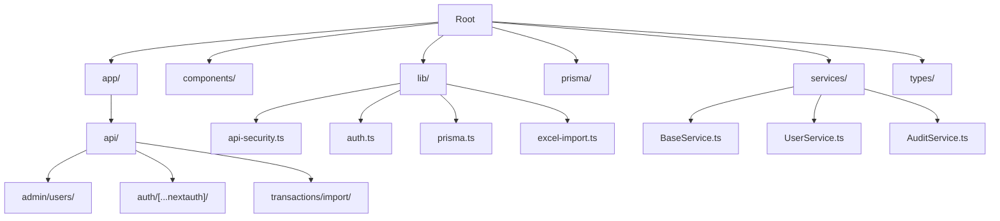
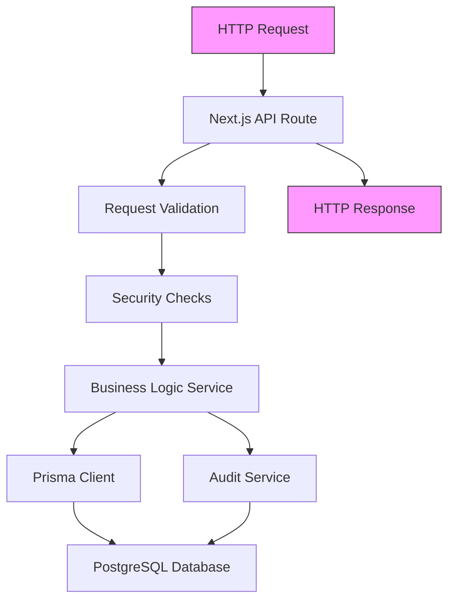
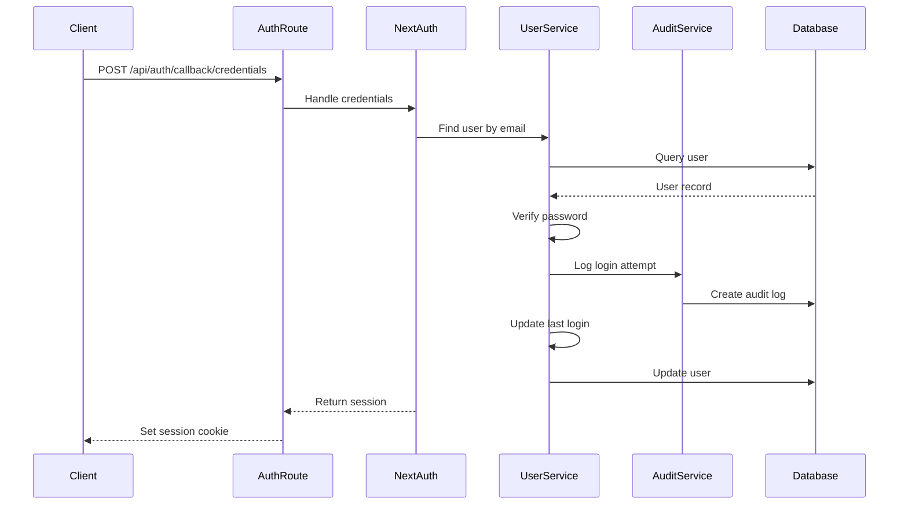
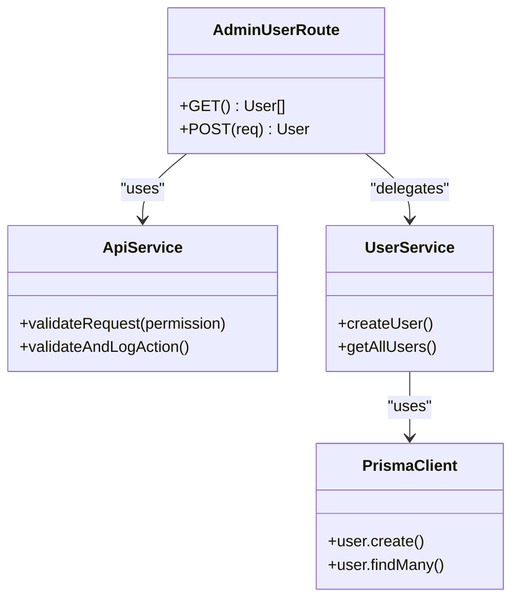
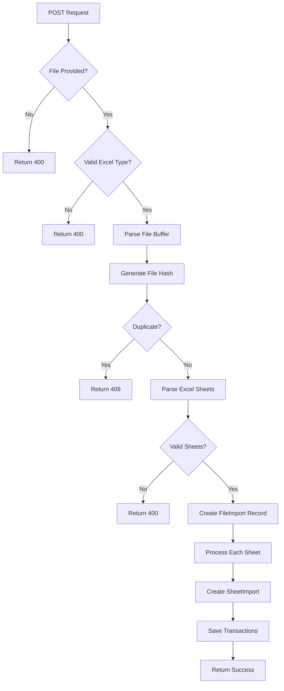
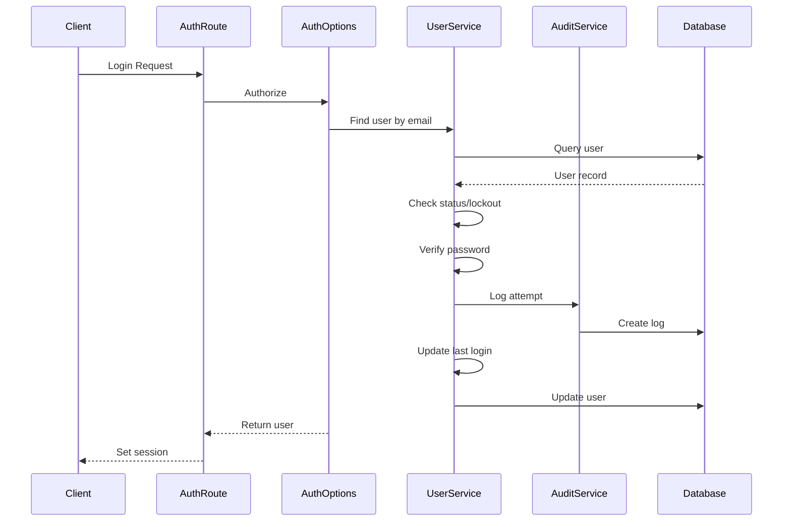
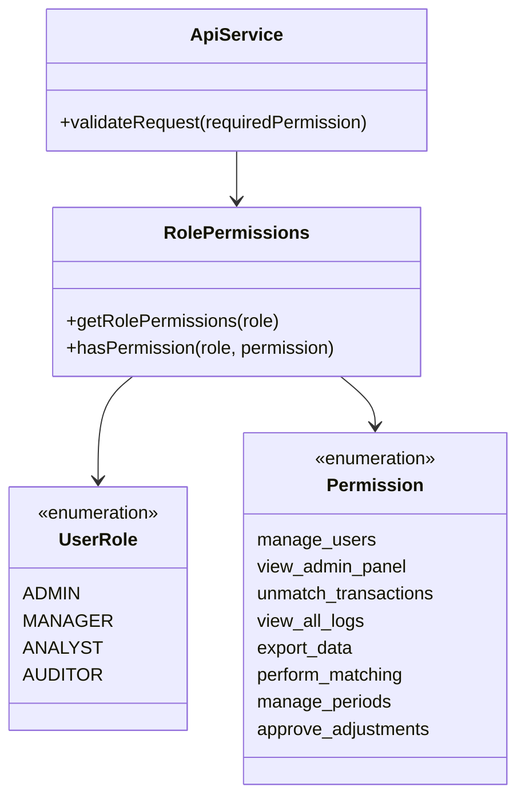
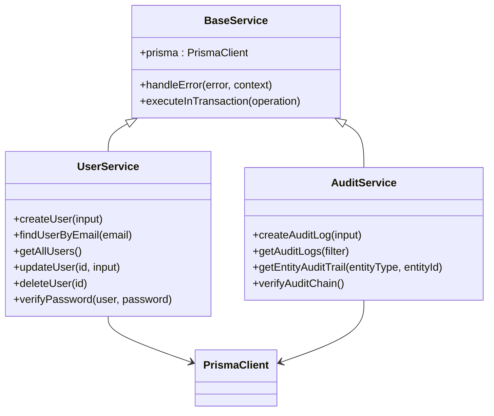
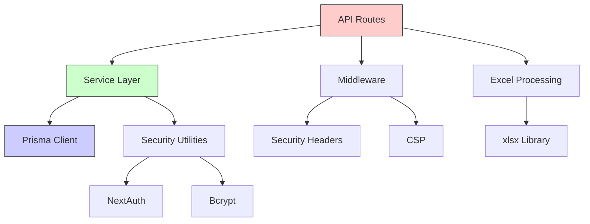

# Backend Architecture

<cite>
**Referenced Files in This Document**   
- [middleware.ts](file://middleware.ts)
- [api-security.ts](file://lib/api-security.ts)
- [auth.ts](file://lib/auth.ts)
- [prisma.ts](file://lib/prisma.ts)
- [excel-import.ts](file://lib/excel-import.ts)
- [constants.ts](file://lib/constants.ts)
- [types.ts](file://lib/types.ts)
- [route.ts](file://app/api/auth/[...nextauth]/route.ts)
- [route.ts](file://app/api/admin/users/route.ts)
- [route.ts](file://app/api/transactions/import/route.ts)
- [BaseService.ts](file://services/BaseService.ts)
- [UserService.ts](file://services/UserService.ts)
- [AuditService.ts](file://services/AuditService.ts)
- [index.ts](file://services/index.ts)
</cite>

## Table of Contents
1. [Introduction](#introduction)
2. [Project Structure](#project-structure)
3. [Core Components](#core-components)
4. [Architecture Overview](#architecture-overview)
5. [Detailed Component Analysis](#detailed-component-analysis)
6. [Dependency Analysis](#dependency-analysis)
7. [Performance Considerations](#performance-considerations)
8. [Troubleshooting Guide](#troubleshooting-guide)
9. [Conclusion](#conclusion)

## Introduction
The analyzer-web application is a financial reconciliation platform built on Next.js with a robust backend architecture designed for security, auditability, and scalability. The backend layer leverages Next.js App Router API routes to implement RESTful endpoints for user management, transaction processing, and administrative functions. The architecture follows a layered pattern with clear separation between API routes, business logic services, and data access through Prisma ORM. Security is enforced through multiple layers including NextAuth.js for authentication, role-based access control, request validation, and comprehensive audit logging. The system is designed for banking environment compliance with strict security headers, input validation, and monitoring capabilities.

## Project Structure

The project follows a feature-based organization with clear separation of concerns:

**Diagram sources**
- [middleware.ts](file://middleware.ts#L1-L56)
- [lib/api-security.ts](file://lib/api-security.ts#L1-L238)

**Section sources**
- [middleware.ts](file://middleware.ts#L1-L56)
- [lib/api-security.ts](file://lib/api-security.ts#L1-L238)

## Core Components

The backend architecture consists of several core components that work together to provide a secure and scalable financial reconciliation platform. The API routes under the App Router handle HTTP requests and responses, while the service layer contains the business logic. The Prisma client provides type-safe database access, and the lib directory contains shared utilities for security, authentication, and data processing. The middleware layer enforces security policies across all routes, and the audit service provides comprehensive logging for compliance and monitoring.

**Section sources**
- [middleware.ts](file://middleware.ts#L1-L56)
- [lib/api-security.ts](file://lib/api-security.ts#L1-L238)
- [services/BaseService.ts](file://services/BaseService.ts#L1-L20)

## Architecture Overview

The backend architecture follows a layered pattern with clear separation between presentation, business logic, and data access layers. API routes handle HTTP requests and responses, delegating business logic to service classes. The service layer interacts with the Prisma client for database operations, while shared utilities in the lib directory provide cross-cutting concerns like security, authentication, and data processing.

**Diagram sources**
- [app/api/transactions/import/route.ts](file://app/api/transactions/import/route.ts#L1-L264)
- [services/UserService.ts](file://services/UserService.ts#L1-L213)
- [lib/prisma.ts](file://lib/prisma.ts#L1-L11)

## Detailed Component Analysis

### API Route Handlers
The API route handlers implement RESTful endpoints using Next.js App Router conventions. Each route file exports HTTP method handlers (GET, POST, etc.) that process requests and return responses. The routes follow a consistent pattern of authentication, authorization, input validation, business logic execution, and error handling.

#### Authentication Route
The authentication route integrates with NextAuth.js to handle both OAuth and credentials-based login flows. It uses the NextAuth handler with custom configuration for JWT sessions and credential providers.

**Diagram sources**
- [app/api/auth/[...nextauth]/route.ts](file://app/api/auth/[...nextauth]/route.ts#L1-L6)
- [lib/auth.ts](file://lib/auth.ts#L3-L225)

#### Admin User Management
The admin user management endpoint enforces role-based access control through the api-security module. Only users with the 'manage_users' permission can access these endpoints, and all actions are logged for audit purposes.

**Diagram sources**
- [app/api/admin/users/route.ts](file://app/api/admin/users/route.ts#L1-L71)
- [lib/api-security.ts](file://lib/api-security.ts#L71-L156)
- [services/UserService.ts](file://services/UserService.ts#L1-L213)

#### Transaction Import Processing
The transaction import endpoint handles multipart form data for Excel file uploads. It processes the file, validates content, checks for duplicates, and imports transaction data into the database with comprehensive error handling.

**Diagram sources**
- [app/api/transactions/import/route.ts](file://app/api/transactions/import/route.ts#L1-L264)
- [lib/excel-import.ts](file://lib/excel-import.ts#L1-L327)

**Section sources**
- [app/api/transactions/import/route.ts](file://app/api/transactions/import/route.ts#L1-L264)
- [lib/excel-import.ts](file://lib/excel-import.ts#L1-L327)

### Security and Authentication
The security architecture implements multiple layers of protection including authentication, authorization, input validation, and audit logging. NextAuth.js provides the foundation for authentication with JWT sessions, while custom middleware and utilities enforce additional security policies.

#### Authentication Flow
The authentication system supports credentials-based login with bcrypt password hashing and account lockout after failed attempts. User sessions are tracked with device fingerprints and IP addresses for security monitoring.

**Diagram sources**
- [lib/auth.ts](file://lib/auth.ts#L3-L225)
- [services/UserService.ts](file://services/UserService.ts#L1-L213)
- [services/AuditService.ts](file://services/AuditService.ts#L1-L264)

#### Role-Based Access Control
The system implements role-based access control with four roles (Admin, Manager, Analyst, Auditor) and fine-grained permissions. Permissions are defined in constants and enforced through the api-security module.

**Diagram sources**
- [lib/constants.ts](file://lib/constants.ts#L1-L50)
- [lib/types.ts](file://lib/types.ts#L1-L132)
- [lib/api-security.ts](file://lib/api-security.ts#L158-L171)

**Section sources**
- [lib/constants.ts](file://lib/constants.ts#L1-L50)
- [lib/types.ts](file://lib/types.ts#L1-L132)
- [lib/api-security.ts](file://lib/api-security.ts#L158-L171)

### Service Layer Architecture
The service layer implements the business logic with a base service class that provides common functionality like error handling and transaction management. Each service encapsulates operations for a specific domain entity.

#### Service Class Hierarchy
The service classes follow a consistent pattern with error handling, database access, and business logic separation.

**Diagram sources**
- [services/BaseService.ts](file://services/BaseService.ts#L1-L20)
- [services/UserService.ts](file://services/UserService.ts#L1-L213)
- [services/AuditService.ts](file://services/AuditService.ts#L1-L264)

**Section sources**
- [services/BaseService.ts](file://services/BaseService.ts#L1-L20)
- [services/UserService.ts](file://services/UserService.ts#L1-L213)
- [services/AuditService.ts](file://services/AuditService.ts#L1-L264)

## Dependency Analysis

The backend architecture has a well-defined dependency graph with clear boundaries between layers. The API routes depend on service classes, which in turn depend on the Prisma client and shared utilities.

**Diagram sources**
- [package.json](file://package.json#L1-L46)
- [middleware.ts](file://middleware.ts#L1-L56)
- [services/index.ts](file://services/index.ts#L1-L7)

**Section sources**
- [package.json](file://package.json#L1-L46)
- [middleware.ts](file://middleware.ts#L1-L56)
- [services/index.ts](file://services/index.ts#L1-L7)

## Performance Considerations

The architecture includes several performance optimizations:

1. **Connection Reuse**: The Prisma client is instantiated once and reused across requests using the global object pattern to prevent connection leaks.
2. **Batch Operations**: Database operations use createMany for bulk inserts to minimize round trips.
3. **Caching**: The Next.js runtime provides built-in caching for API routes when appropriate.
4. **Efficient Data Transfer**: API responses include only necessary fields through Prisma select clauses.
5. **Rate Limiting**: Basic in-memory rate limiting protects against abuse (with a note that Redis would be needed for multi-instance deployments).

The stateless API design allows for horizontal scaling, and the use of JWT sessions eliminates server-side session storage overhead.

## Troubleshooting Guide

Common issues and their solutions:

1. **Authentication Failures**: Check NEXTAUTH_SECRET environment variable and ensure it's set in production.
2. **Database Connection Issues**: Verify database URL and credentials in environment variables.
3. **Excel Import Failures**: Ensure files are valid .xlsx or .xls format and contain "dept" in A1:D10.
4. **Rate Limiting**: The in-memory rate limiter resets on server restart; consider Redis for production.
5. **Audit Chain Verification**: The audit service verifies chain integrity but requires sequential processing.

**Section sources**
- [lib/auth.ts](file://lib/auth.ts#L19-L25)
- [lib/api-security.ts](file://lib/api-security.ts#L182-L238)
- [app/api/transactions/import/route.ts](file://app/api/transactions/import/route.ts#L29-L37)

## Conclusion

The analyzer-web backend architecture demonstrates a well-structured, secure, and maintainable design for a financial reconciliation application. Key strengths include:

1. **Security**: Multi-layered security with authentication, authorization, input validation, and comprehensive audit logging.
2. **Separation of Concerns**: Clear separation between API routes, business logic, and data access layers.
3. **Auditability**: Tamper-evident audit logs with chain verification for compliance.
4. **Scalability**: Stateless design with connection reuse patterns.
5. **Maintainability**: Consistent patterns across service classes and API routes.

The architecture effectively balances security requirements for a banking environment with developer productivity through the use of modern frameworks and libraries. Future enhancements could include Redis-backed rate limiting for multi-instance deployments and enhanced device fingerprinting with full request context.