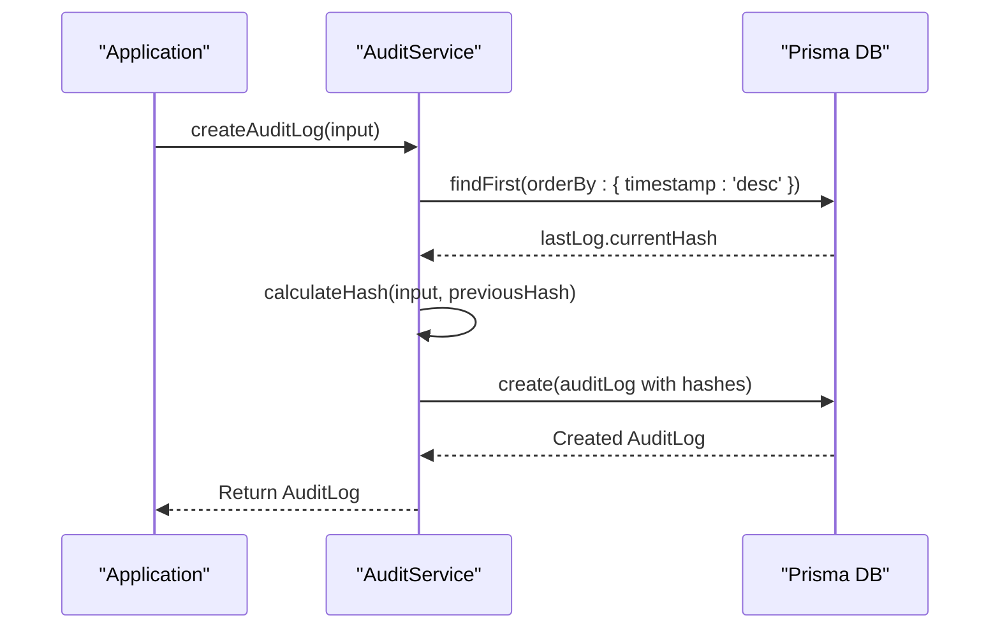
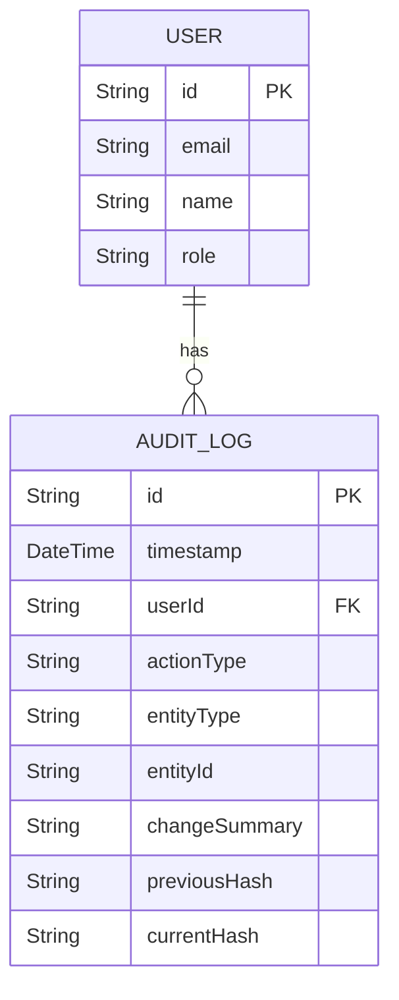
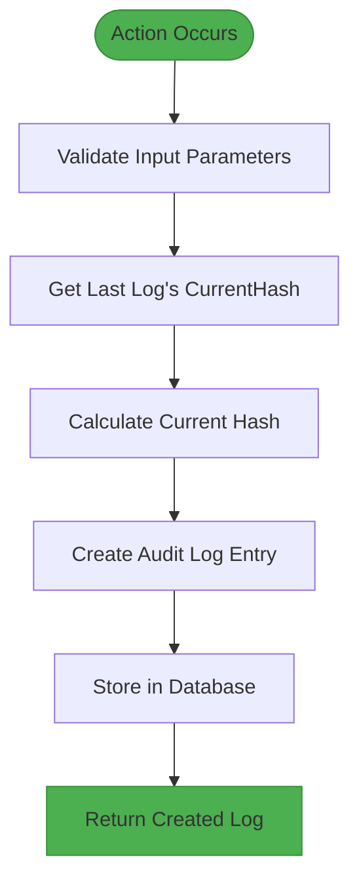

# AuditLog Model

<cite>
**Referenced Files in This Document**   
- [schema.prisma](file://prisma/schema.prisma#L158-L192)
- [AuditService.ts](file://services/AuditService.ts#L9-L263)
- [AuditLogModal.tsx](file://components/AuditLogModal.tsx#L1-L93)
- [types.ts](file://lib/types.ts#L84-L91)
- [auth.ts](file://lib/auth.ts#L93-L205)
- [api-security.ts](file://lib/api-security.ts#L93-L154)
</cite>

## Table of Contents
1. [Introduction](#introduction)
2. [Core Fields](#core-fields)
3. [User and Session Tracking](#user-and-session-tracking)
4. [Network Information](#network-information)
5. [Action Details](#action-details)
6. [Change Tracking](#change-tracking)
7. [Tamper Detection](#tamper-detection)
8. [Relationships](#relationships)
9. [Indexes](#indexes)
10. [Audit Log Creation Process](#audit-log-creation-process)
11. [Audit Log Display](#audit-log-display)
12. [Common Queries](#common-queries)

## Introduction
The AuditLog entity in the analyzer-web application provides a comprehensive audit trail for all critical operations within the system. This model captures detailed information about user actions, system changes, and security events, enabling compliance, troubleshooting, and forensic analysis. The implementation includes cryptographic chain verification to ensure audit trail integrity and prevent tampering.

**Section sources**
- [schema.prisma](file://prisma/schema.prisma#L158-L192)

## Core Fields
The AuditLog entity contains several core fields that provide fundamental information about each audit event:

- **id**: Unique identifier for the audit log entry, generated using cuid()
- **timestamp**: DateTime field with high precision, automatically set to the current time when the log is created

These fields serve as the primary identifier and temporal marker for each audit event, enabling chronological ordering and unique reference to specific actions within the system.

**Section sources**
- [schema.prisma](file://prisma/schema.prisma#L159-L162)

## User and Session Tracking
The AuditLog model includes comprehensive user and session tracking capabilities:

- **userId**: String field that references the User who performed the action
- **user**: Relation to the User model, establishing a many-to-one relationship where each audit log is associated with one user
- **sessionId**: Optional string field that references the specific session during which the action occurred

This tracking enables accountability by linking each action to a specific user account and, when available, the specific session in which the action was performed. The relationship with the User model allows for rich user context to be displayed alongside audit events.

**Section sources**
- [schema.prisma](file://prisma/schema.prisma#L164-L167)

## Network Information
To enhance security monitoring and forensic capabilities, the AuditLog captures network-related information:

- **ipAddress**: Optional string field storing the IP address from which the action originated
- **deviceFingerprint**: Optional string field containing a unique identifier for the user's device
- **geolocation**: Optional string field storing geographic location information derived from the IP address

This information helps identify potential security threats, track user behavior patterns, and verify the legitimacy of actions based on expected locations and devices.

**Section sources**
- [schema.prisma](file://prisma/schema.prisma#L169-L172)

## Action Details
The AuditLog model captures detailed information about the nature of each action:

- **actionType**: String field indicating the type of action performed, with standardized values including: CREATE, UPDATE, DELETE, APPROVE, IMPORT, EXPORT, LOGIN, LOGOUT, MATCH, UNMATCH
- **entityType**: String field indicating the type of entity affected by the action, with values including: TRANSACTION, MATCH, USER, ROLE, PERIOD, SNAPSHOT, FILE_IMPORT
- **entityId**: Optional string field containing the identifier of the specific entity that was affected

These fields provide context about what operation was performed, on what type of entity, and on which specific instance, enabling detailed filtering and analysis of audit data.

**Section sources**
- [schema.prisma](file://prisma/schema.prisma#L174-L177)

## Change Tracking
For actions that modify data, the AuditLog captures detailed change information:

- **beforeState**: Optional JSON string storing the state of the entity before the change
- **afterState**: Optional JSON string storing the state of the entity after the change
- **changeSummary**: String field providing a human-readable summary of the changes made
- **justification**: Optional string field allowing users to provide a reason for the action

The beforeState and afterState fields enable full reconstruction of changes, while the changeSummary provides a concise description for quick review. The justification field supports compliance requirements by capturing the business reason for significant actions.

**Section sources**
- [schema.prisma](file://prisma/schema.prisma#L179-L183)

## Tamper Detection
The AuditLog implementation includes a cryptographic hash chain to ensure audit trail integrity:

- **previousHash**: Optional string field containing the hash of the previous audit log entry
- **currentHash**: String field containing the hash of the current audit log entry



**Diagram sources**
- [AuditService.ts](file://services/AuditService.ts#L37-L68)

**Section sources**
- [schema.prisma](file://prisma/schema.prisma#L185-L187)
- [AuditService.ts](file://services/AuditService.ts#L45-L47)

The hash chain works by calculating the current hash based on the log's content and the previous log's hash. This creates an immutable chain where any modification to a past entry would invalidate all subsequent hashes. The `verifyAuditChain()` method can validate the entire chain's integrity by recalculating hashes and checking for consistency.

## Relationships
The AuditLog has a many-to-one relationship with the User entity:



**Diagram sources**
- [schema.prisma](file://prisma/schema.prisma#L166)
- [schema.prisma](file://prisma/schema.prisma#L45)

**Section sources**
- [schema.prisma](file://prisma/schema.prisma#L166)
- [schema.prisma](file://prisma/schema.prisma#L45)

Each user can have multiple audit log entries, while each audit log entry is associated with exactly one user. This relationship is enforced through the userId foreign key and the Prisma relation configuration.

## Indexes
To ensure optimal query performance, the AuditLog model includes several database indexes:

- **@@index([timestamp, userId, actionType])**: Composite index for filtering logs by time range, user, and action type
- **@@index([entityType, entityId])**: Composite index for retrieving all audit logs for a specific entity
- **@@index([userId])**: Index for retrieving all actions performed by a specific user

These indexes support the most common audit log queries, ensuring fast retrieval of data for both real-time monitoring and historical analysis.

**Section sources**
- [schema.prisma](file://prisma/schema.prisma#L189-L191)

## Audit Log Creation Process
Audit logs are created through the AuditService, which provides a comprehensive API for logging actions:



**Diagram sources**
- [AuditService.ts](file://services/AuditService.ts#L37-L68)

**Section sources**
- [AuditService.ts](file://services/AuditService.ts#L37-L68)
- [api-security.ts](file://lib/api-security.ts#L138-L154)
- [auth.ts](file://lib/auth.ts#L93-L205)

The creation process involves:
1. Retrieving the last audit log entry to obtain its currentHash
2. Using this hash as the previousHash for the new entry
3. Calculating the currentHash for the new entry using SHA-256
4. Creating the audit log entry with all relevant details
5. Storing the entry in the database

The AuditService is used throughout the application to log various events, including authentication events (login, logout), authorization checks, and data modifications.

## Audit Log Display
Audit logs are displayed to users through the AuditLogModal component, which provides a user-friendly interface for reviewing audit events:

```mermaid
flowchart TD
A[Open Audit Log Modal] --> B{User Role Check}
B --> |Manager| C[Display All Logs]
B --> |Analyst| D[Filter by Current User]
C --> E[Display Logs in Table]
D --> E
E --> F[Sort by Timestamp (Newest First)]
F --> G[Show Action Details]
style A fill:#2196F3,stroke:#1976D2
style G fill:#2196F3,stroke:#1976D2
```

**Diagram sources**
- [AuditLogModal.tsx](file://components/AuditLogModal.tsx#L14-L93)

**Section sources**
- [AuditLogModal.tsx](file://components/AuditLogModal.tsx#L14-L93)
- [types.ts](file://lib/types.ts#L84-L91)

The display logic includes role-based access control:
- Managers can view all audit logs in the system
- Analysts can only view their own actions
- The logs are displayed in reverse chronological order
- Each log entry shows the time, user, action type, and details

## Common Queries
The AuditService provides several methods for querying audit logs:

### Retrieve All Actions by a User
```typescript
const logs = await auditService.getAuditLogs({
  userId: "user-123",
  limit: 100
});
```

### Find All Transaction Modifications
```typescript
const transactionChanges = await auditService.getEntityAuditTrail(
  "TRANSACTION",
  "transaction-456"
);
```

### Get Logs Within a Time Range
```typescript
const recentLogs = await auditService.getAuditLogs({
  startDate: new Date("2025-01-01"),
  endDate: new Date("2025-01-31"),
  actionType: "UPDATE"
});
```

### Verify Audit Chain Integrity
```typescript
const verification = await auditService.verifyAuditChain();
if (!verification.valid) {
  console.error("Audit chain compromised:", verification.errors);
}
```

These query patterns support common audit and compliance scenarios, enabling administrators to monitor user activity, investigate specific changes, and verify the integrity of the audit trail.

**Section sources**
- [AuditService.ts](file://services/AuditService.ts#L77-L150)