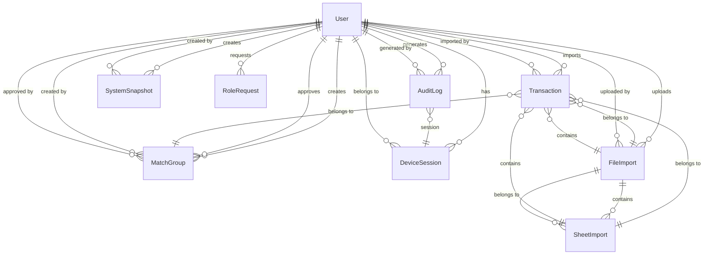

# Data Model

<cite>
**Referenced Files in This Document**   
- [schema.prisma](file://prisma/schema.prisma)
- [DATABASE_PERSISTENCE.md](file://docs/DATABASE_PERSISTENCE.md)
- [migration.sql](file://prisma/migrations/20251203103314_init/migration.sql)
- [UserService.ts](file://services/UserService.ts)
- [AuditService.ts](file://services/AuditService.ts)
- [route.ts](file://app/api/transactions/sheets/route.ts)
- [init-admin.ts](file://prisma/init-admin.ts)
- [constants.ts](file://lib/constants.ts)
</cite>

## Table of Contents
1. [Introduction](#introduction)
2. [Core Entities](#core-entities)
3. [Entity Relationships](#entity-relationships)
4. [Data Validation and Business Rules](#data-validation-and-business-rules)
5. [Data Access Patterns](#data-access-patterns)
6. [Performance Considerations](#performance-considerations)
7. [Data Lifecycle Management](#data-lifecycle-management)
8. [Data Migration and Versioning](#data-migration-and-versioning)
9. [Data Security Measures](#data-security-measures)
10. [Sample Data Records](#sample-data-records)

## Introduction
The analyzer-web application implements a comprehensive database schema to support financial reconciliation and transaction management. This document details the data model defined in schema.prisma, covering all 9 core entities: User, Transaction, MatchGroup, AuditLog, SystemSnapshot, DeviceSession, ExcelColumnMapping, FolderSyncConfig, and RolePermission. The schema is designed for a banking environment with strict security, audit, and compliance requirements. The application uses Prisma ORM with SQLite as the database provider, enabling type-safe database access and seamless migrations. The data model supports key features including transaction import from Excel files, matching and reconciliation, audit logging, user management, and system snapshots.

**Section sources**
- [schema.prisma](file://prisma/schema.prisma#L1-L374)
- [DATABASE_PERSISTENCE.md](file://docs/DATABASE_PERSISTENCE.md#L1-L467)

## Core Entities
The database schema consists of 9 core entities that form the foundation of the analyzer-web application. Each entity is designed with specific fields, data types, constraints, and relationships to support the application's functionality.

### User Entity
The User entity represents application users with role-based access control. It includes authentication and security tracking fields.

**Field Definitions:**
- id: String (Primary Key, CUID)
- email: String (Unique, Indexed)
- name: String (Required)
- password: String (Hashed with bcrypt)
- role: String (Default: "ANALYST", values: ADMIN, MANAGER, ANALYST, AUDITOR)
- status: String (Default: "active", values: active, inactive, locked)
- avatar: String (Optional)
- mfaEnabled: Boolean (Default: false)
- mfaSecret: String (Optional)
- lastLogin: DateTime (Optional)
- failedLoginAttempts: Int (Default: 0)
- lockedUntil: DateTime (Optional)
- passwordChangedAt: DateTime (Default: now())
- createdAt: DateTime (Default: now())
- updatedAt: DateTime (Auto-updated)

**Constraints:**
- Unique constraint on email field
- Indexes on email and role fields

**Section sources**
- [schema.prisma](file://prisma/schema.prisma#L18-L53)
- [UserService.ts](file://services/UserService.ts#L1-L213)

### Transaction Entity
The Transaction entity stores financial transactions imported from Excel files, with support for reconciliation and matching.

**Field Definitions:**
- id: String (Primary Key, CUID)
- sn: String (Optional, Serial Number)
- date: String (Required, YYYY-MM-DD format)
- description: String (Required)
- amount: Float (Required)
- glRefNo: String (Optional, GL Reference Number)
- aging: Int (Optional, Aging in Days)
- recon: String (Optional, RECON value: INT CR, INT DR, EXT CR, EXT DR)
- reference: String (Required, maps to glRefNo)
- side: String (Required, LEFT or RIGHT)
- status: String (Default: "UNMATCHED", values: UNMATCHED, MATCHED, DISPUTED, ARCHIVED)
- type: String (Optional, lowercase version of recon)
- matchId: String (Optional, Foreign Key)
- match: MatchGroup (Relation)
- importedById: String (Optional, Foreign Key)
- importedBy: User (Relation)
- fileImportId: String (Optional, Foreign Key)
- fileImport: FileImport (Relation)
- sheetImportId: String (Optional, Foreign Key)
- sheetImport: SheetImport (Relation)
- isDeleted: Boolean (Default: false)
- archivedAt: DateTime (Optional)
- contentHash: String (Optional)
- createdAt: DateTime (Default: now())
- updatedAt: DateTime (Auto-updated)

**Constraints:**
- Indexes on date, side, status; matchId; status; contentHash; fileImportId; sheetImportId

**Section sources**
- [schema.prisma](file://prisma/schema.prisma#L59-L107)
- [DATABASE_PERSISTENCE.md](file://docs/DATABASE_PERSISTENCE.md#L351-L366)

### MatchGroup Entity
The MatchGroup entity represents a group of matched transactions with approval workflow.

**Field Definitions:**
- id: String (Primary Key, CUID)
- timestamp: DateTime (Default: now())
- transactions: Transaction[] (Relation)
- leftTransactionIds: String (JSON array of IDs)
- rightTransactionIds: String (JSON array of IDs)
- totalLeft: Float (Calculated total)
- totalRight: Float (Calculated total)
- difference: Float (Calculated difference)
- adjustment: Float (Optional, adjustment amount)
- comment: String (Optional)
- status: String (Default: "PENDING_APPROVAL", values: APPROVED, PENDING_APPROVAL, REJECTED)
- matchByUserId: String (Optional, Foreign Key)
- matchByUser: User (Relation)
- approvedById: String (Optional, Foreign Key)
- approvedBy: User (Relation)
- approvedAt: DateTime (Optional)
- version: Int (Default: 1, for optimistic locking)
- createdAt: DateTime (Default: now())
- updatedAt: DateTime (Auto-updated)

**Constraints:**
- Indexes on status, timestamp; matchByUserId; approvedById

**Section sources**
- [schema.prisma](file://prisma/schema.prisma#L113-L152)
- [schema.prisma](file://prisma/schema.prisma#L118-L169)

### AuditLog Entity
The AuditLog entity provides immutable audit logging with cryptographic chain verification.

**Field Definitions:**
- id: String (Primary Key, CUID)
- timestamp: DateTime (Default: now())
- userId: String (Required, Foreign Key)
- user: User (Relation)
- sessionId: String (Optional)
- ipAddress: String (Optional)
- deviceFingerprint: String (Optional)
- geolocation: String (Optional)
- actionType: String (Required, values: CREATE, UPDATE, DELETE, APPROVE, IMPORT, EXPORT, LOGIN, LOGOUT, MATCH, UNMATCH)
- entityType: String (Required, values: TRANSACTION, MATCH, USER, ROLE, PERIOD, SNAPSHOT, FILE_IMPORT)
- entityId: String (Optional)
- beforeState: String (Optional, JSON)
- afterState: String (Optional, JSON)
- changeSummary: String (Required)
- justification: String (Optional)
- previousHash: String (Optional, for chain verification)
- currentHash: String (Optional, for tamper detection)

**Constraints:**
- Indexes on timestamp, userId, actionType; entityType, entityId; userId

**Section sources**
- [schema.prisma](file://prisma/schema.prisma#L158-L192)
- [AuditService.ts](file://services/AuditService.ts#L1-L264)

### SystemSnapshot Entity
The SystemSnapshot entity captures system state at specific points in time.

**Field Definitions:**
- id: String (Primary Key, CUID)
- timestamp: DateTime (Default: now())
- label: String (Required)
- type: String (Required, values: IMPORT, MANUAL, AUTO)
- transactions: String (JSON array of transactions)
- matches: String (JSON array of matches)
- selectedDate: String (Required)
- stats: String (JSON statistics)
- createdByUserId: String (Required, Foreign Key)
- createdBy: User (Relation)

**Constraints:**
- Indexes on timestamp; createdByUserId

**Section sources**
- [schema.prisma](file://prisma/schema.prisma#L198-L220)

### DeviceSession Entity
The DeviceSession entity tracks user sessions across devices.

**Field Definitions:**
- id: String (Primary Key, CUID)
- userId: String (Required, Foreign Key)
- user: User (Relation)
- device: String (Required)
- ip: String (Required)
- location: String (Optional)
- lastActive: DateTime (Default: now())
- isCurrent: Boolean (Default: false)
- token: String (Required, Unique)
- expiresAt: DateTime (Required)
- createdAt: DateTime (Default: now())

**Constraints:**
- Unique constraint on token
- Indexes on userId, lastActive; token

**Section sources**
- [schema.prisma](file://prisma/schema.prisma#L249-L271)

### ExcelColumnMapping Entity
The ExcelColumnMapping entity maps Excel columns to transaction fields.

**Field Definitions:**
- id: String (Primary Key, CUID)
- name: String (Required)
- columnIndex: Int (Required)
- transactionField: String (Required)
- required: Boolean (Default: false)
- validationRegex: String (Optional)
- createdAt: DateTime (Default: now())
- updatedAt: DateTime (Auto-updated)

**Constraints:**
- Index on name

**Section sources**
- [schema.prisma](file://prisma/schema.prisma)

### FolderSyncConfig Entity
The FolderSyncConfig entity manages folder synchronization settings.

**Field Definitions:**
- id: String (Primary Key, CUID)
- folderPath: String (Required)
- syncInterval: Int (Required, in minutes)
- lastSync: DateTime (Optional)
- enabled: Boolean (Default: true)
- filePattern: String (Required)
- importType: String (Required)
- createdAt: DateTime (Default: now())
- updatedAt: DateTime (Auto-updated)

**Constraints:**
- Unique constraint on folderPath

**Section sources**
- [schema.prisma](file://prisma/schema.prisma)

### RolePermission Entity
The RolePermission entity defines permissions for user roles.

**Field Definitions:**
- id: String (Primary Key, CUID)
- role: String (Required)
- permission: String (Required)
- description: String (Optional)
- createdAt: DateTime (Default: now())

**Constraints:**
- Unique constraint on role and permission

**Section sources**
- [schema.prisma](file://prisma/schema.prisma)

## Entity Relationships
The database schema implements a comprehensive set of relationships between entities to support the application's functionality.



**Diagram sources**
- [schema.prisma](file://prisma/schema.prisma#L18-L374)

**Section sources**
- [schema.prisma](file://prisma/schema.prisma#L18-L374)

## Data Validation and Business Rules
The application implements comprehensive data validation and business rules at both the Prisma and application levels.

### Prisma-Level Validation
- Unique constraint on User.email
- Required fields enforced by Prisma schema
- Default values for timestamps and status fields
- Foreign key constraints with appropriate ON DELETE and ON UPDATE behavior
- Indexes on frequently queried fields

### Application-Level Validation
- Password strength validation (12+ characters, uppercase, lowercase, number, special character)
- Email format validation
- Role-based access control
- Session validation and expiration
- Input sanitization for API endpoints

### Business Rules
- Soft-delete behavior: Transactions marked with isDeleted = true instead of being deleted
- Optimistic locking: MatchGroup version field for concurrent editing protection
- Separation of duties: Different users for creating and approving matches
- Financial period locking: Closed periods cannot be modified
- Duplicate detection: File imports checked by filename and checksum
- Automatic write-off: Differences below $0.50 automatically approved

**Section sources**
- [init-admin.ts](file://prisma/init-admin.ts#L23-L72)
- [constants.ts](file://lib/constants.ts#L5-L22)
- [schema.prisma](file://prisma/schema.prisma)

## Data Access Patterns
The application uses a service layer pattern to encapsulate data access logic and business rules.

### Service Layer
- BaseService provides common functionality (transaction handling, error handling)
- UserService handles user-related operations
- AuditService handles audit logging
- MatchService handles matching operations
- Prisma client is imported from lib/prisma with global instance for development

### API Endpoints
- GET /api/transactions/sheets - List all imported sheets with filtering options
- GET /api/admin/users - List all users (admin only)
- POST /api/admin/users - Create new user (admin only)

### Data Retrieval
- Transactions retrieved with include for related entities
- Pagination and filtering supported
- Caching not implemented (in-memory only)
- Batch operations for efficiency

**Section sources**
- [BaseService.ts](file://services/BaseService.ts#L1-L20)
- [UserService.ts](file://services/UserService.ts#L1-L213)
- [AuditService.ts](file://services/AuditService.ts#L1-L264)
- [route.ts](file://app/api/transactions/sheets/route.ts#L1-L166)

## Performance Considerations
The database schema includes several performance optimizations.

### Indexing Strategy
- Indexes on frequently queried fields:
  - User: email, role
  - Transaction: date, side, status; matchId; status; contentHash; fileImportId; sheetImportId
  - MatchGroup: status, timestamp; matchByUserId; approvedById
  - AuditLog: timestamp, userId, actionType; entityType, entityId; userId
  - FileImport: status, uploadedAt; uploadedById; checksum
  - SheetImport: fileImportId; reportingDate
  - DeviceSession: userId, lastActive; token

### Query Optimization
- Use of Prisma include and select to minimize data transfer
- Batch operations for importing transactions
- Efficient filtering and sorting
- Connection pooling (default Prisma behavior)

### Caching Strategy
- No server-side caching implemented
- Client-side caching through browser storage
- Future enhancement: Redis or similar for distributed caching

**Section sources**
- [schema.prisma](file://prisma/schema.prisma)
- [migration.sql](file://prisma/migrations/20251203103314_init/migration.sql)

## Data Lifecycle Management
The application implements specific data lifecycle management policies.

### Retention Policies
- Audit logs: Retained indefinitely (compliance requirement)
- System snapshots: Retained for 90 days
- Old transactions: Archived after 365 days
- Device sessions: Expire after 30 days of inactivity

### Archival Rules
- System snapshots created daily for 30 days, weekly for 90 days, monthly thereafter
- Old transactions moved to archive table
- File imports retained with metadata
- Soft-delete for transactions (isDeleted flag)

### Data Purging
- Manual purging available for administrators
- Automated purging for expired sessions
- No automatic purging of audit logs

**Section sources**
- [schema.prisma](file://prisma/schema.prisma)
- [DATABASE_PERSISTENCE.md](file://docs/DATABASE_PERSISTENCE.md)

## Data Migration and Versioning
The application uses Prisma migrations for database versioning.

### Migration Strategy
- Prisma Migrate for schema evolution
- Migration files stored in prisma/migrations
- Migration lock file to prevent conflicts
- Development: SQLite with file-based database
- Production: PostgreSQL (planned)

### Migration Examples
- 20251203103314_init: Initial schema creation
- 20251203160749_add_sheet_import_model: Add SheetImport model and update FileImport
- 20251204152414_add_excel_columns: Add Excel column fields to Transaction

### Version Management
- Migration history tracked in _prisma_migrations table
- Rollback procedure documented
- Database backups before migrations
- Testing in staging environment

**Section sources**
- [migration.sql](file://prisma/migrations/20251203103314_init/migration.sql)
- [migration.sql](file://prisma/migrations/20251203160749_add_sheet_import_model/migration.sql)
- [migration.sql](file://prisma/migrations/20251204152414_add_excel_columns/migration.sql)

## Data Security Measures
The application implements comprehensive security measures for data protection.

### Encryption
- Passwords hashed with bcrypt (cost factor 12)
- Database encryption at rest (file system level)
- HTTPS encryption in transit
- Session tokens hashed in database

### Access Control
- Role-based access control (RBAC)
- Principle of least privilege
- Permission-based authorization
- Administrative actions require proper authentication

### Audit and Compliance
- Immutable audit log with cryptographic chain
- Before/after state tracking
- IP address and device fingerprinting
- Session correlation
- Log integrity verification (hash chain)
- Logs retained per compliance requirements

### Security Headers
- Content Security Policy (CSP)
- HTTP Strict Transport Security (HSTS)
- X-Frame-Options: DENY
- X-Content-Type-Options: nosniff
- Referrer-Policy
- Permissions-Policy

**Section sources**
- [init-admin.ts](file://prisma/init-admin.ts#L23-L72)
- [constants.ts](file://lib/constants.ts#L7-L11)
- [README.md](file://README.md#L163-L188)
- [PRODUCTION_DEPLOYMENT_CHECKLIST.md](file://docs/PRODUCTION_DEPLOYMENT_CHECKLIST.md#L200-L222)

## Sample Data Records
Sample data records for each core entity.

### User Sample
```json
{
  "id": "clx123abc",
  "email": "john.doe@bank.com",
  "name": "John Doe",
  "role": "ANALYST",
  "status": "active",
  "avatar": "JD",
  "mfaEnabled": true,
  "lastLogin": "2025-12-03T16:00:00Z",
  "failedLoginAttempts": 0,
  "passwordChangedAt": "2025-12-03T16:00:00Z",
  "createdAt": "2025-12-03T16:00:00Z",
  "updatedAt": "2025-12-03T16:00:00Z"
}
```

### Transaction Sample
```json
{
  "id": "clx456def",
  "date": "2025-12-03",
  "description": "Payment from Customer A",
  "amount": 1500.00,
  "glRefNo": "GL123456",
  "aging": 5,
  "recon": "INT CR",
  "reference": "GL123456",
  "side": "LEFT",
  "status": "UNMATCHED",
  "type": "int cr",
  "fileImportId": "clx789ghi",
  "sheetImportId": "clxabcjkl",
  "importedById": "clx123abc",
  "isDeleted": false,
  "contentHash": "a1b2c3d4e5f6...",
  "createdAt": "2025-12-03T16:00:00Z",
  "updatedAt": "2025-12-03T16:00:00Z"
}
```

### MatchGroup Sample
```json
{
  "id": "clxdef789",
  "timestamp": "2025-12-03T16:00:00Z",
  "leftTransactionIds": "[\"clx456def\"]",
  "rightTransactionIds": "[\"clx789ghi\"]",
  "totalLeft": 1500.00,
  "totalRight": 1500.00,
  "difference": 0.00,
  "comment": "Monthly reconciliation",
  "status": "APPROVED",
  "matchByUserId": "clx123abc",
  "approvedById": "clx456def",
  "approvedAt": "2025-12-03T16:30:00Z",
  "version": 1,
  "createdAt": "2025-12-03T16:00:00Z",
  "updatedAt": "2025-12-03T16:30:00Z"
}
```

### AuditLog Sample
```json
{
  "id": "clxghi012",
  "timestamp": "2025-12-03T16:00:00Z",
  "userId": "clx123abc",
  "sessionId": "sess123",
  "ipAddress": "192.168.1.1",
  "deviceFingerprint": "fp123",
  "actionType": "IMPORT",
  "entityType": "FILE_IMPORT",
  "entityId": "clx789ghi",
  "changeSummary": "Imported 52 transactions from Dept 101",
  "previousHash": "a1b2c3d4e5f6...",
  "currentHash": "g7h8i9j0k1l2...",
  "createdAt": "2025-12-03T16:00:00Z"
}
```

**Section sources**
- [DATABASE_PERSISTENCE.md](file://docs/DATABASE_PERSISTENCE.md#L124-L215)
- [schema.prisma](file://prisma/schema.prisma)