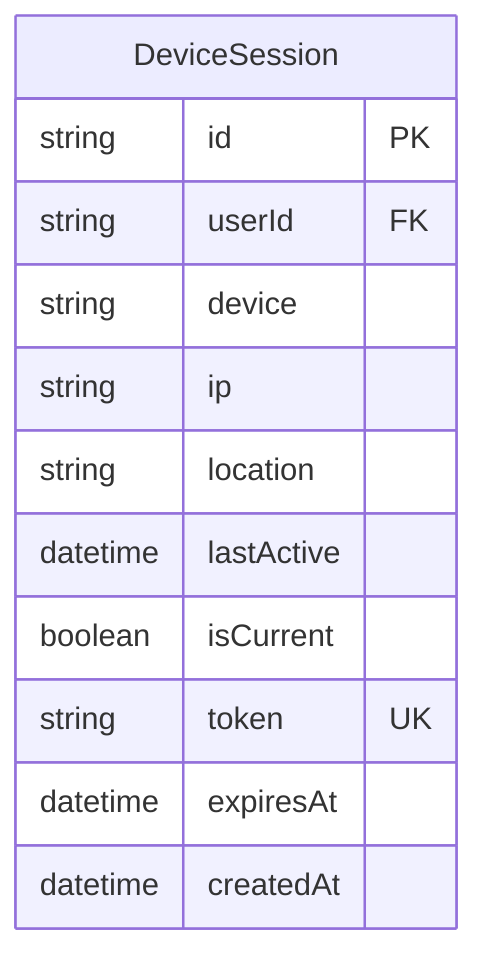
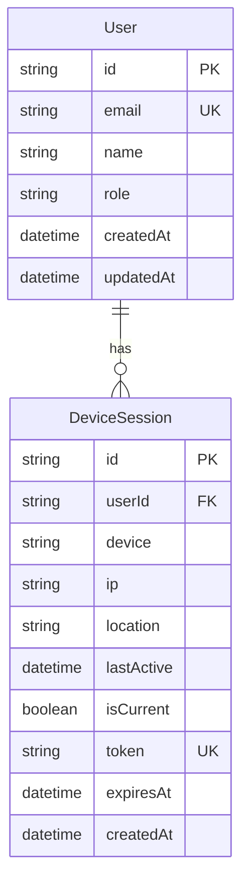
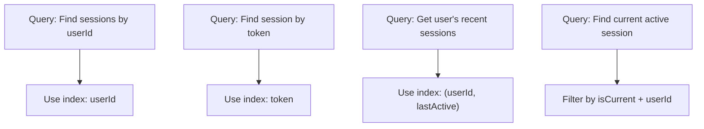
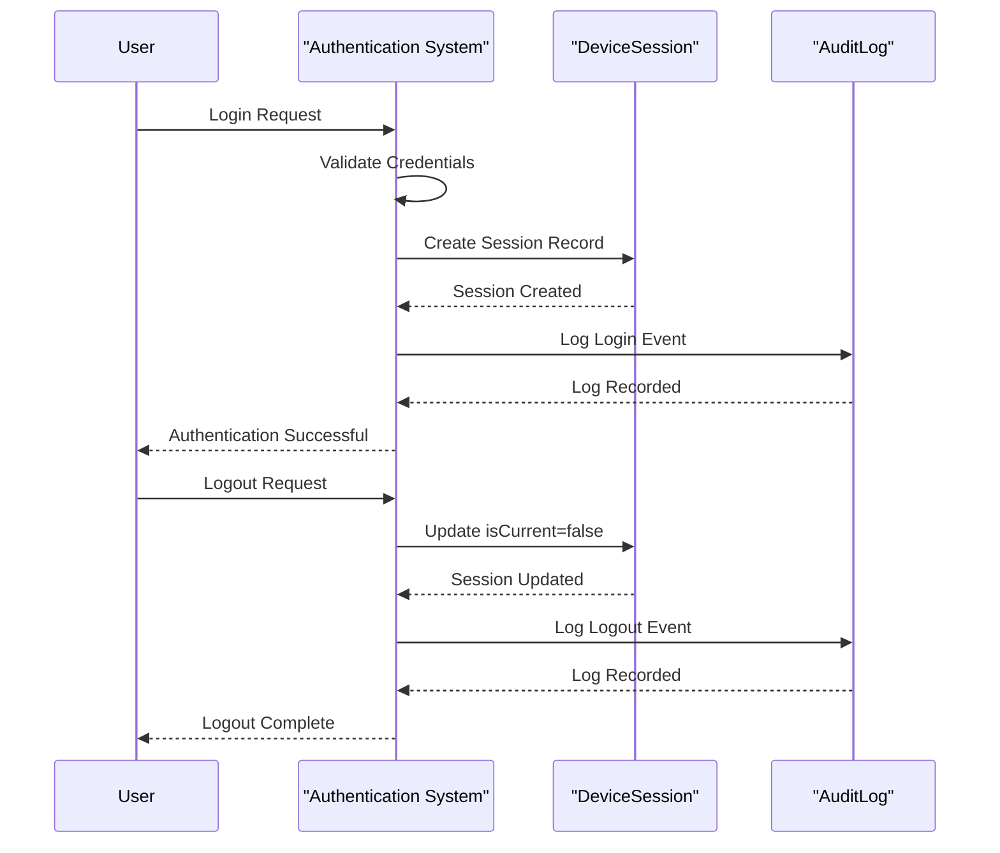
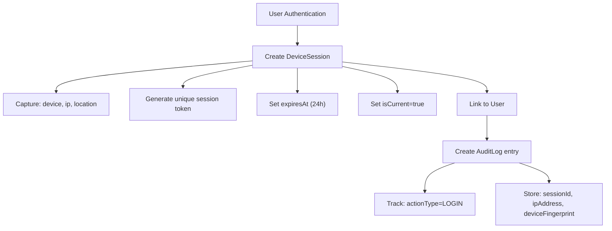

# DeviceSession Model

<cite>
**Referenced Files in This Document**   
- [schema.prisma](file://prisma/schema.prisma#L249-L271)
- [IMPLEMENTATION_COMPLETE.md](file://docs/IMPLEMENTATION_COMPLETE.md)
- [auth.ts](file://lib/auth.ts#L98-L224)
- [types.ts](file://lib/types.ts#L123-L131)
- [prisma.ts](file://lib/prisma.ts)
</cite>

## Table of Contents
1. [Introduction](#introduction)
2. [Core Fields](#core-fields)
3. [Relationships](#relationships)
4. [Indexing Strategy](#indexing-strategy)
5. [Session Lifecycle Management](#session-lifecycle-management)
6. [Security and Audit Integration](#security-and-audit-integration)
7. [Common Query Patterns](#common-query-patterns)
8. [Implementation Notes](#implementation-notes)

## Introduction
The DeviceSession entity in the analyzer-web application provides comprehensive session tracking and management capabilities. It enables multi-device monitoring, security auditing, and active session identification for user accounts. The model captures detailed information about each user session including device characteristics, network location, and temporal data. This documentation details the complete data model, its relationships, indexing strategy, and integration with the application's security framework.

**Section sources**
- [schema.prisma](file://prisma/schema.prisma#L249-L271)
- [IMPLEMENTATION_COMPLETE.md](file://docs/IMPLEMENTATION_COMPLETE.md)

## Core Fields
The DeviceSession model contains essential fields for tracking user sessions across different devices and locations:

- **id**: Unique identifier for the session (primary key, cuid format)
- **userId**: Reference to the associated User entity
- **device**: String identifier of the device type (e.g., "Web Browser")
- **ip**: IP address of the client device
- **location**: Optional geographic location information
- **lastActive**: Timestamp of the most recent activity in the session
- **isCurrent**: Boolean flag indicating if this is the user's currently active session
- **token**: Unique session token (hashed) for authentication and tracking
- **expiresAt**: Timestamp when the session token expires
- **createdAt**: Timestamp when the session was created

The session has a default duration of 24 hours as defined in the authentication implementation. The `isCurrent` flag is particularly important for identifying which session represents the user's current active connection among potentially multiple concurrent sessions.



**Diagram sources**
- [schema.prisma](file://prisma/schema.prisma#L249-L271)

**Section sources**
- [schema.prisma](file://prisma/schema.prisma#L249-L271)
- [types.ts](file://lib/types.ts#L123-L131)

## Relationships
The DeviceSession entity maintains a many-to-one relationship with the User entity, allowing users to have multiple active sessions across different devices simultaneously. Each DeviceSession record is associated with exactly one User through the userId foreign key.

This relationship enables critical functionality:
- Multi-device access tracking
- Concurrent session management
- Cross-device security monitoring
- User activity analysis across platforms

The User entity contains a reverse relationship field `deviceSessions` that provides access to all sessions associated with a particular user. This bidirectional relationship allows for efficient querying in both directions - finding all sessions for a user or identifying the user associated with a specific session.



**Diagram sources**
- [schema.prisma](file://prisma/schema.prisma#L18-L53)
- [schema.prisma](file://prisma/schema.prisma#L249-L271)

**Section sources**
- [schema.prisma](file://prisma/schema.prisma#L18-L53)
- [schema.prisma](file://prisma/schema.prisma#L249-L271)

## Indexing Strategy
The DeviceSession model implements strategic database indexes to optimize query performance for common access patterns:

- **Composite index on (userId, lastActive)**: Optimizes queries for retrieving a user's sessions ordered by recency, which is essential for displaying session history and identifying the most recently used devices.
- **Unique index on token**: Ensures session token uniqueness and enables rapid lookup by token value, which is critical for authentication and session validation operations.

These indexes support the application's security and user experience requirements by enabling fast access to session data without compromising performance, even as the number of sessions grows over time.



**Diagram sources**
- [schema.prisma](file://prisma/schema.prisma#L270-L271)

**Section sources**
- [schema.prisma](file://prisma/schema.prisma#L270-L271)

## Session Lifecycle Management
The DeviceSession model plays a crucial role in managing the complete lifecycle of user sessions. The `isCurrent` flag serves as a key indicator for identifying the user's active session among potentially multiple concurrent sessions.

During authentication:
- Upon successful login, a new DeviceSession is created with `isCurrent` set to true
- The session token is generated using 32 bytes of cryptographically secure random data
- Session duration is set to 24 hours from creation time

During logout:
- The `isCurrent` flag is updated to false for the terminating session
- The session record remains in the database for audit and historical purposes
- The session token remains associated with the record for traceability

This lifecycle management enables features such as:
- Active session monitoring in the admin dashboard
- Security audits of user login patterns
- Detection of suspicious concurrent sessions
- User session management interfaces



**Diagram sources**
- [auth.ts](file://lib/auth.ts#L98-L224)
- [schema.prisma](file://prisma/schema.prisma#L249-L271)

**Section sources**
- [auth.ts](file://lib/auth.ts#L98-L224)
- [schema.prisma](file://prisma/schema.prisma#L249-L271)

## Security and Audit Integration
The DeviceSession model is tightly integrated with the application's security and audit systems. It serves as a foundation for multiple security features including multi-device tracking, anomaly detection, and comprehensive audit logging.

Key security integrations:
- Every login creates a DeviceSession record and corresponding audit log entry
- Logout operations update the session's `isCurrent` status and create audit records
- Session tokens are used to correlate user actions with specific devices and locations
- IP addresses and device information are captured for security monitoring

The implementation supports security monitoring by enabling detection of:
- Concurrent sessions from different geographic locations
- Rapid session creation patterns that may indicate automated attacks
- Access from unexpected device types
- Sessions originating from suspicious IP addresses



**Diagram sources**
- [auth.ts](file://lib/auth.ts#L98-L224)
- [IMPLEMENTATION_COMPLETE.md](file://docs/IMPLEMENTATION_COMPLETE.md)
- [schema.prisma](file://prisma/schema.prisma#L249-L271)

**Section sources**
- [auth.ts](file://lib/auth.ts#L98-L224)
- [IMPLEMENTATION_COMPLETE.md](file://docs/IMPLEMENTATION_COMPLETE.md)

## Common Query Patterns
The DeviceSession model supports several common query patterns that are essential for application functionality:

**Finding all active sessions for a user:**
```sql
SELECT * FROM DeviceSession 
WHERE userId = 'user_id' 
ORDER BY lastActive DESC;
```

**Identifying sessions by IP address:**
```sql
SELECT * FROM DeviceSession 
WHERE ip = 'ip_address' 
AND expiresAt > CURRENT_TIMESTAMP;
```

**Finding a user's current active session:**
```sql
SELECT * FROM DeviceSession 
WHERE userId = 'user_id' 
AND isCurrent = true;
```

**Checking session validity by token:**
```sql
SELECT * FROM DeviceSession 
WHERE token = 'session_token' 
AND expiresAt > CURRENT_TIMESTAMP;
```

**Getting recent sessions for security monitoring:**
```sql
SELECT * FROM DeviceSession 
WHERE userId = 'user_id' 
AND lastActive >= DATE('now', '-30 days')
ORDER BY lastActive DESC;
```

These query patterns are optimized by the indexing strategy and support critical features such as session management, security audits, and user activity monitoring.

**Section sources**
- [schema.prisma](file://prisma/schema.prisma#L249-L271)
- [auth.ts](file://lib/auth.ts#L98-L224)

## Implementation Notes
The DeviceSession implementation supports key features documented in IMPLEMENTATION_COMPLETE.md, including active session management and security audits. The model enables multi-device tracking by maintaining separate session records for each device a user accesses the application from.

The `isCurrent` flag is particularly important for distinguishing the user's currently active session from historical or concurrent sessions. This flag is updated during authentication events - set to true on login and false on logout - enabling the application to accurately track which session represents the user's current interaction.

The implementation includes several important considerations:
- Session tokens are generated using cryptographically secure random data (32 bytes hex encoded)
- All authentication events create corresponding audit log entries
- The 24-hour session duration provides a balance between user convenience and security
- Device information is captured to support anomaly detection
- IP addresses are recorded for security monitoring and geolocation analysis

The model is designed to support future enhancements such as session revocation, device-specific permissions, and more sophisticated anomaly detection algorithms.

**Section sources**
- [IMPLEMENTATION_COMPLETE.md](file://docs/IMPLEMENTATION_COMPLETE.md)
- [auth.ts](file://lib/auth.ts#L98-L224)
- [schema.prisma](file://prisma/schema.prisma#L249-L271)