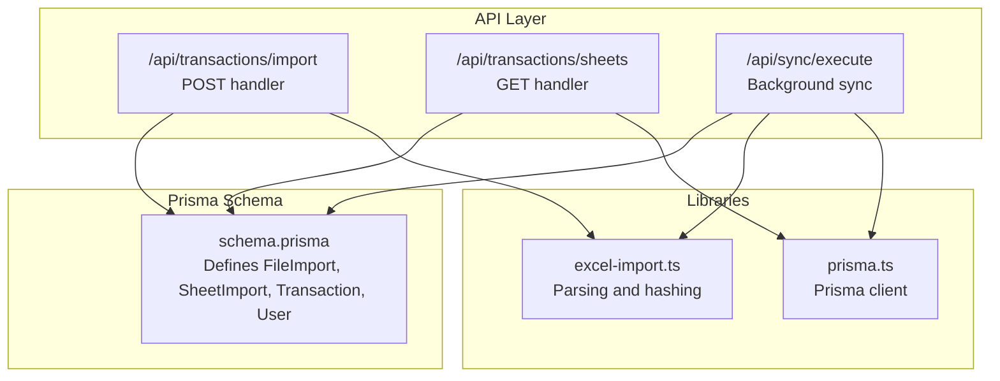
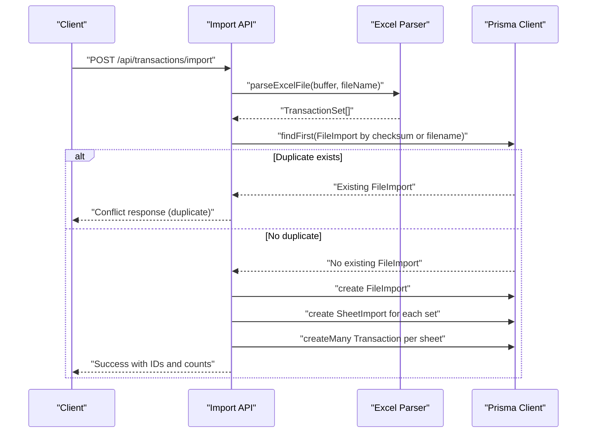
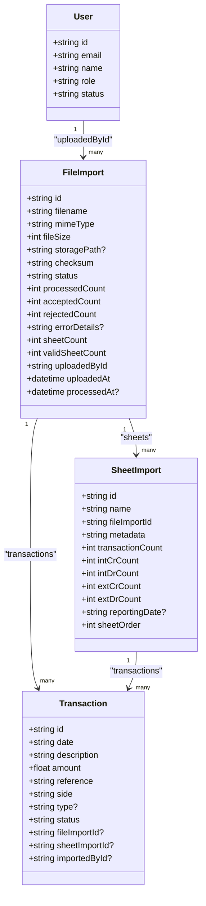
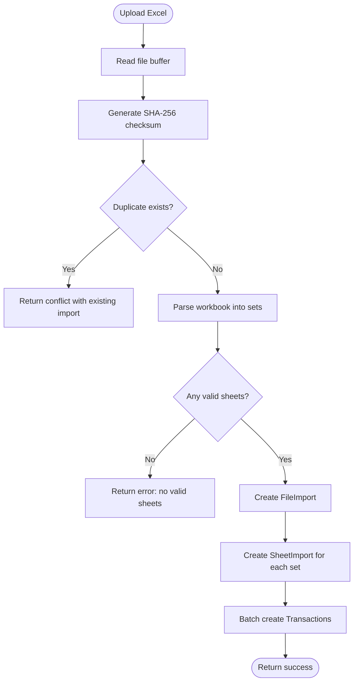
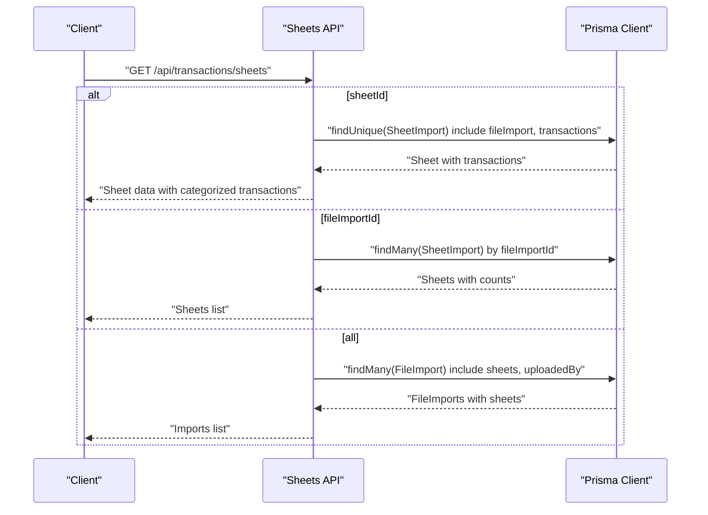
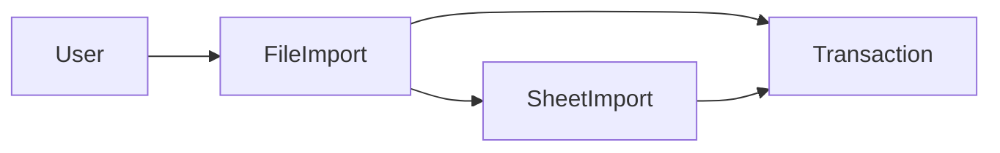

# FileImport Model

<cite>
**Referenced Files in This Document**
- [schema.prisma](file://prisma/schema.prisma)
- [DATABASE_PERSISTENCE.md](file://docs/DATABASE_PERSISTENCE.md)
- [TRANSACTION_IMPORT_GUIDE.md](file://docs/TRANSACTION_IMPORT_GUIDE.md)
- [import/route.ts](file://app/api/transactions/import/route.ts)
- [sheets/route.ts](file://app/api/transactions/sheets/route.ts)
- [excel-import.ts](file://lib/excel-import.ts)
- [prisma.ts](file://lib/prisma.ts)
- [execute/route.ts](file://app/api/sync/execute/route.ts)
</cite>

## Table of Contents
1. [Introduction](#introduction)
2. [Project Structure](#project-structure)
3. [Core Components](#core-components)
4. [Architecture Overview](#architecture-overview)
5. [Detailed Component Analysis](#detailed-component-analysis)
6. [Dependency Analysis](#dependency-analysis)
7. [Performance Considerations](#performance-considerations)
8. [Troubleshooting Guide](#troubleshooting-guide)
9. [Conclusion](#conclusion)

## Introduction
This document provides comprehensive data model documentation for the FileImport entity in the analyzer-web application. It explains how FileImport represents an uploaded Excel workbook and acts as the parent container for SheetImport records. It also documents the one-to-many relationships with Transaction and SheetImport, the many-to-one relationship with User, and the indexes that optimize query performance—especially for duplicate detection and retrieval. The guide references the implementation details described in DATABASE_PERSISTENCE.md and TRANSACTION_IMPORT_GUIDE.md, and outlines practical query patterns for retrieving import history and identifying duplicates.

## Project Structure
The FileImport model is defined in the Prisma schema and is used by the transaction import and sheets retrieval APIs. Supporting libraries include the Excel parsing utilities and the Prisma client initialization.

**Diagram sources**
- [schema.prisma](file://prisma/schema.prisma#L296-L374)
- [import/route.ts](file://app/api/transactions/import/route.ts#L1-L264)
- [sheets/route.ts](file://app/api/transactions/sheets/route.ts#L1-L166)
- [excel-import.ts](file://lib/excel-import.ts#L1-L327)
- [prisma.ts](file://lib/prisma.ts#L1-L11)
- [execute/route.ts](file://app/api/sync/execute/route.ts#L170-L311)

**Section sources**
- [schema.prisma](file://prisma/schema.prisma#L296-L374)
- [import/route.ts](file://app/api/transactions/import/route.ts#L1-L264)
- [sheets/route.ts](file://app/api/transactions/sheets/route.ts#L1-L166)
- [excel-import.ts](file://lib/excel-import.ts#L1-L327)
- [prisma.ts](file://lib/prisma.ts#L1-L11)
- [execute/route.ts](file://app/api/sync/execute/route.ts#L170-L311)

## Core Components
- FileImport: Represents an uploaded Excel workbook with metadata, processing status, counts, and user tracking. It is the parent container for SheetImport records and links to Transaction records via foreign keys.
- SheetImport: Represents a single sheet within a workbook, storing metadata, counts, and reporting date.
- Transaction: Represents individual transaction rows parsed from sheets, linked to FileImport and SheetImport.
- User: Many-to-one relationship with FileImport via uploadedById, enabling import history and attribution.

Key fields in FileImport:
- Identifier and file metadata: id, filename, mimeType, fileSize, storagePath (optional), checksum (SHA-256).
- Processing state: status, processedCount, acceptedCount, rejectedCount, errorDetails (JSON), sheetCount, validSheetCount.
- User tracking: uploadedById (foreign key), uploadedAt, processedAt (optional).
- Relationships: transactions[], sheets[].
- Indexes: status, uploadedAt, uploadedById, checksum.

How FileImport serves as a parent container:
- Each FileImport encapsulates a complete workbook import, including all valid sheets and their transactions.
- SheetImport records are created per valid sheet and link back to FileImport via fileImportId.
- Transaction records link to both FileImport and SheetImport, enabling hierarchical navigation and efficient querying.

**Section sources**
- [schema.prisma](file://prisma/schema.prisma#L300-L336)
- [schema.prisma](file://prisma/schema.prisma#L342-L374)
- [schema.prisma](file://prisma/schema.prisma#L59-L107)
- [schema.prisma](file://prisma/schema.prisma#L18-L53)
- [DATABASE_PERSISTENCE.md](file://docs/DATABASE_PERSISTENCE.md#L320-L387)

## Architecture Overview
The import pipeline begins with an Excel upload, followed by duplicate detection, parsing, and persistence. FileImport is created first, then SheetImport records per valid sheet, and finally Transaction records batched per sheet.

**Diagram sources**
- [import/route.ts](file://app/api/transactions/import/route.ts#L1-L264)
- [excel-import.ts](file://lib/excel-import.ts#L257-L327)
- [schema.prisma](file://prisma/schema.prisma#L300-L336)

**Section sources**
- [import/route.ts](file://app/api/transactions/import/route.ts#L1-L264)
- [excel-import.ts](file://lib/excel-import.ts#L1-L327)
- [DATABASE_PERSISTENCE.md](file://docs/DATABASE_PERSISTENCE.md#L84-L111)

## Detailed Component Analysis

### FileImport Data Model
FileImport captures the lifecycle of an uploaded workbook, including metadata, processing metrics, and user attribution. It defines:
- Identity and file attributes: id, filename, mimeType, fileSize, storagePath (optional), checksum.
- Processing state: status, processedCount, acceptedCount, rejectedCount, errorDetails (JSON), sheetCount, validSheetCount.
- User tracking: uploadedById, uploadedAt, processedAt.
- Relationships: transactions[], sheets[].
- Indexes: status, uploadedAt, uploadedById, checksum.

These indexes are essential for:
- Duplicate detection: checksum and filename uniqueness checks.
- Retrieval performance: filtering by status and uploadedAt, and by uploadedById for user history.
- Efficient joins to Transaction and SheetImport.

**Diagram sources**
- [schema.prisma](file://prisma/schema.prisma#L18-L53)
- [schema.prisma](file://prisma/schema.prisma#L300-L336)
- [schema.prisma](file://prisma/schema.prisma#L342-L374)
- [schema.prisma](file://prisma/schema.prisma#L59-L107)

**Section sources**
- [schema.prisma](file://prisma/schema.prisma#L300-L336)
- [schema.prisma](file://prisma/schema.prisma#L333-L336)

### Import Flow and Duplicate Prevention
The import API performs duplicate detection using both filename and checksum. If a duplicate is found, it prompts the client to override or skip. When overriding, the existing FileImport and related records are deleted before re-import.

**Diagram sources**
- [import/route.ts](file://app/api/transactions/import/route.ts#L1-L264)
- [excel-import.ts](file://lib/excel-import.ts#L257-L327)
- [schema.prisma](file://prisma/schema.prisma#L300-L336)

**Section sources**
- [import/route.ts](file://app/api/transactions/import/route.ts#L44-L87)
- [DATABASE_PERSISTENCE.md](file://docs/DATABASE_PERSISTENCE.md#L220-L240)

### Retrieval API and Relationships
The sheets API retrieves FileImport records with included sheets and uploadedBy user details. It supports:
- Listing all imports with sheet summaries.
- Listing sheets for a given FileImport.
- Returning a specific Sheet with categorized transactions.

**Diagram sources**
- [sheets/route.ts](file://app/api/transactions/sheets/route.ts#L1-L166)
- [schema.prisma](file://prisma/schema.prisma#L300-L336)
- [schema.prisma](file://prisma/schema.prisma#L342-L374)

**Section sources**
- [sheets/route.ts](file://app/api/transactions/sheets/route.ts#L115-L155)

### Background Sync and Consistency
The sync execute API follows the same pattern as the import API: it parses Excel files, detects duplicates, creates FileImport, SheetImport, and Transaction records, and reports results. This ensures consistent data model usage across both interactive and automated imports.

**Section sources**
- [execute/route.ts](file://app/api/sync/execute/route.ts#L170-L311)

## Dependency Analysis
- FileImport depends on:
  - User (uploadedById) for attribution.
  - SheetImport (one-to-many) for workbook structure.
  - Transaction (one-to-many) for parsed rows.
- Indexes on FileImport:
  - checksum: primary index for duplicate detection.
  - status, uploadedAt: composite index for filtering and sorting.
  - uploadedById: index for user-based queries.
- Transaction and SheetImport indexes support efficient joins and filtering.

**Diagram sources**
- [schema.prisma](file://prisma/schema.prisma#L18-L53)
- [schema.prisma](file://prisma/schema.prisma#L300-L336)
- [schema.prisma](file://prisma/schema.prisma#L342-L374)
- [schema.prisma](file://prisma/schema.prisma#L59-L107)

**Section sources**
- [schema.prisma](file://prisma/schema.prisma#L333-L336)
- [schema.prisma](file://prisma/schema.prisma#L101-L107)
- [schema.prisma](file://prisma/schema.prisma#L372-L374)

## Performance Considerations
- Duplicate detection relies on checksum and filename lookups. The checksum index enables fast duplicate checks.
- Composite index on status and uploadedAt accelerates filtering and sorting of imports by status and recency.
- Index on uploadedById optimizes queries for a user’s import history.
- Batch creation of Transaction records reduces round-trips during import.
- SheetImport and Transaction indexes (e.g., fileImportId, sheetImportId) improve join performance when retrieving sheets and transactions.

[No sources needed since this section provides general guidance]

## Troubleshooting Guide
Common issues and resolutions:
- Duplicate file detected:
  - Symptom: Conflict response indicating an existing import with the same checksum or filename.
  - Resolution: Choose override to delete existing data and re-import, or skip the upload.
- No valid sheets found:
  - Symptom: Parser skips sheets that do not meet the “dept” keyword criteria in the specified region.
  - Resolution: Ensure the sheet contains the required keyword in the expected area or adjust parsing logic.
- Missing required columns:
  - Symptom: Parser cannot find transaction table due to missing required columns.
  - Resolution: Ensure the sheet includes the expected headers for transaction parsing.
- Authentication failure:
  - Symptom: Unauthorized responses from import and sheets endpoints.
  - Resolution: Verify session validity and ensure the user is logged in.

**Section sources**
- [import/route.ts](file://app/api/transactions/import/route.ts#L15-L27)
- [import/route.ts](file://app/api/transactions/import/route.ts#L44-L87)
- [excel-import.ts](file://lib/excel-import.ts#L35-L54)
- [excel-import.ts](file://lib/excel-import.ts#L111-L167)
- [sheets/route.ts](file://app/api/transactions/sheets/route.ts#L15-L18)

## Conclusion
FileImport is the central entity for persisted Excel imports in analyzer-web. It captures file metadata, processing state, and user attribution, and serves as the parent container for SheetImport and Transaction records. The indexes on status, uploadedAt, uploadedById, and checksum enable efficient duplicate detection, import history retrieval, and transaction queries. Together with the import and sheets APIs, FileImport provides a robust foundation for multi-sheet Excel processing, deduplication, and long-term data retention.