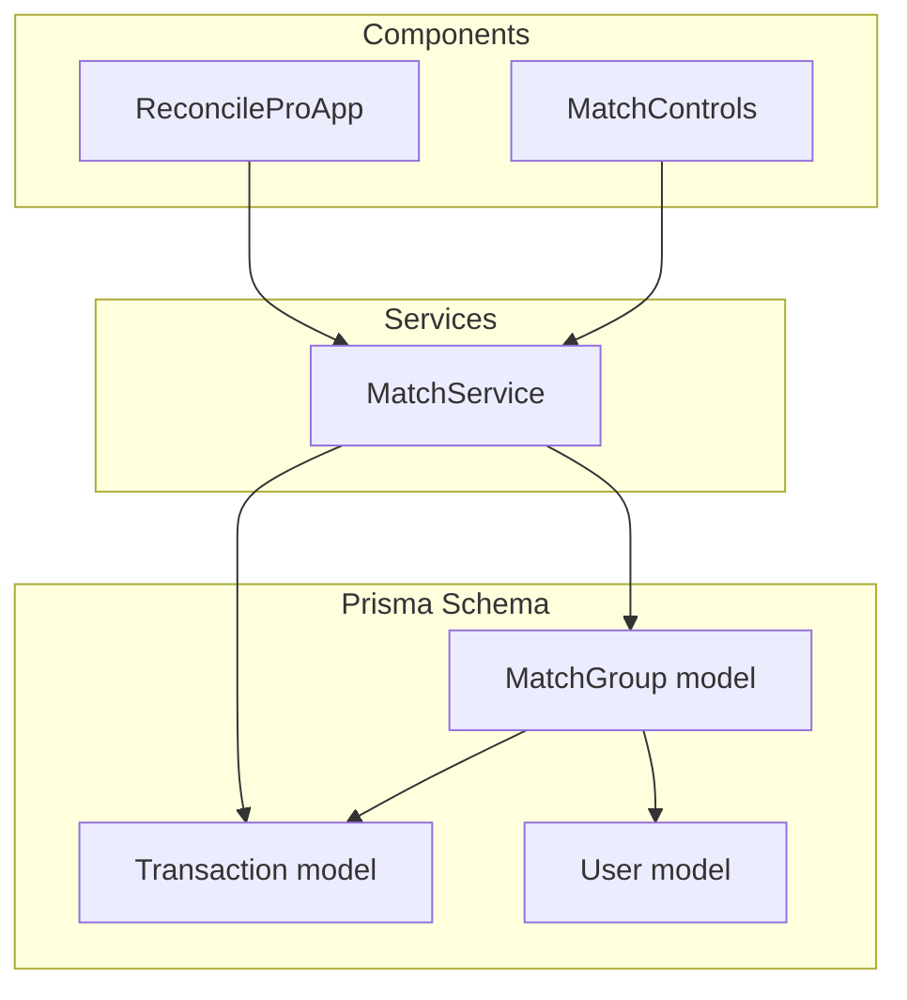
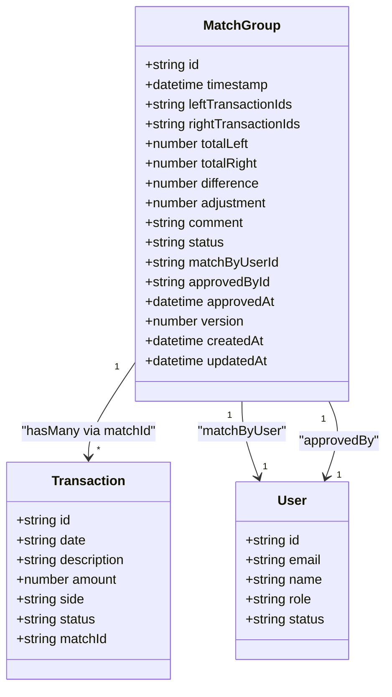
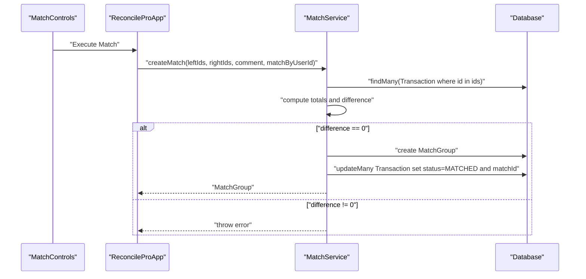
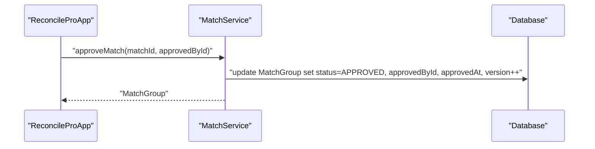
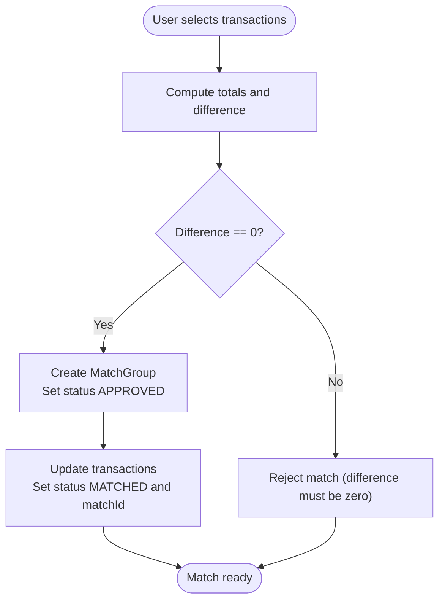
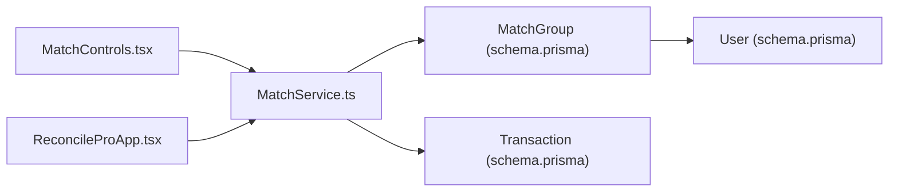

# MatchGroup Model

<cite>
**Referenced Files in This Document**
- [schema.prisma](file://prisma/schema.prisma)
- [MatchService.ts](file://services/MatchService.ts)
- [MatchControls.tsx](file://components/MatchControls.tsx)
- [ReconcileProApp.tsx](file://components/ReconcileProApp.tsx)
- [types.ts](file://lib/types.ts)
- [migration.sql](file://prisma/migrations/20251203103314_init/migration.sql)
</cite>

## Table of Contents
1. [Introduction](#introduction)
2. [Project Structure](#project-structure)
3. [Core Components](#core-components)
4. [Architecture Overview](#architecture-overview)
5. [Detailed Component Analysis](#detailed-component-analysis)
6. [Dependency Analysis](#dependency-analysis)
7. [Performance Considerations](#performance-considerations)
8. [Troubleshooting Guide](#troubleshooting-guide)
9. [Conclusion](#conclusion)
10. [Appendices](#appendices)

## Introduction
This document provides comprehensive data model documentation for the MatchGroup entity in the analyzer-web application. It explains the schema, relationships, computed fields, user tracking, and indexes, and describes how MatchGroup represents a reconciliation between internal and external transactions. It also documents the matching workflow, including creation, approval, and adjustment, and provides practical query examples for common use cases.

## Project Structure
MatchGroup is defined in the Prisma schema and backed by a relational database. The application integrates frontend controls for matching and backend services for persistence and business logic.

**Diagram sources**
- [schema.prisma](file://prisma/schema.prisma#L113-L151)
- [MatchService.ts](file://services/MatchService.ts#L1-L173)
- [MatchControls.tsx](file://components/MatchControls.tsx#L1-L125)
- [ReconcileProApp.tsx](file://components/ReconcileProApp.tsx#L1-L200)

**Section sources**
- [schema.prisma](file://prisma/schema.prisma#L113-L151)

## Core Components
- MatchGroup: Represents a reconciliation group linking multiple internal and external transactions. It stores computed totals, difference, optional adjustment, comments, status, and user tracking fields. It also includes a version field for optimistic locking and timestamps.
- Transaction: Represents individual financial entries with a side (LEFT or RIGHT), status, and optional matchId linking back to MatchGroup.
- User: Represents users who create matches and approve adjustments; MatchGroup links to User via matchByUser and approvedBy.

Key characteristics:
- Relationship with Transaction: MatchGroup has a one-to-many relationship with Transaction via matchId.
- Relationship with User: MatchGroup has two one-to-one relationships with User for matchByUser and approvedBy.
- Indexes: MatchGroup has indexes on status and timestamp, matchByUserId, and approvedById to optimize queries.
- Versioning: MatchGroup includes a version field to support optimistic concurrency.

**Section sources**
- [schema.prisma](file://prisma/schema.prisma#L59-L107)
- [schema.prisma](file://prisma/schema.prisma#L113-L151)
- [types.ts](file://lib/types.ts#L41-L76)

## Architecture Overview
MatchGroup sits at the center of the reconciliation workflow. Transactions are imported and reconciled into MatchGroups. Users create matches, and approvals are tracked with user identity and timestamps.

**Diagram sources**
- [schema.prisma](file://prisma/schema.prisma#L59-L107)
- [schema.prisma](file://prisma/schema.prisma#L113-L151)

## Detailed Component Analysis

### MatchGroup Data Model
- Identity and timestamps
  - id: Unique identifier for the match group.
  - timestamp: Creation time of the match group.
  - createdAt, updatedAt: Database-managed timestamps.
- Transaction linkage
  - transactions: One-to-many relationship to Transaction via matchId.
  - leftTransactionIds and rightTransactionIds: Stored as JSON arrays of transaction IDs to capture multi-to-many relationships.
- Calculated totals
  - totalLeft: Sum of amounts for selected LEFT-side transactions.
  - totalRight: Sum of amounts for selected RIGHT-side transactions.
  - difference: Absolute difference between totals.
  - adjustment: Optional adjustment amount used when differences exceed limits and require approval.
- Metadata and status
  - comment: Optional notes describing the match rationale.
  - status: APPROVED, PENDING_APPROVAL, REJECTED.
- User tracking
  - matchByUserId: Creator of the match.
  - approvedById: Approver of the match.
  - approvedAt: Timestamp when the match was approved.
- Concurrency control
  - version: Integer used for optimistic locking during updates.
- Indexes
  - status and timestamp: Composite index to accelerate status-based queries and chronological sorting.
  - matchByUserId: Index to filter matches by creator.
  - approvedById: Index to filter matches by approver.

Implementation references:
- Model definition and indexes: [schema.prisma](file://prisma/schema.prisma#L113-L151)
- Migration DDL: [migration.sql](file://prisma/migrations/20251203103314_init/migration.sql#L42-L62)

**Section sources**
- [schema.prisma](file://prisma/schema.prisma#L113-L151)
- [migration.sql](file://prisma/migrations/20251203103314_init/migration.sql#L42-L62)

### Relationship with Transaction
- Transaction.matchId links each transaction to a MatchGroup.
- Transactions are classified by side (LEFT or RIGHT) and status (UNMATCHED, MATCHED, DISPUTED, ARCHIVED).
- MatchService updates transaction statuses and sets matchId when creating matches.

References:
- Transaction model and matchId: [schema.prisma](file://prisma/schema.prisma#L59-L107)
- MatchService transaction updates: [MatchService.ts](file://services/MatchService.ts#L70-L79)

**Section sources**
- [schema.prisma](file://prisma/schema.prisma#L59-L107)
- [MatchService.ts](file://services/MatchService.ts#L70-L79)

### Relationship with User
- MatchGroup has two one-to-one relationships with User:
  - matchByUser: Created by a user.
  - approvedBy: Approved by a user.
- These relationships enable auditability and separation of duties.

References:
- MatchGroup relations: [schema.prisma](file://prisma/schema.prisma#L133-L141)
- Types for MatchGroup: [types.ts](file://lib/types.ts#L62-L76)

**Section sources**
- [schema.prisma](file://prisma/schema.prisma#L133-L141)
- [types.ts](file://lib/types.ts#L62-L76)

### Matching Workflow
The matching workflow involves selecting transactions, computing totals, and either creating an exact match or requesting approval for an adjustment.

**Diagram sources**
- [MatchControls.tsx](file://components/MatchControls.tsx#L1-L125)
- [ReconcileProApp.tsx](file://components/ReconcileProApp.tsx#L584-L610)
- [MatchService.ts](file://services/MatchService.ts#L20-L82)

**Section sources**
- [MatchControls.tsx](file://components/MatchControls.tsx#L1-L125)
- [ReconcileProApp.tsx](file://components/ReconcileProApp.tsx#L584-L610)
- [MatchService.ts](file://services/MatchService.ts#L20-L82)

### Approval and Adjustment
- Approval: An authorized user approves a match, setting status to APPROVED, recording approvedById and approvedAt, and incrementing version.
- Adjustment: When difference is small but non-zero, the system may allow a write-off up to a threshold; otherwise, approval is required based on role limits.

**Diagram sources**
- [ReconcileProApp.tsx](file://components/ReconcileProApp.tsx#L612-L643)
- [MatchService.ts](file://services/MatchService.ts#L126-L143)

**Section sources**
- [ReconcileProApp.tsx](file://components/ReconcileProApp.tsx#L612-L643)
- [MatchService.ts](file://services/MatchService.ts#L126-L143)

### Data Flow for Match Creation

**Diagram sources**
- [MatchService.ts](file://services/MatchService.ts#L20-L82)
- [MatchControls.tsx](file://components/MatchControls.tsx#L1-L125)

**Section sources**
- [MatchService.ts](file://services/MatchService.ts#L20-L82)
- [MatchControls.tsx](file://components/MatchControls.tsx#L1-L125)

## Dependency Analysis
- MatchGroup depends on:
  - Transaction via matchId for reconciliation.
  - User via matchByUser and approvedBy for auditability.
- MatchService orchestrates match creation, approval, and unmatching, interacting with both MatchGroup and Transaction.
- Frontend components (MatchControls and ReconcileProApp) drive user actions and display match state.

**Diagram sources**
- [MatchControls.tsx](file://components/MatchControls.tsx#L1-L125)
- [ReconcileProApp.tsx](file://components/ReconcileProApp.tsx#L1-L200)
- [MatchService.ts](file://services/MatchService.ts#L1-L173)
- [schema.prisma](file://prisma/schema.prisma#L59-L107)
- [schema.prisma](file://prisma/schema.prisma#L113-L151)

**Section sources**
- [MatchService.ts](file://services/MatchService.ts#L1-L173)
- [schema.prisma](file://prisma/schema.prisma#L59-L107)
- [schema.prisma](file://prisma/schema.prisma#L113-L151)

## Performance Considerations
- Indexes on MatchGroup:
  - status and timestamp: Efficiently filter and sort matches by status and recency.
  - matchByUserId: Quickly retrieve matches created by a specific user.
  - approvedById: Quickly retrieve matches approved by a specific user.
- Transaction indexing:
  - matchId: Supports fast lookup of transactions belonging to a match.
  - status and date, side: Supports filtering and reconciliation queries.
- Optimistic locking:
  - version increments on approval reduce race conditions and improve concurrency safety.

[No sources needed since this section provides general guidance]

## Troubleshooting Guide
Common issues and resolutions:
- Cannot match due to non-zero difference:
  - Cause: MatchService enforces exact matching (difference must be zero).
  - Resolution: Adjust selections to balance totals or request approval if applicable.
  - Reference: [MatchService.ts](file://services/MatchService.ts#L46-L53)
- Permission denied for approval:
  - Cause: Separation of duties prevents importers from approving their own adjustments.
  - Resolution: Ask an authorized manager to approve.
  - Reference: [ReconcileProApp.tsx](file://components/ReconcileProApp.tsx#L612-L629)
- Missing match approvals:
  - Cause: Matches remain PENDING_APPROVAL until approved.
  - Resolution: Use the approval flow to set status to APPROVED.
  - Reference: [MatchService.ts](file://services/MatchService.ts#L126-L143)

**Section sources**
- [MatchService.ts](file://services/MatchService.ts#L46-L53)
- [ReconcileProApp.tsx](file://components/ReconcileProApp.tsx#L612-L629)
- [MatchService.ts](file://services/MatchService.ts#L126-L143)

## Conclusion
MatchGroup encapsulates reconciliation logic with robust relationships to Transaction and User, computed totals, and user-driven lifecycle states. Its indexes and versioning support efficient querying and safe concurrent updates. The frontend and service layers coordinate to enforce business rules and maintain auditability.

[No sources needed since this section summarizes without analyzing specific files]

## Appendices

### Field Reference
- Identity and timestamps
  - id: Unique identifier.
  - timestamp: Creation time.
  - createdAt, updatedAt: Database-managed timestamps.
- Transaction linkage
  - transactions: One-to-many relationship via matchId.
  - leftTransactionIds, rightTransactionIds: JSON arrays of transaction IDs.
- Totals and difference
  - totalLeft, totalRight: Computed sums.
  - difference: Absolute difference between totals.
  - adjustment: Optional adjustment amount.
- Metadata and status
  - comment: Optional notes.
  - status: APPROVED, PENDING_APPROVAL, REJECTED.
- User tracking
  - matchByUserId: Creator.
  - approvedById: Approver.
  - approvedAt: Approval timestamp.
- Concurrency control
  - version: Optimistic locking.
- Indexes
  - status, timestamp: Composite index.
  - matchByUserId, approvedById: Single-column indexes.

**Section sources**
- [schema.prisma](file://prisma/schema.prisma#L113-L151)
- [schema.prisma](file://prisma/schema.prisma#L59-L107)
- [types.ts](file://lib/types.ts#L62-L76)

### Example Queries
- Find pending approvals:
  - Query by status equal to PENDING_APPROVAL and order by timestamp descending.
  - Reference: [MatchService.ts](file://services/MatchService.ts#L91-L118)
- Retrieve all matches for a specific user:
  - Filter by matchByUserId or approvedById depending on whether you want matches created by or approved by the user.
  - References: [schema.prisma](file://prisma/schema.prisma#L149-L151), [MatchService.ts](file://services/MatchService.ts#L91-L118)

**Section sources**
- [MatchService.ts](file://services/MatchService.ts#L91-L118)
- [schema.prisma](file://prisma/schema.prisma#L149-L151)