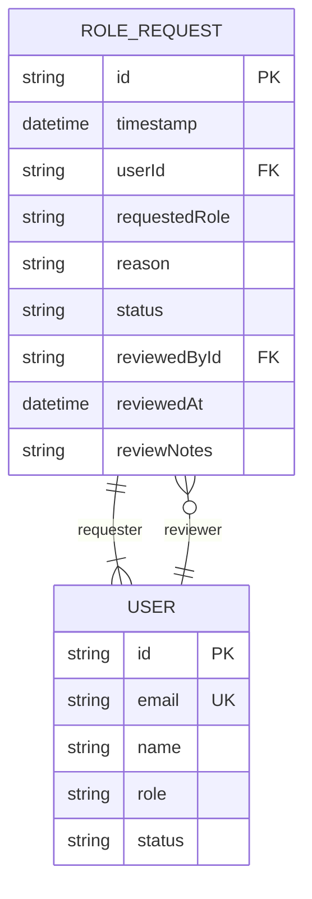
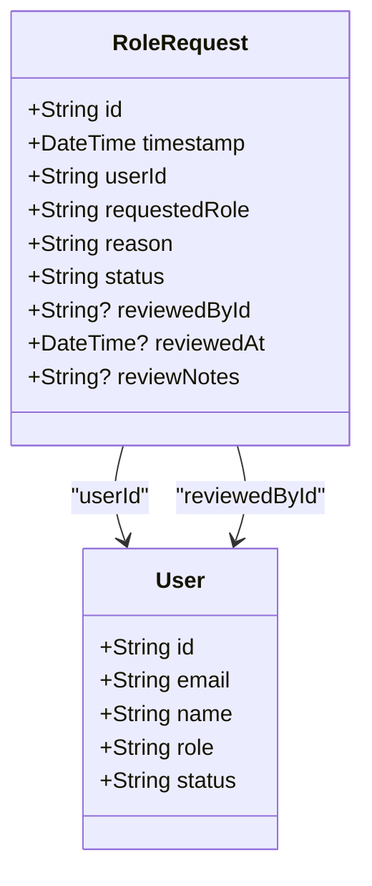
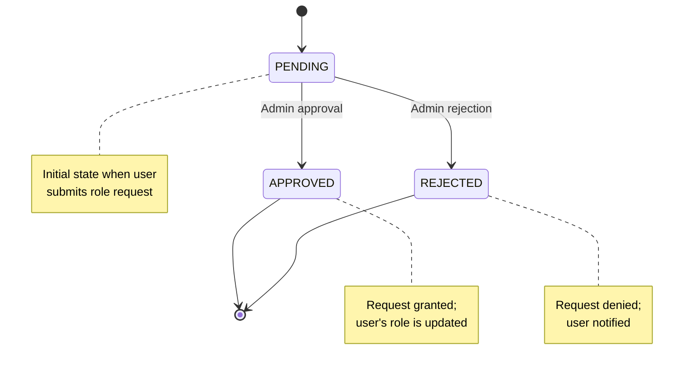
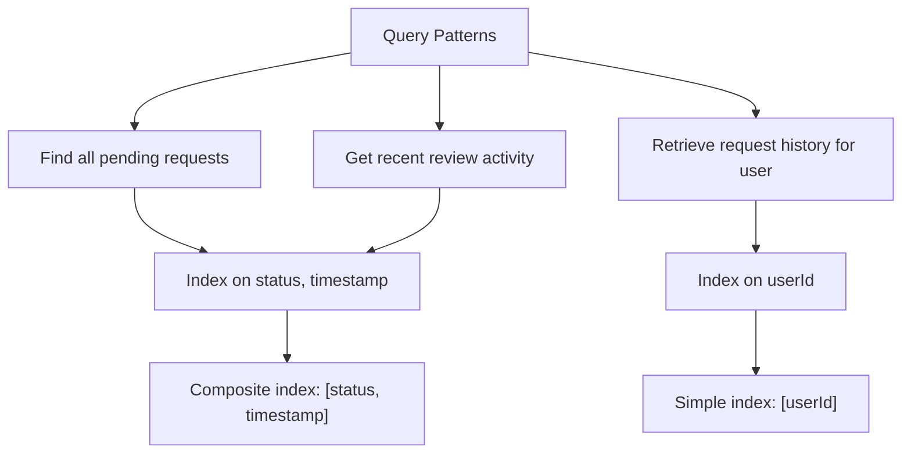
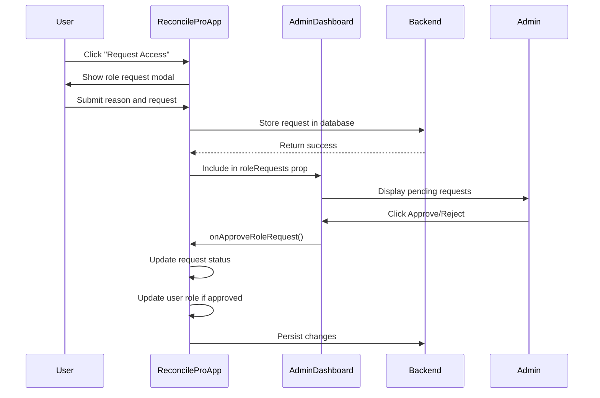

# RolePermission Model

<cite>
**Referenced Files in This Document**   
- [schema.prisma](file://prisma/schema.prisma#L226-L243)
- [types.ts](file://lib/types.ts#L113-L121)
- [AdminDashboard.tsx](file://components/AdminDashboard.tsx#L22-L23)
- [ReconcileProApp.tsx](file://components/ReconcileProApp.tsx#L913-L928)
</cite>

## Table of Contents
1. [Introduction](#introduction)
2. [Data Model Structure](#data-model-structure)
3. [Field Definitions](#field-definitions)
4. [Relationships](#relationships)
5. [Status Workflow](#status-workflow)
6. [Query Performance and Indexes](#query-performance-and-indexes)
7. [Admin Dashboard Integration](#admin-dashboard-integration)
8. [Common Query Examples](#common-query-examples)
9. [Conclusion](#conclusion)

## Introduction
The RoleRequest entity in the analyzer-web application enables a secure role management workflow where users can request elevated permissions that require administrative approval. This model supports access control governance by providing an auditable trail of role upgrade requests, reasons, and review decisions. The implementation facilitates separation of duties and ensures that privilege escalation follows an approved process.

## Data Model Structure



**Diagram sources**
- [schema.prisma](file://prisma/schema.prisma#L226-L243)
- [types.ts](file://lib/types.ts#L113-L121)

**Section sources**
- [schema.prisma](file://prisma/schema.prisma#L226-L243)
- [types.ts](file://lib/types.ts#L113-L121)

## Field Definitions

The RoleRequest model contains the following fields:

| Field | Type | Required | Default | Description |
|-------|------|----------|---------|-------------|
| **id** | String | Yes | cuid() | Unique identifier for the role request |
| **timestamp** | DateTime | Yes | now() | When the request was submitted |
| **userId** | String | Yes | - | ID of the user requesting role change |
| **requestedRole** | String | Yes | - | Target role being requested (ADMIN, MANAGER, ANALYST, AUDITOR) |
| **reason** | String | Yes | - | Justification provided by the user for the role upgrade |
| **status** | String | Yes | "PENDING" | Current state of the request (PENDING, APPROVED, REJECTED) |
| **reviewedById** | String | No | - | ID of the administrator who reviewed the request |
| **reviewedAt** | DateTime | No | - | Timestamp when the request was reviewed |
| **reviewNotes** | String | No | - | Optional comments from the reviewer |

**Section sources**
- [schema.prisma](file://prisma/schema.prisma#L226-L243)
- [types.ts](file://lib/types.ts#L113-L121)

## Relationships

The RoleRequest entity establishes two many-to-one relationships with the User model:

1. **Requester Relationship**: Each role request is associated with a single user who initiated the request through the `userId` foreign key.
2. **Reviewer Relationship**: When a request is reviewed, it references the administrator who performed the review through the `reviewedById` field.

This dual relationship pattern enables full auditability of the role management process, tracking both who requested the change and who approved or rejected it.



**Diagram sources**
- [schema.prisma](file://prisma/schema.prisma#L226-L243)
- [types.ts](file://lib/types.ts#L113-L121)

**Section sources**
- [schema.prisma](file://prisma/schema.prisma#L226-L243)
- [types.ts](file://lib/types.ts#L113-L121)

## Status Workflow

The RoleRequest model implements a three-state approval workflow:



- **PENDING**: Default status when a user submits a role request. These appear in the admin dashboard for review.
- **APPROVED**: Status set when an administrator approves the request, triggering a role update for the user.
- **REJECTED**: Status set when an administrator rejects the request, with optional review notes explaining the decision.

**Diagram sources**
- [schema.prisma](file://prisma/schema.prisma#L234)
- [types.ts](file://lib/types.ts#L119)

**Section sources**
- [schema.prisma](file://prisma/schema.prisma#L234)
- [types.ts](file://lib/types.ts#L119)

## Query Performance and Indexes

The RoleRequest model includes database indexes to optimize common query patterns:



Two indexes are defined to support efficient querying:
- **status-timestamp index**: Optimizes retrieval of pending requests sorted by submission time
- **userId index**: Enables fast lookup of all role requests for a specific user

These indexes ensure responsive performance for both administrative review workflows and audit reporting.

**Diagram sources**
- [schema.prisma](file://prisma/schema.prisma#L241-L242)

**Section sources**
- [schema.prisma](file://prisma/schema.prisma#L241-L242)

## Admin Dashboard Integration

The RoleRequest model is integrated into the AdminDashboard component, where administrators can review and process pending requests:



The AdminDashboard component displays pending role requests in a dedicated security tab, allowing administrators to:
- View the requester's name, requested role, and justification
- See the submission timestamp
- Approve or reject requests with a single click
- Trigger automatic user role updates upon approval

**Diagram sources**
- [AdminDashboard.tsx](file://components/AdminDashboard.tsx#L144-L158)
- [ReconcileProApp.tsx](file://components/ReconcileProApp.tsx#L913-L928)

**Section sources**
- [AdminDashboard.tsx](file://components/AdminDashboard.tsx#L144-L158)
- [ReconcileProApp.tsx](file://components/ReconcileProApp.tsx#L913-L928)

## Common Query Examples

The following are typical queries performed on the RoleRequest model:

**Find all pending requests for administrative review:**
```typescript
prisma.roleRequest.findMany({
  where: { status: 'PENDING' },
  include: { user: true },
  orderBy: { timestamp: 'asc' }
})
```

**Retrieve role request history for a specific user:**
```typescript
prisma.roleRequest.findMany({
  where: { userId: 'user-123' },
  orderBy: { timestamp: 'desc' }
})
```

**Get recently reviewed requests for audit purposes:**
```typescript
prisma.roleRequest.findMany({
  where: {
    status: { in: ['APPROVED', 'REJECTED'] },
    reviewedAt: { gte: lastWeek }
  },
  include: { 
    user: true,
    reviewer: { select: { name: true } }
  },
  orderBy: { reviewedAt: 'desc' }
})
```

These queries leverage the defined indexes for optimal performance in both administrative and audit scenarios.

**Section sources**
- [schema.prisma](file://prisma/schema.prisma#L241-L242)
- [ReconcileProApp.tsx](file://components/ReconcileProApp.tsx#L913-L928)

## Conclusion
The RoleRequest model provides a robust foundation for secure role management in the analyzer-web application. By implementing a formal approval workflow with complete auditability, it ensures that privilege escalation follows proper governance procedures. The model's relationships with the User entity, combined with strategic indexing, enable efficient administrative review and comprehensive audit reporting. Integration with the AdminDashboard component provides an intuitive interface for managing role requests, making the system both secure and user-friendly.