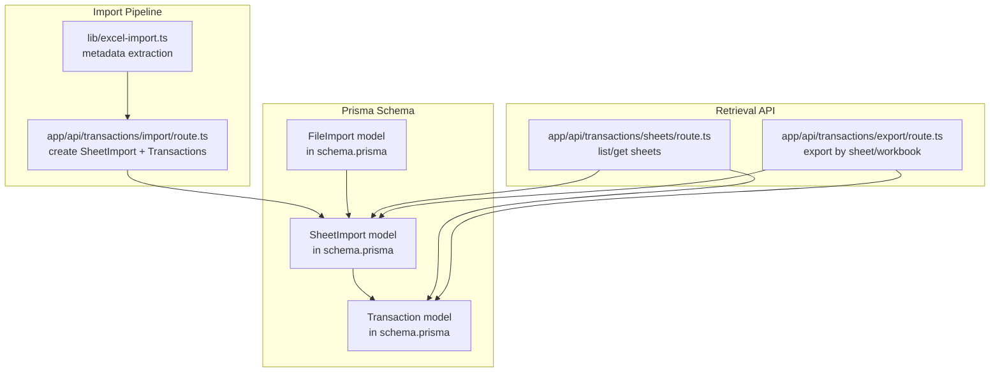
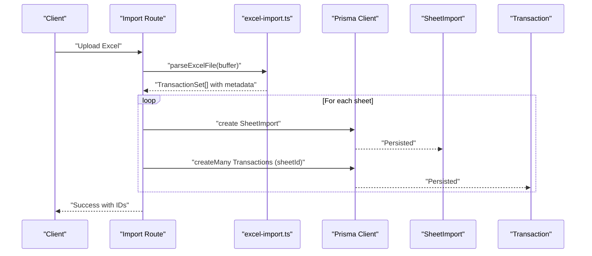
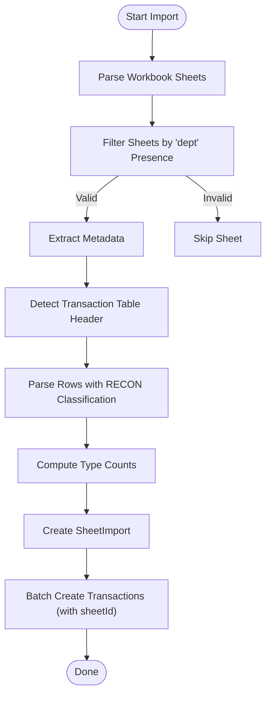
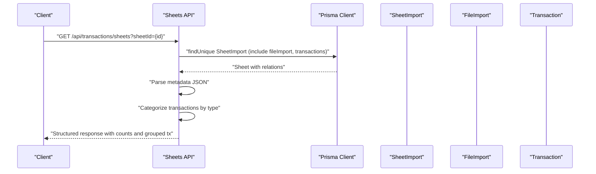
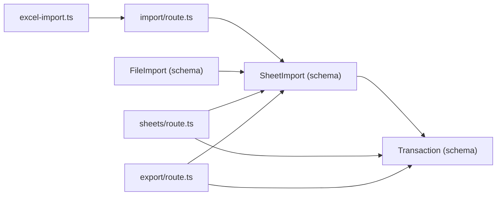

# SheetImport Model

<cite>
**Referenced Files in This Document**
- [prisma/schema.prisma](file://prisma/schema.prisma)
- [prisma/migrations/20251203160749_add_sheet_import_model/migration.sql](file://prisma/migrations/20251203160749_add_sheet_import_model/migration.sql)
- [docs/DATABASE_PERSISTENCE.md](file://docs/DATABASE_PERSISTENCE.md)
- [app/api/transactions/sheets/route.ts](file://app/api/transactions/sheets/route.ts)
- [app/api/transactions/import/route.ts](file://app/api/transactions/import/route.ts)
- [lib/excel-import.ts](file://lib/excel-import.ts)
- [app/api/transactions/export/route.ts](file://app/api/transactions/export/route.ts)
</cite>

## Table of Contents
1. [Introduction](#introduction)
2. [Project Structure](#project-structure)
3. [Core Components](#core-components)
4. [Architecture Overview](#architecture-overview)
5. [Detailed Component Analysis](#detailed-component-analysis)
6. [Dependency Analysis](#dependency-analysis)
7. [Performance Considerations](#performance-considerations)
8. [Troubleshooting Guide](#troubleshooting-guide)
9. [Conclusion](#conclusion)

## Introduction
This document provides comprehensive data model documentation for the SheetImport entity in the analyzer-web application. It explains the fields, relationships, indexing, and persistence behavior of SheetImport, which represents a single worksheet within an Excel workbook containing financial transactions. The documentation also covers how SheetImport enables multi-sheet support, preserves metadata, and facilitates efficient retrieval of transactions by sheet.

## Project Structure
The SheetImport model is defined in the Prisma schema and persisted via a dedicated migration. Its lifecycle spans the import pipeline (metadata extraction and transaction categorization) and the retrieval API (listing sheets and fetching sheet details with categorized transactions).

**Diagram sources**
- [prisma/schema.prisma](file://prisma/schema.prisma#L342-L374)
- [lib/excel-import.ts](file://lib/excel-import.ts#L90-L289)
- [app/api/transactions/import/route.ts](file://app/api/transactions/import/route.ts#L160-L226)
- [app/api/transactions/sheets/route.ts](file://app/api/transactions/sheets/route.ts#L1-L166)
- [app/api/transactions/export/route.ts](file://app/api/transactions/export/route.ts#L101-L142)

**Section sources**
- [prisma/schema.prisma](file://prisma/schema.prisma#L342-L374)
- [prisma/migrations/20251203160749_add_sheet_import_model/migration.sql](file://prisma/migrations/20251203160749_add_sheet_import_model/migration.sql#L1-L16)

## Core Components
- SheetImport: Represents a single worksheet from an Excel file, including metadata, counts by transaction type, reporting date, and ordering within the workbook.
- FileImport: Parent container for multiple sheets; tracks total and valid sheet counts and links to SheetImport.
- Transaction: Child of SheetImport; stores parsed transaction data and categorization by type.

Key characteristics:
- Many-to-one relationship with FileImport via fileImportId.
- One-to-many relationship with Transaction via sheetImportId.
- Indexes on fileImportId and reportingDate to optimize queries.
- Metadata stored as JSON string; counts maintained for quick aggregation.

**Section sources**
- [prisma/schema.prisma](file://prisma/schema.prisma#L342-L374)
- [prisma/migrations/20251203160749_add_sheet_import_model/migration.sql](file://prisma/migrations/20251203160749_add_sheet_import_model/migration.sql#L81-L86)
- [docs/DATABASE_PERSISTENCE.md](file://docs/DATABASE_PERSISTENCE.md#L11-L31)

## Architecture Overview
SheetImport sits at the center of the multi-sheet import architecture. The import pipeline extracts metadata and transactions from each valid sheet, persists a SheetImport record, and creates Transaction records linked to that sheet. The retrieval API exposes endpoints to list all imports with their sheets, list sheets for a given file, and fetch a specific sheet with categorized transactions.

**Diagram sources**
- [app/api/transactions/import/route.ts](file://app/api/transactions/import/route.ts#L160-L226)
- [lib/excel-import.ts](file://lib/excel-import.ts#L256-L289)
- [prisma/schema.prisma](file://prisma/schema.prisma#L342-L374)

## Detailed Component Analysis

### SheetImport Data Model
- Identity and naming
  - id: Unique identifier for the sheet record.
  - name: Human-readable sheet name.
- Parent relationship
  - fileImportId: Foreign key linking to FileImport; cascade deletion ensures cleanup when a file is removed.
  - fileImport: Relation to FileImport.
- Metadata and counts
  - metadata: JSON string storing structured fields such as department, branch, bank account number, and reporting date.
  - transactionCount: Total number of transactions saved for the sheet.
  - intCrCount, intDrCount, extCrCount, extDrCount: Precomputed counts by transaction type.
- Temporal and ordering
  - reportingDate: Date extracted from metadata or inferred from the sheet data.
  - sheetOrder: Integer indicating the position of the sheet within the workbook.
- Children
  - transactions: One-to-many relation to Transaction.
- Timestamps
  - createdAt: Automatic timestamp for record creation.
- Indexes
  - Index on fileImportId to accelerate joins and filtering by parent file.
  - Index on reportingDate to support date-based queries.

**Section sources**
- [prisma/schema.prisma](file://prisma/schema.prisma#L342-L374)
- [prisma/migrations/20251203160749_add_sheet_import_model/migration.sql](file://prisma/migrations/20251203160749_add_sheet_import_model/migration.sql#L81-L86)
- [docs/DATABASE_PERSISTENCE.md](file://docs/DATABASE_PERSISTENCE.md#L11-L31)

### Import Pipeline and Metadata Extraction
- Metadata extraction
  - The parser scans the sheet to extract key-value pairs from the top portion until it reaches the transaction table header row.
  - Fields commonly captured include department, branch, reporting date, account number, and prepared-by information.
- Transaction categorization
  - Transactions are parsed using the RECON column to classify them as internal credit, internal debit, external debit, or external credit.
  - Sides are assigned for dual-pane display (LEFT for GL-side, RIGHT for statement-side).
- SheetImport creation
  - For each valid sheet, a SheetImport record is created with:
    - name
    - fileImportId
    - metadata (serialized JSON)
    - transactionCount
    - per-type counts (intCrCount, intDrCount, extCrCount, extDrCount)
    - reportingDate (from metadata or inferred)
    - sheetOrder (index within workbook)
- Transaction creation
  - All transactions for a sheet are batch-created with sheetImportId set, linking them to the SheetImport.

**Diagram sources**
- [lib/excel-import.ts](file://lib/excel-import.ts#L90-L289)
- [app/api/transactions/import/route.ts](file://app/api/transactions/import/route.ts#L160-L226)

**Section sources**
- [lib/excel-import.ts](file://lib/excel-import.ts#L90-L289)
- [app/api/transactions/import/route.ts](file://app/api/transactions/import/route.ts#L160-L226)

### Retrieval API and Usage Patterns
- Endpoint: GET /api/transactions/sheets
  - Without parameters: Lists all FileImport records with their associated sheets, ordered by upload time.
  - With fileImportId: Lists sheets belonging to a specific file, ordered by sheetOrder.
  - With sheetId: Returns a single sheet with its metadata, reporting date, file name, upload timestamp, total transaction count, and categorized transactions grouped by type.
- Response shaping
  - Metadata is parsed from the JSON string for presentation.
  - Transactions are categorized into GL-side and statement-side groups and counted per type.

**Diagram sources**
- [app/api/transactions/sheets/route.ts](file://app/api/transactions/sheets/route.ts#L1-L166)

**Section sources**
- [app/api/transactions/sheets/route.ts](file://app/api/transactions/sheets/route.ts#L1-L166)
- [docs/DATABASE_PERSISTENCE.md](file://docs/DATABASE_PERSISTENCE.md#L112-L217)

### Export Integration
- Export by sheet
  - Retrieves a specific sheet’s transactions and augments each with sheet name, file name, and sheet metadata.
- Export by workbook
  - Aggregates transactions across all sheets for a file, preserving sheet order and attaching metadata per sheet.

**Section sources**
- [app/api/transactions/export/route.ts](file://app/api/transactions/export/route.ts#L101-L142)

## Dependency Analysis
- Internal dependencies
  - SheetImport depends on FileImport (many-to-one) and Transaction (one-to-many).
  - Import route depends on the parser module to produce metadata and categorized transactions.
  - Retrieval API depends on Prisma to query SheetImport and join with FileImport and Transaction.
- External dependencies
  - Excel parsing library (used indirectly via the parser) to convert sheets to arrays and detect headers.
- Indexes
  - fileImportId index accelerates joins and filtering by parent file.
  - reportingDate index accelerates date-based queries.

**Diagram sources**
- [prisma/schema.prisma](file://prisma/schema.prisma#L342-L374)
- [lib/excel-import.ts](file://lib/excel-import.ts#L256-L289)
- [app/api/transactions/import/route.ts](file://app/api/transactions/import/route.ts#L160-L226)
- [app/api/transactions/sheets/route.ts](file://app/api/transactions/sheets/route.ts#L1-L166)
- [app/api/transactions/export/route.ts](file://app/api/transactions/export/route.ts#L101-L142)

**Section sources**
- [prisma/schema.prisma](file://prisma/schema.prisma#L342-L374)
- [prisma/migrations/20251203160749_add_sheet_import_model/migration.sql](file://prisma/migrations/20251203160749_add_sheet_import_model/migration.sql#L81-L86)

## Performance Considerations
- Indexes
  - fileImportId: Supports fast filtering by parent file and efficient joins.
  - reportingDate: Enables efficient date-range queries and reporting filters.
- Count caching
  - Per-type counts (intCrCount, intDrCount, extCrCount, extDrCount) reduce the need for repeated aggregations.
- Batch operations
  - Transactions are inserted in bulk per sheet to minimize round-trips.
- Query patterns
  - Prefer filtering by fileImportId or reportingDate to leverage indexes.
  - Use sheetOrder for deterministic ordering when listing sheets.

[No sources needed since this section provides general guidance]

## Troubleshooting Guide
- Missing reporting date
  - If metadata lacks a reporting date, the import falls back to a derived date from the sheet data.
- Empty or invalid sheets
  - Sheets without the required “dept” presence or missing transaction headers are skipped.
- Metadata parsing issues
  - Ensure the top portion of the sheet contains the expected fields; otherwise, metadata extraction may be incomplete.
- Retrieval anomalies
  - Confirm that sheetId or fileImportId parameters are correct and that the sheet still exists.
  - Verify that transactions are not marked deleted when querying.

**Section sources**
- [app/api/transactions/import/route.ts](file://app/api/transactions/import/route.ts#L160-L226)
- [lib/excel-import.ts](file://lib/excel-import.ts#L90-L120)
- [app/api/transactions/sheets/route.ts](file://app/api/transactions/sheets/route.ts#L1-L166)

## Conclusion
SheetImport is a central entity enabling robust multi-sheet support for Excel-based financial data. It preserves rich metadata, maintains per-type transaction counts, and links seamlessly to both FileImport and Transaction. The combination of indexes, batch creation, and categorized retrieval makes it practical to manage and query large volumes of imported data efficiently.