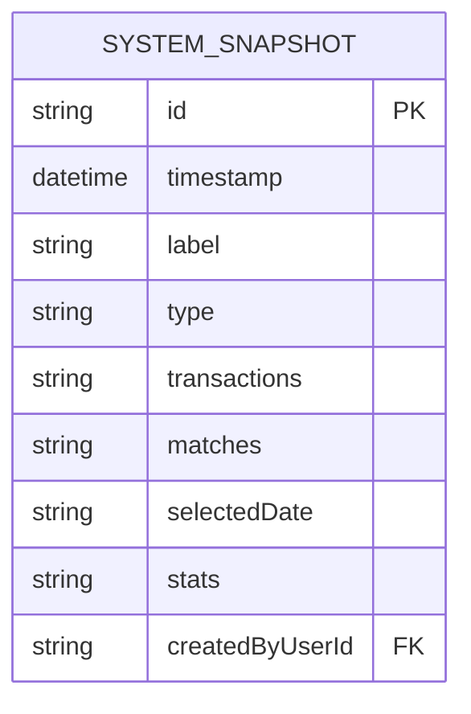
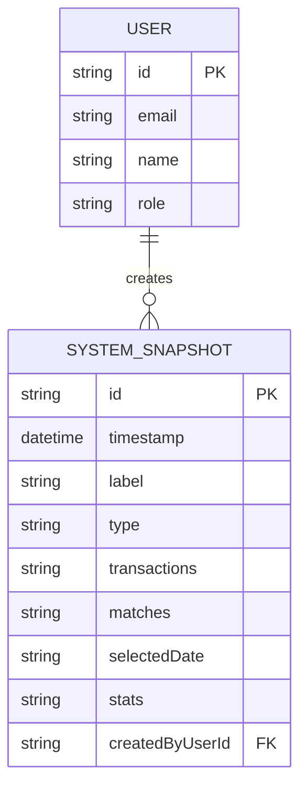
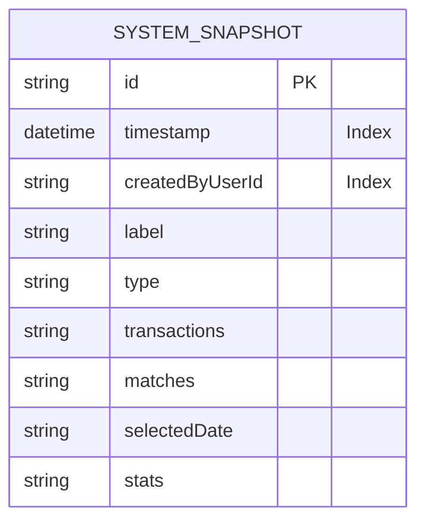
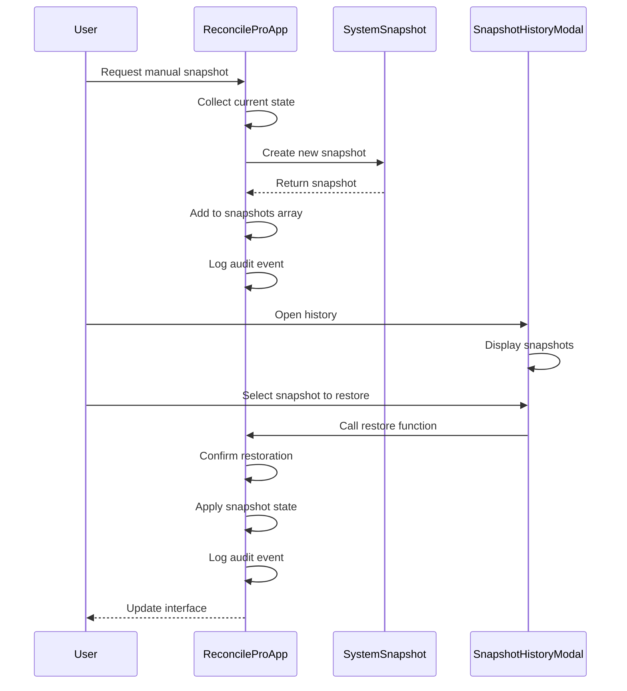

# SystemSnapshot Model

<cite>
**Referenced Files in This Document**   
- [schema.prisma](file://prisma/schema.prisma#L198-L220)
- [SnapshotHistoryModal.tsx](file://components/SnapshotHistoryModal.tsx)
- [ReconcileProApp.tsx](file://components/ReconcileProApp.tsx#L666-L699)
- [types.ts](file://lib/types.ts#L97-L111)
</cite>

## Table of Contents
1. [Introduction](#introduction)
2. [Core Fields](#core-fields)
3. [Snapshot Types](#snapshot-types)
4. [Data Structure](#data-structure)
5. [Relationships](#relationships)
6. [Indexes and Query Performance](#indexes-and-query-performance)
7. [Snapshot Creation and Restoration](#snapshot-creation-and-restoration)
8. [Common Queries](#common-queries)

## Introduction
The SystemSnapshot entity in the analyzer-web application provides a versioning mechanism for capturing the state of financial transactions and matches at specific points in time. This model enables users to create checkpoints of their reconciliation work, facilitating recovery from errors, auditing of changes, and comparison of different reconciliation states. Snapshots are integral to the application's data integrity and user experience, allowing analysts to experiment with different matching strategies while maintaining the ability to revert to previous states.

**Section sources**
- [schema.prisma](file://prisma/schema.prisma#L198-L220)

## Core Fields
The SystemSnapshot model contains several key fields that define its functionality and metadata:

- **id**: Unique identifier for the snapshot, generated using cuid() for collision resistance
- **timestamp**: DateTime field that records when the snapshot was created, automatically set to the current time
- **label**: Descriptive text that helps users identify the purpose or context of the snapshot
- **type**: Categorization of the snapshot origin (IMPORT, MANUAL, or AUTO)
- **selectedDate**: Contextual date information representing the batch date or period being reconciled
- **createdByUserId**: Reference to the user who created the snapshot, enabling accountability and audit trails

These fields provide essential metadata for organizing, searching, and understanding the purpose of each snapshot within the application's versioning system.

**Section sources**
- [schema.prisma](file://prisma/schema.prisma#L199-L215)

## Snapshot Types
SystemSnapshots are categorized by their type field, which indicates the origin and purpose of the snapshot:

- **IMPORT**: Created automatically when users import transaction data from external files. These snapshots capture the initial state of transactions immediately after import, serving as a baseline for the reconciliation process.
- **MANUAL**: Created explicitly by users through the application interface when they want to save a specific state of their work. These are typically used as checkpoints before making significant changes.
- **AUTO**: Generated automatically at regular intervals or before major operations as a safety measure to prevent data loss.

The type field is crucial for user interface presentation, with different visual treatments in the SnapshotHistoryModal to help users quickly distinguish between snapshot origins.

**Section sources**
- [schema.prisma](file://prisma/schema.prisma#L202)
- [SnapshotHistoryModal.tsx](file://components/SnapshotHistoryModal.tsx#L63-L75)

## Data Structure
The SystemSnapshot model stores comprehensive state information through several JSON fields that capture the application's current condition:



**Diagram sources**
- [schema.prisma](file://prisma/schema.prisma#L198-L220)

The data structure includes:

- **transactions**: JSON representation of all transaction records at the time of snapshot creation, preserving their current state including matching status, amounts, descriptions, and metadata
- **matches**: JSON array containing all established match groups, including the transactions they contain, calculated totals, differences, and approval status
- **stats**: JSON object with summary statistics including totalTransactions, totalMatches, and matchedValue, enabling quick comparison between snapshots without loading full data

This structure allows for efficient storage and retrieval of complete application states while maintaining queryable metadata fields.

**Section sources**
- [schema.prisma](file://prisma/schema.prisma#L204-L212)
- [types.ts](file://lib/types.ts#L102-L110)

## Relationships
The SystemSnapshot model establishes a many-to-one relationship with the User model through the createdByUserId field:



**Diagram sources**
- [schema.prisma](file://prisma/schema.prisma#L215-L216)
- [schema.prisma](file://prisma/schema.prisma#L18-L48)

This relationship enables several important features:
- User attribution: Each snapshot is linked to the user who created it, supporting accountability and audit requirements
- Personalized history: Users can filter snapshots by creator, making it easier to find their own work or review colleagues' progress
- Permission management: The relationship supports access control, potentially restricting snapshot restoration to creators or administrators

The foreign key constraint ensures referential integrity, preventing orphaned snapshots in the database.

**Section sources**
- [schema.prisma](file://prisma/schema.prisma#L215-L216)

## Indexes and Query Performance
To ensure optimal query performance, the SystemSnapshot model includes database indexes on key fields:



**Diagram sources**
- [schema.prisma](file://prisma/schema.prisma#L218-L219)

The model features two critical indexes:
- **timestamp index**: Enables efficient chronological sorting and date-range queries, allowing users to quickly find snapshots from specific time periods
- **createdByUserId index**: Optimizes queries that filter snapshots by creator, improving performance when users want to view their own snapshots or filter by specific team members

These indexes are essential for maintaining responsive performance as the number of snapshots grows, particularly in the SnapshotHistoryModal where users frequently sort and filter snapshots.

**Section sources**
- [schema.prisma](file://prisma/schema.prisma#L218-L219)

## Snapshot Creation and Restoration
Snapshots are created and managed through the application's frontend components, primarily in the ReconcileProApp and displayed in the SnapshotHistoryModal:



**Diagram sources**
- [ReconcileProApp.tsx](file://components/ReconcileProApp.tsx#L666-L699)
- [SnapshotHistoryModal.tsx](file://components/SnapshotHistoryModal.tsx)

The process involves:
- **Creation**: When a user creates a snapshot (manually or via import), the current state of transactions, matches, and metadata is captured and stored as a new SystemSnapshot record
- **Display**: The SnapshotHistoryModal presents all available snapshots in reverse chronological order, with visual indicators for type and summary statistics
- **Restoration**: Users can restore any snapshot, which updates the current application state to match the saved snapshot, effectively reverting all changes made since that point

The restoration process includes a confirmation dialog to prevent accidental data loss and automatically creates a checkpoint of the current state before applying the restoration.

**Section sources**
- [ReconcileProApp.tsx](file://components/ReconcileProApp.tsx#L666-L699)
- [SnapshotHistoryModal.tsx](file://components/SnapshotHistoryModal.tsx)

## Common Queries
The SystemSnapshot model supports several common query patterns that are essential for user workflows:

**Retrieve the latest snapshot:**
```sql
SELECT * FROM SystemSnapshot 
ORDER BY timestamp DESC 
LIMIT 1;
```

**Find all snapshots created by a specific user:**
```sql
SELECT * FROM SystemSnapshot 
WHERE createdByUserId = 'user-123' 
ORDER BY timestamp DESC;
```

**Get all import-type snapshots within a date range:**
```sql
SELECT * FROM SystemSnapshot 
WHERE type = 'IMPORT' 
AND timestamp BETWEEN '2025-01-01' AND '2025-01-31'
ORDER BY timestamp DESC;
```

**Find the most recent snapshot for a specific date:**
```sql
SELECT * FROM SystemSnapshot 
WHERE selectedDate = '2025-01-15'
ORDER BY timestamp DESC 
LIMIT 1;
```

These queries leverage the indexed fields (timestamp and createdByUserId) for optimal performance and support the core functionality of the SnapshotHistoryModal and related components.

**Section sources**
- [schema.prisma](file://prisma/schema.prisma#L200-L219)