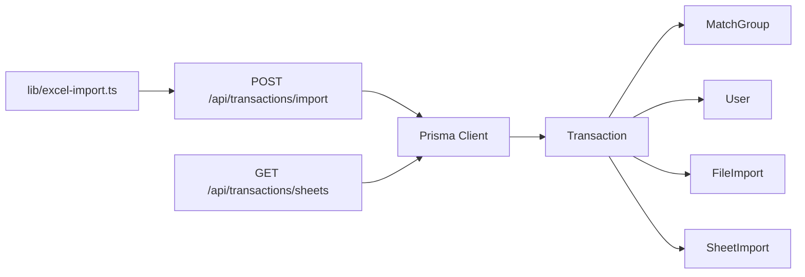

# Transaction Model

<cite>
**Referenced Files in This Document**
- [schema.prisma](file://prisma/schema.prisma)
- [TransactionService.ts](file://services/TransactionService.ts)
- [excel-import.ts](file://lib/excel-import.ts)
- [route.ts](file://app/api/transactions/import/route.ts)
- [route.ts](file://app/api/transactions/sheets/route.ts)
- [migration.sql](file://prisma/migrations/20251204152414_add_excel_columns/migration.sql)
- [DATABASE_PERSISTENCE.md](file://docs/DATABASE_PERSISTENCE.md)
- [TRANSACTION_IMPORT_GUIDE.md](file://docs/TRANSACTION_IMPORT_GUIDE.md)
</cite>

## Table of Contents
1. [Introduction](#introduction)
2. [Project Structure](#project-structure)
3. [Core Components](#core-components)
4. [Architecture Overview](#architecture-overview)
5. [Detailed Component Analysis](#detailed-component-analysis)
6. [Dependency Analysis](#dependency-analysis)
7. [Performance Considerations](#performance-considerations)
8. [Troubleshooting Guide](#troubleshooting-guide)
9. [Conclusion](#conclusion)

## Introduction
This document provides comprehensive data model documentation for the Transaction entity in the analyzer-web application. It explains all fields (seven Excel columns, legacy compatibility fields, relationship fields, and metadata), how transactions are categorized by type and assigned to sides for dual-pane display, and the foreign key relationships with MatchGroup, User, FileImport, and SheetImport. It also documents indexes for query performance and references the transaction import process described in DATABASE_PERSISTENCE.md and TRANSACTION_IMPORT_GUIDE.md, including examples of common queries.

## Project Structure
The Transaction model is defined in the Prisma schema and is supported by:
- Import pipeline: API routes and Excel parsing utilities
- Service layer: TransactionService for database operations
- Documentation: DATABASE_PERSISTENCE.md and TRANSACTION_IMPORT_GUIDE.md describe import behavior and retrieval APIs

**Diagram sources**
- [schema.prisma](file://prisma/schema.prisma#L59-L107)
- [route.ts](file://app/api/transactions/import/route.ts#L1-L264)
- [route.ts](file://app/api/transactions/sheets/route.ts#L1-L166)
- [excel-import.ts](file://lib/excel-import.ts#L1-L327)
- [TransactionService.ts](file://services/TransactionService.ts#L1-L2)

**Section sources**
- [schema.prisma](file://prisma/schema.prisma#L59-L107)
- [route.ts](file://app/api/transactions/import/route.ts#L1-L264)
- [route.ts](file://app/api/transactions/sheets/route.ts#L1-L166)
- [excel-import.ts](file://lib/excel-import.ts#L1-L327)
- [TransactionService.ts](file://services/TransactionService.ts#L1-L2)

## Core Components
- Transaction model fields:
  - Seven Excel columns: serial number, date, description, amount, GL reference number, aging, reconciliation type
  - Legacy compatibility fields: reference, side, status, type
  - Relationship fields: matchId, importedById, fileImportId, sheetImportId
  - Metadata fields: isDeleted, archivedAt, contentHash
- Categorization and sides:
  - Types: int cr, int dr, ext cr, ext dr
  - Sides: LEFT for internal (GL) transactions, RIGHT for external (statement) transactions
- Foreign keys:
  - MatchGroup: matchId
  - User: importedById
  - FileImport: fileImportId
  - SheetImport: sheetImportId
- Indexes:
  - Composite and single-column indexes on date, side, status, contentHash, fileImportId, sheetImportId

**Section sources**
- [schema.prisma](file://prisma/schema.prisma#L59-L107)

## Architecture Overview
The Transaction entity participates in a multi-model architecture:
- FileImport and SheetImport capture import metadata and per-sheet counts
- Transaction stores parsed transaction rows and links to import context
- MatchGroup holds reconciliation groupings and references Transaction ids
- User tracks who imported data

**Diagram sources**
- [schema.prisma](file://prisma/schema.prisma#L59-L107)
- [schema.prisma](file://prisma/schema.prisma#L113-L152)
- [schema.prisma](file://prisma/schema.prisma#L300-L374)

## Detailed Component Analysis

### Transaction Fields and Semantics
- Seven Excel columns:
  - sn: serial number
  - date: transaction date (YYYY-MM-DD)
  - description: narrative
  - amount: numeric value
  - glRefNo: GL reference number
  - aging: days outstanding
  - recon: reconciliation category (INT CR, INT DR, EXT CR, EXT DR)
- Legacy compatibility fields:
  - reference: maps to glRefNo or fallback
  - side: LEFT or RIGHT
  - status: UNMATCHED, MATCHED, DISPUTED, ARCHIVED
  - type: lowercase version of recon (int cr, int dr, ext cr, ext dr)
- Relationship fields:
  - matchId: links to MatchGroup
  - importedById: links to User
  - fileImportId: links to FileImport
  - sheetImportId: links to SheetImport
- Metadata fields:
  - isDeleted: soft-delete flag
  - archivedAt: archival timestamp
  - contentHash: SHA-256 of normalized transaction content for deduplication

**Section sources**
- [schema.prisma](file://prisma/schema.prisma#L59-L107)

### Transaction Categorization and Sides
- Categorization by type is derived from the RECON column during import:
  - INT CR → type "int cr"
  - INT DR → type "int dr"
  - EXT CR → type "ext cr"
  - EXT DR → type "ext dr"
- Sides for dual-pane display:
  - Internal (GL) transactions are assigned side "LEFT"
  - External (statement) transactions are assigned side "RIGHT"
- The import pipeline parses Excel sheets, validates required columns, and assigns type and side accordingly.

**Diagram sources**
- [excel-import.ts](file://lib/excel-import.ts#L112-L254)
- [route.ts](file://app/api/transactions/import/route.ts#L188-L226)

**Section sources**
- [excel-import.ts](file://lib/excel-import.ts#L112-L254)
- [route.ts](file://app/api/transactions/import/route.ts#L188-L226)

### Foreign Key Relationships
- MatchGroup:
  - Transaction.matchId references MatchGroup.id
- User:
  - Transaction.importedById references User.id
- FileImport:
  - Transaction.fileImportId references FileImport.id
- SheetImport:
  - Transaction.sheetImportId references SheetImport.id

These relationships enable:
- Tracking who imported transactions
- Grouping matched transactions
- Linking transactions to their import source and sheet

**Section sources**
- [schema.prisma](file://prisma/schema.prisma#L59-L107)
- [schema.prisma](file://prisma/schema.prisma#L113-L152)
- [schema.prisma](file://prisma/schema.prisma#L300-L374)

### Indexes for Query Performance
Indexes defined on Transaction:
- Composite index on date, side, status
- Index on matchId
- Index on status
- Index on contentHash
- Index on fileImportId
- Index on sheetImportId

These indexes optimize:
- Filtering by date range and side
- Searching by status
- Deduplication via contentHash
- Joining by import context (fileImportId, sheetImportId)

**Section sources**
- [schema.prisma](file://prisma/schema.prisma#L101-L106)

### Import Process and Data Persistence
- The import API:
  - Validates authentication and file type
  - Generates file hash for duplicate detection
  - Parses Excel sheets, filters by presence of "dept" in A1:D10
  - Creates FileImport and SheetImport records
  - Assigns side and type, then persists transactions in batches
- Retrieval API:
  - Lists imports, sheets, and returns categorized transactions by type

**Diagram sources**
- [route.ts](file://app/api/transactions/import/route.ts#L1-L264)
- [excel-import.ts](file://lib/excel-import.ts#L257-L327)

**Section sources**
- [route.ts](file://app/api/transactions/import/route.ts#L1-L264)
- [excel-import.ts](file://lib/excel-import.ts#L257-L327)
- [DATABASE_PERSISTENCE.md](file://docs/DATABASE_PERSISTENCE.md#L1-L120)

### Retrieval and Common Queries
- Retrieve transactions by type:
  - Filter by sheetImportId and type (e.g., "int cr", "int dr", "ext cr", "ext dr")
  - Exclude deleted transactions (isDeleted=false)
- Retrieve transactions by date range:
  - Filter by date between start and end
  - Optionally restrict by side ("LEFT" or "RIGHT")
- Retrieve transactions by import source:
  - Filter by fileImportId or sheetImportId
- Retrieve by status:
  - Filter by status (e.g., "UNMATCHED", "MATCHED")

Examples of query patterns are documented in the persistence guide and implemented in the service layer.

**Section sources**
- [DATABASE_PERSISTENCE.md](file://docs/DATABASE_PERSISTENCE.md#L421-L457)
- [TransactionService.ts](file://services/TransactionService.ts#L1-L2)

## Dependency Analysis
- Transaction depends on:
  - MatchGroup via matchId
  - User via importedById
  - FileImport via fileImportId
  - SheetImport via sheetImportId
- Import pipeline depends on:
  - Excel parsing utilities for column detection and categorization
  - Prisma client for persistence
- Retrieval API depends on:
  - Prisma client for querying and categorizing transactions

**Diagram sources**
- [excel-import.ts](file://lib/excel-import.ts#L1-L327)
- [route.ts](file://app/api/transactions/import/route.ts#L1-L264)
- [route.ts](file://app/api/transactions/sheets/route.ts#L1-L166)
- [schema.prisma](file://prisma/schema.prisma#L59-L107)

**Section sources**
- [schema.prisma](file://prisma/schema.prisma#L59-L107)
- [route.ts](file://app/api/transactions/import/route.ts#L1-L264)
- [route.ts](file://app/api/transactions/sheets/route.ts#L1-L166)
- [excel-import.ts](file://lib/excel-import.ts#L1-L327)

## Performance Considerations
- Use indexes for frequent filters:
  - date, side, status composite index for dual-pane queries
  - status index for state-based filtering
  - contentHash index for deduplication
  - fileImportId and sheetImportId indexes for import-scoped queries
- Batch inserts during import reduce round-trips
- Deduplicate by contentHash to avoid redundant writes
- Prefer filtering by side and status to leverage composite index

[No sources needed since this section provides general guidance]

## Troubleshooting Guide
- Missing required columns:
  - Ensure SN, DATE, DESCRIPTION, and RECON columns exist in the transaction table
- Incorrect categorization:
  - RECON values must be INT CR, INT DR, EXT CR, or EXT DR
- Side mismatch:
  - Internal (GL) transactions must be assigned side "LEFT"
  - External (statement) transactions must be assigned side "RIGHT"
- Duplicate detection:
  - If a file with the same hash or filename was previously imported, the API may prompt to override or skip
- Retrieval issues:
  - Use sheetImportId to scope queries to a specific sheet
  - Use status and side filters to narrow results

**Section sources**
- [excel-import.ts](file://lib/excel-import.ts#L112-L254)
- [route.ts](file://app/api/transactions/import/route.ts#L47-L100)
- [DATABASE_PERSISTENCE.md](file://docs/DATABASE_PERSISTENCE.md#L220-L247)

## Conclusion
The Transaction model captures both the seven Excel columns and legacy compatibility fields, supports categorization by type and assignment to sides for dual-pane display, and maintains robust foreign key relationships with MatchGroup, User, FileImport, and SheetImport. The import pipeline and retrieval APIs are designed around these relationships and indexes to ensure efficient persistence and querying. The provided examples and service-layer methods demonstrate practical patterns for filtering and managing transactions.