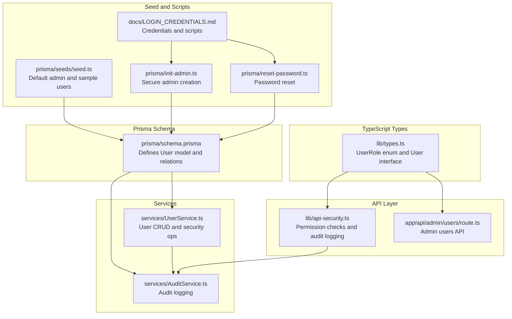
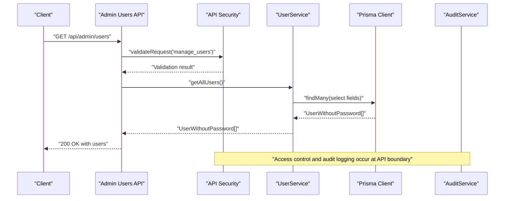
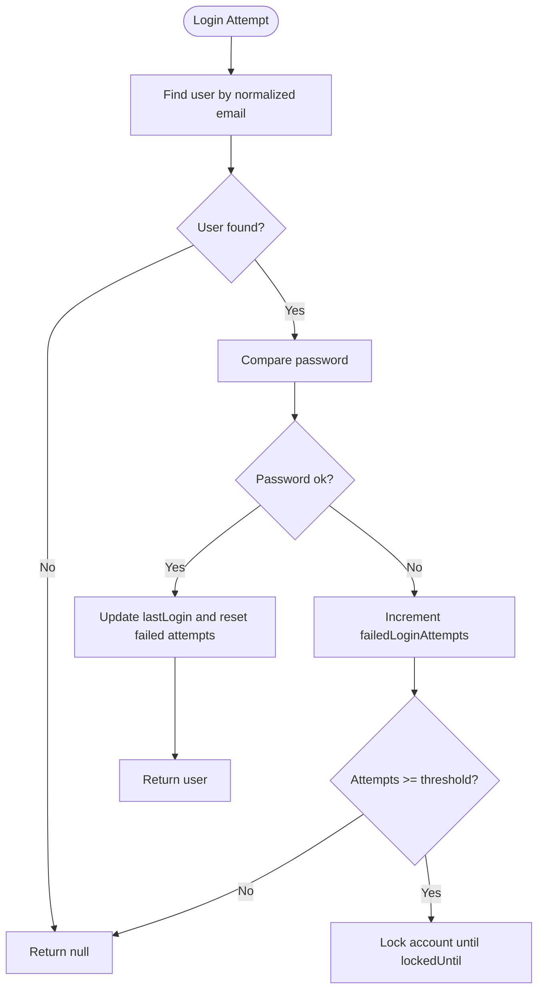
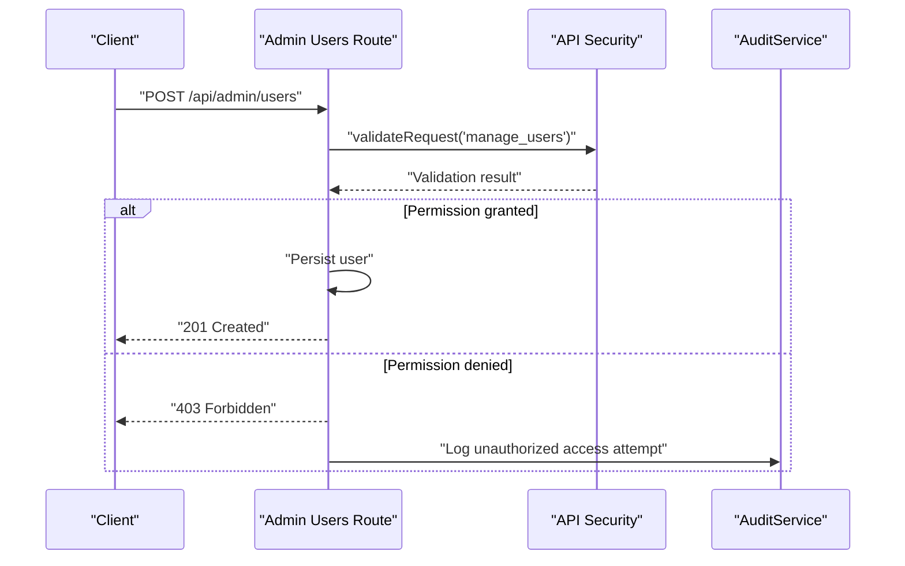
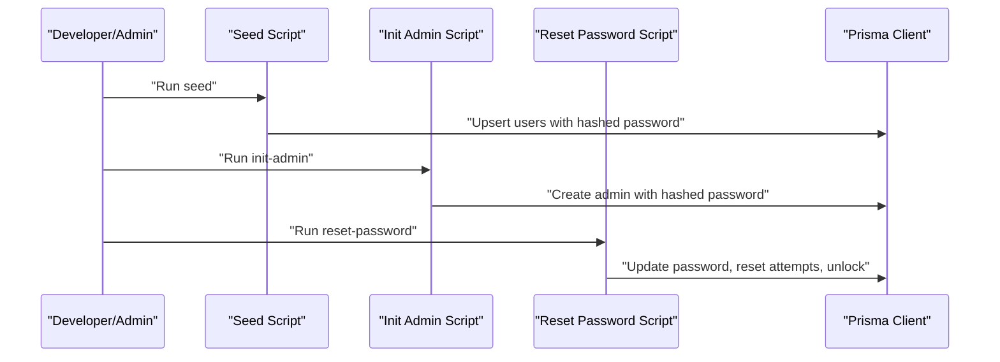
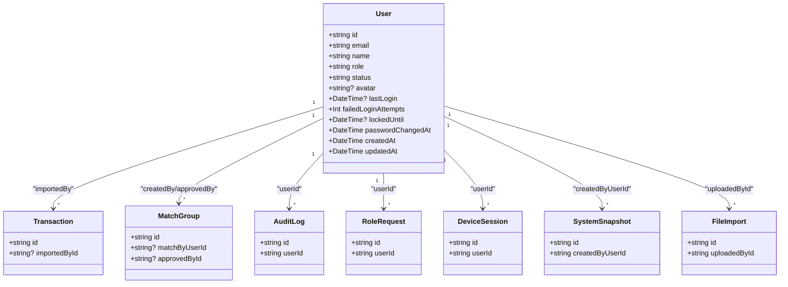

# User Model

<cite>
**Referenced Files in This Document**
- [schema.prisma](file://prisma/schema.prisma)
- [types.ts](file://lib/types.ts)
- [UserService.ts](file://services/UserService.ts)
- [seed.ts](file://prisma/seeds/seed.ts)
- [LOGIN_CREDENTIALS.md](file://docs/LOGIN_CREDENTIALS.md)
- [init-admin.ts](file://prisma/init-admin.ts)
- [reset-password.ts](file://prisma/reset-password.ts)
- [audit-service.ts](file://services/AuditService.ts)
- [api-security.ts](file://lib/api-security.ts)
- [constants.ts](file://lib/constants.ts)
- [route.ts](file://app/api/admin/users/route.ts)
</cite>

## Table of Contents
1. [Introduction](#introduction)
2. [Project Structure](#project-structure)
3. [Core Components](#core-components)
4. [Architecture Overview](#architecture-overview)
5. [Detailed Component Analysis](#detailed-component-analysis)
6. [Dependency Analysis](#dependency-analysis)
7. [Performance Considerations](#performance-considerations)
8. [Troubleshooting Guide](#troubleshooting-guide)
9. [Conclusion](#conclusion)

## Introduction
This document provides comprehensive data model documentation for the User entity in the analyzer-web application. It covers all fields, relationships, indexes, and constraints defined in the Prisma schema, and explains how the database representation maps to the TypeScript interface. It also documents the soft-delete-like status pattern, security tracking fields, and how user data is used for access control and audit logging. Finally, it outlines default admin creation and password management workflows referenced in the repository.

## Project Structure
The User model is defined in the Prisma schema and surfaced to the application via TypeScript types and service-layer operations. The following diagram shows the primary files involved in the User model lifecycle and usage.

**Diagram sources**
- [schema.prisma](file://prisma/schema.prisma#L18-L53)
- [types.ts](file://lib/types.ts#L11-L39)
- [UserService.ts](file://services/UserService.ts#L1-L213)
- [audit-service.ts](file://services/AuditService.ts#L1-L264)
- [api-security.ts](file://lib/api-security.ts#L84-L178)
- [route.ts](file://app/api/admin/users/route.ts#L1-L41)
- [seed.ts](file://prisma/seeds/seed.ts#L1-L130)
- [init-admin.ts](file://prisma/init-admin.ts#L200-L273)
- [reset-password.ts](file://prisma/reset-password.ts#L62-L117)
- [LOGIN_CREDENTIALS.md](file://docs/LOGIN_CREDENTIALS.md#L1-L113)

**Section sources**
- [schema.prisma](file://prisma/schema.prisma#L18-L53)
- [types.ts](file://lib/types.ts#L11-L39)
- [UserService.ts](file://services/UserService.ts#L1-L213)
- [audit-service.ts](file://services/AuditService.ts#L1-L264)
- [api-security.ts](file://lib/api-security.ts#L84-L178)
- [route.ts](file://app/api/admin/users/route.ts#L1-L41)
- [seed.ts](file://prisma/seeds/seed.ts#L1-L130)
- [init-admin.ts](file://prisma/init-admin.ts#L200-L273)
- [reset-password.ts](file://prisma/reset-password.ts#L62-L117)
- [LOGIN_CREDENTIALS.md](file://docs/LOGIN_CREDENTIALS.md#L1-L113)

## Core Components
- User model fields and constraints:
  - Identity: id, email, name, avatar
  - Authentication: password, mfaEnabled, mfaSecret
  - Authorization: role, status
  - Security tracking: lastLogin, failedLoginAttempts, lockedUntil, passwordChangedAt
  - Timestamps: createdAt, updatedAt
  - Unique constraint: email
  - Indexes: email, role
- TypeScript mapping:
  - role is represented as UserRole enum in TypeScript
  - status is typed as a union of active/inactive/locked
  - lastLogin and failedLoginAttempts are typed as numbers in TypeScript
- One-to-many relationships:
  - importedTransactions (Transaction)
  - createdMatches (MatchGroup)
  - approvedMatches (MatchGroup)
  - auditLogs (AuditLog)
  - roleRequests (RoleRequest)
  - deviceSessions (DeviceSession)
  - snapshots (SystemSnapshot)
  - fileImports (FileImport)
- Soft-delete pattern:
  - The User model does not include an isDeleted flag; instead, status acts as a soft-like indicator with values active, inactive, locked. Locked accounts are enforced by lockout logic and can be unlocked via scripts.

**Section sources**
- [schema.prisma](file://prisma/schema.prisma#L18-L53)
- [types.ts](file://lib/types.ts#L11-L39)
- [UserService.ts](file://services/UserService.ts#L147-L196)

## Architecture Overview
The User model integrates with the service layer for persistence and security operations, with the API layer enforcing permissions and logging actions. Audit logging is used for compliance and security monitoring.

**Diagram sources**
- [route.ts](file://app/api/admin/users/route.ts#L1-L41)
- [api-security.ts](file://lib/api-security.ts#L84-L178)
- [UserService.ts](file://services/UserService.ts#L81-L107)
- [audit-service.ts](file://services/AuditService.ts#L1-L264)

## Detailed Component Analysis

### Prisma Schema: User Model
- Fields and defaults:
  - id: cuid() primary key
  - email: unique
  - name: string
  - password: string
  - role: string default "ANALYST"
  - status: string default "active"
  - avatar: string?
  - mfaEnabled: boolean default false
  - mfaSecret: string?
  - lastLogin: DateTime?
  - failedLoginAttempts: Int default 0
  - lockedUntil: DateTime?
  - passwordChangedAt: DateTime default now()
  - createdAt: DateTime default now()
  - updatedAt: DateTime default now()
- Relationships:
  - importedTransactions: Transaction[] (relation "ImportedBy")
  - createdMatches: MatchGroup[] (relation "CreatedBy")
  - approvedMatches: MatchGroup[] (relation "ApprovedBy")
  - auditLogs: AuditLog[]
  - roleRequests: RoleRequest[]
  - deviceSessions: DeviceSession[]
  - snapshots: SystemSnapshot[]
  - fileImports: FileImport[]
- Indexes and constraints:
  - @@index([email])
  - @@index([role])
  - @unique on email

**Section sources**
- [schema.prisma](file://prisma/schema.prisma#L18-L53)

### TypeScript Interface and Enum Mapping
- UserRole enum defines ADMIN, MANAGER, ANALYST, AUDITOR
- User interface in lib/types.ts:
  - role: UserRole (enum)
  - status: "active" | "inactive" | "locked"
  - lastLogin: number (milliseconds)
  - failedLoginAttempts: number
- Mapping note:
  - Prisma stores role as String; TypeScript uses UserRole enum for type safety and runtime checks

**Section sources**
- [types.ts](file://lib/types.ts#L11-L39)
- [schema.prisma](file://prisma/schema.prisma#L23-L24)

### Service Layer: User Operations
- Persistence and security:
  - createUser: hashes password, normalizes email to lowercase, sets defaults for role/status/avatar
  - findUserByEmail/findUserById: lookups with email normalization
  - getAllUsers: returns UserWithoutPassword with selected fields
  - updateUser/deleteUser: updates/deletes by id
  - verifyPassword: compares plaintext against stored hash
  - updateLastLogin: resets failed attempts and sets lastLogin
  - incrementFailedLogins: increments failed attempts
  - lockUser: sets status to locked and lockedUntil
- Security tracking:
  - lastLogin, failedLoginAttempts, lockedUntil, passwordChangedAt are managed by the service

**Diagram sources**
- [UserService.ts](file://services/UserService.ts#L55-L107)
- [UserService.ts](file://services/UserService.ts#L136-L196)
- [constants.ts](file://lib/constants.ts#L8-L11)

**Section sources**
- [UserService.ts](file://services/UserService.ts#L1-L213)
- [constants.ts](file://lib/constants.ts#L8-L11)

### API Layer: Access Control and Audit Logging
- Admin users endpoint enforces permission manage_users
- API security validates roles and permissions, and logs unauthorized attempts
- AuditService creates entries for login/logout and other actions

**Diagram sources**
- [route.ts](file://app/api/admin/users/route.ts#L1-L41)
- [api-security.ts](file://lib/api-security.ts#L84-L178)
- [audit-service.ts](file://services/AuditService.ts#L1-L264)

**Section sources**
- [route.ts](file://app/api/admin/users/route.ts#L1-L41)
- [api-security.ts](file://lib/api-security.ts#L84-L178)
- [audit-service.ts](file://services/AuditService.ts#L1-L264)

### Default Admin Creation and Password Management
- Default seed users:
  - Admin, Manager, Analyst created with hashed password and default status
- Production admin creation:
  - init-admin script enforces strong password requirements and prevents duplicates
- Password reset:
  - reset-password script hashes new password, resets failed attempts, unlocks account, and clears lockedUntil

**Diagram sources**
- [seed.ts](file://prisma/seeds/seed.ts#L1-L130)
- [init-admin.ts](file://prisma/init-admin.ts#L200-L273)
- [reset-password.ts](file://prisma/reset-password.ts#L62-L117)

**Section sources**
- [seed.ts](file://prisma/seeds/seed.ts#L1-L130)
- [init-admin.ts](file://prisma/init-admin.ts#L200-L273)
- [reset-password.ts](file://prisma/reset-password.ts#L62-L117)
- [LOGIN_CREDENTIALS.md](file://docs/LOGIN_CREDENTIALS.md#L1-L113)

### Usage Across the Application
- Access control:
  - DEFAULT_ROLE_PERMISSIONS maps UserRole to Permission[] used by API security checks
- Audit logging:
  - AuditService records user actions with sessionId, IP, device fingerprint, and chain verification
- Frontend:
  - AdminDashboard displays users, roles, and statuses; interacts with admin users API

**Section sources**
- [constants.ts](file://lib/constants.ts#L24-L50)
- [api-security.ts](file://lib/api-security.ts#L84-L178)
- [audit-service.ts](file://services/AuditService.ts#L1-L264)

## Dependency Analysis
The User model participates in several relationships and is consumed by services and API routes.

**Diagram sources**
- [schema.prisma](file://prisma/schema.prisma#L18-L53)
- [schema.prisma](file://prisma/schema.prisma#L59-L107)
- [schema.prisma](file://prisma/schema.prisma#L113-L151)
- [schema.prisma](file://prisma/schema.prisma#L158-L192)
- [schema.prisma](file://prisma/schema.prisma#L226-L243)
- [schema.prisma](file://prisma/schema.prisma#L249-L271)
- [schema.prisma](file://prisma/schema.prisma#L198-L220)
- [schema.prisma](file://prisma/schema.prisma#L300-L336)

**Section sources**
- [schema.prisma](file://prisma/schema.prisma#L18-L53)

## Performance Considerations
- Indexes:
  - email and role are indexed to speed up lookups and filtering
- Queries:
  - Prefer selective field retrieval (as done in getAllUsers) to minimize payload size
- Security tracking:
  - Keep failedLoginAttempts and lockedUntil updated efficiently; consider batch updates for bulk operations
- Audit logging:
  - Chain verification adds computational overhead; use judiciously in production

[No sources needed since this section provides general guidance]

## Troubleshooting Guide
- Login failures:
  - Check failedLoginAttempts and lockedUntil; use reset-password to unlock
- Missing permissions:
  - Verify role and DEFAULT_ROLE_PERMISSIONS mapping
- Audit trail issues:
  - Use AuditService methods to verify chain integrity and retrieve entity audit trails

**Section sources**
- [UserService.ts](file://services/UserService.ts#L147-L196)
- [reset-password.ts](file://prisma/reset-password.ts#L62-L117)
- [audit-service.ts](file://services/AuditService.ts#L152-L203)

## Conclusion
The User model in analyzer-web is designed with clear separation of concerns: Prisma schema defines the database structure and relationships, TypeScript types enforce type safety for role and status, and the service layer encapsulates persistence and security operations. The API layer enforces permissions and logs actions for compliance. Default admin creation and password management scripts streamline secure provisioning and remediation. Together, these components provide a robust foundation for identity, access control, and auditability.