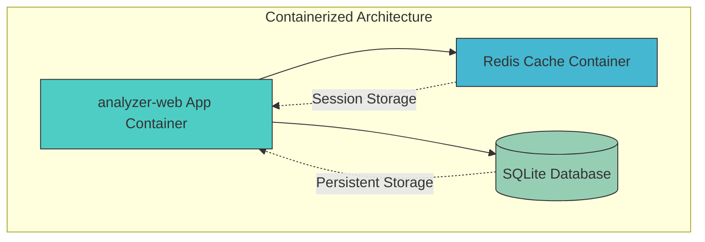
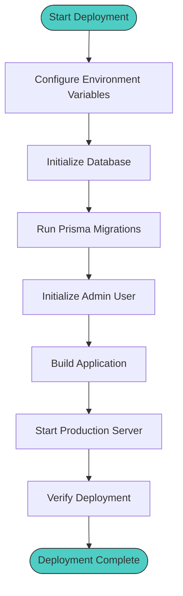
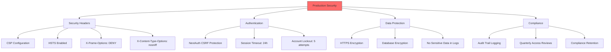
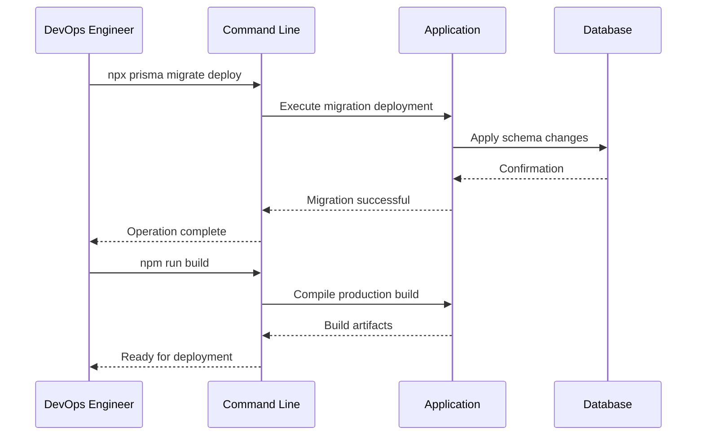
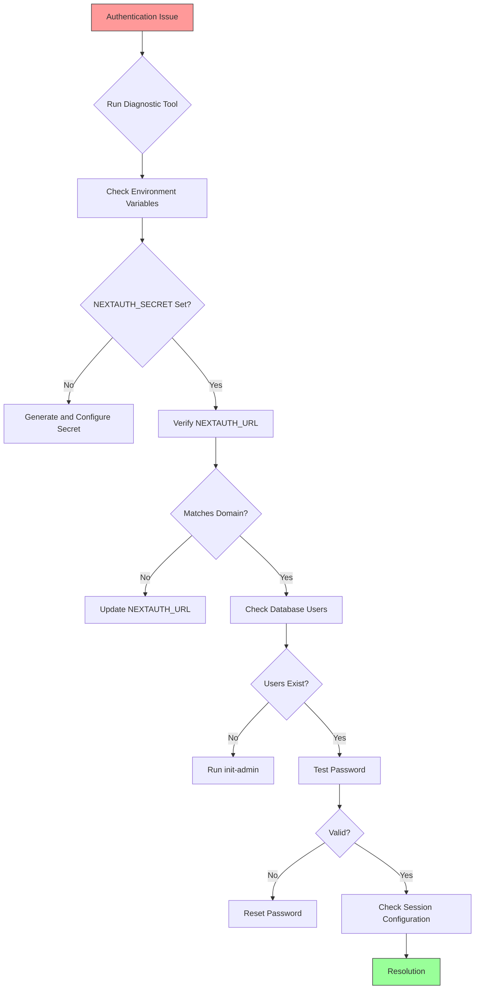
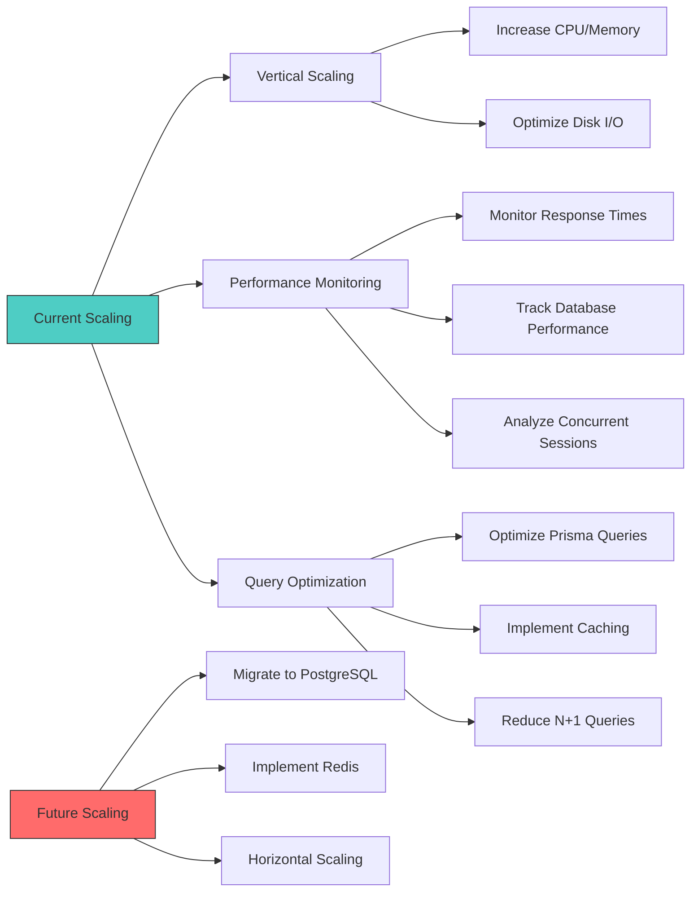
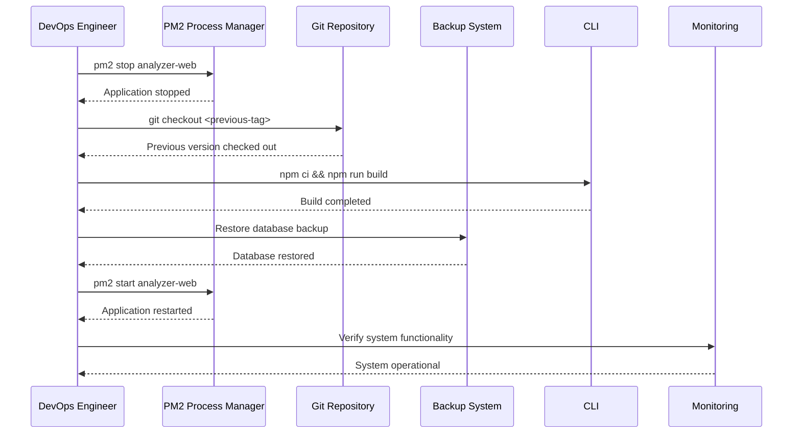
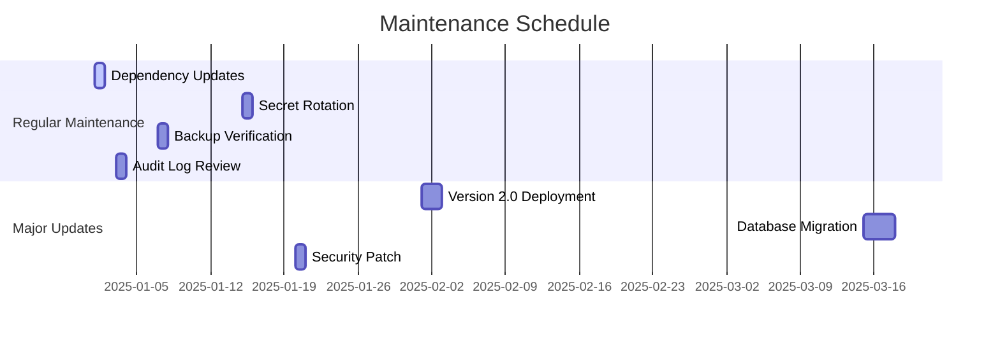

# Deployment and Operations

<cite>
**Referenced Files in This Document**   
- [Dockerfile.dev](file://Dockerfile.dev)
- [docker-compose.yml](file://docker-compose.yml)
- [PRODUCTION_DEPLOYMENT_CHECKLIST.md](file://docs/PRODUCTION_DEPLOYMENT_CHECKLIST.md)
- [PRODUCTION_TROUBLESHOOTING.md](file://docs/PRODUCTION_TROUBLESHOOTING.md)
- [prisma/schema.prisma](file://prisma/schema.prisma)
- [lib/env-validation.ts](file://lib/env-validation.ts)
- [middleware.ts](file://middleware.ts)
- [package.json](file://package.json)
- [prisma/init-admin.ts](file://prisma/init-admin.ts)
- [prisma/diagnose-production.ts](file://prisma/diagnose-production.ts)
- [prisma/reset-password.ts](file://prisma/reset-password.ts)
</cite>

## Table of Contents
1. [Containerized Architecture](#containerized-architecture)
2. [Step-by-Step Deployment Instructions](#step-by-step-deployment-instructions)
3. [Production-Specific Considerations](#production-specific-considerations)
4. [Operational Tasks](#operational-tasks)
5. [Troubleshooting Guidance](#troubleshooting-guidance)
6. [Scaling Recommendations](#scaling-recommendations)
7. [Rollback Procedures and Disaster Recovery](#rollback-procedures-and-disaster-recovery)
8. [Maintenance Windows and Updates](#maintenance-windows-and-updates)

## Containerized Architecture

The analyzer-web application utilizes a containerized architecture with Docker and Docker Compose for consistent deployment across environments. The architecture consists of multiple containers orchestrated through docker-compose.yml, including the main application container and supporting services.

**Diagram sources**
- [Dockerfile.dev](file://Dockerfile.dev#L1-L21)
- [docker-compose.yml](file://docker-compose.yml#L1-L43)

**Section sources**
- [Dockerfile.dev](file://Dockerfile.dev#L1-L21)
- [docker-compose.yml](file://docker-compose.yml#L1-L43)

## Step-by-Step Deployment Instructions

Deploying the analyzer-web application requires careful configuration of environment variables, volume mounting for persistent storage, and proper network setup. The process begins with configuring environment variables as specified in the production checklist, followed by database initialization and application building.

The deployment workflow includes setting critical environment variables such as NEXTAUTH_SECRET (generated via `openssl rand -base64 32`), configuring NEXTAUTH_URL to point to the production domain with HTTPS, and ensuring DATABASE_URL references the production database path. After environment configuration, Prisma migrations must be deployed using `npx prisma migrate deploy`, followed by initializing the admin user with `npm run init-admin`.

**Diagram sources**
- [PRODUCTION_DEPLOYMENT_CHECKLIST.md](file://docs/PRODUCTION_DEPLOYMENT_CHECKLIST.md#L74-L115)
- [package.json](file://package.json#L6-L8)

**Section sources**
- [PRODUCTION_DEPLOYMENT_CHECKLIST.md](file://docs/PRODUCTION_DEPLOYMENT_CHECKLIST.md#L74-L115)
- [lib/env-validation.ts](file://lib/env-validation.ts#L26-L38)

## Production-Specific Considerations

Production deployment requires adherence to strict security and compliance standards, particularly in banking environments. The application implements multiple security layers including Content Security Policy (CSP), HTTP Strict Transport Security (HSTS), X-Frame-Options, and X-Content-Type-Options headers enforced through middleware.ts.

Security hardening includes rotating NEXTAUTH_SECRET quarterly, implementing role-based access control, and ensuring database encryption at rest. Backup strategies involve weekly backup reviews and testing restore procedures. Monitoring setup includes tracking audit logs for suspicious activity, reviewing failed login attempts, and checking database performance metrics.

**Diagram sources**
- [middleware.ts](file://middleware.ts#L8-L34)
- [PRODUCTION_DEPLOYMENT_CHECKLIST.md](file://docs/PRODUCTION_DEPLOYMENT_CHECKLIST.md#L38-L55)

**Section sources**
- [PRODUCTION_DEPLOYMENT_CHECKLIST.md](file://docs/PRODUCTION_DEPLOYMENT_CHECKLIST.md#L38-L258)
- [middleware.ts](file://middleware.ts#L8-L34)

## Operational Tasks

Operational tasks for the analyzer-web application include database migrations, log rotation, and performance monitoring. Database migrations in production are executed using `npx prisma migrate deploy`, which applies pending schema changes to the production database. This command should be run during maintenance windows to minimize impact on users.

Log rotation is managed through the application's logging framework and system-level log rotation utilities. Performance monitoring includes tracking response times under load, monitoring database query performance, and checking file upload performance for maximum allowed sizes. The application's audit logging system captures all user actions, including financial transactions, with timestamps and user identities.

**Diagram sources**
- [PRODUCTION_DEPLOYMENT_CHECKLIST.md](file://docs/PRODUCTION_DEPLOYMENT_CHECKLIST.md#L88-L94)
- [package.json](file://package.json#L7-L8)

**Section sources**
- [PRODUCTION_DEPLOYMENT_CHECKLIST.md](file://docs/PRODUCTION_DEPLOYMENT_CHECKLIST.md#L88-L105)
- [prisma/schema.prisma](file://prisma/schema.prisma#L1-L374)

## Troubleshooting Guidance

Troubleshooting guidance for the analyzer-web application addresses common issues such as authentication failures, database connection problems, and API timeout errors. The PRODUCTION_TROUBLESHOOTING.md document provides a systematic approach to diagnosing authentication issues, starting with running the diagnostic tool `npx ts-node -P tsconfig.scripts.json prisma/diagnose-production.ts`.

For authentication failures, common root causes include incorrect NEXTAUTH_SECRET configuration, mismatched NEXTAUTH_URL, uninitialized database, or password hash corruption. Database connection issues are typically resolved by verifying the DATABASE_URL path, checking file permissions, and ensuring proper database initialization. API timeout errors may require adjusting server resources or optimizing database queries.

**Diagram sources**
- [PRODUCTION_TROUBLESHOOTING.md](file://docs/PRODUCTION_TROUBLESHOOTING.md#L1-L377)
- [prisma/diagnose-production.ts](file://prisma/diagnose-production.ts#L1-L220)

**Section sources**
- [PRODUCTION_TROUBLESHOOTING.md](file://docs/PRODUCTION_TROUBLESHOOTING.md#L1-L377)
- [prisma/diagnose-production.ts](file://prisma/diagnose-production.ts#L1-L220)

## Scaling Recommendations

Scaling recommendations for the analyzer-web application focus on handling increased transaction volumes and user concurrency within the constraints of the current architecture. The application's use of SQLite presents limitations for high-concurrent write operations and horizontal scaling, as noted in the PRODUCTION_DEPLOYMENT_CHECKLIST.md.

For handling increased load, the recommended approach is vertical scaling by increasing server resources rather than horizontal scaling. If transaction volumes exceed SQLite's capabilities, migration to a client-server database like PostgreSQL is advised. Rate limiting is currently in-memory and single-instance only, requiring deployment behind a WAF/API Gateway or implementation of Redis for multi-instance deployments.

**Diagram sources**
- [PRODUCTION_DEPLOYMENT_CHECKLIST.md](file://docs/PRODUCTION_DEPLOYMENT_CHECKLIST.md#L223-L243)
- [docker-compose.yml](file://docker-compose.yml#L26-L36)

**Section sources**
- [PRODUCTION_DEPLOYMENT_CHECKLIST.md](file://docs/PRODUCTION_DEPLOYMENT_CHECKLIST.md#L223-L243)
- [docker-compose.yml](file://docker-compose.yml#L26-L36)

## Rollback Procedures and Disaster Recovery

Rollback procedures and disaster recovery plans are critical components of the analyzer-web application's production operations. The rollback procedure, documented in PRODUCTION_DEPLOYMENT_CHECKLIST.md, involves stopping the application, restoring the previous version from version control, rebuilding the application, restoring the database from backup, and restarting the service.

Disaster recovery planning includes regular backup reviews, testing restore procedures, maintaining emergency admin access procedures, and preserving audit logs for compliance periods. The application's single-instance deployment model simplifies recovery procedures but requires careful coordination during failover events.

**Diagram sources**
- [PRODUCTION_DEPLOYMENT_CHECKLIST.md](file://docs/PRODUCTION_DEPLOYMENT_CHECKLIST.md#L184-L197)
- [package.json](file://package.json#L11-L14)

**Section sources**
- [PRODUCTION_DEPLOYMENT_CHECKLIST.md](file://docs/PRODUCTION_DEPLOYMENT_CHECKLIST.md#L184-L197)
- [package.json](file://package.json#L11-L14)

## Maintenance Windows and Updates

Maintenance windows and updates for the analyzer-web application should be scheduled during periods of low usage to minimize impact on users. Regular maintenance tasks include updating dependencies monthly, rotating NEXTAUTH_SECRET quarterly, reviewing and testing backups weekly, and monitoring audit logs for suspicious activity.

The update process follows a structured approach: first testing changes in a staging environment, then deploying during a scheduled maintenance window, verifying the deployment, and monitoring the system post-update. Emergency updates may be required for security patches, following the same rollback procedures if issues arise.

**Diagram sources**
- [PRODUCTION_DEPLOYMENT_CHECKLIST.md](file://docs/PRODUCTION_DEPLOYMENT_CHECKLIST.md#L164-L172)
- [package.json](file://package.json#L10-L14)

**Section sources**
- [PRODUCTION_DEPLOYMENT_CHECKLIST.md](file://docs/PRODUCTION_DEPLOYMENT_CHECKLIST.md#L164-L172)
- [package.json](file://package.json#L10-L14)