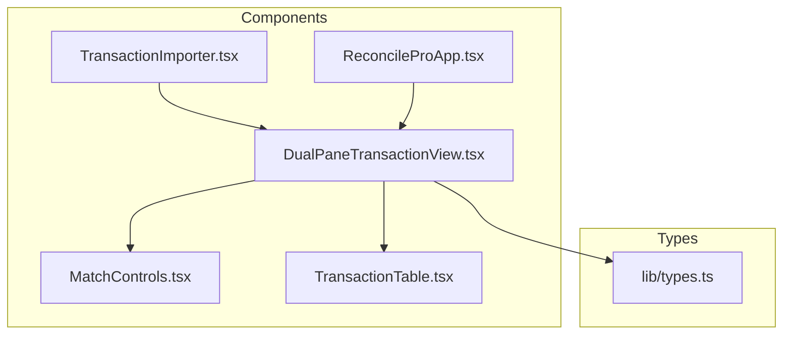
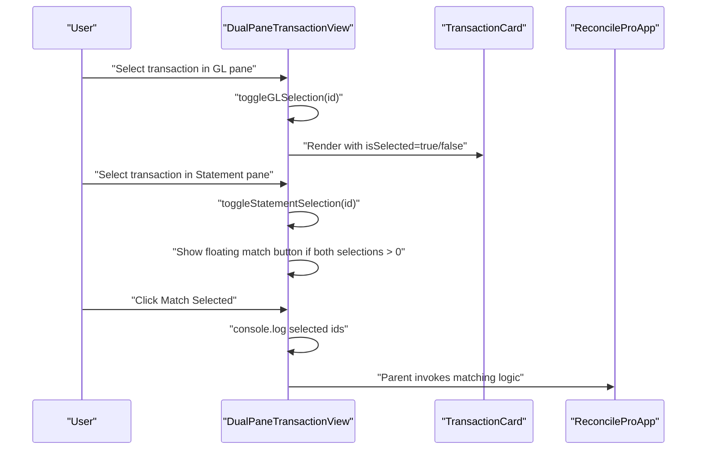
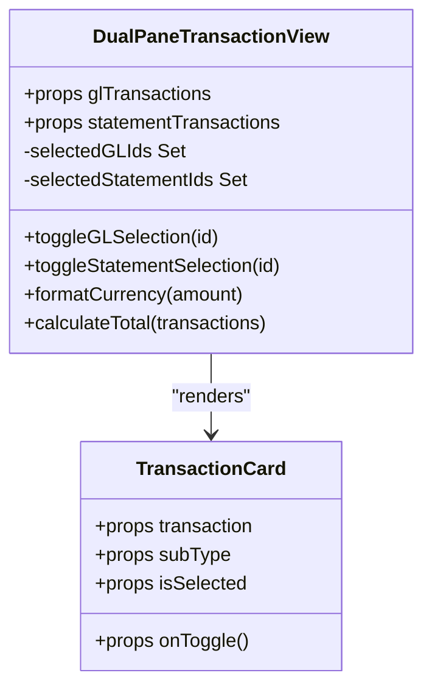
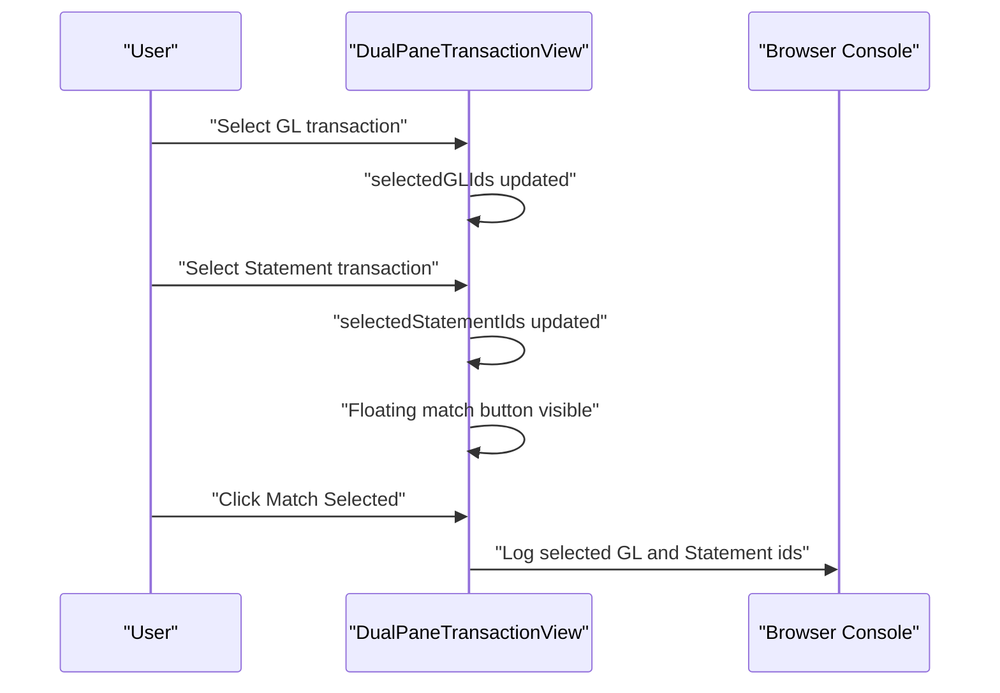
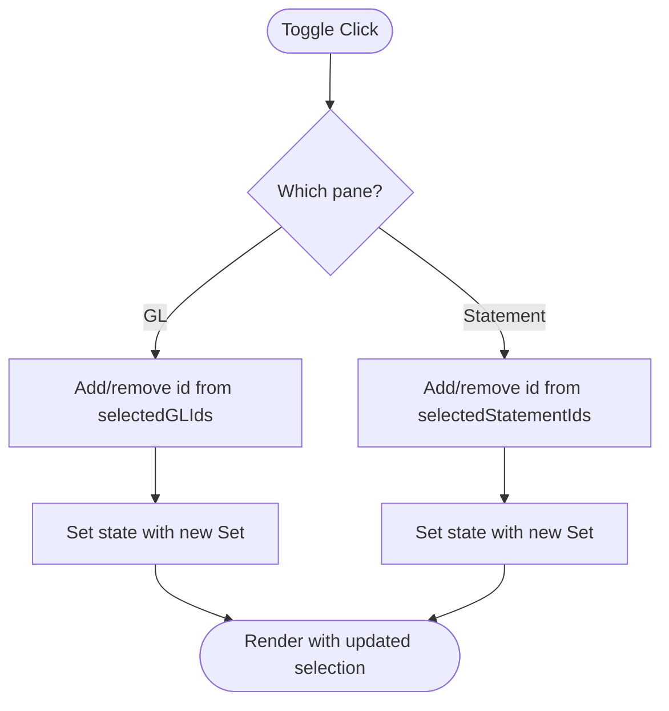

# DualPaneTransactionView Component

<cite>
**Referenced Files in This Document**
- [DualPaneTransactionView.tsx](file://components/DualPaneTransactionView.tsx)
- [TransactionImporter.tsx](file://components/TransactionImporter.tsx)
- [ReconcileProApp.tsx](file://components/ReconcileProApp.tsx)
- [MatchControls.tsx](file://components/MatchControls.tsx)
- [TransactionTable.tsx](file://components/TransactionTable.tsx)
- [types.ts](file://lib/types.ts)
</cite>

## Table of Contents
1. [Introduction](#introduction)
2. [Project Structure](#project-structure)
3. [Core Components](#core-components)
4. [Architecture Overview](#architecture-overview)
5. [Detailed Component Analysis](#detailed-component-analysis)
6. [Dependency Analysis](#dependency-analysis)
7. [Performance Considerations](#performance-considerations)
8. [Troubleshooting Guide](#troubleshooting-guide)
9. [Conclusion](#conclusion)
10. [Appendices](#appendices)

## Introduction
This document provides comprehensive technical and practical documentation for the DualPaneTransactionView component. The component enables side-by-side comparison of internal (GL) and external (Statement) financial transactions to facilitate reconciliation. It presents two distinct transaction sets with independent selection capabilities, header statistics, and a floating match button that activates when selections exist in both panes. The documentation covers the component’s props interface, UI layout, TransactionCard sub-component, selection state management, financial calculations, responsive design, accessibility, and integration guidance with the parent ReconcileProApp.

## Project Structure
The DualPaneTransactionView component resides in the components directory and integrates with the broader ReconcileProApp workspace. It consumes transaction data shaped by the TransactionImporter and expects a specific structure for GL and Statement transactions.

**Diagram sources**
- [DualPaneTransactionView.tsx](file://components/DualPaneTransactionView.tsx#L1-L290)
- [TransactionImporter.tsx](file://components/TransactionImporter.tsx#L1-L394)
- [ReconcileProApp.tsx](file://components/ReconcileProApp.tsx#L1-L1112)
- [MatchControls.tsx](file://components/MatchControls.tsx#L41-L85)
- [TransactionTable.tsx](file://components/TransactionTable.tsx#L118-L158)
- [types.ts](file://lib/types.ts#L1-L132)

**Section sources**
- [DualPaneTransactionView.tsx](file://components/DualPaneTransactionView.tsx#L1-L290)
- [TransactionImporter.tsx](file://components/TransactionImporter.tsx#L1-L394)
- [ReconcileProApp.tsx](file://components/ReconcileProApp.tsx#L1-L1112)

## Core Components
- DualPaneTransactionView: Renders two equal-width panes for GL and Statement transactions, manages selection state independently, and exposes a floating match action when both sides have selections.
- TransactionCard: A reusable card component that renders a single transaction with type-specific coloring, amount formatting, and checkbox-based selection.
- ReconcileProApp: Parent application that orchestrates data loading, selection state, and the matching workflow. It also provides a sticky action bar for matching.

Key responsibilities:
- Props interface defines structured GL and Statement transaction sets with CR/DR categorization.
- Grid-based layout with independent scrollable panes and header statistics.
- Selection toggles per pane tracked via React Set state.
- Currency formatting and totals computed per pane and combined.
- Floating match button with console logging of selected items.

**Section sources**
- [DualPaneTransactionView.tsx](file://components/DualPaneTransactionView.tsx#L7-L21)
- [DualPaneTransactionView.tsx](file://components/DualPaneTransactionView.tsx#L48-L66)
- [DualPaneTransactionView.tsx](file://components/DualPaneTransactionView.tsx#L68-L77)
- [DualPaneTransactionView.tsx](file://components/DualPaneTransactionView.tsx#L94-L145)
- [ReconcileProApp.tsx](file://components/ReconcileProApp.tsx#L1088-L1110)

## Architecture Overview
The component is a self-contained view that receives preprocessed transaction sets from the importer and renders them in a dual-pane layout. Selection state is maintained locally within the component. When both panes have selections, a floating match button appears, enabling the user to trigger matching logic.

**Diagram sources**
- [DualPaneTransactionView.tsx](file://components/DualPaneTransactionView.tsx#L48-L66)
- [DualPaneTransactionView.tsx](file://components/DualPaneTransactionView.tsx#L268-L287)
- [ReconcileProApp.tsx](file://components/ReconcileProApp.tsx#L547-L607)

## Detailed Component Analysis

### Props Interface and Data Model
- GL Transactions: Two arrays grouped by internal credit (INT CR) and internal debit (INT DR).
- Statement Transactions: Two arrays grouped by external debit (EXT DR) and external credit (EXT CR).
- Safe accessors ensure robust rendering even when data is missing or partially loaded.

Implementation highlights:
- Structured props enforce consistent data shapes for reconciliation.
- Safe defaults prevent runtime errors on empty or partial datasets.

**Section sources**
- [DualPaneTransactionView.tsx](file://components/DualPaneTransactionView.tsx#L7-L21)
- [DualPaneTransactionView.tsx](file://components/DualPaneTransactionView.tsx#L25-L34)

### UI Layout and Header Statistics
- CSS Grid layout with two equal columns and spacing.
- Each pane has:
  - Gradient header with title and item count badge.
  - Sub-type counts (INT CR/INT DR or EXT DR/EXT CR).
  - Combined total formatted as currency.
  - Selected count indicator when applicable.
- Scrollable content area with custom scrollbar styling.

Responsive considerations:
- Flex and grid utilities ensure equal-height columns and scrollable content areas.
- Fixed-position floating match button remains centered at the bottom.

Accessibility considerations:
- Checkbox inputs are present for selection.
- Keyboard navigation is not explicitly implemented for cards; consider adding tab indices and Enter/Space toggles for improved accessibility.

**Section sources**
- [DualPaneTransactionView.tsx](file://components/DualPaneTransactionView.tsx#L147-L266)

### TransactionCard Sub-component
- Displays a single transaction with:
  - Checkbox for selection with controlled state.
  - Type badge with color-coded background and border based on subType.
  - Formatted amount aligned to the right.
  - Description, date, and reference below the main row.
- Selection toggle handler:
  - Uses a composite key combining index and identifiers to ensure uniqueness across renders.
  - Stops propagation to prevent double toggling when clicking the checkbox.

Type-specific coloring:
- INT CR: blue palette.
- INT DR: indigo palette.
- EXT DR: green palette.
- EXT CR: emerald palette.

**Section sources**
- [DualPaneTransactionView.tsx](file://components/DualPaneTransactionView.tsx#L94-L145)
- [DualPaneTransactionView.tsx](file://components/DualPaneTransactionView.tsx#L79-L92)

### Selection State Management
- Local state:
  - selectedGLIds: Set of selected GL transaction keys.
  - selectedStatementIds: Set of selected Statement transaction keys.
- Toggle handlers:
  - toggleGLSelection(id): Adds or removes id from the GL set.
  - toggleStatementSelection(id): Adds or removes id from the Statement set.
- Floating match button visibility:
  - Appears only when both selection sets are non-empty.

Maintaining selection state during updates:
- The component constructs unique keys per transaction and relies on stable keys across re-renders. When data updates, ensure keys remain consistent to preserve selections.

**Section sources**
- [DualPaneTransactionView.tsx](file://components/DualPaneTransactionView.tsx#L22-L24)
- [DualPaneTransactionView.tsx](file://components/DualPaneTransactionView.tsx#L48-L66)
- [DualPaneTransactionView.tsx](file://components/DualPaneTransactionView.tsx#L268-L287)

### Financial Calculations
- formatCurrency(amount): Uses locale-aware currency formatting for USD.
- calculateTotal(transactions): Sums transaction amounts for totals displayed in headers and for the floating match action.

Consistency with other components:
- Currency formatting aligns with TransactionTable’s approach, ensuring uniform presentation across the application.

**Section sources**
- [DualPaneTransactionView.tsx](file://components/DualPaneTransactionView.tsx#L68-L77)
- [TransactionTable.tsx](file://components/TransactionTable.tsx#L135-L150)

### Integration with ReconcileProApp
- Parent application loads transaction sets from the importer and passes them to DualPaneTransactionView.
- ReconcileProApp maintains separate selection sets for left/right sides and provides a sticky action bar with matching controls.
- The floating match button in DualPaneTransactionView logs selections to the console; the parent ReconcileProApp executes the matching logic and clears selections upon completion.

**Section sources**
- [ReconcileProApp.tsx](file://components/ReconcileProApp.tsx#L349-L427)
- [ReconcileProApp.tsx](file://components/ReconcileProApp.tsx#L547-L607)
- [ReconcileProApp.tsx](file://components/ReconcileProApp.tsx#L1088-L1110)
- [MatchControls.tsx](file://components/MatchControls.tsx#L41-L85)

### Class Diagram: TransactionCard and Selection Flow

**Diagram sources**
- [DualPaneTransactionView.tsx](file://components/DualPaneTransactionView.tsx#L7-L21)
- [DualPaneTransactionView.tsx](file://components/DualPaneTransactionView.tsx#L48-L66)
- [DualPaneTransactionView.tsx](file://components/DualPaneTransactionView.tsx#L94-L145)

### Sequence Diagram: Floating Match Button Activation

**Diagram sources**
- [DualPaneTransactionView.tsx](file://components/DualPaneTransactionView.tsx#L268-L287)

### Flowchart: Selection Toggle Logic

**Diagram sources**
- [DualPaneTransactionView.tsx](file://components/DualPaneTransactionView.tsx#L48-L66)

## Dependency Analysis
- External dependencies:
  - Lucide icons for visual cues (FileText, DollarSign, ArrowRightLeft).
  - React hooks for state management.
- Internal dependencies:
  - ImportedTransaction type from TransactionImporter.tsx.
  - Types from lib/types.ts (used by parent app).
- Coupling:
  - Low coupling to parent app; DualPaneTransactionView is self-contained except for console logging of selections.
  - Strong cohesion around transaction display, selection, and matching activation.

Potential circular dependencies:
- None observed; component imports types and icons but does not import parent app logic.

**Section sources**
- [DualPaneTransactionView.tsx](file://components/DualPaneTransactionView.tsx#L1-L10)
- [TransactionImporter.tsx](file://components/TransactionImporter.tsx#L1-L30)
- [types.ts](file://lib/types.ts#L41-L58)

## Performance Considerations
- Rendering large lists:
  - The component maps over combined transaction arrays; for very large datasets, consider virtualization or pagination to improve render performance.
- Sorting:
  - Transactions are sorted by date; ensure date fields are valid ISO strings to avoid expensive comparisons.
- Selection keys:
  - Using composite keys avoids collisions and supports stable selection across re-renders.
- Memoization:
  - Consider memoizing derived totals and formatted values if the component becomes a bottleneck.

[No sources needed since this section provides general guidance]

## Troubleshooting Guide
Common issues and resolutions:
- Empty transaction lists:
  - Both panes display a neutral message when no data is available; ensure the parent app passes valid transaction sets.
- Maintaining selection state during data updates:
  - Ensure unique and stable keys for each transaction to preserve selections across updates.
- Floating match button not appearing:
  - Confirm that both selection sets contain at least one item; verify toggle handlers are invoked.
- Console logging only:
  - The floating match button currently logs selections; integrate with the parent app’s matching logic to perform actual reconciliation.
- Accessibility:
  - Add keyboard support (Enter/Space) for checkboxes and consider focus management for improved UX.

**Section sources**
- [DualPaneTransactionView.tsx](file://components/DualPaneTransactionView.tsx#L189-L205)
- [DualPaneTransactionView.tsx](file://components/DualPaneTransactionView.tsx#L248-L264)
- [DualPaneTransactionView.tsx](file://components/DualPaneTransactionView.tsx#L268-L287)

## Conclusion
The DualPaneTransactionView component provides a focused, efficient interface for comparing GL and Statement transactions side-by-side. Its clean separation of concerns, robust selection handling, and clear visual feedback make it suitable for reconciliation workflows. Integrating the floating match button with the parent ReconcileProApp’s matching logic completes the reconciliation cycle. For production readiness, consider performance optimizations for large datasets and accessibility enhancements for inclusive UX.

[No sources needed since this section summarizes without analyzing specific files]

## Appendices

### Props Reference
- glTransactions: Object with intCr and intDr arrays of ImportedTransaction.
- statementTransactions: Object with extDr and extCr arrays of ImportedTransaction.

**Section sources**
- [DualPaneTransactionView.tsx](file://components/DualPaneTransactionView.tsx#L7-L21)
- [TransactionImporter.tsx](file://components/TransactionImporter.tsx#L15-L28)

### Data Model Alignment
- ImportedTransaction fields include date, description, amount, reference, and type.
- ReconcileProApp’s Transaction model includes additional fields for internal processing.

**Section sources**
- [TransactionImporter.tsx](file://components/TransactionImporter.tsx#L6-L13)
- [types.ts](file://lib/types.ts#L41-L58)