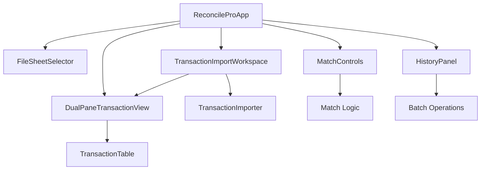
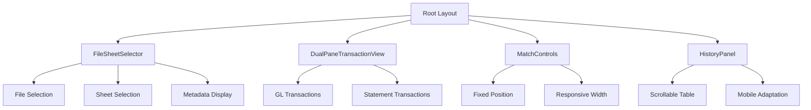
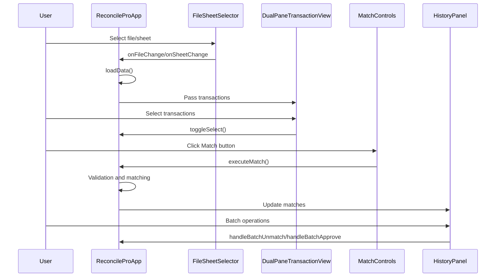

# Frontend Architecture

<cite>
**Referenced Files in This Document**   
- [app/layout.tsx](file://app/layout.tsx)
- [app/page.tsx](file://app/page.tsx)
- [components/ReconcileProApp.tsx](file://components/ReconcileProApp.tsx)
- [components/FileSheetSelector.tsx](file://components/FileSheetSelector.tsx)
- [components/DualPaneTransactionView.tsx](file://components/DualPaneTransactionView.tsx)
- [components/MatchControls.tsx](file://components/MatchControls.tsx)
- [components/HistoryPanel.tsx](file://components/HistoryPanel.tsx)
- [components/TransactionImportWorkspace.tsx](file://components/TransactionImportWorkspace.tsx)
- [components/TransactionImporter.tsx](file://components/TransactionImporter.tsx)
- [components/TransactionTable.tsx](file://components/TransactionTable.tsx)
- [lib/types.ts](file://lib/types.ts)
- [lib/constants.ts](file://lib/constants.ts)
- [app/providers.tsx](file://app/providers.tsx)
- [app/api/transactions/sheets/route.ts](file://app/api/transactions/sheets/route.ts)
- [app/api/transactions/import/route.ts](file://app/api/transactions/import/route.ts)
</cite>

## Table of Contents
1. [Introduction](#introduction)
2. [Project Structure and Next.js App Router](#project-structure-and-nextjs-app-router)
3. [Core Component Hierarchy](#core-component-hierarchy)
4. [State Management and Data Flow](#state-management-and-data-flow)
5. [UI Architecture and Responsive Design](#ui-architecture-and-responsive-design)
6. [Component Interaction and Event Handling](#component-interaction-and-event-handling)
7. [Backend API Integration](#backend-api-integration)
8. [Performance Optimization](#performance-optimization)
9. [Accessibility and User Experience](#accessibility-and-user-experience)
10. [Conclusion](#conclusion)

## Introduction

The analyzer-web application is a sophisticated transaction reconciliation system built with React and Next.js using the App Router architecture. The frontend is designed as a single-page application with modular components that work together to provide a seamless user experience for financial reconciliation tasks. The architecture centers around the ReconcileProApp component as the main orchestrator, which manages state, coordinates data flow, and integrates various specialized components for file selection, transaction viewing, matching operations, and history management. This documentation provides a comprehensive overview of the frontend architecture, focusing on component composition, state management patterns, data flow, and integration with backend services.

## Project Structure and Next.js App Router

The application follows the Next.js App Router structure, with the main entry point at app/page.tsx which renders the ReconcileProApp component. The layout.tsx file provides the root layout with global styles, font loading, and provider wrapping. The app directory contains API routes for server-side operations, while components are organized in a dedicated components directory. The lib directory houses shared utilities, types, and constants. This structure enables server-side rendering for improved performance and SEO, while the "use client" directive in components enables client-side interactivity where needed. The providers.tsx file wraps the application with NextAuth's SessionProvider, enabling authentication state management across the application.

**Section sources**
- [app/layout.tsx](file://app/layout.tsx#L1-L36)
- [app/page.tsx](file://app/page.tsx#L1-L6)
- [app/providers.tsx](file://app/providers.tsx#L1-L8)

## Core Component Hierarchy

The frontend architecture is built around a hierarchical component structure with ReconcileProApp serving as the central orchestrator. This component integrates several key subcomponents: FileSheetSelector for data source selection, DualPaneTransactionView for transaction comparison, MatchControls for matching operations, and HistoryPanel for viewing reconciliation history. The TransactionImportWorkspace acts as a container for the import process, coordinating between TransactionImporter and DualPaneTransactionView. This modular composition allows for separation of concerns while maintaining cohesive functionality. Each component is designed with specific responsibilities, enabling reuse and independent development.



**Diagram sources **
- [components/ReconcileProApp.tsx](file://components/ReconcileProApp.tsx#L35-L800)
- [components/FileSheetSelector.tsx](file://components/FileSheetSelector.tsx#L32-L114)
- [components/DualPaneTransactionView.tsx](file://components/DualPaneTransactionView.tsx#L18-L290)
- [components/MatchControls.tsx](file://components/MatchControls.tsx#L20-L125)
- [components/HistoryPanel.tsx](file://components/HistoryPanel.tsx#L27-L313)
- [components/TransactionImportWorkspace.tsx](file://components/TransactionImportWorkspace.tsx#L8-L119)

## State Management and Data Flow

The application employs a centralized state management approach within the ReconcileProApp component, which maintains the primary application state including transactions, matches, audit logs, and UI state. State is passed down to child components through props, following React's unidirectional data flow principles. The component uses React's useState and useCallback hooks to manage state and optimize re-renders. Transaction data flows from the TransactionImportWorkspace to the TransactionTable for display, with filtering and sorting state managed locally within the TransactionTable component. Context is used implicitly through the SessionProvider for authentication state, while custom hooks could be implemented for more complex state logic. The state management pattern includes persistence to localStorage and undo/redo functionality through checkpoint saving.

**Section sources**
- [components/ReconcileProApp.tsx](file://components/ReconcileProApp.tsx#L41-L235)
- [components/TransactionTable.tsx](file://components/TransactionTable.tsx#L65-L503)
- [components/TransactionImportWorkspace.tsx](file://components/TransactionImportWorkspace.tsx#L9-L29)

## UI Architecture and Responsive Design

The UI architecture is built with responsive design principles using Tailwind CSS for styling. The layout.tsx file defines the root layout with Inter font loading and global styles. The FileSheetSelector component provides a responsive interface for selecting import files and sheets, with metadata display on larger screens. The DualPaneTransactionView implements a side-by-side comparison layout for internal and external transactions, using a grid system to maintain alignment across screen sizes. The MatchControls component features a fixed-position control panel that remains accessible during scrolling, with adaptive width for different viewport sizes. The HistoryPanel uses a responsive table layout with horizontal scrolling on smaller screens. All components use Tailwind's responsive prefixes to ensure optimal display across devices.



**Diagram sources **
- [app/layout.tsx](file://app/layout.tsx#L1-L36)
- [components/FileSheetSelector.tsx](file://components/FileSheetSelector.tsx#L43-L114)
- [components/DualPaneTransactionView.tsx](file://components/DualPaneTransactionView.tsx#L148-L287)
- [components/MatchControls.tsx](file://components/MatchControls.tsx#L49-L125)
- [components/HistoryPanel.tsx](file://components/HistoryPanel.tsx#L79-L313)

## Component Interaction and Event Handling

Components interact through well-defined prop interfaces and callback functions. The ReconcileProApp component passes transaction data and selection state to the DualPaneTransactionView, which in turn communicates selection changes back through callback props. The MatchControls component receives selected transaction data and executes matching logic when the match button is clicked, with validation checks for permissions and period locking. The HistoryPanel supports both individual and batch operations, with selection state managed through callback functions. Event handling follows React's synthetic event system, with onClick handlers for user interactions and onChange handlers for form inputs. The architecture includes comprehensive error handling and user feedback through alerts and status messages.



**Diagram sources **
- [components/ReconcileProApp.tsx](file://components/ReconcileProApp.tsx#L429-L754)
- [components/FileSheetSelector.tsx](file://components/FileSheetSelector.tsx#L42-L114)
- [components/DualPaneTransactionView.tsx](file://components/DualPaneTransactionView.tsx#L48-L67)
- [components/MatchControls.tsx](file://components/MatchControls.tsx#L111-L122)
- [components/HistoryPanel.tsx](file://components/HistoryPanel.tsx#L744-L761)

## Backend API Integration

The frontend integrates with backend services through Next.js API routes, using the fetch API for data operations. The TransactionImporter component uploads Excel files to /api/transactions/import, which processes and stores the data in the database. The FileSheetSelector retrieves imported files from /api/transactions/sheets, which queries the database for available sheets. The ReconcileProApp component makes authenticated requests to protected routes like /api/admin/users, with session management handled by NextAuth. Error handling is implemented for various HTTP status codes, including 401 for unauthorized access and 409 for duplicate file detection. The integration follows REST principles with appropriate HTTP methods for different operations.

```mermaid
graph TD
A[Frontend] --> B[/api/transactions/import]
A --> C[/api/transactions/sheets]
A --> D[/api/admin/users]
A --> E[/api/sync/folders]
B --> F[Prisma Database]
C --> F
D --> F
E --> F
F --> G[File Storage]
F --> H[User Management]
F --> I[Transaction Data]
```

**Diagram sources **
- [components/TransactionImporter.tsx](file://components/TransactionImporter.tsx#L65-L71)
- [components/ReconcileProApp.tsx](file://components/ReconcileProApp.tsx#L146-L158)
- [app/api/transactions/import/route.ts](file://app/api/transactions/import/route.ts#L12-L264)
- [app/api/transactions/sheets/route.ts](file://app/api/transactions/sheets/route.ts#L12-L166)

## Performance Optimization

The application implements several performance optimization techniques to ensure smooth operation with large datasets. The TransactionTable component uses React.useMemo to memoize filtered and sorted transaction data, preventing unnecessary re-computations. Event handlers are wrapped in useCallback to maintain referential equality and prevent unnecessary re-renders of child components. The architecture includes lazy loading of reconciliation panels, with the TransactionImportWorkspace only rendering the DualPaneTransactionView after data import is complete. Virtualization could be implemented for large transaction lists to improve scroll performance. The state management includes debouncing for search and filter operations to reduce re-render frequency. Network requests are optimized with appropriate caching headers and efficient data fetching patterns.

**Section sources**
- [components/TransactionTable.tsx](file://components/TransactionTable.tsx#L225-L258)
- [components/ReconcileProApp.tsx](file://components/ReconcileProApp.tsx#L3-L235)
- [components/TransactionImportWorkspace.tsx](file://components/TransactionImportWorkspace.tsx#L32-L80)

## Accessibility and User Experience

The application prioritizes accessibility and user experience through semantic HTML, ARIA attributes, and keyboard navigation support. Form elements include proper labels and error messages, while interactive elements have appropriate focus states. The color scheme follows WCAG guidelines for contrast ratios, with visual indicators for transaction types and statuses. Loading states are clearly communicated with spinners and status messages, while error states provide actionable feedback. The interface includes keyboard shortcuts for common operations and supports screen readers through appropriate ARIA roles and properties. The responsive design ensures usability across devices, with touch targets sized appropriately for mobile interaction.

**Section sources**
- [components/TransactionTable.tsx](file://components/TransactionTable.tsx#L292-L503)
- [components/MatchControls.tsx](file://components/MatchControls.tsx#L49-L125)
- [components/HistoryPanel.tsx](file://components/HistoryPanel.tsx#L79-L313)

## Conclusion

The analyzer-web frontend architecture demonstrates a well-structured React application built with Next.js App Router. The component hierarchy centered around ReconcileProApp provides a clear organization of responsibilities, with effective state management and data flow patterns. The integration of specialized components for file selection, transaction viewing, matching operations, and history management creates a cohesive user experience for financial reconciliation tasks. The architecture balances client-side interactivity with server-side rendering benefits, while thoughtful performance optimizations ensure responsiveness with large datasets. Future enhancements could include additional accessibility features, improved error boundaries, and more sophisticated state management patterns for complex workflows.