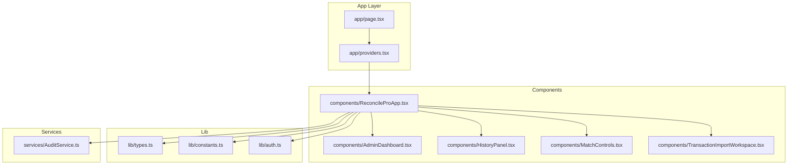
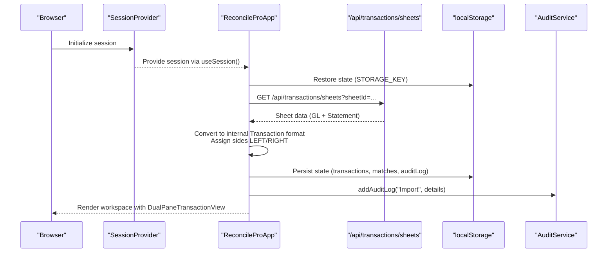
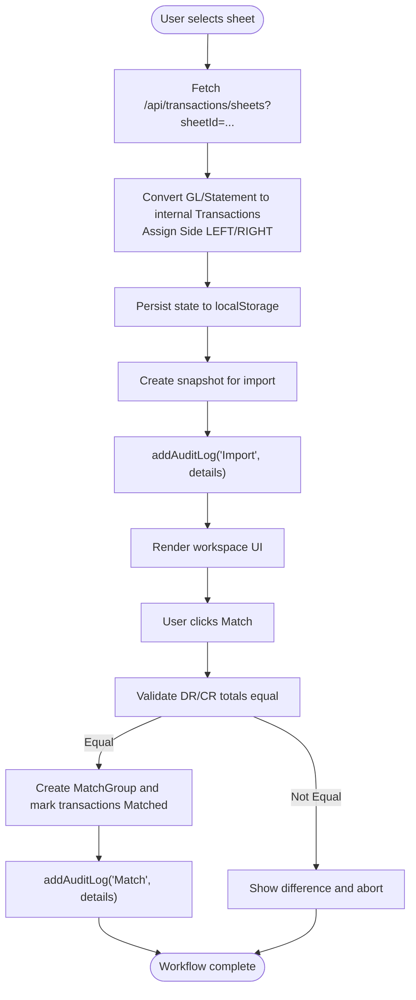
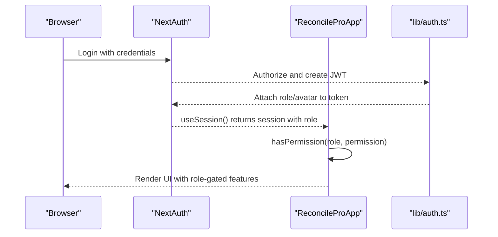
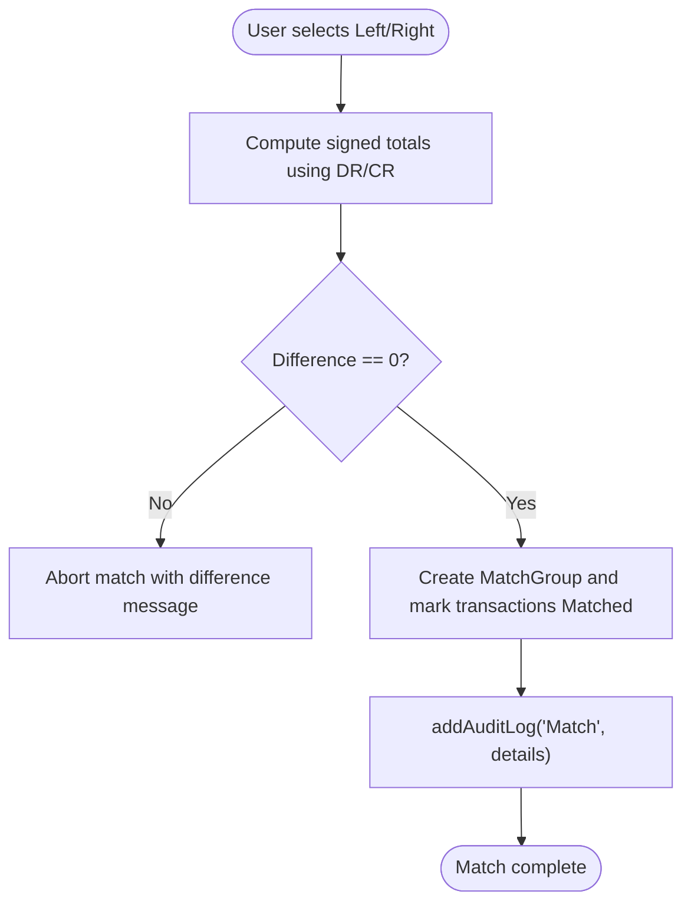
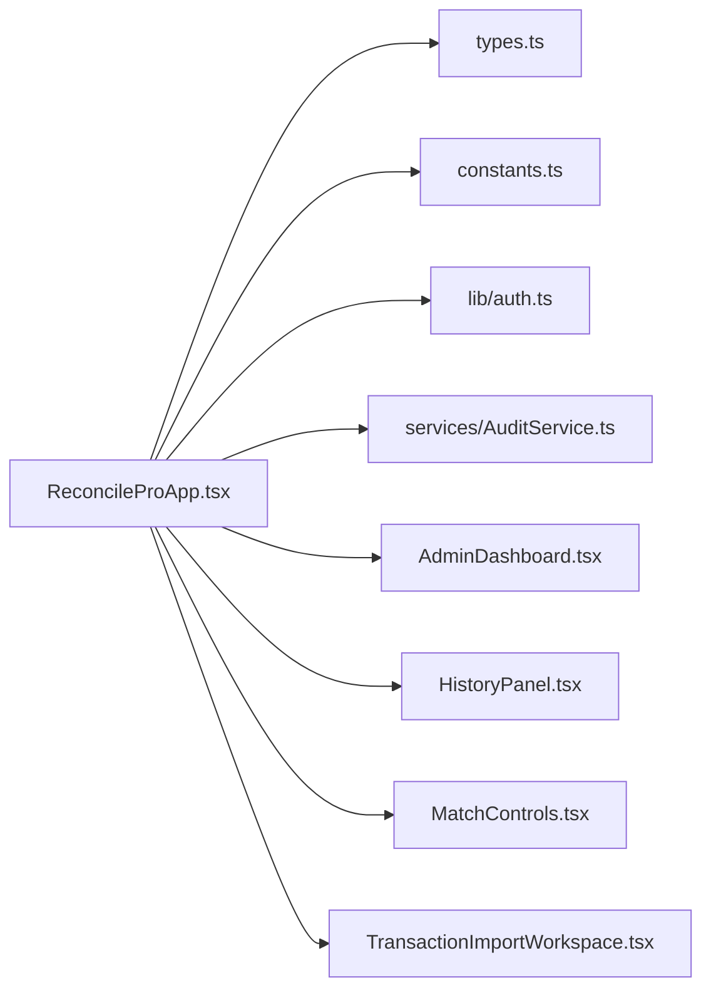

# ReconcileProApp Component

<cite>
**Referenced Files in This Document**
- [ReconcileProApp.tsx](file://components/ReconcileProApp.tsx)
- [constants.ts](file://lib/constants.ts)
- [types.ts](file://lib/types.ts)
- [providers.tsx](file://app/providers.tsx)
- [auth.ts](file://lib/auth.ts)
- [AuditService.ts](file://services/AuditService.ts)
- [AdminDashboard.tsx](file://components/AdminDashboard.tsx)
- [HistoryPanel.tsx](file://components/HistoryPanel.tsx)
- [MatchControls.tsx](file://components/MatchControls.tsx)
- [TransactionImportWorkspace.tsx](file://components/TransactionImportWorkspace.tsx)
- [page.tsx](file://app/page.tsx)
- [TRANSACTION_IMPORT_GUIDE.md](file://docs/TRANSACTION_IMPORT_GUIDE.md)
- [DATABASE_PERSISTENCE.md](file://docs/DATABASE_PERSISTENCE.md)
</cite>

## Table of Contents
1. [Introduction](#introduction)
2. [Project Structure](#project-structure)
3. [Core Components](#core-components)
4. [Architecture Overview](#architecture-overview)
5. [Detailed Component Analysis](#detailed-component-analysis)
6. [Dependency Analysis](#dependency-analysis)
7. [Performance Considerations](#performance-considerations)
8. [Troubleshooting Guide](#troubleshooting-guide)
9. [Conclusion](#conclusion)
10. [Appendices](#appendices)

## Introduction
ReconcileProApp is the central orchestrator of the analyzer-web application. It manages global state for transactions, matches, audit logs, user roles, and reconciliation snapshots. It integrates key UI components such as TransactionImportWorkspace, DualPaneTransactionView, MatchControls, HistoryPanel, and AdminDashboard based on the current view mode. It implements authentication via NextAuth’s useSession hook and enforces role-based permissions to control feature access. State persistence uses localStorage with a dedicated STORAGE_KEY, and undo/redo functionality is implemented through history and future stacks. An idle timeout automatically logs out inactive users after a configured period. The data loading workflow fetches transaction sheets from the /api/transactions/sheets endpoint and converts them into internal transaction format with proper side assignment (Left/Right). Match execution validates transaction amounts using DR/CR reconciliation flags and creates immutable match groups. Audit logging is implemented through addAuditLog, and system snapshots are created for versioning. The document also covers common issues such as state synchronization, closed/locked periods, and separation of duties in approval workflows, along with performance optimization tips.

## Project Structure
ReconcileProApp resides in the components directory and serves as the root UI container. It coordinates with providers.tsx to enable NextAuth sessions, consumes constants and types for permissions and state shape, and integrates several UI components for workspace, admin, import, and sync views. The application entry point renders ReconcileProApp.

**Diagram sources**
- [page.tsx](file://app/page.tsx#L1-L6)
- [providers.tsx](file://app/providers.tsx#L1-L8)
- [ReconcileProApp.tsx](file://components/ReconcileProApp.tsx#L1-L120)
- [AdminDashboard.tsx](file://components/AdminDashboard.tsx#L1-L60)
- [HistoryPanel.tsx](file://components/HistoryPanel.tsx#L1-L60)
- [MatchControls.tsx](file://components/MatchControls.tsx#L1-L40)
- [TransactionImportWorkspace.tsx](file://components/TransactionImportWorkspace.tsx#L1-L40)
- [types.ts](file://lib/types.ts#L1-L60)
- [constants.ts](file://lib/constants.ts#L1-L30)
- [auth.ts](file://lib/auth.ts#L1-L40)
- [AuditService.ts](file://services/AuditService.ts#L1-L40)

**Section sources**
- [page.tsx](file://app/page.tsx#L1-L6)
- [providers.tsx](file://app/providers.tsx#L1-L8)
- [ReconcileProApp.tsx](file://components/ReconcileProApp.tsx#L1-L120)

## Core Components
- Global state management for transactions, matches, audit logs, users, role permissions, snapshots, and selection sets.
- Authentication integration via NextAuth’s useSession hook and role-based permission checks.
- View routing among workspace, admin, import, and sync modes.
- Persistence using localStorage keyed by STORAGE_KEY and checkpoint-based undo/redo stacks.
- Idle timeout enforcement to automatically sign out inactive users.
- Data loading workflow from /api/transactions/sheets with conversion to internal transaction format.
- Match execution logic enforcing DR/CR reconciliation flags and creating immutable match groups.
- Audit logging via addAuditLog and snapshot creation/versioning via createSnapshot.
- Integration points with AdminDashboard for user management, role requests, and period locking.

**Section sources**
- [ReconcileProApp.tsx](file://components/ReconcileProApp.tsx#L35-L120)
- [constants.ts](file://lib/constants.ts#L1-L30)
- [types.ts](file://lib/types.ts#L1-L120)

## Architecture Overview
ReconcileProApp orchestrates the reconciliation workflow by:
- Managing session state and permissions.
- Loading and persisting data locally and remotely.
- Rendering appropriate views based on current mode.
- Executing reconciliation actions with validation and audit trails.
- Providing admin capabilities for user management and period control.

**Diagram sources**
- [providers.tsx](file://app/providers.tsx#L1-L8)
- [ReconcileProApp.tsx](file://components/ReconcileProApp.tsx#L140-L236)
- [DATABASE_PERSISTENCE.md](file://docs/DATABASE_PERSISTENCE.md#L122-L183)
- [AuditService.ts](file://services/AuditService.ts#L1-L40)

## Detailed Component Analysis

### ReconcileProApp: Central Orchestrator
- Authentication and idle timeout:
  - Uses NextAuth’s useSession hook to derive currentUser and enforce idle timeout via window event listeners and a timer.
  - On timeout, invokes signOut and navigates to login.
- State initialization and persistence:
  - On mount, restores state from localStorage keyed by STORAGE_KEY.
  - Persists state changes to localStorage whenever initialized.
  - Fetches imported files and users when authenticated.
- View routing:
  - Switches between workspace, admin, import, and sync views.
  - Renders AdminDashboard, TransactionImportWorkspace, and main workspace UI accordingly.
- Data loading workflow:
  - Loads sheet data from /api/transactions/sheets with sheetId query param.
  - Converts GL and Statement transactions into internal Transaction format with side assignment and status Unmatched.
  - Updates selected date from sheet metadata and creates a snapshot for import.
- Match execution:
  - Validates selection totals using DR/CR flags (negative for DR, positive for CR).
  - Enforces exact-match requirement (difference must be zero).
  - Creates immutable MatchGroup entries and marks transactions as Matched.
- Audit logging and snapshots:
  - addAuditLog records user actions with timestamps and details.
  - createSnapshot captures transactions and matches with stats for versioning.
- Undo/redo:
  - saveCheckpoint serializes core state and pushes to history stack.
  - undo restores previous state from history stack and clears future stack.
  - redo restores next state from future stack and updates history stack.
- Admin and permission controls:
  - hasPermission checks role-based permissions.
  - handleSetLockedDate toggles closed period.
  - handleApproveRoleRequest updates user role upon approval.
- Idle timeout:
  - Tracks user activity and signs out after IDLE_TIMEOUT_MS.

**Diagram sources**
- [ReconcileProApp.tsx](file://components/ReconcileProApp.tsx#L349-L427)
- [ReconcileProApp.tsx](file://components/ReconcileProApp.tsx#L547-L607)
- [ReconcileProApp.tsx](file://components/ReconcileProApp.tsx#L662-L678)

**Section sources**
- [ReconcileProApp.tsx](file://components/ReconcileProApp.tsx#L35-L120)
- [ReconcileProApp.tsx](file://components/ReconcileProApp.tsx#L140-L236)
- [ReconcileProApp.tsx](file://components/ReconcileProApp.tsx#L349-L427)
- [ReconcileProApp.tsx](file://components/ReconcileProApp.tsx#L547-L607)
- [ReconcileProApp.tsx](file://components/ReconcileProApp.tsx#L662-L678)

### Authentication Integration and Role-Based Permissions
- Session provider:
  - SessionProvider wraps the app to enable useSession.
- NextAuth configuration:
  - Credentials provider with JWT strategy, session max age, and callbacks to attach role and avatar to session.
  - Events hook logs signOut and marks device sessions inactive.
- Role-based permissions:
  - DEFAULT_ROLE_PERMISSIONS defines granular permissions per role.
  - hasPermission checks whether the current user’s role includes a given permission.
- Idle timeout:
  - IDLE_TIMEOUT_MS constant drives automatic logout after inactivity.

**Diagram sources**
- [providers.tsx](file://app/providers.tsx#L1-L8)
- [auth.ts](file://lib/auth.ts#L1-L40)
- [auth.ts](file://lib/auth.ts#L169-L224)
- [constants.ts](file://lib/constants.ts#L1-L30)
- [ReconcileProApp.tsx](file://components/ReconcileProApp.tsx#L252-L254)

**Section sources**
- [providers.tsx](file://app/providers.tsx#L1-L8)
- [auth.ts](file://lib/auth.ts#L1-L40)
- [auth.ts](file://lib/auth.ts#L169-L224)
- [constants.ts](file://lib/constants.ts#L1-L30)
- [ReconcileProApp.tsx](file://components/ReconcileProApp.tsx#L252-L254)

### Data Loading Workflow and Side Assignment
- Endpoint:
  - GET /api/transactions/sheets?sheetId=... returns sheet data including GL and Statement transactions.
- Conversion:
  - Internal Transaction format includes date, description, amount, reference, side, status, and reconciliation flags (DR/CR).
  - Side assignment:
    - GL transactions mapped to Side.Left.
    - Statement transactions mapped to Side.Right.
- Metadata:
  - Selected date updated from reportingDate.
  - Snapshot created on load for import tracking.

**Section sources**
- [DATABASE_PERSISTENCE.md](file://docs/DATABASE_PERSISTENCE.md#L122-L183)
- [ReconcileProApp.tsx](file://components/ReconcileProApp.tsx#L349-L427)
- [ReconcileProApp.tsx](file://components/ReconcileProApp.tsx#L454-L545)

### Match Execution Logic and Validation
- Validation:
  - getActualAmount interprets DR/CR flags to compute signed totals.
  - Exact-match requirement enforced (difference must be zero).
- Execution:
  - Creates immutable MatchGroup with totals, difference, optional comment, and status APPROVED.
  - Marks participating transactions as Matched and assigns matchId.
- Approval workflow:
  - handleApproveMatch checks separation of duties: importer cannot approve their own adjustments except for Admin.
  - Batch approval and batch unmatch support.

**Diagram sources**
- [ReconcileProApp.tsx](file://components/ReconcileProApp.tsx#L547-L607)
- [ReconcileProApp.tsx](file://components/ReconcileProApp.tsx#L609-L640)

**Section sources**
- [ReconcileProApp.tsx](file://components/ReconcileProApp.tsx#L547-L607)
- [ReconcileProApp.tsx](file://components/ReconcileProApp.tsx#L609-L640)

### Audit Logging and System Snapshots
- Audit logging:
  - addAuditLog appends entries with action, details, timestamp, and user identity.
- Snapshots:
  - createSnapshot captures transactions, matches, selectedDate, and computed stats.
  - restoreSnapshot replaces current state with snapshot contents.

**Section sources**
- [ReconcileProApp.tsx](file://components/ReconcileProApp.tsx#L240-L251)
- [ReconcileProApp.tsx](file://components/ReconcileProApp.tsx#L662-L697)

### Undo/Redo Mechanism
- saveCheckpoint serializes core state and pushes to history stack, clearing future stack.
- undo pops from history stack and restores state, pushing current state to future stack.
- redo mirrors undo in reverse direction.

**Section sources**
- [ReconcileProApp.tsx](file://components/ReconcileProApp.tsx#L268-L345)

### Integration with UI Components
- Workspace view:
  - File and sheet selectors, stats cards, dual-pane transaction tables, and HistoryPanel.
- Admin dashboard:
  - User management, role permissions, audit logs, period locking, and role requests.
- Import workspace:
  - TransactionImporter and DualPaneTransactionView for previewing GL vs Statement.
- Match controls:
  - Floating toolbar with selection totals, difference indicator, and match button.

**Section sources**
- [ReconcileProApp.tsx](file://components/ReconcileProApp.tsx#L963-L1112)
- [AdminDashboard.tsx](file://components/AdminDashboard.tsx#L1-L211)
- [TransactionImportWorkspace.tsx](file://components/TransactionImportWorkspace.tsx#L1-L119)
- [MatchControls.tsx](file://components/MatchControls.tsx#L1-L125)
- [HistoryPanel.tsx](file://components/HistoryPanel.tsx#L1-L313)

## Dependency Analysis
- Internal dependencies:
  - ReconcileProApp depends on types.ts for Transaction, MatchGroup, User, and permissions.
  - Uses constants.ts for STORAGE_KEY, IDLE_TIMEOUT_MS, and role limits.
  - Integrates with AuditService for audit logging.
- External dependencies:
  - NextAuth for session management and role propagation.
  - API endpoints for importing and listing sheets.

**Diagram sources**
- [ReconcileProApp.tsx](file://components/ReconcileProApp.tsx#L1-L120)
- [types.ts](file://lib/types.ts#L1-L120)
- [constants.ts](file://lib/constants.ts#L1-L30)
- [auth.ts](file://lib/auth.ts#L1-L40)
- [AuditService.ts](file://services/AuditService.ts#L1-L40)
- [AdminDashboard.tsx](file://components/AdminDashboard.tsx#L1-L60)
- [HistoryPanel.tsx](file://components/HistoryPanel.tsx#L1-L60)
- [MatchControls.tsx](file://components/MatchControls.tsx#L1-L40)
- [TransactionImportWorkspace.tsx](file://components/TransactionImportWorkspace.tsx#L1-L40)

**Section sources**
- [ReconcileProApp.tsx](file://components/ReconcileProApp.tsx#L1-L120)
- [types.ts](file://lib/types.ts#L1-L120)
- [constants.ts](file://lib/constants.ts#L1-L30)
- [auth.ts](file://lib/auth.ts#L1-L40)
- [AuditService.ts](file://services/AuditService.ts#L1-L40)

## Performance Considerations
- Prefer selective re-renders:
  - Use Set-based selection state (selectedLeftIds, selectedRightIds) to minimize re-computation of derived values.
  - Memoize derived computations (e.g., totals) using useCallback or useMemo where appropriate.
- Efficient state updates:
  - Batch updates to transactions and matches to reduce render churn.
  - Use immutable updates to preserve referential equality where possible.
- Local storage:
  - Persist only essential state to localStorage to avoid large payloads.
  - Consider throttling persistence to reduce write frequency.
- API calls:
  - Debounce sheet selection changes to avoid rapid reloads.
  - Cache sheet metadata when appropriate to reduce repeated fetches.

[No sources needed since this section provides general guidance]

## Troubleshooting Guide
- State synchronization between components:
  - Ensure all state mutations go through ReconcileProApp handlers to keep UI in sync.
  - Use saveCheckpoint before major operations to enable reliable undo/redo.
- Closed/locked periods:
  - isPeriodLocked prevents modifications during closed periods; verify lockedDate is set correctly in AdminDashboard.
  - Batch operations and approvals respect locked periods; confirm UI disables actions appropriately.
- Separation of duties in approval workflows:
  - handleApproveMatch prevents importers from approving their own adjustments; ensure importedBy is populated during import.
- Audit logging:
  - addAuditLog appends entries; verify current user identity is present in session.
- Snapshot restoration:
  - restoreSnapshot replaces state; confirm UI reflects restored selections and comments.

**Section sources**
- [ReconcileProApp.tsx](file://components/ReconcileProApp.tsx#L256-L259)
- [ReconcileProApp.tsx](file://components/ReconcileProApp.tsx#L609-L640)
- [ReconcileProApp.tsx](file://components/ReconcileProApp.tsx#L686-L697)

## Conclusion
ReconcileProApp is the central orchestrator that unifies authentication, state management, reconciliation logic, and admin controls. It provides robust role-based permissions, persistent state, audit trails, and snapshots while maintaining a clean separation of concerns through modular UI components. By following the documented patterns for data loading, match execution, and state synchronization, teams can reliably operate the reconciliation workflow with strong governance and traceability.

[No sources needed since this section summarizes without analyzing specific files]

## Appendices

### API Endpoints Used by ReconcileProApp
- GET /api/transactions/sheets?sheetId={id}
  - Returns sheet data including GL and Statement transactions and metadata.
- GET /api/transactions/sheets
  - Lists imported files and their sheets for selection.
- POST /api/admin/users
  - Creates a new user (admin only).
- PUT /api/admin/users/{id}
  - Updates an existing user (admin only).
- DELETE /api/admin/users/{id}
  - Deletes a user (admin only).

**Section sources**
- [DATABASE_PERSISTENCE.md](file://docs/DATABASE_PERSISTENCE.md#L122-L183)
- [TRANSACTION_IMPORT_GUIDE.md](file://docs/TRANSACTION_IMPORT_GUIDE.md#L140-L181)
- [ReconcileProApp.tsx](file://components/ReconcileProApp.tsx#L763-L825)