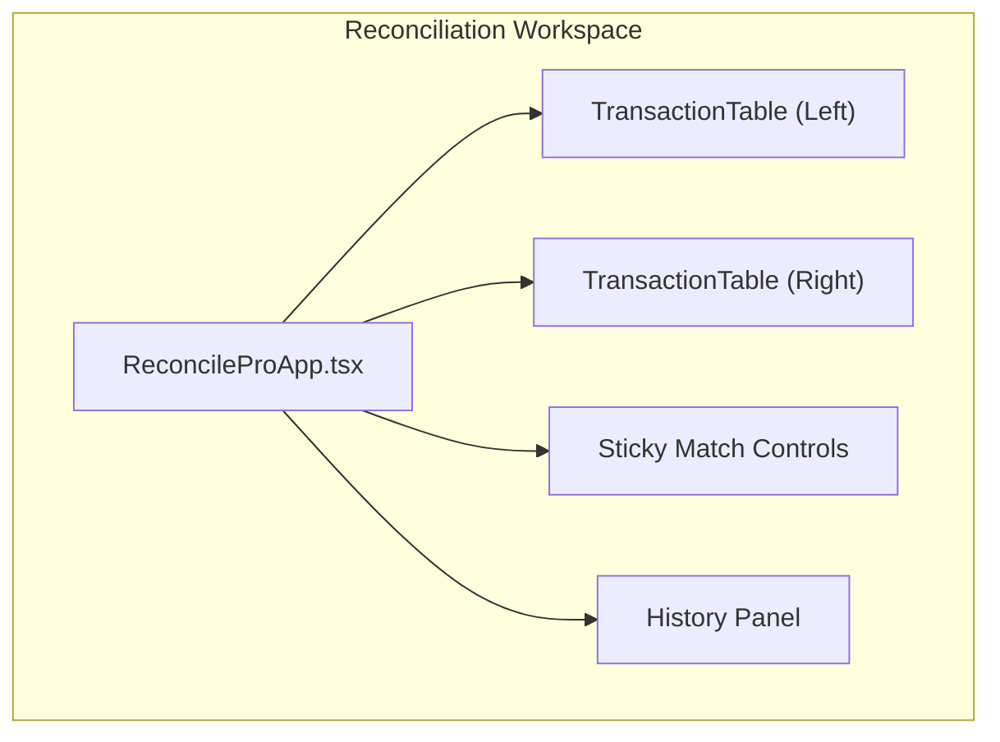
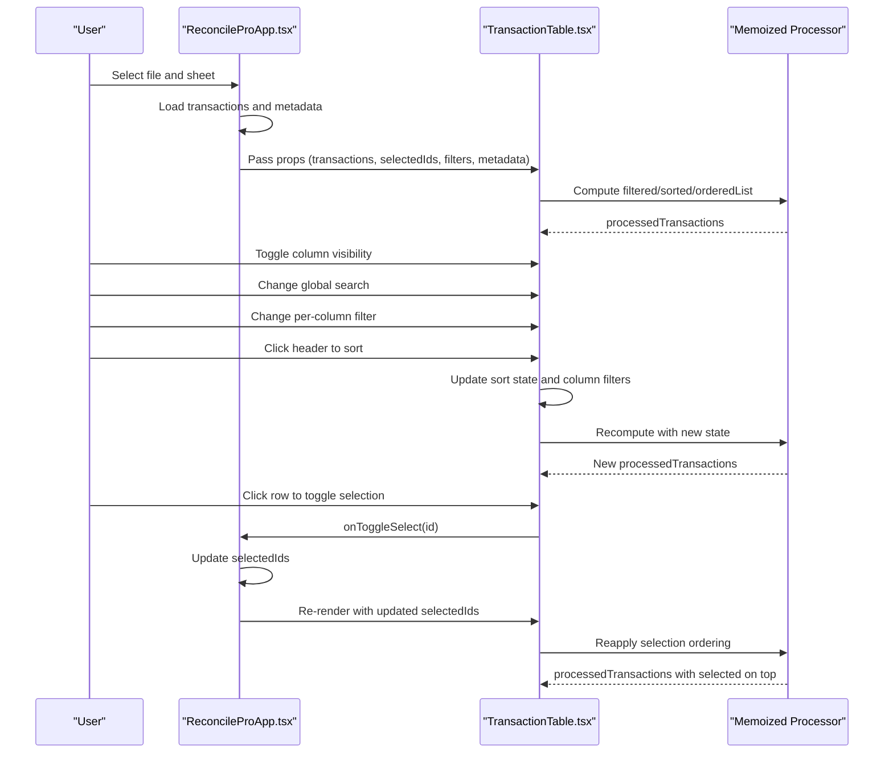
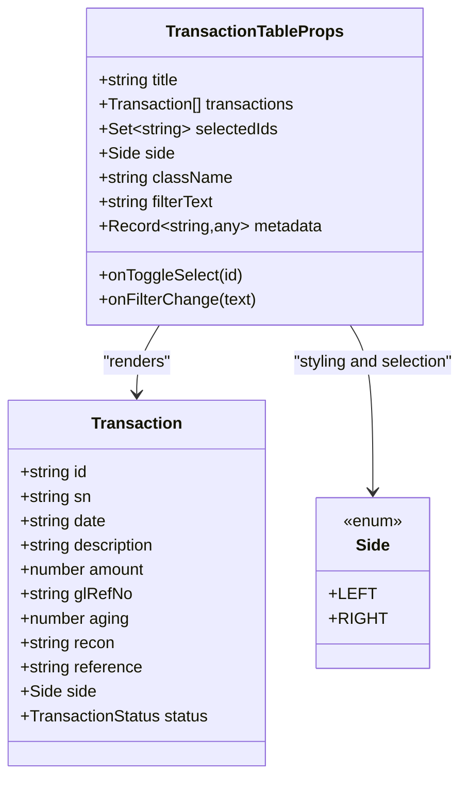
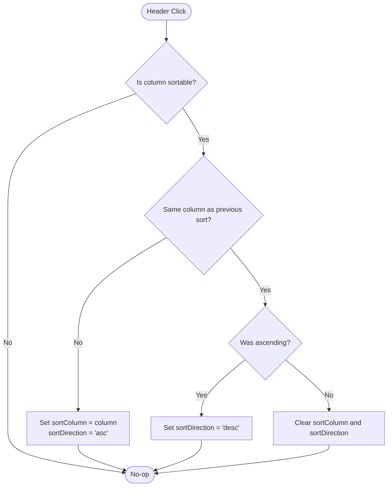
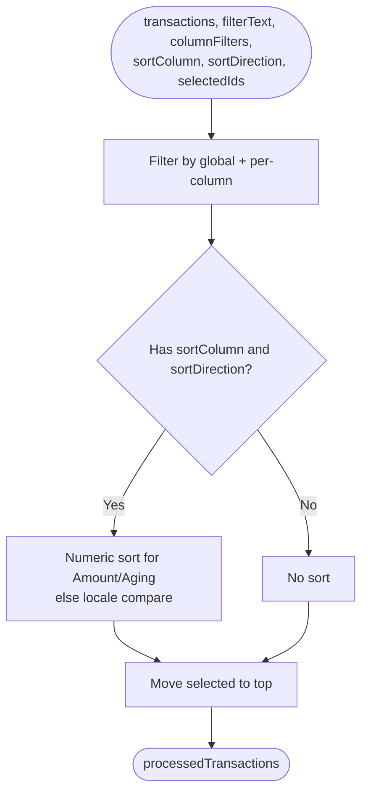
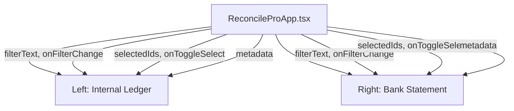
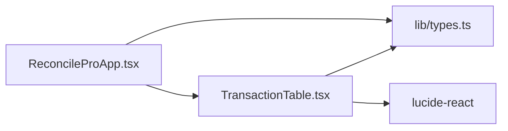

# TransactionTable Component

<cite>
**Referenced Files in This Document**
- [TransactionTable.tsx](file://components/TransactionTable.tsx)
- [ReconcileProApp.tsx](file://components/ReconcileProApp.tsx)
- [types.ts](file://lib/types.ts)
- [constants.ts](file://lib/constants.ts)
- [FEATURE_ENHANCEMENTS_SUMMARY.md](file://docs/FEATURE_ENHANCEMENTS_SUMMARY.md)
- [RECONCILE_APP_INTEGRATION.md](file://docs/RECONCILE_APP_INTEGRATION.md)
</cite>

## Table of Contents
1. [Introduction](#introduction)
2. [Project Structure](#project-structure)
3. [Core Components](#core-components)
4. [Architecture Overview](#architecture-overview)
5. [Detailed Component Analysis](#detailed-component-analysis)
6. [Dependency Analysis](#dependency-analysis)
7. [Performance Considerations](#performance-considerations)
8. [Troubleshooting Guide](#troubleshooting-guide)
9. [Conclusion](#conclusion)

## Introduction
TransactionTable is the primary interface for viewing and selecting financial transactions during reconciliation. It renders a sortable, filterable, and searchable table with support for column visibility toggles, per-column filters, and selection ordering. It integrates tightly with the reconciliation workflow by enabling users to select transactions from the Internal Ledger (Left) and Bank Statement (Right) panes for matching.

## Project Structure
TransactionTable is a self-contained React component that receives transaction data and selection state from its parent. In the reconciliation workflow, it is embedded in the workspace view alongside a matching control bar and history panel.

**Diagram sources**
- [ReconcileProApp.tsx](file://components/ReconcileProApp.tsx#L1150-L1178)
- [TransactionTable.tsx](file://components/TransactionTable.tsx#L1-L120)

**Section sources**
- [ReconcileProApp.tsx](file://components/ReconcileProApp.tsx#L1150-L1178)

## Core Components
- TransactionTable props:
  - title: string — pane title (e.g., Internal Ledger or Bank Statement)
  - transactions: Transaction[] — list of transactions to render
  - selectedIds: Set<string> — currently selected transaction ids
  - onToggleSelect: (id: string) => void — callback to toggle selection
  - side: Side — Left or Right to apply side-specific styling and selection colors
  - className?: string — additional container classes
  - filterText: string — global search text
  - onFilterChange: (text: string) => void — update global search
  - metadata?: Record<string, any> | null — sheet metadata for currency detection
- Column configuration:
  - Visibility toggles for SN, Date, Description, Amount, Reference, Dr/Cr, Aging
  - Sortable columns: Date, Description, Amount, Reference, Dr/Cr, SN, Aging
- Sorting:
  - Three-state cycling: Ascending → Descending → None
  - Numeric sorting for Amount and Aging; locale-aware string sorting otherwise
- Filtering:
  - Global search across all fields
  - Per-column filter inputs
- Currency handling:
  - Extract currency code from metadata (e.g., GENERAL LEDGER NAME)
  - Apply symbol mapping for display formatting
- Amount display:
  - DR transactions shown negative; CR transactions shown positive
  - Parentheses around negative amounts when currency symbol is present
- Memoized processing:
  - Filter, sort, and selection ordering performed efficiently via useMemo
- UI:
  - Sticky headers, scrollable container, responsive design
  - Visual feedback for selected rows and hover states

**Section sources**
- [TransactionTable.tsx](file://components/TransactionTable.tsx#L18-L29)
- [TransactionTable.tsx](file://components/TransactionTable.tsx#L106-L114)
- [TransactionTable.tsx](file://components/TransactionTable.tsx#L116-L129)
- [TransactionTable.tsx](file://components/TransactionTable.tsx#L131-L150)
- [TransactionTable.tsx](file://components/TransactionTable.tsx#L152-L173)
- [TransactionTable.tsx](file://components/TransactionTable.tsx#L175-L196)
- [TransactionTable.tsx](file://components/TransactionTable.tsx#L198-L212)
- [TransactionTable.tsx](file://components/TransactionTable.tsx#L214-L223)
- [TransactionTable.tsx](file://components/TransactionTable.tsx#L224-L258)
- [TransactionTable.tsx](file://components/TransactionTable.tsx#L260-L290)
- [TransactionTable.tsx](file://components/TransactionTable.tsx#L291-L503)
- [types.ts](file://lib/types.ts#L41-L58)

## Architecture Overview
TransactionTable participates in the reconciliation workflow by rendering transaction lists for the Left and Right sides. The parent component manages selection state and passes it down along with filters and metadata. Sorting and filtering are handled locally for responsiveness, while selection ordering ensures selected items appear first.

**Diagram sources**
- [ReconcileProApp.tsx](file://components/ReconcileProApp.tsx#L1150-L1178)
- [TransactionTable.tsx](file://components/TransactionTable.tsx#L224-L258)
- [TransactionTable.tsx](file://components/TransactionTable.tsx#L267-L290)

## Detailed Component Analysis

### Props and Data Model
- Transaction model includes seven Excel columns plus legacy fields for compatibility.
- Side enum distinguishes Left (Internal Ledger) and Right (Bank Statement).
- Metadata can include GENERAL LEDGER NAME used for currency detection.

**Diagram sources**
- [types.ts](file://lib/types.ts#L41-L58)
- [TransactionTable.tsx](file://components/TransactionTable.tsx#L18-L29)

**Section sources**
- [types.ts](file://lib/types.ts#L1-L132)
- [TransactionTable.tsx](file://components/TransactionTable.tsx#L18-L29)

### Column Configuration and Visibility
- Default visible columns include SN, Date, Description, Amount, Reference, Dr/Cr, Aging.
- Users can toggle visibility via a dropdown menu.
- Only visible columns are rendered in the header and rows.

**Section sources**
- [TransactionTable.tsx](file://components/TransactionTable.tsx#L106-L114)
- [TransactionTable.tsx](file://components/TransactionTable.tsx#L301-L319)

### Sorting and Visual Indicators
- Clicking a sortable header cycles direction: Ascending → Descending → None.
- Visual indicator shows active sort direction.
- Numeric sorting for Amount and Aging; locale-aware string comparison otherwise.

**Diagram sources**
- [TransactionTable.tsx](file://components/TransactionTable.tsx#L267-L290)

**Section sources**
- [TransactionTable.tsx](file://components/TransactionTable.tsx#L267-L290)

### Comprehensive Search and Column-Specific Filters
- Global search scans Date, Description, Amount, Reference, Dr/Cr, SN, Aging.
- Per-column filter inputs refine results independently.
- Both filters are applied before sorting and selection ordering.

**Section sources**
- [TransactionTable.tsx](file://components/TransactionTable.tsx#L198-L212)
- [TransactionTable.tsx](file://components/TransactionTable.tsx#L214-L223)
- [TransactionTable.tsx](file://components/TransactionTable.tsx#L224-L258)

### Currency Detection and Formatting
- Currency code extracted from metadata GENERAL LEDGER NAME.
- Symbol mapping applied for display formatting; amounts formatted to two decimals.
- Negative amounts for DR transactions are shown with parentheses when a symbol is present.

**Section sources**
- [TransactionTable.tsx](file://components/TransactionTable.tsx#L48-L64)
- [TransactionTable.tsx](file://components/TransactionTable.tsx#L131-L150)
- [TransactionTable.tsx](file://components/TransactionTable.tsx#L152-L173)

### Amount Interpretation and Display
- getDisplayAmount enforces DR as negative and CR as positive.
- Parentheses surround negative amounts when currency symbol is present.
- Aging and Amount columns support numeric sorting.

**Section sources**
- [TransactionTable.tsx](file://components/TransactionTable.tsx#L152-L173)
- [TransactionTable.tsx](file://components/TransactionTable.tsx#L434-L441)

### Memoized Data Processing Pipeline
- Filter by global search and per-column filters.
- Sort by selected column and direction.
- Move selected transactions to the top while preserving relative order within selections and non-selections.

**Diagram sources**
- [TransactionTable.tsx](file://components/TransactionTable.tsx#L224-L258)

**Section sources**
- [TransactionTable.tsx](file://components/TransactionTable.tsx#L224-L258)

### UI Implementation Details
- Sticky header with sort indicators and column filter row.
- Responsive design with horizontal scrolling.
- Visual feedback:
  - Hover highlights
  - Selected rows use side-specific background and accent colors
  - Checkbox for selection with side-specific colors
- Empty state with icon and message.

**Section sources**
- [TransactionTable.tsx](file://components/TransactionTable.tsx#L291-L503)

### Integration in Reconciliation Workflow
- Two TransactionTable instances are rendered side-by-side:
  - Left: Internal Ledger (A)
  - Right: Bank Statement (B)
- Parent maintains separate selection sets for each side and a shared filter per side.
- Metadata passed to both tables enables currency detection.

**Diagram sources**
- [ReconcileProApp.tsx](file://components/ReconcileProApp.tsx#L1150-L1178)
- [TransactionTable.tsx](file://components/TransactionTable.tsx#L18-L29)

**Section sources**
- [ReconcileProApp.tsx](file://components/ReconcileProApp.tsx#L1150-L1178)
- [RECONCILE_APP_INTEGRATION.md](file://docs/RECONCILE_APP_INTEGRATION.md#L127-L164)

## Dependency Analysis
- Internal dependencies:
  - Uses Side enum and Transaction interface from lib/types.ts
  - Uses constants for thresholds and limits elsewhere in the app
- External dependencies:
  - lucide-react icons for UI affordances
  - React hooks for state and memoization
- Parent-child relationships:
  - ReconcileProApp manages selection state and passes it down
  - TransactionTable exposes onToggleSelect for parent to update selection

**Diagram sources**
- [TransactionTable.tsx](file://components/TransactionTable.tsx#L1-L10)
- [types.ts](file://lib/types.ts#L1-L132)
- [ReconcileProApp.tsx](file://components/ReconcileProApp.tsx#L1-L20)

**Section sources**
- [TransactionTable.tsx](file://components/TransactionTable.tsx#L1-L10)
- [types.ts](file://lib/types.ts#L1-L132)
- [ReconcileProApp.tsx](file://components/ReconcileProApp.tsx#L1-L20)

## Performance Considerations
- Memoization:
  - Use useMemo for the entire pipeline: filter → sort → selection ordering to avoid re-computation on trivial prop changes.
- Virtualization:
  - For very large datasets, consider replacing the table body with a virtualized list (e.g., react-window) to limit DOM nodes and improve scroll performance.
- Efficient filtering:
  - Keep per-column filters lightweight; avoid expensive regex operations.
- Rendering:
  - Minimize re-renders by passing stable callbacks and avoiding unnecessary prop churn.
- Sorting:
  - Numeric comparisons are O(n log n); keep dataset sizes manageable or pre-normalize Amount and Aging to strings for faster comparisons if needed.

[No sources needed since this section provides general guidance]

## Troubleshooting Guide
- Large datasets cause slow sorting or scrolling:
  - Enable virtualization for large lists.
  - Reduce per-column filter complexity.
- Sort/filter state resets unexpectedly:
  - Ensure parent passes stable references for transactions and selectedIds.
  - Confirm filterText and onFilterChange are controlled props.
- Currency symbol not appearing:
  - Verify metadata contains GENERAL LEDGER NAME with a supported 3-letter currency code.
  - Check that the code is recognized by the mapping.
- DR/CR display anomalies:
  - Confirm recon values include “DR” or “CR” markers.
  - getDisplayAmount forces negative for DR and positive for CR; verify recon values are consistent.
- Selection ordering not updating:
  - Ensure selectedIds is a Set and passed as a stable reference.
  - Verify onToggleSelect updates the parent’s selection state and triggers re-render.

**Section sources**
- [TransactionTable.tsx](file://components/TransactionTable.tsx#L48-L64)
- [TransactionTable.tsx](file://components/TransactionTable.tsx#L152-L173)
- [TransactionTable.tsx](file://components/TransactionTable.tsx#L224-L258)

## Conclusion
TransactionTable is a robust, performance-conscious component designed for the reconciliation workflow. Its combination of global and per-column filtering, three-state sorting, currency-aware formatting, and selection ordering makes it ideal for quickly scanning and matching transactions across internal ledgers and bank statements. By leveraging memoization and considering virtualization for large datasets, teams can maintain responsiveness while performing complex reconciliations.