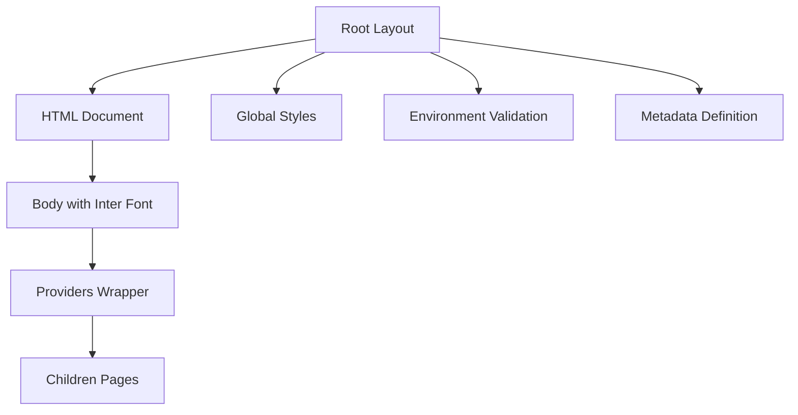
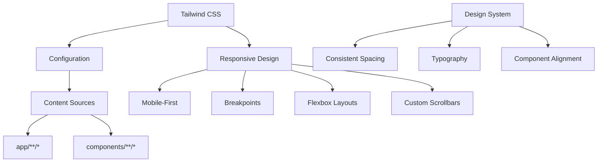
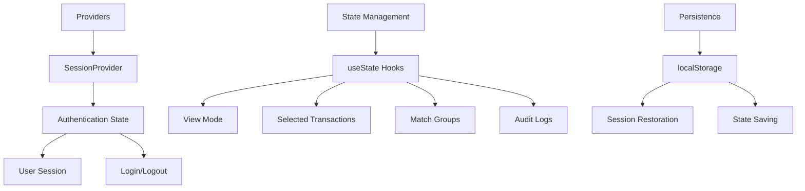
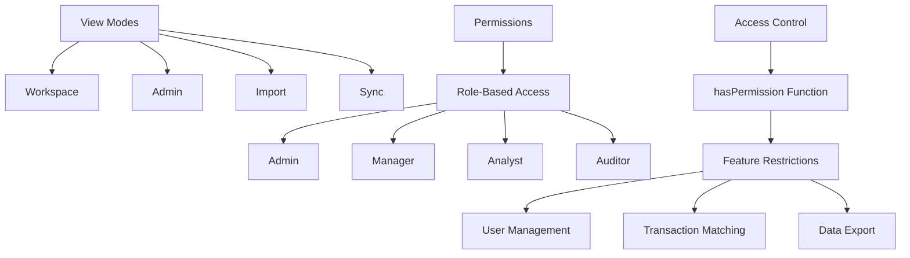
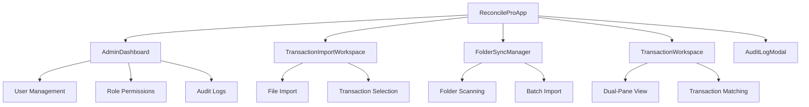
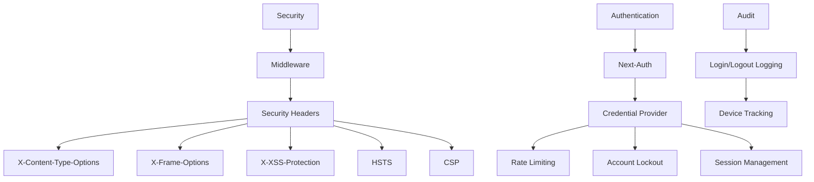
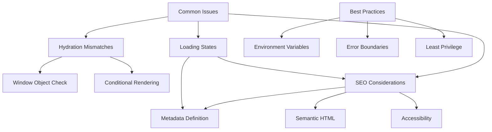
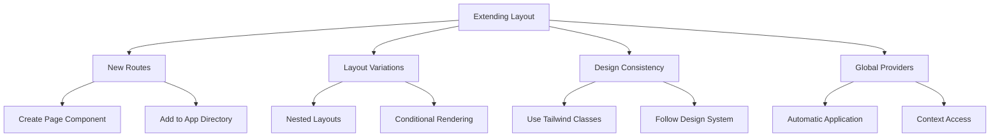

# UI Layout and Routing Structure

<cite>
**Referenced Files in This Document**   
- [app/layout.tsx](file://app/layout.tsx)
- [app/page.tsx](file://app/page.tsx)
- [app/providers.tsx](file://app/providers.tsx)
- [app/globals.css](file://app/globals.css)
- [components/ReconcileProApp.tsx](file://components/ReconcileProApp.tsx)
- [app/login/page.tsx](file://app/login/page.tsx)
- [middleware.ts](file://middleware.ts)
- [lib/auth.ts](file://lib/auth.ts)
- [tailwind.config.ts](file://tailwind.config.ts)
- [lib/constants.ts](file://lib/constants.ts)
- [components/AdminDashboard.tsx](file://components/AdminDashboard.tsx)
- [components/TransactionImportWorkspace.tsx](file://components/TransactionImportWorkspace.tsx)
- [components/FolderSyncManager.tsx](file://components/FolderSyncManager.tsx)
</cite>

## Table of Contents
1. [Introduction](#introduction)
2. [Root Layout Structure](#root-layout-structure)
3. [Routing and Navigation](#routing-and-navigation)
4. [Responsive Design with Tailwind CSS](#responsive-design-with-tailwind-css)
5. [Global Providers and State Management](#global-providers-and-state-management)
6. [View Mode Routing and Permission-Based Access](#view-mode-routing-and-permission-based-access)
7. [Component Hierarchy and Integration](#component-hierarchy-and-integration)
8. [Security and Middleware Configuration](#security-and-middleware-configuration)
9. [Common Issues and Best Practices](#common-issues-and-best-practices)
10. [Extending the Layout Structure](#extending-the-layout-structure)

## Introduction
The analyzer-web application is built on the Next.js App Router convention, providing a robust UI layout and routing structure for a financial reconciliation system. This documentation details the architecture of the application's layout, routing mechanism, responsive design approach, and integration of global providers. The system implements role-based access control, responsive layouts using Tailwind CSS, and a modular component structure that supports multiple view modes including workspace, admin, import, and sync functionalities.

**Section sources**
- [app/layout.tsx](file://app/layout.tsx#L1-L36)
- [app/page.tsx](file://app/page.tsx#L1-L6)
- [components/ReconcileProApp.tsx](file://components/ReconcileProApp.tsx#L1-L800)

## Root Layout Structure
The root layout of the analyzer-web application is defined in `layout.tsx`, which serves as the foundation for all pages in the application. This layout provides global styles, wraps the entire application with necessary providers, and ensures consistent UI elements across all routes. The layout component imports the Inter font from Google Fonts and applies it as a CSS variable for consistent typography throughout the application.

The layout includes the `globals.css` file which contains Tailwind CSS directives and custom scrollbar styling. It also implements environment validation during server-side rendering to ensure the application starts with proper configuration. The metadata for the application is defined here, including the title "Analyzer Web - Manual Matching System" and a description of the reconciliation functionality.



**Diagram sources**
- [app/layout.tsx](file://app/layout.tsx#L1-L36)
- [app/globals.css](file://app/globals.css#L1-L29)

**Section sources**
- [app/layout.tsx](file://app/layout.tsx#L1-L36)
- [app/globals.css](file://app/globals.css#L1-L29)

## Routing and Navigation
The application follows Next.js App Router conventions with a clear routing structure. The main application route is defined in `page.tsx`, which renders the `ReconcileProApp` component within the root layout. This creates the primary entry point for authenticated users. The login page is located at `app/login/page.tsx` and provides a dedicated authentication interface.

The middleware configuration in `middleware.ts` controls access to protected routes, redirecting unauthenticated users to the login page. The matcher configuration excludes static assets, API routes, and the login page from authentication requirements. This ensures that only application routes require authentication while allowing public access to necessary resources.

```mermaid
graph TD
A[Application Routes] --> B[/ (Home)]
A --> C[/login]
A --> D[/api/*]
B --> E[ReconcileProApp]
C --> F[Login Page]
D --> G[API Endpoints]
H[Middleware] --> I[Authentication Check]
I --> |Authenticated| J[Allow Access]
I --> |Not Authenticated| K[Redirect to /login]
```

**Diagram sources**
- [app/page.tsx](file://app/page.tsx#L1-L6)
- [app/login/page.tsx](file://app/login/page.tsx#L1-L236)
- [middleware.ts](file://middleware.ts#L1-L56)

**Section sources**
- [app/page.tsx](file://app/page.tsx#L1-L6)
- [app/login/page.tsx](file://app/login/page.tsx#L1-L236)
- [middleware.ts](file://middleware.ts#L1-L56)

## Responsive Design with Tailwind CSS
The application implements a responsive design approach using Tailwind CSS for consistent spacing, typography, and component alignment. The Tailwind configuration in `tailwind.config.ts` specifies the content sources to scan for utility classes, ensuring all components in the app and components directories are included in the build process.

The design system uses a mobile-first approach with responsive breakpoints that adapt to different screen sizes. Components like `TransactionWorkspace` use flexbox layouts with responsive width classes (w-1/2) to create a dual-pane interface that adjusts to viewport size. The application also implements custom scrollbar styling for tables and scrollable areas, enhancing the user experience on various devices.



**Diagram sources**
- [tailwind.config.ts](file://tailwind.config.ts#L1-L17)
- [app/globals.css](file://app/globals.css#L1-L29)
- [components/TransactionWorkspace.tsx](file://components/TransactionWorkspace.tsx#L1-L60)

**Section sources**
- [tailwind.config.ts](file://tailwind.config.ts#L1-L17)
- [app/globals.css](file://app/globals.css#L1-L29)
- [components/TransactionWorkspace.tsx](file://components/TransactionWorkspace.tsx#L1-L60)

## Global Providers and State Management
The application uses a providers pattern to wrap the entire application with global context providers. The `providers.tsx` file exports a `Providers` component that wraps children with the `SessionProvider` from Next-Auth, enabling authentication state management across the application. This client-side provider allows components to access session data and authentication status throughout the application.

The `ReconcileProApp` component manages application state including user permissions, transaction data, match groups, and audit logs. It uses React's useState and useEffect hooks for state management and implements a checkpoint system for undo/redo functionality. The application also uses localStorage to persist state between sessions, ensuring users can resume their work after navigating away.



**Diagram sources**
- [app/providers.tsx](file://app/providers.tsx#L1-L8)
- [components/ReconcileProApp.tsx](file://components/ReconcileProApp.tsx#L1-L800)

**Section sources**
- [app/providers.tsx](file://app/providers.tsx#L1-L8)
- [components/ReconcileProApp.tsx](file://components/ReconcileProApp.tsx#L1-L800)

## View Mode Routing and Permission-Based Access
The application implements a view mode system that determines which interface to display based on user permissions and navigation state. The `ReconcileProApp` component manages the current view mode through the `currentView` state variable, which can be set to 'workspace', 'admin', 'import', or 'sync'. This allows the application to present different interfaces for different user roles and tasks.

Permission-based access is implemented through the `hasPermission` function, which checks if a user's role has the required permission. The application uses role-based permissions defined in `constants.ts`, where different roles (Admin, Manager, Analyst, Auditor) have varying levels of access to features like user management, transaction matching, and data export. This ensures that users can only access functionality appropriate to their role.



**Diagram sources**
- [components/ReconcileProApp.tsx](file://components/ReconcileProApp.tsx#L1-L800)
- [lib/constants.ts](file://lib/constants.ts#L1-L50)

**Section sources**
- [components/ReconcileProApp.tsx](file://components/ReconcileProApp.tsx#L1-L800)
- [lib/constants.ts](file://lib/constants.ts#L1-L50)

## Component Hierarchy and Integration
The application follows a modular component hierarchy with clear separation of concerns. The `ReconcileProApp` component serves as the main application container, integrating various specialized components based on the current view mode. Key components include `AdminDashboard`, `TransactionImportWorkspace`, and `FolderSyncManager`, each providing specific functionality.

The component integration follows a parent-child relationship where state is passed down through props and callbacks. For example, the `TransactionImportWorkspace` component manages file import functionality and passes transaction data to the main reconciliation interface. The `AdminDashboard` component provides administrative functions with tabs for user management, role permissions, audit logs, and system settings.



**Diagram sources**
- [components/ReconcileProApp.tsx](file://components/ReconcileProApp.tsx#L1-L800)
- [components/AdminDashboard.tsx](file://components/AdminDashboard.tsx#L1-L200)
- [components/TransactionImportWorkspace.tsx](file://components/TransactionImportWorkspace.tsx#L1-L119)
- [components/FolderSyncManager.tsx](file://components/FolderSyncManager.tsx#L1-L200)

**Section sources**
- [components/ReconcileProApp.tsx](file://components/ReconcileProApp.tsx#L1-L800)
- [components/AdminDashboard.tsx](file://components/AdminDashboard.tsx#L1-L200)
- [components/TransactionImportWorkspace.tsx](file://components/TransactionImportWorkspace.tsx#L1-L119)
- [components/FolderSyncManager.tsx](file://components/FolderSyncManager.tsx#L1-L200)

## Security and Middleware Configuration
The application implements comprehensive security measures through middleware and authentication configuration. The `middleware.ts` file defines security headers including X-Content-Type-Options, X-Frame-Options, and X-XSS-Protection to prevent common web vulnerabilities. In production, it also enforces HTTPS through Strict-Transport-Security (HSTS).

The Content Security Policy (CSP) is configured to allow only trusted sources for scripts, styles, and other resources, reducing the risk of cross-site scripting attacks. The application uses Next-Auth for authentication with credential-based login, implementing rate limiting and account lockout after multiple failed attempts as defined in `auth.ts`. The authentication system also tracks device sessions and logs login/logout events for audit purposes.



**Diagram sources**
- [middleware.ts](file://middleware.ts#L1-L56)
- [lib/auth.ts](file://lib/auth.ts#L1-L225)

**Section sources**
- [middleware.ts](file://middleware.ts#L1-L56)
- [lib/auth.ts](file://lib/auth.ts#L1-L225)

## Common Issues and Best Practices
The application addresses several common issues in Next.js applications, particularly around hydration mismatches between server and client rendering. The layout component uses conditional rendering based on the window object to prevent client-specific code from executing during server-side rendering. The application also implements proper loading state management, showing loading indicators during authentication checks and data fetching operations.

For SEO considerations, the application defines metadata in the root layout, including title and description. The use of semantic HTML and proper heading hierarchy enhances accessibility and search engine visibility. Best practices include using environment variables for configuration, implementing proper error boundaries, and following the principle of least privilege for role-based access control.



**Diagram sources**
- [app/layout.tsx](file://app/layout.tsx#L1-L36)
- [app/login/page.tsx](file://app/login/page.tsx#L1-L236)
- [components/ReconcileProApp.tsx](file://components/ReconcileProApp.tsx#L1-L800)

**Section sources**
- [app/layout.tsx](file://app/layout.tsx#L1-L36)
- [app/login/page.tsx](file://app/login/page.tsx#L1-L236)
- [components/ReconcileProApp.tsx](file://components/ReconcileProApp.tsx#L1-L800)

## Extending the Layout Structure
The application's layout structure is designed to be extensible, allowing for the addition of new routes and layout variations while maintaining design consistency. New routes can be added by creating additional page components in the app directory, following the same pattern as the existing pages. Layout variations can be implemented using nested layouts or conditional rendering based on route parameters.

To maintain design consistency, new components should use the existing Tailwind CSS classes and follow the established design system. Global providers are automatically applied to all routes through the root layout, ensuring consistent access to authentication state and other context. When adding new view modes, developers should follow the existing pattern of using the `currentView` state and updating the UI based on the selected mode.



**Diagram sources**
- [app/layout.tsx](file://app/layout.tsx#L1-L36)
- [app/page.tsx](file://app/page.tsx#L1-L6)
- [components/ReconcileProApp.tsx](file://components/ReconcileProApp.tsx#L1-L800)

**Section sources**
- [app/layout.tsx](file://app/layout.tsx#L1-L36)
- [app/page.tsx](file://app/page.tsx#L1-L6)
- [components/ReconcileProApp.tsx](file://components/ReconcileProApp.tsx#L1-L800)