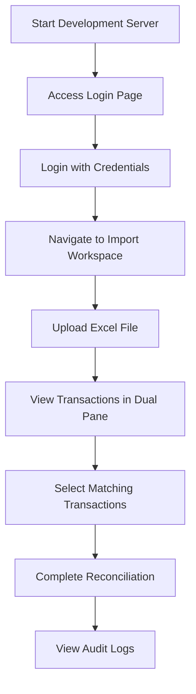

# Getting Started

<cite>
**Referenced Files in This Document**   
- [README.md](file://README.md)
- [package.json](file://package.json)
- [env-validation.ts](file://lib/env-validation.ts)
- [Dockerfile.dev](file://Dockerfile.dev)
- [docker-compose.yml](file://docker-compose.yml)
- [PRODUCTION_TROUBLESHOOTING.md](file://docs/PRODUCTION_TROUBLESHOOTING.md)
- [LOGIN_CREDENTIALS.md](file://docs/LOGIN_CREDENTIALS.md)
- [seed.ts](file://prisma/seeds/seed.ts)
- [init-admin.ts](file://prisma/init-admin.ts)
- [schema.prisma](file://prisma/schema.prisma)
- [page.tsx](file://app/login/page.tsx)
- [TransactionImportWorkspace.tsx](file://components/TransactionImportWorkspace.tsx)
- [DualPaneTransactionView.tsx](file://components/DualPaneTransactionView.tsx)
- [middleware.ts](file://middleware.ts)
- [auth.ts](file://lib/auth.ts)
</cite>

## Table of Contents
1. [Development Environment Setup](#development-environment-setup)
2. [Docker-Based Development Setup](#docker-based-development-setup)
3. [Database Initialization and Seeding](#database-initialization-and-seeding)
4. [Application Usage and Core Features](#application-usage-and-core-features)
5. [Troubleshooting Common Issues](#troubleshooting-common-issues)
6. [Performance Considerations](#performance-considerations)

## Development Environment Setup

To set up the analyzer-web development environment, follow these step-by-step instructions:

1. **Clone the repository:**
   ```bash
   git clone <repository-url>
   cd analyzer-web
   ```

2. **Install dependencies:**
   ```bash
   npm install
   ```

3. **Configure environment variables:**
   - Copy the template file: `cp .env.template .env`
   - Configure the following required variables in `.env`:
     - `NEXTAUTH_SECRET`: Generate with `openssl rand -base64 32`
     - `NEXTAUTH_URL`: Set to `http://localhost:3000` for development
     - `DATABASE_URL`: Set to `file:./dev.db` for SQLite development database
   - The environment validation at startup ensures all required variables are properly set

4. **Initialize the SQLite database:**
   ```bash
   npx prisma migrate deploy
   ```

5. **Start the development server:**
   ```bash
   npm run dev
   ```

6. **Access the application:**
   - Open your browser and navigate to `http://localhost:3000`
   - The login page is accessible at `/login`

**Section sources**
- [README.md](file://README.md#L27-L72)
- [package.json](file://package.json#L6-L7)
- [env-validation.ts](file://lib/env-validation.ts#L22-L170)
- [schema.prisma](file://prisma/schema.prisma#L1-L374)

## Docker-Based Development Setup

The analyzer-web application provides containerized development setup using Docker:

1. **Docker development configuration:**
   - The `Dockerfile.dev` defines a Node.js 20 Alpine base image
   - Dependencies are installed and Prisma client is generated during build
   - The development server starts with `npm run dev` command
   - Port 3000 is exposed for application access

2. **Docker Compose setup:**
   - The `docker-compose.yml` file defines two services:
     - `app`: The main Next.js application with volume mounting for hot-reloading
     - `redis`: Redis service for caching and session storage (Phase 2+)
   - Environment variables are configured for development:
     - `DATABASE_URL=file:./dev.db`
     - `NEXTAUTH_URL=http://localhost:3000`
     - `NEXTAUTH_SECRET=analyzer-web-dev-secret-key-123`
     - `NODE_ENV=development`

3. **Running the containerized environment:**
   ```bash
   docker-compose up --build
   ```
   - The application will be accessible at `http://localhost:3000`
   - Code changes are reflected immediately due to volume mounting
   - The Redis service runs on port 6379 for caching functionality

**Section sources**
- [Dockerfile.dev](file://Dockerfile.dev#L1-L21)
- [docker-compose.yml](file://docker-compose.yml#L1-L43)

## Database Initialization and Seeding

The analyzer-web application uses Prisma ORM with SQLite for database management:

1. **Initialize the production database:**
   ```bash
   npx prisma migrate deploy
   ```

2. **Create the initial admin user:**
   ```bash
   npm run init-admin
   ```
   - This script prompts for secure admin credentials
   - Password requirements: minimum 12 characters with uppercase, lowercase, numbers, and special characters
   - The script creates the admin user and generates an audit log entry

3. **Run database seeding (development/test only):**
   ```bash
   npx prisma db seed
   ```
   - This populates the database with sample data including:
     - Users with roles (ADMIN, MANAGER, ANALYST, AUDITOR)
     - Financial periods (Q4 2024 open, Q3 2024 closed)
     - Initial audit log entries
   - The seed script uses bcrypt to hash the default password "password123"

4. **Verify data population:**
   - Check that users are created with the expected roles and status
   - Verify financial periods are properly configured
   - Confirm audit logs are generated for initialization actions

**Section sources**
- [README.md](file://README.md#L53-L56)
- [package.json](file://package.json#L17)
- [seed.ts](file://prisma/seeds/seed.ts#L1-L130)
- [init-admin.ts](file://prisma/init-admin.ts#L1-L273)
- [schema.prisma](file://prisma/schema.prisma#L1-L374)

## Application Usage and Core Features

After setting up the development environment, you can explore the core features of analyzer-web:

1. **Login with provided credentials:**
   - Email: `admin@analyzerweb.com`
   - Password: `password123`
   - Alternative user credentials are available for different roles (MANAGER, ANALYST, AUDITOR)

2. **Navigate to the Transaction Import Workspace:**
   - Access the import functionality through the main application interface
   - The `TransactionImportWorkspace` component provides a dual-pane interface for transaction reconciliation

3. **Import Excel files:**
   - Use the import functionality to upload Excel files containing transaction data
   - The system validates account information and processes multi-sheet workbooks
   - Imported transactions are displayed with their metadata and values

4. **Reconcile transactions using DualPaneTransactionView:**
   - View GL transactions (INT CR, INT DR) in the left pane
   - View statement transactions (EXT DR, EXT CR) in the right pane
   - Select matching transactions from both sides for reconciliation
   - The interface shows transaction details including date, description, amount, and reference

5. **View audit logs:**
   - Access the audit log modal to review all user actions
   - Logs include timestamps, IP addresses, device information, and action details
   - The tamper detection system uses hash chains to ensure log integrity



**Diagram sources **
- [page.tsx](file://app/login/page.tsx#L1-L236)
- [TransactionImportWorkspace.tsx](file://components/TransactionImportWorkspace.tsx#L1-L119)
- [DualPaneTransactionView.tsx](file://components/DualPaneTransactionView.tsx#L1-L200)

**Section sources**
- [LOGIN_CREDENTIALS.md](file://docs/LOGIN_CREDENTIALS.md#L1-L113)
- [TransactionImportWorkspace.tsx](file://components/TransactionImportWorkspace.tsx#L1-L119)
- [DualPaneTransactionView.tsx](file://components/DualPaneTransactionView.tsx#L1-L200)

## Troubleshooting Common Issues

When setting up the analyzer-web development environment, you may encounter common issues. Here are solutions for the most frequent problems:

1. **Missing .env configuration:**
   - Ensure the `.env` file exists and contains all required variables
   - Verify `NEXTAUTH_SECRET` is set and at least 32 characters long
   - Check that `DATABASE_URL` points to the correct SQLite file path
   - Use the environment validation tool to identify missing or invalid variables

2. **Prisma migration errors:**
   - Ensure the database directory has proper read/write permissions
   - Verify the `DATABASE_URL` in `.env` matches the actual database file path
   - Run `npx prisma generate` to regenerate the Prisma client if schema changes were made
   - Check that the SQLite database file is not locked by another process

3. **Docker networking problems:**
   - Ensure Docker and Docker Compose are properly installed and running
   - Verify port 3000 is not already in use by another application
   - Check that the volume mounts in `docker-compose.yml` are correctly configured
   - Ensure the network bridge is properly created between services

4. **Authentication issues:**
   - Verify `NEXTAUTH_URL` matches the exact domain and protocol (http/https) being used
   - Ensure `NEXTAUTH_SECRET` is consistent between build and runtime environments
   - Check that the admin user has been properly initialized with `npm run init-admin`
   - Use the diagnostic tools to verify user accounts and password hashes

5. **Additional troubleshooting resources:**
   - Refer to `PRODUCTION_TROUBLESHOOTING.md` for detailed diagnostic steps
   - Use the provided scripts to check users, reset passwords, and diagnose production issues
   - Consult the login credentials guide for user management and password reset procedures

**Section sources**
- [PRODUCTION_TROUBLESHOOTING.md](file://docs/PRODUCTION_TROUBLESHOOTING.md#L1-L377)
- [LOGIN_CREDENTIALS.md](file://docs/LOGIN_CREDENTIALS.md#L1-L113)
- [env-validation.ts](file://lib/env-validation.ts#L22-L170)
- [auth.ts](file://lib/auth.ts#L3-L225)

## Performance Considerations

When developing and deploying analyzer-web, consider these performance aspects:

1. **Local development vs. production deployment:**
   - Development: Uses SQLite with file-based storage, suitable for single-user testing
   - Production: Consider PostgreSQL or MySQL for better concurrent write performance and scalability
   - The current SQLite implementation has limitations for high-volume deployments

2. **Rate limiting and security:**
   - In-memory rate limiting resets on server restart (single-instance limitation)
   - For multi-instance deployments, implement Redis-backed rate limiting
   - Failed login attempt tracking resets on restart in the current implementation

3. **Database performance:**
   - SQLite has limited concurrent write performance
   - Single database file approach is not horizontally scalable
   - Consider connection pooling and query optimization for high-traffic scenarios

4. **Caching strategy:**
   - Redis is included in the Docker configuration for caching and session storage
   - Implement Redis for session management in multi-instance deployments
   - Use Redis to store frequently accessed data and reduce database load

5. **Optimization recommendations:**
   - For production deployments, migrate from SQLite to PostgreSQL or MySQL
   - Implement Redis for session storage and rate limiting in multi-instance setups
   - Enable HTTPS in production for secure cookie transmission
   - Monitor database performance and optimize queries as data volume grows

**Section sources**
- [README.md](file://README.md#L214-L223)
- [docker-compose.yml](file://docker-compose.yml#L1-L43)
- [middleware.ts](file://middleware.ts#L1-L56)
- [auth.ts](file://lib/auth.ts#L14-L16)