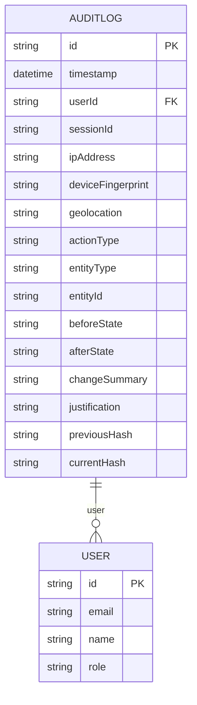
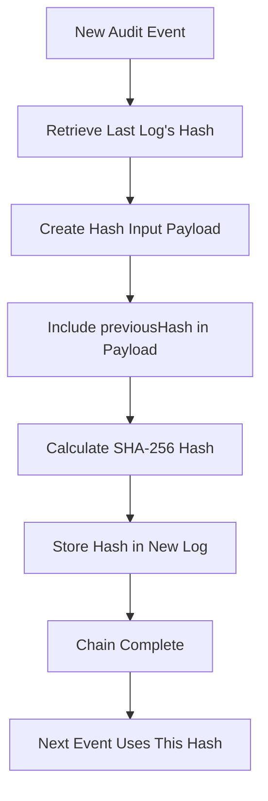
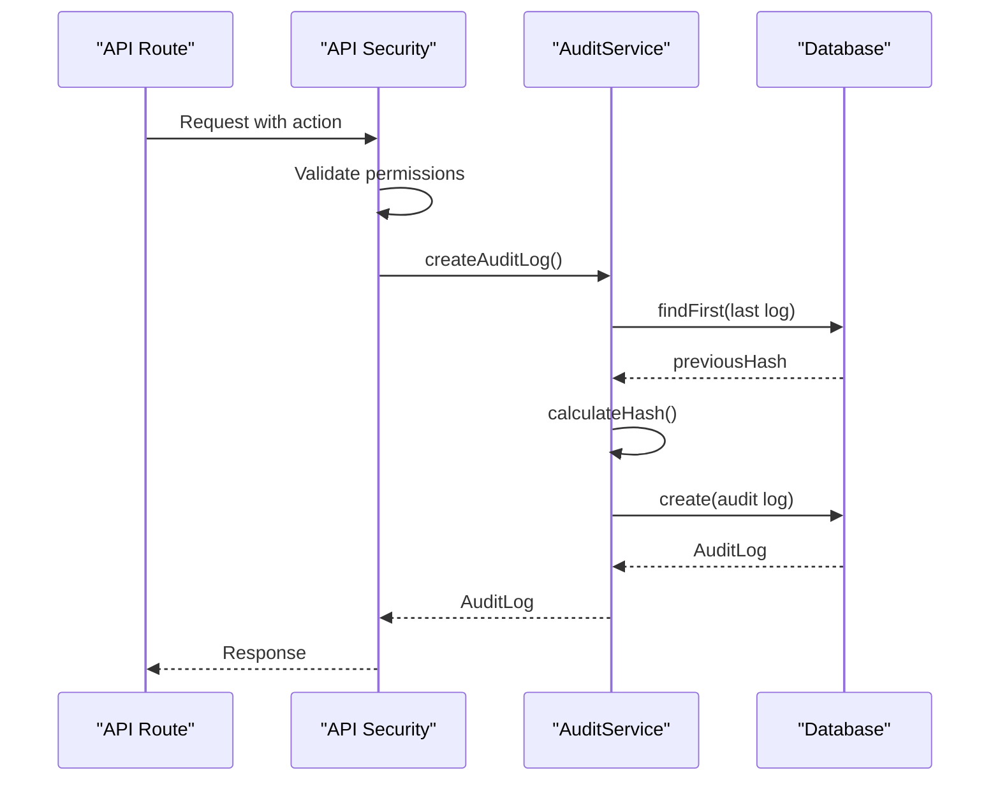
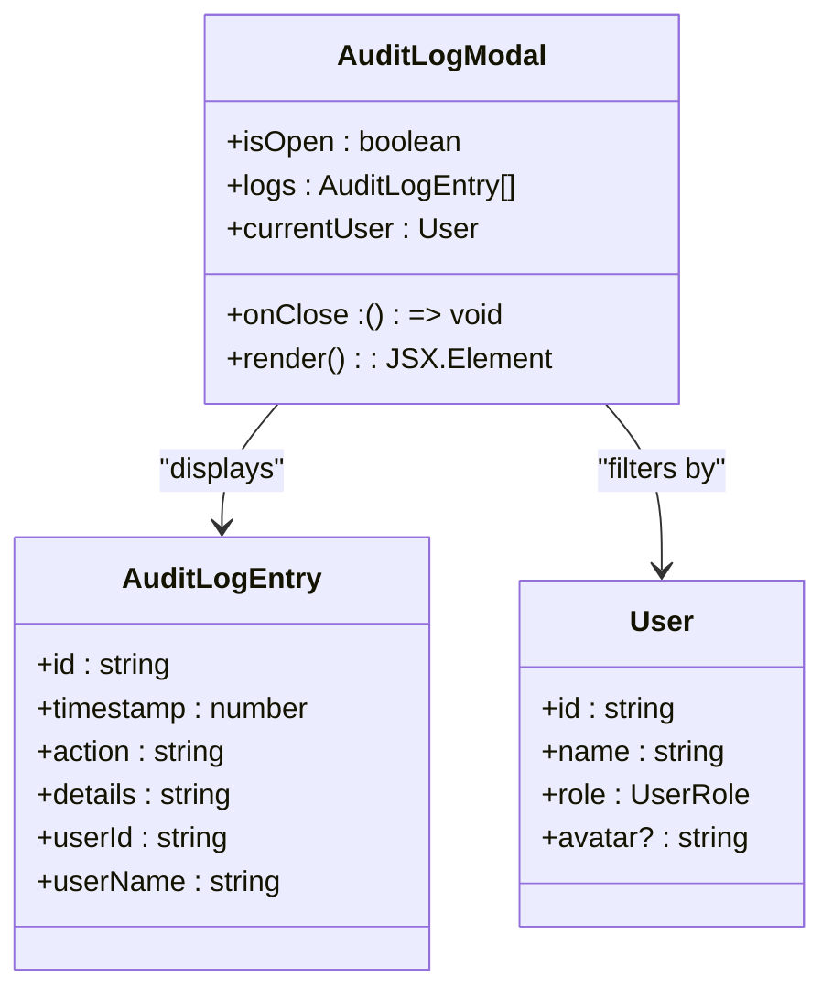

# Audit Service

<cite>
**Referenced Files in This Document**   
- [AuditService.ts](file://services/AuditService.ts)
- [api-security.ts](file://lib/api-security.ts)
- [schema.prisma](file://prisma/schema.prisma)
- [AuditLogModal.tsx](file://components/AuditLogModal.tsx)
- [SnapshotHistoryModal.tsx](file://components/SnapshotHistoryModal.tsx)
- [types.ts](file://lib/types.ts)
- [admin/users/route.ts](file://app/api/admin/users/route.ts)
- [transactions/import/route.ts](file://app/api/transactions/import/route.ts)
</cite>

## Table of Contents
1. [Introduction](#introduction)
2. [Domain Model](#domain-model)
3. [Cryptographic Chain Implementation](#cryptographic-chain-implementation)
4. [Core Methods](#core-methods)
5. [Integration with UI Components](#integration-with-ui-components)
6. [Security and Compliance Features](#security-and-compliance-features)
7. [Performance and Scalability](#performance-and-scalability)
8. [Best Practices and Recommendations](#best-practices-and-recommendations)

## Introduction
The AuditService component in the analyzer-web application provides immutable audit logging with cryptographic chain verification to ensure data integrity and compliance. This service captures all critical system actions, creating a tamper-evident record that can be verified through cryptographic hashing. The implementation follows a service layer pattern, providing a clean separation of concerns and enabling reuse across the application. The audit logs are stored in a dedicated AuditLog entity with comprehensive metadata including user context, network information, and state changes.

**Section sources**
- [AuditService.ts](file://services/AuditService.ts#L1-L263)
- [schema.prisma](file://prisma/schema.prisma#L158-L192)

## Domain Model
The audit logging system is built around several key domain models that define the structure and relationships of audit data. The core entity is AuditLog, which captures comprehensive information about each auditable action in the system. Supporting interfaces define the input and filtering parameters for audit operations.

### AuditLog Entity
The AuditLog entity in the Prisma schema represents a single audit log entry with comprehensive metadata:

**Diagram sources**
- [schema.prisma](file://prisma/schema.prisma#L158-L192)

### Input and Filter Interfaces
The service defines two key interfaces for audit operations:

- **CreateAuditLogInput**: Specifies the parameters required to create a new audit log entry, including user context, action details, entity information, and optional before/after states
- **AuditLogFilter**: Defines filtering criteria for retrieving audit logs by user, action type, entity type, date range, and result limits

The beforeState and afterState properties are stored as JSON strings in the database, allowing flexible capture of entity state changes without schema constraints.

**Section sources**
- [AuditService.ts](file://services/AuditService.ts#L9-L31)
- [schema.prisma](file://prisma/schema.prisma#L179-L182)

## Cryptographic Chain Implementation
The AuditService implements a cryptographic chaining mechanism that creates an immutable, tamper-evident log of system activities. This implementation uses SHA-256 hashing to create a verifiable chain of custody for audit records.

### Hash Calculation Process
The createAuditLog method implements the cryptographic chain by incorporating the previous log's hash into the current hash calculation:

1. Retrieve the most recent audit log entry to obtain its currentHash value
2. Use this hash as the previousHash input for the new log entry
3. Calculate the currentHash by hashing a JSON payload containing key log properties and the previousHash
4. Store both previousHash and currentHash in the new audit log entry

This creates a linked chain where each log entry cryptographically references the previous entry, making any tampering evident through hash mismatches.

**Diagram sources**
- [AuditService.ts](file://services/AuditService.ts#L37-L68)

### Chain Verification Algorithm
The verifyAuditChain method provides a comprehensive integrity check for the entire audit log sequence:

1. Retrieve all audit logs in chronological order
2. For each log entry (except the first), verify two conditions:
   - The previousHash matches the currentHash of the preceding log
   - The currentHash matches a recalculated hash of the log's content
3. Return validation results with detailed error messages for any discrepancies

This dual verification ensures both chain continuity and content integrity.

**Section sources**
- [AuditService.ts](file://services/AuditService.ts#L155-L199)

## Core Methods
The AuditService exposes several key methods that provide comprehensive audit logging capabilities.

### createAuditLog Method
The createAuditLog method is the primary entry point for recording audit events in the system. It accepts a CreateAuditLogInput object containing all relevant context and creates a new audit log entry with cryptographic chain verification.

The method follows a transactional pattern, ensuring atomicity of the audit log creation. It captures comprehensive context including user identity, session information, network details, action metadata, and optional before/after states of the affected entity.

**Diagram sources**
- [AuditService.ts](file://services/AuditService.ts#L37-L68)
- [api-security.ts](file://lib/api-security.ts#L138-L150)

### Other Key Methods
The service provides several additional methods for audit log management:

- **getAuditLogs**: Retrieves audit logs with optional filtering by user, action type, entity type, and date range
- **getEntityAuditTrail**: Returns the complete audit history for a specific entity, ordered chronologically
- **getUserActivitySummary**: Generates a summary of user activity including action counts by type and recent actions
- **verifyAuditChain**: Performs comprehensive integrity verification of the entire audit log chain

These methods support various use cases from compliance reporting to forensic analysis.

**Section sources**
- [AuditService.ts](file://services/AuditService.ts#L77-L258)

## Integration with UI Components
The AuditService is integrated with several UI components that provide audit log visualization and management capabilities.

### AuditLogModal Component
The AuditLogModal component displays audit logs to users with role-based access control:

- Managers can view all system audit logs
- Analysts can only view their own audit logs
- The modal displays key information including timestamp, user, action, and details
- Logs are presented in reverse chronological order
- The component includes summary statistics based on user role

The modal is typically triggered from administrative interfaces and provides a comprehensive view of system activity.

**Diagram sources**
- [AuditLogModal.tsx](file://components/AuditLogModal.tsx#L7-L93)
- [types.ts](file://lib/types.ts#L84-L91)

### SnapshotHistoryModal Component
The SnapshotHistoryModal component integrates with the audit system by providing version history and restoration capabilities:

- Displays system snapshots with creation metadata
- Shows snapshot statistics including transaction and match counts
- Allows restoration of previous states
- Provides visual indicators for snapshot types (IMPORT, MANUAL, AUTO)
- Includes creation context such as user and timestamp

This component enables users to review and restore system states, with all restoration actions being audited through the AuditService.

**Section sources**
- [SnapshotHistoryModal.tsx](file://components/SnapshotHistoryModal.tsx#L7-L131)

## Security and Compliance Features
The AuditService implements several security-critical features that ensure the integrity and reliability of audit records.

### Tamper Detection
The cryptographic chaining mechanism provides robust tamper detection capabilities:

- Any modification to a log entry will cause a hash mismatch during verification
- Insertion or deletion of log entries breaks the chain continuity
- The verifyAuditChain method identifies specific log entries where tampering has occurred
- Error messages provide detailed information about the nature of the integrity violation

This makes unauthorized modifications immediately evident during compliance audits.

### Unauthorized Access Logging
The system automatically logs unauthorized access attempts through the API security layer:

- When a user attempts an action without sufficient permissions
- The system creates an audit log entry with actionType 'UPDATE' and entityType 'USER'
- The changeSummary includes the required permission that was missing
- This creates a record of potential security incidents

This feature is implemented in the validateRequest function in api-security.ts.

**Section sources**
- [AuditService.ts](file://services/AuditService.ts#L155-L199)
- [api-security.ts](file://lib/api-security.ts#L94-L102)

## Performance and Scalability
The AuditService is designed to handle high-volume audit logging while maintaining performance and scalability.

### High-Frequency Event Handling
For systems with high-frequency audit events, consider the following strategies:

- Implement asynchronous logging to avoid blocking critical operations
- Use batch processing for non-critical audit events
- Consider sampling for extremely high-volume events
- Implement queue-based processing to decouple audit logging from primary operations

The current implementation uses synchronous database operations, which ensures immediate persistence but may impact performance under heavy load.

### Storage Management
To manage storage growth and ensure system performance:

- Implement retention policies based on regulatory requirements
- Archive older audit logs to cold storage
- Use database partitioning by date ranges
- Implement data compression for JSON state fields
- Regularly purge logs that exceed retention periods

The database schema includes appropriate indexes on timestamp, userId, and actionType to optimize query performance.

**Section sources**
- [schema.prisma](file://prisma/schema.prisma#L189-L191)

## Best Practices and Recommendations
To maximize the effectiveness of the AuditService implementation, follow these best practices:

### Indexing Strategy
Ensure optimal query performance by maintaining appropriate indexes:

- Index on userId for user-specific audit trails
- Index on entityType and entityId for entity audit trails
- Index on timestamp for date-range queries
- Composite indexes on frequently queried field combinations

The current schema already includes these indexes, ensuring efficient retrieval of audit logs.

### Retention and Archival
Implement a comprehensive retention and archival strategy:

- Define retention periods based on regulatory requirements
- Automate archival of logs exceeding retention thresholds
- Store archived logs in secure, immutable storage
- Maintain chain integrity when moving logs to archival storage
- Document the archival process for compliance purposes

### Monitoring and Alerting
Set up monitoring for audit system health:

- Monitor the verifyAuditChain method results for integrity violations
- Alert on failed audit log creations
- Track audit log volume for anomaly detection
- Monitor storage growth and retention compliance

These practices ensure the audit system remains reliable and effective for compliance and security purposes.

**Section sources**
- [AuditService.ts](file://services/AuditService.ts#L1-L263)
- [schema.prisma](file://prisma/schema.prisma#L1-L374)