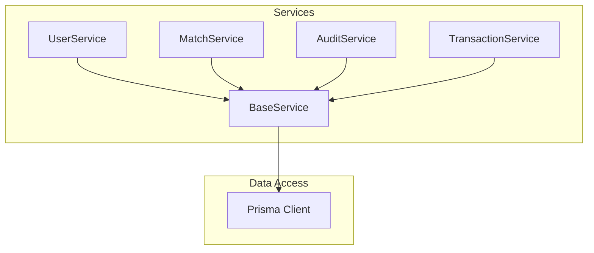
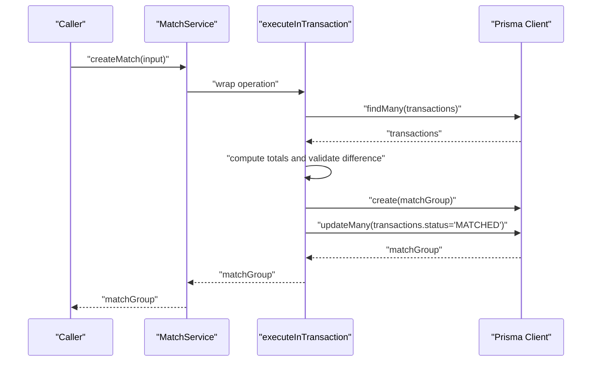
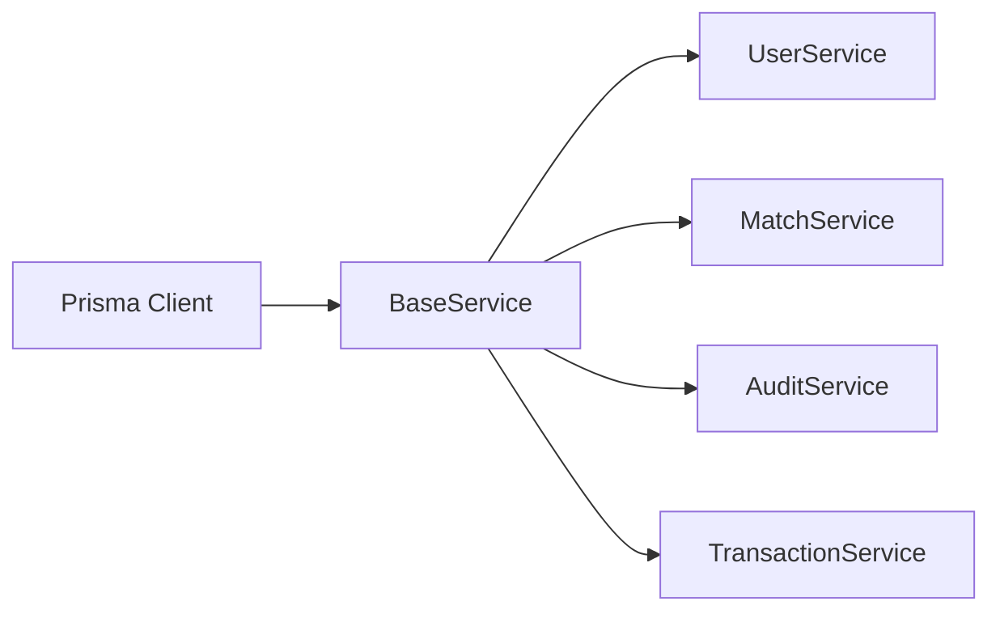

# Base Service

<cite>
**Referenced Files in This Document**
- [BaseService.ts](file://services/BaseService.ts)
- [UserService.ts](file://services/UserService.ts)
- [MatchService.ts](file://services/MatchService.ts)
- [AuditService.ts](file://services/AuditService.ts)
- [TransactionService.ts](file://services/TransactionService.ts)
- [prisma.ts](file://lib/prisma.ts)
- [schema.prisma](file://prisma/schema.prisma)
- [index.ts](file://services/index.ts)
</cite>

## Table of Contents
1. [Introduction](#introduction)
2. [Project Structure](#project-structure)
3. [Core Components](#core-components)
4. [Architecture Overview](#architecture-overview)
5. [Detailed Component Analysis](#detailed-component-analysis)
6. [Dependency Analysis](#dependency-analysis)
7. [Performance Considerations](#performance-considerations)
8. [Troubleshooting Guide](#troubleshooting-guide)
9. [Conclusion](#conclusion)
10. [Appendices](#appendices)

## Introduction
This document explains the BaseService component that provides foundational functionality shared across all service classes in the analyzer-web application. It focuses on:
- The executeInTransaction method that wraps Prisma operations in database transactions to ensure atomicity and consistency across multiple model updates.
- The invocation relationships where UserService, MatchService, AuditService, and TransactionService extend BaseService to inherit transaction management and standardized error handling.
- The handleError method that standardizes error logging and propagation with context-aware messages.
- Concrete examples from the codebase:
  - How MatchService uses executeInTransaction to atomically create match groups and update transaction statuses.
  - How UserService relies on inherited error handling for robust failure reporting.
- Best practices for extending BaseService with new services, maintaining consistent error formats, and monitoring transaction performance under high concurrency.

## Project Structure
The service layer follows a clear inheritance pattern:
- A base class (BaseService) centralizes shared database and error-handling concerns.
- Feature-specific services (UserService, MatchService, AuditService, TransactionService) extend BaseService and encapsulate domain logic.
- The Prisma client is initialized once and injected into BaseService to ensure consistent transaction behavior.



**Diagram sources**
- [BaseService.ts](file://services/BaseService.ts#L1-L19)
- [UserService.ts](file://services/UserService.ts#L1-L213)
- [MatchService.ts](file://services/MatchService.ts#L1-L173)
- [AuditService.ts](file://services/AuditService.ts#L1-L264)
- [TransactionService.ts](file://services/TransactionService.ts#L1-L2)
- [prisma.ts](file://lib/prisma.ts#L1-L11)

**Section sources**
- [BaseService.ts](file://services/BaseService.ts#L1-L19)
- [index.ts](file://services/index.ts#L1-L7)

## Core Components
- BaseService
  - Provides a protected Prisma client instance.
  - Implements executeInTransaction to wrap multiple Prisma operations in a single database transaction.
  - Implements handleError to standardize logging and error propagation with context-aware messages.

- Derived Services
  - UserService: User lifecycle operations with inherited error handling.
  - MatchService: Matching and reconciliation operations, including atomic creation and deletion of match groups.
  - AuditService: Audit logging with chain verification and inherited error handling.
  - TransactionService: Transaction management with bulk operations wrapped in transactions.

**Section sources**
- [BaseService.ts](file://services/BaseService.ts#L1-L19)
- [UserService.ts](file://services/UserService.ts#L1-L213)
- [MatchService.ts](file://services/MatchService.ts#L1-L173)
- [AuditService.ts](file://services/AuditService.ts#L1-L264)
- [TransactionService.ts](file://services/TransactionService.ts#L1-L2)

## Architecture Overview
BaseService centralizes transaction and error handling logic so derived services can focus on domain operations while preserving ACID guarantees and consistent error reporting.

```mermaid
classDiagram
class BaseService {
+prisma
+executeInTransaction(operation) Promise<T>
+handleError(error, context) never
}
class UserService {
+createUser(input) Promise<User>
+findUserByEmail(email) Promise<User|null>
+findUserById(id) Promise<User|null>
+getAllUsers() Promise<UserWithoutPassword[]>
+updateUser(id, input) Promise<User>
+deleteUser(id) Promise<User>
+verifyPassword(user, password) Promise<boolean>
+updateLastLogin(userId) Promise<void>
+incrementFailedLogins(userId) Promise<number>
+lockUser(userId, lockUntil) Promise<void>
}
class MatchService {
+createMatch(input) Promise<MatchGroup>
+getMatches(filter) Promise<MatchGroup[]>
+approveMatch(matchId, approvedById) Promise<MatchGroup>
+unmatch(matchId) Promise<void>
}
class AuditService {
+createAuditLog(input) Promise<AuditLog>
+getAuditLogs(filter) Promise<AuditLog[]>
+getEntityAuditTrail(entityType, entityId) Promise<AuditLog[]>
+verifyAuditChain() Promise<{valid, errors}>
+getUserActivitySummary(userId, start, end) Promise<{totalActions, actionsByType, recentActions}>
}
class TransactionService {
+createTransaction(input) Promise<Transaction>
+createTransactions(inputs) Promise<{created, skipped, duplicates}>
+getTransactions(filter) Promise<Transaction[]>
+getTransactionsForDateRange(start, end, side) Promise<Transaction[]>
+updateTransactionStatus(id, status, matchId) Promise<Transaction>
+bulkUpdateTransactionStatus(ids, status, matchId) Promise<number>
+deleteTransaction(id) Promise<Transaction>
+getTransactionSummary(date) Promise<...>
}
UserService --|> BaseService
MatchService --|> BaseService
AuditService --|> BaseService
TransactionService --|> BaseService
```

**Diagram sources**
- [BaseService.ts](file://services/BaseService.ts#L1-L19)
- [UserService.ts](file://services/UserService.ts#L1-L213)
- [MatchService.ts](file://services/MatchService.ts#L1-L173)
- [AuditService.ts](file://services/AuditService.ts#L1-L264)
- [TransactionService.ts](file://services/TransactionService.ts#L1-L2)

## Detailed Component Analysis

### BaseService
- Purpose: Provide shared database and error-handling infrastructure.
- executeInTransaction:
  - Wraps a function that performs multiple Prisma operations.
  - Ensures all operations succeed or fail together, preserving data consistency.
  - Supports batching multiple writes across different models within a single transaction boundary.
- handleError:
  - Logs the error with a context label for traceability.
  - Throws a standardized Error with a message that includes the context and underlying error message.

Implementation highlights:
- Uses the Prisma client instance injected from the centralized prisma.ts module.
- Keeps transaction boundaries small and focused to minimize contention and lock wait times.

**Section sources**
- [BaseService.ts](file://services/BaseService.ts#L1-L19)
- [prisma.ts](file://lib/prisma.ts#L1-L11)

### UserService
- Inherits executeInTransaction and handleError from BaseService.
- Example of error handling inheritance:
  - Any Prisma operation inside a try/catch block invokes this.handleError with a context string, ensuring consistent logging and error propagation.
- Typical operations include user creation, retrieval, updates, and security-related state changes.

Best practice demonstrated:
- Centralized error handling reduces duplication and ensures uniform error messages across all user operations.

**Section sources**
- [UserService.ts](file://services/UserService.ts#L1-L213)
- [BaseService.ts](file://services/BaseService.ts#L1-L19)

### MatchService
- Atomic match creation:
  - Uses executeInTransaction to ensure that creating a match group and updating transaction statuses occur as a single unit of work.
  - Validates preconditions (e.g., exact match amounts) before writing to the database.
  - Updates transaction statuses to MATCHED and associates match identifiers atomically.
- Atomic unmatch:
  - Uses executeInTransaction to revert transaction statuses to UNMATCHED and delete the match group in a single transaction.

Sequence of operations for createMatch:



**Diagram sources**
- [MatchService.ts](file://services/MatchService.ts#L1-L173)
- [BaseService.ts](file://services/BaseService.ts#L1-L19)

**Section sources**
- [MatchService.ts](file://services/MatchService.ts#L1-L173)
- [BaseService.ts](file://services/BaseService.ts#L1-L19)

### AuditService
- Inherits executeInTransaction and handleError from BaseService.
- Implements tamper-evident audit logging with chained hashing and verification routines.
- Demonstrates consistent error handling across complex read-modify-write flows.

**Section sources**
- [AuditService.ts](file://services/AuditService.ts#L1-L264)
- [BaseService.ts](file://services/BaseService.ts#L1-L19)

### TransactionService
- Bulk transaction creation uses executeInTransaction to ensure atomicity across multiple inserts and duplicate checks.
- Provides bulk update operations with consistent error handling.

**Section sources**
- [TransactionService.ts](file://services/TransactionService.ts#L1-L2)
- [BaseService.ts](file://services/BaseService.ts#L1-L19)

## Dependency Analysis
- BaseService depends on the Prisma client instance from lib/prisma.ts.
- All derived services depend on BaseService, inheriting transaction and error-handling behavior.
- The schema defines relationships among User, Transaction, MatchGroup, and AuditLog, which derive from the same transactional patterns.



**Diagram sources**
- [prisma.ts](file://lib/prisma.ts#L1-L11)
- [BaseService.ts](file://services/BaseService.ts#L1-L19)
- [UserService.ts](file://services/UserService.ts#L1-L213)
- [MatchService.ts](file://services/MatchService.ts#L1-L173)
- [AuditService.ts](file://services/AuditService.ts#L1-L264)
- [TransactionService.ts](file://services/TransactionService.ts#L1-L2)

**Section sources**
- [prisma.ts](file://lib/prisma.ts#L1-L11)
- [schema.prisma](file://prisma/schema.prisma#L1-L200)
- [index.ts](file://services/index.ts#L1-L7)

## Performance Considerations
- Transaction scope:
  - Keep transactions short and focused to reduce lock contention and improve throughput.
  - Avoid long-running reads or heavy computations inside transactions; move them outside when possible.
- Concurrency:
  - Use selective indexing and efficient queries to minimize lock waits.
  - Batch related writes within a single transaction to reduce round-trips and contention.
- Monitoring:
  - Track transaction durations and failure rates to identify hotspots.
  - Use database-level metrics and application logs to correlate slow transactions with specific services.
- Prisma client configuration:
  - The Prisma client is configured with query logging enabled in non-production environments. Consider enabling structured logging and metrics collection in production for observability.

[No sources needed since this section provides general guidance]

## Troubleshooting Guide
Common issues and resolutions:
- Transaction timeouts:
  - If operations exceed the database’s default transaction timeout, consider reducing the scope of the transaction or splitting the workload into smaller batches.
  - Ensure that long-running operations (e.g., complex validations) are performed outside the transaction boundary.
- Proper error type checking:
  - Use try/catch blocks around Prisma operations and rely on BaseService.handleError to standardize error messages.
  - Avoid catching generic exceptions without logging; always pass a meaningful context string to handleError.
- Avoiding memory leaks in long-running transactions:
  - Limit the number of records processed in a single transaction.
  - Prefer streaming or paginated operations for large datasets.
  - Release references promptly and avoid retaining large objects in memory during transactions.
- Consistent error formats:
  - Always call this.handleError with a descriptive context string to ensure uniform error messages across services.
  - Include relevant identifiers (e.g., user ID, transaction ID) in logs for traceability.

**Section sources**
- [BaseService.ts](file://services/BaseService.ts#L1-L19)
- [MatchService.ts](file://services/MatchService.ts#L1-L173)
- [UserService.ts](file://services/UserService.ts#L1-L213)
- [AuditService.ts](file://services/AuditService.ts#L1-L264)
- [TransactionService.ts](file://services/TransactionService.ts#L1-L2)

## Conclusion
BaseService establishes a consistent foundation for database transactions and error handling across the analyzer-web service layer. By inheriting executeInTransaction and handleError, services like UserService, MatchService, AuditService, and TransactionService gain:
- Atomicity across multi-model updates.
- Standardized error logging and propagation.
- A clear pattern for extending the service layer with new features while maintaining reliability and traceability.

Adhering to the best practices outlined here will help ensure predictable performance, robust error handling, and maintainable code as the application scales.

[No sources needed since this section summarizes without analyzing specific files]

## Appendices

### Appendix A: Concrete Examples from the Codebase
- MatchService.createMatch:
  - Uses executeInTransaction to atomically create a match group and update transaction statuses.
  - Validates that the difference between left and right totals equals zero before committing.
  - Throws a domain-specific error if validation fails; the service catches and rethrows via handleError with context.
  - Reference: [MatchService.ts](file://services/MatchService.ts#L1-L173)

- UserService.createUser:
  - Performs user creation with hashed password and returns the created user.
  - Catches any Prisma errors and delegates to BaseService.handleError with a context string for consistent error reporting.
  - Reference: [UserService.ts](file://services/UserService.ts#L1-L213), [BaseService.ts](file://services/BaseService.ts#L1-L19)

### Appendix B: Transaction Scope and Data Model Relationships
- The schema defines relationships among User, Transaction, MatchGroup, and AuditLog, which inform transaction boundaries and consistency requirements.
- References:
  - [schema.prisma](file://prisma/schema.prisma#L1-L200)