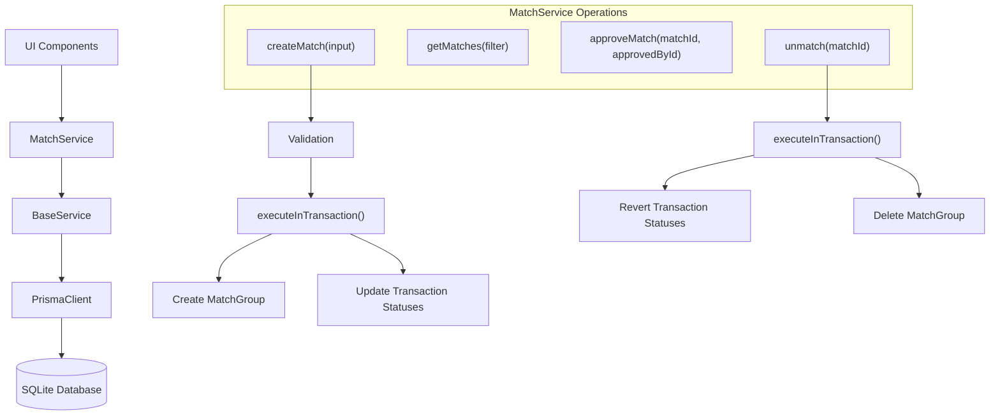
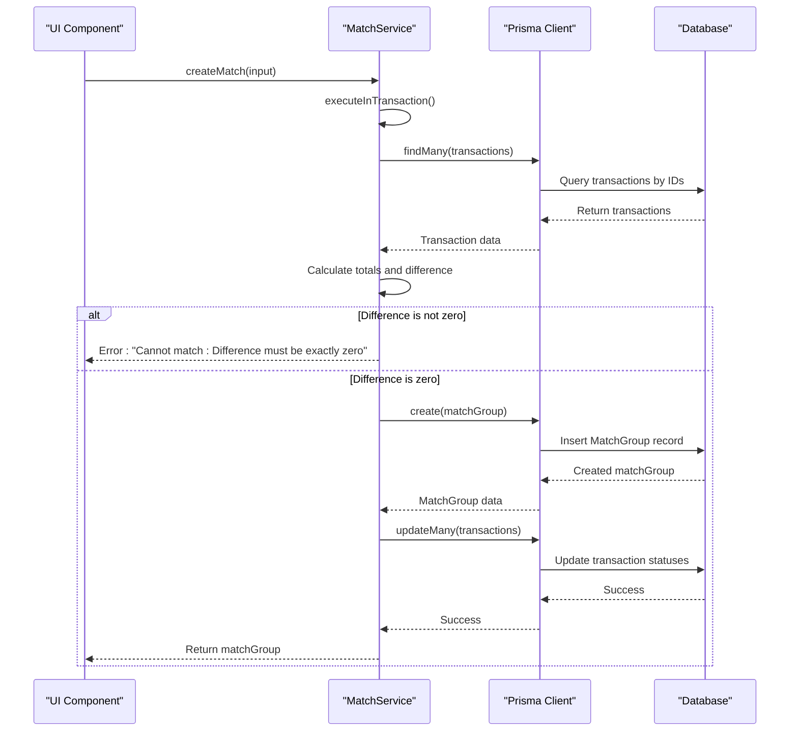
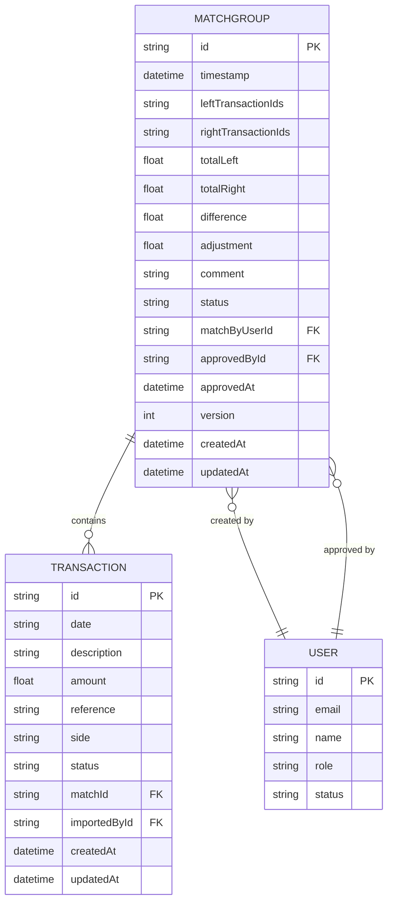
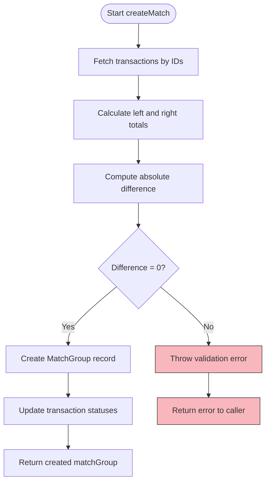
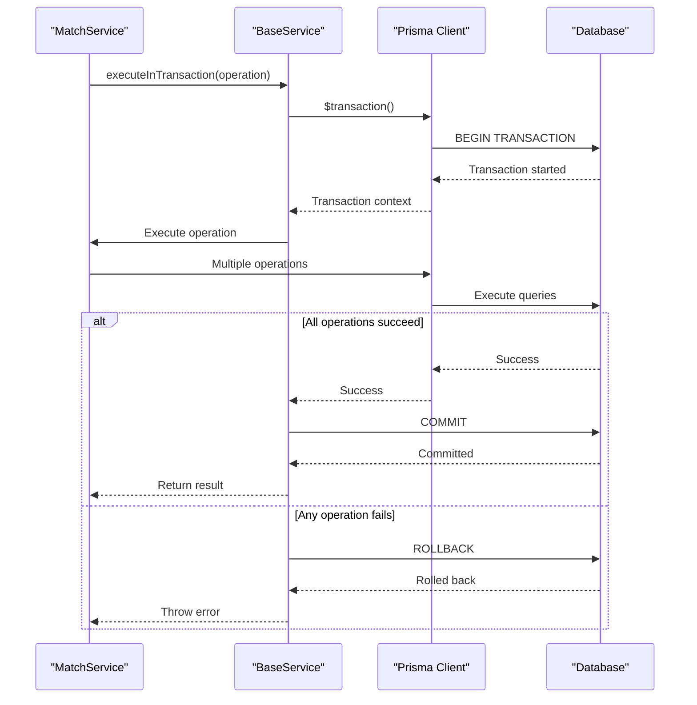
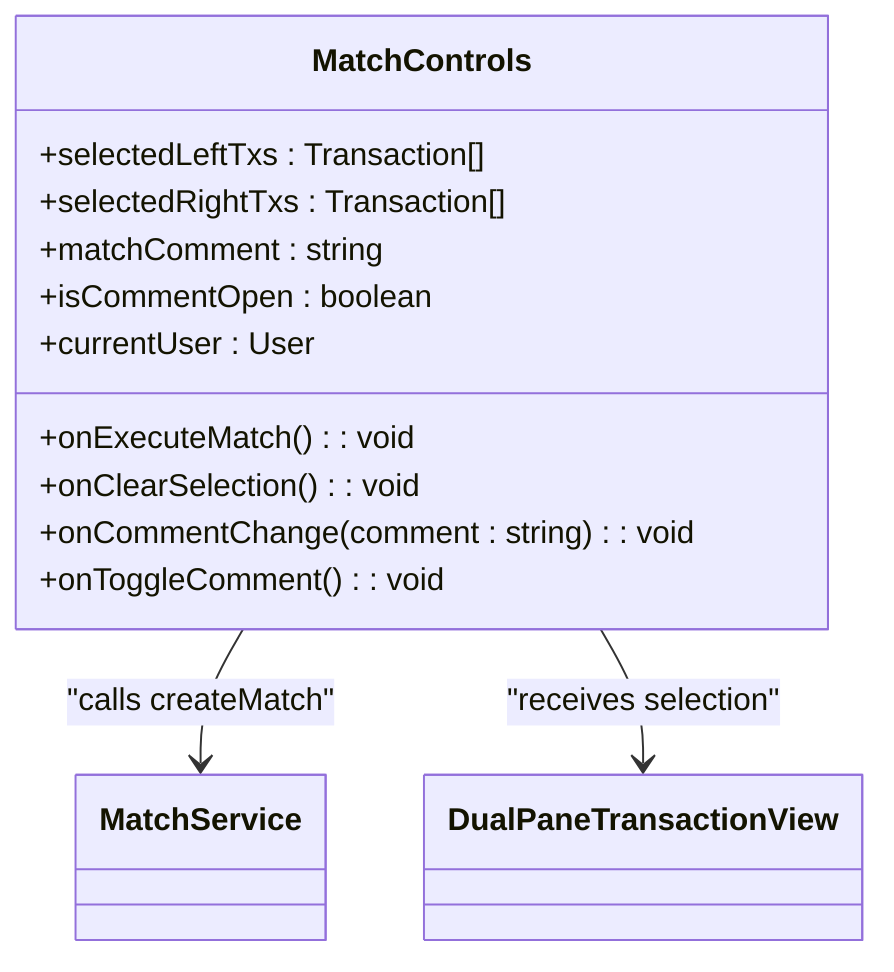
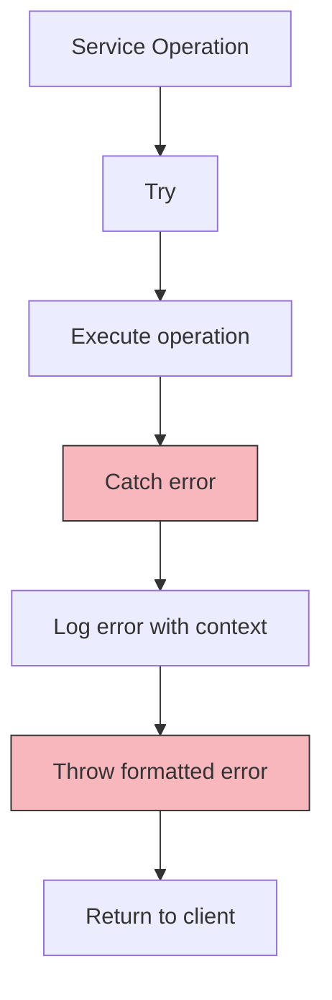

# Match Service

<cite>
**Referenced Files in This Document**   
- [MatchService.ts](file://services/MatchService.ts#L1-L172)
- [BaseService.ts](file://services/BaseService.ts#L1-L19)
- [DualPaneTransactionView.tsx](file://components/DualPaneTransactionView.tsx#L1-L290)
- [MatchControls.tsx](file://components/MatchControls.tsx#L1-L125)
- [prisma.ts](file://lib/prisma.ts#L1-L11)
- [types.ts](file://lib/types.ts#L1-L132)
- [schema.prisma](file://prisma/schema.prisma#L113-L152)
- [migration.sql](file://prisma/migrations/20251203103314_init/migration.sql#L42-L62)
</cite>

## Table of Contents
1. [Introduction](#introduction)
2. [Core Components](#core-components)
3. [Architecture Overview](#architecture-overview)
4. [Detailed Component Analysis](#detailed-component-analysis)
5. [Domain Model](#domain-model)
6. [Business Rules and Validation](#business-rules-and-validation)
7. [Data Consistency and Transactions](#data-consistency-and-transactions)
8. [UI Integration and Workflow](#ui-integration-and-workflow)
9. [Performance Considerations](#performance-considerations)
10. [Planned Enhancements](#planned-enhancements)
11. [Troubleshooting Guide](#troubleshooting-guide)
12. [Conclusion](#conclusion)

## Introduction
The MatchService component in the analyzer-web platform is responsible for transaction reconciliation, enabling users to match transactions from different sources (e.g., internal ledger and bank statement) with strict zero-difference enforcement. This document provides a comprehensive analysis of the `createMatch` method implementation, its integration with UI components, domain model, business rules, and data consistency mechanisms. The service ensures atomic operations through database transactions, maintains referential integrity, and supports auditability through comprehensive logging and user tracking.

## Core Components

The MatchService is built on a layered architecture with clear separation of concerns. It extends the BaseService which provides common database operations and error handling. The core functionality revolves around creating, approving, and unmatching transaction groups with strict validation rules and atomic database operations.

**Section sources**
- [MatchService.ts](file://services/MatchService.ts#L1-L172)
- [BaseService.ts](file://services/BaseService.ts#L1-L19)

## Architecture Overview

The MatchService operates within a Next.js application using Prisma ORM for database interactions. It follows a service-layer pattern where business logic is encapsulated in dedicated service classes. The architecture emphasizes data consistency through atomic transactions and provides a clean API for UI components to interact with the reconciliation functionality.



**Diagram sources**
- [MatchService.ts](file://services/MatchService.ts#L20-L82)
- [BaseService.ts](file://services/BaseService.ts#L7-L13)

## Detailed Component Analysis

### MatchService Implementation

The MatchService provides the core reconciliation functionality for the analyzer-web platform. It handles the creation, retrieval, approval, and deletion of match groups with strict validation and data consistency guarantees.

#### Class Diagram
```mermaid
classDiagram
class MatchService {
+createMatch(input : CreateMatchInput) : Promise~MatchGroup~
+getMatches(filter : {status? : string}) : Promise~MatchGroup[]~
+approveMatch(matchId : string, approvedById : string) : Promise~MatchGroup~
+unmatch(matchId : string) : Promise~void~
}
class BaseService {
#prisma : PrismaClient
+executeInTransaction~T~(operation : () => Promise~T~) : Promise~T~
+handleError(error : any, context : string) : never
}
MatchService --|> BaseService : extends
class PrismaClient {
+transaction : TransactionClient
+matchGroup : MatchGroupDelegate
+transaction : TransactionDelegate
}
BaseService --> PrismaClient : "uses"
MatchService --> PrismaClient : "uses"
```

**Diagram sources**
- [MatchService.ts](file://services/MatchService.ts#L16-L172)
- [BaseService.ts](file://services/BaseService.ts#L4-L19)

### createMatch Method Analysis

The `createMatch` method is the primary entry point for transaction reconciliation in the system. It enforces strict zero-difference matching between left and right transaction sets using atomic database transactions.

#### Sequence Diagram


**Diagram sources**
- [MatchService.ts](file://services/MatchService.ts#L20-L82)

## Domain Model

The domain model for transaction reconciliation centers around the MatchGroup entity, which represents a collection of matched transactions from two different sources. The model includes transaction metadata, totals, and user tracking information.

### Data Model Diagram


**Diagram sources**
- [schema.prisma](file://prisma/schema.prisma#L113-L152)
- [migration.sql](file://prisma/migrations/20251203103314_init/migration.sql#L42-L62)

## Business Rules and Validation

The MatchService enforces several critical business rules to ensure data integrity and compliance with financial reconciliation standards.

### Key Business Rules

- **Zero-Difference Matching**: Only transactions with exactly zero difference between left and right totals can be matched
- **Atomic Operations**: Match creation and transaction status updates occur within a single database transaction
- **Status Management**: Transactions are updated to "MATCHED" status with reference to the match group
- **User Tracking**: The user who created the match is recorded in the match group
- **Immutable Records**: Once created, match groups cannot be modified (only approved or deleted)

### Validation Process

The validation process in the `createMatch` method follows these steps:

1. Fetch all transactions specified in the input
2. Calculate total amounts for left and right transaction sets
3. Compute the absolute difference between the totals
4. Validate that the difference is exactly zero
5. Proceed with match group creation if validation passes



**Diagram sources**
- [MatchService.ts](file://services/MatchService.ts#L42-L53)

## Data Consistency and Transactions

Data consistency is ensured through the use of atomic database transactions and proper error handling.

### Transaction Management

The BaseService provides a wrapper around Prisma's transaction functionality, ensuring that operations are executed atomically:



**Diagram sources**
- [BaseService.ts](file://services/BaseService.ts#L7-L13)
- [MatchService.ts](file://services/MatchService.ts#L22-L82)

## UI Integration and Workflow

The MatchService is integrated with several UI components that provide the user interface for transaction reconciliation.

### UI Component Integration

#### MatchControls Component
The MatchControls component provides the user interface for executing matches, showing totals, differences, and comments:



**Diagram sources**
- [MatchControls.tsx](file://components/MatchControls.tsx#L8-L18)

#### DualPaneTransactionView Component
The DualPaneTransactionView component displays transactions in two panes (left and right) and allows users to select transactions for matching:

```mermaid
classDiagram
class DualPaneTransactionView {
+glTransactions : {intCr : [], intDr : []}
+statementTransactions : {extDr : [], extCr : []}
+selectedGLIds : Set~string~
+selectedStatementIds : Set~string~
+toggleGLSelection(id : string) : void
+toggleStatementSelection(id : string) : void
}
DualPaneTransactionView --> MatchControls : "provides selections"
DualPaneTransactionView --> TransactionCard : "renders transactions"
```

**Diagram sources**
- [DualPaneTransactionView.tsx](file://components/DualPaneTransactionView.tsx#L7-L21)

## Performance Considerations

The MatchService implementation includes several performance considerations for handling transaction reconciliation efficiently.

### Optimization Opportunities

- **Database Indexing**: Ensure proper indexing on transaction IDs, match IDs, and status fields
- **Batch Operations**: Consider implementing batch matching for multiple transaction groups
- **Caching**: Implement caching for frequently accessed transaction data
- **Pagination**: Implement pagination for large result sets in getMatches method
- **Connection Pooling**: Ensure proper database connection pooling configuration

### Index Recommendations

Based on the schema, the following indexes should be maintained for optimal performance:

```sql
-- Transaction table indexes
CREATE INDEX "Transaction_date_side_status_idx" ON "Transaction"("date", "side", "status");
CREATE INDEX "Transaction_matchId_idx" ON "Transaction"("matchId");
CREATE INDEX "Transaction_status_idx" ON "Transaction"("status");
CREATE INDEX "Transaction_contentHash_idx" ON "Transaction"("contentHash");

-- MatchGroup table indexes
CREATE INDEX "MatchGroup_status_timestamp_idx" ON "MatchGroup"("status", "timestamp");
CREATE INDEX "MatchGroup_matchByUserId_idx" ON "MatchGroup"("matchByUserId");
CREATE INDEX "MatchGroup_approvedById_idx" ON "MatchGroup"("approvedById");
```

**Section sources**
- [schema.prisma](file://prisma/schema.prisma#L101-L106)
- [migration.sql](file://prisma/migrations/20251203160749_add_sheet_import_model/migration.sql#L72-L77)

## Planned Enhancements

The MatchService has several planned enhancements to improve functionality and user experience.

### Future Development Roadmap

- **Batch Operations**: Support for creating multiple match groups in a single operation
- **Auto-Suggest Algorithms**: Intelligent suggestions for potential matches based on transaction patterns
- **Separation of Duties**: Enhanced validation to prevent users from matching their own imported transactions
- **Adjustment Support**: Allow small differences with proper approval workflows
- **Conflict Detection**: Detect and prevent concurrent modifications to the same transactions
- **Performance Monitoring**: Add metrics and monitoring for reconciliation operations

## Troubleshooting Guide

Common issues and their solutions when working with the MatchService.

### Common Issues

- **Non-Zero Difference Error**: Ensure that the sum of left and right transactions are exactly equal
- **Concurrent Modification**: Implement optimistic locking or version checking to handle concurrent access
- **Transaction Not Found**: Validate that all transaction IDs in the input exist in the database
- **Permission Denied**: Ensure the user has the necessary permissions to perform matching operations
- **Database Connection Issues**: Verify database connectivity and connection pool configuration

### Error Handling Pattern

The BaseService provides a consistent error handling pattern across all service methods:



**Section sources**
- [BaseService.ts](file://services/BaseService.ts#L15-L18)

## Conclusion

The MatchService component provides a robust foundation for transaction reconciliation in the analyzer-web platform. Its implementation emphasizes data consistency through atomic transactions, enforces strict business rules for zero-difference matching, and provides a clean API for UI integration. The service is well-structured with proper separation of concerns and follows best practices for error handling and database operations. Future enhancements should focus on improving performance, adding intelligent matching suggestions, and strengthening security controls through separation of duties validation.