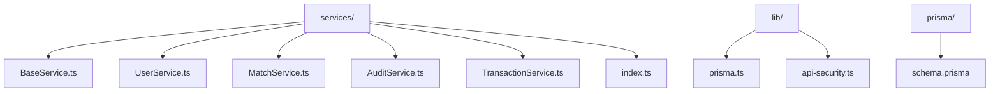
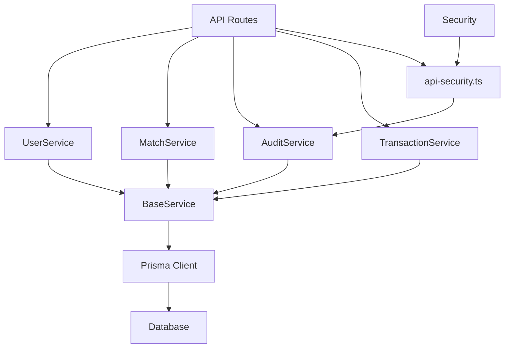
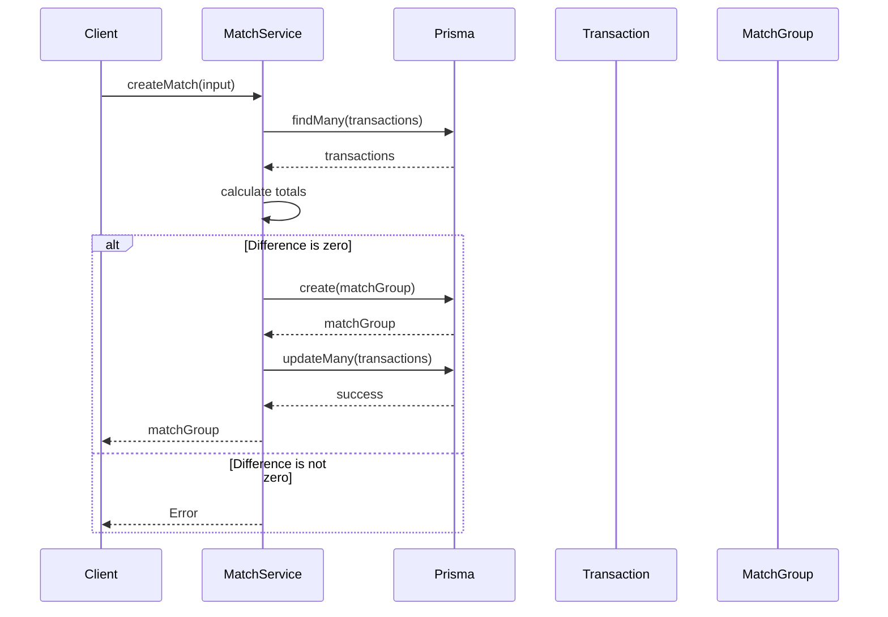
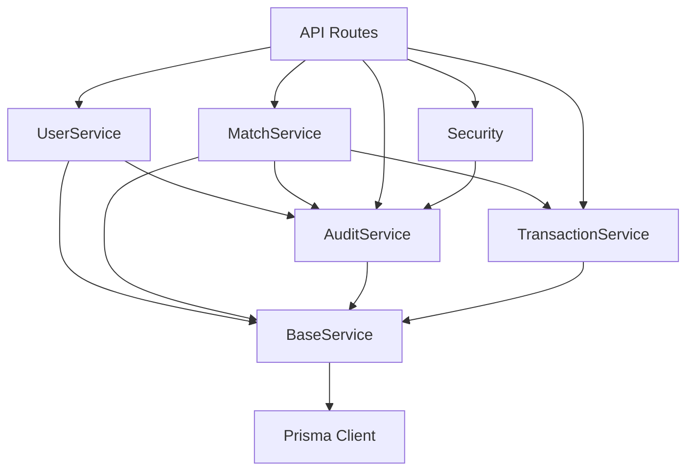

# Service Layer

<cite>
**Referenced Files in This Document**   
- [BaseService.ts](file://services/BaseService.ts)
- [UserService.ts](file://services/UserService.ts)
- [MatchService.ts](file://services/MatchService.ts)
- [AuditService.ts](file://services/AuditService.ts)
- [TransactionService.ts](file://services/TransactionService.ts)
- [index.ts](file://services/index.ts)
- [prisma.ts](file://lib/prisma.ts)
- [api-security.ts](file://lib/api-security.ts)
- [schema.prisma](file://prisma/schema.prisma)
- [constants.ts](file://lib/constants.ts)
- [types.ts](file://lib/types.ts)
</cite>

## Table of Contents
1. [Introduction](#introduction)
2. [Project Structure](#project-structure)
3. [Core Components](#core-components)
4. [Architecture Overview](#architecture-overview)
5. [Detailed Component Analysis](#detailed-component-analysis)
6. [Dependency Analysis](#dependency-analysis)
7. [Performance Considerations](#performance-considerations)
8. [Troubleshooting Guide](#troubleshooting-guide)
9. [Conclusion](#conclusion)

## Introduction
The analyzer-web application implements a robust service layer architecture following the Service Layer Pattern to encapsulate business logic and mediate between API routes and data access via Prisma. This documentation provides a comprehensive analysis of the service layer design, component interactions, technical decisions, and integration patterns that ensure data consistency, security, and auditability in financial reconciliation workflows.

## Project Structure
The service layer is organized in the `services/` directory with a clear separation of concerns into specialized service classes that inherit from a common base class. The services are designed as singleton instances and exported through an index module for easy import across the application.



**Diagram sources**
- [services/BaseService.ts](file://services/BaseService.ts)
- [services/UserService.ts](file://services/UserService.ts)
- [services/MatchService.ts](file://services/MatchService.ts)
- [services/AuditService.ts](file://services/AuditService.ts)
- [services/TransactionService.ts](file://services/TransactionService.ts)
- [services/index.ts](file://services/index.ts)
- [lib/prisma.ts](file://lib/prisma.ts)
- [prisma/schema.prisma](file://prisma/schema.prisma)

**Section sources**
- [services](file://services)
- [lib](file://lib)
- [prisma](file://prisma)

## Core Components
The service layer consists of five core components that implement the Service Layer Pattern: BaseService (providing common functionality), UserService (user management), MatchService (transaction matching), AuditService (immutable logging), and TransactionService (transaction operations). These services encapsulate business logic and coordinate with the Prisma client for data persistence while maintaining separation from API route handlers.

**Section sources**
- [BaseService.ts](file://services/BaseService.ts)
- [UserService.ts](file://services/UserService.ts)
- [MatchService.ts](file://services/MatchService.ts)
- [AuditService.ts](file://services/AuditService.ts)
- [TransactionService.ts](file://services/TransactionService.ts)

## Architecture Overview
The service layer implements a clean architectural pattern where API endpoints import specific services to handle business logic, while the BaseService provides common functionality like error handling and transaction management. Services coordinate operations across multiple models and enforce business rules before persisting data through the Prisma client.



**Diagram sources**
- [app/api](file://app/api)
- [services/BaseService.ts](file://services/BaseService.ts)
- [services/UserService.ts](file://services/UserService.ts)
- [services/MatchService.ts](file://services/MatchService.ts)
- [services/AuditService.ts](file://services/AuditService.ts)
- [services/TransactionService.ts](file://services/TransactionService.ts)
- [lib/prisma.ts](file://lib/prisma.ts)
- [lib/api-security.ts](file://lib/api-security.ts)

## Detailed Component Analysis

### Service Layer Pattern Implementation
The analyzer-web application implements the Service Layer Pattern to encapsulate business logic in reusable classes that mediate between API routes and data access via Prisma. This pattern provides a clear separation of concerns, promotes code reuse, and centralizes business rule enforcement.

#### Service Class Hierarchy
```mermaid
classDiagram
class BaseService {
+prisma : PrismaClient
+executeInTransaction(operation) T
+handleError(error, context) never
}
class UserService {
+createUser(input) User
+findUserByEmail(email) User|null
+findUserById(id) User|null
+getAllUsers() UserWithoutPassword[]
+updateUser(id, input) User
+deleteUser(id) User
+verifyPassword(user, password) boolean
+updateLastLogin(userId) void
+incrementFailedLogins(userId) number
+lockUser(userId, lockUntil) void
}
class MatchService {
+createMatch(input) MatchGroup
+getMatches(filter) MatchGroup[]
+approveMatch(matchId, approvedById) MatchGroup
+unmatch(matchId) void
}
class AuditService {
+createAuditLog(input) AuditLog
+getAuditLogs(filter) AuditLog[]
+getEntityAuditTrail(entityType, entityId) AuditLog[]
+verifyAuditChain() {valid, errors}
+getUserActivitySummary(userId, startDate, endDate) {totalActions, actionsByType, recentActions}
}
class TransactionService {
+createTransaction(input) Transaction
+createTransactions(inputs) {created, skipped, duplicates}
+getTransactions(filter) Transaction[]
+getTransactionsForDateRange(startDate, endDate, side) Transaction[]
+updateTransactionStatus(transactionId, status, matchId) Transaction
+bulkUpdateTransactionStatus(transactionIds, status, matchId) number
+deleteTransaction(transactionId) Transaction
+getTransactionSummary(date) {leftTotal, rightTotal, leftCount, rightCount, unmatchedLeft, unmatchedRight, matchedCount}
}
BaseService <|-- UserService
BaseService <|-- MatchService
BaseService <|-- AuditService
BaseService <|-- TransactionService
UserService --> AuditService : "logs actions"
MatchService --> AuditService : "logs matches"
TransactionService --> AuditService : "logs transactions"
MatchService --> TransactionService : "updates transaction status"
```

**Diagram sources**
- [services/BaseService.ts](file://services/BaseService.ts#L4-L18)
- [services/UserService.ts](file://services/UserService.ts#L27-L212)
- [services/MatchService.ts](file://services/MatchService.ts#L16-L172)
- [services/AuditService.ts](file://services/AuditService.ts#L33-L263)
- [services/TransactionService.ts](file://services/TransactionService.ts#L15-L150)

**Section sources**
- [services/BaseService.ts](file://services/BaseService.ts)
- [services/UserService.ts](file://services/UserService.ts)
- [services/MatchService.ts](file://services/MatchService.ts)
- [services/AuditService.ts](file://services/AuditService.ts)
- [services/TransactionService.ts](file://services/TransactionService.ts)

### BaseService Analysis
The BaseService class provides common functionality that is inherited by all service classes, ensuring consistent error handling, logging, and transaction management across the application.

```mermaid
classDiagram
class BaseService {
-prisma : PrismaClient
+executeInTransaction(operation) T
+handleError(error, context) never
}
class UserService {
+createUser(input) User
+findUserByEmail(email) User|null
+getAllUsers() UserWithoutPassword[]
}
class MatchService {
+createMatch(input) MatchGroup
+getMatches(filter) MatchGroup[]
}
class AuditService {
+createAuditLog(input) AuditLog
+getAuditLogs(filter) AuditLog[]
}
BaseService <|-- UserService
BaseService <|-- MatchService
BaseService <|-- AuditService
BaseService --> "Prisma Client" : "database access"
```

**Diagram sources**
- [services/BaseService.ts](file://services/BaseService.ts#L4-L18)

**Section sources**
- [services/BaseService.ts](file://services/BaseService.ts)

### UserService Analysis
The UserService handles all user-related database operations including CRUD operations, password management, authentication tracking, and security features like account locking after failed login attempts.

```mermaid
classDiagram
class UserService {
+createUser(input) User
+findUserByEmail(email) User|null
+findUserById(id) User|null
+getAllUsers() UserWithoutPassword[]
+updateUser(id, input) User
+deleteUser(id) User
+verifyPassword(user, password) boolean
+updateLastLogin(userId) void
+incrementFailedLogins(userId) number
+lockUser(userId, lockUntil) void
}
UserService --> "Prisma Client" : "user operations"
UserService --> "bcryptjs" : "password hashing"
UserService --> AuditService : "logs user actions"
class User {
id : String
email : String
name : String
password : String
role : String
status : String
avatar : String
mfaEnabled : Boolean
lastLogin : DateTime
failedLoginAttempts : Int
lockedUntil : DateTime
}
```

**Diagram sources**
- [services/UserService.ts](file://services/UserService.ts#L27-L212)
- [prisma/schema.prisma](file://prisma/schema.prisma#L18-L53)

**Section sources**
- [services/UserService.ts](file://services/UserService.ts)
- [prisma/schema.prisma](file://prisma/schema.prisma#L18-L53)

### MatchService Analysis
The MatchService handles matching and reconciliation operations, implementing strict business rules for transaction matching and coordinating updates across multiple models.



**Diagram sources**
- [services/MatchService.ts](file://services/MatchService.ts#L20-L85)
- [prisma/schema.prisma](file://prisma/schema.prisma#L113-L152)

**Section sources**
- [services/MatchService.ts](file://services/MatchService.ts)
- [prisma/schema.prisma](file://prisma/schema.prisma#L113-L152)

### AuditService Analysis
The AuditService implements an immutable log with cryptographic chaining to ensure data integrity and provide a verifiable audit trail for all system actions.

```mermaid
classDiagram
class AuditService {
+createAuditLog(input) AuditLog
+getAuditLogs(filter) AuditLog[]
+getEntityAuditTrail(entityType, entityId) AuditLog[]
+verifyAuditChain() {valid, errors}
+getUserActivitySummary(userId, startDate, endDate) {totalActions, actionsByType, recentActions}
-calculateHash(input, previousHash) String
}
AuditService --> "Prisma Client" : "audit log operations"
AuditService --> "crypto" : "SHA-256 hashing"
class AuditLog {
id : String
timestamp : DateTime
userId : String
sessionId : String
ipAddress : String
deviceFingerprint : String
actionType : String
entityType : String
entityId : String
beforeState : String
afterState : String
changeSummary : String
justification : String
previousHash : String
currentHash : String
}
```

**Diagram sources**
- [services/AuditService.ts](file://services/AuditService.ts#L33-L263)
- [prisma/schema.prisma](file://prisma/schema.prisma#L158-L192)

**Section sources**
- [services/AuditService.ts](file://services/AuditService.ts)
- [prisma/schema.prisma](file://prisma/schema.prisma#L158-L192)

### TransactionService Analysis
The TransactionService handles transaction-related operations including creation, filtering, status management, and summary statistics, with built-in deduplication capabilities.

```mermaid
classDiagram
class TransactionService {
+createTransaction(input) Transaction
+createTransactions(inputs) {created, skipped, duplicates}
+getTransactions(filter) Transaction[]
+getTransactionsForDateRange(startDate, endDate, side) Transaction[]
+updateTransactionStatus(transactionId, status, matchId) Transaction
+bulkUpdateTransactionStatus(transactionIds, status, matchId) number
+deleteTransaction(transactionId) Transaction
+getTransactionSummary(date) {leftTotal, rightTotal, leftCount, rightCount, unmatchedLeft, unmatchedRight, matchedCount}
-calculateContentHash(input) String
}
TransactionService --> "Prisma Client" : "transaction operations"
TransactionService --> "crypto" : "SHA-256 hashing"
class Transaction {
id : String
sn : String
date : String
description : String
amount : Float
glRefNo : String
aging : Int
recon : String
reference : String
side : String
status : String
matchId : String
importedById : String
fileImportId : String
sheetImportId : String
isDeleted : Boolean
archivedAt : DateTime
contentHash : String
}
```

**Diagram sources**
- [services/TransactionService.ts](file://services/TransactionService.ts#L15-L150)
- [prisma/schema.prisma](file://prisma/schema.prisma#L59-L107)

**Section sources**
- [services/TransactionService.ts](file://services/TransactionService.ts)
- [prisma/schema.prisma](file://prisma/schema.prisma#L59-L107)

## Dependency Analysis
The service layer components have well-defined dependencies that follow the dependency inversion principle, with higher-level modules depending on abstractions rather than concrete implementations.



**Diagram sources**
- [services/BaseService.ts](file://services/BaseService.ts)
- [services/UserService.ts](file://services/UserService.ts)
- [services/MatchService.ts](file://services/MatchService.ts)
- [services/AuditService.ts](file://services/AuditService.ts)
- [services/TransactionService.ts](file://services/TransactionService.ts)
- [lib/prisma.ts](file://lib/prisma.ts)
- [lib/api-security.ts](file://lib/api-security.ts)

**Section sources**
- [services](file://services)
- [lib/prisma.ts](file://lib/prisma.ts)
- [lib/api-security.ts](file://lib/api-security.ts)

## Performance Considerations
The service layer is designed with performance considerations for concurrent reconciliation sessions and large transaction volumes. The use of Prisma transactions ensures data consistency during matching operations, while batch operations in TransactionService optimize bulk processing. The BaseService provides a foundation for consistent error handling and logging across all services, reducing code duplication and improving maintainability.

## Troubleshooting Guide
When troubleshooting service layer issues, check the following common areas:
- Ensure Prisma client is properly initialized and connected to the database
- Verify transaction boundaries are correctly defined in service methods
- Check that error handling in BaseService is properly propagating errors
- Validate that audit logging is capturing all required context information
- Confirm that cryptographic hashing in AuditService is producing consistent results

**Section sources**
- [BaseService.ts](file://services/BaseService.ts#L15-L18)
- [AuditService.ts](file://services/AuditService.ts#L208-L219)
- [prisma.ts](file://lib/prisma.ts)

## Conclusion
The analyzer-web application's service layer effectively implements the Service Layer Pattern with well-structured components that encapsulate business logic, coordinate data access, and enforce application rules. The architecture promotes separation of concerns, code reuse, and maintainability through inheritance from BaseService and clear service boundaries. The integration of audit logging, transaction management, and security features ensures data integrity and compliance in financial reconciliation workflows.