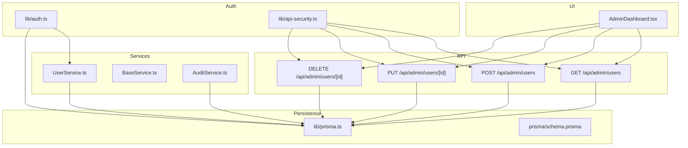
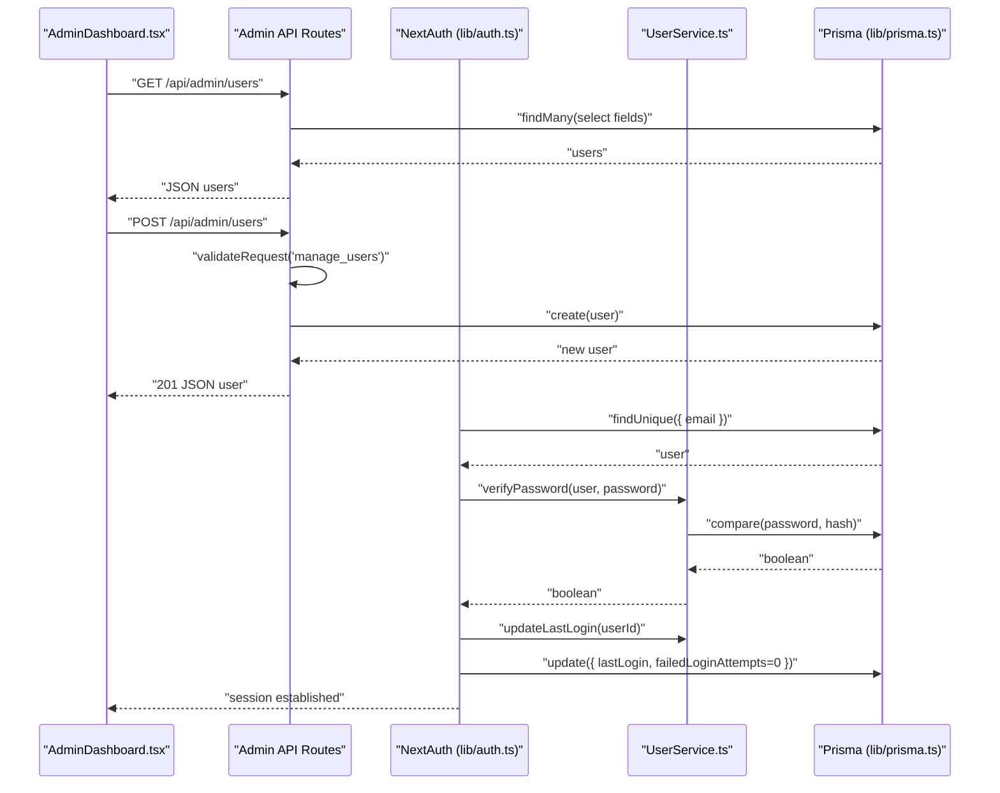
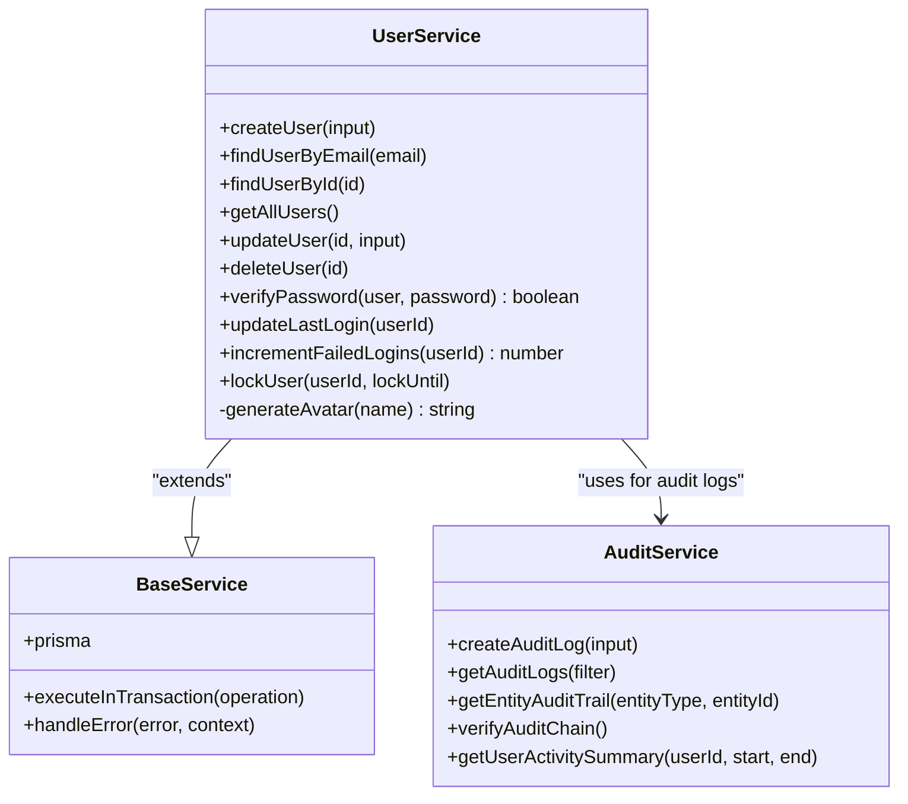
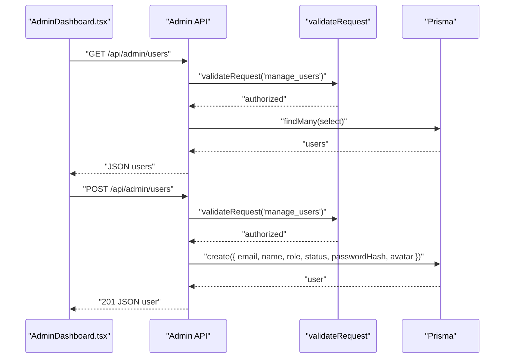
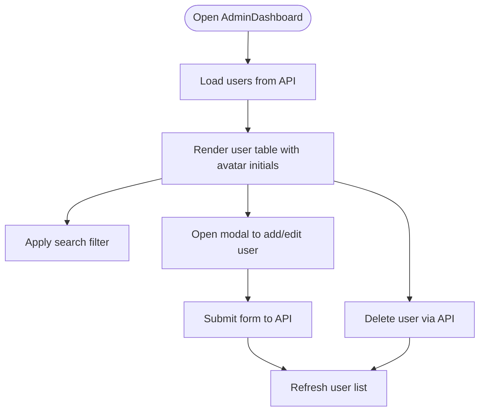
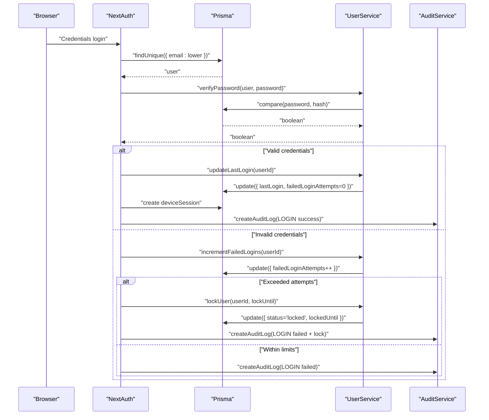
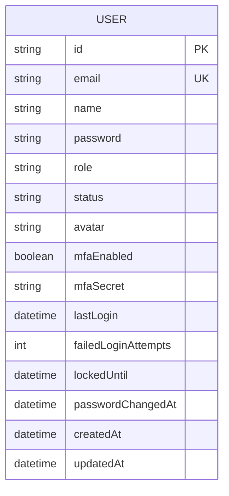
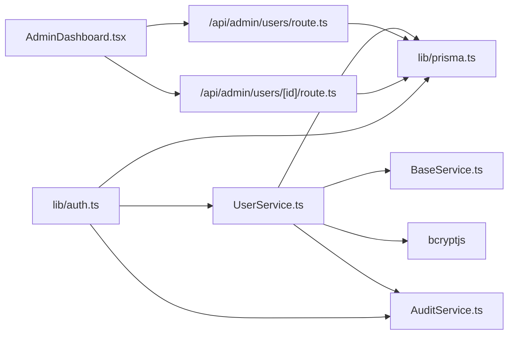

# User Service

<cite>
**Referenced Files in This Document**
- [UserService.ts](file://services/UserService.ts)
- [BaseService.ts](file://services/BaseService.ts)
- [route.ts](file://app/api/admin/users/route.ts)
- [route.ts](file://app/api/admin/users/[id]/route.ts)
- [AdminDashboard.tsx](file://components/AdminDashboard.tsx)
- [types.ts](file://lib/types.ts)
- [auth.ts](file://lib/auth.ts)
- [api-security.ts](file://lib/api-security.ts)
- [prisma.ts](file://lib/prisma.ts)
- [schema.prisma](file://prisma/schema.prisma)
- [constants.ts](file://lib/constants.ts)
- [AuditService.ts](file://services/AuditService.ts)
</cite>

## Table of Contents
1. [Introduction](#introduction)
2. [Project Structure](#project-structure)
3. [Core Components](#core-components)
4. [Architecture Overview](#architecture-overview)
5. [Detailed Component Analysis](#detailed-component-analysis)
6. [Dependency Analysis](#dependency-analysis)
7. [Performance Considerations](#performance-considerations)
8. [Troubleshooting Guide](#troubleshooting-guide)
9. [Conclusion](#conclusion)
10. [Appendices](#appendices)

## Introduction
This document explains the UserService component of the analyzer-web application. It covers user creation with password hashing, retrieval by email or ID, role and status management, and integration with the Admin API and AdminDashboard UI. It also documents the domain model (User, UserWithoutPassword, CreateUserInput, UpdateUserInput), security features (failed login tracking, account locking, MFA readiness), and operational guidance for handling edge cases and optimizing performance.

## Project Structure
The user management functionality spans several layers:
- Services: UserService encapsulates all user-related database operations.
- API: Admin endpoints under /api/admin/users delegate to Prisma for CRUD operations.
- UI: AdminDashboard renders user lists and manages user edits via props and handlers.
- Authentication: NextAuth integration validates credentials, enforces locks, and tracks login attempts.
- Persistence: Prisma schema defines the User model and indexes.

**Diagram sources**
- [AdminDashboard.tsx](file://components/AdminDashboard.tsx#L1-L211)
- [route.ts](file://app/api/admin/users/route.ts#L1-L71)
- [route.ts](file://app/api/admin/users/[id]/route.ts#L1-L51)
- [UserService.ts](file://services/UserService.ts#L1-L213)
- [BaseService.ts](file://services/BaseService.ts#L1-L20)
- [AuditService.ts](file://services/AuditService.ts#L1-L264)
- [auth.ts](file://lib/auth.ts#L1-L225)
- [api-security.ts](file://lib/api-security.ts#L1-L238)
- [prisma.ts](file://lib/prisma.ts#L1-L11)
- [schema.prisma](file://prisma/schema.prisma#L1-L60)

**Section sources**
- [UserService.ts](file://services/UserService.ts#L1-L213)
- [route.ts](file://app/api/admin/users/route.ts#L1-L71)
- [route.ts](file://app/api/admin/users/[id]/route.ts#L1-L51)
- [AdminDashboard.tsx](file://components/AdminDashboard.tsx#L1-L211)
- [auth.ts](file://lib/auth.ts#L1-L225)
- [api-security.ts](file://lib/api-security.ts#L1-L238)
- [prisma.ts](file://lib/prisma.ts#L1-L11)
- [schema.prisma](file://prisma/schema.prisma#L1-L60)

## Core Components
- Domain model:
  - User: core entity with identity, credentials, roles, status, and security counters.
  - UserWithoutPassword: projection excluding sensitive fields for safe transport.
  - CreateUserInput and UpdateUserInput: typed inputs for creation and updates.
- Service layer:
  - UserService: orchestrates user operations, password hashing, retrieval, updates, deletions, and security counters.
  - BaseService: shared Prisma client and error handling utilities.
  - AuditService: audit logging and integrity verification.
- API layer:
  - Admin endpoints for listing, creating, updating, and deleting users.
- Authentication:
  - NextAuth credentials provider with bcrypt comparison, lockout enforcement, and audit logging.
- UI:
  - AdminDashboard renders users, supports search, edit, and deletion.

**Section sources**
- [types.ts](file://lib/types.ts#L1-L132)
- [UserService.ts](file://services/UserService.ts#L1-L213)
- [BaseService.ts](file://services/BaseService.ts#L1-L20)
- [AuditService.ts](file://services/AuditService.ts#L1-L264)
- [route.ts](file://app/api/admin/users/route.ts#L1-L71)
- [route.ts](file://app/api/admin/users/[id]/route.ts#L1-L51)
- [auth.ts](file://lib/auth.ts#L1-L225)
- [AdminDashboard.tsx](file://components/AdminDashboard.tsx#L1-L211)

## Architecture Overview
The system follows a layered architecture:
- UI triggers user management actions.
- API routes validate permissions and delegate to Prisma for persistence.
- Services encapsulate business logic and security counters.
- Authentication integrates with UserService for password verification and lockout logic.
- AuditService records security-relevant events.

**Diagram sources**
- [AdminDashboard.tsx](file://components/AdminDashboard.tsx#L1-L211)
- [route.ts](file://app/api/admin/users/route.ts#L1-L71)
- [auth.ts](file://lib/auth.ts#L1-L225)
- [UserService.ts](file://services/UserService.ts#L1-L213)
- [prisma.ts](file://lib/prisma.ts#L1-L11)

## Detailed Component Analysis

### UserService
- Responsibilities:
  - Create users with hashed passwords and normalized email to lowercase.
  - Retrieve users by email or ID.
  - List all users with a safe projection (without password).
  - Update and delete users.
  - Password verification using bcrypt.
  - Manage security counters: last login timestamp, failed login attempts, and account lock.
  - Avatar generation from name initials.
- Key methods and behaviors:
  - createUser: hashes password, lowercases email, applies defaults for role/status/avatar, and returns the created user.
  - findUserByEmail/findUserById: case-normalized email retrieval and direct ID lookup.
  - getAllUsers: selects non-sensitive fields, orders by name, and returns UserWithoutPassword[].
  - verifyPassword: compares plaintext password against stored hash.
  - updateLastLogin: resets failed attempts and updates lastLogin.
  - incrementFailedLogins: increments failed attempts and returns the new count.
  - lockUser: sets status to locked and sets lockedUntil.
  - generateAvatar: creates initials from name.
- Error handling:
  - BaseService.handleError centralizes error logging and throws descriptive errors.

**Diagram sources**
- [UserService.ts](file://services/UserService.ts#L1-L213)
- [BaseService.ts](file://services/BaseService.ts#L1-L20)
- [AuditService.ts](file://services/AuditService.ts#L1-L264)

**Section sources**
- [UserService.ts](file://services/UserService.ts#L1-L213)
- [BaseService.ts](file://services/BaseService.ts#L1-L20)

### Admin API Integration (/api/admin/users)
- GET /api/admin/users:
  - Validates permission to manage users.
  - Returns a minimal user projection (id, name, email, role, avatar, status).
- POST /api/admin/users:
  - Validates permission to manage users.
  - Accepts name, email, role, status, and optional password.
  - Hashes password, generates avatar initials, and persists the user.
  - Returns the created user with a 201 status.
- PUT /api/admin/users/[id]:
  - Validates permission to manage users.
  - Updates user fields and returns the updated user.
- DELETE /api/admin/users/[id]:
  - Validates permission to manage users.
  - Deletes the user and returns success.

**Diagram sources**
- [route.ts](file://app/api/admin/users/route.ts#L1-L71)
- [route.ts](file://app/api/admin/users/[id]/route.ts#L1-L51)
- [api-security.ts](file://lib/api-security.ts#L1-L238)
- [prisma.ts](file://lib/prisma.ts#L1-L11)

**Section sources**
- [route.ts](file://app/api/admin/users/route.ts#L1-L71)
- [route.ts](file://app/api/admin/users/[id]/route.ts#L1-L51)
- [api-security.ts](file://lib/api-security.ts#L1-L238)

### AdminDashboard UI Integration
- Renders a user directory with search, add/edit/delete actions.
- Uses props to receive users and callbacks for add/update/delete.
- Generates avatar initials locally for display.
- Tabs include users, roles, logs, periods, and security.

**Diagram sources**
- [AdminDashboard.tsx](file://components/AdminDashboard.tsx#L1-L211)

**Section sources**
- [AdminDashboard.tsx](file://components/AdminDashboard.tsx#L1-L211)

### Authentication and Security Features
- NextAuth credentials provider:
  - Normalizes email to lowercase for lookup.
  - Enforces lockout based on in-memory counters and database status.
  - Verifies password using bcrypt compare.
  - On success: updates last login, resets failed attempts, creates a device session, and logs the event.
  - On failure: increments failed attempts, locks account if threshold reached, and logs the event.
- Login attempt tracking:
  - In-memory per-user counters for single-instance deployments.
  - Lockout duration and maximum attempts configured via constants.
- Audit logging:
  - AuditService records login/logout, failed attempts, and lockouts with device metadata.

**Diagram sources**
- [auth.ts](file://lib/auth.ts#L1-L225)
- [UserService.ts](file://services/UserService.ts#L1-L213)
- [AuditService.ts](file://services/AuditService.ts#L1-L264)
- [constants.ts](file://lib/constants.ts#L1-L50)

**Section sources**
- [auth.ts](file://lib/auth.ts#L1-L225)
- [constants.ts](file://lib/constants.ts#L1-L50)
- [AuditService.ts](file://services/AuditService.ts#L1-L264)

### Domain Model
- User: identity, credentials, role, status, security counters, timestamps, and MFA fields.
- UserWithoutPassword: projection used for safe transport across the wire.
- CreateUserInput and UpdateUserInput: typed inputs for create/update operations.

**Diagram sources**
- [schema.prisma](file://prisma/schema.prisma#L1-L60)

**Section sources**
- [types.ts](file://lib/types.ts#L1-L132)
- [schema.prisma](file://prisma/schema.prisma#L1-L60)

## Dependency Analysis
- UserService depends on:
  - BaseService for Prisma client and error handling.
  - bcryptjs for password hashing and comparison.
  - Prisma client for database operations.
- API routes depend on:
  - validateRequest for permission checks.
  - Prisma for direct persistence.
- Authentication depends on:
  - UserService for password verification and security counters.
  - AuditService for audit logging.
- UI depends on:
  - Admin API endpoints for data and mutations.

**Diagram sources**
- [UserService.ts](file://services/UserService.ts#L1-L213)
- [BaseService.ts](file://services/BaseService.ts#L1-L20)
- [route.ts](file://app/api/admin/users/route.ts#L1-L71)
- [route.ts](file://app/api/admin/users/[id]/route.ts#L1-L51)
- [auth.ts](file://lib/auth.ts#L1-L225)
- [prisma.ts](file://lib/prisma.ts#L1-L11)
- [AuditService.ts](file://services/AuditService.ts#L1-L264)
- [AdminDashboard.tsx](file://components/AdminDashboard.tsx#L1-L211)

**Section sources**
- [UserService.ts](file://services/UserService.ts#L1-L213)
- [route.ts](file://app/api/admin/users/route.ts#L1-L71)
- [route.ts](file://app/api/admin/users/[id]/route.ts#L1-L51)
- [auth.ts](file://lib/auth.ts#L1-L225)
- [AdminDashboard.tsx](file://components/AdminDashboard.tsx#L1-L211)

## Performance Considerations
- Indexing strategy:
  - email: unique index ensures fast lookups and uniqueness.
  - role: index supports filtering and sorting by role.
  - createdAt/updatedAt: useful for ordering and pagination.
- Query optimization:
  - Use selective projections (as done in UserService.getAllUsers and API routes) to avoid loading unnecessary fields.
  - Prefer exact-match filters (by email or role) to leverage indexes.
  - Paginate large lists using take/skip or cursor-based pagination.
- Concurrency:
  - Use transactions for operations that must remain atomic (e.g., creating a user and associated session).
- Caching:
  - Cache frequently accessed user metadata for short TTLs to reduce DB load.
- Rate limiting:
  - Use validateRequest with rate-limit helpers to protect sensitive endpoints.

[No sources needed since this section provides general guidance]

## Troubleshooting Guide
- Email case sensitivity:
  - Normalize emails to lowercase on both creation and authentication to avoid duplicates and mismatches.
  - Ensure database constraints enforce uniqueness on lowercase email.
- Handling soft-deleted users:
  - The User model does not include a soft-delete flag; existing logic treats deleted rows as unavailable. If soft deletes are introduced, adjust queries to filter out deleted records.
- Race conditions during login attempts:
  - The in-memory loginAttempts map is not shared across instances. For multi-instance deployments, migrate to a distributed store (e.g., Redis) to coordinate lockout state.
- Duplicate email errors:
  - Creation failures often stem from duplicate email violations. Validate input early and surface clear error messages.
- Lockout not resetting:
  - Ensure lock expiration logic clears status and resets failed attempts when the lock period ends.
- Avatar generation:
  - Avatar initials are generated from the provided name. If names change, update avatar accordingly via update operations.

**Section sources**
- [UserService.ts](file://services/UserService.ts#L1-L213)
- [auth.ts](file://lib/auth.ts#L1-L225)
- [schema.prisma](file://prisma/schema.prisma#L1-L60)

## Conclusion
The UserService provides a robust foundation for user lifecycle management, integrating securely with authentication, API routes, and the AdminDashboard UI. Its design emphasizes safety (bcrypt hashing, selective projections), scalability (indexes, transactions), and compliance (audit logging). By following the recommendations here, teams can implement reliable user workflows and extend security controls as needed.

[No sources needed since this section summarizes without analyzing specific files]

## Appendices

### Example Method Paths
- Create user with hashed password and avatar:
  - [createUser](file://services/UserService.ts#L31-L50)
- Verify password during authentication:
  - [verifyPassword](file://services/UserService.ts#L139-L145)
- Update last login and reset failed attempts:
  - [updateLastLogin](file://services/UserService.ts#L150-L162)
- Increment failed login attempts and lock account:
  - [incrementFailedLogins](file://services/UserService.ts#L167-L179)
  - [lockUser](file://services/UserService.ts#L184-L196)

### Security Constants
- Maximum login attempts and lockout duration:
  - [constants.ts](file://lib/constants.ts#L1-L50)

### Prisma Schema Highlights
- User model and indexes:
  - [schema.prisma](file://prisma/schema.prisma#L1-L60)