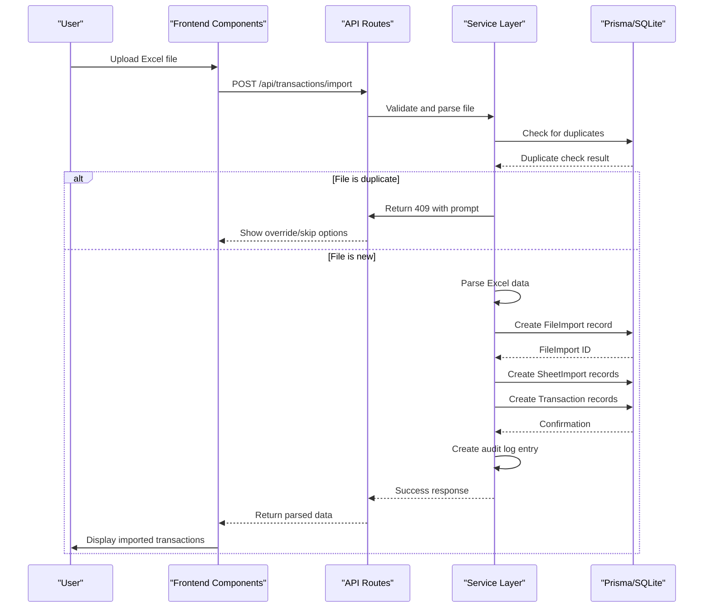
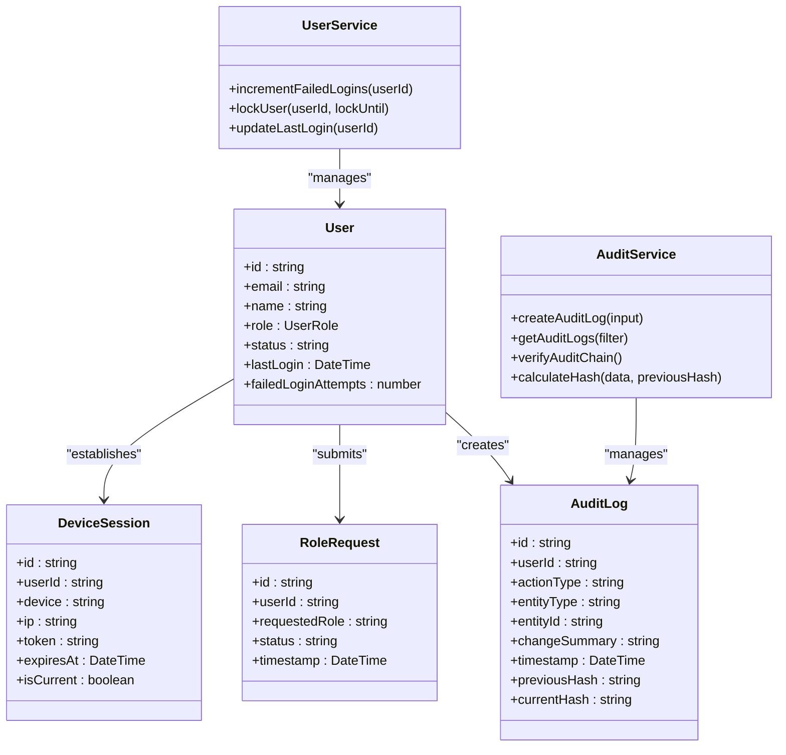

# System Overview

<cite>
**Referenced Files in This Document**   
- [README.md](file://README.md)
- [app/layout.tsx](file://app/layout.tsx)
- [components/ReconcileProApp.tsx](file://components/ReconcileProApp.tsx)
- [components/DualPaneTransactionView.tsx](file://components/DualPaneTransactionView.tsx)
- [components/FileSheetSelector.tsx](file://components/FileSheetSelector.tsx)
- [lib/auth.ts](file://lib/auth.ts)
- [lib/prisma.ts](file://lib/prisma.ts)
- [services/AuditService.ts](file://services/AuditService.ts)
- [app/api/transactions/import/route.ts](file://app/api/transactions/import/route.ts)
- [app/api/transactions/sheets/route.ts](file://app/api/transactions/sheets/route.ts)
- [lib/excel-import.ts](file://lib/excel-import.ts)
- [lib/types.ts](file://lib/types.ts)
- [lib/constants.ts](file://lib/constants.ts)
- [prisma/schema.prisma](file://prisma/schema.prisma)
- [components/TransactionImporter.tsx](file://components/TransactionImporter.tsx)
- [components/TransactionImportWorkspace.tsx](file://components/TransactionImportWorkspace.tsx)
</cite>

## Table of Contents
1. [Introduction](#introduction)
2. [Core Purpose and Functionality](#core-purpose-and-functionality)
3. [High-Level Architecture](#high-level-architecture)
4. [Core Workflows](#core-workflows)
5. [Security and Access Control](#security-and-access-control)
6. [Technical Deep Dive](#technical-deep-dive)
7. [Performance and Common Issues](#performance-and-common-issues)

## Introduction

The analyzer-web financial reconciliation platform is a full-stack application designed for enterprise banking environments to match internal and external financial transactions. It provides a robust system for manual and automated reconciliation, maintaining comprehensive audit trails, and enabling data-driven reconciliation decisions. Built with modern technologies including Next.js 14 App Router, Prisma ORM, and NextAuth.js, the platform ensures secure, reliable, and scalable financial data processing.

**Section sources**
- [README.md](file://README.md#L1-L253)

## Core Purpose and Functionality

The analyzer-web platform serves as a comprehensive financial reconciliation system that bridges the gap between internal general ledger (GL) transactions and external bank statement transactions. Its primary purpose is to enable financial analysts and auditors to identify, match, and verify transactions across different financial systems, ensuring accuracy and compliance with banking regulations.

The application supports multi-sheet Excel imports, allowing users to process complex workbooks containing account validation data. Each imported transaction is categorized as either internal (GL) or external (statement) and further classified as credit (CR) or debit (DR) based on the RECON field in the source data. This dual-pane approach facilitates side-by-side comparison and matching of transactions.

The platform maintains a complete audit trail of all user actions, providing cryptographic verification through hash chaining to detect any tampering. This ensures data integrity and supports regulatory compliance requirements for financial institutions. The system also enables version control through snapshot functionality, allowing users to save and restore reconciliation states for rollback and historical analysis.

**Section sources**
- [README.md](file://README.md#L3-L253)
- [components/ReconcileProApp.tsx](file://components/ReconcileProApp.tsx#L1-L1207)
- [components/DualPaneTransactionView.tsx](file://components/DualPaneTransactionView.tsx#L1-L290)

## High-Level Architecture

The analyzer-web platform follows a modern full-stack architecture built on Next.js 14 with the App Router pattern. The frontend is implemented using React 18 with a component-based architecture, while the backend leverages Next.js API routes for server-side operations. The application uses Prisma ORM as the data access layer, interfacing with a SQLite database for persistent storage.

Authentication is handled through NextAuth.js, providing secure JWT-based session management with role-based access control. The application follows a service-layer pattern, with business logic encapsulated in dedicated service classes such as AuditService, UserService, and MatchService. These services interact with the Prisma client to perform database operations, ensuring separation of concerns and maintainable code structure.

The frontend architecture is centered around the ReconcileProApp component, which orchestrates the main application state and coordinates various subcomponents. Key UI components include FileSheetSelector for file and sheet selection, DualPaneTransactionView for displaying transaction data, and TransactionImporter for handling Excel file uploads. The application uses React hooks extensively for state management, with context provided through the Providers component in the root layout.

```mermaid
graph TB
subgraph "Frontend"
A[ReconcileProApp] --> B[FileSheetSelector]
A --> C[DualPaneTransactionView]
A --> D[TransactionImporter]
A --> E[TransactionImportWorkspace]
F[Next.js App Router] --> A
end
subgraph "Backend"
G[API Routes] --> H[auth/[...nextauth]/route.ts]
G --> I[transactions/import/route.ts]
G --> J[transactions/sheets/route.ts]
K[Service Layer] --> L[AuditService]
K --> M[UserService]
K --> N[MatchService]
end
subgraph "Data Layer"
O[Prisma ORM]
P[SQLite Database]
end
A --> G
G --> K
K --> O
O --> P
H --> O
I --> O
J --> O
```

**Diagram sources **
- [app/layout.tsx](file://app/layout.tsx#L1-L36)
- [components/ReconcileProApp.tsx](file://components/ReconcileProApp.tsx#L1-L1207)
- [app/api/transactions/import/route.ts](file://app/api/transactions/import/route.ts#L1-L264)
- [app/api/transactions/sheets/route.ts](file://app/api/transactions/sheets/route.ts#L1-L166)
- [services/AuditService.ts](file://services/AuditService.ts#L1-L264)
- [lib/prisma.ts](file://lib/prisma.ts#L1-L11)

**Section sources**
- [README.md](file://README.md#L130-L161)
- [app/layout.tsx](file://app/layout.tsx#L1-L36)
- [components/ReconcileProApp.tsx](file://components/ReconcileProApp.tsx#L1-L1207)

## Core Workflows

The analyzer-web platform implements several core workflows that support the financial reconciliation process. These workflows are designed to be intuitive for users while ensuring data integrity and security.

The user authentication workflow begins with the login page, where users enter their credentials. NextAuth.js handles the authentication process, validating credentials against the database and creating a JWT session. The system implements security features such as failed login attempt tracking (5 attempts, 15-minute lockout) and session management with device tracking. Once authenticated, users are redirected to the main application interface based on their role.

The Excel transaction import workflow allows users to upload Excel files containing financial data. The system validates the file format, checks for duplicates using SHA-256 hashing, and parses the data into transaction sets. Each sheet in the workbook is processed to extract GL and statement transactions, with metadata such as department, branch, and reporting date preserved. The parsed data is then persisted to the database through the /api/transactions/import API route, with comprehensive audit logging.

The dual-pane reconciliation interface displays GL transactions on the left and statement transactions on the right, enabling users to visually compare and match entries. Users can select transactions from both panes and create match groups, with the system enforcing strict matching rules (difference must be exactly zero). The match group creation process includes validation to prevent conflicts of interest through separation of duties.

Snapshot versioning allows users to save the current state of their reconciliation work, including all transactions and matches. These snapshots can be restored later, providing a version control mechanism for reconciliation data. The system automatically creates snapshots on import and allows manual snapshots with custom labels, supporting audit requirements and data recovery.



**Diagram sources **
- [lib/auth.ts](file://lib/auth.ts#L1-L225)
- [app/api/transactions/import/route.ts](file://app/api/transactions/import/route.ts#L1-L264)
- [components/TransactionImporter.tsx](file://components/TransactionImporter.tsx#L1-L394)
- [components/TransactionImportWorkspace.tsx](file://components/TransactionImportWorkspace.tsx#L1-L119)
- [services/AuditService.ts](file://services/AuditService.ts#L1-L264)

**Section sources**
- [README.md](file://README.md#L19-L26)
- [components/ReconcileProApp.tsx](file://components/ReconcileProApp.tsx#L1-L1207)
- [components/FileSheetSelector.tsx](file://components/FileSheetSelector.tsx#L1-L114)
- [components/DualPaneTransactionView.tsx](file://components/DualPaneTransactionView.tsx#L1-L290)

## Security and Access Control

The analyzer-web platform implements comprehensive security measures to protect sensitive financial data and ensure compliance with banking regulations. The system features role-based access control (RBAC) with four distinct roles: Admin, Manager, Analyst, and Auditor, each with specific permissions defined in the DEFAULT_ROLE_PERMISSIONS constant.

Authentication is secured through NextAuth.js with JWT session management. The system enforces strong password policies (minimum 12 characters with mixed complexity) and implements failed login attempt tracking with a 5-attempt limit and 15-minute lockout period. Sessions are protected with CSRF tokens and have a 24-hour maximum age, with automatic refresh every hour. An idle timeout of 15 minutes automatically logs out inactive users to prevent unauthorized access.

Cryptographic audit logging is implemented through the AuditService, which creates a tamper-evident log of all user actions. Each audit log entry includes a hash chain, where the current hash incorporates the previous hash, creating a verifiable sequence that detects any modifications. The service also captures metadata such as IP address, device fingerprint, and geolocation when available, providing comprehensive audit trails for compliance purposes.

The platform enforces separation of duties through business logic validation. For example, users who imported transactions cannot approve adjustments on those same transactions unless they have Admin privileges. This prevents conflicts of interest and ensures proper checks and balances in the reconciliation process. Permission validation occurs on all protected operations, with fine-grained access control for critical functions like user management, period locking, and adjustment approvals.



**Diagram sources **
- [lib/auth.ts](file://lib/auth.ts#L1-L225)
- [services/AuditService.ts](file://services/AuditService.ts#L1-L264)
- [services/BaseService.ts](file://services/BaseService.ts#L1-L20)
- [lib/types.ts](file://lib/types.ts#L1-L132)
- [lib/constants.ts](file://lib/constants.ts#L1-L50)
- [prisma/schema.prisma](file://prisma/schema.prisma#L1-L374)

**Section sources**
- [README.md](file://README.md#L164-L189)
- [lib/auth.ts](file://lib/auth.ts#L1-L225)
- [services/AuditService.ts](file://services/AuditService.ts#L1-L264)
- [lib/constants.ts](file://lib/constants.ts#L1-L50)

## Technical Deep Dive

The analyzer-web platform's technical implementation centers around nine core entities defined in the Prisma schema: User, Transaction, MatchGroup, AuditLog, SystemSnapshot, RoleRequest, DeviceSession, FinancialPeriod, and FileImport (with related SheetImport). These entities form the foundation of the application's data model, with relationships established through foreign keys and Prisma relations.

The ReconcileProApp component serves as the main orchestrator, managing application state including transactions, matches, audit logs, and user permissions. It uses React's useState and useEffect hooks extensively for state management and side effects. The component coordinates between various subcomponents, such as FileSheetSelector for file selection and DualPaneTransactionView for transaction display, ensuring a cohesive user experience.

The database schema design emphasizes data integrity and auditability. Transactions are stored with all original Excel columns (SN, DATE, DESCRIPTION, AMOUNT, GL Ref No., AGING(DAYS), RECON) while also maintaining normalized fields for application logic. The AuditLog entity implements a hash chain mechanism where each entry's currentHash incorporates the previousHash, creating a cryptographic sequence that detects tampering. This design follows blockchain-like principles for audit trail integrity.

Service-layer patterns are implemented through classes that extend BaseService, providing common functionality like transaction management and error handling. The AuditService, for example, encapsulates all audit-related operations, including log creation, retrieval, and chain verification. This separation of concerns allows for reusable, testable code and simplifies maintenance.

JWT session management is implemented through NextAuth.js with custom callbacks that attach user metadata (ID, role, avatar) to the session token. The system uses in-memory storage for login attempts (with the caveat that this resets on server restart) and database-backed storage for persistent data like user accounts and audit logs. Environment validation at startup ensures critical configuration like NEXTAUTH_SECRET is present before the application starts.

**Section sources**
- [components/ReconcileProApp.tsx](file://components/ReconcileProApp.tsx#L1-L1207)
- [prisma/schema.prisma](file://prisma/schema.prisma#L1-L374)
- [lib/auth.ts](file://lib/auth.ts#L1-L225)
- [services/AuditService.ts](file://services/AuditService.ts#L1-L264)
- [services/BaseService.ts](file://services/BaseService.ts#L1-L20)
- [lib/prisma.ts](file://lib/prisma.ts#L1-L11)
- [lib/types.ts](file://lib/types.ts#L1-L132)

## Performance and Common Issues

The analyzer-web platform addresses several performance considerations and common issues to ensure a smooth user experience in production environments. Efficient transaction table rendering is achieved through selective re-renders and memoization of expensive operations, preventing performance degradation with large datasets.

Session timeout handling is implemented with client-side tracking of user activity (mouse movement, keystrokes, clicks, scrolling) and a 15-minute idle timeout. When the timeout is reached, the system automatically logs out the user to prevent unauthorized access to sensitive financial data. This client-side approach ensures immediate response to inactivity without requiring constant server polling.

The failed login lockout mechanism combines in-memory tracking for immediate enforcement with database persistence for long-term account security. When a user exceeds the maximum login attempts (5), their account is locked for 15 minutes. The system checks both the in-memory cache and the database record to determine lock status, providing defense in depth against brute force attacks.

Common issues are addressed through proactive error handling and user feedback. For example, when importing duplicate Excel files, the system detects the conflict and presents users with options to override the existing data or skip the import. This prevents accidental data duplication while maintaining workflow continuity. The application also validates Excel file structure, checking for "dept" in cells A1:D10 to identify valid account sheets, reducing errors from malformed inputs.

API endpoint protection is implemented through authentication checks on all routes, with specific authorization based on user roles. Rate limiting is configured for single-instance deployments, with plans to implement Redis-backed rate limiting for multi-instance environments. Security headers including CSP, HSTS, X-Frame-Options, and X-Content-Type-Options are enforced to protect against common web vulnerabilities.

**Section sources**
- [README.md](file://README.md#L166-L195)
- [lib/auth.ts](file://lib/auth.ts#L1-L225)
- [components/ReconcileProApp.tsx](file://components/ReconcileProApp.tsx#L1-L1207)
- [app/api/transactions/import/route.ts](file://app/api/transactions/import/route.ts#L1-L264)
- [lib/constants.ts](file://lib/constants.ts#L1-L50)