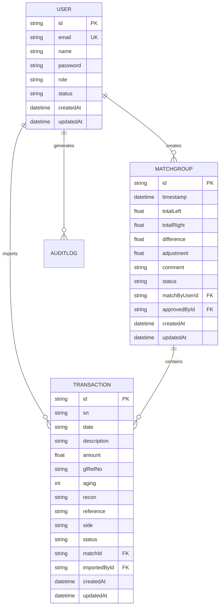
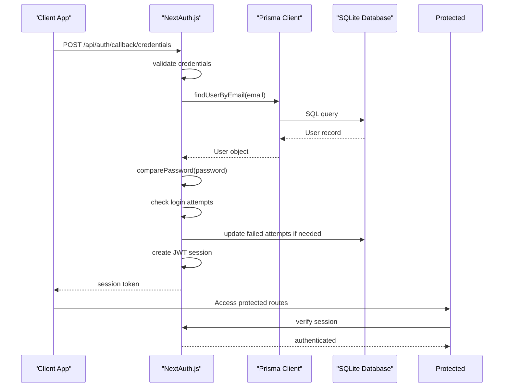
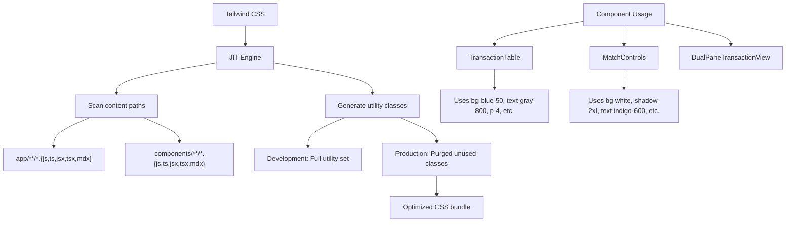
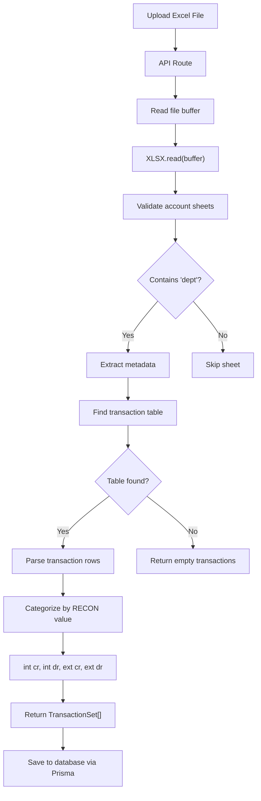

# Technology Stack

<cite>
**Referenced Files in This Document**   
- [next.config.mjs](file://next.config.mjs)
- [package.json](file://package.json)
- [tailwind.config.ts](file://tailwind.config.ts)
- [lib/prisma.ts](file://lib/prisma.ts)
- [lib/auth.ts](file://lib/auth.ts)
- [lib/env-validation.ts](file://lib/env-validation.ts)
- [lib/excel-import.ts](file://lib/excel-import.ts)
- [lib/types.ts](file://lib/types.ts)
- [components/TransactionTable.tsx](file://components/TransactionTable.tsx)
- [components/MatchControls.tsx](file://components/MatchControls.tsx)
- [prisma/schema.prisma](file://prisma/schema.prisma)
- [docs/TAILWIND_TROUBLESHOOTING.md](file://docs/TAILWIND_TROUBLESHOOTING.md)
- [app/providers.tsx](file://app/providers.tsx)
- [middleware.ts](file://middleware.ts)
</cite>

## Table of Contents
1. [Core Frameworks and Libraries](#core-frameworks-and-libraries)
2. [Configuration and Optimization](#configuration-and-optimization)
3. [Type Safety and Data Modeling](#type-safety-and-data-modeling)
4. [Authentication and Security](#authentication-and-security)
5. [Styling and UI Components](#styling-and-ui-components)
6. [Excel Parsing and Data Import](#excel-parsing-and-data-import)
7. [Performance Optimization and Troubleshooting](#performance-optimization-and-troubleshooting)

## Core Frameworks and Libraries

The analyzer-web application leverages a modern technology stack built around Next.js 14, providing a robust foundation for server-side rendering, API routes, and seamless full-stack integration. Next.js serves as the primary framework, enabling hybrid static and server rendering, API route handling, and file-based routing through the App Router. The application uses React 18 for building interactive user interfaces with client components, while leveraging Next.js's server components for optimized performance.

Prisma ORM acts as the type-safe database access layer, connecting the application to its SQLite database with TypeScript integration. Prisma Client provides type-safe queries and eliminates SQL injection risks while maintaining developer productivity. The application uses NextAuth.js for comprehensive authentication flows, supporting credential-based login with bcryptjs password hashing and JWT-based session management. Tailwind CSS enables utility-first styling with a highly customizable design system, while the xlsx library handles Excel file parsing for transaction data imports.

**Section sources**
- [package.json](file://package.json#L20-L31)
- [lib/prisma.ts](file://lib/prisma.ts#L1-L11)
- [lib/auth.ts](file://lib/auth.ts#L3-L225)
- [tailwind.config.ts](file://tailwind.config.ts#L1-L17)

## Configuration and Optimization

The application's configuration is managed through `next.config.mjs`, which currently enables React Strict Mode for development. While the configuration is minimal, it follows Next.js 14 conventions and can be extended for modular imports and asset optimization. The Tailwind CSS configuration in `tailwind.config.ts` specifies content paths for JIT compilation, scanning both the `app/` and `components/` directories to generate utility classes based on usage.

PostCSS is configured with Tailwind CSS and Autoprefixer to handle CSS processing, ensuring cross-browser compatibility and optimized output. The application's build process is managed through npm scripts in `package.json`, including development, build, and start commands. The `postinstall` script automatically runs `prisma generate` to generate the Prisma Client, ensuring type safety and database schema synchronization.

**Section sources**
- [next.config.mjs](file://next.config.mjs#L1-L6)
- [tailwind.config.ts](file://tailwind.config.ts#L1-L17)
- [package.json](file://package.json#L6-L8)
- [postcss.config.cjs](file://postcss.config.cjs)

## Type Safety and Data Modeling

TypeScript provides comprehensive type safety throughout the application, with a well-defined type system that spans from the database layer to the UI components. The Prisma schema in `prisma/schema.prisma` defines the data model with relations between entities such as User, Transaction, MatchGroup, and AuditLog. Prisma generates TypeScript types from this schema, enabling type-safe database operations with autocomplete and compile-time checking.

Custom types are defined in `lib/types.ts`, including enums for transaction status, user roles, and side indicators, as well as interfaces for transactions, matches, and audit logs. These types are used consistently across the application, ensuring data integrity and reducing runtime errors. The integration between Prisma's generated types and custom types creates a robust type system that catches errors during development rather than at runtime.

**Diagram sources**
- [prisma/schema.prisma](file://prisma/schema.prisma#L18-L374)
- [lib/types.ts](file://lib/types.ts#L1-L132)

## Authentication and Security

NextAuth.js provides a comprehensive authentication solution with a custom credentials provider for email/password login. The authentication flow is implemented in `lib/auth.ts`, which includes password verification with bcryptjs, login attempt tracking, and account lockout functionality after multiple failed attempts. The configuration enforces the use of a secure `NEXTAUTH_SECRET` environment variable, with validation to prevent deployment with weak or placeholder secrets.

The authentication system integrates with Prisma Client to query user data and update login metadata, including last login time and failed attempt counters. JWT callbacks in the NextAuth configuration serialize user data into the token, while session callbacks restore this data for client-side access. Middleware in `middleware.ts` adds security headers including Content Security Policy, Strict Transport Security, and XSS protection, creating a secure environment compliant with banking industry standards.

**Diagram sources**
- [lib/auth.ts](file://lib/auth.ts#L3-L225)
- [middleware.ts](file://middleware.ts#L1-L56)
- [app/providers.tsx](file://app/providers.tsx#L1-L8)

## Styling and UI Components

Tailwind CSS provides a utility-first approach to styling, enabling rapid UI development with consistent design tokens. The configuration scans the `app/` and `components/` directories to generate utility classes, with purging enabled in production to minimize bundle size. The `TransactionTable` component demonstrates extensive use of Tailwind classes for layout, spacing, colors, and responsive design, with conditional styling based on transaction type and selection state.

The `MatchControls` component uses Tailwind classes to create a fixed control panel with flexbox layout, color-coded indicators, and responsive design. Components leverage Tailwind's responsive prefixes and utility classes for padding, margins, colors, and shadows, creating a cohesive visual design system. The application follows accessibility best practices with proper contrast ratios and semantic HTML structure.

The `TAILWIND_TROUBLESHOOTING.md` document provides guidance for resolving common issues such as class purging in production builds, where unused classes are removed during optimization. The solution involves ensuring component files are within the content paths specified in `tailwind.config.ts` and clearing the Next.js cache when making configuration changes.

**Diagram sources**
- [tailwind.config.ts](file://tailwind.config.ts#L4-L7)
- [components/TransactionTable.tsx](file://components/TransactionTable.tsx#L1-L503)
- [components/MatchControls.tsx](file://components/MatchControls.tsx#L1-L125)
- [docs/TAILWIND_TROUBLESHOOTING.md](file://docs/TAILWIND_TROUBLESHOOTING.md#L1-L307)

## Excel Parsing and Data Import

The `excel-import.ts` utility provides robust Excel file parsing capabilities using the xlsx library. The implementation includes functions to validate account sheets by checking for "dept" in specific cells, generate file hashes for duplicate detection, and extract metadata from Excel headers. The parsing process converts Excel sheets into structured transaction data with proper categorization into internal/external and credit/debit transactions.

The import workflow begins with file upload through API routes, where the buffer is passed to `parseExcelFile()` which reads the workbook and processes each sheet. The `parseSheetData()` function identifies transaction tables by locating headers like "SN", "DATE", and "DESCRIPTION", then extracts transaction rows while skipping summary lines. The implementation handles various data formats and edge cases, including empty rows and invalid amounts.

**Diagram sources**
- [lib/excel-import.ts](file://lib/excel-import.ts#L1-L327)
- [app/api/transactions/import/route.ts](file://app/api/transactions/import/route.ts)

## Performance Optimization and Troubleshooting

The application implements several performance optimizations, including code splitting through Next.js's automatic code splitting and lazy loading of heavy components. The Prisma Client is configured with a global instance to prevent multiple client creations in development, improving performance and reducing database connections. Environment validation in `env-validation.ts` ensures runtime correctness by validating required environment variables and providing warnings for potential configuration issues.

Common issues like Tailwind class purging are addressed through proper configuration and cache management, as documented in `TAILWIND_TROUBLESHOOTING.md`. The solution involves verifying content paths, clearing the `.next` cache, and restarting the development server. For production deployments, the application validates environment variables at startup, preventing launch with misconfigured secrets or database connections.

Performance considerations include efficient database queries with Prisma, proper indexing in the database schema, and optimized rendering of transaction tables with React.memo and useMemo hooks. The application also implements client-side caching of API responses and uses Next.js's built-in image optimization for logo assets.

**Section sources**
- [lib/env-validation.ts](file://lib/env-validation.ts#L1-L171)
- [lib/prisma.ts](file://lib/prisma.ts#L3-L11)
- [components/TransactionTable.tsx](file://components/TransactionTable.tsx#L1-L503)
- [docs/TAILWIND_TROUBLESHOOTING.md](file://docs/TAILWIND_TROUBLESHOOTING.md#L1-L307)