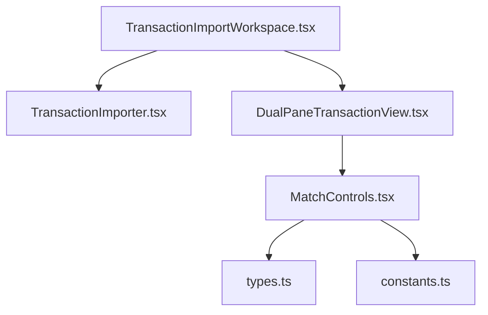
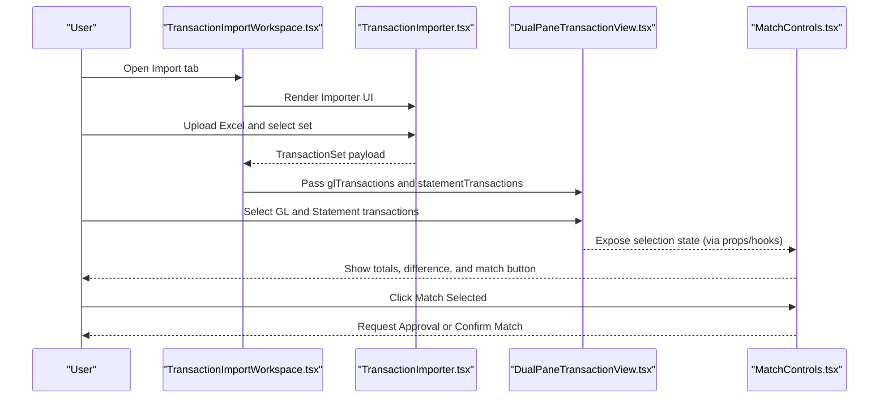
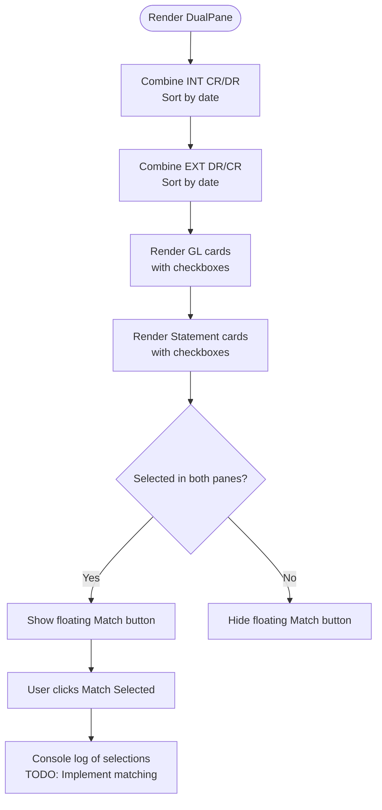
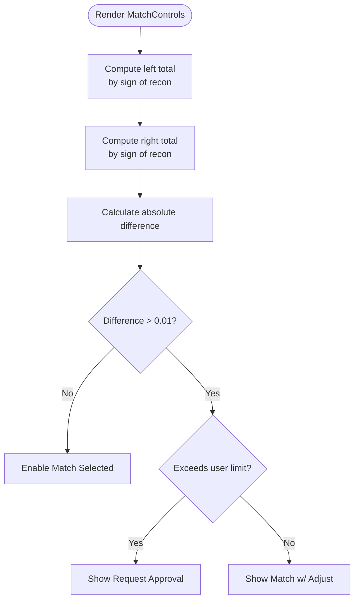
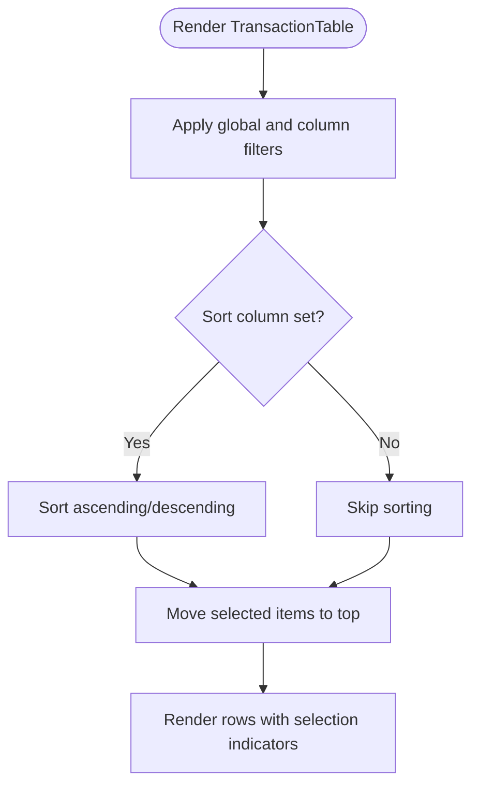
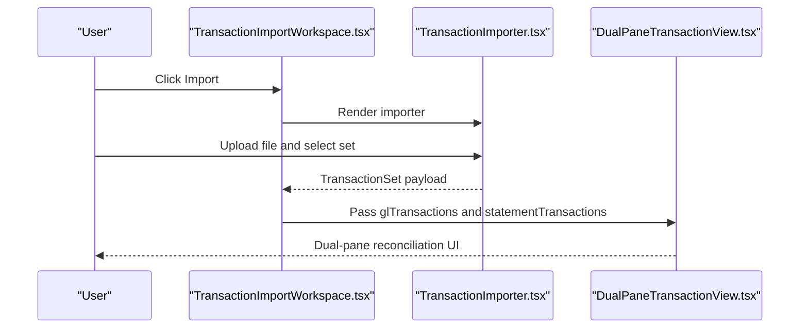
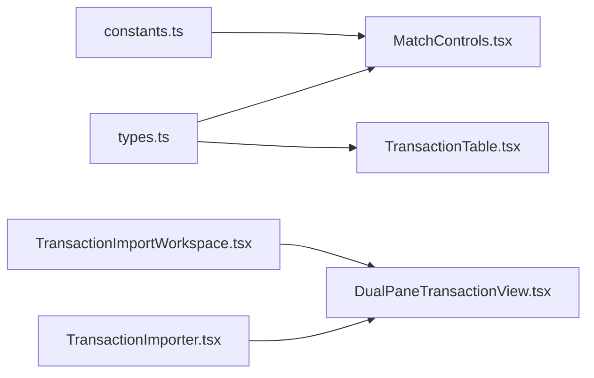

# Dual-Pane Reconciliation Interface

<cite>
**Referenced Files in This Document**
- [DualPaneTransactionView.tsx](file://components/DualPaneTransactionView.tsx)
- [MatchControls.tsx](file://components/MatchControls.tsx)
- [TransactionTable.tsx](file://components/TransactionTable.tsx)
- [TransactionImporter.tsx](file://components/TransactionImporter.tsx)
- [TransactionImportWorkspace.tsx](file://components/TransactionImportWorkspace.tsx)
- [TRANSACTION_IMPORT_GUIDE.md](file://docs/TRANSACTION_IMPORT_GUIDE.md)
- [types.ts](file://lib/types.ts)
- [constants.ts](file://lib/constants.ts)
</cite>

## Table of Contents
1. [Introduction](#introduction)
2. [Project Structure](#project-structure)
3. [Core Components](#core-components)
4. [Architecture Overview](#architecture-overview)
5. [Detailed Component Analysis](#detailed-component-analysis)
6. [Dependency Analysis](#dependency-analysis)
7. [Performance Considerations](#performance-considerations)
8. [Troubleshooting Guide](#troubleshooting-guide)
9. [Conclusion](#conclusion)
10. [Appendices](#appendices)

## Introduction
This document explains the dual-pane reconciliation interface implemented in the application. It focuses on how GL (Internal) transactions are presented on the left and Statement (External) transactions on the right, with color-coded indicators and selection-driven matching controls. It also documents the selection state management, filtering and totals, and the floating match button behavior. Guidance is provided for integrating with the broader import workflow and for addressing common issues such as incorrect categorization, selection state management, and mobile responsiveness. Best practices for performance and accessibility are included.

## Project Structure
The dual-pane reconciliation UI is part of the transaction import workflow. The workspace orchestrates the importer and the dual-pane view, while the dual-pane view renders two panes and exposes selection state and a floating match button. Matching controls provide a persistent panel for totals, difference calculation, comments, and approval gating.

**Diagram sources**
- [TransactionImportWorkspace.tsx](file://components/TransactionImportWorkspace.tsx#L1-L119)
- [TransactionImporter.tsx](file://components/TransactionImporter.tsx#L1-L394)
- [DualPaneTransactionView.tsx](file://components/DualPaneTransactionView.tsx#L1-L290)
- [MatchControls.tsx](file://components/MatchControls.tsx#L1-L125)
- [types.ts](file://lib/types.ts#L1-L132)
- [constants.ts](file://lib/constants.ts#L1-L50)

**Section sources**
- [TransactionImportWorkspace.tsx](file://components/TransactionImportWorkspace.tsx#L1-L119)
- [TransactionImporter.tsx](file://components/TransactionImporter.tsx#L1-L394)
- [DualPaneTransactionView.tsx](file://components/DualPaneTransactionView.tsx#L1-L290)
- [MatchControls.tsx](file://components/MatchControls.tsx#L1-L125)

## Core Components
- DualPaneTransactionView: Renders GL and Statement panes, manages selection state, computes totals, and displays a floating match button when selections exist.
- MatchControls: Provides a fixed panel for totals, difference calculation, comments, and the match action with approval gating based on limits.
- TransactionTable: A reusable table component for rendering transaction lists with filtering, sorting, and selection. While not used directly in the dual-pane view, it demonstrates best practices for large datasets and selection UX.
- TransactionImporter and TransactionImportWorkspace: Orchestrate the import workflow and pass transaction sets to the dual-pane view.

**Section sources**
- [DualPaneTransactionView.tsx](file://components/DualPaneTransactionView.tsx#L1-L290)
- [MatchControls.tsx](file://components/MatchControls.tsx#L1-L125)
- [TransactionTable.tsx](file://components/TransactionTable.tsx#L1-L503)
- [TransactionImporter.tsx](file://components/TransactionImporter.tsx#L1-L394)
- [TransactionImportWorkspace.tsx](file://components/TransactionImportWorkspace.tsx#L1-L119)

## Architecture Overview
The reconciliation interface is driven by a transaction set produced by the importer. The workspace switches between the importer UI and the dual-pane view. The dual-pane view receives categorized transactions and renders them in two columns. Selection state is tracked separately for each pane. When selections exist in both panes, a floating match button becomes visible. A separate match control panel calculates totals and differences and gates actions based on user roles and thresholds.

**Diagram sources**
- [TransactionImportWorkspace.tsx](file://components/TransactionImportWorkspace.tsx#L1-L119)
- [TransactionImporter.tsx](file://components/TransactionImporter.tsx#L1-L394)
- [DualPaneTransactionView.tsx](file://components/DualPaneTransactionView.tsx#L1-L290)
- [MatchControls.tsx](file://components/MatchControls.tsx#L1-L125)

## Detailed Component Analysis

### DualPaneTransactionView: Layout, Selection, and Floating Match Button
- Layout design:
  - Two equal-width panes arranged in a grid. Left pane for GL (Internal) transactions, right pane for Statement (External) transactions.
  - Each pane has a header with a gradient color scheme, item counts, subtype counts, and total amounts.
  - Scrollable content areas with custom scrollbar styling.
- Data preparation:
  - Combines INT CR and INT DR into a single list for GL and EXT DR and EXT CR for Statement, preserving order by date.
  - Adds a subType marker to each transaction for rendering and color coding.
- Selection state:
  - Tracks selected GL and Statement transaction IDs in separate Sets.
  - Provides toggle handlers for each pane that update selection Sets and preserve selection identity per rendered item.
- Rendering:
  - Uses a compact card layout per transaction with a checkbox and a small badge indicating subType.
  - Applies color classes based on subType for visual distinction.
  - Totals computed per pane and formatted as currency.
- Floating match button:
  - Appears only when selections exist in both panes.
  - Displays a combined count of selected items and logs the selection IDs to the console (placeholder for future matching logic).

**Diagram sources**
- [DualPaneTransactionView.tsx](file://components/DualPaneTransactionView.tsx#L1-L290)

**Section sources**
- [DualPaneTransactionView.tsx](file://components/DualPaneTransactionView.tsx#L1-L290)
- [TRANSACTION_IMPORT_GUIDE.md](file://docs/TRANSACTION_IMPORT_GUIDE.md#L42-L63)

### MatchControls: Totals, Difference, Comments, and Approval Gating
- Inputs:
  - Receives selected transactions from the left and right sides, a comment, and UI flags.
  - Uses user role and constants to gate actions.
- Totals and difference:
  - Computes totals for each side considering DR/CR semantics (DR is treated as negative).
  - Calculates absolute difference and conditionally shows auto-writeoff messaging below a threshold.
- UI affordances:
  - Clear selection button.
  - Comment toggle with a small indicator when text is present.
  - Match button with dynamic label and icon depending on difference magnitude and user role limits.
- Approval gating:
  - If difference exceeds the user’s adjustment limit, prompts for approval; otherwise offers a direct match option.

**Diagram sources**
- [MatchControls.tsx](file://components/MatchControls.tsx#L1-L125)
- [constants.ts](file://lib/constants.ts#L1-L50)
- [types.ts](file://lib/types.ts#L1-L132)

**Section sources**
- [MatchControls.tsx](file://components/MatchControls.tsx#L1-L125)
- [constants.ts](file://lib/constants.ts#L1-L50)
- [types.ts](file://lib/types.ts#L1-L132)

### TransactionTable: Filtering, Sorting, Selection, and Accessibility
- Filtering and sorting:
  - Supports global search across multiple fields and per-column filters.
  - Sorts by clicking headers, cycling through asc/desc/null.
- Selection:
  - Highlights selected rows distinctly per side (blue for left, green for right).
  - Moves selected items to the top of the list for emphasis.
- Rendering:
  - Uses a table layout with sticky headers and custom scrollbar container.
  - Formats amounts with currency or local numeric format and negative amounts in parentheses.
- Accessibility:
  - Keyboard-friendly interactions via clickable rows and checkboxes.
  - Clear visual focus states and contrast-aware color schemes.

**Diagram sources**
- [TransactionTable.tsx](file://components/TransactionTable.tsx#L1-L503)

**Section sources**
- [TransactionTable.tsx](file://components/TransactionTable.tsx#L1-L503)

### Integration with Import Workflow
- TransactionImportWorkspace:
  - Switches between importer UI and dual-pane view.
  - On successful import, selects the first transaction set and passes it to the dual-pane view.
- TransactionImporter:
  - Uploads Excel files, detects transaction sets, and provides a dropdown to select a set.
  - Loads full transaction data for the selected set and invokes callbacks to update the workspace.

**Diagram sources**
- [TransactionImportWorkspace.tsx](file://components/TransactionImportWorkspace.tsx#L1-L119)
- [TransactionImporter.tsx](file://components/TransactionImporter.tsx#L1-L394)
- [DualPaneTransactionView.tsx](file://components/DualPaneTransactionView.tsx#L1-L290)

**Section sources**
- [TransactionImportWorkspace.tsx](file://components/TransactionImportWorkspace.tsx#L1-L119)
- [TransactionImporter.tsx](file://components/TransactionImporter.tsx#L1-L394)

## Dependency Analysis
- DualPaneTransactionView depends on:
  - ImportedTransaction shape and categorization (from the importer).
  - UI styling and icons via Tailwind classes and Lucide icons.
- MatchControls depends on:
  - Transaction type definitions and Side enum.
  - Role-based constants for approval thresholds.
- TransactionTable is a reusable component with its own filtering and selection logic.

**Diagram sources**
- [types.ts](file://lib/types.ts#L1-L132)
- [constants.ts](file://lib/constants.ts#L1-L50)
- [MatchControls.tsx](file://components/MatchControls.tsx#L1-L125)
- [TransactionTable.tsx](file://components/TransactionTable.tsx#L1-L503)
- [TransactionImporter.tsx](file://components/TransactionImporter.tsx#L1-L394)
- [TransactionImportWorkspace.tsx](file://components/TransactionImportWorkspace.tsx#L1-L119)
- [DualPaneTransactionView.tsx](file://components/DualPaneTransactionView.tsx#L1-L290)

**Section sources**
- [types.ts](file://lib/types.ts#L1-L132)
- [constants.ts](file://lib/constants.ts#L1-L50)
- [MatchControls.tsx](file://components/MatchControls.tsx#L1-L125)
- [TransactionTable.tsx](file://components/TransactionTable.tsx#L1-L503)
- [TransactionImporter.tsx](file://components/TransactionImporter.tsx#L1-L394)
- [TransactionImportWorkspace.tsx](file://components/TransactionImportWorkspace.tsx#L1-L119)
- [DualPaneTransactionView.tsx](file://components/DualPaneTransactionView.tsx#L1-L290)

## Performance Considerations
- Large dataset rendering:
  - The dual-pane view currently renders cards for all transactions. For very large sets, consider virtualization or pagination to reduce DOM nodes and improve scroll performance.
  - The reusable TransactionTable demonstrates robust filtering and sorting with memoization; similar patterns can be adapted for the dual-pane view if needed.
- Selection state management:
  - Using Sets for selection IDs ensures O(1) toggling and efficient updates.
- Rendering optimization:
  - Memoize derived data (e.g., combined lists and totals) to avoid unnecessary re-renders.
  - Keep item keys stable across renders to help React reconcile efficiently.

[No sources needed since this section provides general guidance]

## Troubleshooting Guide
- Incorrect transaction categorization:
  - Ensure the Type column in the Excel file contains only supported values: int cr, int dr, ext dr, ext cr.
  - Verify the importer recognizes these values and populates glTransactions and statementTransactions accordingly.
- Selection state not persisting:
  - Confirm that selection toggles update the Sets correctly and that keys used for selection are stable across renders.
- Floating match button not appearing:
  - The button requires selections in both panes. Verify that selection Sets are populated and that the floating button condition evaluates to true.
- Mobile responsiveness:
  - The dual-pane layout uses a two-column grid. On narrow screens, consider stacking the panes vertically or adjusting spacing to prevent horizontal scrolling.
- Accessibility:
  - Ensure keyboard navigation works for toggling checkboxes and clicking rows.
  - Provide sufficient color contrast for badges and totals.
  - Add aria-labels or roles where appropriate for screen readers.

**Section sources**
- [TRANSACTION_IMPORT_GUIDE.md](file://docs/TRANSACTION_IMPORT_GUIDE.md#L116-L139)
- [TRANSACTION_IMPORT_GUIDE.md](file://docs/TRANSACTION_IMPORT_GUIDE.md#L372-L379)
- [DualPaneTransactionView.tsx](file://components/DualPaneTransactionView.tsx#L1-L290)
- [MatchControls.tsx](file://components/MatchControls.tsx#L1-L125)

## Conclusion
The dual-pane reconciliation interface cleanly separates GL and Statement transactions, uses color-coded indicators for quick scanning, and provides selection-driven matching controls. The design leverages clear separation of concerns: the workspace orchestrates imports, the dual-pane view manages selection and totals, and the match controls enforce business rules and approvals. With minor enhancements—such as virtualization for large datasets and responsive layout adjustments—the interface can scale effectively and remain accessible.

[No sources needed since this section summarizes without analyzing specific files]

## Appendices

### Usage Patterns and Recommendations
- Filtering and selection tracking:
  - Use the dual-pane view’s selection Sets to track user selections and compute totals.
  - For advanced filtering, consider adapting the TransactionTable’s filtering logic to the dual-pane cards if needed.
- Floating match button behavior:
  - The button appears only when selections exist in both panes. Keep this behavior to avoid accidental matches.
- Styling guidelines:
  - Follow the documented color scheme for GL (blue/indigo) and Statement (green/emerald) transactions.
  - Maintain consistent typography and spacing for readability.

**Section sources**
- [TRANSACTION_IMPORT_GUIDE.md](file://docs/TRANSACTION_IMPORT_GUIDE.md#L224-L243)
- [DualPaneTransactionView.tsx](file://components/DualPaneTransactionView.tsx#L1-L290)
- [MatchControls.tsx](file://components/MatchControls.tsx#L1-L125)