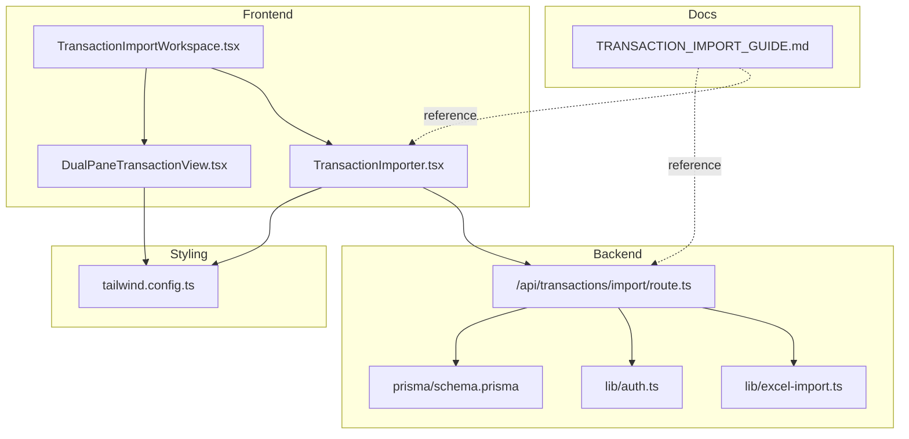
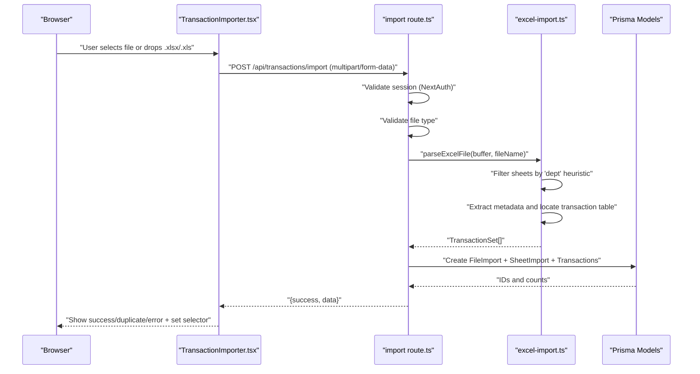
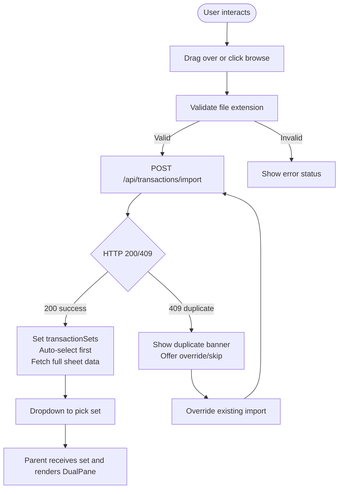
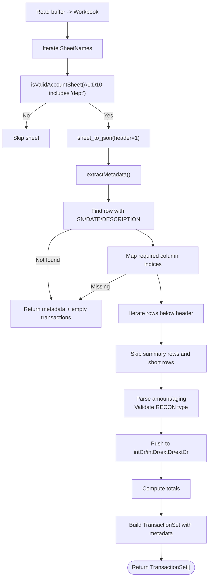
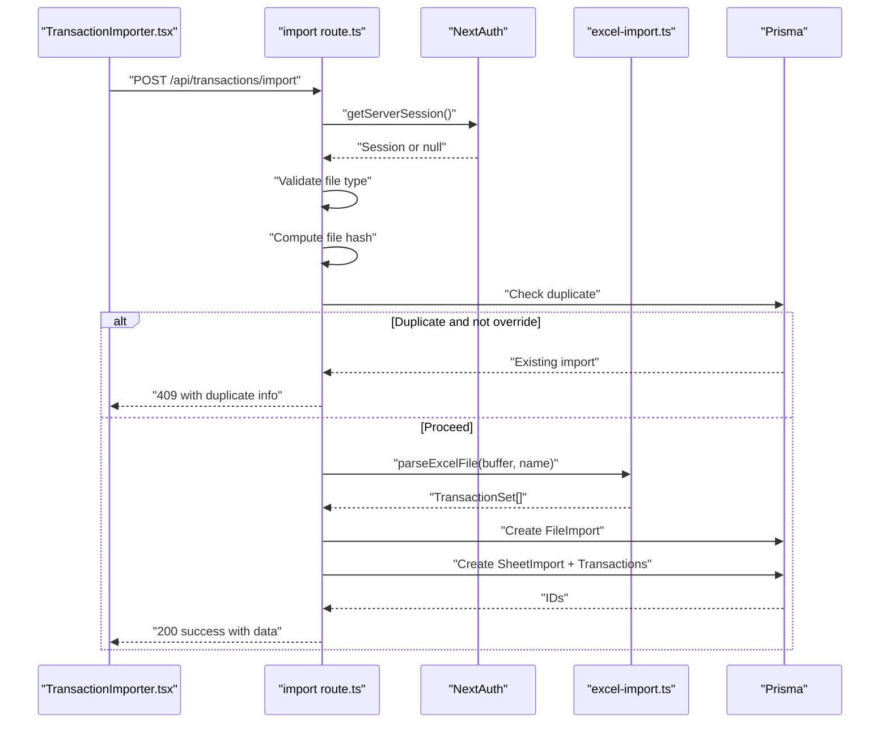
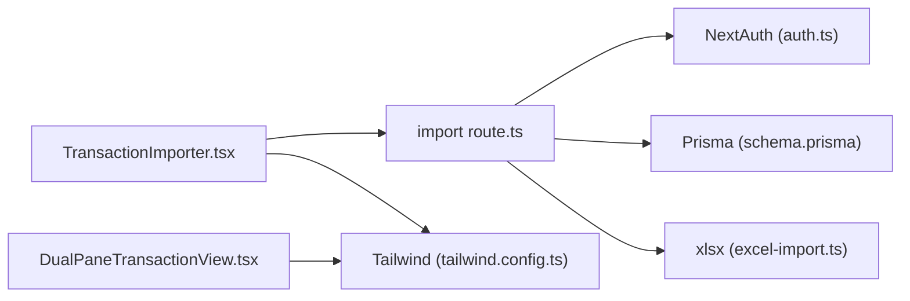

# Transaction Import

<cite>
**Referenced Files in This Document**
- [TransactionImporter.tsx](file://components/TransactionImporter.tsx)
- [excel-import.ts](file://lib/excel-import.ts)
- [import route.ts](file://app/api/transactions/import/route.ts)
- [TransactionImportWorkspace.tsx](file://components/TransactionImportWorkspace.tsx)
- [DualPaneTransactionView.tsx](file://components/DualPaneTransactionView.tsx)
- [TRANSACTION_IMPORT_GUIDE.md](file://docs/TRANSACTION_IMPORT_GUIDE.md)
- [auth.ts](file://lib/auth.ts)
- [tailwind.config.ts](file://tailwind.config.ts)
- [schema.prisma](file://prisma/schema.prisma)
- [types.ts](file://lib/types.ts)
</cite>

## Table of Contents
1. [Introduction](#introduction)
2. [Project Structure](#project-structure)
3. [Core Components](#core-components)
4. [Architecture Overview](#architecture-overview)
5. [Detailed Component Analysis](#detailed-component-analysis)
6. [Dependency Analysis](#dependency-analysis)
7. [Performance Considerations](#performance-considerations)
8. [Troubleshooting Guide](#troubleshooting-guide)
9. [Conclusion](#conclusion)
10. [Appendices](#appendices)

## Introduction
This document explains the transaction import feature end-to-end. It covers the frontend upload and selection workflow, the backend Excel parsing and persistence pipeline, and the dual-pane view for reconciling General Ledger (GL) versus bank statement transactions. It also documents the API contract, error handling, and integration points with NextAuth and Tailwind CSS.

## Project Structure
The transaction import feature spans UI components, a shared Excel parsing library, and a Next.js API route that validates sessions, parses Excel files, detects duplicates, and persists data to the database.

**Diagram sources**
- [TransactionImportWorkspace.tsx](file://components/TransactionImportWorkspace.tsx#L1-L119)
- [TransactionImporter.tsx](file://components/TransactionImporter.tsx#L1-L394)
- [DualPaneTransactionView.tsx](file://components/DualPaneTransactionView.tsx#L1-L290)
- [import route.ts](file://app/api/transactions/import/route.ts#L1-L264)
- [excel-import.ts](file://lib/excel-import.ts#L1-L327)
- [auth.ts](file://lib/auth.ts#L1-L225)
- [tailwind.config.ts](file://tailwind.config.ts#L1-L17)
- [TRANSACTION_IMPORT_GUIDE.md](file://docs/TRANSACTION_IMPORT_GUIDE.md#L1-L459)
- [schema.prisma](file://prisma/schema.prisma#L1-L374)

**Section sources**
- [TransactionImportWorkspace.tsx](file://components/TransactionImportWorkspace.tsx#L1-L119)
- [TransactionImporter.tsx](file://components/TransactionImporter.tsx#L1-L394)
- [DualPaneTransactionView.tsx](file://components/DualPaneTransactionView.tsx#L1-L290)
- [import route.ts](file://app/api/transactions/import/route.ts#L1-L264)
- [excel-import.ts](file://lib/excel-import.ts#L1-L327)
- [auth.ts](file://lib/auth.ts#L1-L225)
- [tailwind.config.ts](file://tailwind.config.ts#L1-L17)
- [TRANSACTION_IMPORT_GUIDE.md](file://docs/TRANSACTION_IMPORT_GUIDE.md#L1-L459)
- [schema.prisma](file://prisma/schema.prisma#L1-L374)

## Core Components
- TransactionImporter: Provides drag-and-drop and browse file upload, type validation, duplicate detection prompts, and a transaction set selector with summary cards.
- Excel parser (lib/excel-import.ts): Reads Excel buffers, filters sheets by a “dept” presence heuristic, extracts metadata, locates the transaction table, validates required columns, and categorizes transactions by type.
- Import API route (/api/transactions/import): Validates NextAuth session, accepts multipart/form-data, checks file type, computes a file hash, detects duplicates, parses Excel, persists FileImport and SheetImport records, and creates Transaction entries.
- TransactionImportWorkspace: Orchestrates the upload UI and the dual-pane view, toggling between the importer and the viewer.
- DualPaneTransactionView: Renders GL vs Statement transactions with selection, totals, and a floating match button placeholder.
- Tailwind CSS: Used for responsive, consistent UI styling across components.
- NextAuth integration: Ensures only authenticated users can import.

**Section sources**
- [TransactionImporter.tsx](file://components/TransactionImporter.tsx#L1-L394)
- [excel-import.ts](file://lib/excel-import.ts#L1-L327)
- [import route.ts](file://app/api/transactions/import/route.ts#L1-L264)
- [TransactionImportWorkspace.tsx](file://components/TransactionImportWorkspace.tsx#L1-L119)
- [DualPaneTransactionView.tsx](file://components/DualPaneTransactionView.tsx#L1-L290)
- [auth.ts](file://lib/auth.ts#L1-L225)
- [tailwind.config.ts](file://tailwind.config.ts#L1-L17)

## Architecture Overview
The import flow begins in the browser, moves to the API route, and ends with persisted records in the database. The UI updates reactively to show success, duplicates, or errors.

**Diagram sources**
- [TransactionImporter.tsx](file://components/TransactionImporter.tsx#L1-L394)
- [import route.ts](file://app/api/transactions/import/route.ts#L1-L264)
- [excel-import.ts](file://lib/excel-import.ts#L1-L327)
- [schema.prisma](file://prisma/schema.prisma#L1-L374)

## Detailed Component Analysis

### TransactionImporter.tsx
Responsibilities:
- Drag-and-drop and browse file selection with .xlsx/.xls validation.
- Upload via multipart/form-data to the import endpoint.
- Handle duplicate detection responses with override/skip actions.
- Auto-select first transaction set and fetch full sheet data.
- Render status messages and a transaction set selector with summary cards.

Key behaviors:
- Accepts only .xlsx and .xls files.
- On success, emits transactionSets to the parent and auto-selects the first set.
- On duplicate, displays a yellow banner with override/skip options.
- On selection change, fetches full sheet data if not yet loaded.

**Diagram sources**
- [TransactionImporter.tsx](file://components/TransactionImporter.tsx#L1-L394)

**Section sources**
- [TransactionImporter.tsx](file://components/TransactionImporter.tsx#L1-L394)

### Excel Parser (lib/excel-import.ts)
Responsibilities:
- Validate account sheets by scanning A1:D10 for “dept”.
- Extract metadata from the top portion of the sheet before the transaction table.
- Locate the transaction table by detecting headers (e.g., SN, DATE, DESCRIPTION).
- Validate required columns and skip summary rows.
- Parse amounts and aging, infer transaction type from RECON values, and categorize into GL/Statement buckets.

Parsing logic highlights:
- Column detection uses exact header matches for required fields.
- Amount normalization removes currency symbols and formatting.
- Type inference relies on RECON values mapped to internal categories.
- Metadata extraction scans for known keys and captures nearby values.

**Diagram sources**
- [excel-import.ts](file://lib/excel-import.ts#L1-L327)

**Section sources**
- [excel-import.ts](file://lib/excel-import.ts#L1-L327)

### Import API Route (/api/transactions/import)
Responsibilities:
- Authenticate via NextAuth session.
- Parse multipart/form-data and validate file type.
- Compute file hash and detect duplicates unless override is requested.
- Delegate parsing to the shared Excel parser.
- Persist FileImport, SheetImport, and Transaction records.
- Return structured success payload with transaction sets and counts.

Important validations and flows:
- Unauthorized if no session.
- File type must be .xlsx or .xls.
- Duplicate detection by checksum or filename; returns 409 with prompt.
- Override deletes existing import before proceeding.
- On success, returns transactionSets with minimal metadata; the UI later fetches full sheet data.

**Diagram sources**
- [import route.ts](file://app/api/transactions/import/route.ts#L1-L264)
- [excel-import.ts](file://lib/excel-import.ts#L1-L327)
- [schema.prisma](file://prisma/schema.prisma#L1-L374)
- [auth.ts](file://lib/auth.ts#L1-L225)

**Section sources**
- [import route.ts](file://app/api/transactions/import/route.ts#L1-L264)
- [auth.ts](file://lib/auth.ts#L1-L225)
- [schema.prisma](file://prisma/schema.prisma#L1-L374)

### TransactionImportWorkspace.tsx
Responsibilities:
- Hosts the importer UI and switches to the dual-pane view upon successful import.
- Manages state for selected set and toggles between importer and viewer.
- Displays summary footer with set name, date, and totals.

**Section sources**
- [TransactionImportWorkspace.tsx](file://components/TransactionImportWorkspace.tsx#L1-L119)

### DualPaneTransactionView.tsx
Responsibilities:
- Renders GL (INT CR/INT DR) and Statement (EXT DR/EXT CR) transactions in separate panes.
- Supports selection with checkboxes and calculates totals.
- Provides a floating “Match Selected” button when both sides have selections.

**Section sources**
- [DualPaneTransactionView.tsx](file://components/DualPaneTransactionView.tsx#L1-L290)

### Tailwind CSS Integration
- Tailwind is configured to scan components and app directories.
- Components use utility classes for responsive layouts, gradients, and interactive states.

**Section sources**
- [tailwind.config.ts](file://tailwind.config.ts#L1-L17)

## Dependency Analysis
- Frontend depends on:
  - lucide-react icons for UI.
  - xlsx for Excel parsing (referenced in the guide).
- Backend depends on:
  - NextAuth for session validation.
  - Prisma for database persistence.
  - xlsx for parsing Excel files.
- Database schema defines FileImport, SheetImport, and Transaction models with relationships and indexes.

**Diagram sources**
- [TransactionImporter.tsx](file://components/TransactionImporter.tsx#L1-L394)
- [import route.ts](file://app/api/transactions/import/route.ts#L1-L264)
- [auth.ts](file://lib/auth.ts#L1-L225)
- [schema.prisma](file://prisma/schema.prisma#L1-L374)
- [excel-import.ts](file://lib/excel-import.ts#L1-L327)
- [tailwind.config.ts](file://tailwind.config.ts#L1-L17)
- [DualPaneTransactionView.tsx](file://components/DualPaneTransactionView.tsx#L1-L290)

**Section sources**
- [TransactionImporter.tsx](file://components/TransactionImporter.tsx#L1-L394)
- [import route.ts](file://app/api/transactions/import/route.ts#L1-L264)
- [auth.ts](file://lib/auth.ts#L1-L225)
- [schema.prisma](file://prisma/schema.prisma#L1-L374)
- [excel-import.ts](file://lib/excel-import.ts#L1-L327)
- [tailwind.config.ts](file://tailwind.config.ts#L1-L17)
- [DualPaneTransactionView.tsx](file://components/DualPaneTransactionView.tsx#L1-L290)

## Performance Considerations
- File size limit: Recommended under 10MB as per the guide.
- Memory usage: The parser reads the entire workbook into memory; consider streaming or chunked processing for very large files.
- UI responsiveness: For large datasets, virtualize lists in the dual-pane view.
- Database writes: Batch creation of transactions reduces round-trips.
- Authentication overhead: Session retrieval occurs per request; caching or lightweight session checks could help.

[No sources needed since this section provides general guidance]

## Troubleshooting Guide
Common issues and resolutions:
- File upload fails:
  - Ensure the file is .xlsx or .xls.
  - Verify the file is not corrupted and under the recommended size.
- No transactions detected:
  - Confirm the sheet contains “dept” in A1:D10.
  - Ensure required columns exist and the transaction table starts with expected headers.
- Incorrect categorization:
  - Ensure RECON values match expected categories.
- Duplicate file:
  - Use the override option to replace existing data or skip the import.
- Authentication errors:
  - Ensure a valid NextAuth session exists before importing.

**Section sources**
- [import route.ts](file://app/api/transactions/import/route.ts#L1-L264)
- [excel-import.ts](file://lib/excel-import.ts#L1-L327)
- [TRANSACTION_IMPORT_GUIDE.md](file://docs/TRANSACTION_IMPORT_GUIDE.md#L355-L406)

## Conclusion
The transaction import feature provides a robust, authenticated pipeline from Excel upload to database persistence, with a user-friendly UI for selecting and reviewing transaction sets. The shared Excel parser ensures consistent handling of diverse Excel formats, while the dual-pane view enables efficient reconciliation between GL and statement transactions. NextAuth and Tailwind CSS integrate seamlessly to deliver a secure and responsive experience.

[No sources needed since this section summarizes without analyzing specific files]

## Appendices

### API Endpoint Definition
- Endpoint: POST /api/transactions/import
- Content-Type: multipart/form-data
- Request fields:
  - file: Excel file (.xlsx or .xls)
  - override: "true" to replace existing import (optional)
- Success response fields:
  - success: boolean
  - message: string
  - data: object with file metadata and transactionSets
- Error responses:
  - 401 Unauthorized (invalid or missing session)
  - 400 Bad Request (missing file, invalid type, or parsing errors)
  - 409 Conflict (duplicate file detected)
  - 500 Internal Server Error (unexpected failures)

**Section sources**
- [import route.ts](file://app/api/transactions/import/route.ts#L1-L264)
- [TRANSACTION_IMPORT_GUIDE.md](file://docs/TRANSACTION_IMPORT_GUIDE.md#L140-L190)

### Supported Excel Structures and Examples
- Required columns: Amount, Type (with values mapped to internal categories).
- Optional columns: Date, Description, Reference.
- Example structure and request/response formats are documented in the guide.

**Section sources**
- [TRANSACTION_IMPORT_GUIDE.md](file://docs/TRANSACTION_IMPORT_GUIDE.md#L116-L179)

### Type Inference and Categories
- Types inferred from RECON values:
  - INT CR, INT DR, EXT DR, EXT CR
- Amount normalization removes currency symbols and formatting.
- Aging is parsed as integer when present.

**Section sources**
- [excel-import.ts](file://lib/excel-import.ts#L1-L327)

### Database Models Involved
- FileImport: Tracks uploaded file metadata and counts.
- SheetImport: Per-sheet metadata and counts.
- Transaction: Individual transaction rows with side/type/status.

**Section sources**
- [schema.prisma](file://prisma/schema.prisma#L1-L374)