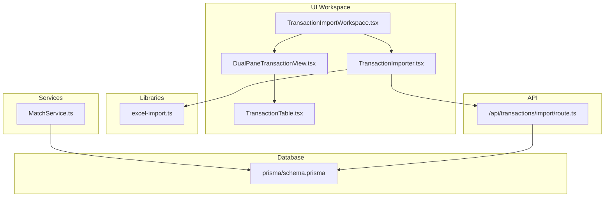
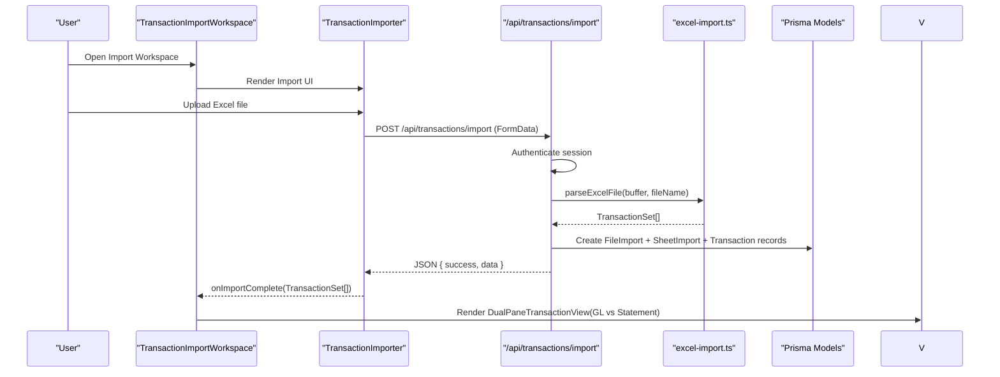
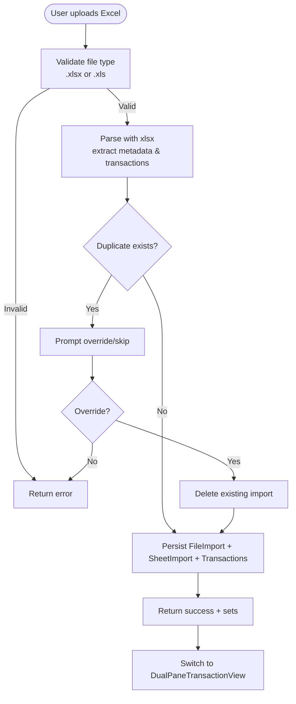
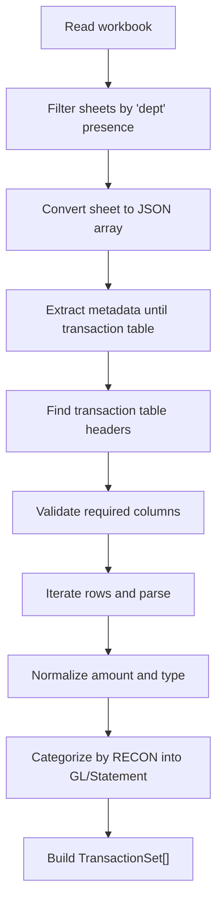
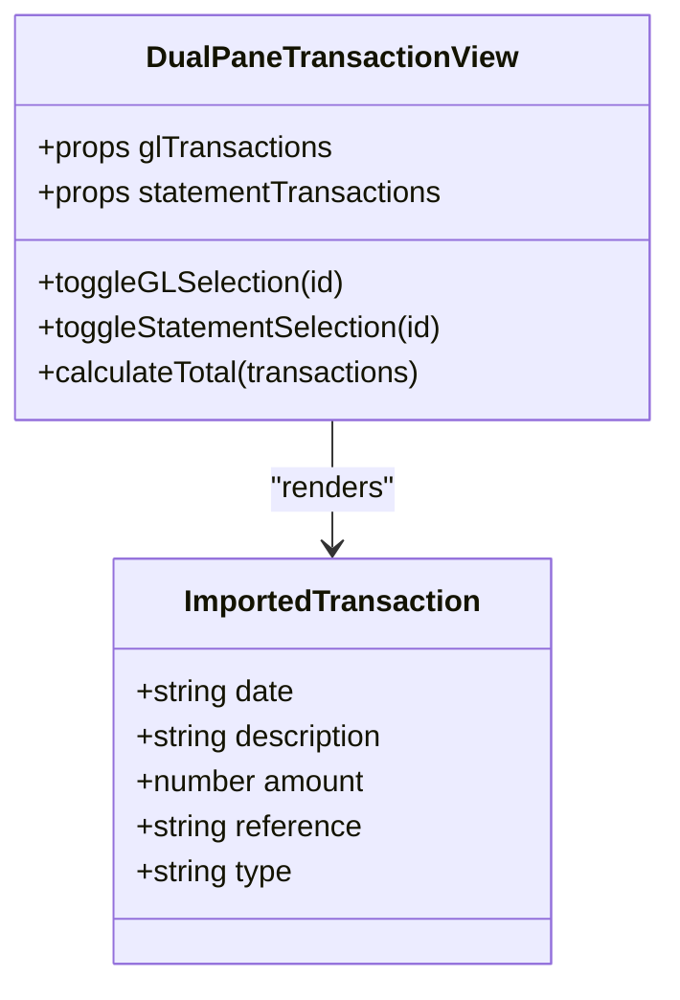
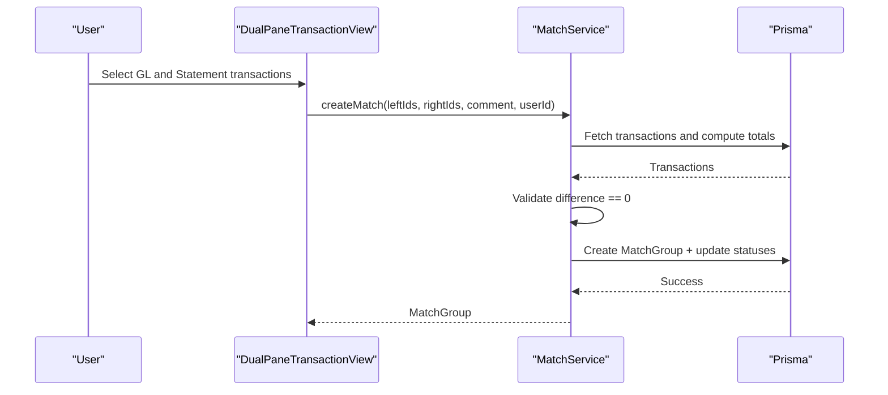
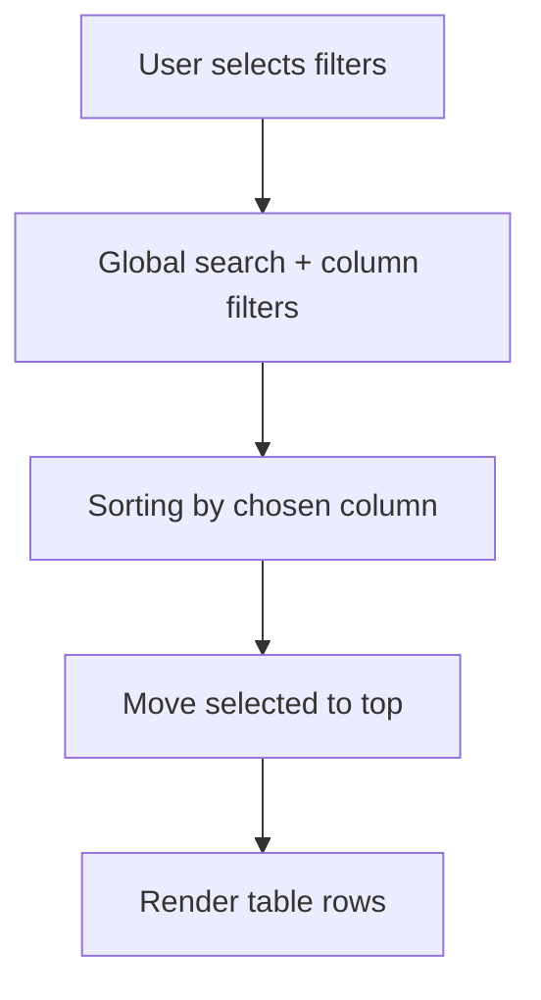
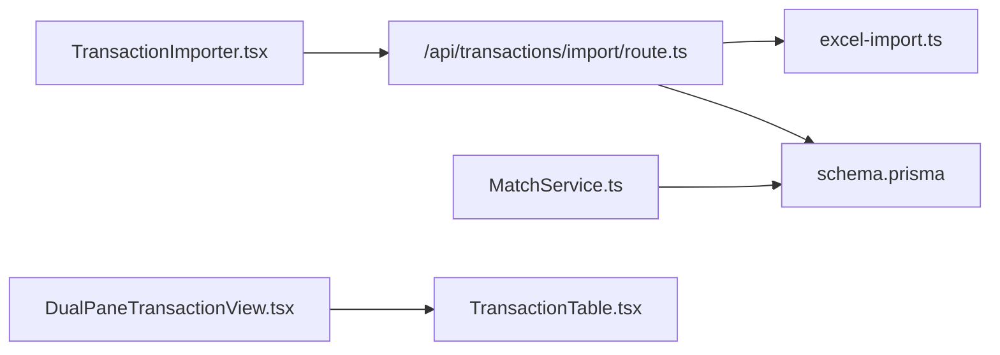

# Transaction Management

<cite>
**Referenced Files in This Document**
- [TransactionImportWorkspace.tsx](file://components/TransactionImportWorkspace.tsx)
- [TransactionImporter.tsx](file://components/TransactionImporter.tsx)
- [DualPaneTransactionView.tsx](file://components/DualPaneTransactionView.tsx)
- [TransactionTable.tsx](file://components/TransactionTable.tsx)
- [excel-import.ts](file://lib/excel-import.ts)
- [route.ts](file://app/api/transactions/import/route.ts)
- [MatchService.ts](file://services/MatchService.ts)
- [TRANSACTION_IMPORT_GUIDE.md](file://docs/TRANSACTION_IMPORT_GUIDE.md)
- [schema.prisma](file://prisma/schema.prisma)
- [ReconcileProApp.tsx](file://components/ReconcileProApp.tsx)
</cite>

## Table of Contents
1. [Introduction](#introduction)
2. [Project Structure](#project-structure)
3. [Core Components](#core-components)
4. [Architecture Overview](#architecture-overview)
5. [Detailed Component Analysis](#detailed-component-analysis)
6. [Dependency Analysis](#dependency-analysis)
7. [Performance Considerations](#performance-considerations)
8. [Troubleshooting Guide](#troubleshooting-guide)
9. [Conclusion](#conclusion)

## Introduction
This section documents the end-to-end transaction management workflow in the analyzer-web application. It covers how Excel files are uploaded and parsed, how imported data is mapped and stored, how the dual-pane reconciliation interface enables side-by-side comparison of internal and external transactions, and how matching is performed. It also outlines usage patterns for filtering, searching, and bulk operations, along with practical examples of data transformation and validation prior to persistence. Finally, it addresses common issues and performance considerations for large datasets.

## Project Structure
The transaction management feature spans UI components, a server-side import pipeline, and backend services. The main entry point is the workspace that orchestrates the importer and the dual-pane view.

**Diagram sources**
- [TransactionImportWorkspace.tsx](file://components/TransactionImportWorkspace.tsx#L1-L119)
- [TransactionImporter.tsx](file://components/TransactionImporter.tsx#L1-L394)
- [DualPaneTransactionView.tsx](file://components/DualPaneTransactionView.tsx#L1-L290)
- [TransactionTable.tsx](file://components/TransactionTable.tsx#L1-L503)
- [excel-import.ts](file://lib/excel-import.ts#L1-L327)
- [route.ts](file://app/api/transactions/import/route.ts#L1-L264)
- [MatchService.ts](file://services/MatchService.ts#L1-L173)
- [schema.prisma](file://prisma/schema.prisma#L1-L374)

**Section sources**
- [TransactionImportWorkspace.tsx](file://components/TransactionImportWorkspace.tsx#L1-L119)
- [TransactionImporter.tsx](file://components/TransactionImporter.tsx#L1-L394)
- [DualPaneTransactionView.tsx](file://components/DualPaneTransactionView.tsx#L1-L290)
- [excel-import.ts](file://lib/excel-import.ts#L1-L327)
- [route.ts](file://app/api/transactions/import/route.ts#L1-L264)
- [MatchService.ts](file://services/MatchService.ts#L1-L173)
- [schema.prisma](file://prisma/schema.prisma#L1-L374)

## Core Components
- TransactionImportWorkspace: Orchestrates the import workflow and switches to the dual-pane view upon successful import.
- TransactionImporter: Provides drag-and-drop upload, duplicate detection, and selection of transaction sets.
- excel-import: Parses Excel files using xlsx, validates sheets, extracts metadata, and builds TransactionSet collections.
- Import API route: Authenticates, validates file types, detects duplicates, parses Excel, persists to database, and returns structured results.
- DualPaneTransactionView: Renders GL and Statement transactions side-by-side with selection and totals.
- TransactionTable: Provides advanced filtering, sorting, and bulk operations for transaction sets.
- MatchService: Manages match groups, enforces strict zero-difference matching, and updates transaction statuses.
- Database schema: Defines Transaction, FileImport, SheetImport, and MatchGroup models with indexes and relationships.

**Section sources**
- [TransactionImportWorkspace.tsx](file://components/TransactionImportWorkspace.tsx#L1-L119)
- [TransactionImporter.tsx](file://components/TransactionImporter.tsx#L1-L394)
- [excel-import.ts](file://lib/excel-import.ts#L1-L327)
- [route.ts](file://app/api/transactions/import/route.ts#L1-L264)
- [DualPaneTransactionView.tsx](file://components/DualPaneTransactionView.tsx#L1-L290)
- [TransactionTable.tsx](file://components/TransactionTable.tsx#L1-L503)
- [MatchService.ts](file://services/MatchService.ts#L1-L173)
- [schema.prisma](file://prisma/schema.prisma#L1-L374)

## Architecture Overview
The system follows a layered architecture:
- UI layer: Workspace and views manage user interactions.
- Import pipeline: Frontend triggers the import API, which validates and parses Excel, then persists to the database.
- Matching service: Enforces strict matching rules and updates statuses.
- Data access: Prisma models define the schema and relationships.

**Diagram sources**
- [TransactionImportWorkspace.tsx](file://components/TransactionImportWorkspace.tsx#L1-L119)
- [TransactionImporter.tsx](file://components/TransactionImporter.tsx#L1-L394)
- [route.ts](file://app/api/transactions/import/route.ts#L1-L264)
- [excel-import.ts](file://lib/excel-import.ts#L1-L327)
- [schema.prisma](file://prisma/schema.prisma#L1-L374)

## Detailed Component Analysis

### End-to-End Import Workflow
- Upload and validation: The importer accepts .xlsx/.xls files, triggers the import API, and handles duplicate detection prompts.
- Parsing: The API reads the file buffer, generates a file hash, checks for duplicates, and delegates parsing to the shared library.
- Mapping and storage: The library identifies account sheets, extracts metadata, and constructs TransactionSet objects. The API persists FileImport, SheetImport, and Transaction records.
- UI feedback: On success, the workspace switches to the dual-pane view and displays GL vs Statement transactions.

**Diagram sources**
- [TransactionImporter.tsx](file://components/TransactionImporter.tsx#L1-L394)
- [route.ts](file://app/api/transactions/import/route.ts#L1-L264)
- [excel-import.ts](file://lib/excel-import.ts#L1-L327)
- [schema.prisma](file://prisma/schema.prisma#L1-L374)

**Section sources**
- [TransactionImporter.tsx](file://components/TransactionImporter.tsx#L1-L394)
- [route.ts](file://app/api/transactions/import/route.ts#L1-L264)
- [excel-import.ts](file://lib/excel-import.ts#L1-L327)
- [schema.prisma](file://prisma/schema.prisma#L1-L374)

### Excel Parsing and Mapping
- Sheet filtering: Only sheets containing “dept” in the first 10 rows are considered account sheets.
- Metadata extraction: Scans header-like rows to capture fields such as REPORTING DATE, GENERAL LEDGER NAME, and others.
- Transaction table detection: Locates the first row with required headers (e.g., SN, DATE, DESCRIPTION, RECON) and parses rows accordingly.
- Column mapping: Extracts date, description, amount, reference, aging, and type; normalizes amounts and types; categorizes into GL or Statement sides.
- Output: Produces TransactionSet arrays grouped by internal credit/debit and external debit/credit.

**Diagram sources**
- [excel-import.ts](file://lib/excel-import.ts#L1-L327)

**Section sources**
- [excel-import.ts](file://lib/excel-import.ts#L1-L327)

### Dual-Pane Reconciliation Interface
- Side-by-side comparison: Left pane shows GL (INT CR/INT DR), right pane shows Statement (EXT DR/EXT CR).
- Selection and totals: Users can toggle selections, with totals computed per pane and per sub-type.
- Visual indicators: Color-coded badges and currency formatting improve readability.
- Interaction: A floating “Match Selected” button appears when both sides have selections.

**Diagram sources**
- [DualPaneTransactionView.tsx](file://components/DualPaneTransactionView.tsx#L1-L290)

**Section sources**
- [DualPaneTransactionView.tsx](file://components/DualPaneTransactionView.tsx#L1-L290)

### Matching Capabilities
- Strict zero-difference matching: The service computes totals for selected left and right transactions and rejects non-zero differences.
- Atomic transaction updates: Matching occurs inside a database transaction to ensure consistency.
- Status updates: Matching transitions transactions from UNMATCHED to MATCHED and associates a match group.
- Approval workflow: The service supports approving and unmatching match groups, with audit trail integration.

**Diagram sources**
- [MatchService.ts](file://services/MatchService.ts#L1-L173)
- [schema.prisma](file://prisma/schema.prisma#L1-L374)

**Section sources**
- [MatchService.ts](file://services/MatchService.ts#L1-L173)
- [schema.prisma](file://prisma/schema.prisma#L1-L374)

### Filtering, Searching, and Bulk Operations
- Filtering and search: The TransactionTable supports global search across key fields and column-specific filters.
- Sorting: Click column headers to cycle through ascending, descending, and unsorted states.
- Bulk operations: The ReconcileProApp demonstrates batch unmatch and batch approval workflows, with separation of duties and period locks.

**Diagram sources**
- [TransactionTable.tsx](file://components/TransactionTable.tsx#L1-L503)
- [ReconcileProApp.tsx](file://components/ReconcileProApp.tsx#L1-L800)

**Section sources**
- [TransactionTable.tsx](file://components/TransactionTable.tsx#L1-L503)
- [ReconcileProApp.tsx](file://components/ReconcileProApp.tsx#L1-L800)

### Practical Examples of Transformation and Validation
- Amount normalization: Amounts are extracted and normalized; zeros are skipped to avoid invalid entries.
- Type inference: Types are derived from the RECON column and mapped to internal/external categories.
- Date handling: Dates are preserved as strings; ensure consistent formatting before persistence.
- Deduplication: File hashes and filenames are used to detect duplicates; override behavior is supported.
- Persistence: Transactions are batch-created with side and status fields set appropriately.

**Section sources**
- [excel-import.ts](file://lib/excel-import.ts#L1-L327)
- [route.ts](file://app/api/transactions/import/route.ts#L1-L264)

## Dependency Analysis
- UI depends on shared parsing utilities and the import API.
- Import API depends on xlsx for parsing and Prisma for persistence.
- MatchService encapsulates matching logic and database transactions.
- Database schema defines relationships among FileImport, SheetImport, Transaction, and MatchGroup.

**Diagram sources**
- [TransactionImporter.tsx](file://components/TransactionImporter.tsx#L1-L394)
- [route.ts](file://app/api/transactions/import/route.ts#L1-L264)
- [excel-import.ts](file://lib/excel-import.ts#L1-L327)
- [schema.prisma](file://prisma/schema.prisma#L1-L374)
- [MatchService.ts](file://services/MatchService.ts#L1-L173)
- [DualPaneTransactionView.tsx](file://components/DualPaneTransactionView.tsx#L1-L290)
- [TransactionTable.tsx](file://components/TransactionTable.tsx#L1-L503)

**Section sources**
- [schema.prisma](file://prisma/schema.prisma#L1-L374)

## Performance Considerations
- Large file handling: Recommended file size limit and transaction count thresholds are documented in the import guide.
- Memory efficiency: The parser uses buffered reads and avoids unnecessary in-memory copies.
- UI responsiveness: Virtualized rendering is suggested for large transaction tables to reduce DOM overhead.
- Database batching: The import API uses batch inserts for transactions to minimize round-trips.

**Section sources**
- [TRANSACTION_IMPORT_GUIDE.md](file://docs/TRANSACTION_IMPORT_GUIDE.md#L400-L406)
- [route.ts](file://app/api/transactions/import/route.ts#L1-L264)

## Troubleshooting Guide
Common issues and resolutions:
- Malformed Excel files: Ensure the file is a valid .xlsx or .xls and contains at least one sheet with “dept” in the first 10 rows.
- Missing required columns: The parser requires headers such as SN, DATE, DESCRIPTION, and RECON; missing columns cause parsing to skip rows.
- Date format inconsistencies: The parser preserves dates as strings; ensure consistent formatting in the source file.
- Duplicate detection: If a file or checksum already exists, the API returns a conflict response; use override to replace existing data.
- Large file handling: Exceeding recommended limits may cause timeouts; split files or adjust server configuration.

**Section sources**
- [route.ts](file://app/api/transactions/import/route.ts#L1-L264)
- [excel-import.ts](file://lib/excel-import.ts#L1-L327)
- [TRANSACTION_IMPORT_GUIDE.md](file://docs/TRANSACTION_IMPORT_GUIDE.md#L354-L406)

## Conclusion
The transaction management system provides a robust pipeline from Excel upload to reconciliation and matching. The UI offers intuitive dual-pane comparison and powerful filtering/searching, while the backend enforces strict matching rules and maintains auditability. By following the outlined workflows and best practices, teams can reliably import, reconcile, and manage financial transactions at scale.