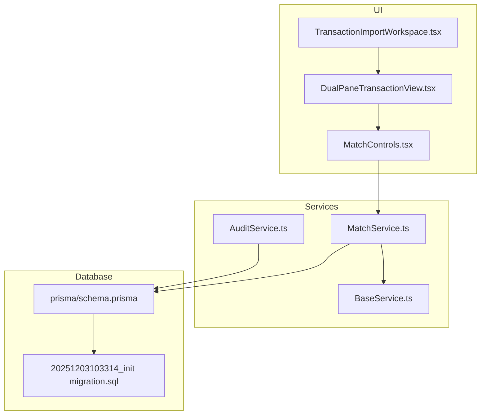
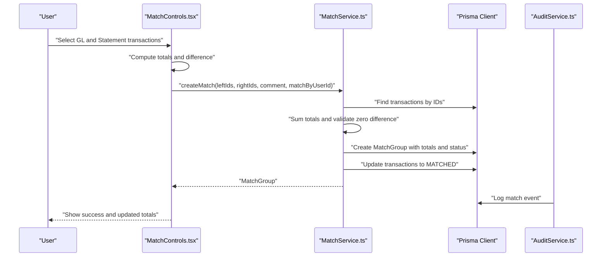
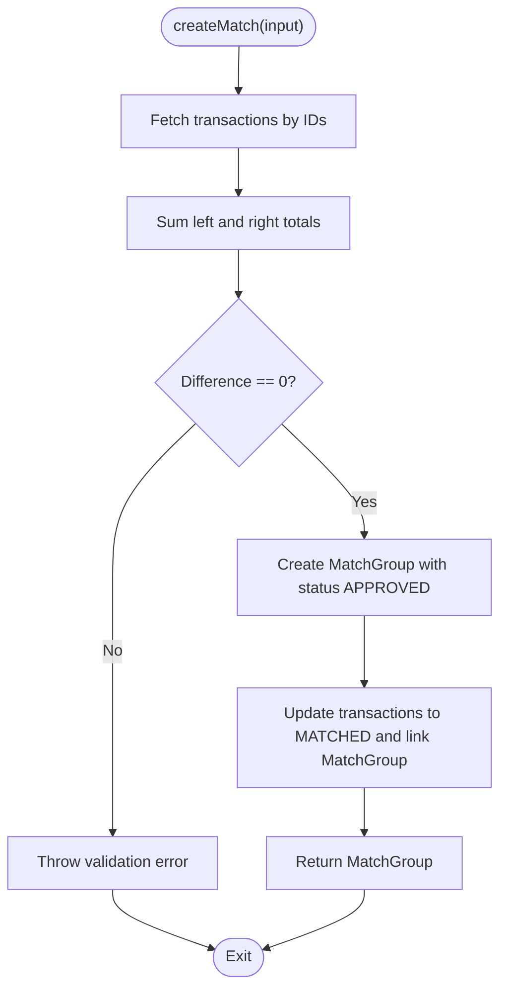
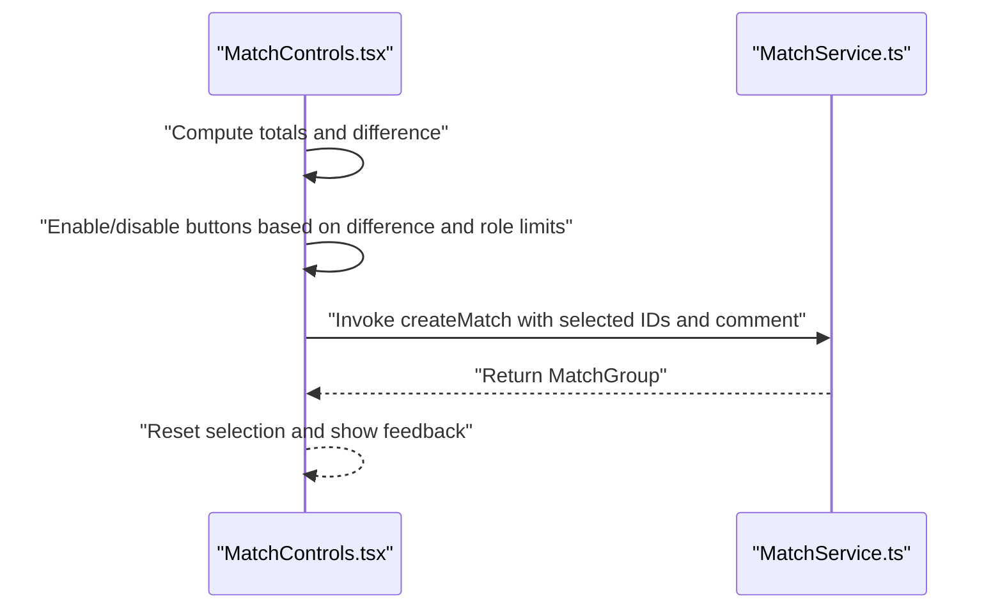
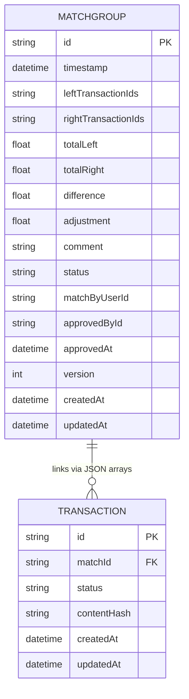
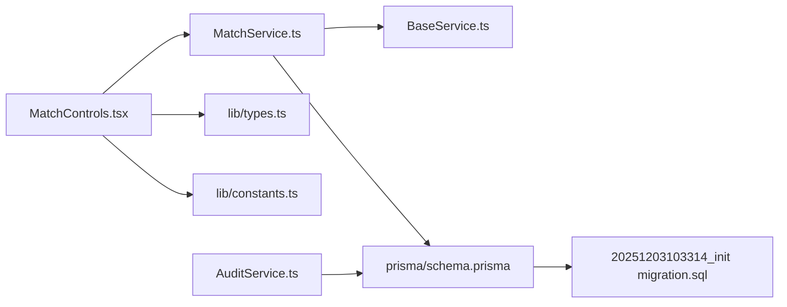

# Transaction Matching Logic

<cite>
**Referenced Files in This Document**
- [MatchService.ts](file://services/MatchService.ts)
- [BaseService.ts](file://services/BaseService.ts)
- [MatchControls.tsx](file://components/MatchControls.tsx)
- [DualPaneTransactionView.tsx](file://components/DualPaneTransactionView.tsx)
- [TransactionImportWorkspace.tsx](file://components/TransactionImportWorkspace.tsx)
- [TRANSACTION_IMPORT_GUIDE.md](file://docs/TRANSACTION_IMPORT_GUIDE.md)
- [AuditService.ts](file://services/AuditService.ts)
- [constants.ts](file://lib/constants.ts)
- [types.ts](file://lib/types.ts)
- [schema.prisma](file://prisma/schema.prisma)
- [20251203103314_init migration.sql](file://prisma/migrations/20251203103314_init/migration.sql)
- [FEATURE_ENHANCEMENTS_SUMMARY.md](file://docs/FEATURE_ENHANCEMENTS_SUMMARY.md)
</cite>

## Table of Contents
1. [Introduction](#introduction)
2. [Project Structure](#project-structure)
3. [Core Components](#core-components)
4. [Architecture Overview](#architecture-overview)
5. [Detailed Component Analysis](#detailed-component-analysis)
6. [Dependency Analysis](#dependency-analysis)
7. [Performance Considerations](#performance-considerations)
8. [Troubleshooting Guide](#troubleshooting-guide)
9. [Conclusion](#conclusion)
10. [Appendices](#appendices)

## Introduction
This document explains the transaction matching logic implemented by MatchService.ts and how it integrates with the dual-pane UI to reconcile internal (GL) and external (Statement) transactions. It covers the strict 1-to-1 matching behavior, the domain model for MatchGroup entities, status tracking, and audit trail generation. It also outlines future enhancements described in TRANSACTION_IMPORT_GUIDE.md, common issues such as partial matches and reconciliation balance validation, and guidance for extending the matching engine with custom business rules and integrating with the database for persistence.

## Project Structure
The matching workflow spans UI controls, a service layer, and the database schema:
- UI captures user selections and invokes matching actions
- MatchService orchestrates match creation, approvals, and unmatching
- Prisma schema defines MatchGroup and Transaction entities and their relationships
- AuditService provides audit logging for match operations

**Diagram sources**
- [MatchControls.tsx](file://components/MatchControls.tsx#L1-L125)
- [DualPaneTransactionView.tsx](file://components/DualPaneTransactionView.tsx#L1-L290)
- [TransactionImportWorkspace.tsx](file://components/TransactionImportWorkspace.tsx#L1-L119)
- [BaseService.ts](file://services/BaseService.ts#L1-L20)
- [MatchService.ts](file://services/MatchService.ts#L1-L173)
- [AuditService.ts](file://services/AuditService.ts#L1-L45)
- [schema.prisma](file://prisma/schema.prisma#L75-L121)
- [20251203103314_init migration.sql](file://prisma/migrations/20251203103314_init/migration.sql#L42-L62)

**Section sources**
- [MatchService.ts](file://services/MatchService.ts#L1-L173)
- [MatchControls.tsx](file://components/MatchControls.tsx#L1-L125)
- [DualPaneTransactionView.tsx](file://components/DualPaneTransactionView.tsx#L1-L290)
- [TransactionImportWorkspace.tsx](file://components/TransactionImportWorkspace.tsx#L1-L119)
- [schema.prisma](file://prisma/schema.prisma#L75-L121)
- [20251203103314_init migration.sql](file://prisma/migrations/20251203103314_init/migration.sql#L42-L62)

## Core Components
- MatchService: Implements strict matching with zero difference, creates MatchGroup entries, updates transaction statuses, and supports approval and unmatching.
- MatchControls: Presents selection totals, difference indicator, and a “Match Selected” action based on UI selections.
- DualPaneTransactionView: Provides the dual-pane display and selection mechanics for GL and Statement transactions.
- AuditService: Provides audit logging infrastructure for match-related actions.
- Prisma schema and migration: Define MatchGroup and Transaction entities, indexes, and foreign keys.

Key behaviors:
- Strict matching enforces zero difference between left and right totals.
- MatchGroup stores JSON arrays of transaction IDs and status.
- Transaction statuses are updated to MATCHED upon successful match.
- Approval workflow is simplified to automatic approval for strict matches.

**Section sources**
- [MatchService.ts](file://services/MatchService.ts#L1-L173)
- [MatchControls.tsx](file://components/MatchControls.tsx#L1-L125)
- [DualPaneTransactionView.tsx](file://components/DualPaneTransactionView.tsx#L1-L290)
- [AuditService.ts](file://services/AuditService.ts#L1-L45)
- [schema.prisma](file://prisma/schema.prisma#L75-L121)
- [20251203103314_init migration.sql](file://prisma/migrations/20251203103314_init/migration.sql#L42-L62)

## Architecture Overview
The matching architecture follows a layered approach:
- UI layer captures selections and triggers actions
- Service layer validates and persists match data
- Database layer stores MatchGroup and Transaction records with relationships

**Diagram sources**
- [MatchControls.tsx](file://components/MatchControls.tsx#L1-L125)
- [MatchService.ts](file://services/MatchService.ts#L1-L173)
- [AuditService.ts](file://services/AuditService.ts#L1-L45)

## Detailed Component Analysis

### MatchService: Matching Logic and Persistence
MatchService implements:
- Input validation: accepts arrays of transaction IDs for left and right sides
- Balance validation: computes totals and enforces zero difference
- Match creation: persists MatchGroup with totals, difference, and status
- Transaction updates: marks selected transactions as MATCHED and links them to the MatchGroup
- Approval and unmatching: updates status and deletes MatchGroup while restoring transaction statuses

**Diagram sources**
- [MatchService.ts](file://services/MatchService.ts#L1-L82)

**Section sources**
- [MatchService.ts](file://services/MatchService.ts#L1-L173)

### MatchControls: Capturing User Selections and Invoking MatchService
MatchControls:
- Aggregates selected GL and Statement transactions
- Computes totals and difference
- Displays difference with auto-writeoff hint when below threshold
- Enables “Match Selected” action when difference is zero
- Integrates with user roles and adjustment limits

**Diagram sources**
- [MatchControls.tsx](file://components/MatchControls.tsx#L1-L125)
- [MatchService.ts](file://services/MatchService.ts#L1-L82)
- [constants.ts](file://lib/constants.ts#L1-L50)

**Section sources**
- [MatchControls.tsx](file://components/MatchControls.tsx#L1-L125)
- [constants.ts](file://lib/constants.ts#L1-L50)

### DualPaneTransactionView: Selection and Display
DualPaneTransactionView:
- Renders GL and Statement transactions in two panes
- Manages selection state for both sides
- Calculates totals per pane and selection counts
- Provides a floating “Match Selected” trigger when selections exist

Note: The floating button currently logs selections and includes a TODO for implementation. The actual invocation of MatchService is not yet wired here.

**Section sources**
- [DualPaneTransactionView.tsx](file://components/DualPaneTransactionView.tsx#L1-L290)

### Domain Model: MatchGroup and Transaction Entities
MatchGroup domain model:
- Identifier, timestamps, and JSON arrays of transaction IDs
- Totals for left/right and difference
- Optional adjustment, comment, and status
- Audit trail fields: matchByUserId, approvedById, approvedAt, version

Transaction domain model:
- Fields for Excel import plus legacy compatibility
- Status enum with UNMATCHED and MATCHED
- Relationship to MatchGroup via matchId

**Diagram sources**
- [schema.prisma](file://prisma/schema.prisma#L75-L121)
- [20251203103314_init migration.sql](file://prisma/migrations/20251203103314_init/migration.sql#L42-L62)

**Section sources**
- [schema.prisma](file://prisma/schema.prisma#L75-L121)
- [20251203103314_init migration.sql](file://prisma/migrations/20251203103314_init/migration.sql#L42-L62)
- [types.ts](file://lib/types.ts#L41-L76)

### Status Tracking and Audit Trail
Status lifecycle:
- Match creation: status set to APPROVED (strict matching)
- Approval: status remains APPROVED; version incremented
- Unmatching: transactions revert to UNMATCHED and MatchGroup deleted

Audit trail:
- AuditService supports creating audit logs with action types and entity metadata
- Integration points exist to log match events during create/approve/unmatch operations

**Section sources**
- [MatchService.ts](file://services/MatchService.ts#L88-L173)
- [AuditService.ts](file://services/AuditService.ts#L1-L45)

### Future Enhancements and Matching Algorithms
TRANSACTION_IMPORT_GUIDE.md outlines planned enhancements:
- Matching logic implementation connecting to the existing match service
- Advanced filtering, bulk operations, import history, validation rules, and database integration

These indicate that the current strict matching is a baseline, with richer matching algorithms (e.g., tolerance-based, partial matching, duplicate detection) planned for future phases.

**Section sources**
- [TRANSACTION_IMPORT_GUIDE.md](file://docs/TRANSACTION_IMPORT_GUIDE.md#L315-L353)

## Dependency Analysis
- MatchService depends on BaseService for transactions and error handling
- MatchControls depends on constants for role-based thresholds and adjustment limits
- UI components depend on types for Transaction and MatchGroup
- Database schema defines relationships and indexes for efficient querying

**Diagram sources**
- [MatchControls.tsx](file://components/MatchControls.tsx#L1-L125)
- [MatchService.ts](file://services/MatchService.ts#L1-L173)
- [BaseService.ts](file://services/BaseService.ts#L1-L20)
- [schema.prisma](file://prisma/schema.prisma#L75-L121)
- [20251203103314_init migration.sql](file://prisma/migrations/20251203103314_init/migration.sql#L42-L62)
- [types.ts](file://lib/types.ts#L41-L76)
- [constants.ts](file://lib/constants.ts#L1-L50)
- [AuditService.ts](file://services/AuditService.ts#L1-L45)

**Section sources**
- [MatchService.ts](file://services/MatchService.ts#L1-L173)
- [MatchControls.tsx](file://components/MatchControls.tsx#L1-L125)
- [schema.prisma](file://prisma/schema.prisma#L75-L121)
- [20251203103314_init migration.sql](file://prisma/migrations/20251203103314_init/migration.sql#L42-L62)
- [types.ts](file://lib/types.ts#L41-L76)
- [constants.ts](file://lib/constants.ts#L1-L50)
- [AuditService.ts](file://services/AuditService.ts#L1-L45)

## Performance Considerations
- Strict matching reduces complexity and avoids iterative algorithms, minimizing computation overhead
- Batch operations: updateMany is used to efficiently update transaction statuses
- JSON arrays of IDs in MatchGroup enable flexible matching without complex joins
- Indexes on Transaction fields (status, matchId) improve query performance for reconciliation views
- For large datasets, consider pagination and virtualized lists in UI components
- Asynchronous processing: offload heavy computations to background jobs if needed, while keeping UI responsive

[No sources needed since this section provides general guidance]

## Troubleshooting Guide
Common issues and resolutions:
- Partial matches: Strict matching rejects non-zero differences; ensure totals are balanced before invoking match
- Duplicate detection: Use Transaction.contentHash and indexes to prevent duplicates during import and matching
- Reconciliation balance validation: Use MatchControls’ difference indicator to catch imbalances early
- Approval and unmatching: Verify status transitions and that transactions revert to UNMATCHED when unmatching

Integration tips:
- Use AuditService to log match events for traceability
- Validate role permissions before allowing match operations
- Ensure database migrations are applied to align schema with MatchGroup and Transaction models

**Section sources**
- [MatchService.ts](file://services/MatchService.ts#L1-L173)
- [MatchControls.tsx](file://components/MatchControls.tsx#L1-L125)
- [schema.prisma](file://prisma/schema.prisma#L75-L121)
- [20251203103314_init migration.sql](file://prisma/migrations/20251203103314_init/migration.sql#L42-L62)
- [AuditService.ts](file://services/AuditService.ts#L1-L45)

## Conclusion
MatchService implements a strict, zero-difference matching model suitable for exact reconciliations between internal and external transactions. The UI components capture selections and provide immediate feedback on totals and differences. The domain model and database schema support auditability and status tracking. Future enhancements outlined in TRANSACTION_IMPORT_GUIDE.md will expand matching capabilities, including tolerance-based matching and advanced validation rules.

[No sources needed since this section summarizes without analyzing specific files]

## Appendices

### Extending the Matching Engine with Custom Business Rules
- Add rule evaluation before createMatch to enforce custom constraints (e.g., date ranges, amount thresholds)
- Introduce adjustable tolerance and approval workflows for small differences
- Implement duplicate detection using contentHash and deduplication logic
- Integrate with AuditService to log rule violations and approvals

**Section sources**
- [MatchService.ts](file://services/MatchService.ts#L1-L82)
- [AuditService.ts](file://services/AuditService.ts#L1-L45)
- [TRANSACTION_IMPORT_GUIDE.md](file://docs/TRANSACTION_IMPORT_GUIDE.md#L315-L353)

### Integrating with the Database for Persistence
- MatchGroup schema includes JSON arrays of transaction IDs and audit fields
- Transaction schema includes matchId and contentHash for deduplication
- Apply migrations to ensure schema alignment

**Section sources**
- [schema.prisma](file://prisma/schema.prisma#L75-L121)
- [20251203103314_init migration.sql](file://prisma/migrations/20251203103314_init/migration.sql#L42-L62)

### Aligning UI with Matching Workflow
- Wire DualPaneTransactionView’s floating “Match Selected” button to invoke MatchService
- Use MatchControls to compute totals and differences and to collect comments
- Respect role-based adjustment limits and permission checks

**Section sources**
- [DualPaneTransactionView.tsx](file://components/DualPaneTransactionView.tsx#L268-L287)
- [MatchControls.tsx](file://components/MatchControls.tsx#L1-L125)
- [constants.ts](file://lib/constants.ts#L1-L50)