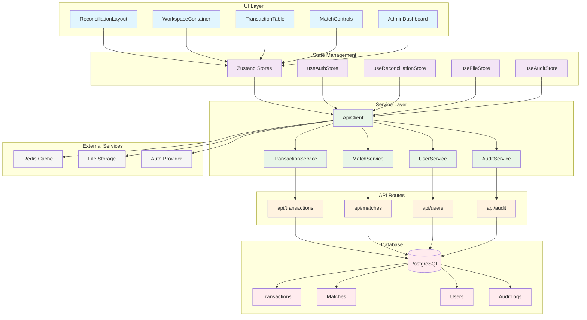

# Proposed Architecture Diagram



## Architecture Explanation

### Current Architecture Issues

- **Tight Coupling**: Components directly call APIs
- **State Scattering**: State managed across multiple custom hooks
- **No Abstraction**: Business logic mixed with UI logic
- **Testing Difficulty**: Hard to mock dependencies

### Proposed Architecture Benefits

#### 1. **Separation of Concerns**

- **UI Layer**: Pure presentation components
- **State Layer**: Centralized state management with Zustand
- **Service Layer**: Business logic and API abstraction
- **API Layer**: HTTP communication and data transformation
- **Database Layer**: Data persistence with proper ORM

#### 2. **Improved Testability**

- Each layer can be tested in isolation
- Easy mocking of services and API calls
- State stores can be tested independently

#### 3. **Better Maintainability**

- Clear boundaries between layers
- Single responsibility principle applied
- Easier to modify and extend functionality

#### 4. **Enhanced Performance**

- Efficient state updates with Zustand
- API response caching with React Query
- Optimized re-renders with proper memoization

#### 5. **Scalability**

- Service layer can be easily extended
- Database operations can be optimized independently
- Caching layer ready for Redis integration

## Data Flow

### Read Operation (Loading Transactions)

```
User Action → UI Component → Zustand Store → Service → API Route → Database → Service → Store → UI Update
```

### Write Operation (Creating Match)

```
User Action → UI Component → Store Action → Service → API Route → Database → Service → Store Update → UI Update
```

### Error Handling

```
Any Layer → Error Boundary → User Notification → Error Logging → Monitoring
```

## Migration Strategy

### Phase 1: Infrastructure Setup

1. Install Zustand, Zod, React Query
2. Create basic store structure
3. Set up API client skeleton

### Phase 2: Service Layer Implementation

1. Create service classes
2. Implement API client with error handling
3. Add input validation with Zod

### Phase 3: State Management Migration

1. Migrate existing hooks to Zustand stores
2. Update components to use new stores
3. Add server state integration

### Phase 4: Component Refactoring

1. Break down large components
2. Implement container/presentational pattern
3. Add proper error boundaries

### Phase 5: Testing & Optimization

1. Add comprehensive test coverage
2. Performance optimization
3. Documentation updates
